# 图的概念
顶点集，边集，顶点的个数=图 G 的阶，
有向图：入度出度
无向图：度

简单路径、回路

## 连通图，强连通图

非连通图最多边：
### 子图，生成子图（通用概念）

## 连通分量，强连通分量

### 生成树（无向图专用概念）

# 图的存储与操作
## 邻接矩阵

### A^2 

## 邻接表

## 十字链表

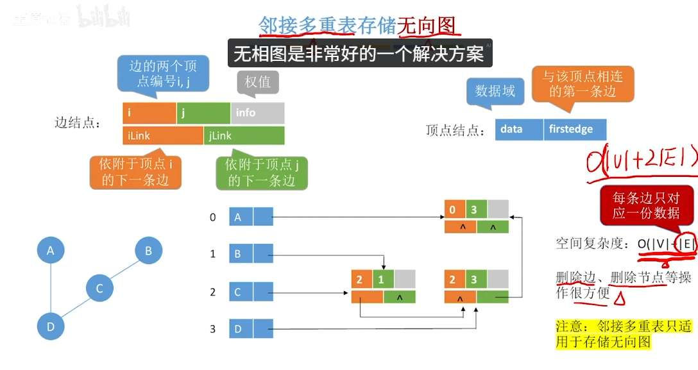
👉 **十字链表为有向图找入度而生。**
👉 **邻接多重表 为 无向图 删边而生。**

下面为你详细拆解：

#### 1. 十字链表 (Orthogonal List) —— 专治【有向图】
*   **痛点：** 普通的“邻接表”只记录出边（很容易找一条路通向哪），但如果我想知道**“谁指向了我”（找入度）**，必须把整个表遍历一遍，非常麻烦。如果弄个“逆邻接表”（只记录入边），找出发点又麻烦了。
*   **十字链表的绝招：合二为一！** 它把“邻接表”和“逆邻接表”揉在一起，像十字路口一样交叉。
*   **怎么记结构？看节点设计：**
    *   **边节点（弧节点）：** 一条有向边是从 A 射向 B。所以它需要存：
        1.  `tailvex` (弧尾/起点A)
        2.  `headvex` (弧头/终点B)
        3.  **核心指针 1 (`tlink`)：** 指向下一条**也是从 A 出发**的边。（这就串起了出度链表）
        4.  **核心指针 2 (`hlink`)：** 指向下一条**也是射向 B** 的边。（这就串起了入度链表）
    *   **顶点节点：** 既然边节点搞出了两条链，顶点节点自然要有两个头指针：一个管自己射出去的 (`firstout`)，一个管射向自己的 (`firstin`)。

#### 2. 邻接多重表 (Adjacency Multilist) —— 专治【无向图】
*   **痛点：** 在无向图的普通“邻接表”中，一条边（比如 A 连着 B）会被存**两次**！A 的链表里有个节点代表 B，B 的链表里有个节点代表 A。
    *   **浪费空间**不说，最要命的是**删除操作**：如果你想拆除 A 和 B 之间的路，你必须去 A 的链表里找一遍删掉，再去 B 的链表里找一遍删掉。太反人类了！
*   **邻接多重表的绝招：共享边节点！** 一条边就是一个物理实体，存在一次就够了，让 A 和 B 共同牵着它。
*   **怎么记结构？看节点设计：**
    *   **边节点：** 一条无向边连接 $i$ 和 $j$。它只需要存：
        1.  顶点 $i$ 的编号
        2.  顶点 $j$ 的编号
        3.  **核心指针 1 (`iLink`)：** 既然这条边连着 $i$，那么顺着这个指针，去寻找下一条**也连着 $i$** 的边。
        4.  **核心指针 2 (`jLink`)：** 同理，去寻找下一条**也连着 $j$** 的边。
    *   **顶点节点：** 只需要一个头指针 (`firstedge`)，指出去找第一条连着自己的边即可。

---

### 🌟 终极对比记忆卡片（建议截图保存）

| 特性          | 十字链表 (十字交叉)                    | 邻接多重表 (一物多用)                         |
| :---------- | :----------------------------- | :----------------------------------- |
| **适用对象**    | **有向图**                        | **无向图**                              |
| **解决的痛点**   | 找入度太慢                          | 一条边存两次，删边太麻烦                         |
| **边结点的要素**  | **起点, 终点** 同起点下一条边, 同终点下一条边 | **端点1, 端点2** 连着端点1的下一边, 连着端点2的下一边 |
| **顶点结点的要素** | 需要 **2 个**指针（入队头，出队头）          | 只需要 **1 个**指针（第一条依附边）                |
| **形象比喻**    | **编织一张网**：横向管出，纵向管入，节点在十字路口。   | **物理桥梁**：一座桥（边结点）两头                  |
## 对比
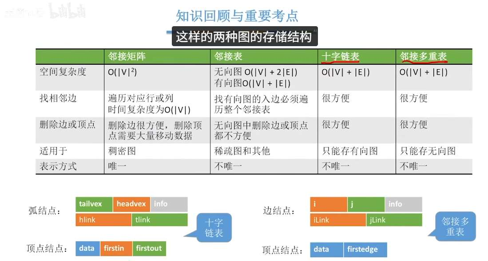

# 图的应用

## 最小生成树
- Prim 从一个顶点开始，选与它连接的最小权重边
	  实现算法：不断迭代 lowCost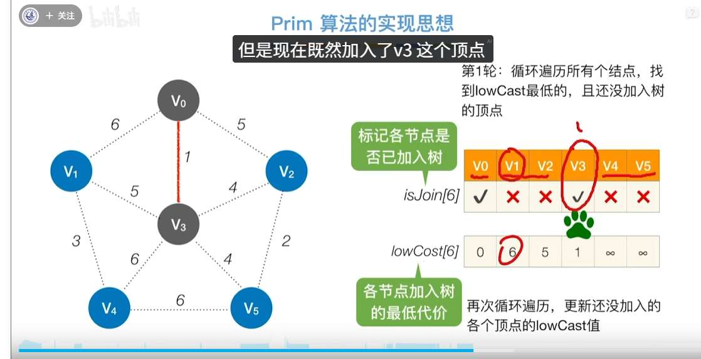
- Kruskal 是全局视角，选最小权值边
	  排序后遍历
	  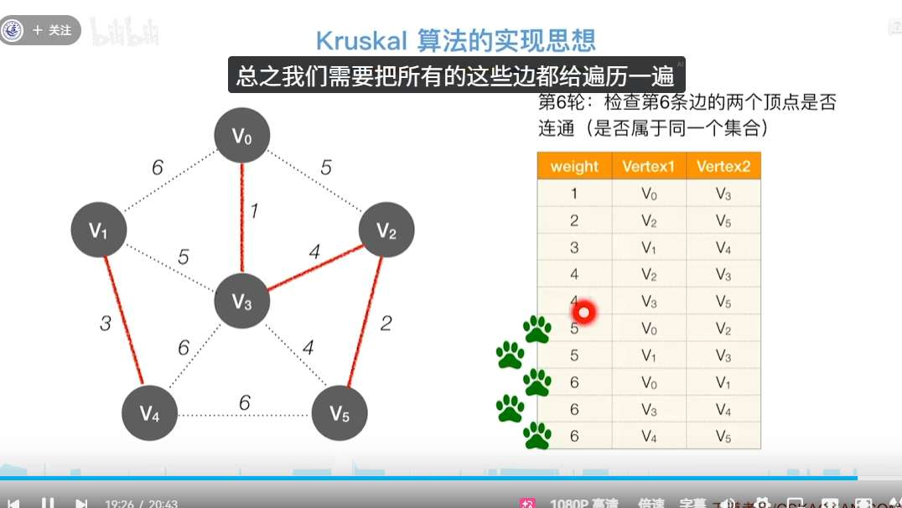

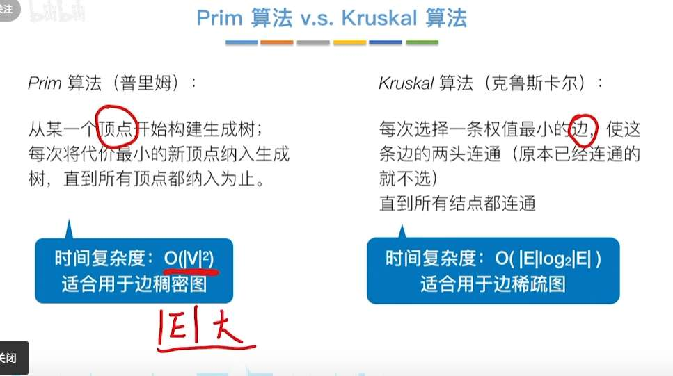

## 单源最短路径

无权图：
BFS：
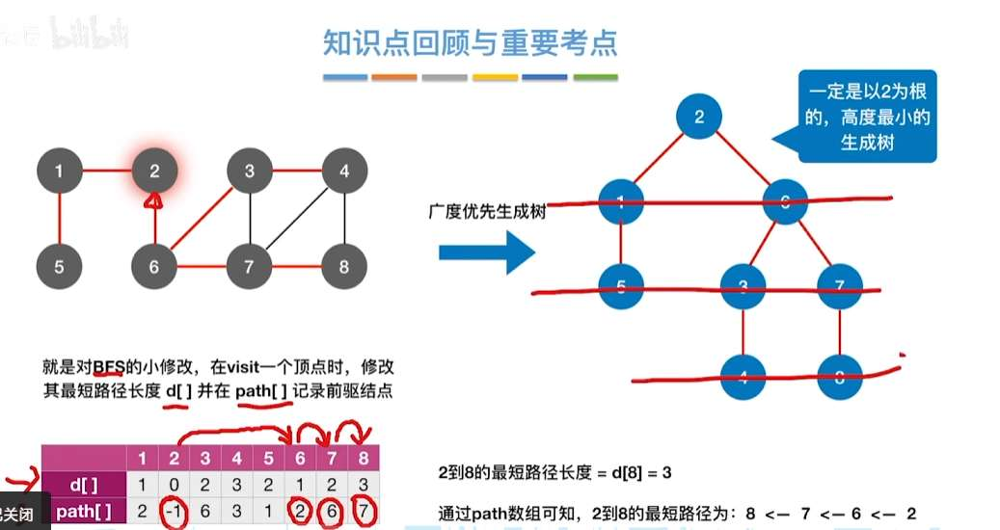

无权图，有权图：
Dijsktra

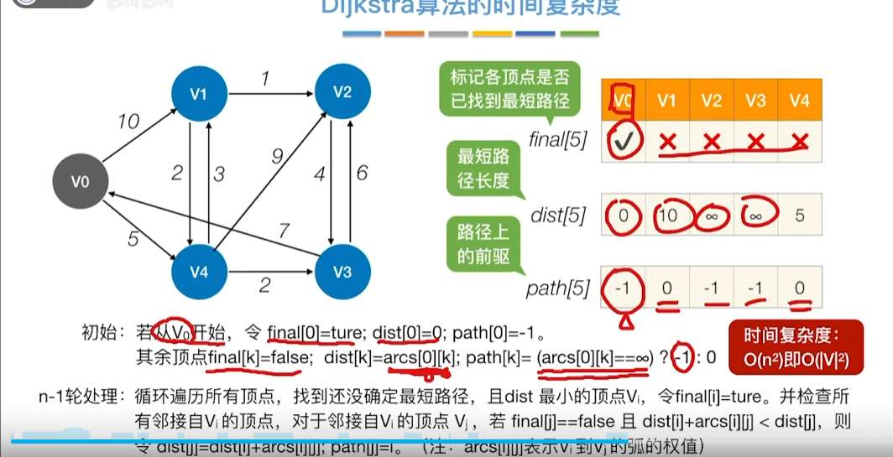

有缺陷
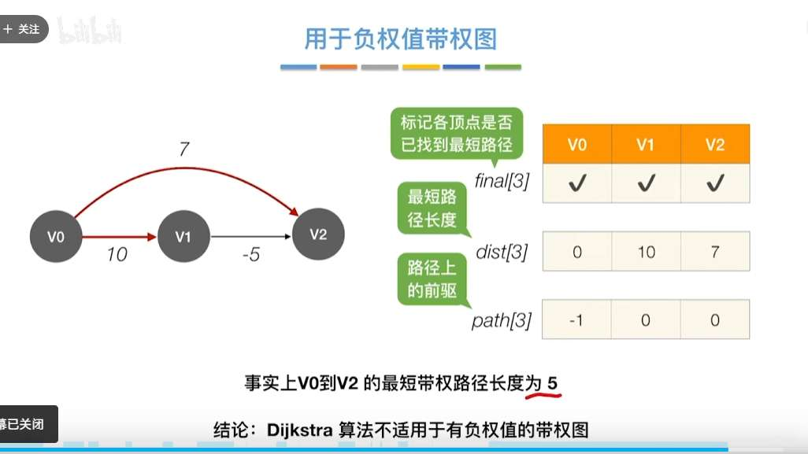

## 各顶点间最短路径
floyd
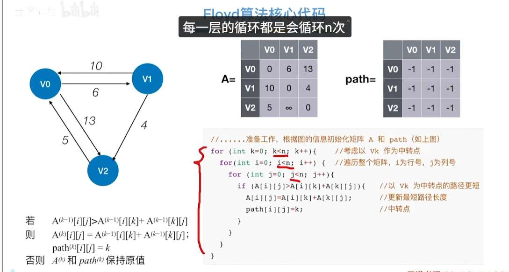

### 对比

# 有向无环图

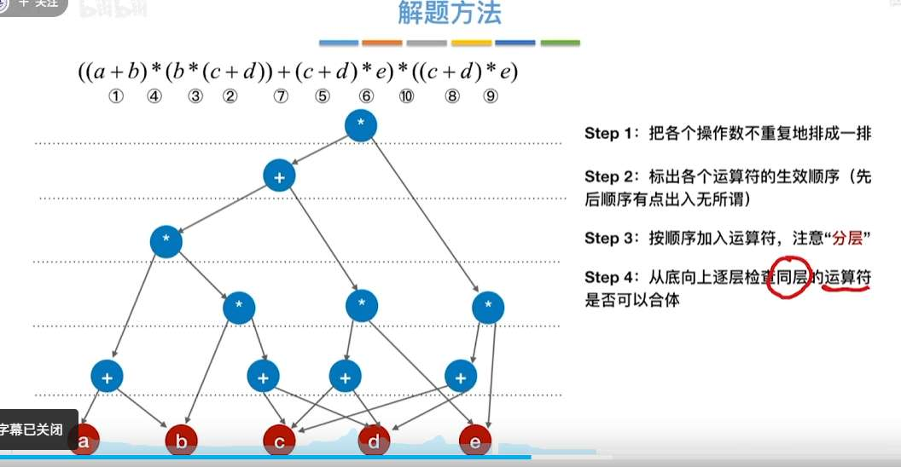
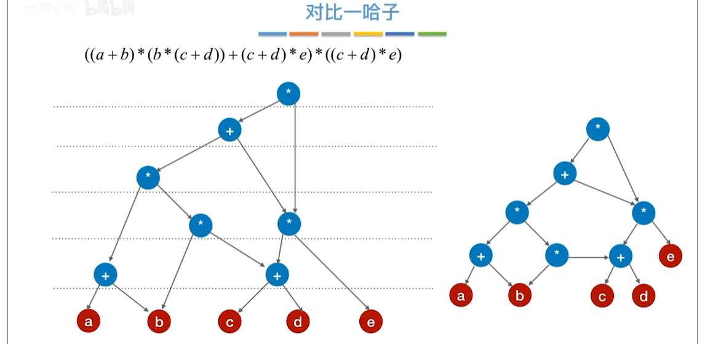

# 拓扑排序
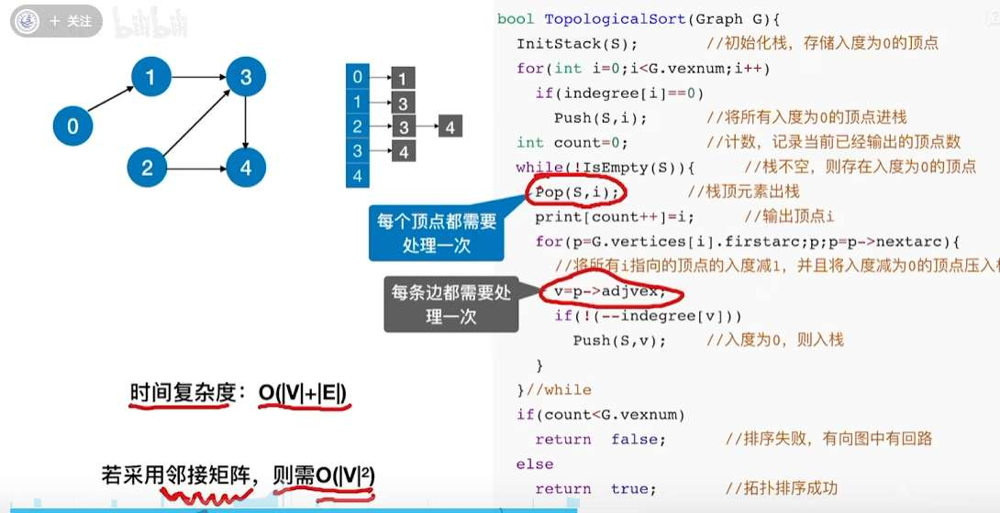

## 关键活动，路径
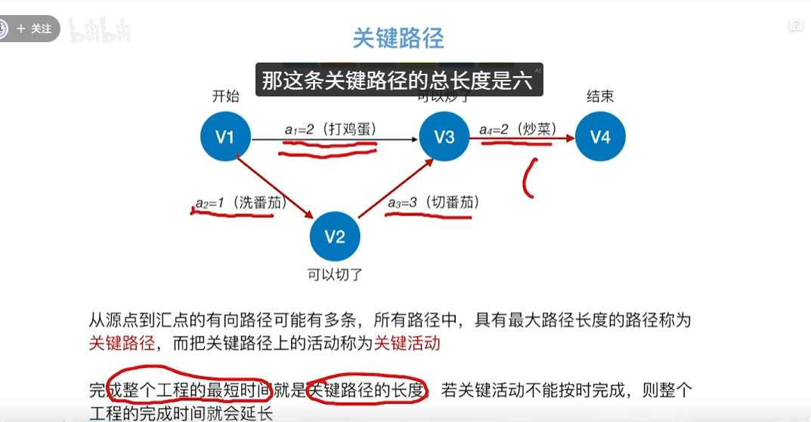
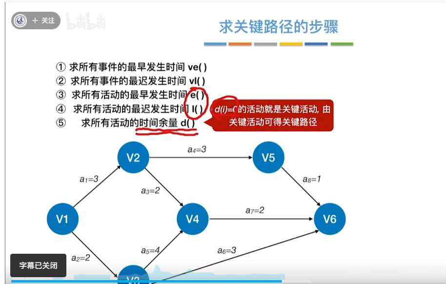
1. 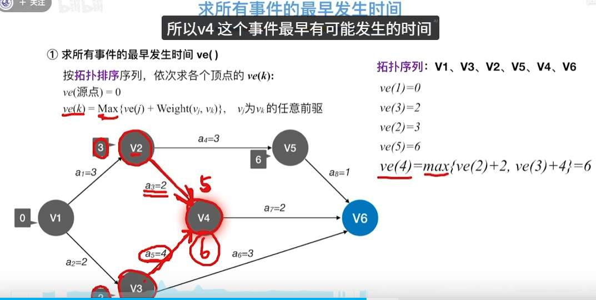
2. 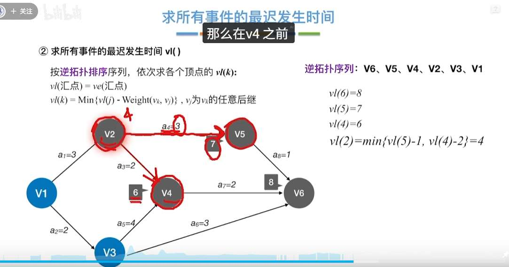
3. 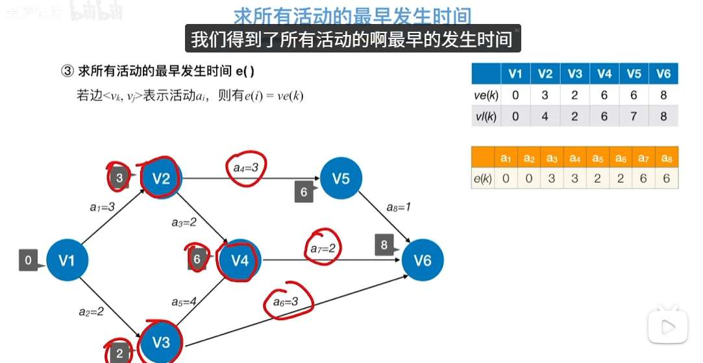
4. 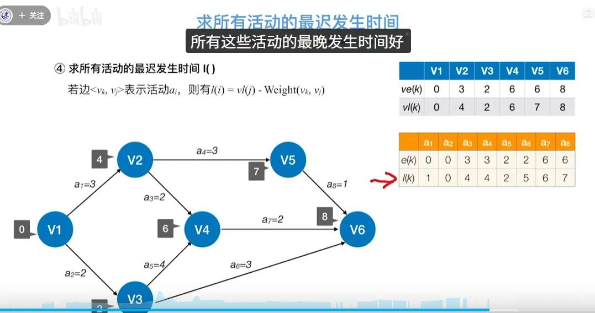
5. 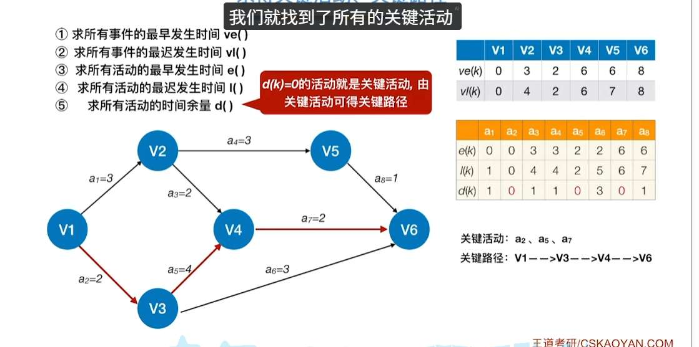