# 图的概念
1. D
2. B
3. C
4. C
5. ？
6. B
7. D
8. B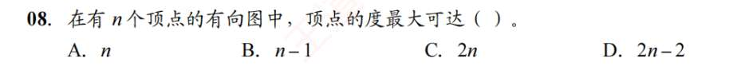
   **最大总度数** = 最大入度 + 最大出度 = $(n-1) + (n-1) = 2n-2$。
9. ？
    确保连通的最少边数 = $\frac{(n-1)(n-2)}{2} + 1 = \frac{5 \times 4}{2} + 1 = 11$
10. 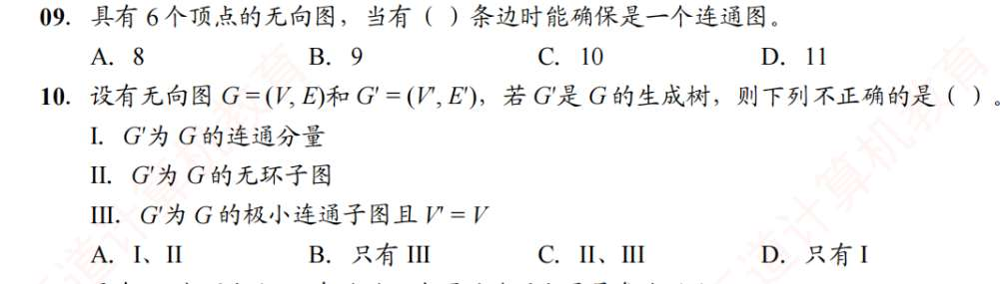
    连通分量要求是“**极大**”连通子图（包含该连通部分所有的点和边）。生成树虽然连通，但为了保持无环，它去掉了原图中多余的边，因此它不是极大的，不能叫连通分量。
    树的定义就是连通且无环的图，生成树作为子图，自然无环。
	 $G'$ 为 $G$ 的极小连通子图且 $V'=V$：**正确**。这是生成树的标准定义。包含全部顶点（$V'=V$），且边数最少（极小），只要再删掉任何一条边就会变得不连通。
11. 
    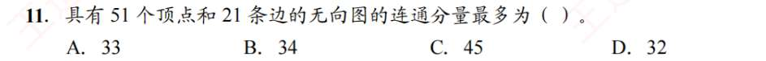
    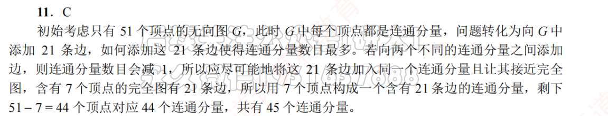
12. A
	注意观察谁只有出度/入度，就一定是单独一个强连通分量
13. B
14. D
    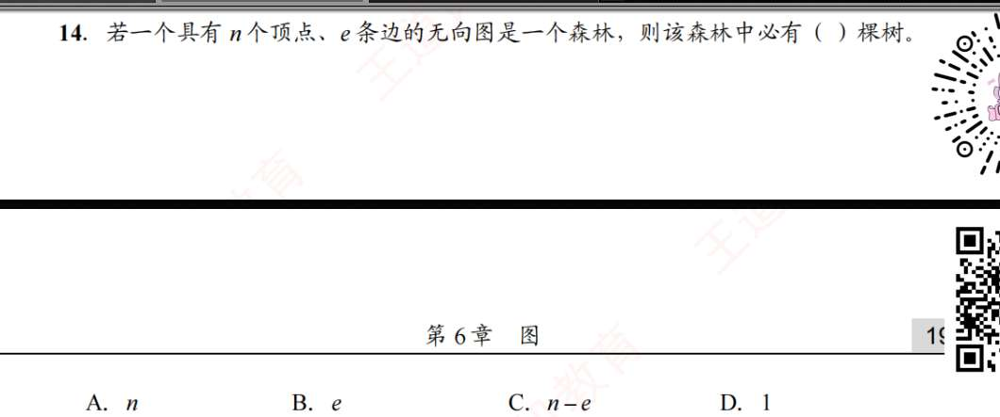
    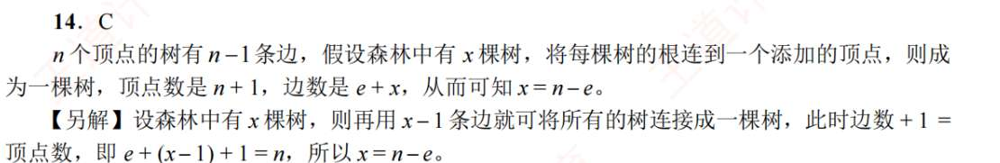
	    假设森林中有 $x$ 棵树，每棵树的顶点数分别是 $n_1, n_2, \dots, n_x$。
	*   根据树的性质：每棵树的边数等于它的顶点数减 1。
	*   第 1 棵树有 $e_1 = n_1 - 1$ 条边。
	*   第 2 棵树有 $e_2 = n_2 - 1$ 条边。
	*   ……
	*   第 $x$ 棵树有 $e_x = n_x - 1$ 条边。
	
	将所有树的边数加起来，就是森林的总边数 $e$：
	$$e = e_1 + e_2 + \dots + e_x$$
	$$e = (n_1 - 1) + (n_2 - 1) + \dots + (n_x - 1)$$
	$$e = (n_1 + n_2 + \dots + n_x) - (1 + 1 + \dots + 1)$$
	（括号里有 $x$ 个 1 连加，而 $n_1 + \dots + n_x$ 就是总顶点数 $n$）
	$$e = n - x$$
	**变形得出：$x = n - e$**。所以选 **C**。只要是森林，就永远满足：

	**顶点数 $n$ - 边数 $e$ = 连通分量数（树的棵数）$x$**。
15. D
    单独一个点也算一个无向连通图
    有环的图，可能度都大于 1
16. C
17. D
    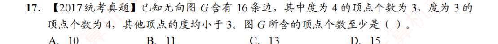
    至少.. 所以要取度最大的情况
18. 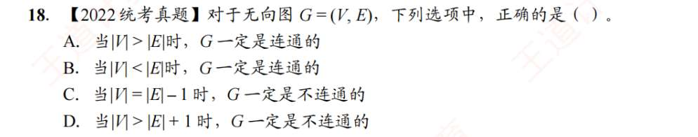
    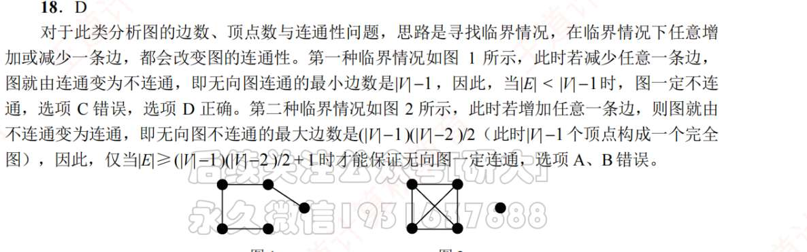

我们直接用上面总结的**第一条定理：把 $n$ (即 $|V|$) 个点连通，最少需要 $n-1$ (即 $|V|-1$) 条边。**

*   反过来说，如果边数 $|E|$ 连 $|V|-1$ 都不够（即 $|E| < |V|-1$），那这个图**绝对不可能连通**。
*   不等式 $|E| < |V| - 1$ 移项一下，就是 **$|V| > |E| + 1$**。

我们来看看选项：
*   A. 当 $|V| > |E|$ 时，$G$ 一定是连通的。（错。比如 10 个点 5 条边，边不够，一定**不连通**）
*   B. 当 $|V| < |E|$ 时，$G$ 一定是连通的。（错。比如 5 个点 6 条边，可以让 4 个点构成完全图用掉 6 条边，第 5 个点孤立，照样**不连通**）
*   C. 当 $|V| = |E| - 1$ 时，$G$ 一定是不连通的。（错。此时 $|E| = |V| + 1$，边数比点数多，比如一个正方形加一条对角线，它是**连通的**）
*   **D. 当 $|V| > |E| + 1$ 时，$G$ 一定是不连通的。**
    *   这个式子等价于：**边数 $|E| < |V| - 1$**。
    *   连构成一棵树的最少边数都不够，巧妇难为无米之炊，它**必定是不连通的**。

**正确答案是 D。** 这道题考查的就是“连通的最少边数是 $n-1$”这个底线原则。

# 图的存储与基本概念
1. B
2. C
3. D
4. B  
   在无权图中，有边就是 1，没边就是 0。
*   在**带权图**中，如果有边，矩阵里存的是具体的**权值**（比如 5, 10）。如果没边，存的是 **$\infty$**（无穷大）。
*   **关键陷阱：对角线元素。** 顶点自己到自己通常没有边，但在带权图的矩阵表示中，主对角线上的元素（即 $v_i$ 到 $v_i$ 的距离）通常被规定为 **0**。
*   所以，在第 $i$ 列中，除了无穷大（代表没边），还得把 0（代表自己到自己，不是真正的入度边）给排除掉。
   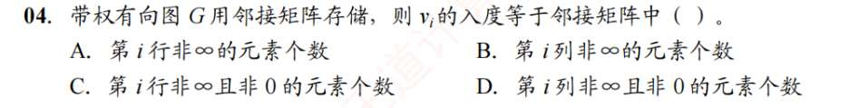
5. BD
6. BBD
7. B
8. A
9. C
   题读错.
10. D
11. A
    顶点在边表出现的次数就是它的入度！出度看顶点表后面连了多少边表项
12. B
13. A
14. C
15. C
16. D
17. A
18. B
19. C
20. B

# 广深搜
1. A
2. D
3. C
4. CACA
5. A
6. CC
   邻接矩阵遍历时间复杂度为 n^2
7. C
   图画错了....
8. C?
   这咋错的，看错了？
9. BD
10. AB
11. D
12. C
13. C?
    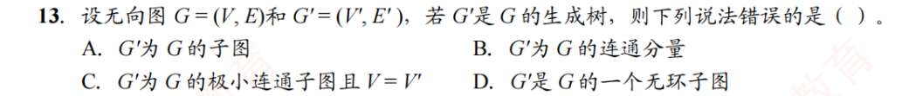
    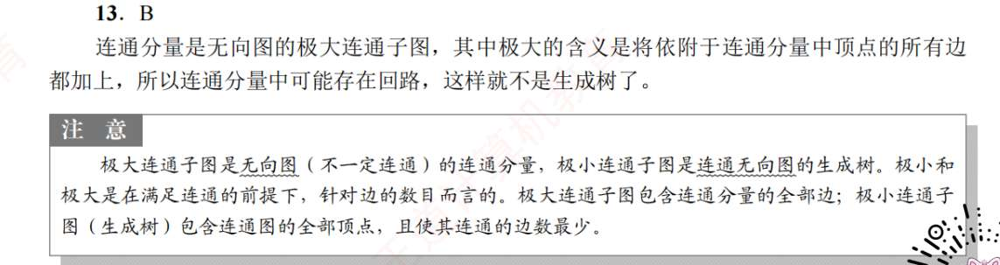
14. A
15. C
16. D
17. D
18. D