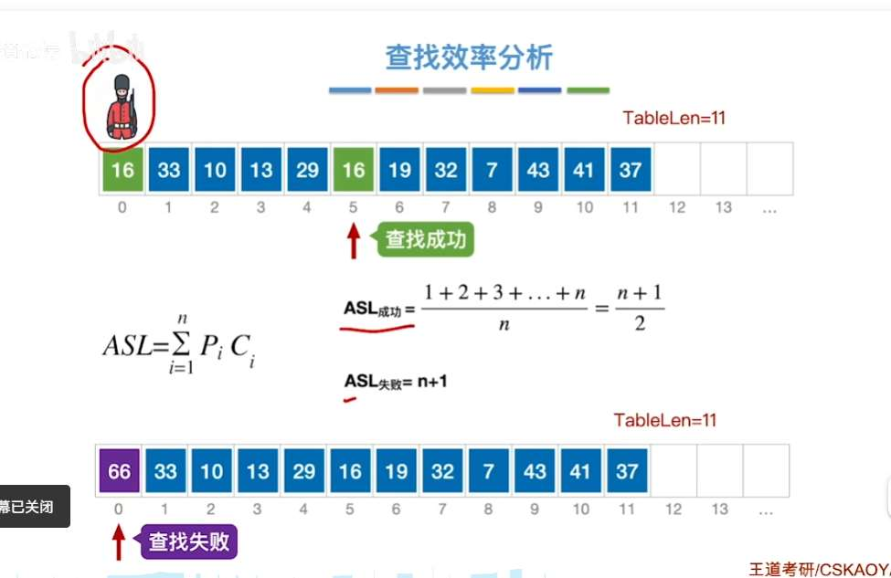
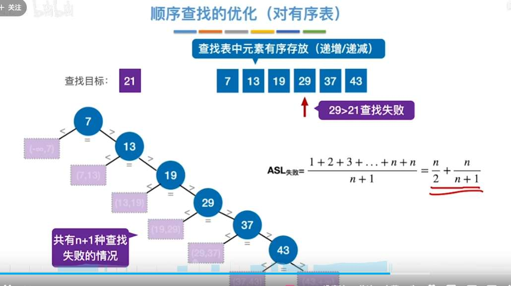
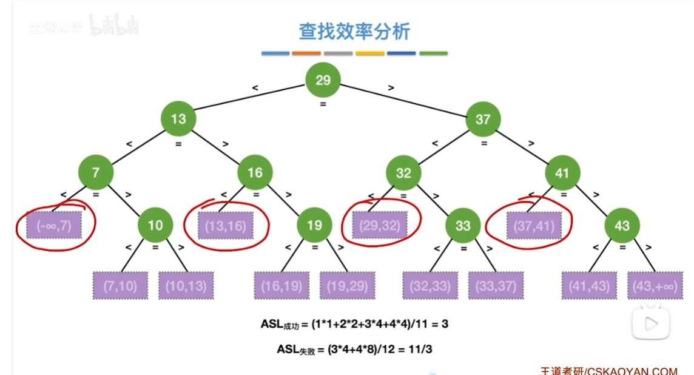
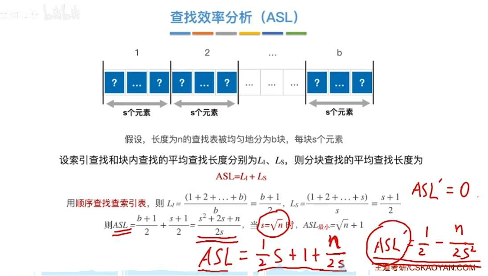
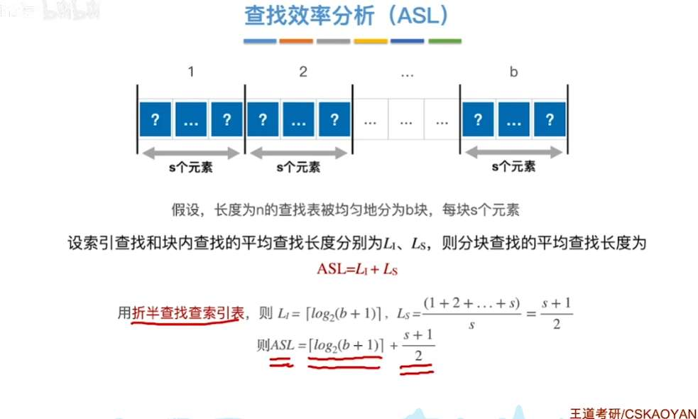
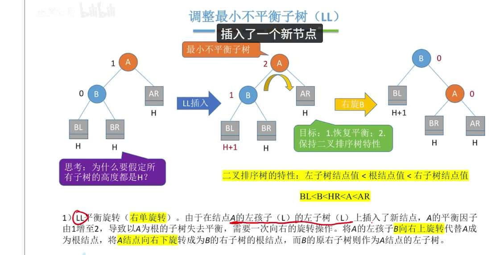
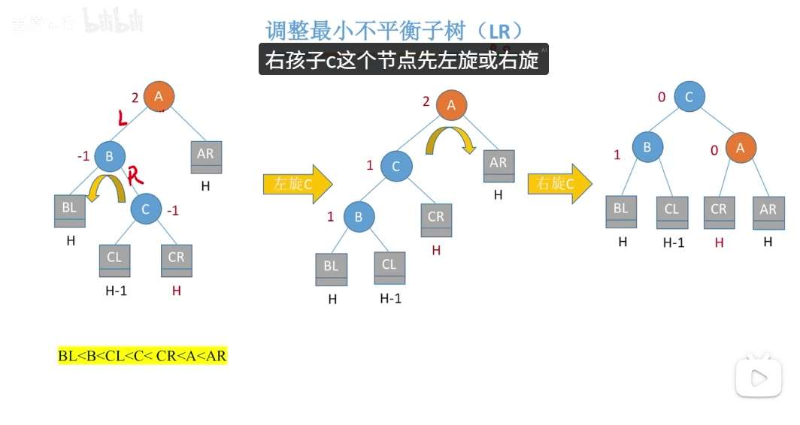
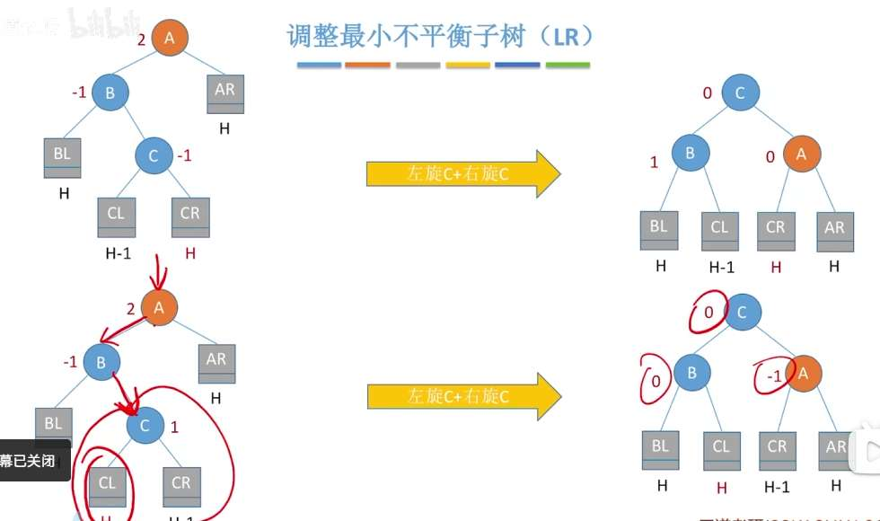
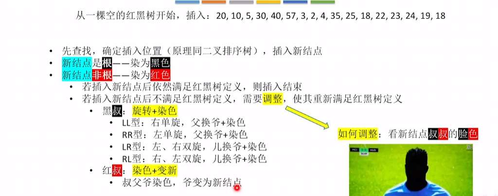
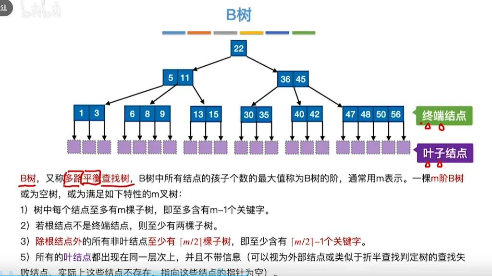

# 基本查找
## 顺序查找

## 折半查找
查找时间复杂度 logn

## 分块查找

# 树查找

## 二叉排序树
掌握
- 查找
- 插入
- 删除
  - 叶子
  - 结点
    - 只有一颗左子树或右子树
    - 有左右子树：找右子树最左下，或左子树最右下

查找效率：最坏是 n，最好是 logn，取决于建树

## 平衡二叉树

调整：
只调整最小不平衡子树。
-  
- RR 同理，很容易想象
- LR：
  
#### 第一步：左旋 C（为了“拉直”）
观察中间的图：我们先不管 A，只看 B 和 C 这两个点。
*   **目的**：B 的右边太重了，我们要把 C 提上来，把 B 压下去。
*   **动作**：以 B 为轴，把 C 向上左旋。
*   **结果**：原本 A-B-C 的“之”字形变成了 A-C-B 的“直线型”（变成了典型的 LL 型）。

#### 第二步：右旋 C（为了“压平”）
观察最右边的图：现在 C 已经在左边这一串的中间了。
*   **目的**：现在 A 的左边整体太重了，我们要把“中间人”C 提拔成老大（根节点），把 A 压下去。
*   **动作**：以 A 为轴，把 C 向上右旋。
*   **结果**：C 成了根，B 成了左孩子，A 成了右孩子。

- RL 同理

删除操作，就是二叉排序树的删除+平衡二叉树的调整的套娃

## 红黑树
性质
左根右，根叶黑，不红红，黑路同

规则

对于黑叔，规则本质是最后出现：**黑父，左红，右红**
**为什么要这样？（底层逻辑）：**

- **解决冲突**：插入前，父和爷是“黑-红”，插入新节点（红）后变成了“红-红”冲突。
    
- **保持黑高**：通过旋转把“中间值”提拔成老大，并把它染成**黑色**。它的两个孩子染成**红色**。
    
- **不向上蔓延**：你会发现，这个局部子树在调整前，根部（原来的爷爷）是黑色的；调整后，新的根部也是黑色的。
    
    - 这意味着：**这次调整对上一层完全没有副作用**，不需要再往上递归检查了。这也就是为什么“黑叔”情况调整完就结束了的原因。
        

**总结记忆法：**

- **红叔**：爷爷变红，祸水往上引（需要继续向上处理）。
    
- **黑叔**：中间变黑，两边变红，到此为止（大功告成）。

假如红黑树高度是 h，
两个极端情况，黑高等于 h，黑高等于二分之 h，
黑高等于 2 分之 h 时，至少满足，
n>=2^H-1，H=2 分之 h
$n+1>=2^{\frac{1}{2} h}$ 

在红黑树的定义里，**“叶子节点”不指那些有值的末端节点，而是指“空指针（NIL）”**。

*   **普通树**：没有孩子的节点叫叶子。
*   **红黑树**：每个有值的节点，如果它没孩子，我们就虚构出两个黑色的 **NIL 节点**当它的孩子。
*   **为什么要这么干？** 想象 NIL 是“防撞墙”。规定防撞墙必须是黑色的，是为了保证每一条路（路径）都能走到一个确定的黑色终点。这样我们在计算“黑节点数量”时，逻辑才不会乱。

---

### 2. 核心推论：路径长度之比不超过 2

这是红黑树“近似平衡”的数学证明。请跟我走一遍这个逻辑：

1.  **约束一**：从根到每个 NIL 的路径上，**黑节点数量必须相同**（假设这个数量是 $B$）。
2.  **约束二**：**不能有连续的红节点**。
    *   这意味着：在一条路径上，红节点必须被黑节点隔开。
    *   所以，红节点的数量 $\le$ 黑节点的数量。
3.  **结论**：
    *   **最短路径**：全是黑节点，长度 = $B$。
    *   **最长路径**：黑红交替（黑-红-黑-红...），长度 = $B$（黑）+ $B$（红）= $2B$。
    *   **结果**：最长路径也不会超过最短路径的 **2 倍**。这就是为什么它虽然不如 AVL 树那么平衡，但依然很快的原因。

# B 树
### 1. 最小高度（最“胖”的树）

**逻辑：** 想要树最矮，就要让每个节点都**塞满**。即每个节点都有 $m$ 个叉，$m-1$ 个关键字。

*   第 1 层（根）：有 $m-1$ 个关键字。
*   第 2 层：有 $m$ 个节点，共 $m(m-1)$ 个关键字。
*   第 3 层：有 $m^2$ 个节点，共 $m^2(m-1)$ 个关键字。
*   ……
*   第 $h$ 层：有 $m^{h-1}$ 个节点，共 $m^{h-1}(m-1)$ 个关键字。

**总关键字数 $n$ 与高度的关系：**
把所有层的关键字加起来（等比数列求和）：
$$n \le (m-1) + m(m-1) + m^2(m-1) + \dots + m^{h-1}(m-1)$$
$$n \le m^h - 1$$
**由此得出最小高度公式：**
$$h \ge \log_m(n+1)$$

---

### 2. 最大高度（最“瘦”的树）

**逻辑：** 想要树最高，就要让每个节点都尽可能**少塞东西**。

*   **根节点**：最少可以只有 2 个叉（1 个关键字）。
*   **非根节点**：最少必须有 $k = \lceil m/2 \rceil$ 个叉（$k-1$ 个关键字）。

为了推导方便，我们观察**“失败节点”（NIL 节点）**的数量。
B 树中有 $n$ 个关键字，就一定有 **$n+1$ 个失败节点**。这些失败节点都在第 $h+1$ 层。

我们来数第 $h+1$ 层最少有多少个失败节点：
*   第 1 层（根）：最少 2 个分支。
*   第 2 层：最少 $2 \times k$ 个分支。
*   第 3 层：最少 $2 \times k^2$ 个分支。
*   ……
*   第 $h$ 层：最少 $2 \times k^{h-1}$ 个分支。
*   这些分支指向的就是第 $h+1$ 层的失败节点。

**建立不等式：**
失败节点总数 $n+1 \ge 2 \times k^{h-1}$
其中 $k = \lceil m/2 \rceil$。

**由此得出最大高度公式：**
$$h \le \log_{\lceil m/2 \rceil} \frac{n+1}{2} + 1$$

-

| 维度       | 最小高度 (Min Height)     | 最大高度 (Max Height)                     |
| :------- | :-------------------- | :------------------------------------ |
| **形象**   | **“短粗型”**             | **“细高型”**                             |
| **填充率**  | 每个房间都住满 ($m-1$ 人)     | 每个房间只住一半 ($\lceil m/2 \rceil - 1$ 人)  |
| **决定因素** | 受 **$m$** 限制（底数大，对数小） | 受 **$\lceil m/2 \rceil$** 限制（底数小，对数大） |
| **公式核心** | $h \approx \log_m n$  | $h \approx \log_{m/2} n$              |
|          |                       |                                       |

