# 基本查找
1. A
2. C
   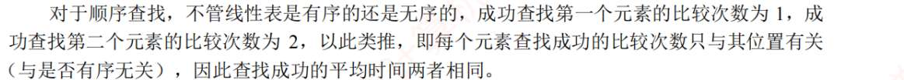
3. B
4. A
5. D
6. C
7. B
8. A
   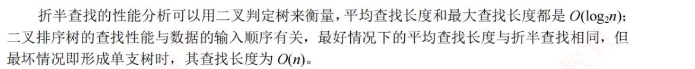
9. ?
   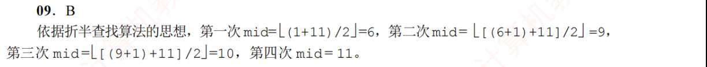
   记得 low 或 high 的移动
10. B
11. A
12. A
13. ?
    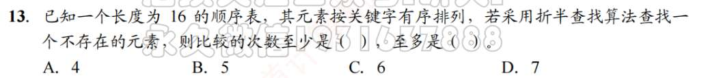
    折半查找判定树的高度 $h = \lceil \log_2(n+1) \rceil$。
	对于 $n = 16$：
	*   $n+1 = 17$
	*   $\log_2 17 \approx 4.08$
	*   向上取整 $\lceil 4.08 \rceil = \mathbf{5}$。
	这说明这棵树有 **5 层**。
	
	 第二步：直接定范围（最快的 方法）
	因为查找失败的节点一定在最后两层：
	*   **至多**比较次数 = 树的高度 = $h = \mathbf{5}$。
	*   **至少**比较次数 = $h - 1 = \mathbf{4}$。
	
	**所以第 13 题选 A 和 B（至少 4 次，至多 5 次）。
	*   判定树是一棵**完全二叉树**（或者是极其接近满二叉树的形态）。
	*   当 $n = 15$ 时，它是一棵**满二叉树**，高度为 4。所有的失败节点都在第 4 层，所以失败次数全是 4。
	*   现在 $n = 16$，多出了 1 个节点。这个新节点必须挂在第 5 层。
	*   这个新节点的加入，会把原本在第 4 层的一个失败位置“挤掉”，并在它下面产生 2 个位于第 5 层的失败位置。
	*   结果：现在失败的位置有的在第 4 层（没被挤到的），有的在第 5 层（新产生的）。
	
	**结论：** 只要 $n$ 不是 $2^k-1$（即不是满二叉树），查找失败的比较次数就只有两种可能：**高度 $h$** 和 **高度 $h-1$**。

14. 和 13 一样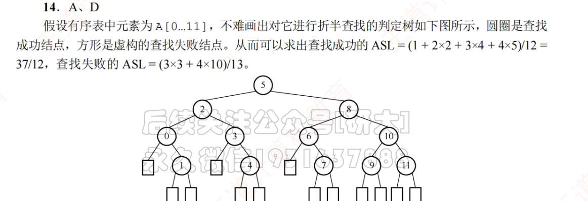
	   如果要算平均查找长度（ASL），也不一定非要画图，可以用**层位计数法**：
	
	1.  **写出各层节点数**：
		*   第一层：1 个
		*   第二层：2 个
		*   第三层：4 个
		*   第四层：8 个
		*   ……以此类推。
	2.  **成功 ASL**：
		把各层节点数填满到 $n$ 为止。比如 $n=12$，前三层满了 ($1+2+4=7$)，剩下 $12-7=5$ 个在第四层。
		$\text{ASL}_{\text{成功}} = (1\times1 + 2\times2 + 4\times3 + 5\times4) / 12$。
	3.  **失败 ASL**：
		记住失败节点总数永远是 **$n+1$**。
		失败节点只会出现在最后两层（$h$ 和 $h-1$）。
		*   设在第 $h$ 层的失败节点有 $x$ 个，在第 $h-1$ 层的有 $y$ 个。
		*   $x + y = n + 1$
		*   再利用树的性质计算出具体个数（通常大题才考，小题直接记“最后两层”即可）
15. D
    折半不仅要数据有序，还要顺序存储
16. C
    分块查找时，不要求每块内数据有序
17. A
18. B
19. 
    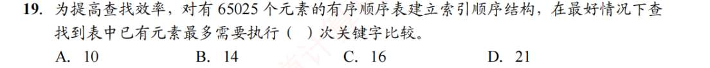
    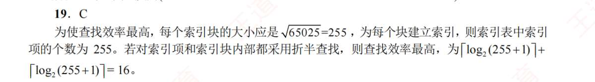
20. B
21. A
22. B
23. A
24. B
25. D
26. C

# 树查找
1. A
   注意二叉排序树，不是二叉平衡树。排序树最长深度就是结点树，且插入结点不会引起树的分裂组合
2. B
3. A
4. B
5. C
6. C
7. A
8. C
   同 1，查找最多就是 n 次。
9. D
10. D
11. B
12. C
13. ？
    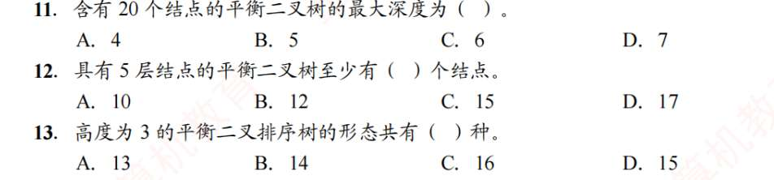
    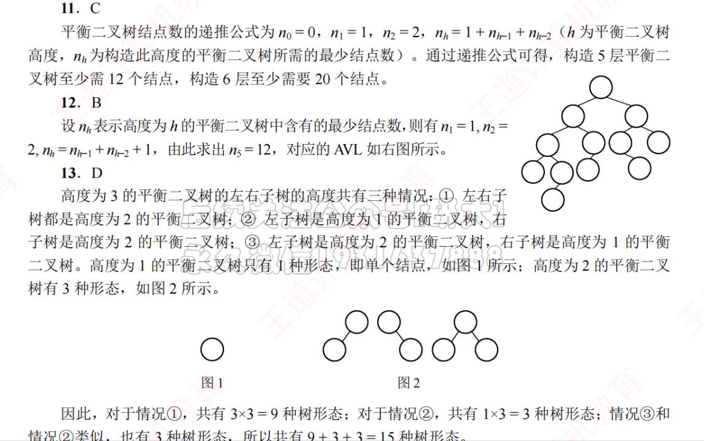
    主要就是掌握递推公式，自己感受感受设 $S_h$ 为高度为 $h$ 的平衡二叉树的形态种数。

	要构成高度为 $h$ 的平衡树，左子树 $L$ 和右子树 $R$ 的高度只有三种组合：
	1.  $H_L = h-1$，$H_R = h-2$
	2.  $H_L = h-2$，$H_R = h-1$
	3.  $H_L = h-1$，$H_R = h-1$
	
	**递推计算：**
	*   $S_0 = 1$ （空树，1 种形态）
	*   $S_1 = 1$ （只有一个根节点，1 种形态）
	*   $S_2$（高度为 2）：
	    *   左 1 右 0：$S_1 \times S_0 = 1 \times 1 = 1$
	    *   左 0 右 1：$S_0 \times S_1 = 1 \times 1 = 1$
	    *   左 1 右 1：$S_1 \times S_1 = 1 \times 1 = 1$
	    *   **$S_2 = 1 + 1 + 1 = 3$ 种**。
	
	*   $S_3$（高度为 3）：
	    *   左 2 右 1：$S_2 \times S_1 = 3 \times 1 = 3$
	    *   左 1 右 2：$S_1 \times S_2 = 1 \times 3 = 3$
	    *   左 2 右 2：$S_2 \times S_2 = 3 \times 3 = 9$
	    *   **$S_3 = 3 + 3 + 9 = \mathbf{15}$ 种**。
	**结论：第 13 题选 D。**
14. A
15. C
16. D?
    结点左右子树平衡因子为 0，不代表左右子树相等，故结点自己的平衡因子不清楚
17. C
    AVL 和红黑树查找、插入、删除时间复杂度相同
18. D
    **若全为黑节点，则一定是满二叉树**- 如果你这棵树里一个红节点都没有（全是黑的），那意味着从根到每一个末端的**路径长度必须完全相等**。
19. A
20. C
21. D
22. B
23. B
24. C
25. A
26. 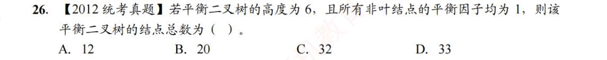
    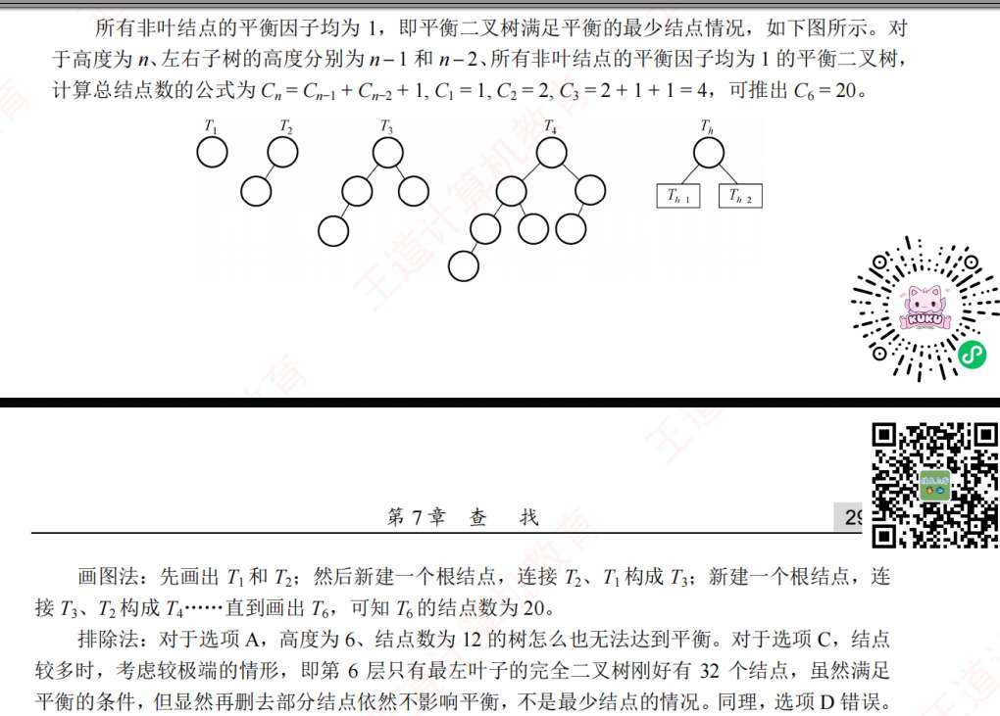
27. C
28. D?
29. D
30. C
31. B
    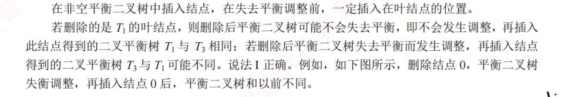
    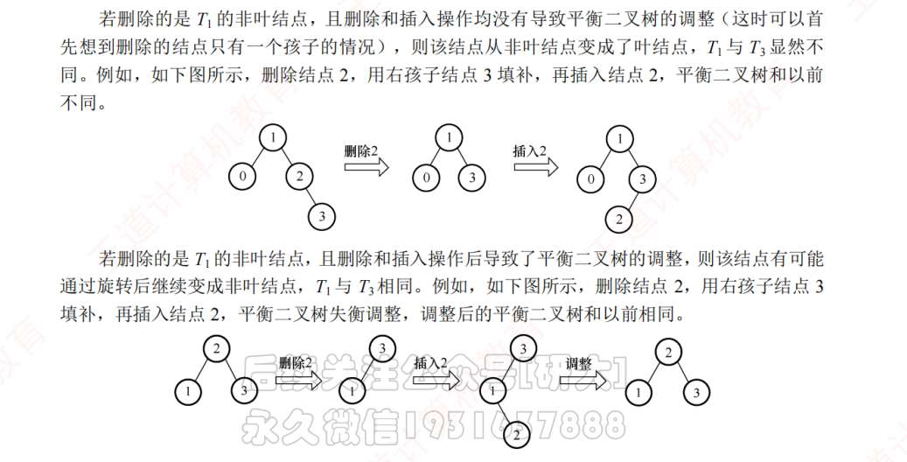
32. B
33. D
34. D

# B 树
1. A
	阶数大于等于 4   
	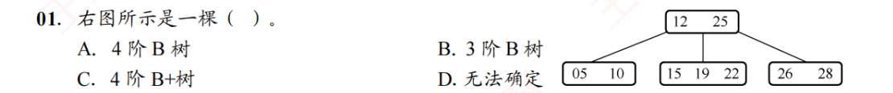
2. C (根节点除外)
3. C?
4. B
5. A
6. 
   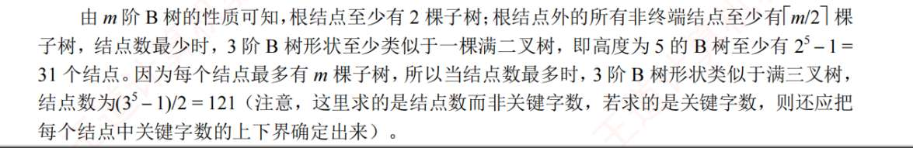
   注意是求结点数还是关键字数！
   如果这道题不是 3 阶，而是 **5 阶**，你就不能直接想成二叉树了。公式逻辑如下：

**至少结点数 $N_{min}$：**
1.  第一层：$1$
2.  第二层：$2$
3.  第三层及以后：$2 \times k^{i-2}$ （其中 $k = \lceil m/2 \rceil$）
    *   *比如 5 阶，$k=3$，序列就是：1, 2, 6, 18, 54...*

**至多结点数 $N_{max}$：**
1.  每一层都是上一层的 $m$ 倍。
2.  总数 = $\frac{m^h - 1}{m - 1}$。

 ⚠️ 避坑指南：看清问的是什么！
*   这道题问的是**“结点数”**（图中画圈的个数）。
*   如果题目问的是**“关键字数”**：
    *   **至少**：每个结点填最少关键字（$k-1$）。
    *   **至多**：每个结点填最多关键字（$m-1$）。
      如 10 题
7. D
8. ，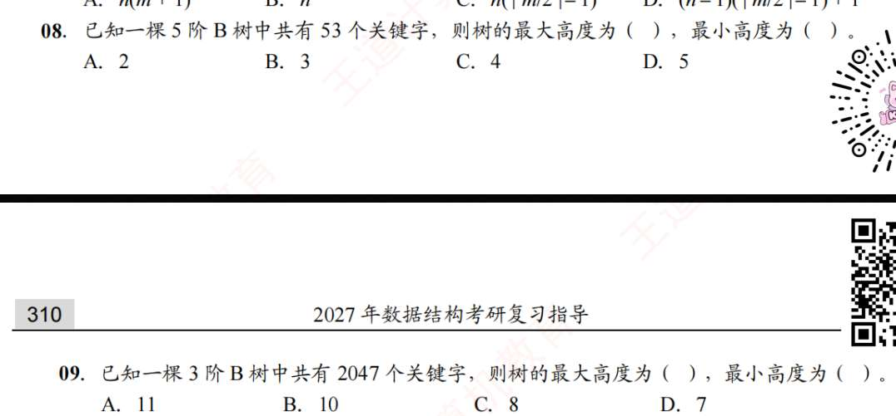
9. 
   ### 核心参数准备
*   **$n$**：关键字总数。
*   **$m$**：阶数（分叉上限）。
*   **$k = \lceil m/2 \rceil$**：分叉下限（除根外）。
*   **$n+1$**：失败结点数（外部结点数），这是求最大高度最精准的切入点。

---

 通法一：求最小高度 $h_{min}$（最胖的树）
**逻辑：** 既然想矮，就让每个结点都装满（$m$ 个分叉）。
**公式：** $n \le m^h - 1$  $\Rightarrow$  **找到第一个让 $m^h \ge n+1$ 成立的 $h$。**

*   **第 08 题 ($m=5, n=53$)**：
    *   $n+1 = 54$
    *   $5^2 = 25$（不够装）
    *   $5^3 = 125$（装得下）
    *   **$h_{min} = 3$**。

*   **第 09 题 ($m=3, n=2047$)**：
    *   $n+1 = 2048$
    *   $3^6 = 729$（不够）
    *   $3^7 = 2187$（够了）
    *   **$h_{min} = 7$**。

---

 通法二：求最大高度 $h_{max}$（最瘦的树）
**逻辑：** 既然想高，就让每个结点都踩在法律红线上（最少分叉）。根节点 2 叉，其余 $k$ 叉。
**公式：** $n+1 \ge 2 \times k^{h-1}$  $\Rightarrow$  **$h \le \log_k (\frac{n+1}{2}) + 1$。**

*   **第 08 题 ($m=5, n=53$)**：
    *   $k = \lceil 5/2 \rceil = 3$
    *   $h \le \log_3 (\frac{54}{2}) + 1 = \log_3 27 + 1 = 3 + 1$
    *   **$h_{max} = 4$**。

*   **第 09 题 ($m=3, n=2047$)**：
    *   $k = \lceil 3/2 \rceil = 2$
    *   $h \le \log_2 (\frac{2048}{2}) + 1 = \log_2 1024 + 1 = 10 + 1$
    *   **$h_{max} = 11$**。

| 步骤 | 目标 | 计算方法 | 技巧 |
| :--- | :--- | :--- | :--- |
| **第一步** | 找关键数 | 计算 $n+1$ 和 $k = \lceil m/2 \rceil$ | 失败结点数永远是 $n+1$ |
| **第二步** | 求 $h_{min}$ | 找 $m^h \ge n+1$ 的最小整数 $h$ | 不停乘 $m$，直到超过 $n+1$ |
| **第三步** | 求 $h_{max}$ | 算 $\log_k (\frac{n+1}{2}) + 1$ | 记不住公式就画图：$2 \times k \times k \dots$ |

💡 考场秒杀口诀：
	*   **最小看 $m$**：连续乘 $m$，刚好装下 $n+1$ 个失败结点的层数。
	*   **最大看 $k$**：根给 2 个头，后面每层翻 $k$ 倍，刚好长到能容纳 $n+1$ 个失败结点的层数。

10. 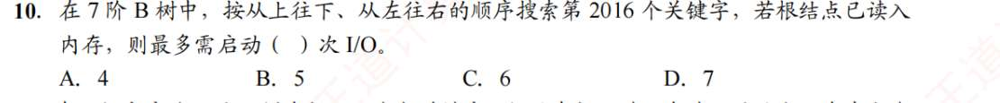
    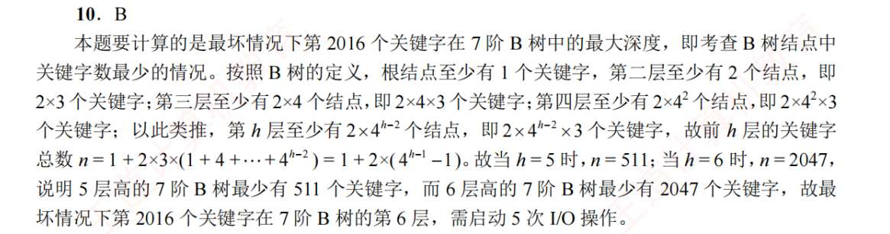
    公式：每层至少的结点，$2 ×(最少分叉)^{h-2}$ 
    前多少层至少的结点，就自己用等比数列求和算

11. B
    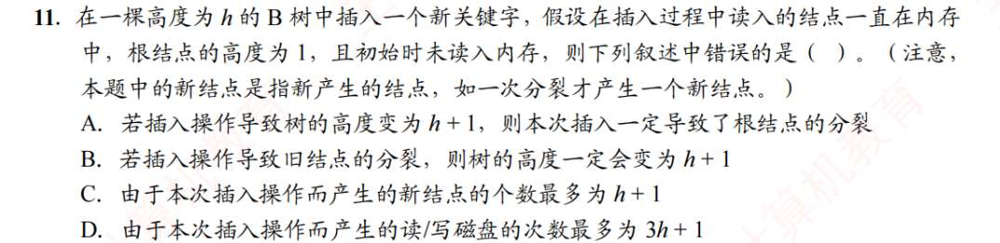
    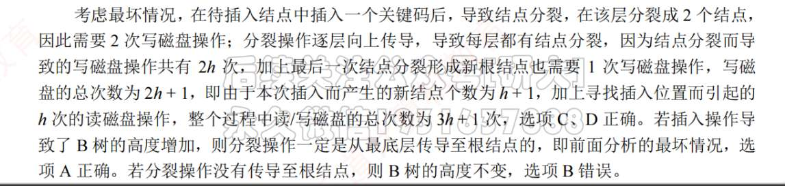
12. A
13. B
    B 查找失败一定要到叶节点，而 B+不用
14. A
    审题，叶节点直接指针相连的，是 B+。
    B 树根节点最多 m 个子树
15. D?
16. A
17. D
    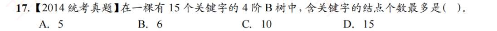
    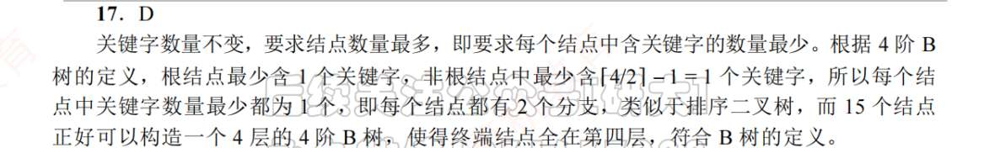
18. A
19. B?
20. D
21. 
