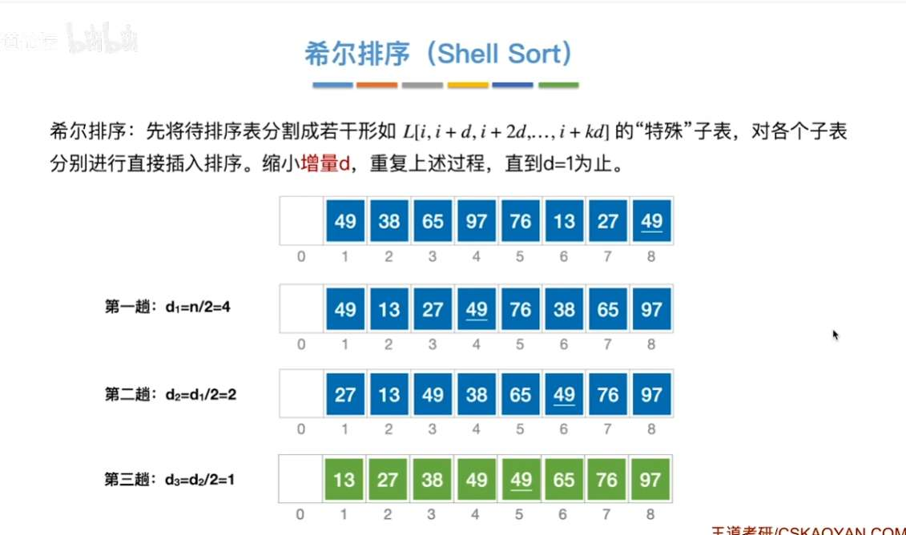

# 插入排序
对每个元素，都是从它开始往前看，看自己插入到哪
空间复杂度
时间复杂度，最好、最坏、平均：
稳定
优化的话，为“折半插入排序”
空间复杂度补充为 $O(1)$

# 希尔排序
分割表，然后各个子表内部进行直接插入排序，
分割多次，不断缩小增量 d，

没有确切的时间复杂度。最坏情况是 $O(n^2)$
不稳定，
仅可用于顺序表

# 冒泡排序
空间复杂度 1，
最好时间复杂度 O (n)，比较 n 次
最坏时间复杂度 n 方，平均也 n 方

冒泡排序可适用于链表

# 快排
时间复杂度 o（n 乘递归层数）
最好，nlogn，最坏，n 方，平均 nlogn
空间复杂度是递归层数
最好 logn，最坏 n
不稳定

# 简单选择排序
空间复杂度 1，

无论如何，都是 on 方

不稳定

# 堆排序

建堆过程关键字对比次数不超过 4n，
即建堆时间复杂度 O (n) 推理过程较复杂

下坠“n-1”趟，
每一趟时间复杂度不超过 oh，即 ologn
故总时间复杂度，nlogn

| 过程 | 逻辑 | 为什么复杂度不同？ |
| :--- | :--- | :--- |
| **建堆 (Build Heap)** | 从下往上，对每个非叶节点调 `Sift-Down` | **省力**：数量庞大的底层节点只需移动很短距离。 |
| **排序 (Sort)** | 每次把堆顶换到堆底，然后对堆顶调 `Sift-Down` | **费力**：每一趟都是让一个元素从最顶端下坠到最底端（距离固定为 $\log n$），且执行了 $n$ 次。 |

堆的删除，是要删除的元素用堆底元素代替，
数组里的**最后一个元素**（即 Heap[n]，逻辑上是完全二叉树最后一层最右边的节点）。
*   **原因 A：结构完整性。** 堆必须是一棵完全二叉树（除了最后一层，其他层全满，且最后一层靠左对齐）。如果你随便删掉中间一个节点，树就会出现“空洞”，不再是完全二叉树，也就无法用连续的数组来高效存储。只有删除最后一个节点，剩下的部分才依然符合完全二叉树的形状。
*   **原因 B：效率最高。** 访问数组最后一个元素的复杂度是 $O(1)$，不需要任何搜索。
*   **原因 C：调整代价小。** 虽然把最后一名提拔到“高层”大概率会破坏堆序（大根堆或小根堆的性质），但通过 $O(\log n)$ 的下坠操作就能快速修复。
# 内部排序算法大横评 （全）

| 排序类别      | 算法名称     | 最好时间          | 平均时间          | 最坏时间          | 空间复杂度       | 稳定性    | 关键特性            |
| :-------- | :------- | :------------ | :------------ | :------------ | :---------- | :----- | :-------------- |
| **插入类**   | **直接插入** | $O(n)$        | $O(n^2)$      | $O(n^2)$      | $O(1)$      | **稳定** | 越有序越快           |
|           | **折半插入** | $O(n \log n)$ | $O(n^2)$      | $O(n^2)$      | $O(1)$      | **稳定** | 减少了比较次数         |
|           | **希尔排序** | $O(n^{1.3})$  | $O(n^{1.3})$  | $O(n^2)$      | $O(1)$      | 不稳定    | 步长 $d$ 递减       |
| **交换类**   | **冒泡排序** | $O(n)$        | $O(n^2)$      | $O(n^2)$      | $O(1)$      | **稳定** | 每一趟产生一个最终位置     |
|           | **快速排序** | $O(n \log n)$ | $O(n \log n)$ | $O(n^2)$      | $O(\log n)$ | 不稳定    | **综合性能最强**，递归实现 |
| **选择类**   | **简单选择** | $O(n^2)$      | $O(n^2)$      | $O(n^2)$      | $O(1)$      | 不稳定    | 时间与初始顺序无关       |
|           | **堆排序**  | $O(n \log n)$ | $O(n \log n)$ | $O(n \log n)$ | $O(1)$      | 不稳定    | 选前 $k$ 个大/小的数最快 |
| **归并/基数** | **二路归并** | $O(n \log n)$ | $O(n \log n)$ | $O(n \log n)$ | $O(n)$      | **稳定** | 占用空间大           |
|           | **基数排序** | $O(d(n+r))$   | $O(d(n+r))$   | $O(d(n+r))$   | $O(r)$      | **稳定** | 非比较排序，看关键字位     |

---

### 2. 重点记忆与避坑指南

#### **Q1：哪些算法每一趟都能确定一个元素的最终位置？**
*   **冒泡排序**（每一趟最大的/最小的沉底）
*   **快速排序**（枢轴元素在每一趟结束后就在最终位置）
*   **简单选择排序**（每一趟选出一个最小的放前面）
*   **堆排序**（每一趟堆顶元素出炉）
*   *注意：插入排序和归并排序不能保证单趟确定最终位置。*

#### **Q2：哪些算法受初始状态（是否有序）影响？**
*   **受影响大（好变坏）**：直接插入、冒泡、快速排序。
*   **稳如老狗（快慢都一样）**：简单选择、归并排序、基数排序。
*   **特别注意**：快排在序列**已经有序**时，反而会退化到 $O(n^2)$。

#### **Q3：空间复杂度谁最高？**
1.  **归并排序**：$O(n)$，因为需要一个和原数组一样大的辅助数组。
2.  **快速排序**：$O(\log n)$，因为需要递归栈（最坏 $O(n)$）。
3.  **其他**：基本都是 $O(1)$。

**选快希堆不稳定**（简单选择、快速、希尔、堆排序是不稳定的，其他都稳定）。

*   **关于链表**：
    *   **直接插入排序**和**冒泡排序**在链表上实现很方便，因为它们只涉及相邻元素的比较或局部插入。
    *   **折半插入排序**和**希尔排序**需要“随机存取”（通过下标找 $i-d$ 或是二分查找），所以**不能**用于链表。
    *   **快速排序**虽然理论上可以用于链表，但在考研和常规实现中，通常只讨论其在顺序表上的应用。