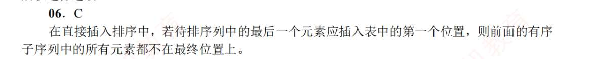
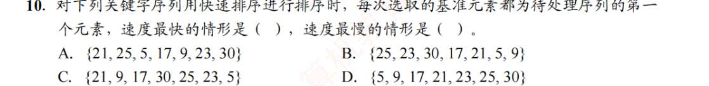
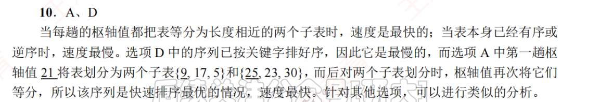
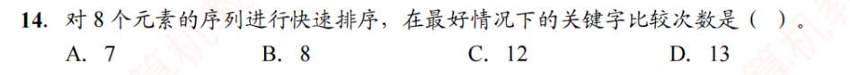
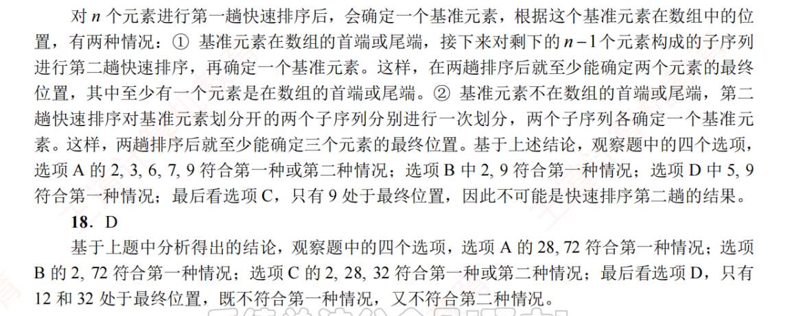
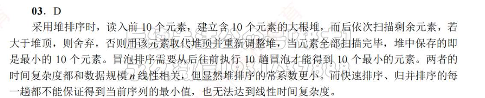
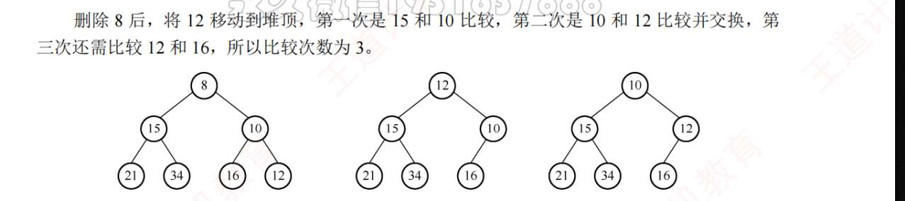
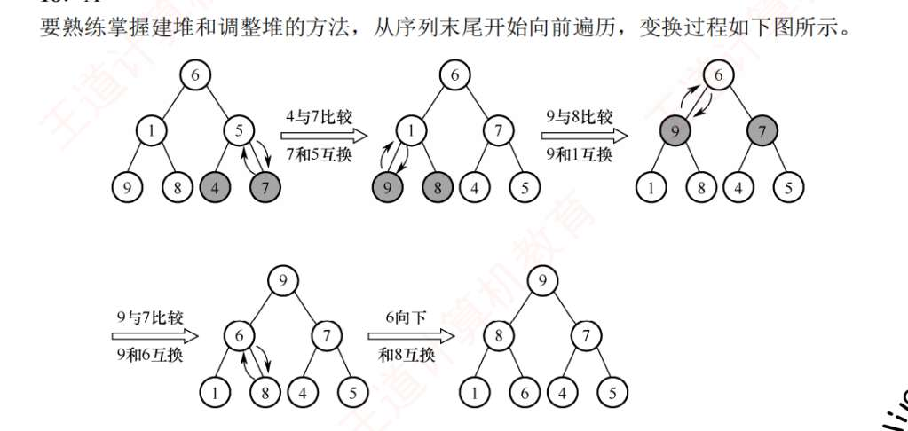

# 插入排序
1. C
  直接插入排序，n=5，也是 1+2+3+4, 次
2. A
3. DA
4. C
5. B
6. A?
   
7. A
8. B
9. C
10. A
11. B
12. B
13. C
14. A
15. C
16. C
17. D
18. B
19. A
20. D

# 交换排序

1. A
2. C
3. D
4. ，
5. D
6. D
7. A
8. C
9. A
10. 
    
11. B
12. C
13. BC
14. 
    
	1.  **第一层（根节点）**：
	    *   有 8 个元素。
	    *   进行一次划分，比较次数：$8 - 1 = \mathbf{7}$ 次。
	    *   划分结果：基准留在中间，剩下的 7 个元素被平分为 $(3)$ 和 $(4)$ 两个子序列（或者 $3.5$ 不存在，取 $3$ 和 $4$）。
	
	2.  **第二层**：
	    *   左边子序列有 3 个元素，比较次数：$3 - 1 = \mathbf{2}$ 次。
	    *   右边子序列有 4 个元素，比较次数：$4 - 1 = \mathbf{3}$ 次。
	    *   此时产生的子序列分别为：$(1, 1)$ 和 $(1, 2)$。
	
	3.  **第三层**：
	    *   长度为 1 的子序列不需要再排序（比较次数为 0）。
	    *   剩下那个长度为 2 的子序列，比较次数：$2 - 1 = \mathbf{1}$ 次。
	
	### 总计比较次数：
	$$7 \text{ (第一层)} + [2 + 3] \text{ (第二层)} + 1 \text{ (第三层)} = 7 + 5 + 1 = \mathbf{13} \text{ 次}$$
15. D
16. A
17. C
18. ?
    
19. D
20. A

# 选择排序
1.  A
2. C
3. ?
   
4. D
5. B
   完全二叉树，第一个非叶结点是二分之 n 向下取整。
6. CC
7. AD
   堆排序像一台固定的机器，不管你给它什么样的数据，它都要把那个元素换到顶上，然后一层一层比下去，直到到底。堆排序删除、插入元素，都是 logn， 然后排序算法，无论最好还是最坏情况，都是 nlogn
8. A
   冒泡排序，当比较到没有交换过元素时，就停止比较
   而简单选择排序，无论如何都要比较那么多次
9. D
10. C
11. D
12. B
13. D
14. D
15. A
16. B
17. D
    注意删除后的比较，不是跟分别比较两个孩子，而是孩子间先相互比较
    
18. B
    ，注意，先从序列末尾开始!！
19. C
20. B
21. B

# 归并基数计数
1. C
2. C
3. DD?
   
4. A
5. B
6. B?
7. AB
8. B
9. B
10. D
11. ？
    1. 核心解题思路：低位优先法 (LSD)

	这种多关键字排序，最经典、最高效的方法是 **“从后往前排”**（低位优先）：
	
	*   **第一步：先按“次要关键字” ($k_2$) 排序。**
	*   **第二步：再按“主要关键字” ($k_1$) 排序。**
	
	**关键条件**：在进行第二步（按 $k_1$ 排序）时，使用的排序算法**必须是稳定的**！
	
	#### 为什么一定要稳定？
	如果两个元素的 $k_1$ 相同，由于算法是稳定的，它们会保持第一步（按 $k_2$ 排序）之后的相对顺序。因为第一步已经把 $k_2$ 小的放在前面了，所以保持这个顺序就意味着：当 $k_1$ 相同时，$k_2$ 小的依然在前面。
	
	---
	
	### 2. 选项分析
	
	我们要找的是：**先排 $k_2$，后排 $k_1$，且排 $k_1$ 的算法必须稳定。**
	
	先复习一下稳定性：
	*   **直接插入排序**：**稳定**。
	*   **简单选择排序**：**不稳定**。
	
	**分析选项：**
	*   **A. 先 $k_1$ 后 $k_2$**：错误。如果最后排 $k_2$，那么整个序列最终是以 $k_2$ 为主序的，不符合题意。
	*   **B. 先 $k_2$ 后 $k_1$，但排 $k_1$ 用的是简单选择排序**：错误。简单选择排序是**不稳定**的。当它处理 $k_1$ 相同的元素时，可能会把原来已经排好的 $k_2$ 顺序打乱。
	*   **C. 先 $k_1$ 后 $k_2$**：错误。原因同 A。
	*   **D. 先 $k_2$ 后 $k_1$，且排 $k_1$ 用的是直接插入排序**：**正确！**
	    *   先排 $k_2$（用什么算法无所谓，哪怕不稳定也行，因为它是第一步）。
	    *   再排 $k_1$（用了**直接插入排序**，它是**稳定**的）。
	    *   稳定性保证了 $k_1$ 相同的情况下，$k_2$ 的先后顺序不会被破坏。
	
	---
	
	### 3. 举个例子（秒懂）
	
	假设有两个元素：`A(1, 10)`，`B(1, 5)`。
	目标：$k_1$ 相同，按 $k_2$ 排，所以期望结果是 `B` 在 `A` 前。
	
	1.  **第一步（按 $k_2$ 排）**：
	    *   因为 5 < 10，所以顺序变为 `B, A`。
	2.  **第二步（按 $k_1$ 排）**：
	    *   由于 $k_1$ 都是 1，如果算法是**稳定**的（如直接插入排序），它不会交换 `B` 和 `A` 的位置。
	    *   结果：`B, A`（正确）。
	3.  **如果第二步不稳定**（如简单选择排序）：
	    *   它可能会在处理过程中把 `A` 换到 `B` 前面。
	    *   结果：`A, B`（错误，不符合 $k_2$ 的要求）。
12. C
13. D
14. C
15. B?
    
16. r?
17. C
18. C
19. A
20. C

# 内部排序比较
1. A
2. C
3. C
4. I IV VI  ;  VI; I,IV
   题目... 好坑，这种多选还得读是否有前后关联。
5. A
6. C
    选择，基数排序趟数与初始状态无关
7. C
8. C
9. D
   仅一个无序，插入排序，更快
10. D

	*   **简单选择排序**：它的逻辑是：不管你数组里是什么数，我都要把剩余区间全部扫一遍，找出那个最小的。
	    *   比较次数固定为：$(n-1) + (n-2) + \dots + 1 = \frac{n(n-1)}{2}$。
	    *   这个数字是**绝对固定**的，哪怕数组已经排好序了，它也照样比这么多次。
	*   **折半插入排序**：它的逻辑是：在前面已经排好序的 $m$ 个元素中，用**二分查找**（折半查找）找到插入位置。
	    *   二分查找的比较次数只取决于**元素的个数**（即查找表的高度），而**不取决于元素的值**。
	    *   每一趟插入第 $i$ 个元素，比较次数都是 $\lceil \log_2 i \rceil$（或者是查找判定树的深度）。
	    *   所以，总比较次数也是一个**固定值**。
	
	
	
	虽然我们在大题里常说堆排序的时间复杂度是 $O(n \log n)$，且“不随好坏情况改变”，但在**严格的比较次数**上，它是**会变**的。
	
	*   **堆的“下坠” (Sift-Down) 过程有“提前终止”机制：**
	    *   当一个节点下坠时，它需要和孩子比较。
	    *   **如果**这个节点已经比它的两个孩子都大了，那么比较就**停止**了。
	    *   **如果**这个节点很小，它就要一路比较到底。
	*   **结论：** 如果初始序列已经是一个大根堆，或者某些局部满足堆性质，那么比较次数就会**少一些**；如果初始序列是逆序的，比较次数就会**多一些**。
	*   **总结**：堆排序的比较次数虽然**数量级**是 $O(n \log n)$，但**具体的个数**会随初始数据的分布而上下浮动。
11. D?
    堆不能查找，是无序的。**平衡二叉树（AVL）是绝对“有序”的**，是特殊的二叉排序树
12. C
	为什么“快排”可以并行？
	
	- **逻辑**：一趟划分后，得到了 [左子序列] 基准 [右子序列]。
	- **并行点**：左边怎么排，完全不影响右边。你可以派 CPU-1 去排左边，派 CPU-2 去排右边。它们之间没有数据依赖。
	    
	
	. 为什么“堆排序”可以并行？（重点回答你的疑惑）
	
	你觉得不能同时调整，是因为你可能只盯住了“排序阶段”，但别忘了还有**“建堆阶段”**。
	
	- **初始建堆（Bottom-up）**：
	    
	    - 建堆是从最后一个非叶节点开始，逐层向上“下坠”。
	        
	    - **并行点**：当你调整左子树的“小堆”时，右子树的调整完全可以同步进行。因为在逻辑上，**左子树和右子树是两棵独立的树**。只有当它们都调整好了，根节点才会进行最后一次下坠把它们合起来。
	        
	- **排序阶段**：虽然每次取走堆顶后需要调整，但在大规模数据下，如果使用“多路堆”，依然可以利用并行性。
13. B
14. A
15. A
16. B
17. A?
    看错了，
    顺序存储换为链式存储，没有什么时间效率增大的例子？
    希尔排序，堆排序这种依赖下标的，时间效率会降低
18. D?
    数据的规模也是选算法要考虑的,，但我突然在想，不管数据规模是怎样，凭什么要选时间复杂度高的？难道只是因为代码好写？
    数据规模极小（$n$ 很小时）**
    *   $O(n \log n)$ 的算法通常带有递归开销（如快排）或复杂的逻辑（如堆）。
    *   在 $n < 15$ 的情况下，直接插入排序（$O(n^2)$）由于逻辑简单，其实比快排还要快。
    *   **证据**：现代编程语言（如 Java, Python）的内置排序函数（TimSort），在处理小子表时，都会自动切换回**插入排序**。
      *   **原因 B：数据的初始状态（“几乎有序”）**
    *   如果数据已经基本排好序了，**直接插入排序**的时间复杂度接近 $O(n)$，甚至超过快排。

	*   **原因 C：空间开销**
	    *   如果你只有几 KB 的内存，归并排序（$O(n)$ 空间）就不能用。这时候只能在 $O(1)$ 空间的算法里选。
	
	*   **原因 D：稳定性要求**
	    *   快排和堆排是不稳定的。如果你需要保持相同元素的相对顺序，且数据量不大，你只能选稳定的冒泡或插入。

19. A
20. D
21. C
22. C？
    简单选择和直接插入不是哪哪都像，在最坏情况下，直接插入需要 n 方移动，简单选择只需 n 次
23. A

# 外部排序 
1. B
2. C
3. A
4. ，
5. D
6. C
7. A
8. D
    1.  **背景**：常规的内存内部排序（如快排），产生的归并段长度 $L$ **严格等于** 内存容量 $W$。所以 $m = n/W$。
	2.  **置换-选择排序的魔力**：
	    *   它是边读、边排、边写。
	    *   假设内存能装 $W$ 个数。你输出了一个数字 `10`，如果下一个读进来的数是 `12`（比 10 大），它就能加入**当前的**归并段；如果读进来的是 `8`（比 10 小），它就只能等**下一个**归并段。
	3.  **扫雪机模型（Snowplow Model）**：
	    *   计算机科学家通过数学证明（类似在雪地上扫雪）：在数据完全随机分布的情况下，这种“能加就加”的策略，使得一个归并段的平均长度 $L$ 趋近于 **$2W$**。
	4.  **最终推导**：
	    *   $m = \frac{\text{总记录数 } n}{\text{平均段长 } L} \approx \frac{n}{2W}$
	    *   因为 $W$（内存大小）是恒定的，所以 **$m = (\frac{1}{2W}) \times n$**。
9. C
10. ?
    *   **I. 败者树每上一层只需比较 1 次（正确）**：
    *   在败者树中，每一个非叶节点记录的是“那一轮比赛的败者”。
    *   新元素（胜者候选人）一路上行，每到一层，**只需要和该节点记录的那个“败者”比试一次**。
    *   赢了的人继续往上走，输了的人留在原地变成新的“败者”。
    *   **这就是败者树比堆快的原因：堆每下一层需要比较 2 次（先比两个孩子，再比父子）。**

*   **II. 败者树必须一直走到根，不能中间停止（正确）**：
    *   因为败者树的内部节点**只记录败者，不记录胜者**。
    *   你拿着新元素往上走，即使你比当前这层的“败者”强，你也不知道你是不是比其他分支的“胜者”强。所以你**必须**一直打到最顶端的根节点（甚至还要更新根节点上方的“冠军位”），才能确定谁是最终的全局冠军。

*   **III. 堆每下一层若左右孩子全，需比较 2 次（正确）**：
    *   这是堆的死穴。你要把一个元素往下调：
        *   第一次比较：左孩子 vs 右孩子（选出更小的那个）。
        *   第二次比较：父节点 vs 那个更小的孩子。
    *   所以堆的维护效率是 $2 \log_2 k$ 次比较。

*   **IV. 堆的维护必须要走到叶子，不能中间停止（错误）**：
    *   堆是有“提前终止”的。
    *   如果下坠过程中，你发现自己已经比左右孩子都小了（满足小顶堆性质），你就可以**原地躺平**，不需要再往下走了。

11. B
12. ？
13. 要补虚结点
14. D
15. ？
16. ,