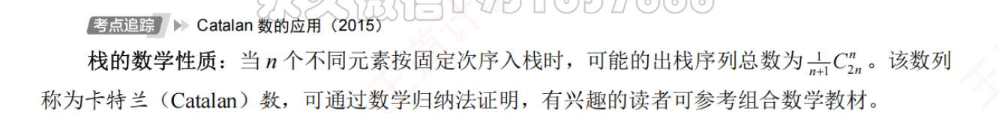
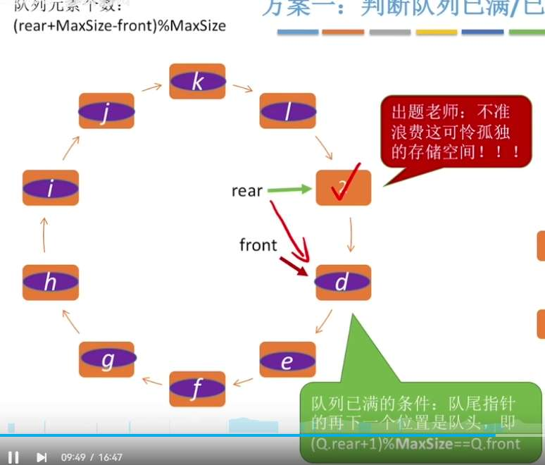
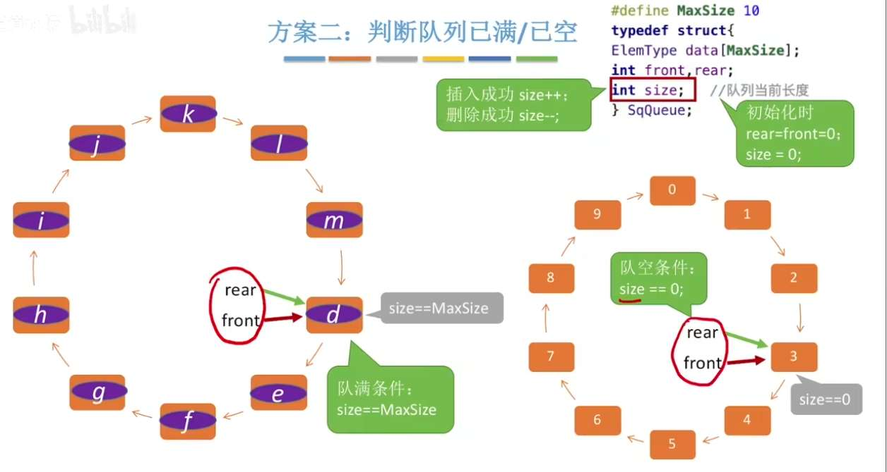
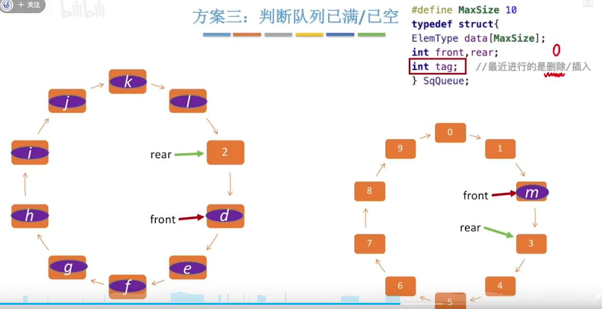
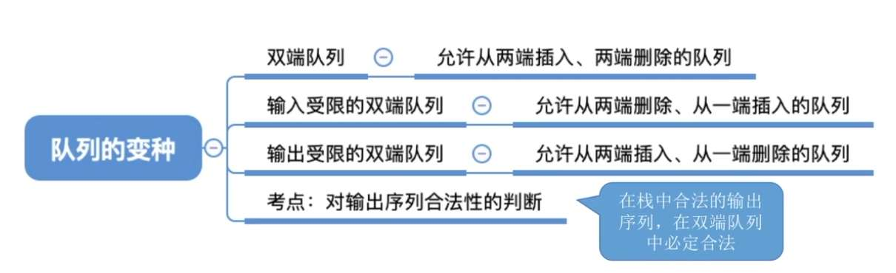

# 栈 ：
顺序/链式
- top 指栈顶元素/top 指栈顶元素前一个
### 实战秒杀技巧：“看小不看大”降序法则

对于选择题判断“哪个出栈序列是不可能的”，千万不要再去脑内模拟了！记住下面这个绝对成立的**黄金规律**：

**前提条件：** 假设元素是按 $1, 2, 3, \dots, n$ 的从小到大的顺序入栈的。

**黄金规律：“对于出栈序列中的任意一个数，在它后面出栈且比它小的所有数，必须是严格降序排列的。”**

没看懂？我们直接上例子！

#### 验证示例 1：判断序列 `3, 1, 4, 2` 是否合法？

1. **看 3：** 在 3 后面出栈、且比 3 小的数有 `1, 2`。它们排列顺序是 `1, 2`（升序）。
    
2. **触发警报：** 必须是降序，这里却是升序，**直接判定非法！**（因为 3 出栈说明 1 和 2 都在栈里，栈是后进先出，被压在下面的 1 绝不可能比 2 先出来）。
    

#### 验证示例 2：判断序列 `4, 3, 5, 1, 2` 是否合法？

1. **看 4：** 后面比它小的有 `3, 1, 2`。顺序是 `3 -> 1 -> 2`。
    
2. **触发警报：** 出现了 `1 -> 2` 升序，**直接判定非法！**
    

#### 验证示例 3：判断序列 `4, 5, 3, 2, 1` 是否合法？

1. **看 4：** 后面比它小的有 `3, 2, 1`。是降序，合法。
    
2. **看 5：** 后面比它小的有 `3, 2, 1`。是降序，合法。
    
3. **看 3：** 后面比它小的有 `2, 1`。是降序，合法。
    
4. 一路绿灯，**判定合法！**

### 卡特兰数的简单证明（折线/反射法）

纯代数的数学归纳法很枯燥，计算机科学中通常用**“网格路径”**来证明，非常巧妙。

**1. 问题转化**

假设我们有 $n$ 个元素，一共需要执行 $n$ 次“入栈”和 $n$ 次“出栈”。

我们规定：

- **入栈**，相当于在直角坐标系中**向右走 1 步**（$x+1$）。
    
- **出栈**，相当于在直角坐标系中**向上走 1 步**（$y+1$）。
    

我们从原点 $(0,0)$ 出发，最终要走完 $n$ 次入栈和 $n$ 次出栈，终点必然是 $(n,n)$。

一共要走 $2n$ 步，从中选 $n$ 步向右走，所以**所有可能的路径总数**（不考虑合不合法）是组合数：

$$C_{2n}^n$$

**2. 栈的终极限制**

栈有一个死规定：**在任何时刻，出栈的次数不能超过入栈的次数。**

对应到坐标系里就是：在任意时刻，向上走的步数 $y$ 不能超过向右走的步数 $x$。即 $y \le x$。

这意味着，所有**合法的路径，都必须在对角线 $y=x$ 的下方或上面，绝对不能越过对角线！**

**3. 剔除不合法路径（反射原理）**

如果不小心越过了 $y=x$，那就意味着触碰到了上方那条线 $y=x+1$。

巧妙的一步来了：**把触碰点之后的所有路径，沿着 $y=x+1$ 这条线做“轴对称反射”**。

- 原本终点是 $(n,n)$。
    
- 沿着 $y=x+1$ 对称翻折后，终点就变成了 $(n-1, n+1)$。
    

由于每一条不合法路径，翻折后都会唯一对应一条到达 $(n-1, n+1)$ 的路径，所以：

**不合法路径的总数 = 从 $(0,0)$ 到 $(n-1, n+1)$ 的路径总数 = $C_{2n}^{n-1}$**

**4. 最终结果**

合法的出栈序列数 = 总路径数 - 不合法路径数

$$C_{2n}^n - C_{2n}^{n-1}$$

将组合数公式展开稍微化简一下，就得到了图片里的终极公式：

$$C_{2n}^n - \frac{n}{n+1}C_{2n}^n = \frac{1}{n+1}C_{2n}^n$$

# 队列
更新 Q，Q.rear=(Q.rear+1)%Maxsize,
Q.rear= Q.front，则队空。来第一个数据时，填入 front，front 不动，rear 动一格。rear 始终表示“下一个数据的位置”
(Q.rear+1)%Maxsize=Q.front 为满

若不想浪费空间，用 size/tag

