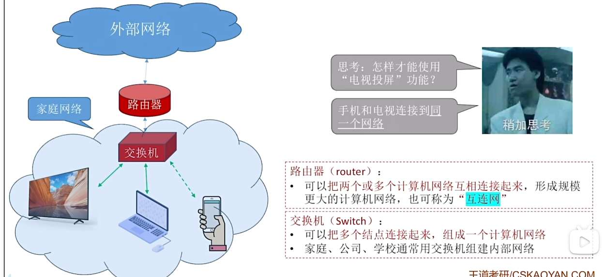

说的家用路由器，看作路由器+交换机

ISP，
就是用高级路由器，连接更大范围的计算机网络，这就是互联网

所以可以说，互联网是世界上最大规模的互连网

小的互连网可以自己使用任意通信协议，
互联网呢必须使用 TCP/IP 协议

组成部分
硬件：
- 主机
- 通信设备
- 通信链路
软件：主要是主机上的软件，路由器也有，
协议：由网络适配器+软件实现

资源子网，通信子网：

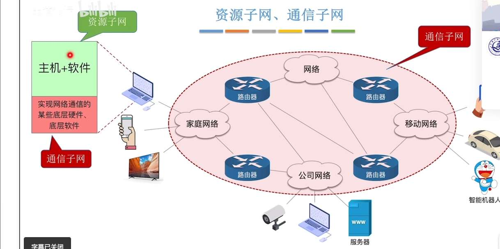

计算机网络的功能：
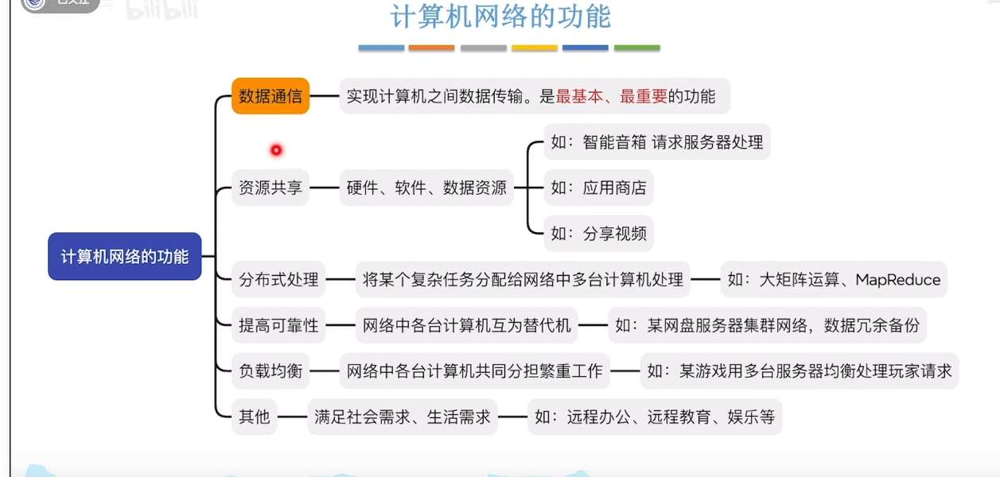

# 计算机网络如何交换信息
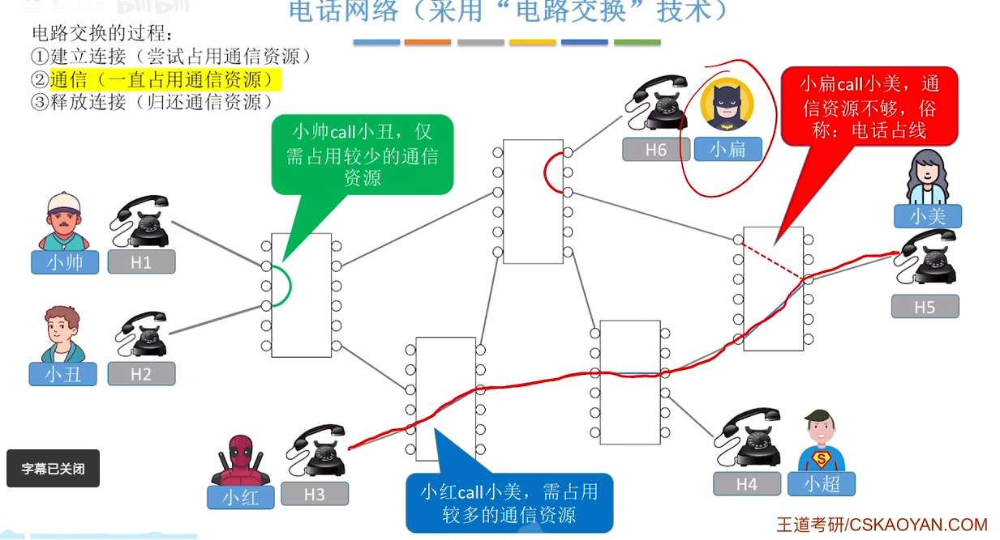

优点：因为是专门的一条线，所以传输速率高
缺点：建立释放连接需要额外时间开销，线路灵活性差，不支持差错控制 4

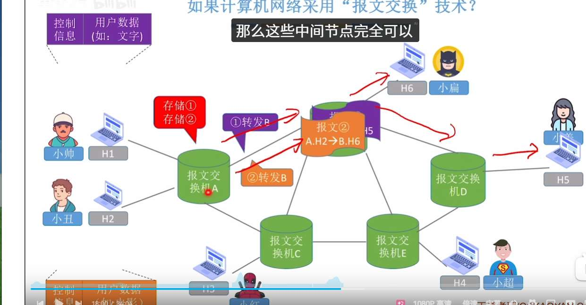
优点：存储转发，没有专用线路，利用率低. 支持差错控制
缺点
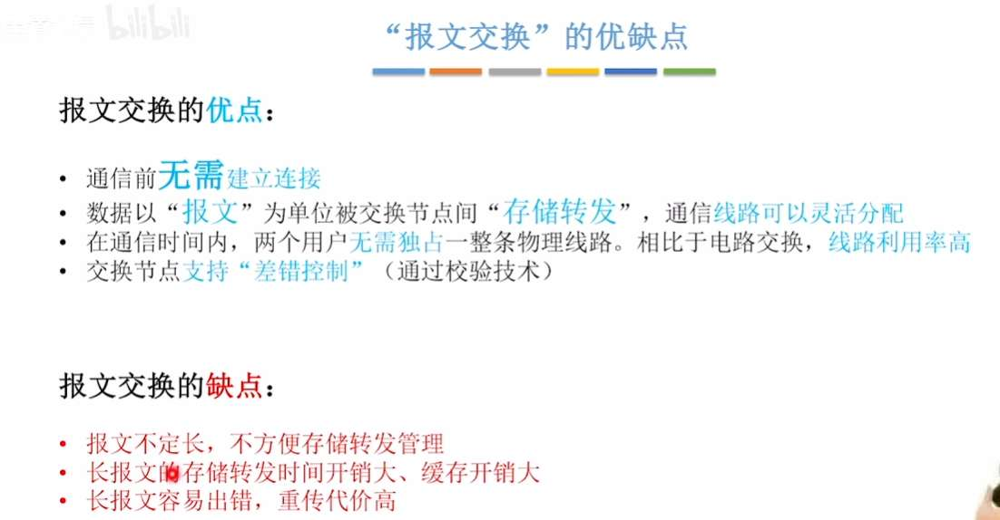

| 特性       | 报文交换 (Message Switching) | 分组交换 (Packet Switching) |
| -------- | ------------------------ | ----------------------- |
| **单位**   | 整个报文（长度不限）               | 受限的分组（较短，有上限）           |
| **存储要求** | 节点需要大缓存（需存储全报文）          | 节点仅需小缓存（存分组即可）          |
| **转发机制** | **完全**存储转发               | **部分**存储转发（流水线操作）       |
| **延迟**   | 高（需等待整报文接收完毕）            | 低（分组级并行转发）              |
| **错误处理** | 效率低（需重传整个报文）             | 效率高（仅重传损毁分组）            |
| **现状**   | 已基本废弃（仅在某些电报系统用过）        | **现代互联网的核心**            |

## 性能分析
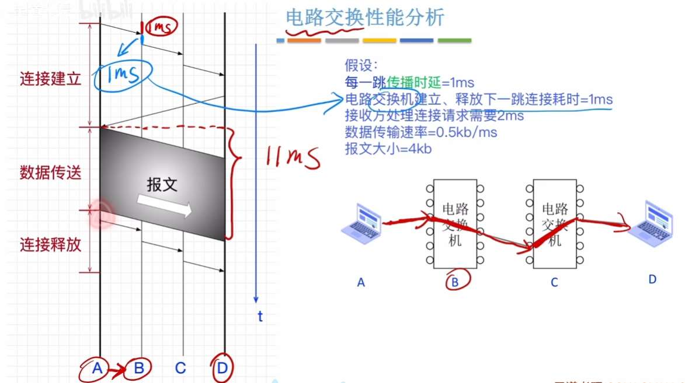

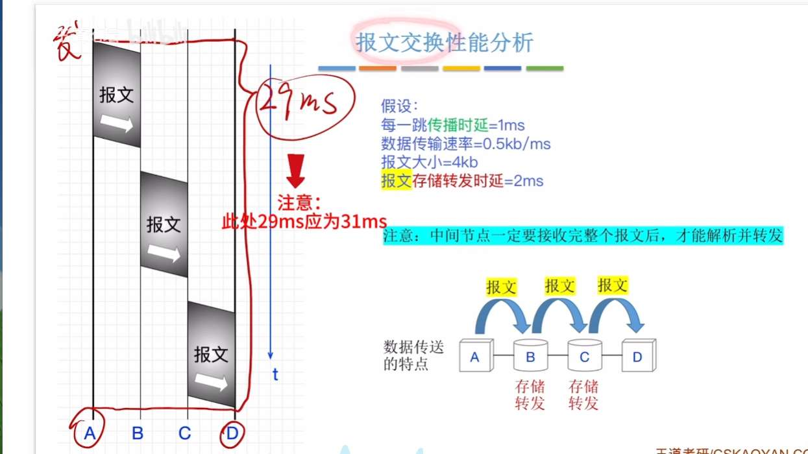

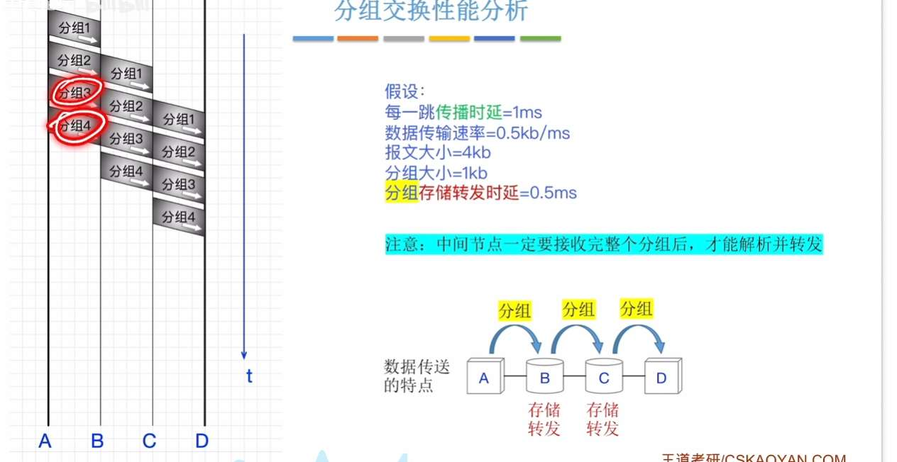

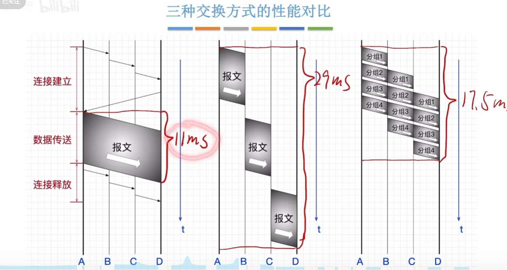

# 计算机网络分类

- 广域网
- 城域网
- 局域网
- 个域网

- 广播式
- 点对点

- 局域网：总线型，环形，星形
- 广域网：网状型

# 性能指标

速率，节点在信道上传输数据的速率 
bit/s, b/s, bps
1B/s=8b/s

带宽是信道最大速率

吞吐量是信道单位时间内通过网络的实际数据量 4

时延：
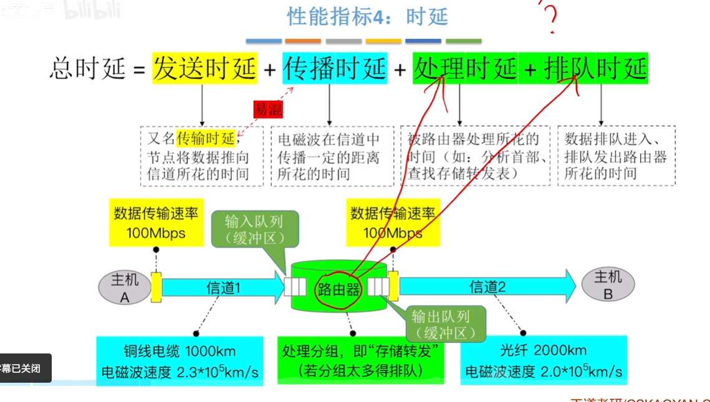

时延带宽积
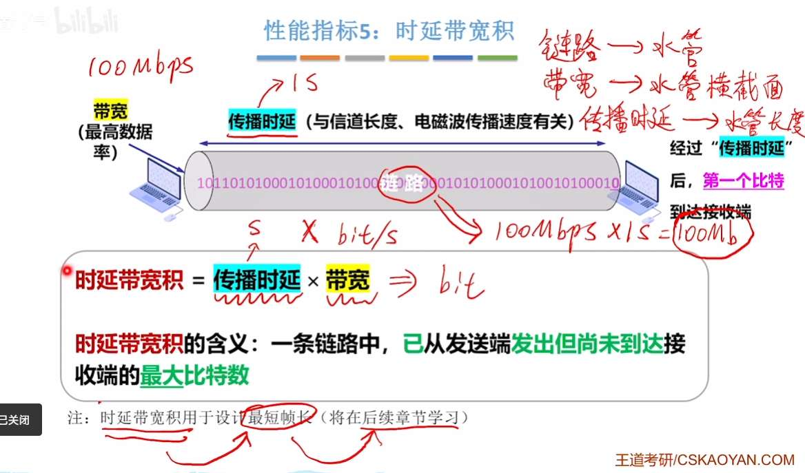

往返时延
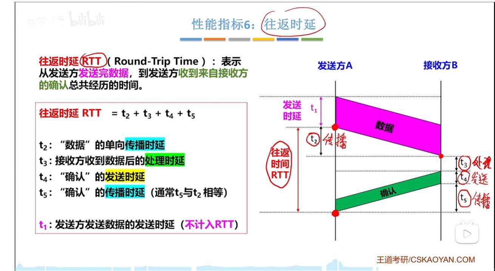

信道利用率

# 计算机网络分层

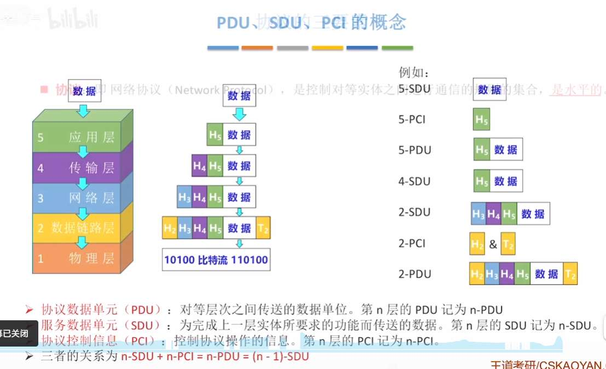

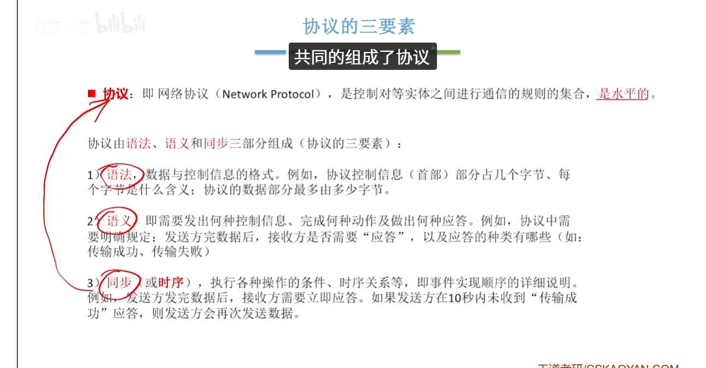

## OSI
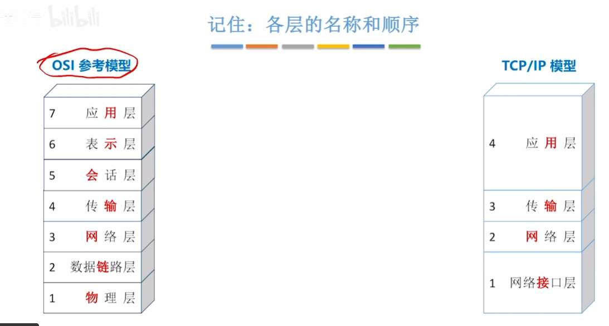
物联网叔会使用

链路层为了保证，链路逻辑上无差错，
检错+纠错

网络层，确保fen'z