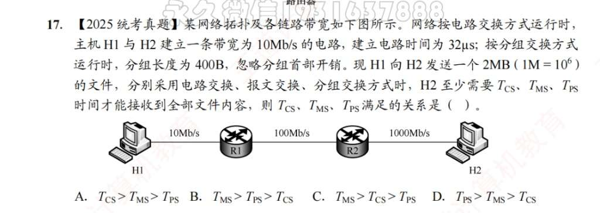
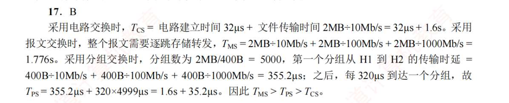
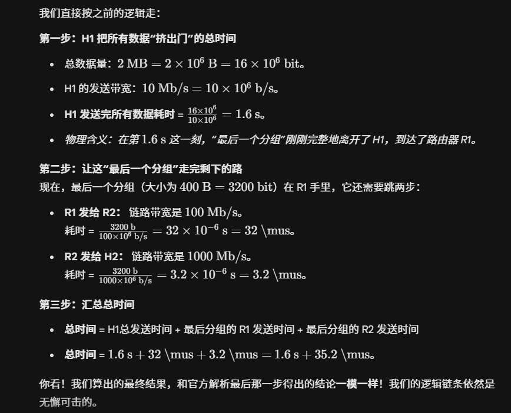

# 计网概述
1. B
2. D
3. B
4. C
5. C
   分组交换的缺点是附加信息开销大，因为每一组都有控制信息
6. A, C, A, A
7. A
8. A
9. B
10. c
11. B
12. 
	
	
	**1. 电路交换时间 ($T_{\text{电路}}$)**
	
	电路交换需要先建立连接，然后数据就像在直通管道里一样一次性发过去，中间路由器不存储转发。
	
	- $T_{\text{电路}} = \text{建链时间} + \text{发送时延}$
	    
	- $T_{\text{电路}} = 2 + \frac{x}{2.5}$
	    
	
	**2. 报文交换时间 ($T_{\text{报文}}$)**
	
	整个报文作为一个整体，先从 H1 传到路由器，路由器接收完毕后，再传给 H2（存储-转发）。
	
	- $T_{\text{报文}} = \text{第一段链路发送时延} + \text{第二段链路发送时延}$
	    
	- $T_{\text{报文}} = \frac{x}{2.5} + \frac{x}{2.5} = \frac{2x}{2.5}$
	    
	
	**3. 分组交换时间 ($T_{\text{分组}}$)**
	
	数据被切分成多个 $5\text{ kb}$ 的分组。分组交换采用**流水线**的方式：当路由器收到第一个分组并开始向 H2 转发时，H1 还在继续向路由器发送后续分组。
	
	因此，总时间等于：H1 发送完所有数据的时间 + 最后一个分组在路由器上的转发时间。
	
	- 最后一个分组的大小为 $p = 5\text{ kb}$。
	    
	- $T_{\text{分组}} = \text{整体数据发送时延} + \text{最后一个分组的跳步延时}$
	    
	- $T_{\text{分组}} = \frac{x}{2.5} + \frac{5}{2.5} = \frac{x}{2.5} + 2$

13. 
	**1. 剥离陷阱：计算真实的分组数量**
	
	- **已知：** 文件总大小 $980000\text{ B}$，每个分组总大小 $1000\text{ B}$，其中包含 $20\text{ B}$ 的分组头。
	    
	- **分析：** 数据在传输时，必须切块并加上“快递单”（分组头）。所以每个分组真正能装运的“货物（有效数据）”大小 = $1000\text{ B} - 20\text{ B} = 980\text{ B}$。
	    
	- **计算分组总数：** $n = \frac{980000\text{ B}}{980\text{ B/分组}} = 1000$ 个分组。
	    
	
	**2. 第一阶段：源主机 H1 将所有分组发送出去的时间**
	
	- **发送的总数据量：** $1000 \text{ 个分组} \times 1000\text{ B/分组} = 10^6\text{ B}$。
	    
	    _(注意：网络传输速率的单位 Mbps 指的是 bit/s，所以要把 Byte 换算成 bit，乘以 8)_
	    
	    总数据量 $x = 10^6 \times 8 = 8 \times 10^6\text{ bit}$。
	    
	- **链路带宽 ($v$)：** $100\text{ Mb/s} = 100 \times 10^6\text{ bps}$。
	    
	- **H1 总发送时延：** $\frac{x}{v} = \frac{8 \times 10^6}{100 \times 10^6} = 0.08\text{ s} = 80\text{ ms}$。
	    
	
	**3. 第二阶段：等待最后一个分组跳完剩余路程**
	
	- 前面我们分析出，最短路径的链路段数 $k = 3$。所以最后一个分组还需要跳 $k - 1 = 2$ 段链路。
	    
	- **单个分组大小 ($p$)：** $1000\text{ B} = 8000\text{ bit}$。
	    
	- **单个分组在一段链路上的发送时延：** $\frac{p}{v} = \frac{8000}{100 \times 10^6} = 0.00008\text{ s} = 0.08\text{ ms}$。
	    
	- **最后一段等待时间：** $2 \times 0.08\text{ ms} = 0.16\text{ ms}$。
	    
	
	**4. 汇总总时间**
	
	- **总时间 = H1 连续发送时间 + 最后一个分组后续跳跃时间**
	    
	- $T = 80\text{ ms} + 0.16\text{ ms} = 80.16\text{ ms}$。
14. D
15. s\
16. 

	
	现在我们把**发送（挤）**和**传播（滑行）**结合起来，依然只看文件里**最末尾的那一个比特**。
	
	**第一步：H1 把所有数据挤出门（H1 的发送时延）**
	
	- 文件大小 $x = 1\text{ MB} = 1 \times 10^6\text{ B} = 8 \times 10^6\text{ bit}$。
	    
	- H1 埋头苦干，挤完所有数据耗时：$\frac{8 \times 10^6\text{ b}}{100 \times 10^6\text{ b/s}} = 0.08\text{ s} = 80\text{ ms}$。
	    
	- **此时状态（$80\text{ ms}$ 时刻）：** 最后一个比特刚刚离开了 H1 的网卡，进入了第一段网线。
	    
	
	**第二步：最后一个比特在第一段网线上飞驰（第 1 段传播时延）**
	
	- 它需要花时间飞到路由器。
	    
	- 耗时：就是我们刚算的单向传播时延 **$0.01\text{ ms}$**。
	    
	- **此时状态（$80.01\text{ ms}$ 时刻）：** 最后一个比特抵达路由器。此时整个“最后一个分组”都被路由器完整接收了。
	    
	
	**第三步：路由器把最后一个分组挤出门（路由器的发送时延）**
	
	- 路由器现在要把这最后的 $1000\text{ B}$ 分组发往 H2。
	    
	- 分组大小 $p = 1000\text{ B} = 8000\text{ bit}$。
	    
	- 路由器挤出这个分组耗时：$\frac{8000\text{ b}}{100 \times 10^6\text{ b/s}} = 0.00008\text{ s} = 0.08\text{ ms}$。
	    
	- **此时状态（$80.09\text{ ms}$ 时刻）：** 最后一个比特离开了路由器，进入了第二段网线。
	    
	
	**第四步：最后一个比特在第二段网线上飞驰（第 2 段传播时延）**
	
	- 它需要花时间从路由器飞到 H2。
	    
	- 耗时：又是 **$0.01\text{ ms}$**。
	    
	- **此时状态（$80.10\text{ ms}$ 时刻）：** 最后一个比特终于抵达 H2！大功告成！
	    
	
	### 3. 总结
	
	总时间 = H1 发送时延 ($80$) + 第 1 段传播 ($0.01$) + 路由器发送最后分组 ($0.08$) + 第 2 段传播 ($0.01$) = **$80.10\text{ ms}$**。
	
	所以，本题正确答案是 **D**。

17. 

# 计算机网络体系结构
1. D?
   网络分层的核心思想是**“高内聚，低耦合”**。它的目标是规定每一层“应该做什么”（也就是提供标准接口和语言，让上下层能互相沟通，选项 A 和 C），以及让各层之间互不影响（增加独立性，选项 D）。但是，分层**绝对不干涉“具体怎么做”**（即不定义功能执行的具体方法）。
2. D?
3. D
4. C
5. A
6. ?
   ISO 设计了 OSI，但标准是 TCP/IP
7. A
8. C
9. B
10. A
11. D?
    OSI 划分层次结构，但未规定协议具体的实现
12. D
13. D
14. C?
    OSI 的数据链路层，有物理寻址，流量控制，差错检验，但没有拥塞控制
15. D
16. A
17. C
18. A?
19. C
    会话层会插入同步点
20. B
21. D
22. ？
    数据链路层是唯一一个既加“头”又加“尾”的层。它不仅在头部增加了物理地址等控制信息，还在尾部增加了**帧校验序列（FCS）**用于差错检测。所以不能说“仅”。
    网络层（第 3 层）接收来自上一层（传输层）的数据，将其封装成**“分组（Packet / 数据报）”**，并在头部增加第 3 层的逻辑地址（IP 地址）和控制信息
    传输层确实负责增加可靠性和流控制信息，但它封装出来的数据单元叫做**“数据段（Segment / 报文段）”**，而不是“数据帧（Frame）”。“数据帧”是数据链路层的专有名词。
    源和目的的**端口信息**（用于区分不同应用程序）是由**传输层**添加的。表示层的功能是数据的格式转换、加密解密和压缩，不负责分割数据和加端口。
23. ，
    数据链路、网络、传输都提供流量控制
    “路由（Routing）”**是网络层的灵魂功能。路由器就是工作在这一层的设备，负责在错综复杂的网络中为数据包寻找最佳路径。
    
24. B
25. A
26. C
27. A
28. ACD?
29. B
30. D
    网络体系结构，描述每层必须完成的功能：√
    描述协议的内部细节：×
31. A?
    相邻层，是指下一层，是指“高层”！
32. C
33. C?
34. A
35. C
36. C
37. B
38. B