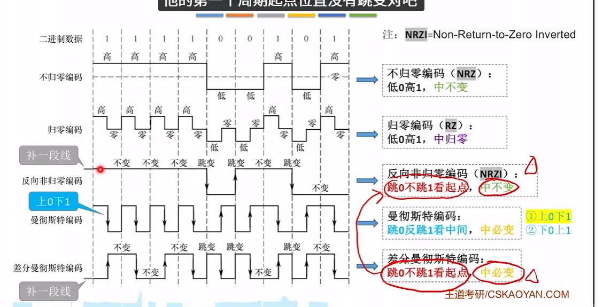
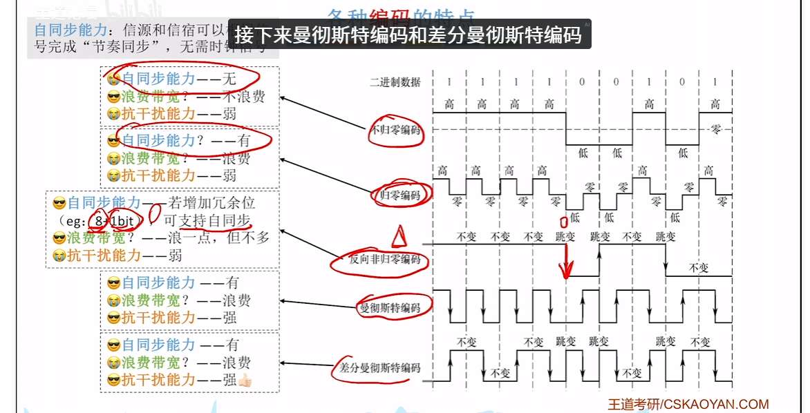

信源，通过信道，给信宿，发送信息。
使用码元携带信息，比如码元可能是 2v 电信号，1v，-1v。
每个码元，可能携带 3bit，可能 2bit。和码元数有关？
比如 4 个码元，那每个就携带 2bit。1 个码元，那每个就只携带 1bit。
8 个码元，每个就携带 3bit。
那么波特率就是码元/秒
比特率是比特/秒，bit/s

奈奎斯特定理：无噪声信道，极限波特率=2W（W 是带宽）
香农定理：有噪声信道，极限比特率=Wlog_2 (1+S/N) ，S/N 是信噪比
若用分布表示，那么转数值，10 log_10 (S/N）dB

# 编码

# 调制
