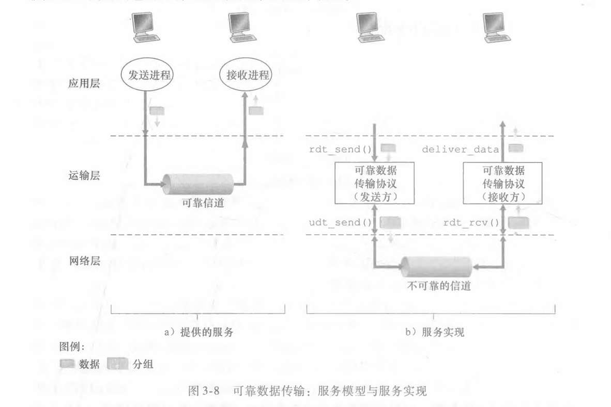
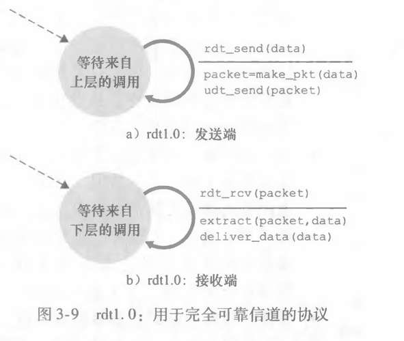
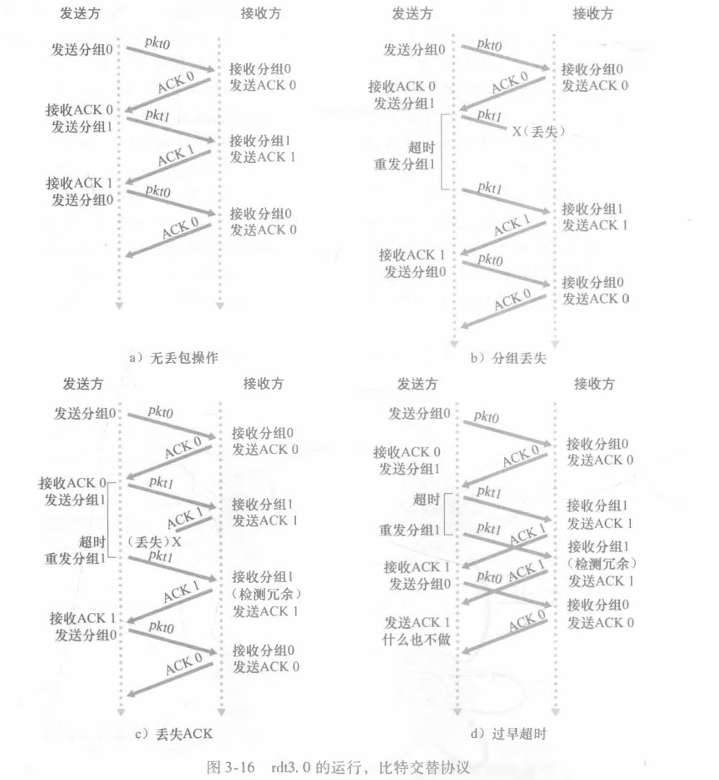

    ok 一些考研细节对齐的，看xiexiren计网。
现在，全面看《自顶向下》

# 运输层作用
- 应用层报文=信封上的字符 
- 进程=堂兄弟姐妹 
- 主机（又称为端系统）=家庭 
- 运输层协议=Ann和Bill 
- 网络层协议=邮政服务（包括邮车）

很好的比喻，所以运输层管理的俩个家的各个成员的信，即主客机的各个端口。运输层协议只工作在端系统中。但网络层协议我实在没理解，感觉和数据链路层混淆了？也罢，后面学网络层再回过头来理解吧。
**网络层，是看地图。看各个家在哪个国哪个城哪条街。这个，Ann和Bill不会管的。书籍链路层是跑腿的， 是“邮递员小张（链路A）”走的；从当地邮局到机场，是“大卡车（链路B）”拉的；从机场到对方城市，是“飞机（链路C）”运的。 数据链路层只负责这一站到下一站的物理送达。 所以那个（包括邮车）确实不太对**

即使底层网络协议不能在网络层提供相应的服务，运输层协议也能提供某些服 务。例如，如我们将在本章所见，即使底层网络协议是不可靠的，也就是说网络层协议会 使分组丢失、篡改和冗余，运输协议也能为应用程序提供可靠的数据传输服务。
为什么？好吧，也等后面的网络层吧

在对IP服务模型有了初步了解后，我们总结一下UDP和TCP所提供的服务模型。 UDP和TCP最基本的责任是，将两个端系统间IP的交付服务扩展为运行在端系统上的两 个进程之间的交付服务。
这个说法，可以说是讲IP协议与传输层协议对比，明确指出，不同点只是拓展到了进程？
**对于UDP来说，它仅仅在IP的基础上，加了端口号（为了找到进程）和一点点校验（为了查错）。除此之外，IP有什么毛病（丢包、乱序），UDP全都有。而对于TCP来说 ，- TCP也做了“拓展到进程”（端口）的工作。但它更重要的是做了**“**帮不可靠的IP擦屁股”的工作（即我们上面说的可靠性机制**）**
        

---

接下来的多路复用和多路分解，我看引入了socket ，我觉得不用陷入细节吧。
UDP我也不看了，因为我发现  ，书上说“在下一节中，我们将看到UDP无非就是对网络层协议增加了 一点（多路）复用/（多路）分解服务而已” 好，这个内容借助AI吧。不过我发现王道书上列了UDP数据报和其检验的知识点及题目。哎，视频勘察就用王道。然后对齐书籍之前再确认一遍王道的书的大纲，选择性的看教材。      nn

# 可靠数据传输原理

"将较低层直接视为不可靠的点对点信道" 啥意思啊？？？  b服务，这四个函数，到底说明了什么？
**TCP协议（运输层）从不盲目信任IP协议（底层），而是做好了“底层随时会出岔子”的最坏打算。**

## rdt1

rdt的发送端只通过rdt_send(data)事件接受来自较高层的数据，产生一个包含该数据 的分组(经由make-pkt (data)动作)，并将分组发送到信道中。实际上，rdt_send(data)事 件是由较高层应用的过程调用产生的(例如，rdt_send() )
什么意思？
接受来自较高层的数据，不对吧rdt_send不是把数据发给下一层吗？ 哦哦这是个连续的动作对不，应用层调用这个方法，在这个方法视角里，就是接收上层数据，接着把数据发给下一次
额，反正这意思就是，发送和接收，全部都是可靠的，并且实际上真的没差错的话，这种情况下，没啥知识点。一个等着上层调用send，一个等着下层调用rcv？    默认没有问题。 但是 ， 图中怎么又出现udt_send?
然后，可能“一个单元数据与一个分组没差别” 算一个知识点？

## rdt2
假设，现在引入“比特差错”
引入自动重传请求 (Automatic Repeat reQuest, ARQ)协议

那么现在，发送端发送完了后，要等待确认，ACK或NAK。若NAK则重传 。若ACK 回到等待上层调用的状态。

rdt2.0接收方的FSM仍然只有单一状态。（FSM啥意思？）当分组到达时，接收方要么回答一个ACK,要 么回答 1个NAK,这取决于收到的分组是否受损。

若ACK、NAK信号也出差错了，怎么办？

## rdt2.1
什么是分组？
即将发送数 据分组的序号（sequence mimbeC放在该字段 
啥意思？

- **0** 代表“当前这一个”。
    
- **1** 代表“下一个”。  
    两个数字轮流转，完全够用了！
一个情景讲清，
**发送方发了 0号包，接收方回了 ACK，但 ACK 坏了。**

1. **发送方**：收到一个烂包。心想：“看不清是啥，当作 NAK 处理吧。” -> **重传 0号包**。
    
2. **接收方**：
    
    - 本来在期待 1号包。
        
    - 结果又收到了 **0号包**。
        
    - **判定**：“我是要 1，你给我 0。说明什么？说明你没收到我刚才的 ACK，以为我没收到 0。”
        
    - **动作**：
        
        1. **丢弃** 这个重复的 0号包（数据不要了）。
            
        2. **重发 ACK**（大声告诉发送方：“0号我真的收到了！别发了！赶紧发1号！”）。
            
3. **发送方**：终于收到了清晰的 ACK。
    
4. **状态转换**：发送方长舒一口气，开始准备发送 **1号包**。

## rdt3.0
现在不仅有位差错，还有丢包的情况。
我们自然而然，根据发送方是否收到ACK来判断是否丢包，
但一直等ACK 这样，效率不高
所以我们用 倒计时定时器 一段时间没收到ACK 默认丢包  
冗余分组？有rdt2.1设计的序列。

## 流水线可靠数据传输
可以算出，如果发送方等到ACK信号再发下一组数据，那么发送方吞吐量特别少。
额，很显然  我们可以改为发多组数据 发送方再返回ACK 。 这就要求序列号更多， 以确认丢包问题

那么丢包/损坏怎么办？
### 回退N步
一个N长度的窗口  里面是已发送但未收到ACK的分组。
如果发送方想继续发送，必须在窗口没满的情况。
如果出错，把整个窗口的分组重发，这就是回退N步？（不过大概率重发的数小于等于N）
