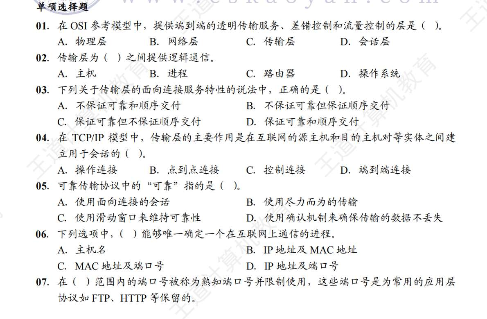
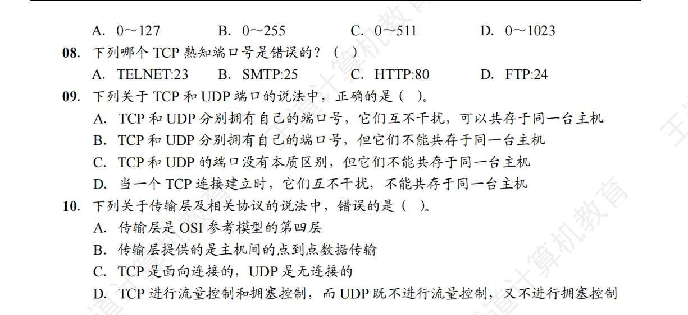
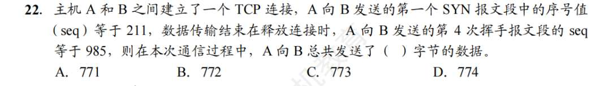
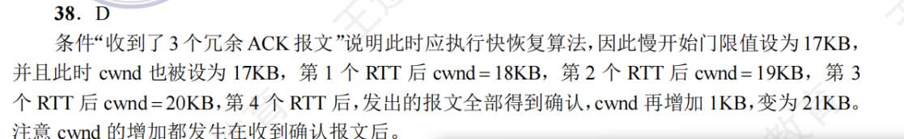
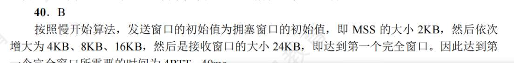
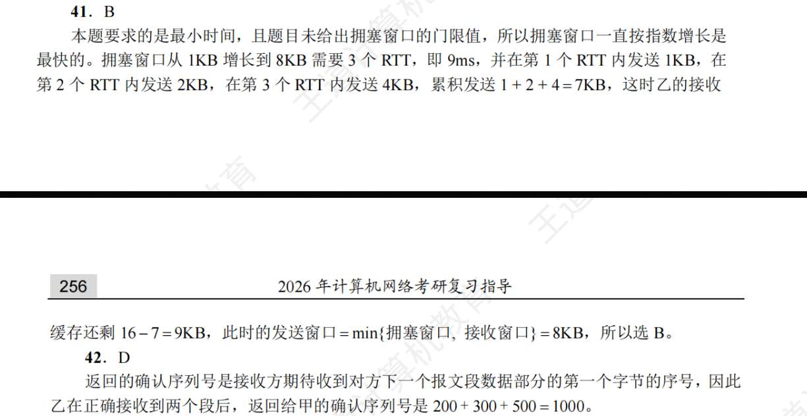
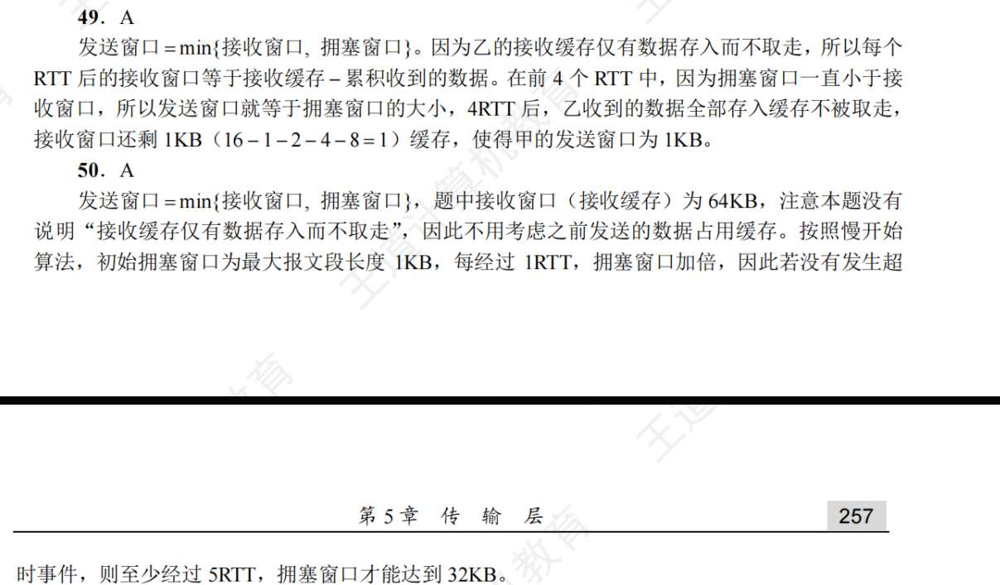
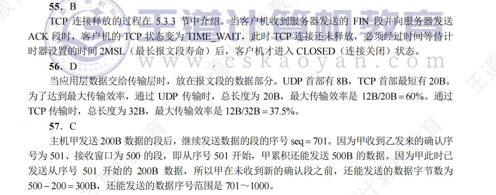

# 传输层的功能

1. C **端到端是进程到进程 点对点是主机对主机**
2. B
3. A  可靠和顺序交付，与面向连接无关吧 甚至可靠与能否顺序交付有关
	确实，没有深思面向连接到底带来了什么？  为什么说，面向连接时尽管下面的网络不可靠，但逻辑通信信道仍相当于一条全双工可靠信道？ 无连接则仍是不可靠 面向连接究竟带来了什么。
		主要原因就是，面向连接不仅仅是“初次见面，打招呼，建立连接” 而是“面向连接” = TCP = 可靠 + 有序 + 流量控制 + 拥塞控制  那这一下就能说通了 
4. D 
5. D
6. D
7. D
8. 怎么还要记这个熟知端口 D 答案为D
9. B ==端口应该是主机分配的==
	答案为A  这属于没审清题 题目问TCP和UDP俩个协议能不能共存一台主机，当然可以。我想的是，同一个主机下的TCP的有100端口 UDP就不能有100端口 因为端口是主机分配的 对吗
		**错误！端口是协议分配的！一个主机下 TCP有100端口 UDP也可以有100端口！毕竟发包的时候也要检测用哪个协议，所以不用担心搞混**
10. B
	传输层是第四层？ 应用--网络--传输 不是第三层吗？ 
		错 应用下来是传输  再是网络 而且是 是从下无往上数的 应用层第五层 传输层第四层 网络层第三层  数据链路第二层 物理层第一场

# UDP
1. C  若TCP的话，可靠性由传输层负责？
	答案是B  
2. B 肯定不包括伪首部的。 UDP报文头是个啥？是除了UDP首部剔除UDP检验和？
3. D 是数据包长度而不是数据报首部长度
4. D
5. C 坏了 还没学这
6. D
7. A
8. D  UDP检验和计算 到底是发送方视角还是接收方视角？？ B的说法应该是发送方 那怎么会计算出0？？   C又是谁的视角？ 如果是接收方的视角 那就对 如果是发送方的视角 检验和字段的计算，应该是UDP首部剔除UDP检验和 +数据+伪首部啊
9. B 这个伪首部应该是自己得出的吧
10. A 信息很重要吧？ 但我不知道B和D是怎么说
11. 没学IP
12. 没学IP
13. 还没学...
14. B 三没有可靠吧？  只是不对了丢弃 这称的上可靠吗
15. A
16. B

# TCP

1. B 我没理解 其实我感觉都很对  主要模糊的就是B，到底什么是"链路”。 是不是不能保证到底顺序，好像没有东西能保证，只不过TCP能补救因为顺序不对造成的影响，把漏掉的安全重发？
	答案为C 
2. A  这又是什么死记的点
	1. 
3. D  不是同一个主机，不同协议都能相同端口号吗？ 局域网我还没学
4. D  UDP才支持广播
5. C  IP协议才有吧
6. B
7. D  协议字段忘了，  报头（就是首部吧？）长度忘了
	偏移字段单位是4B  单位！ 
8. B
9. C
10. A 发送窗口？  一共都有哪些窗口 得总结下
11. D
	答案为C 
12. A
13. C
#14. C？？
	 答案为D 收到零窗口--启动等待计时（但这个名字为啥叫持续）---计时完毕发送探测报文--ack过来现在的窗口值--若还为0重置计时
#15. ？？
	 40Gb 这里不是存储语境 所以是 $40×10^9 bit$ 换为5...字节 诶？为啥换成字节？ 用2的32次方除以它
16. D
17. ？？
	C  不止
18. C 都可以
19. A C
20. D
21. C
22. A 应该是减3吧
	
	答案B  984-212 
24. C  啥是确认报？ 
25. B
26. D
27. ？
28. C
29. B
	答案为C 
30. C
31. A 计算错误
	C  
32. C
33. B ##
	C？
34. D
35. D
36. B
37. D  对哈 所谓“指数增长”到底是凭什么这么说的
38. C
39. D？ 不是22吗
40. A
41. A
42. ？
43. 
44. C
45. ？应该是计算机视角吧 B
	A？？？？？？？？？？ 还是没懂
46. C
47. B
48. B 不过我在想为什么不是2014
49. A
50. B
	A 没问题
51. ?31\37 与32\6 哪有32
	A 
52. C
53. D
54. C
	 D  忘看单位
55. C?
56. D
	B. 
57. ？
58. A 这个第一个发送是干扰？

59. C
60. D 描述不清晰吧
61. 跟报文长度有啥关系？

