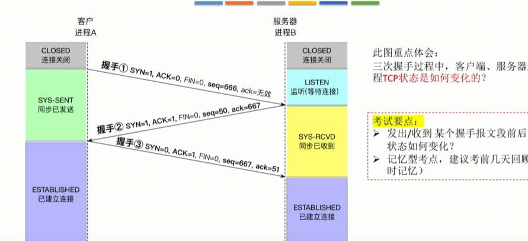
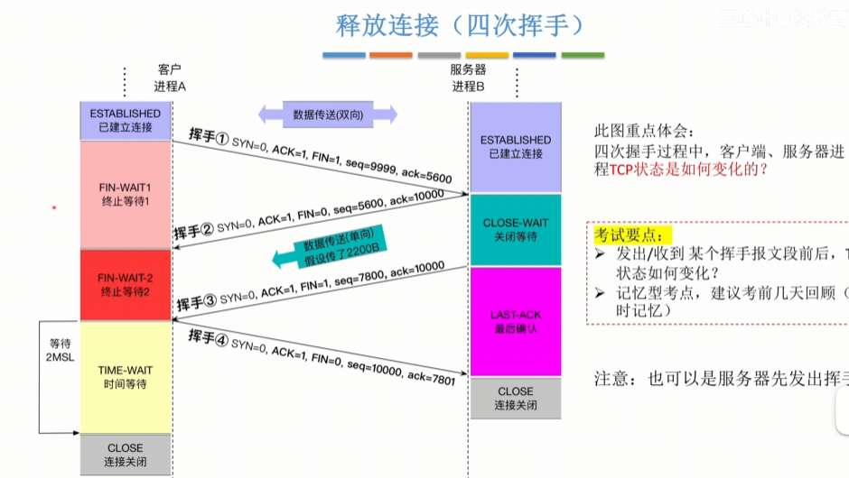

# 概览
运输层，完全描述的是，俩个主机之间，**进程到进程**的通信协议，屏蔽下面所有细节。
注意 **网络层 (IP)**：负责的是**主机到主机 (Host-to-Host)** 的通信

俩种协议，TCP、UDP
- TCP 面向连接、可靠。就是要建立逻辑连接，可靠传输  慢，但绝对流畅 
- UDP 无连接，不可靠   快，但可能会卡
	<u>细节知识点</u>：他们还有许多区别
	- 对单播、多播、广播的支持情况
	- 对应用层报文的处理
	- 对数据传输可靠性的支持情况 
	- 首部对比

# 传输层提供的服务

1.传输层的功能：
	1. 传输层，是面向端对端，即主机下的端口对服务器的端口   是具体的进程！
	 网络层只是主机对服务器
	2. 有复用、分用的功能， 其实是很自然的，传输层是一个协议，一个主机可以有多个进程，全用同一个协议。
	3. 差错检测 传输层规定了到底怎么除了传错的数据
	4. 面向连接、可靠  无连接、不可靠的定义！
	连接是传数据之前 三次确认 ABA  走的时候也要两次再见 AB
	可靠是， 如果一方没收到 会通知另一方重传  不可靠就是 没收到或出错 就把所有包扔了？还是不管这个包 
		这个包

IP：端口号 其实就是套接字  显然 他们的精准定位了某一个主机的某一个进程 
然后端口号 每一个进程不重复 是一个主机内（IP内）分配的

具体端口的数字，有以下几个记忆点
- 服务端
- 客户端

# UDP
特点：
1. 无连接 不可靠
2. 得益于第一点 他可以广播给多个客户端（难道有连接就不能吗？凭什么TCP只能一对一）
	**有连接为啥不能，说过了，有连接=可靠+有序+流量、拥塞控制  那么 TCP发送方是广播给多个客户端了 那他也要接受那么多客户端的响应啊！忙不过来，无法设计。UDP又不管 很轻松 所以可广播** 
3. 传输的报文是一个整体  不能拆分

UDP数据报内容
- UDP首部 8B
	- 2B源端口，即使用UDP协议的进程 ； 2B目标端口 要发给谁
	- 2B UDP长度 （即（8+数据长度）），理论上是65535（2的16次方-1），但限制于IP数据报，实际最大65515； 2B UDP校验和
- 数据部分 

UDP校验：
这里讲解2B的UDP校验和 如何来的
首先，他的作用就是时间视角下， 接收方的UDP数据包看看是不是最开始发送方的UDP数据报

所以谁参与了校验和的生成？ 
	**UDP首部**，除了UDP校验和的6B（现在要计算UDP校验和，2B的校验和还是空的） 还有数据    这个很好理解。                                                                     
	然后还有一个“**伪首部**”，是目标IP、源IP（分别是4B）、协议号，UDP是17，TCP是6（1B）、一个全0字节凑长度（1B）、再UDP长度 和（首部里的UDP长度一样）  这蛮疑惑的，这个设计哲学是什么？？

伪首部的设计哲学：
	我们有可能，发IP发错了，恰巧那个IP也有相同的端口号，那信息就被错误接收了。所以我们把源IP也打包，

接着 我们拼到一起 2B为一轮，也以2B为单位（不知道怎样描述准确） 进行相加 相加时若出现溢出，把溢出的1 回卷到末尾。*这我理解 ， 就是要把我们的信息全部吃掉嘛，进位的1以回卷方式补充进来*。
最后 全部取反   就是2B的校验和了 。 为什么取反？因为一堆数+其取反=1 我们看接收方就明白

那么 我们生成了2B的校验和， 接收方如何利用他呢？
UDP首部除校验和位置的6B，伪首部的12B  和数据（不知道多少B）   仍然用2B为单位、为一轮 加和 进位回卷  产生的数， ， 现在！用这个数与2B的UDP校验和相加！ 若全为1  则说明信息准确。 
进一步的，我们简化说明，上面过程就相当于，伪首部、UDP数据报所有部分 全部进行加和 看是否为1。

那我现在还是蛮疑惑为什么这么设计的  
	其实就是IP 

# 端口
端口，一个主机有很多进程，可能都需要和另个主机通信， 用端口区分进程。
那么自然的，服务器端要有端口号，
- 熟知端口号：直接分配给一些重要的、固定有的应用协议
- 登记端口号
客户端也有端口号
- 短暂端口号 在运行时动态选择    系统完了就收回，给其他客户端进程

端口有啥用？ 额，ip 域名 端口 好像是这三者联系  然后又有这个 数据报文，无论是UDP数据报还是TCP 有关  也有IP协议封装他们有关  但具体是怎样的细节和关联？ 我看视频没看懂 

1. **最里面：【应用层数据】**
    
    - **内容："GET /index.html"（我要看网页）**
        
    - **注：这里面没有IP，也没有端口。**
        
2. **第二层：【TCP 头部】 (传输层)**
    
    - **这里！这里写着端口！**
        
    - **源端口: 54321 (您浏览器临时的分机号)**
        
    - **目标端口: 80 (服务器Web服务固定的分机号)**
        
    - **作用：告诉接收方的操作系统，把里面的数据转给哪个软件。**
        
3. **第三层：【IP 头部】 (网络层)**
    
    - **这里！这里写着IP地址！**
        
    - **源IP: 192.168.1.100 (您的地址)**
        
    - **目标IP: 142.251.42.78 (谷歌的地址)**
        
    - **作用：告诉路由器，这个包要发往世界的哪个角落。**
        
4. **最外层：【以太网 头部】 (数据链路层)**
    
    - **这里！这里写着MAC地址！**
        
    - **目标MAC: 路由器的MAC**
        
    - **作用：告诉交换机，下一跳给谁。**
        

**回答您的关联疑问：**

- **端口写在哪？ 写在 TCP头 或 UDP头 里。**

- **IP协议封装有关？ 是的。IP协议把“TCP头+数据”看作一个整体（货物），并在外面贴上IP头。IP头里不包含端口信息，IP协议也不关心端口，它只管送到大楼（主机）。**

- **谁在看端口？ 只有发送端和接收端的传输层（操作系统内核）在看端口。中间的路由器只看IP，不看端口（除非是NAT路由器）。**

# TCP

假设客户端为A 服务端为B

TCP的特点
- 面向连接
	至于怎么建立连接
	- 三次握手（A先发起，B再回应，A再说ok，那下面我就真的发数据了
	- 四次挥手（建立完连接后释放连接，表示”后面没有数据传输了“。 是谁先发起都可以）
		- 比如说A先发起，我后面没数据了，B回应ok
		- 然后B也要说，我后面也不会给你数据了，A回应OK
- 面向字节流
	- 和UDP对比，UDP一次封装完整的数据。TCP是固定封装比如1000个字节（应该理解为是封装上限，MSS为1000，不满也无所谓，不超过就行），所以数据可能被它拆分的支离破碎

TCP报文段就是数据+TCP首部，所以仍然研究TCP首部

TCP首部
- 源端口、目标端口  和UDP一样
- 序号     表示发送的TCP报中的数据，起始字节 
- 确认号    表示”我已经受到xx字节之前的所有TCP报“
- 数据偏移  TCP首部长度（翻译有点奇怪）
- 一堆标志位 
	- URG 紧急位  意思是这个TCP报要插队发送。 一般完美要另起序列号。 ==所以TCP首部还有个”紧急指针“的地方，就是紧急序列号？==
	- PSH  是通信时  催促通信？（希望接收方尽快回复）
	- RST  当数据乱了 重新组织（给对方说，我们必须释放连接了）
	- ACK ACK为1时 确认号才工作   ==只有第一次握手时 ACK=0？ 为啥==
	- SYN 同步  表示连接请求  握手1和握手2 SYN=1 其他都0
	- FIN 结束   表示此报文段发送方数据发完了，显然是挥手1和挥手3 FIN=1
- 窗口：表示
- 检验和：同UDP
- 选项 ： 协商MSS

# TCP连接管理

重要的点就是，第一次握手、第二次握手，不携带数据，但B的ack也要是A的seq+1 （有一种带了一字节关于请求的信息的感觉） 
第三次握手就不一样了  是可以携带数据的 不携带数据的话ack就照常 

突然有个疑惑
为什么要有第三次握手呢

B在接收到握手1后 直接建立连接，不要黄色那个“同步已收到”不行吗 
虽然说这个是什么“记忆型”考点 但我觉得有利于我理解为什么要三次握手

这部分还是好理解的
A的视角
- 发挥手1，进入WAIT1 等待收到答复
- 收到答复挥手2了  但是这个答复是说，B明白A不发数据了，但B还没说它的数据传完。所以进入WAIT2 等待B的数据传完
- 收到B的挥手3了  这下真的能释放连接了。  发送个挥手四，说ok，我明白了，既然你也不发数据了，那我们彻底断联。 这时A只管发，也不要求B再次回复确认。所以直接进入TIME-WAIT  等待2MSL 默认B肯定能收到挥手四   如果事出突然，B居然又发了挥手三，说明A刚发的挥手四B没收到，那就再发挥手四，再次TIME-WAIT。 所以这个类似一个“缓冲”。  TIME-WAIT结束后，进入CLOSE状态

B的视角 
- 收到挥手1，  明白了A没数据。立马发个挥手2，以表确认。 但是自己还有可能还有数据没发完，进入CLOSE-WAIT， 赶紧把自己要给A的发完
- 发完了，立刻给A发挥手3，说我这下没数据了，懂我意思吗？  进入LAST-ACK   等待A的确认
- 收到A的确认，挥手四。 进入CLOSE状态 

# TCP可靠传输

序号机制就很基础 不说了
另外俩大机制，就是确认机制和重传机制。
确认机制
- 延迟确认 延迟0.5s 发送ack
- 捎带确认  确认（ack）的同时 如果自己也准备给对面发数据 那就确认的同时发
- 立即确认 立即发送ack
重传机制
- 超时重传 以计时器为准
- 快重传  和立即确认配套   若连续三次冗余 在第三次冗余时刻立即重传

我们了解了运输层作用，TCP、UDP的大概区别，  端口的作用
剩下的，allin TCP这个机制
- TCP报文段的**首部格式**
	- 源/目端口（分用复用）
	- **序号 (Seq)** & **确认号 (ACK)** （实现可靠传输的基石）
	- **窗口 (Window)** （实现流量控制）
	- 标志位 (SYN, FIN, ACK, RST) （实现连接管理）

- TCP协议下，主机**建立连接**的过程：三报文握手 ；主机**释放连接**的过程：四报文挥手

- TCP的可靠传输机制，思考的是如何保证数据无差错，不丢失，不重复，有序
	1. **校验**：查错。
    2. **序号**：保证有序，去重。
    3. **确认**：告诉发送方“我收到了”。（累积确认）
    4. **重传**：**超时重传**（保底）、**冗余ACK/快重传**（加速）。
- 上一个知识点，可以知道，主、客机是互相发送数据的。  所以就有**流量控制**这个知识点。主要是保护**接收方**
	- 滑动窗口机制
- 由于各种因素，全局的，正常的流量控制出问题怎么办？所以就有**拥塞控制**。这里就有细分知识点了
	- 慢开始
	- 拥塞避免
	- 快重传
	- 快恢复

