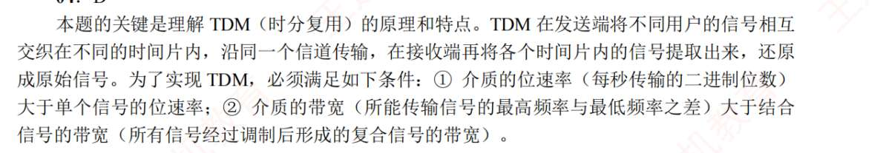
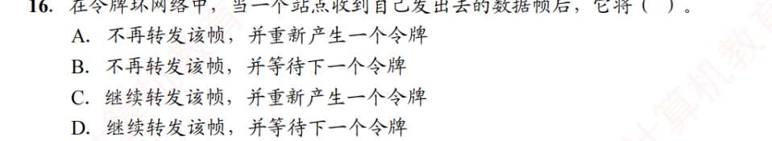
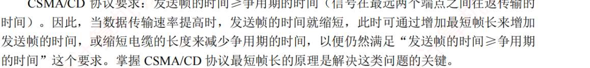
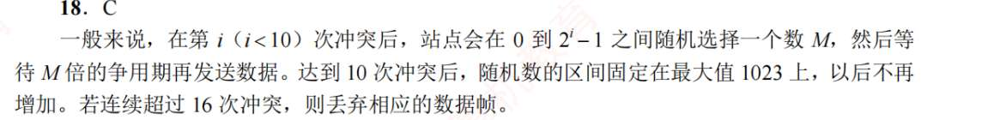
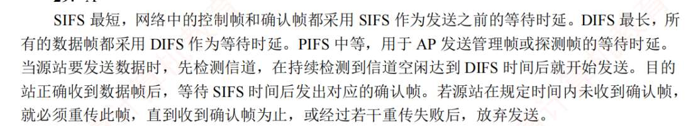

# 差错控制
1. C
   CRC 可以检测出所有单比特错误（记住该结论即可）
2. A
3. A
4. ？
   **1. 什么是码距 (Hamming Distance)？**
	码距就是两组合法编码之间，最少有几个比特位不一样。
	*   如果码距是 1：你改 1 位就变成了另一个合法编码，完全没法检错。
	*   如果要**检错**：码距得加大，让你改了之后变成一个“非法编码”。
	*   如果要**纠错**：码距得更大，让你改了之后，虽然非法，但离“正确的那个”最近，离“另一个合法的”很远。
	
	**2. 核心公式（必考）：**
	假设我们要检测 $e$ 个错误，纠正 $t$ 个错误，最小码距 $d$ 应满足：
	
	1.  **仅为了检错 $e$ 位**：$d \ge e + 1$
	2.  **仅为了纠正 $t$ 位**：$d \ge 2t + 1$
	3.  **同时检错 $e$ 位且纠正 $t$ 位**：$d \ge e + t + 1$ （通常 $e > t$）
	
	**3. 带入本题：**
	题目要求：**纠正** 2 比特错误，即 $t = 2$。
	带入公式：$d \ge 2 \times 2 + 1 = 5$。
	
	**为什么是 5？（直观理解）：**
	*   想象两个合法码 A 和 B，它们之间距离是 5。
	*   如果 A 错了 2 位，它现在离 A 的距离是 2，离 B 的距离是 3（$5 - 2 = 3$）。
	*   计算机一看：这个错码离 A 最近，那它肯定是 A 变过来的。**纠错成功！**
	*   如果码距只有 4：A 错了 2 位，距离 A 是 2，距离 B 也是 2（$4 - 2 = 2$）。计算机就懵了：这到底是从 A 变过来的还是从 B 变过来的？没法纠错。
5. B
6. B
7. ,
8. D
9. ，
   题目给出的编码集有 4 个码：
	1.  $C_1: 1001\ 1010$
	2.  $C_2: 0101\ 1100$
	3.  $C_3: 1111\ 0000$
	4.  $C_4: 0000\ 1111$
	
	我们要两两对比，找它们之间**最少**有几位不同：
	*   **$C_1$ vs $C_2$**：第 1, 2, 6, 7 位不同，共 **4** 位。
	*   **$C_1$ vs $C_3$**：第 2, 3, 5, 7 位不同，共 **4** 位。
	*   **$C_1$ vs $C_4$**：第 1, 4, 6, 8 位不同，共 **4** 位。
	*   **$C_2$ vs $C_3$**：第 1, 3, 5, 6 位不同，共 **4** 位。
	*   **$C_2$ vs $C_4$**：第 2, 4, 7, 8 位不同，共 **4** 位。
	*   **$C_3$ vs $C_4$**：8 位全部不同，共 **8** 位。
	
	**结论：该编码集的最小码距 $d = 4$。**
	
	---
	
	### 第二步：套用公式算能力
	
	既然我们已经算出了最小码距 $d = 4$，直接带入那两个核心公式：
	
	#### 1. 检错能力 ($e$)：
	公式：$d \ge e + 1$
	带入：$4 \ge e + 1 \implies e \le 3$
	**结论：能 100% 检测出不超过 3 位的错误。**
	
	#### 2. 纠错能力 ($t$)：
	公式：$d \ge 2t + 1$
	带入：$4 \ge 2t + 1 \implies 3 \ge 2t \implies t \le 1.5$
	由于纠错位数必须是整数，所以 $t = 1$。
	**结论：能纠正不超过 1 位的错误。**
	
	---
	
	### 第三步：对比选项
	
	*   A. 不超过 2 位检错... (不全面，我们可以检测到 3 位)
	*   B. 不超过 2 位检错... (同上)
	*   **C. 不超过 3 位检错、不超过 1 位纠错。** (完美匹配我们的计算结果)
	*   D. 不超过 3 位检错、不超过 2 位纠错。 (纠错算多了，$2 \times 2 + 1 = 5$，码距 4 够不着)
	
	**正确答案：C**
	
	---
	
	### 深度理解（直观模型）：
	为什么码距 $d=4$ 的时候，纠错只能纠 1 位，而检错能检 3 位？
	
	想象你在大海上有两个岛 A 和 B，它们相距 **4 公里**：
	1.  **检错**：只要你偏离 A 岛的距离小于 4 公里（比如走了 1, 2, 3 公里），你就不在岛上。所以我百分之百能发现你“出错了”。
	2.  **纠错**：
	    *   如果你只偏离了 **1 公里**，你离 A 岛 1 公里，离 B 岛 3 公里。我一看，你离 A 最近，把你拉回 A。**纠错成功。**
	    *   如果你偏离了 **2 公里**，你正好在 A 和 B 的正中间（距离都是 2 公里）。我虽然知道你出错了，但我不知道该把你往 A 拉还是往 B 拉。**此时无法纠错。**

# 流量控制，可靠传输
1. A
2. B
3. D
4. A
5. D
6. D
7. B
8. D?
   SR 接收方可以先收下失序但序号仍落在接收窗口内的数据帧，GBN 接收方必须按序接收数据帧
9. C
	   1. **初始状态：** 发送方发送了 0、1、2、3、4、5、6 号帧。此时这些帧都在发送窗口内，属于“已发送但未收到确认”的状态。
	    
	2. **收到 ACK 5：** GBN 协议采用的是**累积确认**机制。收到 5 号数据帧的确认，意味着 0~5 号帧都已经成功被接收方按序接收了。
	    
	3. **窗口滑动：** 发送方的窗口向前滑动（题目中说的“向后”指的是沿着序号序列往后移），跳过 0~5 号，此时窗口的下沿（最老的一个未确认帧）变成了 **6 号帧**。
	    
	4. **窗口容量计算：** 发送窗口的总大小 $W_T$ 包含两部分：
	    
	    - **已发送但未确认的帧：** 目前只有 **6 号帧**（占据 1 个位置）。
	        
	    - **可用且未发送的帧（即还可以发送的数量）：** 题目已知为 **6 个**。
	        
	        因此，发送窗口的总大小 $W_T = 1 + 6 = 7$。
	        
	5. **计算比特数：** 对于 GBN 协议，如果采用 $n$ 比特对帧进行编号，发送窗口的最大尺寸必须满足 $W_T \le 2^n - 1$。
	    
	    代入我们的结论：$7 \le 2^n - 1$，即 $2^n \ge 8$，解得 $n \ge 3$。所以最少需要 3 位给数据帧编号（选 A）。
	    

	如果当时 6 号帧也收到了 ACK，那么窗口内“已发送未确认”的帧为 0，此时它才能一口气再发送 7 个全新的帧。
10. ?
	 “当计时器超时时”，没描述是谁超时？
	
	这是一个非常经典的问题！之所以没有描述“谁的计时器”，是因为在 GBN 协议的标准实现中，**发送方通常只有一个单一的计时器（Single Timer）**。
	
	与选择重传（SR）协议为每一个发送的帧都配置一个独立的计时器不同，GBN 为了简化设计，做了如下设定：
	
	1. **计时器绑定对象：** 这个唯一的计时器，永远只负责倒计时**发送窗口中最老的那个未确认帧**（即窗口下沿的帧）。
	    
	2. **场景推演：**
	    
	    - 发送了 0 到 6 号帧。
	        
	    - 收到了 1、2、4 号的确认。由于 GBN 的**累积确认**特性，收到 4 号帧的 ACK，就默认 0、1、2、3、4 号帧都已经顺利到达了（即使 0 和 3 的 ACK 丢失了也没关系）。
	        
	    - 此时，发送窗口滑动，窗口的最老未确认帧变成了 **5 号帧**。
	        
	    - 刚才提到的那个**唯一的计时器，此时就被重置并绑定在了 5 号帧上**。
	        
	3. **发生超时：** 题目说“当计时器超时”，指的就是**保护 5 号帧的这个计时器超时了**。
	    
	4. **重传动作（Go-Back-N）：** 顾名思义，“后退 N 帧”。一旦最老的帧（5 号帧）超时，发送方会认为从 5 号帧开始，后面的所有帧（无论是否发送过、无论接收方是否其实已经收到了）都可能出了问题。因此，发送方会把窗口内从 5 号帧开始的所有已发送帧全部重传。
	    
	    - 当前窗口内已发送未确认的是：5 号、6 号。
	        
	    - 因此，需要重传的帧的数量是 **2 个**（即 5 和 6，选 B）。
	- ### 情况一：如果是“确认帧 ACK 3”在半路上丢失了（我上文提到的情况）
	- 
	- 假设接收方完美地按顺序收到了 0、1、2、3、4 号数据帧，并且对每一个都发出了 ACK。但在返回的路上，**ACK 3 不幸被路由器丢弃了，而 ACK 4 成功到达了发送方**。
	- 
	- - **发送方视角的推理：** 发送方虽然没看到 ACK 3，但它收到了 ACK 4。因为 GBN 采用的是**累积确认**机制，发送方非常清楚接收方的“死板”性格。发送方知道：“接收方只有在完美收到 0、1、2、3 的前提下，才有可能吐出 ACK 4。既然我收到了 ACK 4，说明数据帧 3 绝对已经安全抵达了。”
	-     
	- - **结果：** 所以即使 ACK 3 丢了也“没关系”，发送方直接向前滑动窗口，继续发新数据。
	-     
	- 
	- ### 情况二：如果是“数据帧 3”在去程半路上就丢失了（你担忧的情况）
	- 
	- 如果数据帧 3 根本就没送到接收方，那么**发送方是绝对不可能收到 ACK 4、ACK 5 的**。
	- 
	- - **GBN 接收方的铁律：只按序接收，绝不跳级。**
	-     
	- - 接收方顺利收到了 0、1、2 号帧，此时它眼巴巴地等着 3 号帧。
	-     
	- - 结果 3 号帧在网络中丢失了，紧接着 4 号帧、5 号帧到了。
	-     
	- - 接收方一看：“不对啊，我要的是 3，你怎么给我 4 和 5？” 此时，接收方会**无情地把 4 号和 5 号帧直接丢弃**。
	-     
	- - 不仅丢弃，接收方还会一直向发送方发送 **ACK 2**（表示：“喂！我目前完美收到的最后一张牌是 2，赶紧给我发 3！”）。
	-     
	- - **结果：** 发送方因为一直等不到 ACK 3 或更高的 ACK，最终 3 号帧的超时计时器耗尽（触发第 10 题的那种情况），发送方只能自认倒霉，把 3、4、5 甚至 6 重新打包，再次发送（这就是**后退 N 帧**名字的由来）。

11.  C
12. C
13. C
    
14. C
15. C
16. D
17. D (好题)
18. B?
    流量控制是实现发送方与接收方速度一致，措施是接收方向发送方反馈信息
19. C
20. D
21. C
22. C
23. B
24. C
25. ？
    ### 第一步：计算发送一个帧并收到其确认所需的总时间（一个周期 $T$）

	我们从发送方开始发送第一个数据帧算起，直到收到这个帧的 ACK 为止，这算作一个完整的交互周期。
	
	1. **发送时延 ($t_{trans}$)**：把一个帧的数据推到线路上需要的时间。
	    
	    - 数据帧长 $L = 1000 \text{ Byte} = 1000 \times 8 = 8000 \text{ bit}$
	        
	    - 信道带宽 $B = 100 \text{ Mb/s} = 100 \times 10^6 \text{ b/s}$
	        
	    - 发送时延 $t_{trans} = L / B = 8000 / (100 \times 10^6) = 0.00008 \text{ s} = 0.08 \text{ ms}$
	        
	2. **往返传播时延 ($2 \times t_{prop}$)**：数据在路上跑的时间。
	    
	    - 题目给出单向传播时延 $t_{prop} = 50 \text{ ms}$
	        
	    - 去程 + 回程（ACK）的传播时延 = $50 \times 2 = 100 \text{ ms}$
	        
	3. **ACK 发送时延**：题目说了“利用一个短帧（忽略其传输延迟）”，所以算作 $0$。
	    
	
	所以，一个完整的周期时间 $T = t_{trans} + 2 \times t_{prop} = 0.08 \text{ ms} + 100 \text{ ms} = 100.08 \text{ ms} = 0.10008 \text{ s}$。
	
	### 第二步：计算在这一个周期 $T$ 内，发送方最多能发送多少数据
	
	因为使用的是 GBN 协议，发送窗口大小是 1000。这意味着在没有收到任何 ACK 的情况下，发送方最多只能连续发送 1000 个帧。
	
	- 一个周期内最多发送的数据量 = $W_T \times L = 1000 \text{ 个帧} \times 8000 \text{ bit/帧} = 8,000,000 \text{ bit}$。
	    
	
	### 第三步：计算受窗口限制的平均传输速率
	
	如果发送方把这 1000 个帧发完了，第一个帧的 ACK 还没回来，它就必须停下来等。那么它在这个周期 $T$ 内的平均速率就是：
	
	- 窗口限制速率 = 一个周期内发送的总数据量 / 周期时间
	    
	- 窗口限制速率 = $8,000,000 \text{ bit} / 0.10008 \text{ s} \approx 79,936,051 \text{ b/s} \approx 80 \text{ Mb/s}$
	    
	
	### 第四步：对比瓶颈，得出结论
	
	- 信道物理带宽是：**100 Mb/s**
	    
	- 因为窗口大小限制，协议能跑出的最大速率是：**约 80 Mb/s**
	    
	
	由于 $80 \text{ Mb/s} < 100 \text{ Mb/s}$，说明信道没有被喂饱。发送方发完 1000 个帧大约只需要 $0.08 \text{ ms} \times 1000 = 80 \text{ ms}$，而在剩下的 $100.08 - 80 = 20.08 \text{ ms}$ 时间里，发送方因为窗口耗尽只能闲置等待。
	
	所以，主机甲可以达到的最大平均数据传输速率约为 **80 Mb/s**。**正确答案选 C。**
26. B
27. D
28. B
29. D
30. B
31. D

# 介质访问
1. AC
   信道划分不等于“集中控制”
2. B?
   介质访问控制并不等于确认可靠传输服务，而那可靠传输只是“帧纠错“？”为何说能否实现带确认的可靠传输服务与介质访问控制子层无关
   在局域网标准中，数据链路层被拆分成了两个子层：

	- **MAC 子层 (Media Access Control, 介质访问控制)：** 靠近物理层。
	    
	- **LLC 子层 (Logical Link Control, 逻辑链路控制)：** 靠近网络层。
	    
	
	你可以把网络传输想象成寄快递：
	
	**1. MAC 层的职责是“交通规则”和“查错”，不负责“善后”** MAC 层主要管两件事：
	
	- **谁能上路？**（比如：令牌环网里谁拿到令牌谁发报，以太网里 CSMA/CD 规定信道空闲才能发）。
	    
	- **包裹在路上有没有破损？** 接收方的 MAC 层会进行循环冗余校验 (CRC)。如果发现数据帧在传输过程中因为电磁干扰等原因坏掉了，MAC 层的做法非常简单粗暴：**直接丢弃，并且什么都不说**。它**不会**通知发送方“我丢了一个包，你重发一下”。
	    
	
	**2. 可靠传输需要“确认”和“重传”机制** 所谓的“带确认的可靠传输服务”，意味着发送方必须明确知道接收方收到了数据，如果没有收到，发送方要有超时重传的机制。
	
	- 这种复杂的逻辑会极大地消耗网络底层设备的资源并降低传输效率。
	    
	- 因此，网络协议设计者将“可靠传输”的责任**往上层推**了。在早期的 IEEE 802 标准中，LLC 子层可以提供这种服务；而在现代网络中，这种可靠性几乎全部交由**传输层的 TCP 协议**来负责。
3. B
4. ?
   
5. B
6. B
7. D
   随机访问介质的，都有可能冲突
8. C
9. C
10. C
11. B
12. D
    令牌环网适合负载重的情况，因为即使负载重它也无冲突
13. A
14. C
15. A
16. D
    
    
17. B
18. C
19. A
20. B
21. B

# 局域网

1. ，
   Base 前的数字代表 Mb/s，Base 本身指曼彻斯特编码，后面的 5 火 2 表示每段电缆最长为 500m/200m。T 是双绞线，F 是光纤
	- . **Base**: Baseband（基带传输）。
	    
	- **T**: Twisted Pair（双绞线）。
	    
	- **F**: Fiber（光纤）
2. A
3. ,
   以太网中数据是帧的形式，报文要分数据块要加控制信息，故而是分组传输
4. A
5. B
6. C?
   域名解析是 IP 地址。MAC 地址是“ARP”查的
7. D？
	能实现全双工通信的，就不采用 CSMA/CD 了
8. ？
   以太网帧，622N4，N 最少是 46。但若是 802.1Q 标准，数据字段还会强行插入 4B 的 VLAN 标签，故而至少 42B。题目给了 40B，我们要填充 2B
9. C？
   以太网中，网卡收到帧的目的 MAC 地址不是自己的，直接丢弃，不报告网络层，为什么？那会有谁有“报告网络层”这种动作
   
   在共享介质的以太网中（比如早期的集线器网络），网卡物理上能接收到网络上所有的电信号。但大多数数据并不是发给它的。如果网卡把收到的每一个帧都交给 CPU 处理，那 CPU 每天什么都不用干了，光处理垃圾信息就卡死了。
   
   如果网卡收到了一个完整的帧，进行了 CRC 校验发现没错误，**并且**目的 MAC 地址是它自己的（或者广播 `FF-FF-FF-FF-FF-FF`），这时候网卡就会：
	
	- 把以太网帧的“头”和“尾”剥掉。
	    
	- 把里面装的“货物”（即 IP 数据报）提取出来。
	    
	- **触发一个硬件中断，通知操作系统的网络协议栈（网络层 IP 协议）**：“嘿，有你的包裹，查收一下。” 这也就是所谓的“上报网络层”。
10. C
11. B
    争用期的理解，
12. B
13. 同 11
    
14. D
15. C
16. D
17. ?
    **截断二进制指数退避算法**。

	这个算法规定：**等待的时间必须是“争用期 $2\tau$”的整数倍。**
	
	1. **确定该网络的争用期 $2\tau$：**
	    
	    - _记住一个常识_：标准的 10Mb/s 以太网，争用期固定为 $51.2 \mu\text{s}$。
	        
	    - 题目是 **100Mb/s** 以太网，速度快了 10 倍，所以发送同样比特数需要的时间缩短为 1/10。
	        
	    - 因此，100Mb/s 以太网的争用期 $2\tau = 5.12 \mu\text{s}$。
	        
	2. **计算退避时间：**
	    
	    - 公式：退避时间 $= r \times 2\tau$
	        
	    - $r$ 是从集合 $\{0, 1, ..., 2^k - 1\}$ 中随机取的一个数。
	        
	    - $k = \min(\text{重传次数}, 10)$。
	        
	    - 题目说是**第二次重传**（意味着之前已经冲突了 2 次），所以重传次数 $n = 2$，此时 $k = 2$。
	        
	    - 所以 $r$ 的取值范围是 $\{0, 1, 2, 2^2-1\}$，即 $\{0, 1, 2, 3\}$。
	        
	3. **求最大等待时间：**
	    
	    - 题目问的是“最大”退避时间，显然当随机数 $r$ 取最大值 **3** 时等待最久。
	        
	    - 最大等待时间 $= 3 \times 2\tau = 3 \times 5.12 \mu\text{s} = 15.36 \mu\text{s}$。
	        
	
	**答案是 B。**
18. D
    
19. B
20. A
21. ?
    **同轴电缆无中继最大长度是多少？**

	这个确实是 IEEE 802.3 的早期标准规定，**答案是 A (500m)**。
	
	**怎么记？为什么这么定？** 这涉及物理上的**信号衰减**。早期的以太网使用粗同轴电缆（被称为 10BASE5 标准，那个 '5' 其实就是暗示 500 米）。电信号在铜线里传输，跑得越远，信号就越弱、波形就越糊。如果超过 500 米还不加中继器（Repeater，用来把信号重新放大），接收端就会分不清这是正常的数据 0 和 1，还是网络噪音，同时也无法准确检测冲突。所以这是基于当时线材物理特性的工程极限给出的死规定。
22. ?
	**题目核心：哪个以太网只能工作在全双工模式？**
	
	这题表面是背诵，其实**极其精彩**，它恰恰印证了我们前面讨论的“最小帧长与争用期 $2\tau$”的矛盾！**答案是 D (10 吉比特以太网，即万兆以太网)**。
	
	**背后的故事（理解了绝对忘不掉）：**
	
	我们之前得出过一个公式：**最小帧长 $= \text{发送速率} \times 2\tau$**。
	
	在 10M 和 100M 时代，CSMA/CD（半双工，大家抢信道，会冲突）玩得挺好。
	
	但当速度飙升到 **10 吉比特 (10Gbps)** 时，发生了一个致命问题：发送速率太快了！
	
	如果还要坚持用 CSMA/CD：
	
	- **方案一（保持 64 字节最小帧长不变）：** 那么算出来的 $2\tau$ 就会极其微小，这意味着网络的物理跨度只能有**十几米**！这显然没用，谁家拉网线只拉 10 米？
	    
	- **方案二（保持合理的传输距离，比如 100 米）：** 那么算出来的最小帧长将会极其巨大，导致传输效率极低。
	    
	
	**工程师的最终决定：直接掀桌子！**
	
	既然速度这么快，CSMA/CD 协议的物理限制已经成了累赘，那我们就**彻底废弃 CSMA/CD**！
	
	在万兆 (10Gbps) 及以后的标准中，大家**不再共享信道**，全部强制使用**交换机**，每根网线两头直接对话，一条线发、一条线收（这就是**全双工**），**物理上绝对不可能发生冲突**。
	
	既然不会冲突了，还要啥冲突检测（CD）？所以 10 吉比特以太网直接淘汰了半双工模式。
	
23. D
24. C
25. ?
    - **关于 B 选项（编码方式）：** 曼彻斯特编码的特点是“每一个比特（0 或 1）的中间都要发生一次电平跳变”。这意味着它的信号频率是数据传输率的两倍（即 50% 的编码效率）。
    
    - 在 **10Mb/s** 的早期以太网中，用曼彻斯特编码毫无压力，线缆完全扛得住。
        
    - 但在 **1Gbps (1000Mb/s)** 的吉比特以太网中，如果继续用曼彻斯特编码，信号频率会飙升到 2GHz！普通的双绞线或低端光纤根本无法传输这么高频率的信号。因此，吉比特以太网使用的是更高效的编码（如光纤 1000BASE-X 用的是 **8B/10B** 编码，双绞线 1000BASE-T 用的是 **PAM-5** 调制）。
        
	- **关于 A 选项：** 支持。为了防止接收端处理不过来，支持 802.3x 流量控制。
	    
	- **关于 C 选项：** 正确。由于网速高达 1Gbps，发送一个数据帧的时间（发送时延）极短，此时数据在网线里的物理传播时间（传播时延）就成了主要的制约因素。
	    
	- **关于 D 选项：** 正确。吉比特以太网标准里依然保留了半双工模式（为了向后兼容，引入了载波延伸和分组突发技术），但实际应用中基本都是配合交换机使用全双工模式。到了 **10 吉比特（万兆）以太网**，才彻底废除了半双工。
26. B
27. B
    CA 协议只能尽量避免冲突，不能 100%避免仍有退避算法。有确认帧机制
28. C
    
29. ?
    
30. C
31. 来自 AP 止中起
32. ？
33. 
