# IPV4

418，首总偏

若 IP 数据大于数据链路的 MTU，就需要执行分片操作

分片操作，就需要首部的一些信息了。

即标识，标志后两位（MF，DF），片偏移。

## IPv4地址

**IPv4 地址本质上是 32 bit：**

xxxxxxxx. xxxxxxxx. xxxxxxxx. xxxxxxxx

也就是：

8 bit . 8 bit . 8 bit . 8 bit

我们平时写成：

192.168.1.1

只是为了人类好读，把每 8 bit 转成一个十进制数。

#### 网络号

表示：

> 这台设备属于哪个网络。

类似于“哪个小区”“哪个班级”“哪栋楼”。

#### 主机号

表示：

> 在这个网络里面，它是哪一台设备。

类似于“这个小区里的哪一户”“这个班里的哪一个学生”。

## 子网

主机号太多，
就可以拿主机号的几位，作为“子网号”。

属于是虽然供应商分配的网络号，但我们感觉不够分？所以人为添加？

假设原来有一个 C 类网络：

192.168.1.0

按传统 C 类地址：

网络号：192.168.1  
主机号：最后 8 bit

也就是：

192.168.1. x

最多可以放大约 254 台主机。

问题来了：如果一个学校里有 4 个部门：

教学楼  
宿舍楼  
实验室  
办公楼

你不一定想让它们都在同一个大网络里。因为同一个网络太大，广播多，不好管理，也不安全。

于是就可以把最后 8 bit 的主机号拆开：

原来：  
网络号主机号  
192.168.1 | 8 bit  
  
现在：  
网络号子网号主机号  
192.168.1 | 前 2 bit | 后 6 bit

这样就从一个大网络切成了 4 个小网络。

比如用 `/26`：

192.168.1.0/26  
192.168.1.64/26  
192.168.1.128/26  
192.168.1.192/26

原来是：

1 个网络，每个网络最多约 254 台主机

现在变成：

4 个子网，每个子网最多约 62 台主机

子网掩码的核心意义是：

> 告诉设备：IP 地址的前多少 bit 是网络部分，后多少 bit 是主机部分。

比如：

IP 地址：192.168.1.130  
子网掩码：255.255.255.192

这个掩码对应二进制是：

11111111.11111111.11111111.11000000

也就是 `/26`。

意思是：

前 26 bit：网络号/子网号  
后 6 bit：主机号

## 无分类编 IP 地址

CIDR 地址块，
就是网络段可变长而已？

### 路由聚合

## 网络地址转换

借助端口号，扩充“IP”，

## ARP

主机至少有一个 MAC
路由器有多个 MAC，

MAC 地址是由“网络适配器”决定的，
> 例子：
> 
> - 你的笔记本有一块 Wi-Fi 网卡 → 一块 MAC 地址
> - 你的台式机可能有 Wi-Fi + 有线网卡 → 两个 MAC 地址

 **路由器的 MAC**

- 路由器有多个接口（WAN、LAN），每个接口都有一块网卡 → 每个接口一个 MAC
- 所以一个路由器可能有好几个 MAC 地址

ARP 是，广播找人，单帧回复

## DHCP

DORA！

# ICMP

# IPV6
128 位 IP 地址

压缩记法：
去除每分段的前导 0，进一步，双冒号替代连续出现的多个 0

# 路由算法

内部网关协议（Interior Gateway Protocol），一个自治系统内。 
外部网关协议（EGP），用于自治系统（AS）之间的路由选择

## RIP
Routine Information Protocol

更新过程：

从邻居发来的路由表报文，全收！但是，举例+1，报文的原“下一跳”字段改为邻居。
同一接收后，再进行检查更新 

**同一个下一跳：无条件更新距离，变短变长都改。**  
**不同下一跳：只有更短才改。**

优缺点：

## OSPF
Open Shortest Path First

再就是，可以负载均衡；可以防 hack；可以带序号标记时间远近 

每隔 10 秒向直接邻居发送 Hello 分组，

R1有了新邻居，先增加自己对这个邻居的路，并洪泛泛

但此时，整个 LSDB 还没有这个邻居为头节点的邻接表。

接着，R1 和这个邻居，相互发送 DD 分组，给自己 LSA 的头信息

互相发 LSR 分组，两者互相请求缺少的 LSA，

发送 LSU 分组，补上

一补上，又会洪泛

LSU 补上后，还会互相返回 LSAck 分组

 LSU 分组不是特殊名词，洪泛时发出的数据包也叫 LSU 分组。

## BGP

BGP 是外部网关协议
**Border Gateway Protocol（边界网关协议）**。
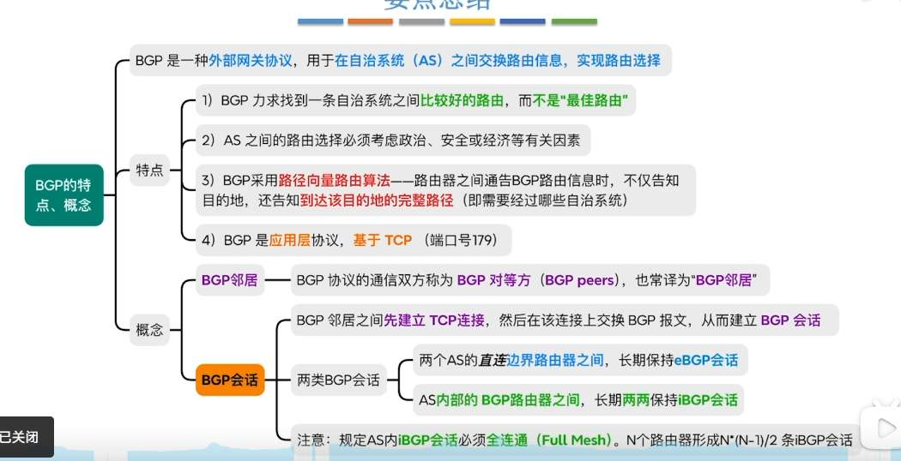

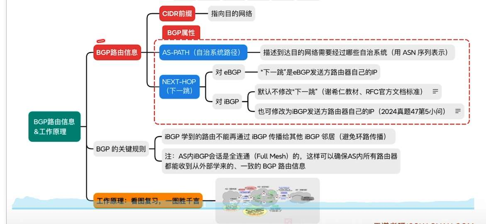

https://www.bilibili.com/video/BV19E411D78Q?spm_id_from=333.788.videopod.sections&vd_source=75bbed22d60140f515b7fda5f0bd532d&p=68

### 一、 BGP 路由信息：一张带“签证”的“导航图”

当一台 BGP 路由器向别人发送路由时，它发送的内容主要包含三部分：

1. **CIDR 前缀 (目的地)：** 这很简单，就是告诉别人“我要去哪个网段”，比如 `10.0.0.0/8`。
    
2. **AS-PATH (自治系统路径)：** 这就像是护照上的**签证盖章**。
    
    - 路由每经过一个自治系统 (AS)，就会把这个 AS 的编号 (ASN) 加到列表里。
        
    - **核心作用是防环：** 如果一个路由器收到一条路由，发现 AS-PATH 里竟然有自己所在的 AS 编号，它会想：“这路线在外面绕了一圈怎么又回我这了？”，然后直接把这条路由丢弃。
        
3. **NEXT-HOP (下一跳)：** 这是最容易晕的地方。它指的是“为了到达目的地，你的下一步该把数据包扔给哪个 IP”。**eBGP 和 iBGP 对它的处理方式完全不同。**
    

---

### 二、 NEXT-HOP 的“变”与“不变” (核心难点)

- **对 eBGP (跨越不同 AS 之间的传递)：**
    
    - **规则：** 自动把下一跳改为**自己的 IP**。
        
    - **白话解释：** 中国电信 (AS1) 的边缘路由器把路由传给中国联通 (AS2) 时，会说：“你要去那个网段，下一跳直接找我 (我的 IP) 就行。” 这非常符合直觉。
        
- **对 iBGP (同一个 AS 内部的传递)：**
    
    - **默认规则 (不修改)：** 当 AS 内部的路由器 A 从外部学到一条路由，并传给内部的兄弟路由器 B 时，**默认不去修改下一跳**，依然保留外部那个路由器的 IP。
        
    - **为什么这么设计？** 官方标准认为，同一个 AS 内部应该依靠内部路由协议 (如 OSPF) 去找到那个边界出口，没必要让 BGP 再改一次 IP。
        
    - **现实/考试中的坑 (图里提到的“也可修改”)：** 默认不改下一跳经常会导致问题——内部路由器 B 可能根本不知道外部那个 IP 怎么走，导致路由失效 (下一跳不可达)。所以在实际工程和考试中，我们经常使用一条命令 `next-hop-self`，强制让路由器 A 告诉 B：“别管外面了，下一跳直接改成我的 IP，交给我来转发。”
        

---

### 三、 BGP 的关键规则：防止“内部八卦无限循环”

图中最下方提到的 **“iBGP 学到的路由不能再传给 iBGP”** 和 **“全连通 (Full Mesh)”**，是为了解决 AS 内部的环路问题。

- **问题背景：** 在 AS 外部，BGP 靠 `AS-PATH` (签证盖章) 防环路。但是在 AS 内部传递时，`AS-PATH` 是**不会增加**的。如果没有别的机制，路由在内部循环传递，就会形成死循环。
    
- **水平分割 (不准传话)：** 为了防环，BGP 定死了一条铁律：**从内部兄弟 (iBGP) 那里听来的路由，绝对不准再传给另一个内部兄弟。**
    
- **无奈的结果 (全连通 Full Mesh)：** 既然不允许互相传话，那如果 AS 边缘的路由器想让内部所有的路由器都知道这条外部路由，它就只能**亲自挨个去通知**。这就是为什么图里说“AS 内 iBGP 会话必须全连通”——网络里的每一台路由器，都必须互相建立直接的 TCP 建立 iBGP 连接，这就叫做 Full Mesh。

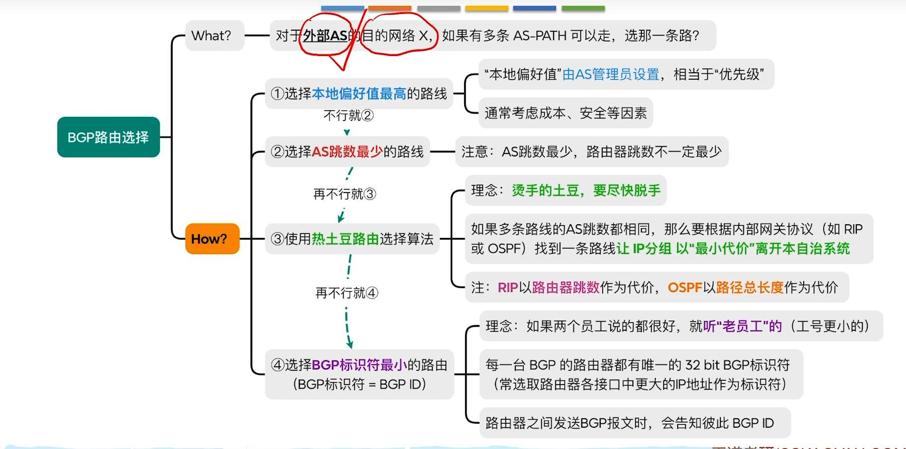

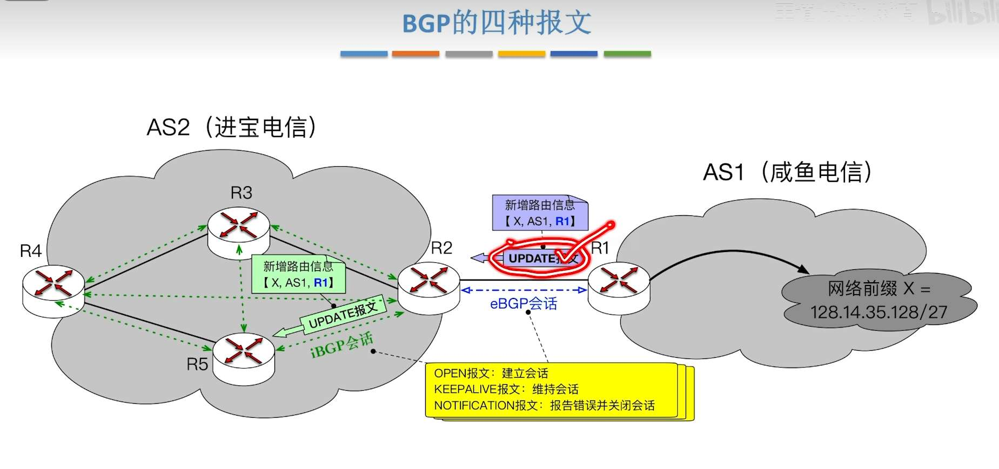

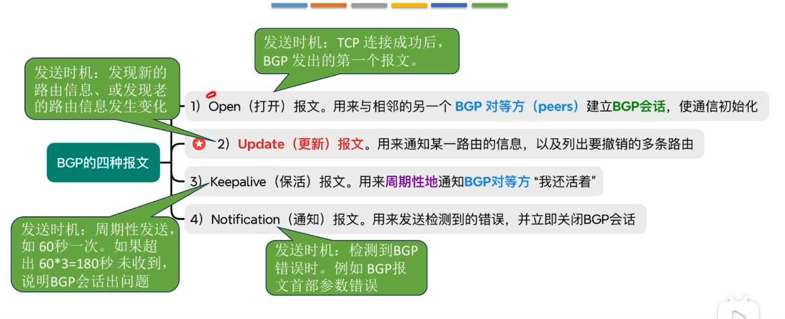

# IP 多播

IGMP 使用 IP 协议，属于网络层？ 这有什么矛盾吗？好像没有
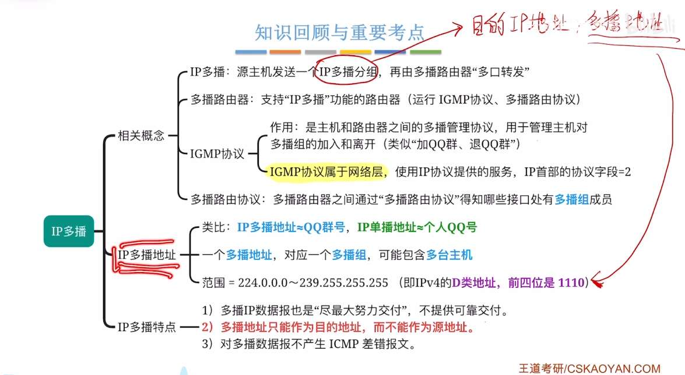

# 移动 IP

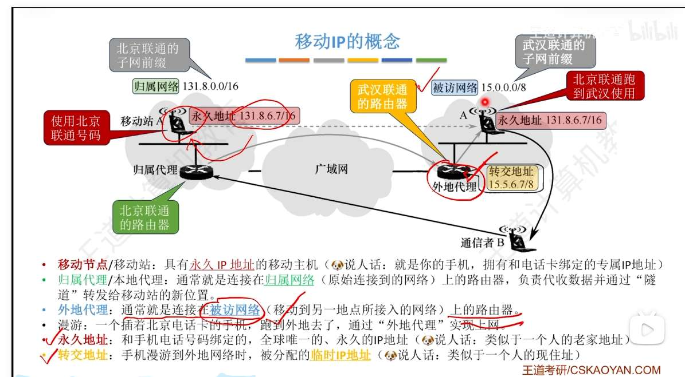### 核心痛点：为什么不能“直接通信”？

在传统的 IP 路由机制中，互联网上的路由器是靠网络前缀（网段）来指路的，它们非常“认死理”。

看着你发的图，假设你没有使用“移动 IP”技术：

1. 你的手机有一个永久 IP：`131.8.6.7`。
    
2. 全世界的路由器看到 `131.8.x.x` 这个前缀，大脑里只有一个条件反射：“**把这个包送到北京联通的网络去！**”
    
3. 现在，你坐高铁跑到了武汉（武汉联通的网段是 `15.x.x.x`）。
    
4. 此时，通信者 B 想要找你，他把数据包发向 `131.8.6.7`。
    
5. **灾难发生了：** 全网的路由器依然会把这些数据包傻乎乎地送到**北京**。但北京的基站一喊：“`131.8.6.7` 在不在？” 没人答应（因为你在武汉）。最终，这些数据包全部被丢弃。**你断网了。**
    

如果想不断网，传统的做法是你到了武汉后，必须换一个武汉当地的 IP（比如变成 `15.5.6.7`）。但一旦 IP 换了，你原来建立的所有 TCP 连接（比如正在打的微信视频、正在下的电影）会**瞬间全部中断**。

---

### 救世主：移动 IP 的意义（“寄快递”比喻）

为了解决“人离开了老家，别人按老地址寄信你收不到，且不想让别人知道你换了新地址”的问题，就必须引入图里的这套“移动 IP”机制。

我们用“转寄快递”的比喻，完美对应图中的概念：

- **永久地址（老家住址：131.8.6.7）：** 这是你对外公开的唯一联系方式。不管你走到天涯海角，通信者 B 找你，永远只填这个地址。B 根本不知道你去了武汉。
    
- **转交地址（武汉酒店房间号：15.5.6.7）：** 你到了武汉后，武汉当地网络临时借给你的一个合法“新身份”，有了它，武汉的路由器才认识你。
    
- **归属代理（留在老家的管家：北京路由器）：** 你离开北京前告诉这位管家：“我去武汉了，临时地址是 `15.5.6.7`，有我的信记得转寄给我！”。此后，所有 B 发给你的数据包到了北京后，管家会**代收**。
    
- **外地代理（武汉酒店前台：武汉路由器）：** 负责接应北京管家转寄过来的包裹，并递到你手里。
    
- **隧道（套娃快递袋）：** 北京的管家收到 B 发给你的信后，不能涂改原信，于是找了一个新的快递袋（新的 IP 头部）把原信装进去。新袋子上写着：收件人是“武汉外地代理 `15.5.6.7`”。这就叫“隧道转发”。

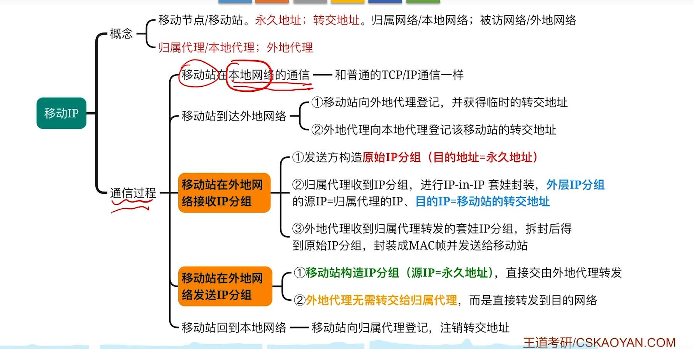

# 网络层设备

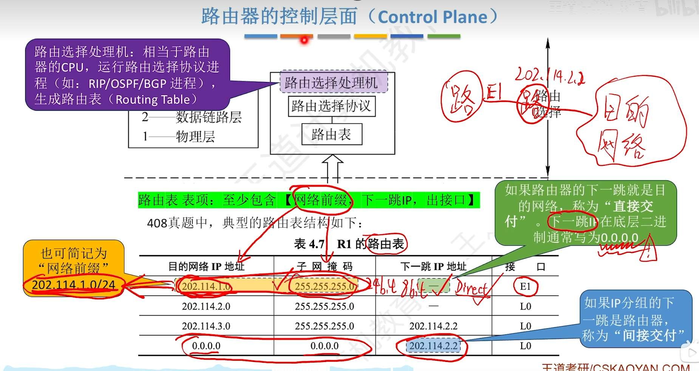

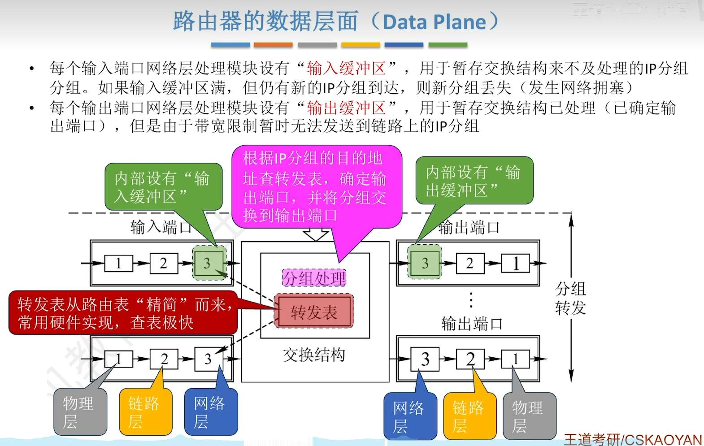

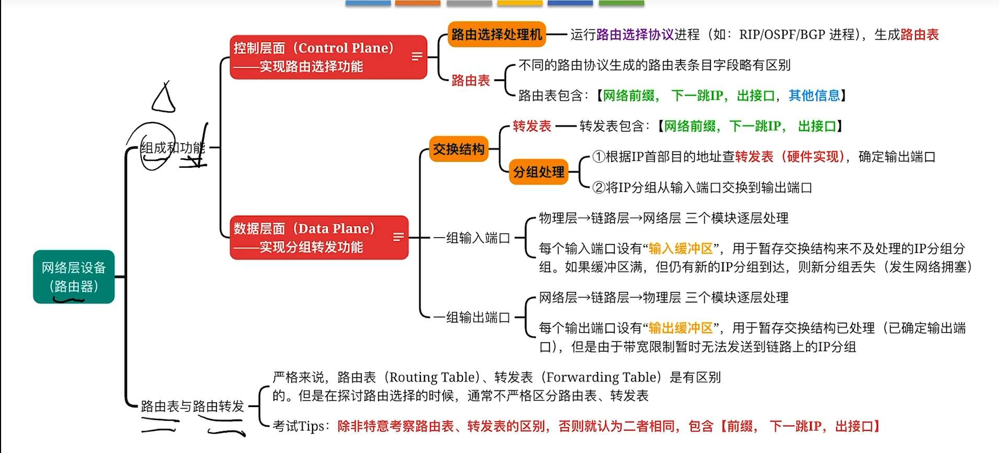