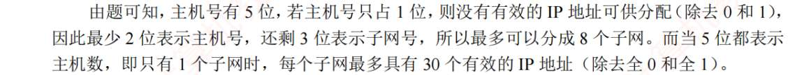
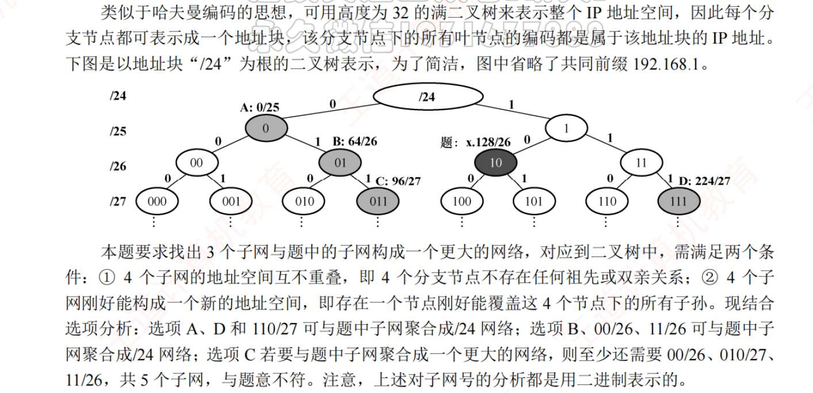
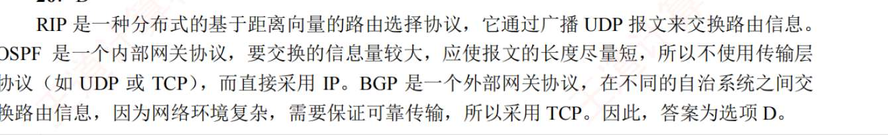
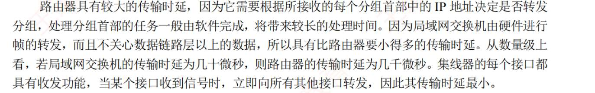

# 网络层的功能
1. C
2. D?
   拥塞的根据是，随着通信子网负载增加，吞吐量反而降低
3.  B？
   路由器向传输层及以上层隐藏下层的具体实现，物、数据链路、网络层协议可以不同
4. ？
   路由器的路由表，就是路由转发表吧？包含的是目的网络和到达该目的网络路径上的下一个路由器 IP 地址？不是转发接口吗？
5. C
6. C
   A 路由器机制是存储转发机制
7. B
8. D
9. ,
   虚电路一旦建立，所有分组都沿同一路径走。如果路径中某个结点或链路出故障，整条虚电路都会受影响。

	在故障率很高的网络中，更适合数据报方式。因为数据报每个分组可以独立选路，某条路径坏了，可以绕路。
10. ,
    虚电路是面向连接的，数据报是无连接的。
    数据报每个分组独立选路，不一定沿同一条路径，也不保证按序到达。
    电路建立后，分组中携带的是虚电路标识，比如 VCI，而不是每次都携带完整目的地址用于重新选路。
    虚电路中分组通常沿同一路径传输，一般按序到达。
11. D
12. D
13. D
    数据报服务中，每个分组都必须携带源地址和目的地址

# IPV4

1. C
2. B
3. C
4. ?
5. D
6. D
7. A
8. D
9. D
10. ?
    MTU
	- **全称**：Maximum Transmission Unit
	- **含义**：一条链路上能发送的**最大帧或数据报长度**（字节数）。
	- **用途**：如果 IP 数据报比链路 MTU 大，需要**分片**；每个分片的大小不超过 MTU。
	每个 IP 数据报都有唯一标识。当数据报被分片时，所有分片的“标识”都一样，方便目的主机重新组装。
	
	**DF (Don't Fragment，第 2 bit)**：禁止分片

	- DF = 1 → 不能分片，如果数据报超过链路 MTU，会丢弃并返回 ICMP 报文
	  
	  **MF (More Fragments，第 3 bit)**：还有更多分片
	  
	
11. C
12. ？
    注意最长匹配原则
13. ，
    IP 规定，C 类地址前 24 位网络位，后 8 位主机位 
14. A
15. ？
16. D
17. ？
    15-18 都是[特殊IP](卡片/特殊IP.md)
18. ?
19. ？
        255.255.240.0  
	= 11111111.11111111.11110000.00000000
	
	前面一共有：
	
	8 + 8 + 4 = 20 bit
	
	所以它是：
	
	/20
20. A
21. D
    子网划分能增加网络数量，是结果而不是目的。 
22. 

23. ？
    主机可以有多个 IP, 但一定是不同类网络
24. A
25. D
26. B
27. DA
28. B
29. C
30. .。
31. D
    目的主机重组分片
32. C
33. D
34. ?
35. D
36. ?
37. A
    为传统 IPv4 子网里，通常有两个地址不能给主机用：
	
	主机号全 0：网络地址  
	主机号全 1：广播地址
	新标准允许：
	
	/31 的两个地址都可以作为接口地址使用
		
	
38. D
39. D
40. ？
    
41. ？
    硬件地址只有本地意义
42. A
43. B
44. C
45. ？
46. C
47. D
48. A
49. C

# IPv6

1. D
2. D
   IPv6 的首部
3. C
4. D
5. D
6. A
7. ?

# 路由算法
1. B
2. B
3. A
4. B
5. ?
   采用分层路由后，每个路由器不知道如何去路由到其他区域
6. C?
   采用分层划分区域的方法使交换信息的种类增多，OSPF 协议更加复杂。
7. D?
   路由表能知道下一条 IP，MAC 不知道，MAC 是由 ARP 实现的
8. B
9. A
10. D
11. C
12. A
13. C
14. A
15. B
16. A
17. B
18. D
19. A
20. D
21. 需要记忆
22. B
23. ,
24. D
25. C
26. 
    
27. D

# 多播 IP
1. ？
2. ？
3. ？
4. ？

# 移动 IP
1. ？

# 网络层设备
1. D
2. C
3. C
   路由器可分割广播域
4. C
5. ？
   路由器是网络层，就要处理网络层及以下的功能
6. C
7. D
8. C
9. C
10. D
11. D
12. D
13. D
14. C
    
15. C
16. D
17. A
18. C
19. ?
20. C
    路由器也有差错检验 
21. C