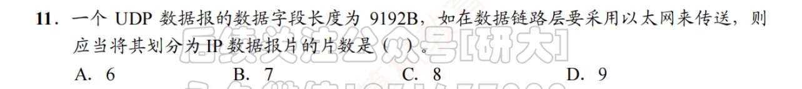
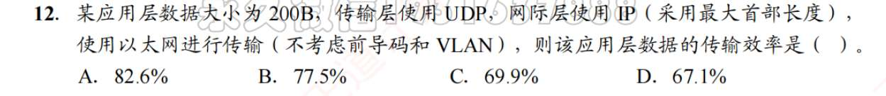
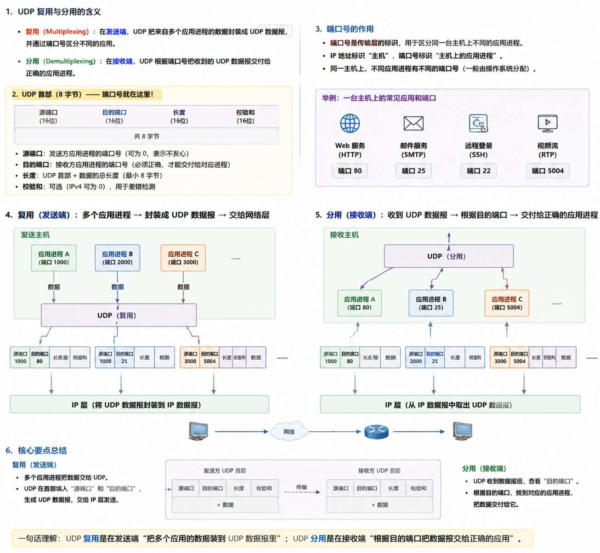
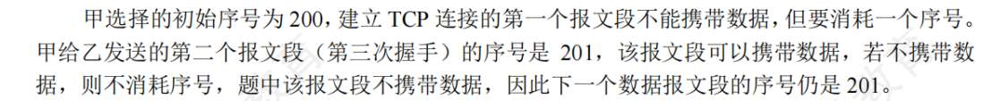

# 传输层的功能

1. C **端到端是进程到进程 点对点是主机对主机**
2. B
3. A  可靠和顺序交付，与面向连接无关吧 甚至可靠与能否顺序交付有关
	确实，没有深思面向连接到底带来了什么？  为什么说，面向连接时尽管下面的网络不可靠，但逻辑通信信道仍相当于一条全双工可靠信道？ 无连接则仍是不可靠 面向连接究竟带来了什么。
		主要原因就是，面向连接不仅仅是“初次见面，打招呼，建立连接” 而是“面向连接” = TCP = 可靠 + 有序 + 流量控制 + 拥塞控制  那这一下就能说通了 
4. D 
5. D
6. D
7. D
8. 怎么还要记这个熟知端口 D 答案为D
9. B ==端口应该是主机分配的==
	答案为A  这属于没审清题 题目问TCP和UDP俩个协议能不能共存一台主机，当然可以。我想的是，同一个主机下的TCP的有100端口 UDP就不能有100端口 因为端口是主机分配的 对吗
		**错误！端口是协议分配的！一个主机下 TCP有100端口 UDP也可以有100端口！毕竟发包的时候也要检测用哪个协议，所以不用担心搞混**
10. B
	传输层是第四层？ 应用--网络--传输 不是第三层吗？ 
		错 应用下来是传输  再是网络 而且是 是从下往上数的 应用层第五层 传输层第四层 网络层第三层  数据链路第二层 物理层第一场

# UDP
1. C  若TCP的话，可靠性由传输层负责？
	答案是B  
		- **数据链路层只能保证链路上的可靠性**：
    - 链路层（如以太网）可能会重传丢失的帧，但它只保证**相邻节点**之间的可靠传输。
    - 端到端经过多条链路时，每一跳可能都可靠，但整体路径仍可能丢包、乱序。
	- **UDP 端到端可靠性由应用层决定**：
	    - 如果你想可靠传输，应用层必须自己实现 ACK、重传或序号机制（比如 TFTP、DNS over TCP）。
	    - UDP 本身只提供**差错检测**（校验和），不做纠正。
2. B 肯定不包括伪首部的。 UDP 报头是个啥？是除了 UDP 首部剔除UDP检验和？
3. D 数据+首部长度而不是数据报首部长度
4. D
5. C
6. D
7. A
8. B
9. B
   接收方同样会自己生成伪首部来验证，不需要你把伪首部发送出去。
10. D
11. B
    
    **以太网 MTU**（最大传输单元）：通常 **1500B**（含以太网首部，但题目通常只考虑 IP 层）
    IP 数据部分 = MTU - IP 首部 (20B) - UDP 首部 (8B)
    9192 / 1472
    
12. 
    
    以太网首部+IP 首部+UDP 首部+数据+以太网尾部  
	= 14 + 20 + 8 + 200 + 4 = 246B
13. B
    每一条 IP 数据报的 TTL 会-1，所以会不断更新 IP 校验和 
14. ？
    
15. ？
16. 

# TCP

1. B 我没理解 其实我感觉都很对  主要模糊的就是B，到底什么是"链路”。 是不是不能保证到底顺序，好像没有东西能保证，只不过TCP能补救因为顺序不对造成的影响，把漏掉的安全重发？
	答案为C 
	**面向连接不仅是握手挥手，还意味着端到端顺序和可靠性**
2. A  这又是什么死记的点
	1. 
3. D  不是同一个主机，不同协议/相同协议都能相同端口号吗？ 
   [记忆--端口](卡片/记忆--端口.md)
4. D  
   **UDP才支持广播**
5. C  IP协议才有
6. B
7. D  协议字段忘了，  报头（就是首部吧？）长度忘了
	偏移字段单位是4B  单位！ 
8. B
9. C
10. A 发送窗口？  一共都有哪些窗口 得总结下
    [辨析--窗口](卡片/辨析--窗口.md)
11. D
	答案为C 
	**确认序号 ack，是指下一次希望接收的序号数！** 
12. A
13. C
14. C？？
	 答案为D 收到零窗口--启动等待计时（但这个名字为啥叫持续计时器，而不是时间等待计时器？计时器能总结下吗）---计时完毕发送探测报文--ack过来现在的窗口值--若还为0重置计时
15. ？？
	 40Gb 这里不是存储语境所以是 $40×10^9 bit$ 换为5...字节诶？为啥换成字节？因为 用2的32次方除以它
16. D
17. ？？
	参与 TCP 的任何进程都可以提出释放连接
18. C 都可以
19. A C
20. D
21. C
22. A 应应该是减 3 吧
	答案B  984-212 
23. C  啥是确认报？ 
24. B
25. D
26. ？
27. C
28. B
	答案为C 
	
29. C
30. A 
	C  是 B 为单位
31. C
32. B ##
	C？
33. D
34. D
35. B
TCP 的单位就算34. D  对哈所谓“指数增长”到底是凭什么这么说的
36. C
37. D？ 不是22吗
38. A
39. A
40. ？
41. 
42. C
43. ？应该是计算机视角吧 B
	A？？？？？？？？？？ 还是没懂
44. C
45. B
46. B 不过我在想为什么不是2014
47. A
48. B
	A 没问题
49. ?31\37 与32\6 哪有32
	A 
50. C
51. D
52. C
	 D  忘看单位
53. C?
54. D
	B. 
55. ？
56. A 这个第一个发送是干扰？

57. C
58. D 描述不清晰吧
59. 跟报文长度有啥关系？

