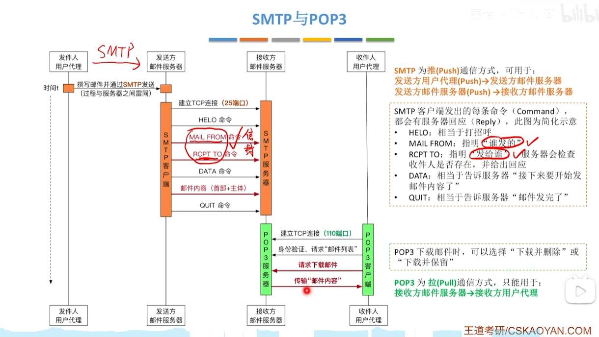
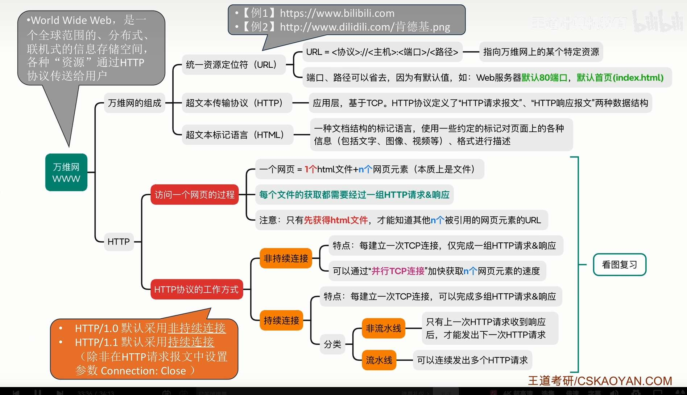
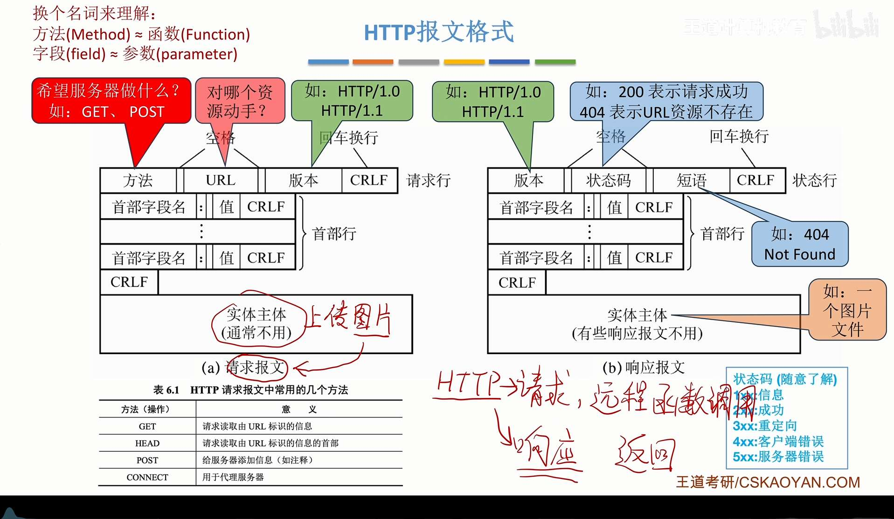

# 网络应用模型

# DNS

# FTP
File Transfer Protocol - 文件传输协议

最经典的三大应用层协议就是：

1. 看网页用的 **HTTP** (基于 TCP)
    
2. 发邮件用的 **SMTP/POP3** (基于 TCP)
    
3. 传文件用的 **FTP** (基于 TCP)

# 电子邮件

  

- **SMTP (Simple Mail Transfer Protocol)**：简单邮件传输协议。用于“**发邮件**”，在“用户到服务器”以及“服务器到服务器”之间传输。默认端口：25。
    
- **POP3 (Post Office Protocol 3)**：邮局协议第 3 版。用于“**收邮件**”，将邮件从服务器下载到本地。默认端口：110。
    
- **IMAP (Internet Message Access Protocol)**：交互式邮件存取协议。同样用于收邮件，但功能比 POP3 更强大，支持多端同步。

**MIME** 的全称是：**Multipurpose Internet Mail Extensions**  
（中文翻译：**多用途因特网邮件扩展**）

  
你说得非常对，计算机网络里的这些协议，初看确实有很多“缩写”和“步骤”需要背，但如果**理解了它们为什么要设计成这样**，记忆负担会减轻很多。

先回答你的问题：

### 1. MIME 的全称

**MIME** 的全称是：**Multipurpose Internet Mail Extensions**  
（中文翻译：**多用途因特网邮件扩展**）

---

### 2. 如何理解这些“记忆型”知识？

我们可以把电子邮件的传输想象成**“寄快递”**。理解了逻辑，细节就自然顺出来了。

#### A. 为什么需要 MIME？（包装盒说明书）

早期的电子邮件协议（SMTP）非常“土”，它**只能传输简单的英文（7 位 ASCII 码）**。

- **问题**：如果你想发一张图片、一个 PDF，或者写中文，SMTP 就“看不懂”了。
    
- **解决**：MIME 就像是在快递盒上贴了一个**说明书**。它告诉接收方：
    
    1. “这不是普通的纯文本，这是一张图片（image/jpeg）。”
        
    2. “它是用 Base64 编码过的，你得解码才能看。”
        
- **重点记忆**：MIME 让邮件变得“多才多艺”，支持了**非英语字符、附件、图片、视频**。

#### B. SMTP 的细节：对话式传输

SMTP（简单邮件传输协议）的工作方式非常像**两个人在打电话**，有一套固定的“礼貌用语”。你不需要死记硬背，看这个对话逻辑：

1. **打招呼**：HELO（或者 EHLO）—— “你好，我是 QQ 服务器。”
    
2. **报身份**：MAIL FROM —— “这封信是谁发的？”
    
3. **找收件人**：RCPT TO —— “这封信发给谁？（服务器会检查这个邮箱存在吗）”
    
4. **传内容**：DATA —— “接下来的内容才是正文。”（对应你图中红圈的“首部+主体”）
    
5. **挂电话**：QUIT —— “发完了，再见。”
    

- **逻辑点**：SMTP 是**“推”（Push）**协议。发件人把邮件“推”给服务器，服务器再把邮件“推”给对方服务器。
    

---

#### C. POP3 的细节：去信箱取信

POP3（邮局协议第 3 版）的逻辑是**“拉”（Pull）**。

- **身份验证**：你得提供账号密码（USER/PASS）。
    
- **下载模式**：它的典型特征是**“下载并删除”**（虽然现在可以设置保留副本，但协议原始设计是下载后服务器就不管了）。
    
- **对比 IMAP**：图中也提到了 IMAP，你可以把它理解为**“在线同步”**。你在电脑上读了邮件，手机上也会显示已读；而 POP3 通常是各管各的。
    

---

### 3. 学习建议：对比记忆法

你可以把这两个协议放在一起对比，就不容易混了：

|          |                               |                                  |
| -------- | ----------------------------- | -------------------------------- |
| 特性       | **SMTP**                      | **POP3**                         |
| **全称**   | Simple Mail Transfer Protocol | Post Office Protocol - Version 3 |
| **主要功能** | **发送**邮件、**中转**邮件             | **接收**（下载）邮件                     |
| **动作方向** | **推** (Push)                  | **拉** (Pull)                     |
| **常用端口** | **25**                        | **110**                          |
| **形象理解** | 邮差把信投进邮局/信箱                   | 你去邮局把信取回家                        |

# 万维网

在网络协议栈中，每一层产生的数据单位都有一个专业的学术名称，叫 **PDU（协议数据单元）**。

|           |            |                       |                   |
| --------- | ---------- | --------------------- | ----------------- |
| 层级        | 协议举例       | **数据单位名词**            | 形象理解              |
| **应用层**   | HTTP, SMTP | **报文 (Message)**      | 你写的“信”本身          |
| **传输层**   | TCP        | **报文段 (Segment)**     | 信太长了，剪成一段一段的      |
| **传输层**   | UDP        | **数据报 (Datagram)**    | 直接装进一个小包裹里        |
| **网络层**   | IP         | **数据报 / 分组 (Packet)** | 给包裹贴上地址标签         |
| **数据链路层** | 以太网, Wi-Fi | **帧 (Frame)**         | 放到特定的快递货架/运输箱里    |
| **物理层**   | 光纤, 网线     | **比特 (Bit)**          | 变成 0 和 1 的电信号/光信号 |

### 以“HTTP 请求”为例：它的封装全过程

当你点击浏览器访问一个网页时，数据的变化过程如下：

#### 第一步：应用层 —— 产生“报文” (Message)

- **动作**：浏览器构建一个符合 HTTP 格式的字符串。
    
- **名称**：这就是 **HTTP 请求报文**。
    
- **内容**：GET /index. html HTTP/1.1 ...（包含请求行、首部、空行、主体）。
    

#### 第二步：传输层 —— 封装成“报文段” (Segment)

- **动作**：HTTP 报文交给 TCP 协议。因为一个 HTTP 报文可能很大，TCP 会把它切分。
    
- **名词变化**：每一个切片加上 TCP 首部（包含源端口、目的端口等）后，叫做 **TCP 报文段**。
    
- **注意**：如果是 UDP 协议，这里叫 **UDP 数据报**。
    

#### 第三步：网络层 —— 封装成“数据报/分组” (Packet)

- **动作**：TCP 报文段交给 IP 协议。IP 协议在外面加一层皮。
    
- **名词变化**：加上 IP 首部（包含源 IP、目的 IP 等）后，叫做 **IP 数据报**（也常被称为 **IP 分组**或 **IP 包**）。
    

#### 第四步：数据链路层 —— 封装成“帧” (Frame)

- **动作**：IP 数据报交给底层网卡驱动。
    
- **名词变化**：在 IP 数据报的前面加上 MAC 地址头，后面加上校验尾，这就叫 **数据帧**（简称 **帧**）。
    
- **物理意义**：这是数据在局域网网线中传输前的最后形态。
    

#### 第五步：物理层 —— 转化为“比特” (Bit)

- **动作**：网卡把“帧”里的电子数据变成电流脉冲或光脉冲。
    
- **名词变化**：**比特流**。
    

---

### 3. 深度辨析：为什么有些词听起来很像？

#### Q1：“报文” vs “数据报”？

- **报文 (Message)**：通常指**应用层**完整的数据块（如一封完整的邮件、一个完整的 HTTP 请求）。
    
- **数据报 (Datagram)**：通常指**无连接**的服务单位。
    
    - 传输层：UDP 叫数据报（不保证送达，像扔石头）。
        
    - 网络层：IP 叫数据报（独立传输，不预先建立路径）。
        

#### Q2：“分组” (Packet) 是什么？

- **Packet** 是网络层最通用的称呼。因为在网络传输中，大数据会被切分成一个个“小包”进行交换，所以叫“分组交换”。在日常口语中，大家常说的“抓个包”指的就是这个。
    

#### Q3：“帧” (Frame) 有什么特征？

- 帧是**唯一有“头”又有“尾”**的数据单位。
    
- 它的“尾巴”是用来做循环冗余校验（FCS）的，确保这组 0101 信号在网线上跑的时候没被电磁干扰搞错。