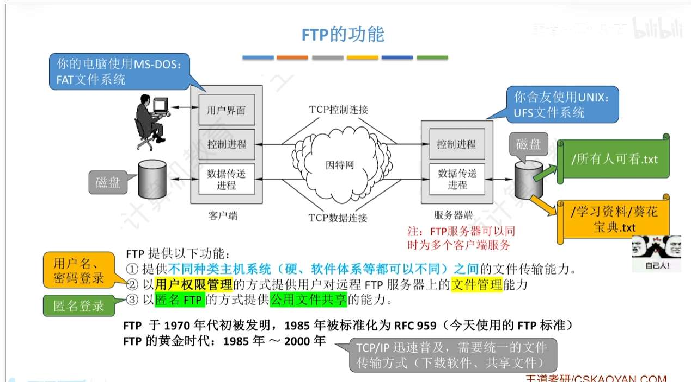
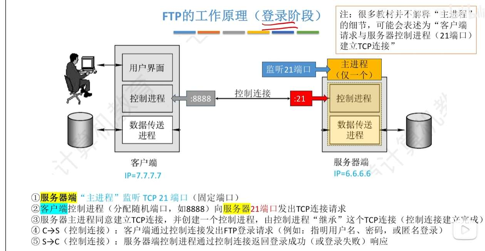
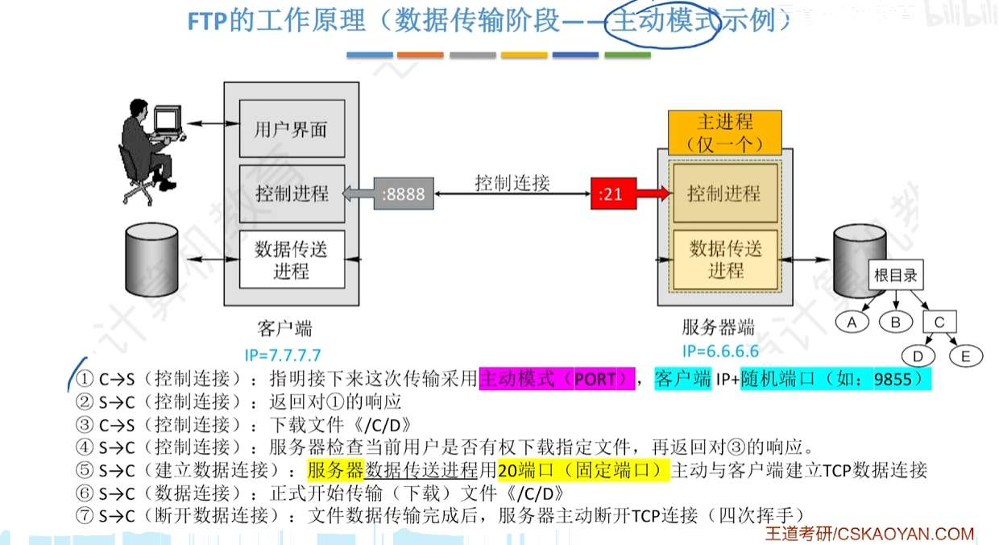
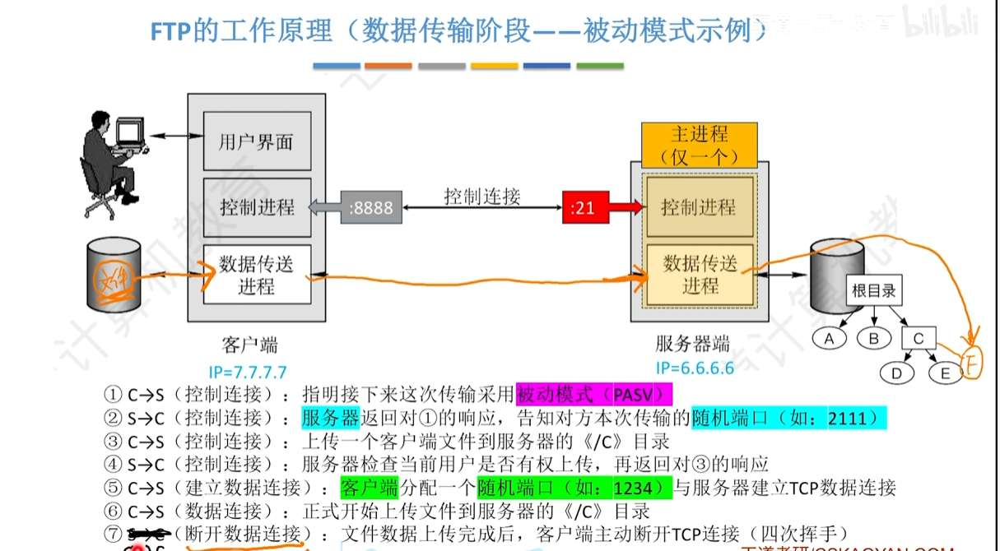
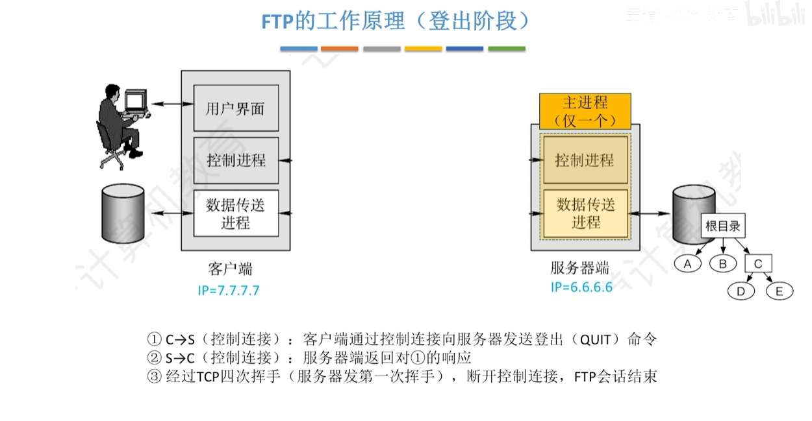
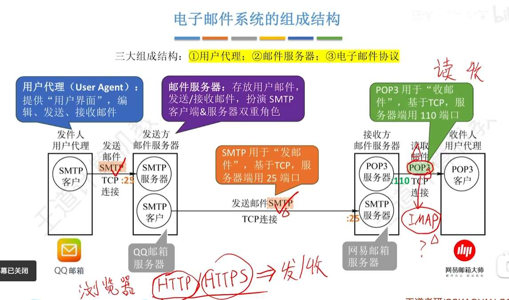
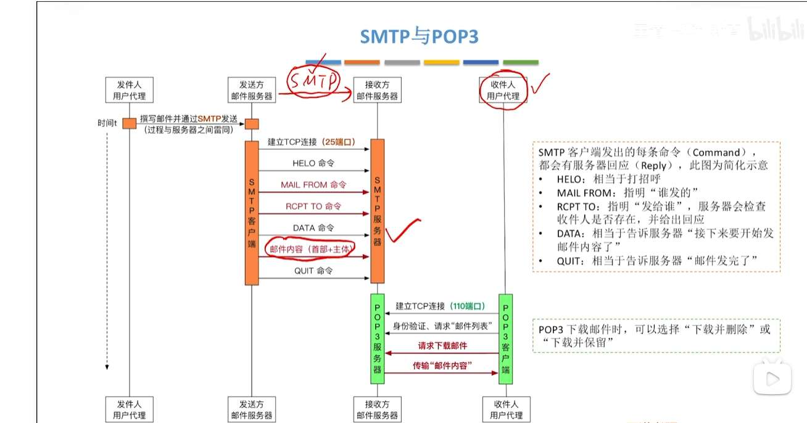

# 网络应用模型

# DNS

# FTP
File Transfer Protocol - 文件传输协议

最经典的三大应用层协议就是：

1. 看网页用的 **HTTP** (基于 TCP)
    
2. 发邮件用的 **SMTP/POP3** (基于 TCP)
    
3. 传文件用的 **FTP** (基于 TCP)

# 电子邮件

  

- **SMTP (Simple Mail Transfer Protocol)**：简单邮件传输协议。用于“**发邮件**”，在“用户到服务器”以及“服务器到服务器”之间传输。默认端口：25。
    
- **POP3 (Post Office Protocol 3)**：邮局协议第 3 版。用于“**收邮件**”，将邮件从服务器下载到本地。默认端口：110。
    
- **IMAP (Internet Message Access Protocol)**：交互式邮件存取协议。同样用于收邮件，但功能比 POP3 更强大，支持多端同步。

