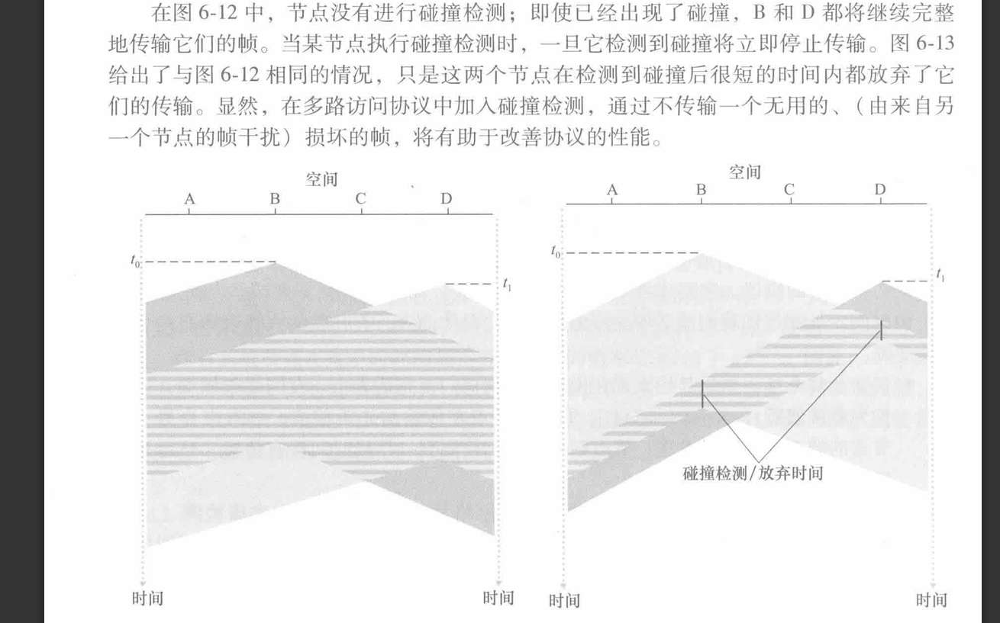

什么是吞吐量？如何理解 bps是 每秒的byte吗？？
	**不，bps是比特每秒，描述的是一个信道，每秒最多传输的比特。**
	**吞吐量了是指单位时间内 通过一个信道的实际数据量。实际？实际，一定小于等于理论的bps。这个误差是因为多个节点“堵塞”等开销。**
	**但如果只有一个节点，那么此时实际就等于理论。即，对于速率为 R bps 的广播信道**
	**，当仅有一个节点发送数据时，该节点具有 R bps 的吞吐量？**

速率为 R = 100 Mbps 的信道，意味着它**每秒钟**最多可以传输 100 * 10^6 个比特。我们之后提到的**速率R，单位永远是bps**。
# 信道划分
TDM（TIme division Multi吗？）缺陷
- 当场上只有一个人”想说话“，速率被约束到了平均速率R/N

FDM是将信道划分不同的频段，这里，频段的含义，我觉得还我很模糊

CDMA 看起来有点神奇 就是加密通话嘛 看起来，根本没有在广播信道碰撞的问题诶
# 随机接入
### 时隙ALOHA
所有帧由L比特组成，即L个01，一个单位就是1比特吧
时间被划分成L/R的时隙，就说，传1个0，是一个时隙嘛？ R是速度，L/R？哦是时间，
节点在时隙起点开始时传输帧？ 等下，有点乱了，节点？帧？

不行 必须在这里把概念完全厘清了，时间帧，与我们说的数据链路，交换的那个数据单元，有什么区别 这个图怎么理解 
这里 帧标的1234 都是我们人为标的 只是描述一段时间的意思而已
时隙仅仅是帧的单位 。

对于P很有趣，可以理解为投硬币 P的概率是正面
首先，投硬币是在检测碰撞后执行的，
投，正面的话，下一个时隙就重传，反面的话，下一个时隙重投硬币。这样，每一个时隙都有可能重传。
即P的概率下一个时隙传 1-P的概率 下一个时隙等待， 

这里有个计算效率，我不想陷进去，但感觉是很能练习思维的，因为这是我的缺陷。总之， 时隙ALOHA最大效率是e分之一，蛮小

### 纯ALOHA
我的理解就是没有时隙而已，时间单位变成帧而已？
然后最大效率推导，仍然不太想看

## CSMA
carrier sense
ALOHA们，都是只顾自己，没有别人哈
CSMA会先听别人，是不是再传输，没有的话再传。这样的话，缩小了碰撞的概率，就是只有，同时听，同时发的，再可能碰撞。
ALOHA们可能是， 一个传输到二分之一帧（诶，一个帧完意思就是传完了，就不占广播信道了对吧？） 一个刚传输  也会碰撞，而听，就会避免
然后CSMA，即使已经在传，也不放松警惕，继续监听，有人想来就取消。因为有时延，所以存在本来听的没人，传的时候又出来人的情况。

不过感觉这个图有点抽象