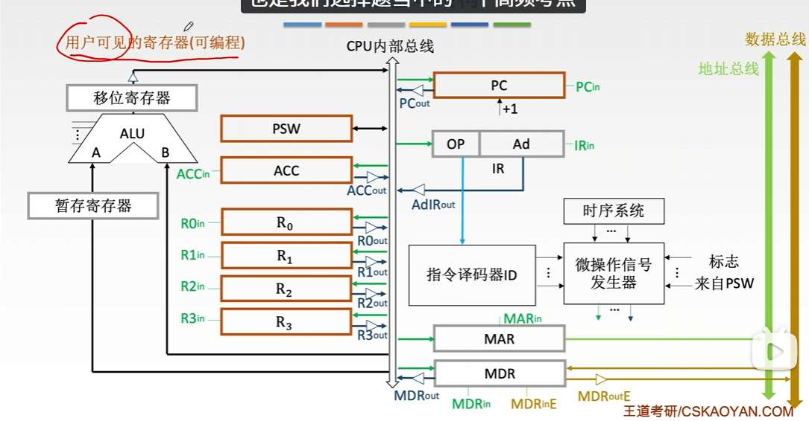

# CPU 功能和结构
CPU 功能
- 指令控制
- 操作控制
- 时间控制 
- 数据加工
- 中断处理

结构：
CPU 分为控制器和运算器；
控制器会自动形成指令地址紧接着取指令，接着分析指令、执行指令。
- 程序计数器
- 指令寄存器
- 指令译码器
- 微操作信号发生器
- 时序信号
- MAR、MDR

对于运算器，运算器旁边？有很多寄存器。 
那到底用哪俩个寄存器呢？
一种方法是每个寄存器都用三态门连运算器，相当于专门的数据通路。1
另一种方法是使用一根总线+暂存寄存器
所有寄存器：
- 通用寄存器组
- 暂存寄存器
- 状态字寄存器
- 移位器
- 计数器
- 累加器？ 累加器和 ALU 的区别是？ 

# 指令执行过程
首先想清楚，有地址、数据、控制三根总线
取指阶段
- PC->MAR
	  $(PC) \rightarrow MAR$
- CU->控制总线->主存，通知主存，我要读地址
	  $1 \rightarrow R$ (CU 向控制总线发“读”信号)
- MAR->地址总线->主存
- 主存->数据总线->MDR
	$M(MAR) \rightarrow MDR$
- MDR->IR
	  $(MDR) \rightarrow IR$
- PC=PC+1
	 $(PC) + 1 \rightarrow PC$

接续- MDR->IR 这一步，
如果指令里还要寻址，即找操作数的地址
- MDR (或者 IR，都行，因为内容一样)->MAR
	  $Ad(IR) \rightarrow MAR$
- CU->控制总线->主存，我要读地址
	  1->R
- MAR->地址总线->主存, 主存->数据总线->MDR
	  M (MAR)->MDR
- MDR 的地址替换之前 IR 的形式地址
  $(MDR) \rightarrow Ad(IR)$

中断情况：
- SP=SP-1， SP->MAR
	  $(SP) - 1 \rightarrow SP$， $(SP) \rightarrow MAR$
- CU->控制总线->主存，我要写
	  $1 \rightarrow W$
- PC->MDR->数据总线->主存，  
	  $(PC) \rightarrow MDR$， 
- MAR->地址总线->主存
	 $MDR \rightarrow M(MAR)$
- $Vector \rightarrow PC$

# 数据通路

刚才说的数据、地址、控制总线都属于外部总线，

现在加上内部总线，若只有一条

寄存器之间数据传送：
(PC)->Bus， PCout 有效， 
Bus->MAR, MARin 有效

主存与 CPU 之间：
(PC)->Bus->MAR，  PCout 与 MARin
1->R
MEM (MAR)->MDR， MDRin 有效
MDR->Bus->IR， MDRout 与 IRin 有效

# 控制器
 微指令是用来实现指令的，微指令里有很多微操作，。那微程序呢？就是一个指令所有周期的微指令集合吗？根据指令的操作码。来定位微程序的位置。即用微程序地址定位，是在CM中？

微程序控制器和硬布线控制器是俩种控制器的实现方式。

对于微程序控制器：
首先，一个指令有多个微指令，微指令里又有多个微操作。
微程序是一个指令，所有的微指令集合。
指令的微程序，存放在CM 中。通过微地址定位。
通过指令的OP，形成微地址，接着先存到uPC。
此时，这个微地址，是微程序的起始位置。
接着去CM 中取出放到uIR 中。然后，算下一条微地址。
不过，其中不清晰的地方就是，下地址到底咋生成的，

OP--微地址形成部件（顺序逻辑/条件判断/入口映射）--uPC

微指令，
水平型胖一点
垂直型瘦一点