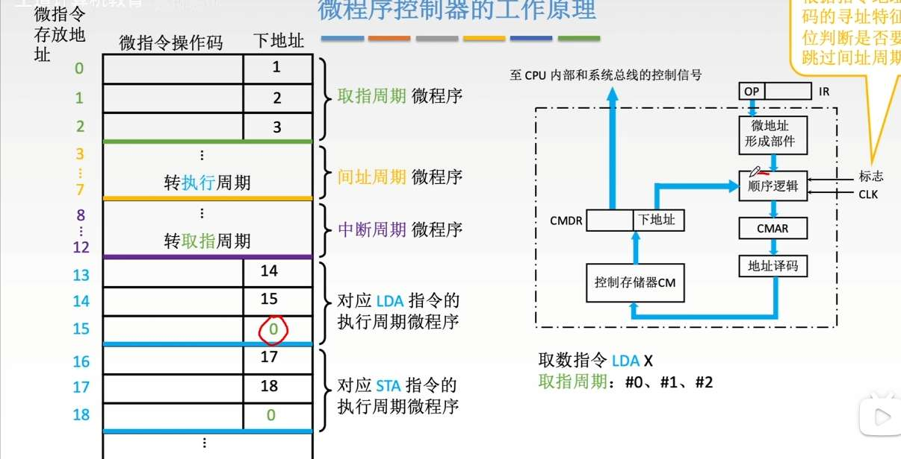
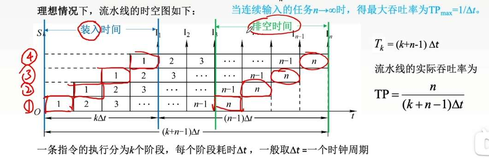
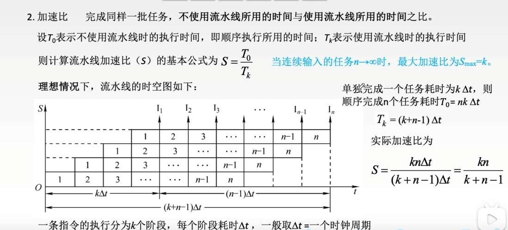
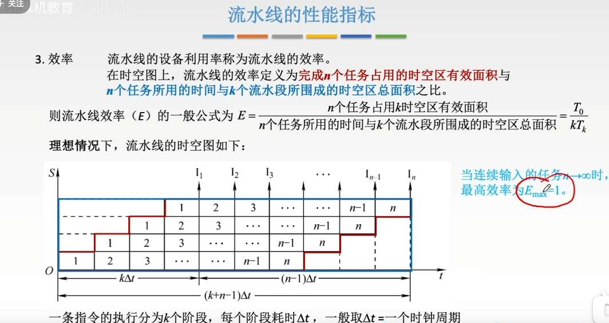
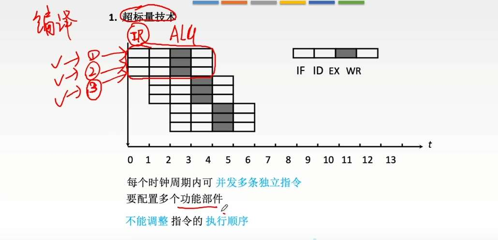
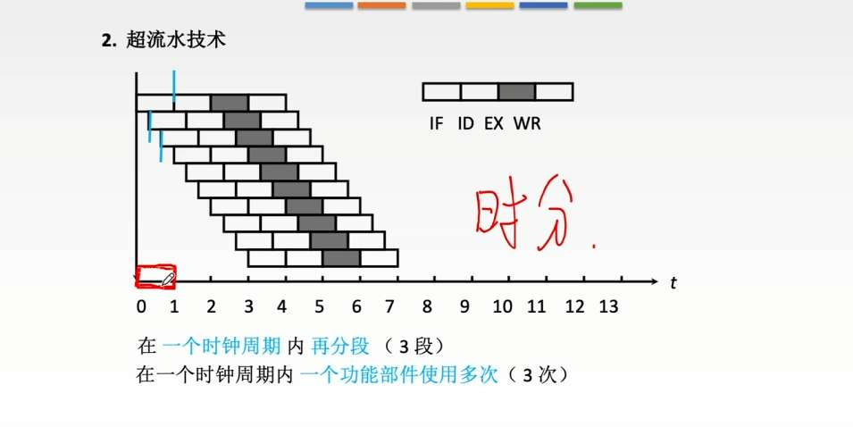
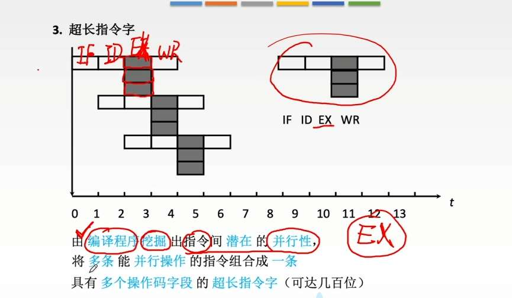

# CPU 功能和结构
CPU 功能
- 指令控制
- 操作控制
- 时间控制 
- 数据加工
- 中断处理

结构：
CPU 分为控制器和运算器；
控制器会自动形成指令地址紧接着取指令，接着分析指令、执行指令。
- 程序计数器
- 指令寄存器
- 指令译码器
- 微操作信号发生器
- 时序信号
- MAR、MDR

对于运算器，运算器旁边？有很多寄存器。 
那到底用哪俩个寄存器呢？
一种方法是每个寄存器都用三态门连运算器，相当于专门的数据通路。1
另一种方法是使用一根总线+暂存寄存器
所有寄存器：
- 通用寄存器组
- 暂存寄存器
- 状态字寄存器
- 移位器
- 计数器
- 累加器？ 累加器和 ALU 的区别是？ 

# 指令执行过程
首先想清楚，有地址、数据、控制三根总线
取指阶段
- PC->MAR
	  $(PC) \rightarrow MAR$
- CU->控制总线->主存，通知主存，我要读地址
	  $1 \rightarrow R$ (CU 向控制总线发“读”信号)
- MAR->地址总线->主存
- 主存->数据总线->MDR
	$M(MAR) \rightarrow MDR$
- MDR->IR
	  $(MDR) \rightarrow IR$
- PC=PC+1
	 $(PC) + 1 \rightarrow PC$

接续- MDR->IR 这一步，
如果指令里还要寻址，即找操作数的地址
- MDR (或者 IR，都行，因为内容一样)->MAR
	  $Ad(IR) \rightarrow MAR$
- CU->控制总线->主存，我要读地址
	  1->R
- MAR->地址总线->主存, 主存->数据总线->MDR
	  M (MAR)->MDR
- MDR 的地址替换之前 IR 的形式地址
  $(MDR) \rightarrow Ad(IR)$

中断情况：
- SP=SP-1， SP->MAR
	  $(SP) - 1 \rightarrow SP$， $(SP) \rightarrow MAR$
- CU->控制总线->主存，我要写
	  $1 \rightarrow W$
- PC->MDR->数据总线->主存，  
	  $(PC) \rightarrow MDR$， 
- MAR->地址总线->主存
	 $MDR \rightarrow M(MAR)$
- $Vector \rightarrow PC$

# 数据通路

刚才说的数据、地址、控制总线都属于外部总线，

现在加上内部总线，若只有一条

寄存器之间数据传送：
(PC)->Bus， PCout 有效， 
Bus->MAR, MARin 有效

主存与 CPU 之间：
(PC)->Bus->MAR，  PCout 与 MARin
1->R
MEM (MAR)->MDR， MDRin 有效
MDR->Bus->IR， MDRout 与 IRin 有效

# 控制器
 微指令是用来实现指令的，微指令里有很多微操作，。那微程序呢？就是一个指令所有周期的微指令集合吗？根据指令的操作码。来定位微程序的位置。即用微程序地址定位，是在CM中？

微程序控制器和硬布线控制器是俩种控制器的实现方式。

对于微程序控制器：
首先，一个指令有多个微指令，微指令里又有多个微操作。
微程序是一个指令所有的微指令集合。
指令的微程序，存放在CM 中。通过微地址定位。
通过指令的OP，形成微地址，接着先存到uPC。
此时，这个微地址，是微程序的起始位置。
接着去CM 中取出放到uIR 中。然后，算下一条微地址。

下地址到底咋生成的：
机器指令的 OP（操作码）仅仅用于生成该微程序的“首地址”（入口地址），而不能生成后续的“下一条微地址

**取指阶段的微程序（公共部分）**

- **起始怎么来：** 机器一通电或者复位，硬件会强制给 uPC 送入一个特定的初始地址（通常是 0）。
    
- **干了什么：** 这个地址存放的是“取指微程序”的第一条微指令。它控制机器去内存把机器指令取出来，放到 IR（指令寄存器）中。此时，机器才刚刚拿到 OP。
    

**2. 映射阶段（用到 OP，对应你的逻辑）**

- **入口怎么来：** 刚才取到了机器指令，把指令的 **OP 字段**送入**微地址形成部件**。
    
- **干了什么：** 微地址形成部件就像一个查字典的工具，它把 OP 翻译成对应执行周期微程序的**首地址**，打入 uPC。这也就是你说的“入口映射”。
    

**3. 执行阶段（脱离 OP，依靠“下地址字段”）**

- **后续地址怎么来：** 进入执行周期的微程序后，开始一条条执行微指令。此时，下一条微地址主要通过**断定方式**来生成。
    
- **什么是断定方式？** 你要知道，存放在 uIR（微指令寄存器）里的微指令通常分为两部分：`操作控制字段` + `下地址字段`。
    
    - **顺序执行：** 下地址就是当前微指令里直接写死的“下地址字段”的值。
        
    - **条件分支：** 下地址 = 当前微指令的“下地址字段” + 状态条件（比如 ALU 算出来的零标志位、进位标志等）。结合这些标志位，微地址形成部件会修改下地址字段的某几位，从而实现跳转。

**直接由微指令的“下地址字段”指出，所以微指令自己管自己下一步去哪!!！**

微指令，
水平型胖一点
垂直型瘦一点

控制段的编码方式
- 直接编码，每 1bit 代表一个微操作。
- 字段直接编码，组合代表微操作，比如 3bit，能代表 8 个微操作。为了并行，我们把互斥地放在一段。缺点就是要译码
- 字段间接编码，两层译码，能让微指令字长更段短

取指周期的最后收尾，是连接“取指”和“执行”的桥梁。

- **$T_4$ 节拍：准备机器指令的 OP**
    
    - $MDR \rightarrow IR$：把刚才从主存取出来的机器指令，正式存入指令寄存器（IR）中。
        
    - $OP(IR) \rightarrow 微地址形成部件$：把 IR 中的机器指令操作码（OP）剥离出来，送给那个专门负责查字典的“微地址形成部件”。
        
- **$T_5$ 节拍：完成微程序入口跳转**
    
    - 微地址形成部件 $\rightarrow CMAR$：映射部件根据传来的 OP，生成了这道指令对应的执行期微程序**首地址**（比如 ADD 指令的入口），并把它直接打入 CMAR。
        

**结果：** 当 $T_5$ 结束时，CMAR 里装的已经是执行周期第一条微指令的地址了。接下来的时钟周期，机器就顺理成章地脱离取指阶段，去执行具体指令的微操作了。

# 指令流水线

- 执行 **1 条**指令，需要经过 $k$ 个阶段，所以会占满 $k$ 个小格子。
    
- 现在有 **$n$ 条**指令要执行，那总共需要干多少活？当然是 **$n \times k$ 个小格子**。
    
- 如果我们把每个格子的宽度算作 $\Delta t$，那么有效面积就是 $n \cdot k \cdot \Delta t$。
    
- _注：在你的图里，分子写成了 $T_0$。$T_0$ 的本意是“如果不用流水线，串行执行这 $n$ 条指令需要的总时间”，算出来刚好也是 $n \cdot k \cdot \Delta t$。_
    

请看图里那个**最大的蓝色线框的矩形**。这就是你为了干完这批活，实际占用的硬件资源和总时间。

- **矩形的高（硬件占了多少）：** 就是流水线的段数 **$k$**。
    
- **矩形的宽（总共花了多少时间）：** 这就是流水线经典的执行时间公式。第一条指令要 $k$ 拍才能出来，剩下 $n-1$ 条指令每 1 拍出来一条。所以总时间 $T_k = [k + (n - 1)] \cdot \Delta t$。
    
- **总面积：** 高 $\times$ 宽 = $k \cdot T_k = k \cdot [k + (n - 1)] \cdot \Delta t$。

把分子和分母除一下，面积的单位 $\Delta t$ 就约掉了：

$$E = \frac{\text{有效面积}}{\text{总面积}} = \frac{n \cdot k \cdot \Delta t}{k \cdot (k + n - 1) \cdot \Delta t} = \frac{n}{k + n - 1}$$

## 因素与分类
指令执行流程
- 取指，这里有指令 cache
- 译指，会把所需要的数放入寄存器里或 IMM 寄存器？
- 执行
- （缓存），这里有变量 cache？
- 写回寄存器组。
每个阶段，都有缓冲器/锁存器，为了把控时间开销，比如让机器周期为 100ns，每一阶段都是一个机器周期。

- 结构相关引起的资源冲突：让后一个流水线暂停一周期；或干脆设计多点硬件，比如设计两个功能不同的寄存器
- 读写同一个变量数据引起的数据冲突：硬件制造空拍，或改变数据旁路，比如让 ALU 直接连到下一个指令/软件制造空指令，或改变顺序插入其他指令（编译优化）。总之是让该指令暂停，延后
- 因为转移指令跳转引起的控制冲突：预测一下跳转不调整；预取两个方向的目标指令；加快和提前形成条件码：在 CPU 内部加一个专门的快速判断电路，让它在 译码阶段 瞬间得出相等的结论

流水线分类：
这里说的不是指令流水线分类，而是计算机里使用流水线模样的知识分类？
- 部件级：一个大功能的子过程集合。因为分了子过程，所以要同时使用多次大功能，就能用流水线
- 处理机级流水：纵贯整个 CPU。分“子过程”的过程，把**一条指令的执行过程**拆分成 IF、ID、EX、MEM、WB
- 处理机间流水：每个处理机所得的结果给下一个处理机。跨越了多个独立的 CPU（处理机）。

- 单功能：如部件级流水线。常说的经典的“5段式指令流水线”，其实也可以算作广义上的单功能流水线（因为它的唯一功能就是“执行机器指令”）
- 多功能：这条流水线的各个段可以通过**重新组合连接**，在不同的时间段去完成不同的任务。，超强的算术流水线，你给它配置一下，这几个段连起来能算浮点加法；换一种配置方式，跳过其中一段，它又能算定点乘法。
  对于多功能：
	- **静态流水线（同一时间只能干一种活）：**
	    
	    - **理解：** 就像一个同时能生产冰红茶和绿茶的灌装线。如果现在正在生产冰红茶，你想换成绿茶，**必须先把流水线上所有的冰红茶全部排空（清空流水线）**，停机，洗刷管线，然后才能开始灌装绿茶。
	        
	    - **特点：** 流水线里同一时刻，要么全都是加法任务，要么全都是乘法任务，**绝对不能混着来**。
	        
	- **动态流水线（同一时间混着干活）：**
	    
	    - **理解：** 极度智能的灌装线。第一个瓶子灌冰红茶，紧跟着第二个瓶子就能灌绿茶，它们在同一条流水线上流动，各走各的管线，互不干扰。
	        
	    - **特点：** 流水线的不同段，同一时刻正在执行不同的功能任务（比如第 1 段在做加法的初级步骤，第 3 段正在做乘法的高级步骤）。效率极高，但硬件控制极其复杂。

- **线性流水线：**
    
    - **理解：** 一条直道走到黑。数据从第 1 段进去，依次经过 2、3、4，最后从第 5 段出来。**绝对没有回头路**。我们学的 5 段指令流水线通常就是线性的。
        
- **非线性流水线：**
    
    - **理解：** 存在**“反馈回路”（Feedback）**。
        
    - **举例：** 比如算某种复杂的迭代数学公式，数据走到第 4 段算出了一个中间结果，流水线直接把这个结果**重新扔回第 1 段**或者第 2 段，再加工一遍。这种流水线在调度时极其容易发生冲突（因为前面进来的新数据和后面倒退回来的老数据会在同一个段“撞车”）

