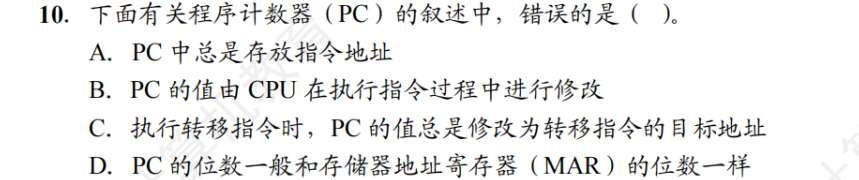
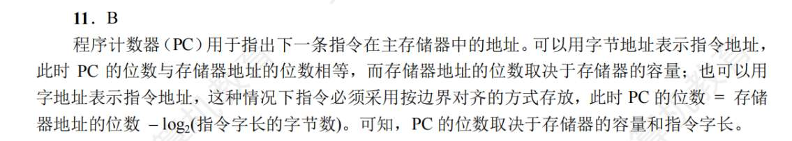
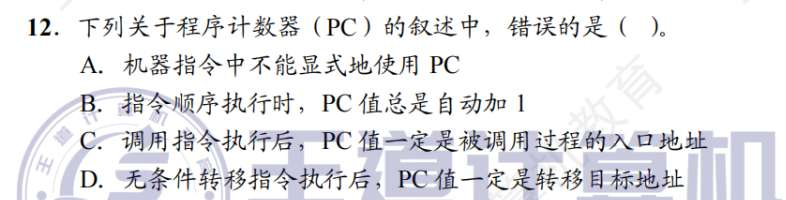
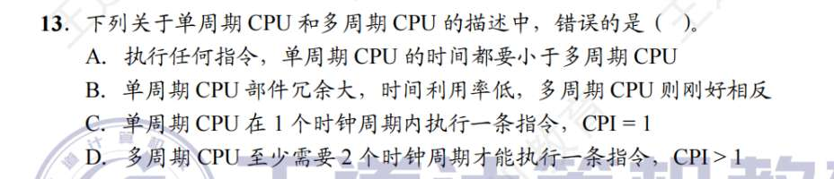
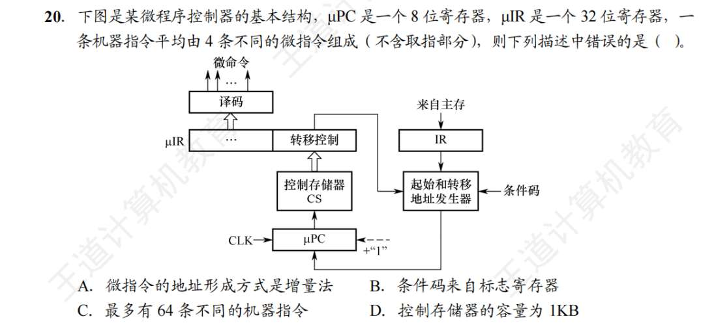
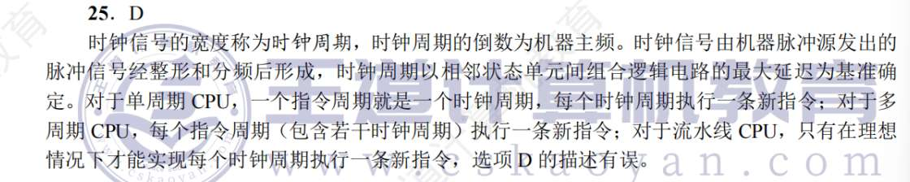
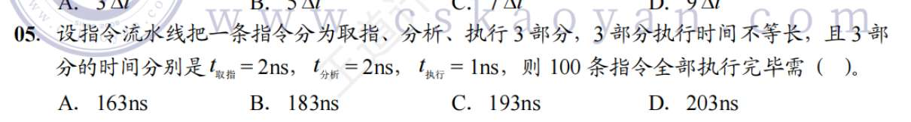
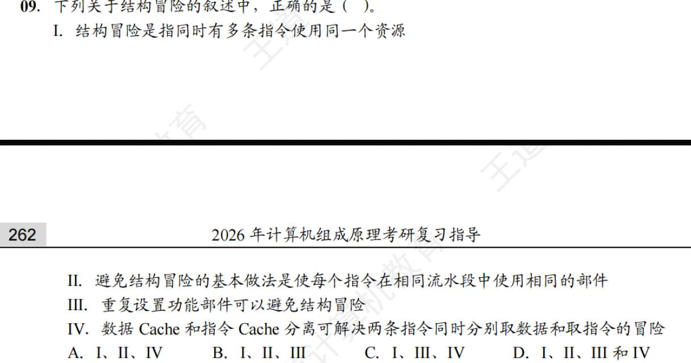
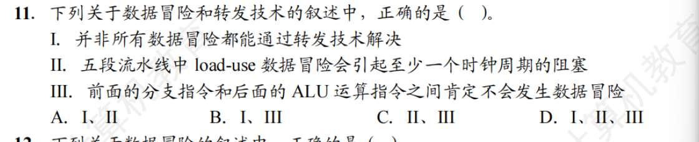
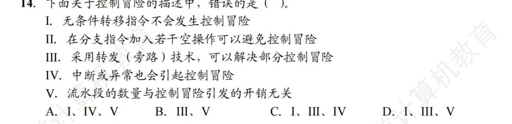

# CPU 功能
1. C
2. D? 有没有本身具有计数逻辑和移位逻辑功能的寄存器？
   带有计数功能的寄存器：PC（程序计数器）带有移位功能的寄存器：移位寄存器
3. A
4. B
5. B
6. ?
   n 位 CPU 中，n 指的是数据总线线数。那数据总线线数？ 和 MDR、MAR 位数有啥关系，和机器字长无关吧， 
   **机器字长 (Machine Word Length)**：指 CPU 进行一次整数运算所能处理的二进制数据的位数。**标志**：它通常等于 **ALU 的宽度** 和 **通用寄存器 (GPR) 的宽度**。
   **MDR 位数** $\approx$ **数据总线宽度** $\approx$ **存储字长**（通常情况下，为了存取方便，这三者是一致的）
   **MAR 位数** $\approx$ **地址总线宽度** $\rightarrow$ 决定了 **寻址范围** ($2^k$)。
   **n 位 CPU** $=$ **机器字长** $=$ **ALU 宽度** $=$ **通用寄存器宽度**。
7. C
8. D
   即使是无条件转移或中断返回指令，也是把地址放到 PC 然后读出，所以指令的地址总是从 PC 读出.PC 是 CPU 取指的**唯一向导**。跳转和中断只是**改变了向导手中的地图（修改了 PC 的值）**，但 CPU 永远只认向导（只从 PC 读地址）
9. B
10. B?
    
    PC 的值由 CPU 在执行指令过程中进行修改？ 为啥对，不是取值后就自增吗？
    反而 C 是对的？ 以及 PC 的位数和 MAR 一样没问题，和那个什么数据总线位数呢，无关吧？MAR 地址就是存储器地址吧？
    C 忽略了忽略了 **条件转移**如果是 `BEQ` (相等跳转)，当条件不满足时，PC 不会变成目标地址，而是保持顺序执行（即取指时已经加过的那个值）。因为有个“总是”，所以这句话是错的
    **MAR (Memory Address Register)** 的位数决定了 CPU 能寻址多大的内存范围。所以 PC 的位数通常等于 MAR 的位数（也等于地址总线的宽度）。这与 **数据总线 (MDR)** 的位数无关（数据总线决定一次搬运多少数据，而不是搬运到哪里）。
11. ?
    没看懂
    $$\text{PC位数} = \text{存储器容量地址位数} - \log_2(\text{指令字长字节数})$$

	我们来代入刚才的例子：
	
	假设内存总大小允许 32 位地址（MAR = 32 位）。
	
	指令字长 = 4 字节。
	
	1. **存储器容量地址位数 (32)**：
	    
	    这是为了能找到内存里**每一个字节**所需要的位数。
	    
	2. **指令字长字节数 (4)**：
	    
	    这是你的“步长”。因为指令是按顺序排列的，且每个长 4 字节，所以指令的起始地址肯定是 4 的倍数。
	    
	1. **$\log_2(4) = 2$**：
	    
	    这是由“步长”导致的**冗余位数**。
	    
	    - 步长是 2 字节 -> $\log_2(2)=1$，二进制最后 1 位肯定是 0。
	        
	    - 步长是 4 字节 -> $\log_2(4)=2$，二进制最后 2 位肯定是 0。
	        
	    - 步长是 8 字节 -> $\log_2(8)=3$，二进制最后 3 位肯定是 0。
	        
	
	**结论：**
	
	既然最后 $\log_2(\text{步长})$ 位永远是 0，那 PC 就**不需要存这就几位**。
	
	所以：
	
	$$\text{PC位数} = \text{总位数(32)} - \text{省下的位数(2)} = 30 \text{位}$$
	现在你明白了，因为**指令字长决定了“步长”**，步长决定了二进制地址末尾有几个 **死板的 0**。
	
	- 如果指令字长是 1 字节（步长 1）：那 PC 必须老老实实存每一位，一位都不能省。($\log_2 1 = 0$)
	    
	- 如果指令字长是 4 字节（步长 4）：PC 可以省 2 位。($\log_2 4 = 2$)
	    
	- 如果指令字长是 16 字节（步长 16）：PC 可以省 4 位。($\log_2 16 = 4$)
	    
	
	所以，**指令字长越长，PC 需要记录的有效位数就可以越少**（假设用按字寻址的方式）。
12. C
    我明白 B 是错在 1 了，应该是指令字长，“1”. 但 c，调用指令后，PC 不是下一个指令的地址吗
    调用指令 (CALL) 执行把 `CALL` 下面那条指令的地址（断点/返回地址）**压入堆栈 (Stack)** 保存起来（为了以后能回来）把 **子程序的入口地址** 写入 PC当 `CALL` 指令的执行阶段结束时，PC 已经被改写成了**子程序的入口**。这样，下一个机器周期，CPU 才能从子程序里取指令开始干活。
13. C
14. C
15. B
16. D
17. D
18. A
    我怎么记得标志寄存器对用户不透明，现在为啥说不能通过指令访问标志寄存器并修改？
    **确实不能把人家计算的结果修改啊，可以自己进行 add 操作等，间接修改。**
19. C
20. B
21. C
22. A
23. ?
    没看懂间址周期这个词，还有什么类似的词？
    第二章学指令周期
24. B, 
    跟“32”位计算机这个信息无关？ 再解释一下按字边界对齐方式
    为：指令的地址是字长整数倍。
25. B
26. B

# 指令执行过程
1. A
2. D?
   DMA 每传一个数据，就占用一个存取周期。我忘记了，这和时钟周期、指令周期有什么关系
   时钟周期 < 存取周期 (总线周期) < 机器周期 (CPU周期) < 指令周期。**存取周期 (Memory Cycle / Bus Cycle)**：CPU（或 DMA）完成一次**读内存**或**写内存**操作所需的时间。
3. C
4. B？ 
   **在无条件跳转指令的指令周期内，程序计数器取指完了—+1，执行完了变成地址码**
5. D
6. B
7. ???
   不同长度的指令，取值阶段不同?
   若总线宽度不够，长指令的**取指阶段**确实比短指令要长
8. B
9. A
10. C
11. C
12. D?
    控制器可以区分存储单元里是地址还是数据？数据通路是啥，和这有关吗
    控制器本身“看”不懂内存里的二进制，它是靠“时间”和“地点”来区分的。
13. A.. 解释一下
    单周期，所有指令必须在 1 个时钟周期内跑完，虽然 `ADD` 指令只需 2ns，但最复杂的 `LOAD` 指令需要 10ns。为了迁就最慢的指令，时钟周期必须设为 **10ns**。
    对于多周期，时钟周期设为最快步骤的时间，比如 **2ns**。
    
14. C
15. A
    取指令若不采用 cache，一定会访存一次。空操作指令的指令周期中，什么都没变？错，PC 仍自动加一

# 数据通路
1. C
2. D? 状态元件、操作元件等，啥？怎么分类的
   状态元件也叫**存储元件**或**时序逻辑电路**。如果没有时钟信号（Clock）的触发（上升沿或下降沿），它们的输出不会改变，即使输入变了，里面的数据也“锁”着不动。
3. ？ 
   寄存器属于状态元件
4. D
5. C
6. C
7. D
   单周期 CPU 绝对不能用“单总线”。
   单周期是一锤子买卖，控制器（CU）在一开始就把所有信号都设定好，故而单周期 CPU 在一个时钟周期内控制信号保持不变。多周期 CPU 因为分了多个周期执行，每个周期发出的控制信号会不同。
   单周期数据像流水一样单向流过去， CPU 每个部件只能用一次；多周期 CPU 同一个部件可使用多次。
8. C?
   **采用 CPU 内部总线方式结构简单、性能低，不采用内部总线则相反。是因为内部总线是单总线，不采用的话只能用专用总线**
9. D
10. C?
    分不清了，单周期处理器所有指令的指令周期为一个时钟周期，所以 CPI=1。为啥说时钟频率较低？一个指令周期对应一个控制信号吗？ 多周期处理器又是怎样的？
    单周期处理器时钟周期 $T$ 必须足够长，长到能够容纳下**最慢的那条指令**执行完毕。
11. C
12. B

# 控制器功能与原理
1. D
2. B.微操作控制信号是？微程序与硬布线控制器，微操作控制信号的形成分别是？
   CPU 内部**最底层、最原生态的物理电信号**，要把 PC 的值送到内部总线上，就需要一个 `PCout=1` 的信号去打开三态门。`PCout=1` 就是一个微操作控制信号。
   信号是由一堆复杂的**逻辑门电路（与门、或门、非门）**瞬间算出来的。
   。控制器拿着微地址去控制存储器（CM）里读取一条微指令，把微指令里面的 0 和 1 直接（或经过简单译码）变成电信号发出去。
3. C
4. D
5. D
6. C, 微程序结构和微指令结构？
   **微程序结构（宏观）：** 就是一个代码块。为了执行一条机器指令（比如 `ADD`），设计人员编写的一连串微指令的集合，存放在 CM 的某个特定区域。
   **微指令结构（微观）：** 408 常考的微指令结构（特指水平型），**操作控制字段：** 决定“这一个节拍干什么”（里面包含了多个微操作控制信号）。**顺序控制字段（下地址字段）：** 决定“下一个节拍去哪取微指令”（也就是咱们刚才死磕的 CMAR 怎么更新的问题）。
7. C
8. ??
   CM 采用 ROM 组成，为什么？一条微指令存放在其一个单元
   CM 里装的“微程序”，是 CPU 厂商在出厂时就写死在芯片里的**“出厂设置”**。ROM（只读存储器）具备**非易失性**（断电不丢失数据），所以 CPU 关机再开机，它依然认识 `ADD` 和 `LOAD` 指令。
9. C
10. D? 控制部件向执行部件发出的控制信号，是不是就是，微指令的译码结果？ 会有若干个微操作？
    争取！
11. B
12. B
13. ？说的什么直接编码、字段编码，都是说的水平型微指令。垂直型微指令和指令长得像，有微操作码和微地址码？要地址干嘛？
    如果水平型微指令想把 PC 的值给 MAR，它会在长长的控制位里把 `PCout` 和 `MARin` 这两位设为 1。而垂直型微指令会写成类似 `MOV MAR, PC` 这样的形式。在这个微指令里，“MAR”就是目的地址，“PC”就是源地址！
14. A
15. B
16. C
17. A
18. ？A
    CPU 控制器由指令寄存器、程序计数器和操作控制器组成，操作控制器是？指令寄存器、程序计数器就是说 uIR 和 uPC 吗？  那 IR 和 PC，好像是在存储器？我有点混乱
    **CPU 的控制器 = PC + IR + 操作控制器（OC）。 这个 OC 就是“大脑的核心”。如果你的 CPU 是硬布线设计的，OC 就是那堆密密麻麻的逻辑门电路；如果是微程序设计的，OC 就包含了控制存储器（CM）、$\mu$PC、$\mu$IR 以及微地址发生器。**
19. C
20. C
	C：微程序里必须要有“公共取指微程序”段！取指微程序通常要占掉 1~3 条微指令的固定空间。所以剩下用来执行具体机器指令的空间**肯定小于 256 条**。因此，最多能支持的不同机器指令数量**绝对达不到 64 条**（必定小于 64）。
	**D 为何正确（重点计算）：** * $\mu$PC 是 8 位，说明控制存储器（CS/CM）有 $2^8 = 256$ 个存储单元（单词）。
	- $\mu$IR 是 32 位，说明每个存储单元存 32 bit（即 4 Byte）。
	- 总容量 = $256 \times 4\text{ Byte} = 1024\text{ Byte} = 1\text{ KB}$。完全正确。
21. D
22. C
23. C
24. B?
    CS 按微指令地址访问
25. D?
    
    对于答案我的疑惑是，时钟周期的定义怎么理解。以及每个指令周期执行新指令不是单周期 CPU 吗？ 流水线 CPU 是什么，是不是下节再学
    CPU 内部是“寄存器 $\rightarrow$ 逻辑门算数 $\rightarrow$ 寄存器”的结构。电信号通过逻辑门是需要时间的。为了保证信号算完且稳定下来不丢数据，时钟周期（每一拍的时间）必须**迁就那条耗时最长的电路**（最大延迟）。
26. B 指令译码器是什么时候用？
    发生在**取指周期刚结束、进入执行（或间址）周期的第一瞬间**。 当机器指令刚从主存搬进 CPU 的 IR 寄存器后，译码器立刻对 IR 里的操作码（OP）部分进行“翻译”，告诉 CPU 这到底是一条加法指令还是跳转指令。
27. D
28. B? 汇编和机器指令的区别？
    一条汇编是翻译成人类语言的一条机器指令，机器指令就是一条操作码+地址码，数字

# 流水线
1. D, 时间并行，空间并行。 RISC 机器，多媒体 CPU
   空间并行是同一时间不同空间。
   RISC 机器指令越简单越好、长度一样、最好每个时钟周期就能完成一条（所以它**极其依赖流水线技术**）。我们之前讨论的 5 段式流水线，其实就是经典的 MIPS RISC 架构。复杂的活儿（比如算乘法）不搞专门的复杂指令，而是靠多条简单的指令拼起来完成。
   遇到处理视频、音频、图像这种任务，如果还用 RISC 一条条指令去算像素点，太慢了！它增加了一些极其特殊的宏大指令。比如一条指令发下去，CPU 能**同时把 8 个像素点的颜色值分别相加**。这也是一种典型的“空间并行”。
2. ?C
   注意题目说，“稳定时”
3. B 
4. C
5. ?
   
   $T = \text{第一条指令的真实时间} + (n-1) \times \text{最慢阶段的时间}$
6. D
7. D？
   流水段就是IF、ID... 这五个段，要有控制信号在这其中流过，不过是IF、ID 之后才产生控制信号
   在 ID 段产生的控制信号，并没有直接连到终点，而是像快递包裹一样，**和数据一起打包存进了 ID/EX 寄存器**。到了下一个周期，EX 段从寄存器里拿出给自己的信号（`ALUOp=加法`）去运算，然后**把剩下的信号（给 MEM 和 WB 的）继续存进 EX/MEM 寄存器**。
8. ？
时钟信号都作用在哪些地方，为什么？PC、寄存器、存储器
**PC 和段间寄存器：** 当时钟周期的上升沿（或下降沿）一到，就像绿灯亮起，这些寄存器会瞬间**“抓取并锁存”**当前输入端的电信号。然后红灯亮起，寄存器关门，把刚才抓取的数据稳定地保存在自己肚子里，供下一段流水线在接下来的一个周期里慢慢用。
**通用寄存器组和存储器：** 它们只有在收到时钟信号的有效边沿，**并且**“写使能信号（Write Enable）”有效时，才会把数据真正写进去。如果时钟边沿没来，就算门口排着正确的数据，它也绝对不放进去。

9. C
   
   II 是啥意思
   **所有的**指令，在 **IF 段**，只能用指令 Cache
   **所有的**指令，在 **MEM 段**，只能用数据 Cache。

10. B
11. ?数据冒险就是数据冲突吧
    转发技术（Forwarding/Bypassing）只能解决“数据已经算出来了，只是还没写回寄存器”的情况（比如 ALU 刚算完，直接引根线传给下一条指令）。
    即使有转发线，`LOAD` 的第 4 段和 `ADD` 的第 3 段是在同一个时钟周期发生的！你不可能把现在刚掏出来的数据，穿越时空送给这一个周期一开始就要用的 ALU。所以，必须让 `ADD` 强行暂停（阻塞/停顿 Bubble）一个周期，等 `LOAD` 掏出数据后，再转发给它。
    分支指令里不仅有普通的条件跳转（如 `beq`，它不写寄存器），还有一种叫**跳转并链接指令（如 `jal` 或函数调用指令）**。`jal` 指令在跳转的同时，**会把下一条指令的返回地址写入到 `$ra`（31 号寄存器）中**。如果紧跟在它后面的 ALU 指令偏偏就要读取 `$ra` 寄存器来进行运算，这就构成了标准的“写后读（RAW）”数据冒险！所以“肯定不会”是错的。
12. D
13. B
14. 
 只要你改变了 PC 的正常走向（PC+4），哪怕你是无条件的，也会引发控制冒险！因为流水线总是默认“往下盲猜”，在无条件跳转指令算出“到底跳到哪个地址”之前（可能在 ID 或 EX 段），流水线已经取错了后面的指令。所以必须清洗（Flush）。
 中断和异常会强制 CPU 打断当前程序，把 PC 指向中断服务程序的地址。这本质上就是一次“突发的硬件级跳转指令”，当然会把流水线里正在排队的无辜指令全部作废掉。
 流水线越深（段数越多），意味着你“盲猜盲跑”得就越远。如果到了第 10 段才发现一开始分支猜错了，你就得把前面取错的 9 条指令全部作废掉。开销极大！这就是著名的“分支惩罚”。
 
15. C
16. B
    增加流水段个数，会使得时钟周期可以设计得更小，从而提高时钟频率
17. D
18. D
19. B.
    RAW，read after write
20. A
21. A
22. D?
    **如果不按边界对齐：** 假设一个 32 位的数，跨越了两个存储字（比如一半在地址 3，一半在地址 4）。CPU 想要读出这个数，必须去主存读**两次**！流水线的 MEM 段只有一个时钟周期的时间，读两次必然导致流水线停顿阻塞。
    只有 LOAD/STORE 指令才能对操作数进行存储访问。**如果不这样：** 假设 `ADD` 指令可以直接去内存里拿数参与加法。那这条 `ADD` 指令在 EX（执行）阶段，还要兼职干 MEM（访存）的活儿，不仅让 EX 段的时间变得极长（拖慢时钟频率），还会让整个 5 段流水线的节奏大乱。
23. C
24. D
25. B
26. D？
    流水线功能段是什么，比如在 5 段流水线里，取指（IF）、译码（ID）、执行（EX）等，每一个都是一个“功能段”。
    流水线的时钟周期（每一拍到底要敲多长），必须迁就**最慢**
    最终耗时是时钟周期+寄存器延时
    
27. D?
    **CPU = 数据通路（干活的四肢） + 控制部件（指挥的大脑）**。“数据通路”和“控制部件”是平起平坐的两个兄弟，共同组成了 CPU。数据通路只是**接收**控制信号，绝不**包含**生成控制信号的部件。数据通路里既有**“马路”**（组合逻辑，如 ALU、多路选择器），也有带红绿灯的**“收费站”**（时序逻辑，如 PC、通用寄存器、段间锁存器）。
28. B
    寄存器延时时长是是什么意思，
29. C
30. B
31. C
32. C