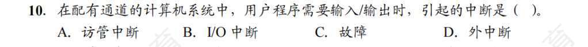

# IO 接口
1. A
2. D？
3. D
4. C
5. B
6. D?
   IO 指令是机器指令的一部分，到底什么是机器指令呢？关于 xx 指令的辨析有哪些
7. D
8. C
9. D
10. ?
    磁盘驱动器向盘片磁道记录数据时采用串行方式，怎么理解？还有哪些串行、并行的例子
    既然是一根线从磁头底下“呲溜”一下滑过去，那磁头当然只能**一个比特接着一个比特（1位1位地）**按顺序写上去。这就是标准的**串行（Serial）**！
    并行（Parallel）的例子（多车道齐头并进）：

	CPU 内部总线： 32位、64位数据总线。一脚油门，64 个比特同时冲过去。
	
	老式打印机接口： 以前那种插在电脑后面又宽又大、带两排针的 LPT 打印口（并口）。
	
	老式硬盘线（PATA/IDE）： 电脑机箱里那种宽宽扁扁的排线。
	
	串行（Serial）的例子（单车道排队走）：
	
	USB (Universal Serial Bus)： 名字里就带 Serial（通用串行总线），你的鼠标键盘 U 盘全靠它。
	
	SATA 硬盘线： 现在的机械/固态硬盘线（Serial ATA），线很窄。
	
	网线 (Ethernet) 和 光纤： 都是一根线把数据 0101 排着队发出去。
11. C?
    
    这些地址都啥，A 我知道，专门给程序员看的，B 是计算机计算时用的地址，CD 是啥
    - **A. 逻辑设备名 (程序员用的)：** 比如在 Linux 里你写代码 `open("/dev/printer", ...)`，或者在 Windows 里你想往 `C盘` 写文件。这个 `/dev/printer` 和 `C盘` 就是逻辑设备名。程序员只管叫这个统一的代号，不管底层到底插的是惠普打印机还是爱普生打印机。这叫**设备的独立性**。
    
	- **B. 物理设备名 (系统底层用的)：** 硬件真实的名字。操作系统底层会有一张表（LUT），把你写的逻辑设备名“映射”到物理设备名上，去真正驱动那个硬件。
	    
	- **C & D. 主/从设备 (这是 Linux 的底层黑话)：** 在 Linux 系统里，设备是用两个号码区分的：
	    
	    - **主设备号 (Major)：** 标识属于哪一类驱动程序（比如“这是个 U 盘类设备”）。
	        
	    - **从设备号 (Minor)：** 标识具体是哪一个设备（比如“这是插在第 2 个接口上的那个金士顿 U 盘”）。
	    其实在现代高速计算机里，**串行早就把并行按在地上摩擦了！** 因为并行线如果时钟频率太高，多条线之间会产生严重的“电磁干扰（串扰）”，且没法保证 64 个比特“同时”到达终点。反而串行线只有一对导线，没有干扰，频率可以飙到极高（比如现在的 PCIe 固态硬盘）。
11. A?
    打印控制接口就是 IO 接口，打印机是外设，中断请求信号是 IO 接口和 CPU 之间交换的信息而不是 IO 接口和外设之间
12. B?
    CPU--IO 总线--IO 接口--通信总线/电缆--外设
13. A
14. D
15. D
16. D
17. C

# IO 方式
1. B
2. B?
   中断向量地址由向量地址形成部件产生，“中断向量地址”去主存里读出来的那条指令（通常是一条 `JMP` 指令，或者是服务程序的真实入口地址是中断向量
3. D?
   中断类型有哪些，cache 不涉及中断，而缺页却涉及，因为硬软件吗的区别吗？浮点数下溢和上溢呢
   Cache 很快，所有的靠硬件就好。缺页要去硬盘，很麻烦，此时中断，把它挂起，让他慢慢弄。**上溢（Overflow）：发生中断（异常）**。结果大得连格式都装不下了，算出的数完全是错的，这属于严重的算术错误，硬件兜不住了，必须抛出异常让操作系统来处理（通常是直接报错终止程序）。**下溢（Underflow）：通常不发生中断**。结果小得无限接近于 0。硬件非常聪明，它会直接把这个数**当成机器零（0）**来处理，然后继续默默往下算，假装无事发生。
4. D?
   DMA 的中断只是通知，通知之后呢，发生什么事，DMA 继续干活吧，CPU 呢。然后 DMA 无需保存现场，是因为作用只是通知吧？
   DMA 发出中断的时机： 是在它把这 10000 块砖全部搬完之后！
   DMA 的状态： 发完中断后，DMA 就在旁边**“歇着”**了。这批活儿干完了，没有 CPU 的新指令，它是不会自己找活干的。
   CPU 收到这个中断请求，会暂停手头的工作，进入“DMA 传输结束的中断服务程序”。在这个程序里，CPU（操作系统）会做善后工作：检查一下 DMA 状态寄存器，去操作系统里把之前因为等这些数据而被阻塞的进程给**唤醒**。如果有新的数据需要传，再给 DMA 填一次表，下达新任务。
5. D?
   为什么是在指令结束时检查有无中断请求，只要开中断难道不是随时吗？CPU 也会不断检查 DMA 请求，为什么，不是有中断吗？以及什么是存取周期，总线周期，还有哪些 xx 周期的名词辨析一下。中断服务程序最后的指令是中断返回指令，不仅仅是修改 PC 吗，还有无条件转移吗？恢复寄存器属于中断返回指令吗？是说中断返回指令包括恢复现场、中断返回？中断响应优先级由中断屏蔽字决定，这句话不对，因为还有硬件优先级对吧
   就记住！“指令结束时”检查中断！
   **DMA 请求（HRQ）：** 是 DMA 为了搬运 **1 个字** 的数据，向 CPU 借用系统总线。因为数据来得很快，所以 CPU 必须在**每个机器周期（总线周期）结束时**去检查有没有 DMA 请求。
   **DMA 中断（INTR）：** 这个 CPU 是在**每条指令结束时**去检查的。
   **机器周期 / 总线周期：** 中等套娃。通常规定为**“去主存读写一次数据所需的时间”**。它包含若干个时钟周期。
   **指令周期：** 最大的套娃。执行一条完整指令（取指、译码、执行）的时间。它包含若干个机器周期。
   **存取周期（Memory Cycle Time）：** 这是主存芯片自己的物理属性！它表示主存进行一次完整读写，并**恢复内部电容状态**，直到能迎接下一次读写所需的总时间。（存取周期 > 真正读出数据的时间）。
   中断返回指令不仅仅是修改 PC，它是一把抓起堆栈里的 **PC 和 PSW（程序状态字）**，同时塞回对应的寄存器里。
6. C?
   只用具有 DMA 接口的设备才能产生 DMA 请求
7. C
8. C?
   CPU 响应中断需满足的条件：中断信号、开中断、一条指令执行完毕
9. B
10. B?
    
    关于“通道”，很不懂啊
    启动 I/O 前的打报告是“访管中断”（软件的锅），干完活后的汇报是“I/O 中断”（硬件的功劳）。结合咱们之前聊的，通道就是一个能自己独立执行“通道程序”（放在主存里）的超级 DMA，专门给大老板分忧的。
11. B
12. C
13. D?
14. D.?
15. C
16. D？
17. A
18. C
19. B
20. B
21. C
22. D?
23. C?
24. C?
25. A
26. A？
27. D?
28. C