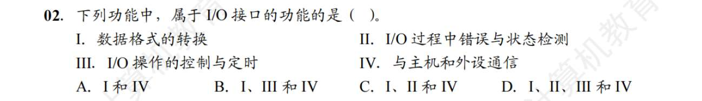
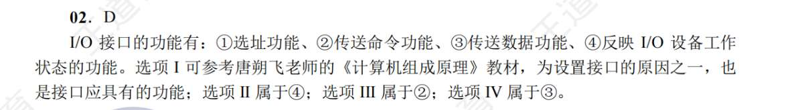

| **维度**     | **程序中断方式 (苦力搬砖)**                                            | **DMA 方式 (管家代劳)**                               |
| ---------- | ------------------------------------------------------------ | ----------------------------------------------- |
| **中断的频率**  | **极高！** 每传输 1 个字/字节，就中断一次 CPU。                               | **极低！** 传输完 1 个**大据块**（比如几千个字节），才中断一次 CPU。      |
| **中断的目的**  | 叫 CPU 过来**真正地执行指令去搬数据**。                                     | 报告 CPU：数据**已经搬完了**，请做善后处理（比如检查有没有传错）。           |
| **数据流过的路** | I/O $\rightarrow$ **CPU** $\rightarrow$ 主存 (必须经过 CPU 的寄存器中转) | I/O $\rightarrow$ 主存 (**直接在两者之间修了条高铁**，不经过 CPU) |
| **响应时机**   | 只能在**一条指令执行结束**时响应。                                          | 可以在**一个总线周期（机器周期）结束**时响应（因为它只需要抢总线，不用等指令执行完）。   |
而通道

|**I/O 控制方式**|**相当于什么角色**|**传输的数据单位**|**CPU 介入的频率（多久发一次中断）**|**智能程度**|
|---|---|---|---|---|
|**程序中断**|CPU 亲自当苦力|**字 / 字节**|**极高** (每传 1 个字就中断一次)|纯靠 CPU 干活|
|**DMA 方式**|专职搬砖管家|**数据块** (连续的一整块)|**中等** (每传完 1 个**数据块**中断一次)|纯硬件，只会按参数搬砖|
|**通道方式**|物流总经理 (迷你 CPU)|**一组数据块** (多个任务集合)|**极低** (执行完整个**通道程序**才中断一次)|极高，能执行自己的通道指令|

# IO 接口
- 数据寄存器
- 控制寄存器
- 状态寄存器

由于是先读状态，再写控制，所以时间上错开的控制与状态可以共用一个寄存器
我记得，对于 IO 接口，是同时激活数据线地址线和空这些？
地址线指明端口，即哪个寄存器，数据线剂量数据、控制字等

对于地址线上的端口地址，
- 统一编址：占用主存空间，但比较灵活，所有访存指令都有效。不过也慢
- 独立编址：不占用主存空间，位数少所以快。但指令少，编码难度高

IO 接口的功能

怎么记忆理解
- **I. 数据格式的转换（翻译官）：** CPU 吐出来的是 8 位/16 位**并行**数据，但鼠标可能是一根线**串行**发送数据的。接口必须负责把并行拆成串行，或者把串行拼成并行。
    
- **II. 错误与状态检测（安检员）：** 老板要用打印机，接口必须先去看看：打印机缺纸没？卡纸没？传过来的数据校验位对不对？（这就是为什么要有**状态寄存器**）。
    
- **III. I/O 操作的控制与定时（缓冲与协调员）：** CPU 1 纳秒就能发完数据，打印机 1 秒钟才打印一个字。接口必须搞个水池（**数据缓冲寄存器**），先把 CPU 暴雨一样的数据接住，再一滴滴漏给外设。同时协调双方的握手时序。
    
- **IV. 与主机和外设通信（传声筒）：** 废话，它就是连着两头的桥梁，当然要能跟两边通信。
