# 存储器概述 
1. A（存储分类不熟）
	磁盘是直接存取 
2. C（存取周期、存取时间对比
3. B
4. D?? （相联存储器）
5. A
6. ?不是 8 乘 10 的 12 次方吗
	计算错误
7. C
	我又计算错误了？1. 
8. B
9. D
10. D 主存就是内存？
11. D
12. B
	计算问题，算对的，98.33 是临界值，所以至少选 99 而不是 98！. 
13. B（“透明”这个知识点）
	到底什么过程的性质是透明，对谁透明1. 
14. B
# 主存
1. C?
2. C
3. B
4. D 都存在（DRAM 刷新方式）
	1 到底怎么. 刷新的？
5. B 为啥集成度 dram 高呢
6. C 啥是半导体 ram
7. A
8. A
9. D
10. B 到底跟地址复用技术有啥关系
	地址线减半！复用不是说地址与数据线复用，而是行与列复用。可是我学 X86 微机原理时记得有地址与数据复用啊 
11. A
12. C
13. D 是考 RAM 和 BOS 吗还是啥
	操作系统位于硬盘，就说内存储器是 RAM 是 ROM 了，难道还有其他情况？操作系统必须位于硬盘吧，
14. A
	不是说 ROM 都是随机存储吗，怎么不能了，哦有随机存储的性质，但由于写麻烦且有限次，所以不能作为随机存储器？ 
15. B, A 哪不对
	 “在工作中存储器内容会发生变化”，RAM 不会这样吧
16. ？DRAM 刷新知识点
17. D，至于到底为什么？
18. ?SDRAM
	传统 DRAM 与 CPU 采用异步方式交换数据，到底如何理解同步异步1. 
19. A 怎么还有至少一说（地址复用）
	地址线增 1 根，容量提高到原来的俩倍. 
20. 位平面？D  计算错误
21. B
22. 总线周期？
	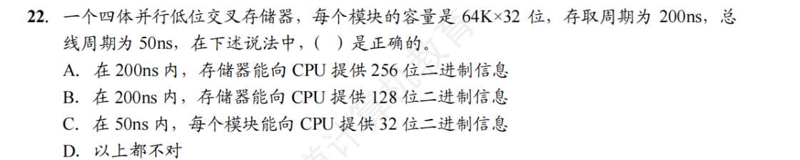
	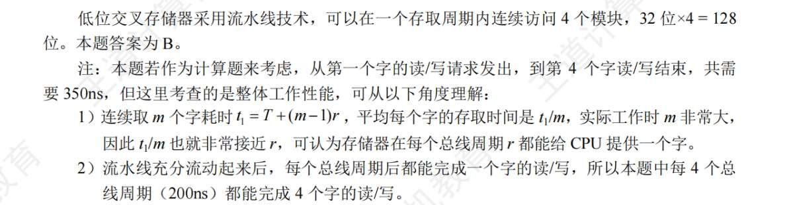
	
23. 。
	. 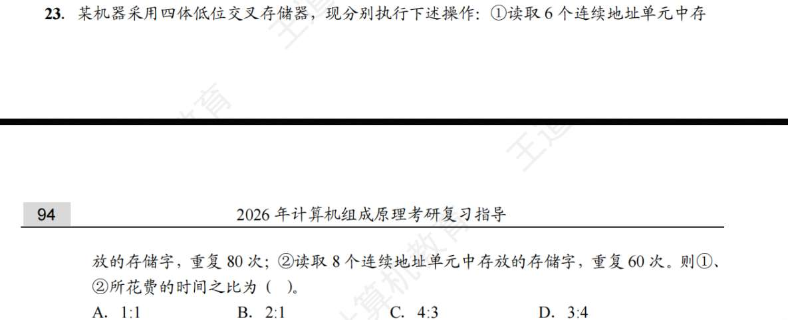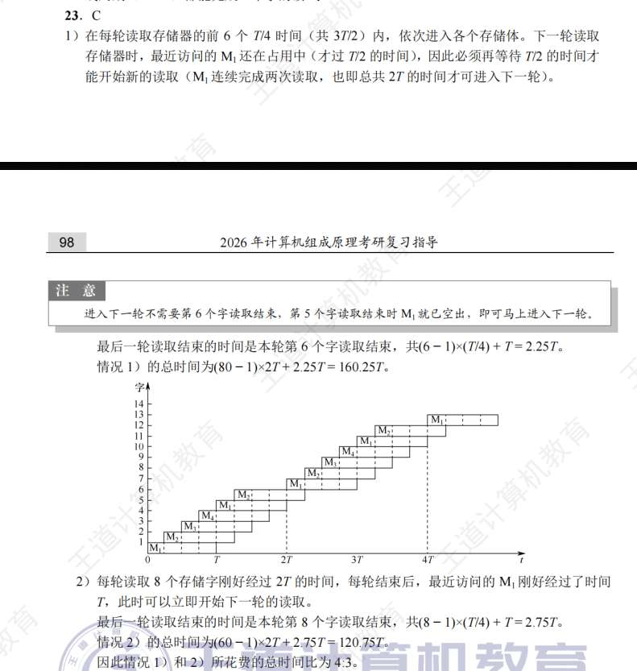
24. C
	D。低址交叉，只看最后俩位，00，01，10，11 代表 4 个芯片 
25. ?单体多字？单体多字为什么没有解决主存容量过小的问题
26. C 多模块存储之间能提高存储器的访问速度，是因为各模块有独立的读写电路
27. ?
	1. 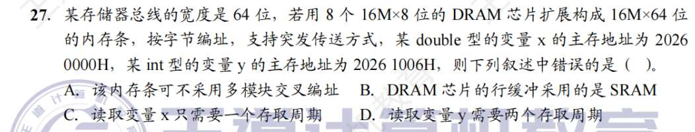
	2. 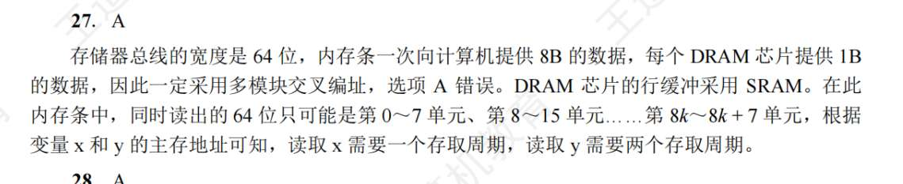
28. A
29. A
30. 是复用就 B，不复用就 C 吗
31. B
32. A，这个重看一遍题
	1. 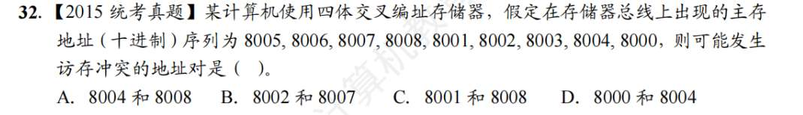
33. ?感觉得画图
	1. 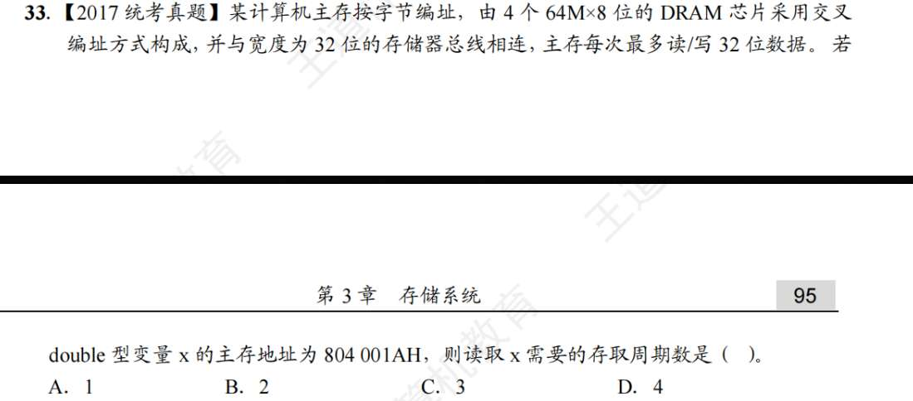
	2. 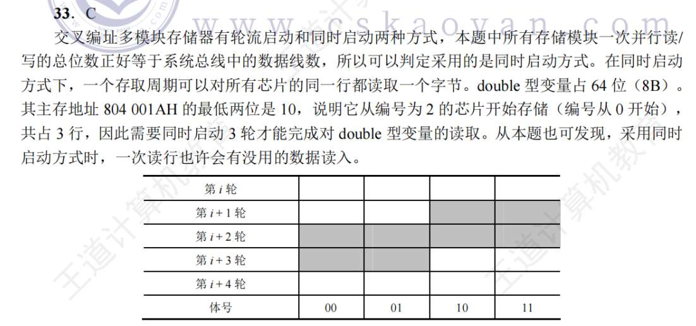
34. D??? 保证地址引脚小，选 D 的话只是保证刷新快
35. ？
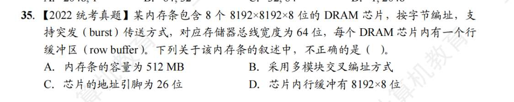
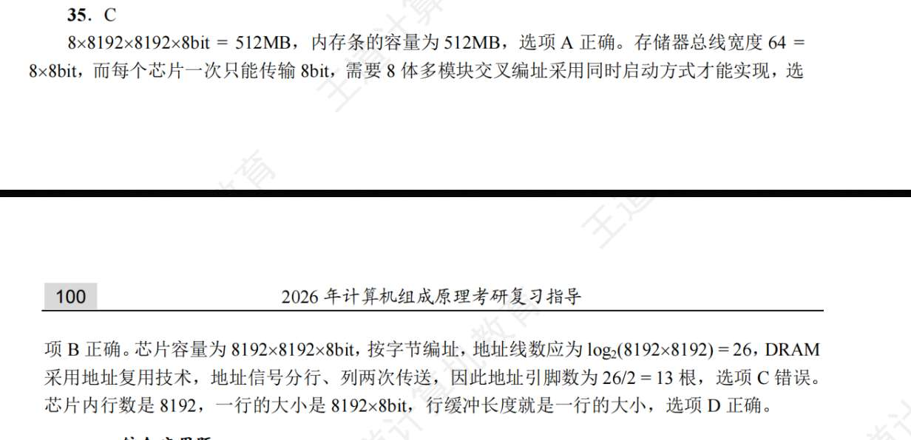
# 存储器与 CPU 连接
1. D
2. A
3. D
4. A
5. C
6. D
7. C 注意高、低位的描述！
8. C
9. D
10. B
11. ... 没读懂题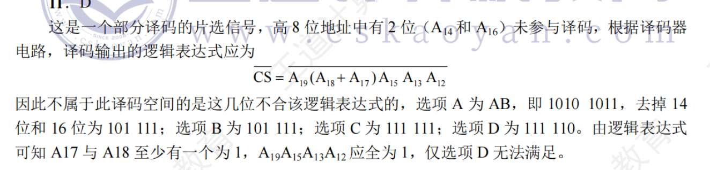
12. D
13. D
14. D 想考啥？想表示 MAR 的位数决定了主存地址空间的大小
15. ?纯粹是计算了，2 的 16 次方减 2 的 13 次方，我说是 2 的 3 次方，这不扯吗
16. C
17. 这跟按字节编址无关吧 C

# 外存
1. C
2. ?A
3. ?C
4. C
5. A
6. D
7. ?

# Cache
1. B
2. C? 块和页是不是一回事，应该说页框吧，
3. C（关于平均访问时间，到达同时不同时访问 cache 和主存，题目不说，是默认先 cache，cache 没找到再去找主存而不是同时出发吧）
4. D
5. A
6. C
7. B
8. A
9. C（指令 cache） 指令 cache 比数据 cache 有更好的空间局限性，因为指令流是顺序执行
10. A
11. A
12. C? 我发现我不清晰的地方在于，组相联，主存块号%组号之后呢？之后干嘛，具体放哪个位置？似乎是哪有空放哪就行。对于 K 路组相联，K=1 应当是直接映射，K=Cache 块数是全相联映射
13. C
14. B（地址映射表）地址映射表是，cache 行数×（主存标记项+有效位），呃没有脏位吗？哦那给跟地址映射无关。那么一行对应 4096 个主存，则主存标记为 12 位。我是忘了 1 位有效位。不过我记得知识还有主存标记位的简化啊，因为比如 cache 行数用两位就能表示完，那么主存的最后两位和 cache 最后两位一样啊
15. C，(TAG 是？) 比如把主存地址二进制展开，低位视作组号字段（组相联）/行号字段（直接映射），其他都为标记位？那全相联是整个地址都是标记位？
16. 我的计算流程：cache 块大小是 2 ^5bit ，那么主存容量 2^20，可算出主存共 1 可分 2^15 块，先算出主存地址在哪一块，再% cache 行数 2^14/2^5=2^9，就算出字块了。主存地址是 0011 0101 0011 0000 0001，那么 00110 块，第 5 块，5%2^9.... 不会算了。然而答案很简单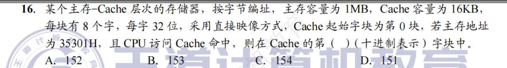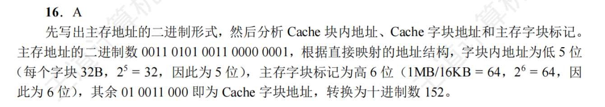
17. 