# 指令系统
1. D
2. A? 什么是没条指令的控制信号，以及，ISA 到底在哪里，程序员的脑子里，还应在计算机的哪里
   **控制信号应是硬件根据 ISA 生成的。然后 ISA 应该是和硬件绑定的，设计好的**
3. A
4. A，
5. D
6. C? 中断隐指令由硬件实现，不是程序控制类指令。它的作用是啥来着
   **不是指令！是硬件自动执行的微程序/逻辑序列 关、保、引**
7. C
8. C
9. B
10. ?什么叫能完成两个数的算术运算的单地址指令 **哦，ADD A  ，就行了，是 A+寄存器上的数吧，存在 ACC**
11. B
12. B
13. C
14. ？B 
    注意题目说的，地址码长度，是指一个地址需要多少位表示。二地址指令，那地址码长度就位 24 位。那操作码只有 8 位空间了。
    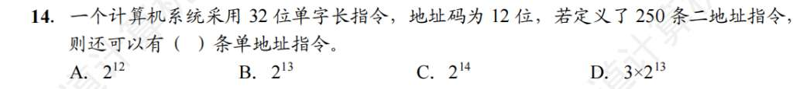
15. 算的 23 啊
    **注意！算出 23 位，但计算机按字节编址，需要是 8 的倍数！所以答 24 位**
16. 怎么记忆 ISA 规定的内容？
    **纯硬件的，就不是规定的内容。如 CPU 时钟周期，加法器的进位方式**
17. D

# 指令寻址方式
1. B
2. A
3. B
   **想缩短指令某个地址段的位数，使用寄存器寻址。由于 CPU 内部寄存器数量有限（比如 16 个），只需 4 位就能索引。。变址寻址的话，形式地址大小也可能很长，变址寻址的优势不在于“缩短指令”，而在于处理循环和数组**
4. B
5. B
6. A
7. C，括号不熟
   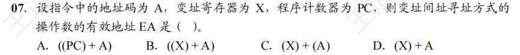
   变址寻址是 (X)+A，再加个间址：((X)+A)
8. B 变址和基址还需整理
9. B
10. D
11. C? 各个堆栈
    **寄存器堆栈是硬堆栈，主存划分的堆栈是软堆栈**
12. C 转移跳跃浮动
13. B 小端是最小的在地址小的地方？
14. D
    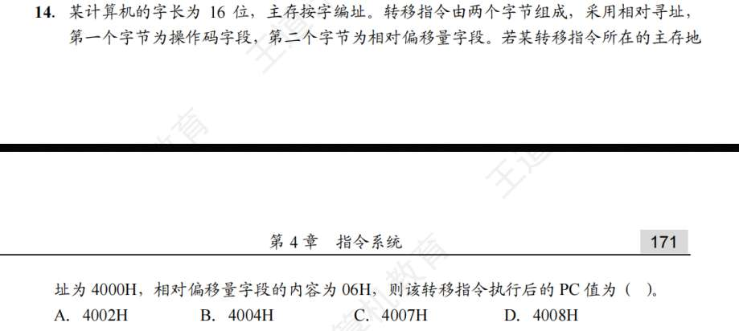
	相对偏移，不熟相对 PC 吗？此时不熟 PC 是 4001，然后 +06 后 4007，此时 PC 再往后移动为 4008 吗？不是 PC 始终是下一个指令吗 1
	然后 +06 后 4007，此时就停了，对于相对偏移寻址，执行转移指令后 PC 就跳到该指令上，而不是该指令的下一个，不太对吧，我还是觉得 PC 无论何时都应该在指令的下一个指令
15. D
16. B（同 14 的问题）
17. /?
    不会“翻译”题目，97 种操作是说操作码位数，六种寻址方式是说寻址特征位数，最后能算出地址码位数。
18. B (存储字长，机器字长，地址总线宽度区别)
19. D
20. B
    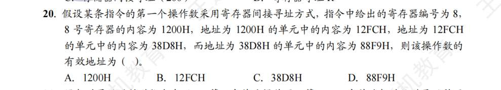答案选 A，我没看懂，难道 8 还算一个地址吗
    哦，因为题目问的有效地址，而不是操作数！
21. 不会
    问题 1，47 转补码怎么快速计算，-43 也是
    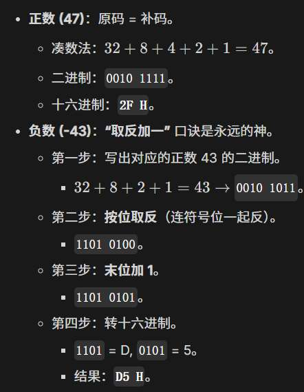
    
    问题 2，什么叫以低字节为字地址存放方式，低字节到底指什么，
    - 这就是 **小端方式 (Little Endian)** 的教科书定义。算出来的偏移量是 16 位的，比如 00 2F H。指令的第 2 字节（地址较低）存 2F，第 3 字节（地址较高）存 00。
    问题 3，啥会有补码的扩充这个问题
    - 你算出来的偏移量是 8 位的（比如 47 对应 2F，-43 对应 D5）。但指令留给偏移量的位置是 **16 位（2个字节）**。
    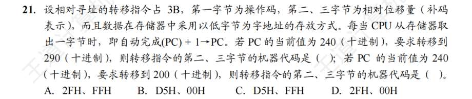
    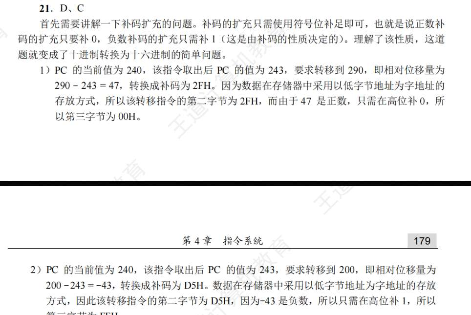
22. 什么玩意 LSB
     **LSB (Least Significant Byte/Bit)**：**最低有效字节/位**。就是权重最小的那一端（写在最右边的） **数据**：ABCD 00FF H。AB 是 MSB。 FF 是 LSB。
     本体，先算出 C选项，因为有补码的扩充，是**数据的“起始地址”** ，这个数据是。操作数的机器数？为啥？我没理解
     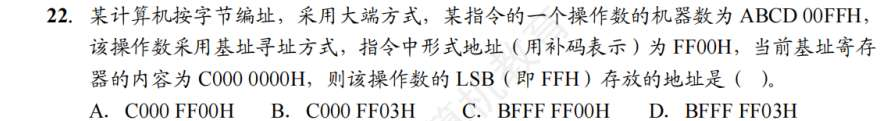
23. ACD 都很对啊...
    A，逻辑有取反，算术有 INC，DEC
    C  转移指令（Branch/Jump）改变的是 **PC (程序计数器)** 的值，控制的是 **指令执行流 (Control Flow)**。“数据调用次序”这个词是生造的，数据访问顺序是由访存指令决定的，不是由转移指令决定的。
    
    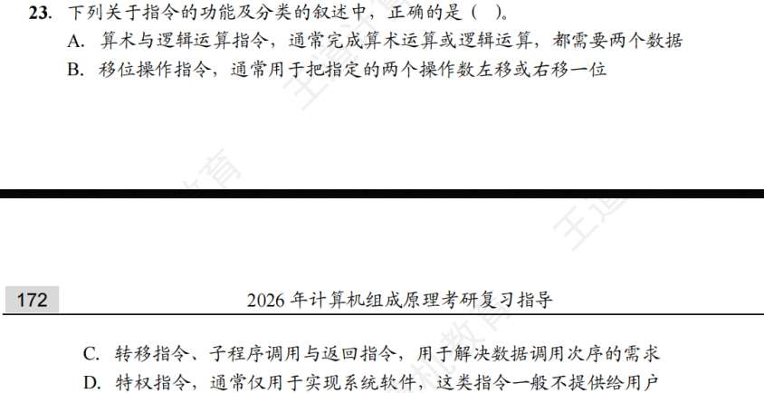
24. 出的啥题啊，标志位都啥意思我能看懂，但到底什么时候“激活”我不懂
    
    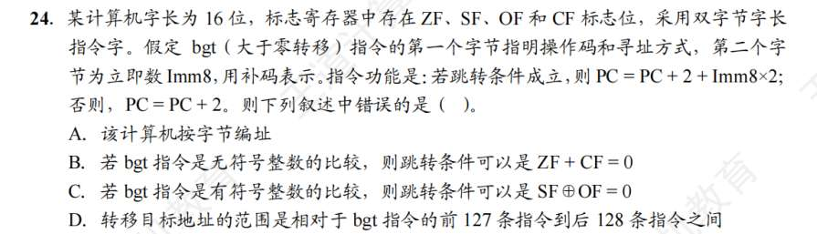
	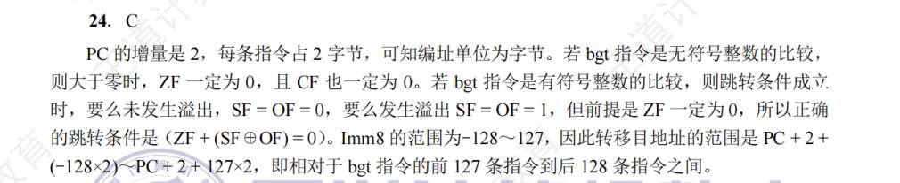
25. C
26. A
27. C
28. D
29. A
30. C
31. D
32. .
   double 是 8 字节，100H，256 字节，
    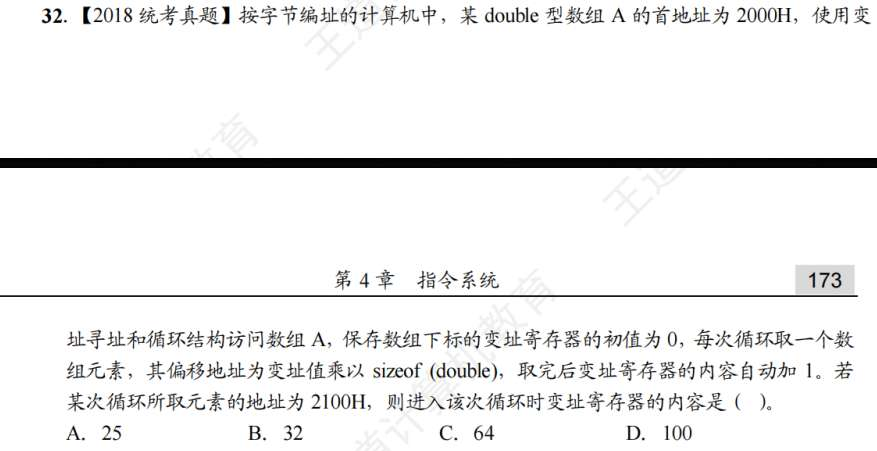
33. D
34. A
35. A

# 机器级代码
1. C
2. B
3. ？
   还是没理解透彻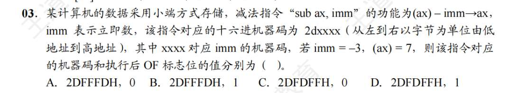
4. C 
5. C
6. D
7. C
8. C
9. D
10. D
11. ？
    我需要详细对照例子解释
    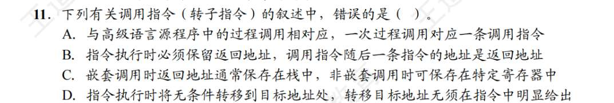
12. C
