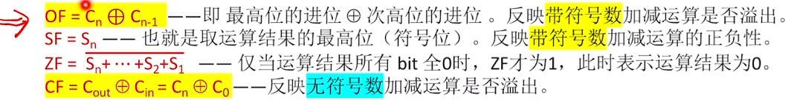
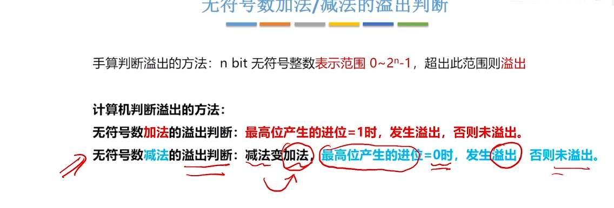
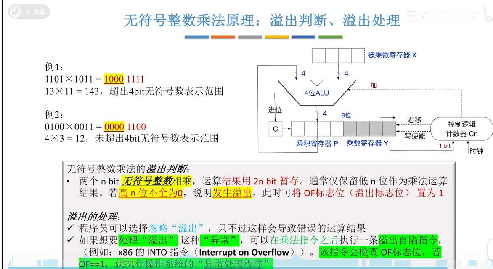
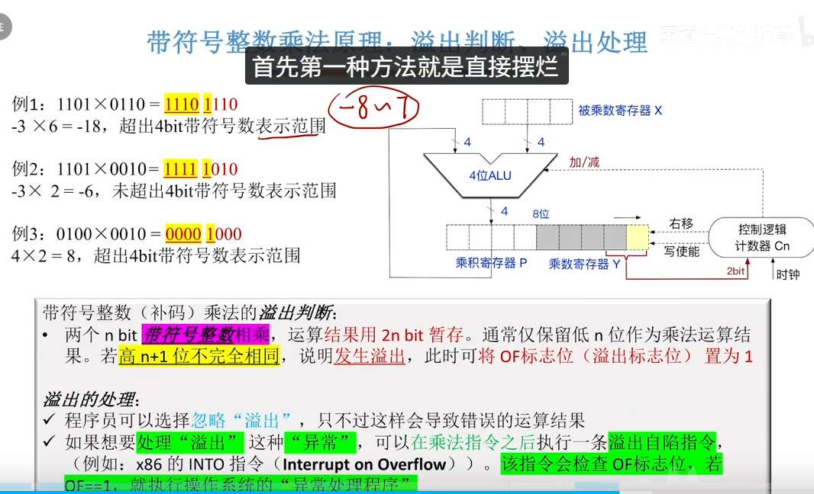
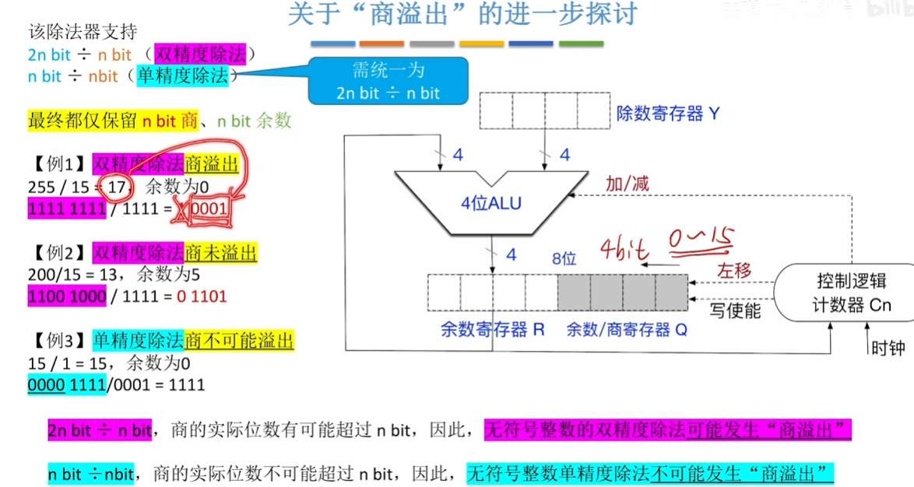
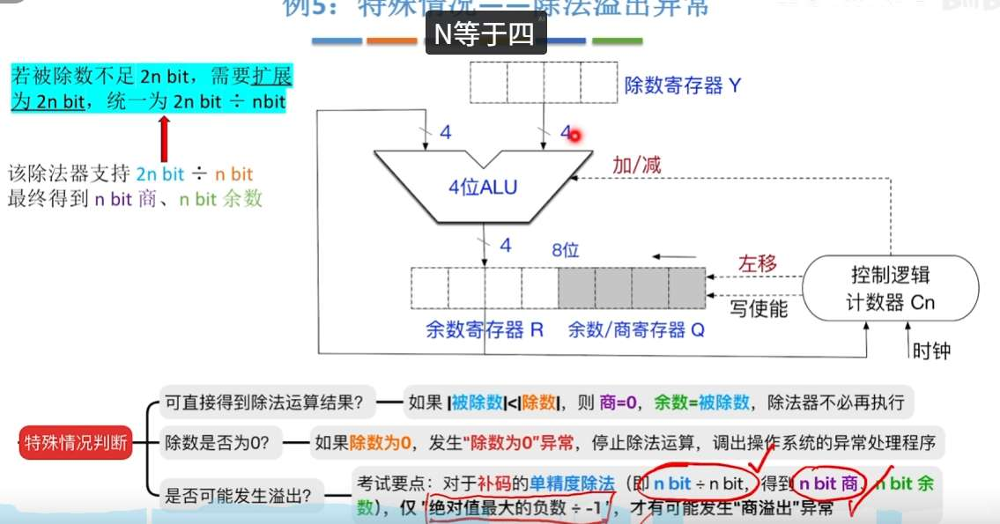

OF ：最高位的进位与次高位进位不同，可以表现为   1...+1... =  (1) 0... 或 0..+0...= (0) 1... 
CF  ：Cin 是做减法时，取反加 1 那个“1”
只记录无符号加减法是否溢出

## 补码运算判断溢出 ：
法 1

法 2，看两次进位

即 OF 标志位
法 3，双符号位

## 无符号加减溢出

## 无符号整数乘法

## 有符号整数乘法

# 无符号除法

# 有符号除法
