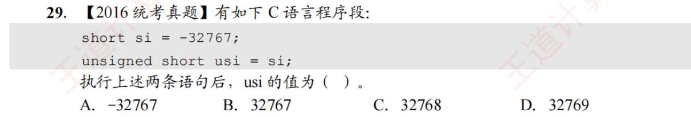
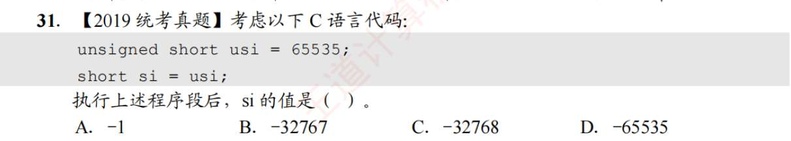
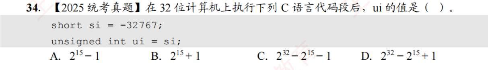

### 第 29 题：有符号转无符号

- **已知：** `si = -32767`
    
- **目标：** 求对应的无符号数 `usi`
    
- **秒杀法：** 负数转无符号数，直接**加上模**。
    
    $-32767 + 65536 = 32769$
    
- **答案：** 直接选 **D**！
    

_(原理回放：无符号数把最高位的 `-32768` 看成了 `+32768`，里外里相差了 `65536`，所以直接加模即可。)_

---

### 第 31 题：无符号转有符号

- **已知：** `usi = 65535`
    
- **目标：** 求对应的有符号数 `si`
    
- **秒杀法 1（用模算）：** 无符号大数转有符号负数，直接**减去模**。
    
    $65535 - 65536 = -1$
    
- **答案：** 直接选 **A**！
    
- **秒杀法 2（凭直觉）：** `65535` 是 16 位无符号数能表示的最大值，它的二进制必然是**全 1**（`1111...1111`）。而在补码世界里，**全 1 永远代表 -1**（你可以用我们刚才学的位权法算一下：$-32768 + 16384 + ... + 1 = -1$）。看到无符号最大值转有符号，闭眼选 -1。

只要遇到同位数的 signed 和 unsigned 强转：

1. 找出它们的模（8 位是 256，16 位是 65536，32 位是 $2^{32}$）。
    
2. **负数 $\rightarrow$ 无符号：加模**
    
3. **大的无符号 $\rightarrow$ 负数：减模**

