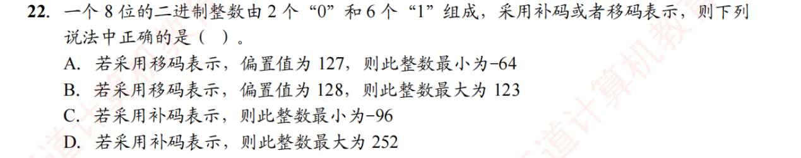
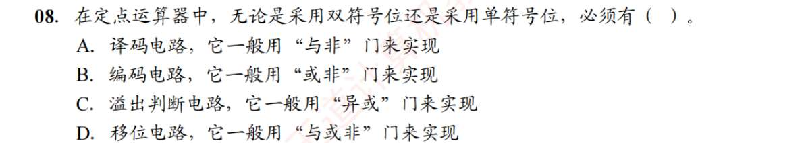
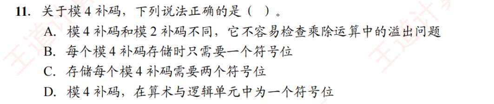

# 数制与编码
1. B
2. B
3. D
4. B
5. B
6. D
7. C
8. D
9. C
10. B
11. C?
12. C
13. B
    还有 0 这一情况
14. B
15. C
16. A
17. D
18. B
19. D
20. C
21. B
22. ?
    
    移码的计算规则非常简单，它是直接用无符号的二进制数减去一个“偏置值”：

	**实际数值 = 二进制无符号整数值 - 偏置值**
	
	为了得到最小或最大的实际数值，我们需要先拼出最小或最大的“二进制无符号整数”。
	
	- **怎么拼出最小值？**
	    
	    把小的数字（`0`）放在权重最高的位置（最左边），大的数字（`1`）放在右边。
	    
	    拼出来的二进制是：`00111111`
	    
	    把它转换成十进制：$32 + 16 + 8 + 4 + 2 + 1 = 63$
	    
	    （这也是这组积木能拼出的最小无符号数）
	    
	- **验证选项 A：**
	    
	    如果偏置值为 127，那么此整数的最小值为：$63 - 127 = -64$。
	    
	    **这与选项 A 的描述完全一致，所以 A 是正确答案！**
	    
	- **怎么拼出最大值？（顺手验证选项 B）**
	    
	    把 `1` 都顶到最左边，`0` 放在最右边。
	    
	    拼出来的二进制是：`11111100`
	    
	    把它转换成十进制：$128 + 64 + 32 + 16 + 8 + 4 = 252$
	    
	    如果按选项 B 说的偏置值为 128，那么最大值应该是：$252 - 128 = 124$。而选项 B 说是 123，所以 B 错。
	    - **寻找补码的最小值（验证选项 C）：**
    
	    要想数值最小（也就是负得最多），最高位必须是 `1`（贡献 $-128$）。
	    
	    剩下的 7 个位置里，我们还要放 1 个 `0` 和 5 个 `1`（因为总共是 2个0、6个1，符号位已经用掉一个 1 了，抱歉，重新清点一下：总共 2 个 `0`，6 个 `1`。最高位用了 1 个 `1`，还剩 2 个 `0` 和 5 个 `1`）。
	    
	    为了让它负得最多，我们需要让后面正数部分的贡献**越小越好**。所以要把仅剩的 2 个 `0` 放在权重最大的位置上。
	    
	    拼出来的二进制是：`10011111`
	    
	    计算实际数值：$-128 + (16 + 8 + 4 + 2 + 1) = -128 + 31 = -97$。
	    
	    选项 C 说最小是 -96，所以 C 错。
	    
	- **寻找补码的最大值（验证选项 D）：**
	    
	    要想数值最大，最高位必须是 `0`（正数）。
	    
	    剩下的 7 个位置里，还要放 1 个 `0` 和 6 个 `1`。为了让数值最大，要把 `1` 都放在高位。
	    
	    拼出来的二进制是：`01111110`
	    
	    计算实际数值：$64 + 32 + 16 + 8 + 4 + 2 = 126$。
	    
	    选项 D 说最大是 252（它其实是把无符号数的最大值拿来忽悠人的），所以 D 错。
23. A
24. D
25. D
26. B
27. A
28. B
29. D
30. D
31. , [有符号无符号互相转换](卡片/有符号无符号互相转换.md)
32. D
33. B
34. , [有符号无符号互相转换](卡片/有符号无符号互相转换.md)

# 运算方法和电路
1. C
2. C
3. B
4. D
5. D
6. C
7. ?算术左移
   左移最高位不管是啥直接丢
8. A???
   - **A. 译码电路 / B. 编码电路：** 运算器的核心是 ALU，它负责加减乘除。编解码是指令系统或者 I/O 接口干的活，不是运算器强制要求的必需品。
    
  - **C. 溢出判断电路，它一般用“异或”门来实现：** **这就是正解！** 无论是单符号位比较进位 ($C_s \oplus C_1$)，还是双符号位直接比较两个符号位的值 ($S_{f1} \oplus S_{f2}$，如果不相等，比如变出了 `01` 或 `10` 就说明溢出了)，它们在底层物理电路上，**全部都是通过一个简单的“异或门（XOR）”来实现的。** 这是运算器为了保证计算结果正确性，绝对不可或缺的保底机制。
    
 - **D. 移位电路：** 移位电路很重要，但它不是由“与或非”这种基础门强行定义的（它通常用多路选择器 MUX 或专门的桶形移位器实现）。而且，这道题的语境在强调“单/双符号位”的区别，这明显是在往“溢出”这个概念上引导。
  
9. A
10. C。但除法是?
11. 忘了
    
12. B
13. D 我在想双符号位法和符号位进位、最高位进位一起看法道理是一样的
14. C
15. B
16. B
17. A?
    逻辑左移时，最高位移的是 1，则溢出
18. D
19. 