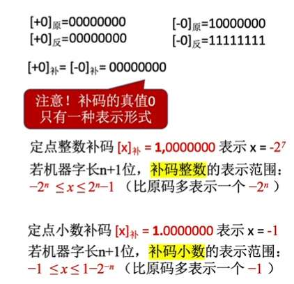
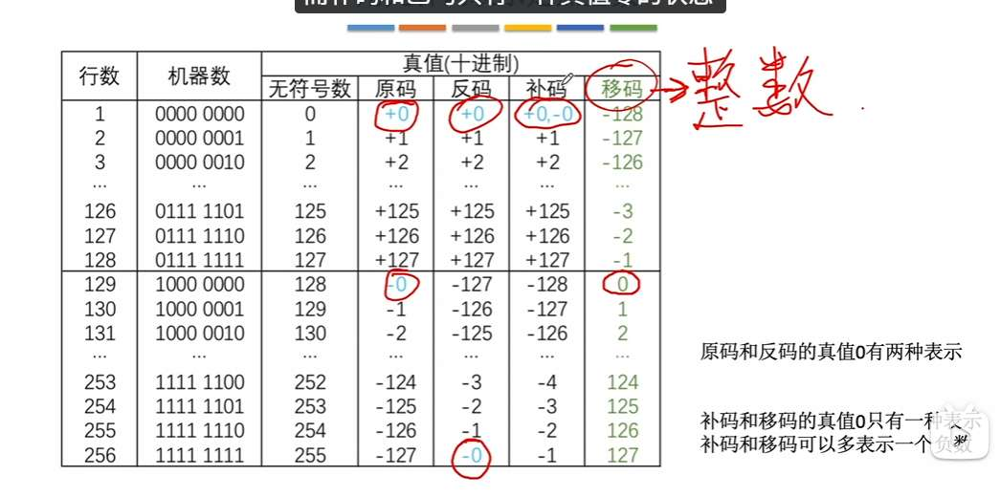
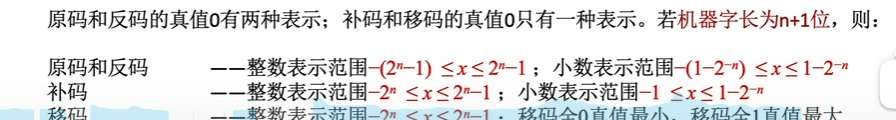
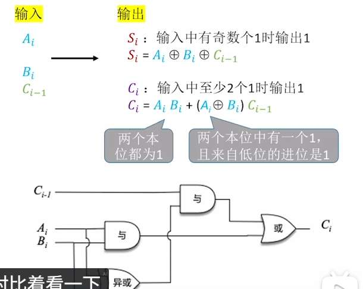
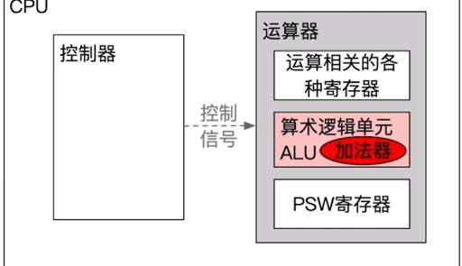
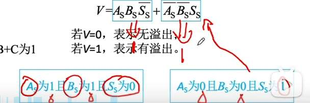
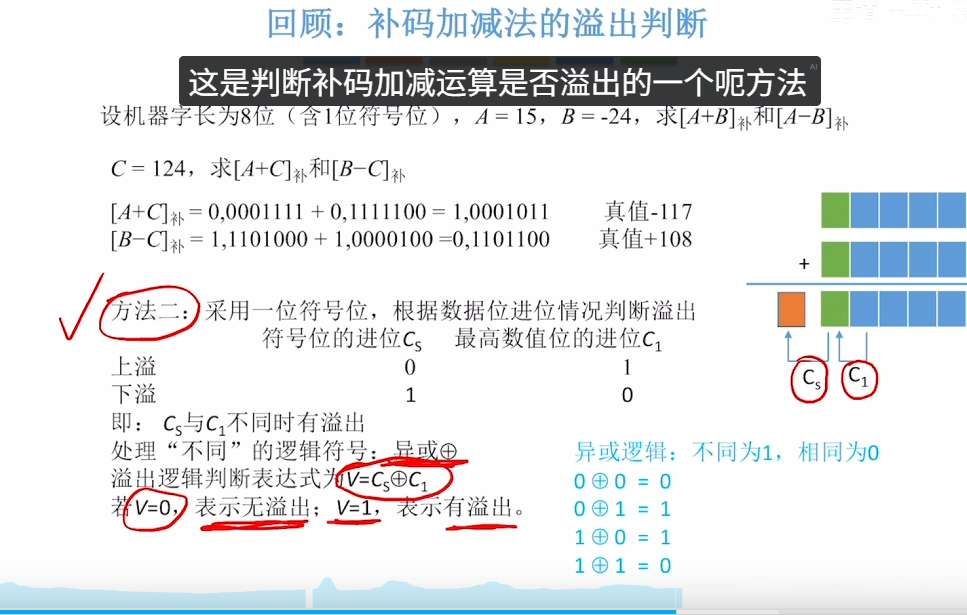
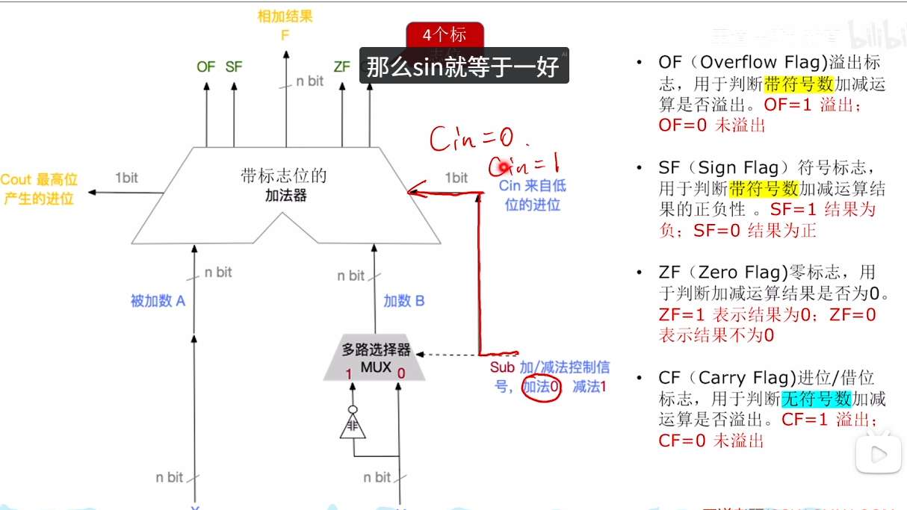
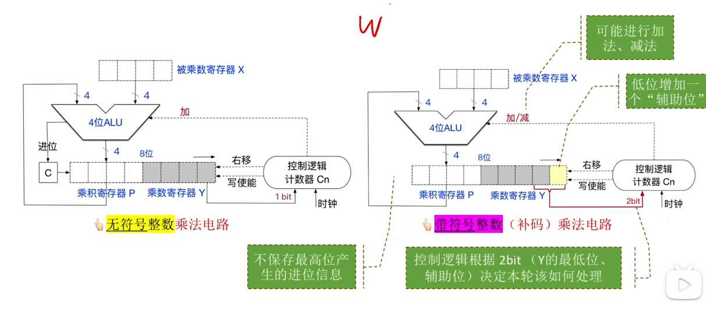
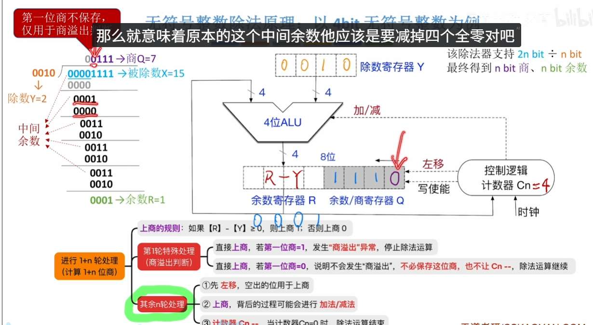

# 定点数
n+1 位，有 1 位符号位
原码：$-(2^n-1)<=x<=2^n-1$ 
反码范围也是

但补码不是。
规定，+0 和-0 的补码都是 000000

100000（原来 -0 原码的样子），我们表示成-2^n

表示范围

### IEEE
![[数值数据的表示-1748422458865.jpeg]]
负数补码表示

![[数值数据的表示-1748349383214.jpeg]]

IEEE还原呢？
展开二进制，看是不是正数（确定隐含最高位），第一位是0就是正数
接下来的8位，是阶码，不过要减去127才是真正阶码。剩下的23位，都是尾数，不包含隐含最高位的尾数！

## 浮点数表示范围

## 范围
原码表示范围 $-（2^n - 1） 到2^n -1$  11111  01111 共两倍的$2^n - 1$
原码的10000 是 -0
补码：  补码的 10000 是 $-2^n$ 所以就比原码多一个

小数：

![[数值数据的表示-1750261828452.jpeg]]

模值：最大减去最小 + 1

![[数值数据的表示-1750262484650.jpeg]]

# 加法器

- 输出=两个本位与一个进位，连续异或
- 进位：两个本位为 1，或者，两个本位中有一个是一，且进位是 1
- 
- 标志位：OF、SF、 （有符号数）  ZF、**CF** （可判断无符号数是否溢出）
	- OF：

ALU 作用：
- 算数运算
- 逻辑运算

无论算术右移还是逻辑右移，右移丢弃的位=1 的话，就会丢失精度

补码运算判断溢出：
法 1

法 2，看两次进位

法 3，双符号位

# 乘法

