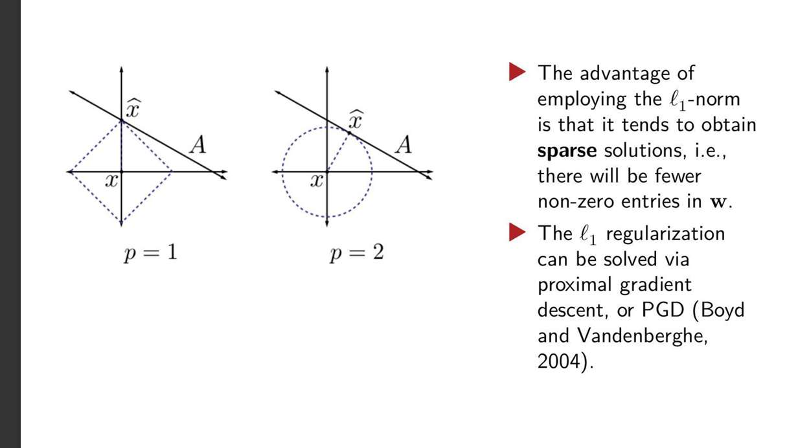
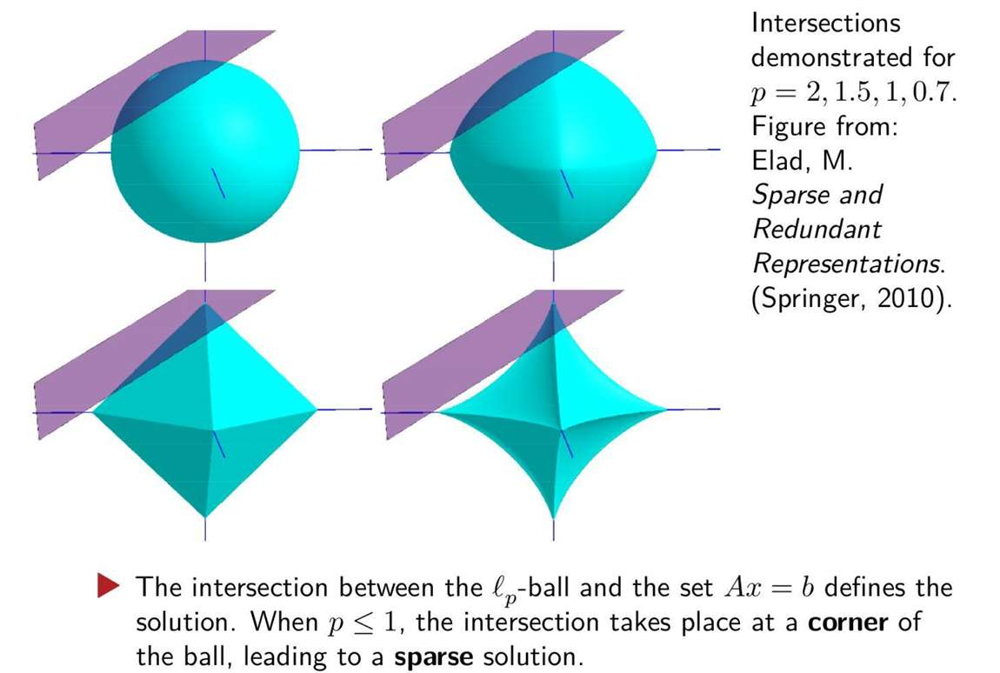

# filter
feature selection does not related to the training procedure ?
不是所有方法都这样吗？
relief  as  relevant statistics? 
额，怎么measure？
把相关的特征组合起来当作向量？ 然后这个向量又，corresponds to a feature?
到底什么是Relief

threshold ?  statistic大于这个threshold，  或者，用k个统计样本measure k个特征？
看不懂

#### **1. 核心思想：先过滤，再训练**

> **"feature selection does not related to the training procedure ?" (特征选择与训练过程无关？)**
> **"不是所有方法都这样吗？"**

这是一个绝佳的问题，也是理解三种方法分野的**关键**！
*   **答案是：并不是所有方法都这样！这正是Filter方法最独特的标志。**

**Filter方法的工作流程就像一个筛子：**
1.  **第一步：分析数据**。它完全不关心你**以后**会用什么机器学习模型（比如SVM、决策树或神经网络）。它只根据特征本身的**统计学特性**（比如方差、相关性、信息量等）来给每个特征打一个“重要性”分数。
2.  **第二步：筛选特征**。根据第一步得到的分数，过滤掉那些得分低的特征。
3.  **第三步：训练模型**。把筛选后留下的“干净”特征喂给你**最终选定**的机器学习模型去训练。

整个特征选择的过程，就像是在数据预处理阶段加了一个独立的“特征过滤网”，它和后续的模型训练是**完全解耦**的、**分离**的。

#### **2. Relief算法：如何衡量特征的重要性？**

现在我们来看具体的算法。Relief是Filter方法中一种非常经典和巧妙的算法。

> **"relief as relevant statistics? 额，怎么measure？"**

这里的 "relevant statistics" 就是我们上面说的那个“重要性分数”。Relief算法的设计目标就是为**每一个特征 `j`** 计算出一个分数 $δ^j$。这个分数越高，说明特征 `j` 对分类任务越重要。

**Relief的核心逻辑 (P19)：**

它的思想是：“**一个好的特征，应该能让来自同一类别的样本距离更近，而让来自不同类别的样本距离更远。**”

为了实现这个思想，它执行以下操作：
1.  **随机**选取一个样本 $x_i$。
2.  在**与 $x_i$ 同类别**的样本中，找到离它**最近**的一个邻居，我们称之为“**猜中近邻 (near-hit)**”，记作 $x_{i,nh}$。
3.  在**与 $x_i$ 不同类别**的样本中，找到离它**最近**的一个邻居，我们称之为“**猜错近邻 (near-miss)**”，记作 $x_{i,nm}$。
4.  **更新分数**：现在，我们来看**某个特定的特征 `j`** 在这个过程中的表现。
    *   我们计算 $x_i$ 和它的“同类近邻” $x_{i,nh}$ 在特征 `j` 上的**距离**：$diff(x_i^j, x_{i,nh}^j)$。如果这个距离很小，说明特征 `j` **做得很好**（让同类更近了），我们应该**奖励**它。
    *   我们计算 $x_i$ 和它的“异类近邻” $x_{i,nm}$ 在特征 `j` 上的**距离**：$diff(x_i^j, x_{i,nm}^j)$。如果这个距离很大，说明特征 `j` **做得很好**（让异类更远了），我们应该**奖励**它。
5.  **分数更新公式 (P19)**:
    $δ^j = ... - diff(x_i^j, x_{i,nh}^j)^2 + diff(x_i^j, x_{i,nm}^j)^2$
    *   这个公式正是上面思想的体现：
        *   与**同类**的距离越小，减去的项越小，总分越高。
        *   与**异类**的距离越大，增加的项越大，总分越高。
6.  **重复与平均**：我们把上述过程重复 `m` 次（遍历所有样本），不断累加每个特征 `j` 的得分，最后得到每个特征的最终“重要性分数” $δ^j$。

#### **3. 如何使用Relief的结果 (P18)**

> **"threshold ? statistic大于这个threshold， 或者，用k个统计样本measure k个特征？"**

现在我们已经为**所有**的特征都计算出了一个重要性分数 $δ$ (这是一个向量，每个元素对应一个特征)。接下来怎么用它呢？有两种简单的方法：

1.  **设定阈值 `τ`**：我们保留所有重要性分数 $δ^j > τ$ 的特征。
2.  **设定数量 `k`**：我们对所有特征的重要性分数进行排序，直接选取**排名前 `k`** 的特征。

**总结一下Filter和Relief：**
*   **Filter**是一种思想：特征选择和模型训练分离。
*   **Relief**是实现这种思想的一种具体算法：它通过“猜中近邻”和“猜错近邻”的距离来为每个特征打分，整个过程完全不需要训练任何最终分类器。

1.  **“怎么知道是不是同类别呢？”**
    *   这个问题的答案是：**我们看训练数据的标签 (Label)**。
    *   在进行特征选择时，我们使用的是**带标签的训练数据**。每一个样本 $x_i$ 都对应着一个已知的类别标签 $y_i$（比如“猫”或“狗”，“健康”或“患病”）。
    *   所以，当我们为样本 $x_i$ 寻找“猜中近邻 (near-hit)”时，我们会在所有与 $x_i$ **标签相同**的样本中去寻找。
    *   同样，寻找“猜错近邻 (near-miss)”时，我们会在所有与 $x_i$ **标签不同**的样本中去寻找。
    *   **标签信息是Relief算法能够工作的根本前提。**

2.  **“那怎么知道特征的邻居呢？**”
    *   这里的“邻居”指的是**样本的邻居**，而不是特征的邻居。我们是在**整个特征空间**中计算样本与样本之间的距离。
    *   假设我们有两个样本，$x_a$ 和 $x_b$，它们都有 `d` 个特征。
        *   $x_a = (x_a^1, x_a^2, ..., x_a^d)$
        *   $x_b = (x_b^1, x_b^2, ..., x_b^d)$
    *   我们可以使用标准的**距离度量公式**来计算它们之间的距离，最常用的是**欧几里得距离 (Euclidean Distance)**：
        $Distance(x_a, x_b) = \sqrt{(x_a^1 - x_b^1)^2 + (x_a^2 - x_b^2)^2 + ... + (x_a^d - x_b^d)^2}$
    *   **算法流程**：对于样本 $x_i$，我们会计算它与数据集中所有其他样本的距离，然后根据这个距离值进行排序，从而找到离它最近的“同类邻居”和“异类邻居”。

### **我们再回到 P19 的 `diff` 函数**

现在你可能会问，既然我们知道了如何计算样本间的整体距离，那公式里那个 $diff(x_i^j, x_{i,nh}^j)$ 又是什么？

*   这里的 `diff` 函数计算的是**两个样本在单个特征维度上的距离**。
*   **对于数值型特征**：$diff(a^j, b^j) = |a^j - b^j|$ (取绝对值差)。PPT中的平方项其实已经包含了这个思想。
*   **对于类别型特征**（比如“颜色”是“红”或“蓝”）：$diff(a^j, b^j)$ 可以定义为：如果值相同则为0，如果值不同则为1。

所以，Relief算法的逻辑是：先用**所有特征**计算出样本间的**整体距离**，以此来找到“近邻”；然后再**拆解到单个特征维度**上，分析这个“近邻关系”是由哪些特征贡献的，从而为每个特征打分。

# Wrapper

performance of learner ? 什么是learner？
然后说wrapper的feature selection 有 more computational cost than filter
就说计算多一点，感觉更靠谱吧
Procedure这符号还是不太能看懂
在我眼里ppt就没介绍wrapper啊？

### **1. 核心思想：把学习器“包”起来 (P21)**

> **"performance of learner ? 什么是learner？"**

*   **Learner (学习器)**：就是你最终打算使用的那个**机器学习模型算法**，比如决策树、SVM、逻辑回归、神经网络等等。

现在，我们来对比Filter方法，理解Wrapper的**根本不同**：
*   **Filter (过滤式)**：特征选择器 和 学习器 是**两个独立的东西**。特征选择器完全不关心学习器是什么，它自己玩自己的“统计游戏”。
*   **Wrapper (包裹式)**：特征选择器把最终的**学习器本身**当作一个“黑盒子”。它评价一个特征子集好不好的**唯一标准**就是：**“用这个特征子集去训练我的学习器，然后在验证集上跑一下，性能得分高不高？”**

**Wrapper的工作流程就像一场“海选”：**
1.  **提出候选方案**：通过某种**搜索策略**（比如我们之前学的前向选择或后向选择）产生一个候选的特征子集，比如 `{特征A, 特征B, 特征D}`。
2.  **进行实战演练**：**真正地**用这个子集 `{A, B, D}` 去训练你的学习器（比如一个SVM模型）。
3.  **评估表现**：用训练好的SVM模型在一个**验证集**上进行预测，计算出一个性能指标（比如准确率、AUC等）。这个性能指标就是这个特征子集的“**最终得分**”。
4.  **循环往复**：不断提出新的候选方案（特征子集），重复第2、3步，最终选出那个让学习器性能得分最高的特征子集。

> **"然后说wrapper的feature selection 有 more computational cost than filter 就说计算多一点，感觉更靠谱吧"**

**完全正确！**
*   **计算成本高**：因为每评估一个候选特征子集，你都需要**完整地重新训练一次模型**。如果你的搜索策略要评估100个子集，你就得训练100次模型。而Filter方法从头到尾都不需要训练模型，速度自然快得多。
*   **效果通常更好**：也正如你所感觉的，“更靠谱”。因为它直接针对你最终要用的那个学习器进行优化，所以选出来的特征子集可以说是为这个学习器“量身定制”的，性能表现通常会比Filter方法选出的通用特征集要好。

---

### **2. 解读LVW算法伪代码 (P22)**

LVW (Las Vegas Wrapper) 是Wrapper思想的一种具体实现。它没有用前向或后向那种固定的搜索策略，而是采用了一种**随机搜索**的策略。

我们来逐行解读它的伪代码：

> **Input: Data set $D$, feature set $A$, learner $L$, stop time $T$**
> **输入**：数据集D，**全部**特征的集合A，学习器L，以及一个停止参数T（可以理解为最大允许的连续失败次数）。

> **E = ∞, d = |A|, A* = A, t = 0**
> **初始化**：
> *   `E`：记录到目前为止找到的**最小误差**，初始为无穷大。
> *   `d`：记录最小误差对应的**特征数量**，初始为全部特征数。
> *   `A*`：记录到目前为止找到的**最佳特征子集**，初始为全部特征。
> *   `t`：一个计数器，记录连续多少次没有找到更好的解，初始为0。

> **while t < T do**
> **主循环**：只要连续失败的次数还没达到上限T，就一直循环。

> **Generate random subset A';**
> **步骤1**：从全部特征A中，**随机**生成一个特征子集 `A'`。这是它的搜索策略。

> **d' = |A'|;**
> **步骤2**：计算这个随机子集的大小 `d'`。

> **E' = CrossValidation(L(D_A'));**
> **步骤3 (核心！)**：
> *   `D_A'`：表示只包含 `A'` 中特征的数据。
> *   `L(D_A')`：用这个子集数据去**训练学习器L**。
> *   `CrossValidation(...)`：用交叉验证的方式来评估这个训练好的模型的**误差**，得到 `E'`。这就是它的评估方法。

> **if (E' < E) ∨ ((E' = E) ∧ (d' < d)) then**
> **步骤4：判断与更新**。如果出现了以下两种情况之一：
> 1.  新子集的误差 `E'` **严格小于**当前记录的最小误差 `E`。
> 2.  或者，新子集的误差 `E'` **等于**最小误差 `E`，但是新子集的特征数量 `d'` **更少**。
> **那么，我们就找到了一个更好的解！**

> **t = 0, E = E', d = d', A* = A';**
> **更新记录**：
> *   重置失败计数器 `t` 为0。
> *   将最小误差 `E` 更新为 `E'`。
> *   将最佳特征数 `d` 更新为 `d'`。
> *   将最佳特征子集 `A*` 更新为 `A'`。

> **else**
> **如果没找到更好的解**：

> **t = t + 1;**
> **失败计数器加1**。

> **endif**
> **end while**
> **循环结束。** 最终输出的就是 `A*`。

**总结一下：** LVW就是不断地随机“猜”一个特征子集，然后用学习器去实际地跑一下分，如果分数比之前的记录要好（或者分数一样但用的特征更少），就更新记录。如果连续猜了很多次都无法超越之前的记录，就停止。

# Embedding with l1 Regularization
这个方法 既有特征选择的评估 也有学习器的训练过程  就是有点结合filter和wrapper？
然后都用同一个optimization完成 额，这不叫优化器吧？
然后说，feature selection是自动完成的。 等下，他说的是， selection
emm 不应该是filter的评估  说的是，跟SBS一样的特征选择？
然后给出 l2normwithl1norm？
啥意思 
’obtain sparse solution？ 获取稀疏解？ 
后面几个图更是看不懂了 

### **1. 核心思想：一步到位 (P25)**

> **“这个方法 既有特征选择的评估 也有学习器的训练过程 就是有点结合filter和wrapper？”**

这个类比很不错，但更精确的描述是：它**融合 (fuses)** 了特征选择和模型训练，让它们**同时发生**，成为**同一个过程**。

我们再回顾一下前两种方法：
*   **Filter**：选择 ↔ 训练 (完全分离，两步走)
*   **Wrapper**：选择(训练->评估 -> 选择) ↔ 训练 (选择过程反复调用训练过程，仍然是两个分离的模块)
*   **Embedded (嵌入式)**：**(选择 + 训练)** (在一个统一的优化过程中同时完成)

> **“然后都用同一个optimization完成 额，这不叫优化器吧？”**

这里的 "optimization" 指的是**优化过程**或**优化问题**本身，而不是指具体的优化器算法（如SGD, Adam等）。它的意思是，我们只需要求解**一个**数学优化问题，当这个问题被解开（模型训练完成）时，特征选择的结果也**自然而然**地产生了。

> **“然后说，feature selection是自动完成的。”**

**是的，这正是嵌入式方法最大的魅力。** 你不需要像Wrapper那样去搜索和评估上百个子集。你只需要正常地训练你的模型，训练结束后，你看一下模型的参数，就知道哪些特征是重要的，哪些是不重要的。

---

### **2. L1 正则化 (LASSO) 如何实现自动特征选择 (P26)**

PPT用了一个最经典的嵌入式方法作为例子：**LASSO (使用L1正则化的线性回归)**。

我们先看两个公式：

1.  **岭回归 (Ridge Regression)** - 使用L2正则化
    $J(w) = \sum(y^{(i)} - w^T x^{(i)})^2 + \lambda ||w||_2^2$
    *   $||w||_2^2 = \sum w_j^2$ (权重向量的L2范数的平方，即所有权重**平方和**)
    *   我们在之前的课程中知道，L2正则化可以**防止过拟合**，它会惩罚大的权重，使得权重值都趋向于**比较小**，但**很难恰好等于0**。

2.  **LASSO (Least Absolute Shrinkage and Selection Operator)** - 使用L1正则化
    $J(w) = \sum(y^{(i)} - w^T x^{(i)})^2 + \lambda ||w||_1$
    *   $||w||_1 = \sum |w_j|$ (权重向量的L1范-数，即所有权重**绝对值之和**)
    *   **关键区别**：就是把L2换成了L1。

> **“obtain sparse solution？ 获取稀疏解？”**

**是的！这就是L1正则化的“魔法”所在。**
*   **稀疏解 (Sparse Solution)**：指的是模型训练完成后，权重向量 `w` 中有**大量的元素都恰好变成了0**。
*   **这意味着什么？** 回想一下线性模型的公式 $y = w_1 x_1 + w_2 x_2 + ... + w_d x_d$。如果某个权重 $w_j$ 变成了0，就意味着特征 $x_j$ 对最终的预测结果**没有任何贡献**了。
*   **自动特征选择**：因此，通过查看哪些权重被“压缩”成了0，我们就自动完成了特征选择！所有权重**不为0**的特征，就是被模型**选中**的特征。

---

### **3. 为什么L1能产生稀疏解？- 直观几何解释 (P27)**

> **“后面几个图更是看不懂了”**

这几张图是理解L1和L2区别的最经典、最核心的解释。我们来看 **P27** 左边这张2维的图。

这个图展示的是我们**最小化损失函数**的过程。
*   **优化目标**：我们要找到一个权重 `w`（在这个二维图里就是 `(w1, w2)`)，使得损失函数 $J(w)$ 最小。
*   **等高线**：图中那些斜着的、类似椭圆的线，是**原始损失函数**（即 $\sum(y - w^Tx)^2$ 部分）的**等高线**。越靠近中心的点 $\hat{x}$，原始损失越小。
*   **约束区域**：
    *   图 `p=2` 中的**圆形区域**，代表了L2正则化项的“约束边界”，即所有满足 $|w_1|^2 + |w_2|^2 \le C$ 的点。
    *   图 `p=1` 中的**菱形（方形）区域**，代表了L1正则化项的“约束边界”，即所有满足 $|w_1| + |w_2| \le C$ 的点。
*   **求解过程**：求解带正则化的损失函数，在几何上等价于：寻找一个点，它既在**约束区域**上（或内部），又要使它所在的**等高线**尽可能地靠近中心点 $\hat{x}$。
    *   换句话说，就是寻找**等高线**与**约束区域**的**第一个交点**。

**关键区别来了：**
*   **L2 (圆形)**：由于圆形边界是光滑的，等高线和它相切的点**几乎不可能**恰好发生在坐标轴上。所以交点处的 $w_1$ 和 $w_2$ 通常都**不为0**。
*   **L1 (菱形)**：由于菱形有**尖锐的角**，而且这些角**恰好都在坐标轴上**。等高线从中心扩展出来时，有**非常大的概率**会首先碰到菱形的某个**顶点**。
    *   请看图 `p=1`，交点 A 恰好就在 $w_2$ 轴上，这意味着在这一点上，**$w_1=0$**！
    *   **这就是稀疏性的来源！** L1正则化的菱形约束，使得最优解天然地倾向于出现在坐标轴上，从而导致某些权重为0。

**总结：**
嵌入式方法通过修改模型的**目标函数**（比如加入L1正则化项），使得模型在**训练（优化）**的过程中，就**内在地、自动地**完成了对特征的筛选。L1正则化因为其菱形的约束边界，天然地倾向于产生稀疏解（部分权重为0），从而成为最经典的嵌入式特征选择方法。

### **解读 P28 的图**

图中的物体可以分为两类：

1.  **紫色的平面 (The Plane)**：
    *   它代表了没有正则化时的**解空间**。在线性回归中，所有能完美拟-合训练数据（即使得 $\sum (y - w^Tx)^2 = 0$）的解 `w` 构成了一个平面（或超平面）。
    *   这个平面在图中被标记为 `Ax = b`（这是线性代数中的表达，与我们这里的 $w^Tx=y$ 思想一致）。我们可以把它想象成原始损失函数的“谷底”。

2.  **蓝绿色的球体 (The $l_p$-ball)**：
    *   这代表了由不同**p-范数**正则化项定义的**约束空间**。我们的最优解 `w` 必须位于这个球体的表面或内部。
    *   **`p=2` (左上角)**：这是L2范数，它的约束空间是一个完美的**球体**。
    *   **`p=1.5` (右上角)**：当p值从2变小时，球体开始向内收缩，变得有点“方”。
    *   **`p=1` (左下角)**：这就是L1范数，它的约束空间是一个**正八面体**（Octahedron），可以看作是二维菱形在三维的推广。**请注意，它的所有顶点都恰好落在坐标轴上！**
    *   **`p=0.7` (右下角)**：当p值小于1时，这个形状会向内凹陷，形成一个“海星”或“飞镖”的形状，但它的**尖角依然在坐标轴上**，并且变得更加尖锐。

### **核心思想：平面与球体的交点**

> **"The intersection between the $l_p$-ball and the set $Ax=b$ defines the solution."**
> **翻译**：$l_p$球体和平面`Ax=b`的**交点**，定义了（带正则化的）问题的解。

这和我们在2D图里说的“等高线与约束区域的第一个交点”是同一个意思。我们要在满足约束（在球体内）的前提下，找到离原始解（在平面上）最近的点。

> **"When p ≤ 1, the intersection takes place at a corner of the ball, leading to a sparse solution."**
> **翻译**：当 $p \le 1$ 时，交点**更容易**发生在球体的**角点**上，从而导致一个**稀疏解**。

**这就是这张图最想传达的核心信息：**
*   **对于`p=2`的球体**：它的表面是完全光滑的，平面切上去，交点几乎不可能恰好落在坐标轴上。所以解的三个坐标分量（$w_1, w_2, w_3$）通常都**不为0**。
*   **对于`p=1`的正八面体**：它的表面是由多个平面和尖锐的棱、角组成的。当紫色的平面“切”过来时，有**非常高的概率**会先碰到其中一个**顶点**。而这些顶点都在坐标轴上，比如 `(0, 0, C)` 这个点，它的前两个坐标分量就是0。这就意味着 $w_1=0, w_2=0$，只留下了 $w_3$。这是一个**极其稀疏**的解！

**总结：**
P28通过三维可视化，再次强化了P27的结论。它让我们看到，L1正则化（以及所有 $p \le 1$ 的Lp正则化）之所以能产生稀疏解、实现特征选择，根本原因在于其约束空间的几何形状具有**尖锐的、且恰好位于坐标轴上的角点**。这使得优化过程中的最优解天然地倾向于落在这些角点上，从而将对应坐标轴之外的其它特征权重“压缩”为零。

# Dictionary Learning
regular rows or columns是线代的专业术语？
 adequate dictionary  , 去 transform samples to sparse respresentation?
 我感觉，有点模型量化，压缩的意味，把权重变sparse ？
后面的公式我也是不敢看了。
你除了解释以外，也可以告诉我解读方法论
每次都让ai解释了

当你遇到像“字典学习 (Dictionary Learning)”这样的新术语时，可以尝试按以下步骤拆解和理解：

1.  **找准核心目标 (What is the Goal?)**：先不管细节，用一句话概括它想解决什么问题。
2.  **类比已知概念 (How is it similar to what I know?)**：把它和你已经懂的东西联系起来，建立理解的桥梁。
3.  **识别关键元素 (What are the key components?)**：找出公式或描述中的核心名词，理解它们各自扮演的角色。
4.  **理解权衡关系 (What is the tradeoff?)**：几乎所有优化问题都存在一个权衡，找到它，你就理解了问题的本质。
5.  **推演工作流程 (How does it work, step-by-step?)**：将算法的执行过程在脑海里或纸上“跑”一遍。

---

现在，我们用这个方法论来解读 **P30-P32** 的字典学习。

### **1. 核心目标 (P30)**

> **"We need to find an adequate dictionary that samples are transformed to some sparse representation such that the learning task can be simplified or the model complexity is reduced."**

*   **提炼目标**：这句话的核心是 `transform samples to sparse representation` (将样本转换为稀疏表示)。
*   **一句话概括**：字典学习的目标是，**为原始数据找到一种新的、更简洁的（稀疏的）表达方式**。

### **2. 类比已知概念**

> **“我感觉，有点模型量化，压缩的意味，把权重变sparse ？”**

这个类比非常棒！你的直觉是对的，它确实和“压缩”、“稀疏”有关。但有一个关键区别需要厘清：
*   **L1正则化 (LASSO)**：是让模型的**权重向量 `w`** 变得稀疏，从而筛选**特征 (feature)**。
*   **字典学习**：是让**每个样本 $x_i$ 的新表示 $\alpha_i$** 变得稀疏，从而**压缩和重构样本本身**。

**另一个类比：**
*   **原始数据 (样本 $x_i$)**：一张高清的、复杂的风景照片。
*   **字典学习的目标**：找到一套非常基础的“绘画笔触”（比如“横线”、“圆点”、“斜线”等），这套笔触就是**字典 (Dictionary)**。然后，用**尽可能少**的这几种笔触，组合起来**重构**（画出）这张风景照片。这个“用笔触的清单”（比如：3个横线 + 5个圆点 + 0个斜线...），就是这张照片的**稀疏表示 (Sparse Representation, $\alpha_i$)**。

### **3. 识别关键元素 (P31 公式)**

现在我们带着上面的类比来看这个让人害怕的公式：
$min_{B, \alpha_i} \sum_{i=1}^m ||x_i - B\alpha_i||_2^2 + \lambda \sum_{i=1}^m ||\alpha_i||_1$

这个公式里只有三个关键元素：
*   **$x_i$**: 第 `i` 个**原始样本** (那张高清照片)。
*   **$B$**: **字典 (Dictionary)** (那套“绘画笔触”)。它是一个矩阵，每一列可以看作一个“笔触”或“基础模式”。
*   **$\alpha_i$**: 第 `i` 个样本的**稀疏表示** (那张“用笔触的清单”)。它是一个向量，告诉我们用了多少“1号笔触”、多少“2号笔触”... 来重构 $x_i$。

**"regular rows or columns" 是什么意思？(P30)**
这不是一个严格的线代术语。这里的 "regular" 指的是“整齐的”。PPT的意思是，有些稀疏矩阵可能整行或整列都是0，而字典学习要处理的可能是更普遍的、0元素散乱分布的稀疏情况。你可以暂时忽略这个细节。

### **4. 理解权衡关系 (P31 公式)**

这个公式由两部分组成，用 `+` 连接，这几乎永远意味着一个**权衡 (Tradeoff)**。
*   **第一部分: $\sum ||x_i - B\alpha_i||_2^2$**
    *   $B\alpha_i$ 的意思是，用“笔触清单” $\alpha_i$ 和“笔触库” $B$ 来**重构**出原始的样本 $x_i$。
    *   $||...||_2^2$ 计算的是**重构出来的样本**和**原始样本**之间的**误差** (Reconstruction Error)。
    *   我们希望这个误差越小越好，即**重构得越像越好**。

*   **第二部分: $\lambda \sum ||\alpha_i||_1$**
    *   $||\alpha_i||_1$ 就是我们熟悉的 **L1范数**！它的作用就是强迫向量 $\alpha_i$ 变得**稀疏**（有很多0）。
    *   我们希望 $\alpha_i$ 越稀疏越好，即**用的“笔触”种类越少越好**。

**权衡关系就此揭晓：**
字典学习试图在**“重构的保真度”**（第一项，希望误差小）和**“表示的简洁度”**（第二项，希望表示稀疏）之间找到一个最佳的平衡。
*   $\lambda$ 就是这个权衡的调节旋钮。$\lambda$ 越大，模型就越倾向于让 $\alpha_i$ 稀疏，哪怕会牺牲一些重构的精度。

### **5. 推演工作流程 (P32)**

公式里要同时优化 `B` 和 `\alpha`，这很难。所以PPT介绍了一种非常常见的策略：**交替迭代 (Alternating Iteration)**。就像两个人合作拧一个又紧又滑的瓶盖，一个人先固定住瓶身，另一个人使劲拧盖子；然后交换，一个人固定住盖子，另一个人转瓶身。

*   **第一阶段：固定 B，优化 α (找清单)**
    *   假设我们已经有了一套不错的“笔触库” B。
    *   对于每一个样本 $x_i$，我们求解 $min_{\alpha_i} ||x_i - B\alpha_i||_2^2 + \lambda||\alpha_i||_1$。
    *   **解读**：这个问题是在问，“用这套固定的笔触，如何找到一个最稀疏的清单 $\alpha_i$ 来最好地重构 $x_i$？”
    *   PPT说，这个问题和 **LASSO** 很像，确实如此。我们可以用类似的方法来求解它。

*   **第二阶段：固定 α，优化 B (更新笔触库)**
    *   现在，我们为所有样本都找到了它们对应的“清单” `A` (所有 $\alpha_i$ 的集合)。
    *   我们求解 $min_B ||X - BA||_F^2$ (这里的 $||.||_F^2$ 是矩阵范数，你可以就理解为所有误差的平方和)。
    *   **解读**：这个问题是在问，“我已经知道了每张画需要用哪些笔触来画，现在我该如何**设计我这套笔触库B本身**，才能让所有画的整体重构误差最小？”
    *   这是一个标准的最小二乘问题，可以用一些高效的算法（如KSVD）来求解。

**循环**：我们在这两个阶段之间反复迭代，直到B和A都收敛稳定。最终，我们就同时得到了一个能很好地表示这批数据的**字典B**和每个样本的**稀疏表示A**。
