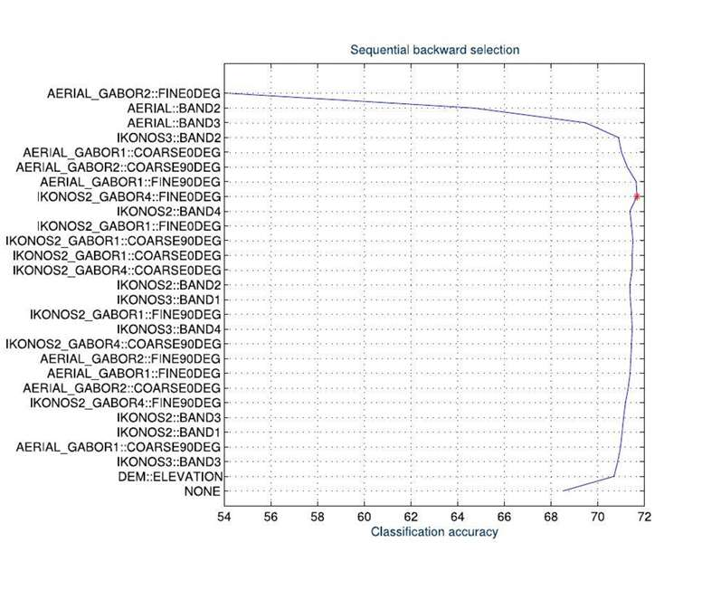

对所有可能的特征子集进行“暴力”搜索是不可行的。为什么？如果一个数据集有30个特征，暴力搜索大概需要评估多少个子集？这引出了什么问题，我们又该如何解决？
exhaustive的暴力搜索，是impractical的  时间复杂度！
若30个特征 我们要俩个特征的话， 那就是 C_30_2 是60除以30的阶乘（我忘了计算对不对）
况且，我们还不知道要几个特征，哇，更是炸裂的计算量！
怎么解决？ 

这类迭代式策略中最经典的一族：**序列搜索 (Sequential Search)**。

#### **1. 序列前向选择 (Sequential Forward Selection, SFS) - “做加法”**

这是第8页和第9页上半部分描述的方法。它的逻辑非常像组建一支篮球队：

- **第1轮 (k=1)**：
    
    - **动作**：从所有球员（特征）中，单独测试每一个人，看谁的表现最好。
        
    - **结果**：选择表现最好的那个球员（比如勒布朗），作为球队的核心。
        
    - **当前子集**: {勒布朗}
        
- **第2轮 (k=2)**：
    
    - **动作**：将剩下的所有球员，逐一与勒布朗搭档，组成二人组进行测试。
        
    - **结果**：找到与勒布朗搭档时，能让球队整体表现最好的那个球员（比如库里）。
        
    - **当前子集**: {勒布朗, 库里}
        
- **第3轮 (k=3)**：
    
    - **动作**：将剩下的所有球员，逐一加入到 {勒布朗, 库里} 这个组合中，组成三人组进行测试。
        
    - **结果**：找到能让这个三人组表现最好的球员。
        
    - ... 以此类推。
        
- **停止条件 (P8)**：当进行到第 k+1 轮时，我们发现新加入任何一个特征，模型的性能（比如准确率）**都没有比第 k 轮时更好**，我们就可以提前停止。
    

#### **2. 序列后向选择 (Sequential Backward Selection, SBS) - “做减法” (P9)**

这个逻辑正好相反，像是从一支完整的队伍里进行裁员：

- **第1轮**：
    
    - **动作**：从包含**所有特征**的完整集合开始。依次尝试**去掉**每一个特征，看看去掉谁之后，模型的性能**下降得最少**（或者甚至提升了）。
        
    - **结果**：正式裁掉那个“最没用”或“最拖后腿”的特征。
        
- **第2轮**：
    
    - **动作**：在剩下的特征集合里，重复上述过程，再裁掉一个最没用的。
        
    - ... 以此类推，直到满足停止条件。
        

**核心缺陷 (P8):**

> **"As a greedy strategy, no optimality is guaranteed."**  
> **翻译**：作为一种**贪心策略**，它**不保证能得到全局最优解**。

**为什么？**  
也许A和B两个特征单独看都很一般，但它们组合在一起能产生“1+1>2”的神奇效果。前向选择可能在第一步就把A和B都淘汰了，永远发现不了这个强大的组合。

---

纵轴是所有特征 那么一个点的纵坐标 越高说明包含特征越多 横坐标是准确率 所以第一个图 点的纵坐标是慢慢上升，代表”Forward Selection“ 第二个图同理 纵坐标是下降  
综合俩张图 最佳准确率都差不多 SFS略高  
但SFS特征相较而言少点 SBS多点