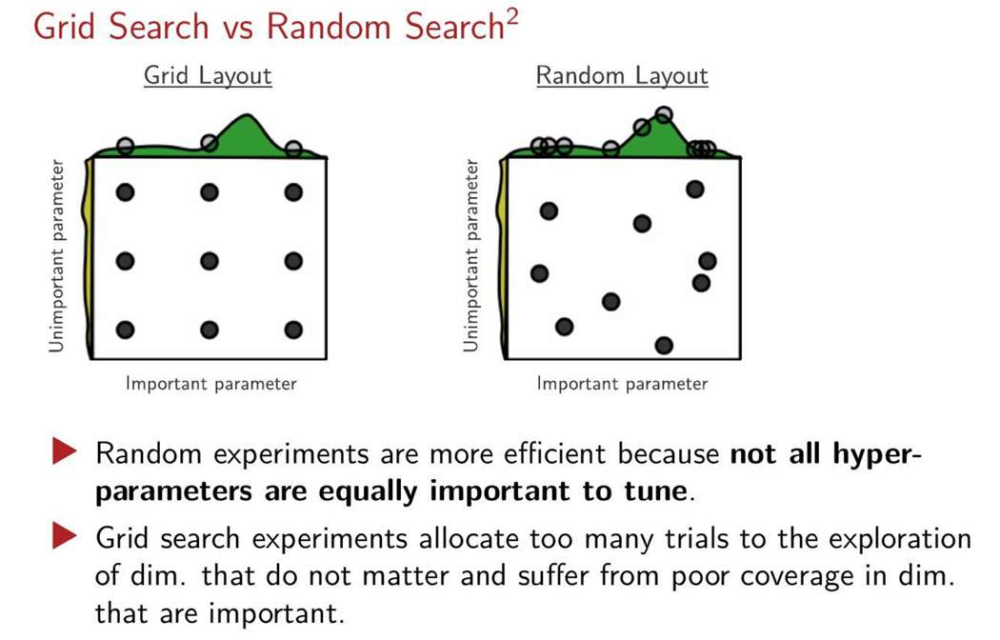

configure
data met in practice
testing subset

参数调优，意思是训练前我们就调整参数，而不是用反向传播调整参数对吧。
验证集的意思 好像是testing subset？ 就是测试集再划分一部分出去。 
为啥要这个验证集呢？
- 我们用**训练集**来训练模型。
    
- 我们用**验证集**来进行参数调优和模型选择（比如比较KNN中K=3好还是K=5好）。我们会用不同的超参数训练出多个模型，然后看哪个在验证集上表现最好，就选它。
    
- 当我们选定了最终的模型和超参数后，我们用**一次**从未使用过的**测试集**来评估其最终的、真实的泛化能力。

验证集是测试集之前的，，测试

**"manual optimization gives researchers some degree of insight into goal function"**  
**翻译：** 手动调参能让研究者对目标函数（模型的性能表现）有一定的直观理解。  
**解释：  
** 就是说自己一个一个试参数，能大概感觉到哪个参数影响大，哪个影响小。

> **"There is no technical overhead or barrier to manual optimization"**  
> **翻译：** 手动调参没有技术开销或障碍。  
> **解释：** 意思就是不需要写复杂的代码，改个数字重新跑就行，简单粗暴。

> **"grid search is simple to implement and parallelization is trivial"**  
> **翻译：** 网格搜索很容易实现，并且并行化也微不足道。  
> **解释：**
> 
> - **什么是网格搜索 (Grid Search)？**  
>     假设你要调2个超参数：学习率 [0.1, 0.01, 0.001] 和 K值。网格搜索会像遍历一张网格一样，把**所有可能的组合**都试一遍：(0.1, 3), (0.1, 5), (0.1, 7), (0.01, 3), (0.01, 5), ... 总共 3x3=9 种组合。
>     
> - **并行化微不足道**：因为这9次实验是完全独立的，你可以把它们分配给9台不同的计算机（或CPU核心）同时运行，极大地节省时间。
>

- **坐标轴**：横轴是一个**重要的超参数**（对模型性能影响大），纵轴是一个**不重要的超参数**（对性能影响小）。绿色的“山峰”区域代表了能让模型性能达到最佳的参数组合。我们的目标就是找到这个“山峰”。
    
- **左图 (Grid Layout - 网格搜索)**：它像梳子一样，在每个参数的维度上都均匀地取了3个点，总共测试了9个组合。请注意看，虽然它测试了9个点，但在**重要的横轴**上，它其实只探索了 **3个**不同的值。它把很多次试验机会（6次）浪费在了垂直方向的移动上，但因为纵轴参数不重要，这种移动对找到“山峰”几乎没有帮助。
    
- **右图 (Random Layout - 随机搜索)**：它也是测试9个点，但这9个点是在整个空间里**随机撒**的。神奇的事情发生了：由于是随机的，这9个点在**重要的横轴**上，几乎探索了 **9个**完全不同的值。这使得它更有可能“撞上”那个能通往“山峰”的正确区域。
    

**结论**：当你的超参数很多，但只有少数几个是真正重要的时候，**随机搜索**比网格搜索更高效。它不会把计算资源浪费在探索不重要的参数上，而是把每一次试验都用在探索一个**全新的、独特的组合**上。

