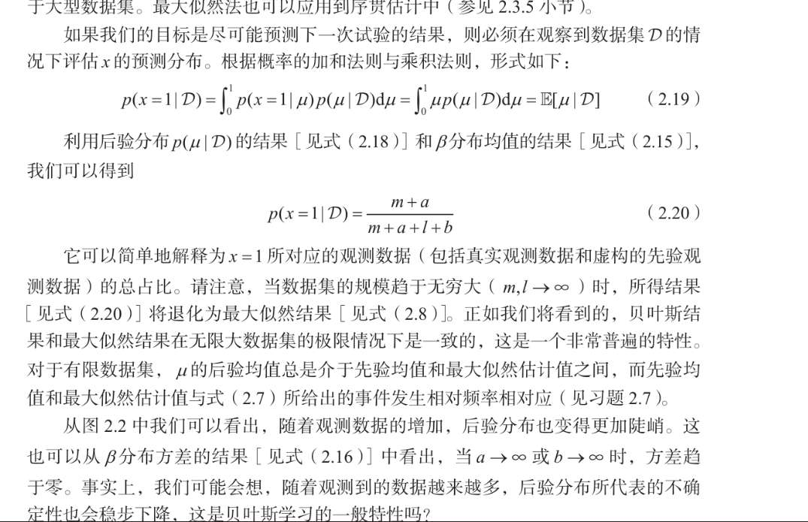
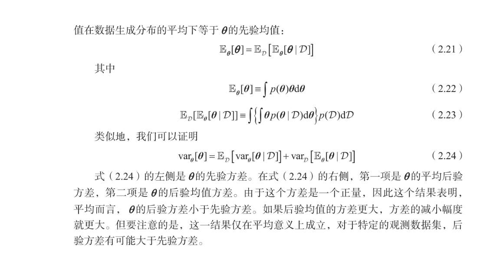
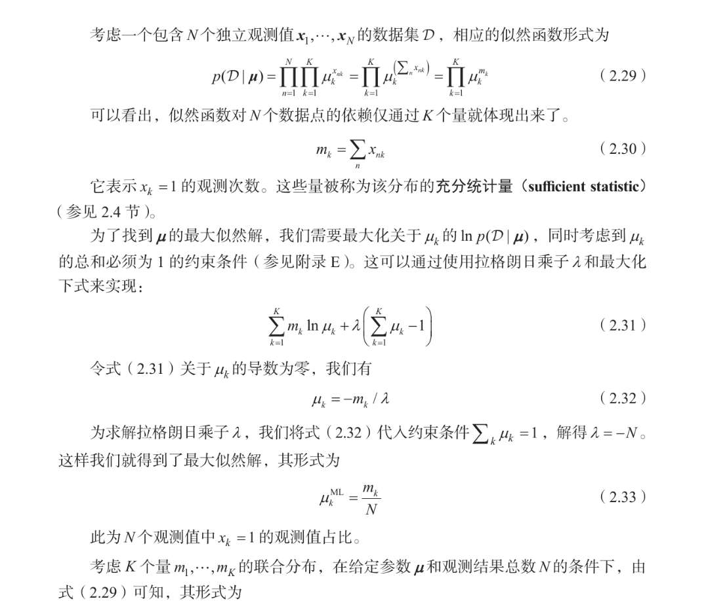
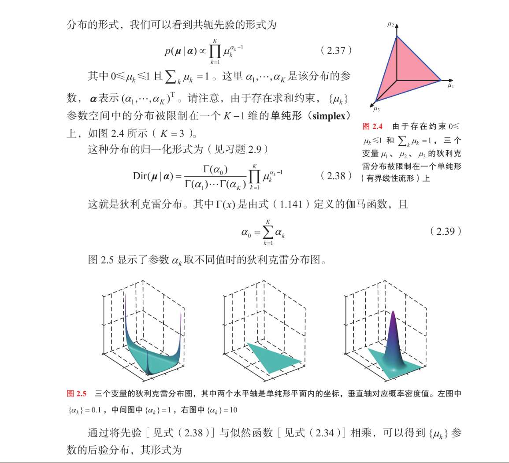
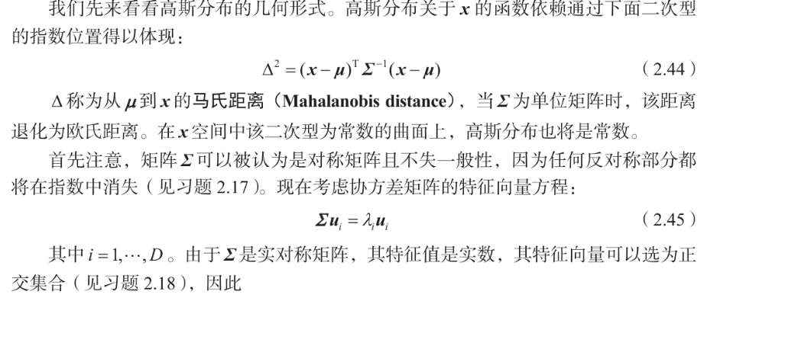
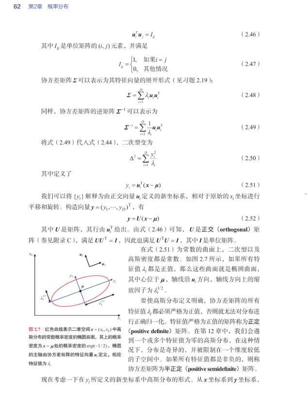
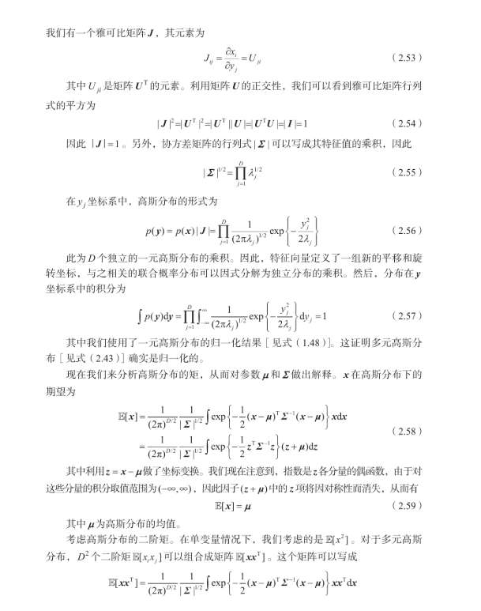
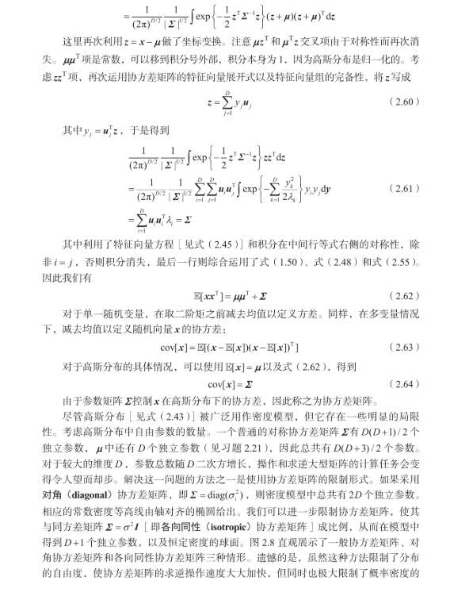
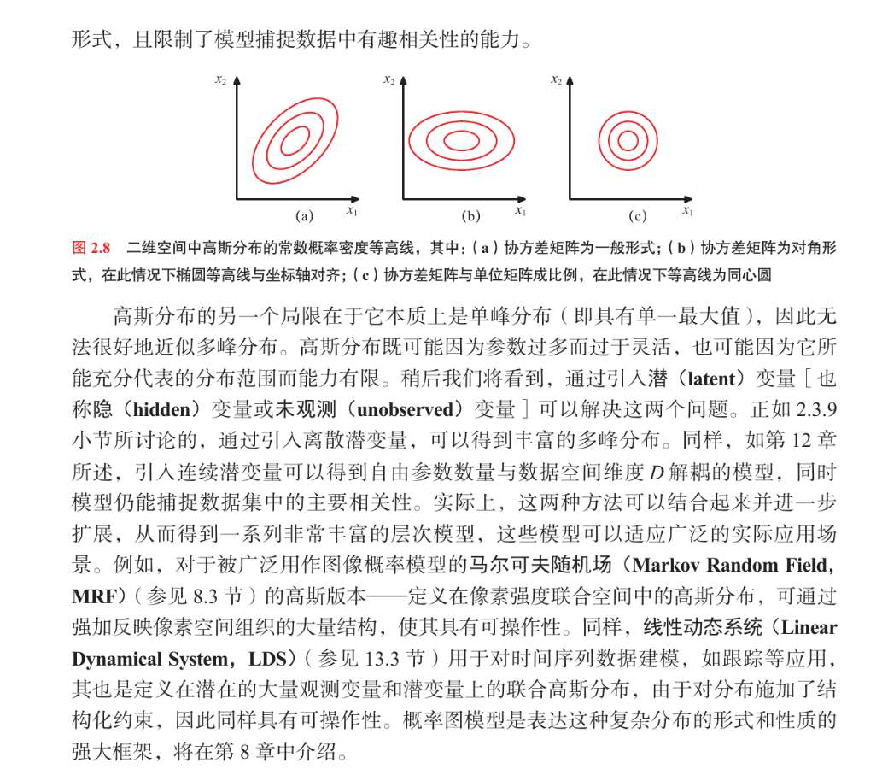

面对现实的数据，我们要使用恰到的概率分布建模，
到底选什么模型？模型具体什么样子？
这个问题被称为密度估计问题

对于参数化分布模型
- 频率学派：通过优化某些准则，算出参数的具体值
- 贝叶斯学派：通过引入先验分布，结合观察数据，计算参数的后验分布

对于贝叶斯学派，共轭先验发挥重大作用？什么意思，文章说后面解释

还有非参数化分布，这种，模型的样子（分布的形式）是基于数据集大小，也有参数，但参数控制模型的复杂度而不是分布的形式

# 二元变量
伯努利概率分布：
$Berm(x|u)=u^x(1-u)^{1-x},x\in \{0,1\}$
均值和方差 是对于x的，不是对u的，
也就是可以理解为预测未来的数据，或者总结当前数据 
好证明， 额方差，我不想套公式，有什么更好的方式理解、计算方差吗？
	**方差是衡量不确定性的，显然一半一半，最不确定 所以是个抛物线，u为0.5时取最大值 $u(1-u)$** 
然后说该分布是归一化的？什么是“归一化”的
	**属于是废话了，归一化实际就是概率和为1**
可以写出，数据集的似然函数
$p(D|u)=\prod_{n=1}^{N}u^{x_n}(1-u)^{1-x_n}$ 

进一步
$lnp(D|\mu) = \sum_{n=1}^{N}\{x_{n}\ln\mu+(1-x_n)\ln(1-\mu)\}$  

充分统计量是啥？
	正面出现的总次数就是**充分统计量** 因为它就够了 
然后呢，对上述求导，让其为0
得 $$\mu_{ML} = \frac{\sum x_n}{N}$$

我们也可以换个方式描述数据集，不对，刚才的伯努利分布就没描述数据集，只说了概率，描述数据集应该说，是最大似然这个过程？ 那么伯努利分布中的分布，是说的0和1的概率分布

现在，我们引入二项分布。这里的分布，就是1的次数的概率分布？  
我能感受到与伯努利的区别，但我不知道怎么表述更精确些
$$Bin(m|N,\mu)=C_N^m\mu^m(1-\mu)^{N-m} $$
其均值和方差....  
注意是求m的
$m=\sum_{n=1}^Nx_n$ 

用期望的线性性质，
以及独立的变量和，方差也有线性性质
结论很简单 
- 均值：$N\mu$
- 方差：$N\mu(1-\mu)$
所以更能看出其与伯努利分布的关系了
那我估计，其最大似然估计算参数u，应该结果一样吗？

## β分布
频率学派有严重过拟合现象
现在我们引入先验，用贝叶斯学派看待。
我们引入与$\mu^x(1-\mu)^{1-x}$呈正比的先验， 这样后验分布、先验分布、似然 都是相同的函数形式？ 这性质叫共轭性

这个公式好难打，不太会
伽马函数没见过啊？  均值和方差也不知如何推导，是否不需要掌握？
	$\Gamma(x)$  把它看作一个常数 $C$，它的作用仅仅是保证概率加起来等于 1，**它完全不影响分布的形状**（峰值在哪，胖瘦如何）。  你可以把 $a$ 看作**“虚拟的正面次数”**。
       你可以把 $b$ 看作**“虚拟的反面次数”**。
    均值公式：$\mathbb{E}[\mu] = \frac{a}{a+b}$。
    这不就是 “正面 / 总次数”** 吗？非常直观！
    **方差公式**：不用背。
    只要知道：**$a+b$ 越大（数据越多），方差越小（分布越尖，越确定)

我感觉核心就是，这个先验，不是p(u) 而是p(u|a,b) 也由超参数a和b调节，a和b就是我们人类的先验？
文章举了先验作用于二项分布的后验
$\mu^{m+a-1}(1-u)^{N-m+b-1}$  
但也可以作用于伯努利分布吧？
$\mu^{x+a-1}(1-u)^{1-x+b-1}$

然后文中描述，我们可以每次都使用这个后验，然后，得到的后验可以作为下一次实验的先验  也就是 a = m+a ？   m是一直变换的  所以a也一直变
后面那个b也是一样的

2.  **顺序学习 (Sequential Learning) 怎么算？**
    *   **Round 1**：
        *   先验：$Beta(\mu | a, b)$
        *   数据：$m$ 次正面，$l$ 次反面。
        *   后验：$Beta(\mu | a+m, b+l)$
    *   **Round 2**：
        *   把刚才的后验当成新的先验（现在的 $a_{new} = a+m$）。
        *   新数据：$m'$ 次正面，$l'$ 次反面。
        *   新后验：$Beta(\mu | a+m+m', b+l+l')$
    *   **结论**：所谓的贝叶斯学习，在这里其实就是**数数**！你只要不断地把看到的正面加到 $a$ 上，反面加到 $b$ 上就行了。

**公式 2.19 解读**：
$$ p(x=1|D) = \int \underbrace{p(x=1|\mu)}_{\text{如果我知道}\mu} \cdot \underbrace{p(\mu|D)}_{\text{我对}\mu\text{的信念}} d\mu $$
*   这就是在求 $\mu$ 的**后验期望（平均值）**。

**公式 2.20 解读**：
$$ p(x=1|D) = \frac{m+a}{m+a+l+b} $$
*   这是什么？这就是 **(总共看到的正面) / (总共看到的次数)**。
*   其中包含了**真实数据** ($m, l$) 和 **先验虚构数据** ($a, b$)。
*   这再次印证了：贝叶斯预测就是把先验经验和真实数据加在一起算平均。

**它在讨论：当我们观察到新数据 $D$ 后，我们的不确定性（方差）会变小吗？**

**公式 2.24 的人话翻译**：
$$ \text{var}[\theta] \text{ (先验的方差)} = \mathbb{E}[\text{后验的方差}] + \text{var}[\text{后验的均值}] $$

*   这是一个数学恒等式，它告诉我们：
    **先验方差**（原本的无知程度） **$\ge$** **平均后验方差**（看完数据后的无知程度）。

*   **结论（文中那段话的意思）**：
    *   **平均而言**，随着数据越来越多，我们的方差会变小，我们会越来越确定。
    *   **但是！** 注意“平均而言”这四个字。对于**某一次特定的数据**，我们可能会变得更困惑（方差变大）。
    *   **例子**：你原本以为硬币是公平的（方差小）。结果你扔了 5 次，全是正面。这时候你的世界观崩塌了，你开始怀疑一切，你的方差反而可能会暂时变大。但如果你扔了 1000 次，方差最终一定会趋向于 0。

# 多项式分布

$\mathbf x =(0，0，1，0，0)$  我们称  $\mathbf x$的分布为
$p(\mathbf x|\mathbf \mu) = \prod_{k=1}^{K} \mu_k^{x_k}$  其实，，就是那个唯一的1的u吧  只是我们不知道位置在哪 所以干脆连乘？**完全正确！**

然后我们也可以对 $p(D|\mu)$ 做最大似然估计  然后多了个条件约束 对于u uk的和为1 所以用拉格朗日乘法？（我高数还没复习到这） 也可求出最优参数u 和伯努利类似

di利克雷分布这公式又吓我一跳 反正还是和β分布一样 是为了有个共轭先验嘛 
但我有点混乱 也不知道为啥长这样
**助教拆解**：
请盯着公式 2.38，我要对它施魔法了。

$$ \text{Dir}(\boldsymbol{\mu}|\boldsymbol{\alpha}) = \underbrace{\frac{\Gamma(\alpha_0)}{\Gamma(\alpha_1)\dots\Gamma(\alpha_K)}}_{\text{魔法第一步：这一坨全是常数 C}} \cdot \prod_{k=1}^K \mu_k^{\alpha_k - 1} $$

**魔法生效后**：
$$ \text{Dir}(\boldsymbol{\mu}|\boldsymbol{\alpha}) \propto \prod_{k=1}^K \mu_k^{\alpha_k - 1} $$

**现在你看它眼熟吗？**
*   **多项式分布的似然**：$\prod \mu_k^{x_k}$
*   **狄利克雷先验**：$\prod \mu_k^{\alpha_k - 1}$

**为什么长这样？**
这就是**“量身定做”**！
为了让贝叶斯公式算起来简单（共轭性），先验分布**必须**长得跟似然函数像“亲兄弟”一样。
*   似然函数是 $\mu$ 的一堆次幂相乘。
*   先验函数也就必须是 $\mu$ 的一堆次幂相乘。

这样相乘之后（后验）：
$$ \text{Posterior} \propto (\prod \mu_k^{x_k}) \times (\prod \mu_k^{\alpha_k - 1}) = \prod \mu_k^{x_k + \alpha_k - 1} $$
**你看，指数直接相加，形式完全没变！** 这就是它“长这样”的唯一原因。

---

### 4. 怎么理解图 2.4 和 2.5？（单纯形 Simplex）

狄利克雷分布最难理解的其实是它的**定义域**。

*   **Beta 分布**（2个变量）：$\mu_1 + \mu_2 = 1$。所以 $\mu_1$ 确定了，$\mu_2$ 就确定了。自由度是 1。就像一根线段。
*   **Dirichlet 分布**（3个变量）：$\mu_1 + \mu_2 + \mu_3 = 1$。
    *   这三个数必须围成一个**三角形**（图 2.4 的那个彩色平面）。
    *   这个三角形就叫**单纯形 (Simplex)**。
    *   Dirichlet 分布就是在这个三角形面上的一座“山峰”。

**看图 2.5（参数 $\alpha$ 的含义）：**
*   **左图 ($\alpha < 1$)**：山峰在**三个角**。意味着概率分布很极端（我们要么全选类别1，要么全选类别2，很不平均）。
*   **中图 ($\alpha = 1$)**：平板一块。意味着**均匀分布**，没有任何偏好。
*   **右图 ($\alpha > 1$)**：山峰在**中心**。意味着概率分布很**平均**（大家都有份，比如 $\mu_1 \approx \mu_2 \approx \mu_3 \approx 0.33$）。

---

### 助教总结

1.  **多项式分布**：就是扔骰子。公式写成连乘 $\prod$ 是为了数学方便。
2.  **MLE**：还是数数（频率 = 概率）。拉格朗日法是为了处理 $\sum \mu=1$ 的紧箍咒。
3.  **Dirichlet**：
    *   它就是 **K 维版本的 Beta 分布**。
    *   **$\Gamma$ 函数**：是归一化常数，不用管。
    *   **$\prod \mu^{\alpha-1}$**：是为了和似然函数“凑单”，实现指数相加（共轭）。
    *   **物理意义**：$\alpha_k$ 依然代表“虚拟的计数”。你每观察到一个 $k$ 类的样本，就把 $\alpha_k$ 加 1。

# 高斯分布
这部分讲了多维向量的高斯分布，
（帮我打一下公式吧）  把单变量时的方差改为了协方差矩阵
**1. 单变量高斯 ($x$ 是标量)**
$$ \mathcal{N}(x | \mu, \sigma^2) = \frac{1}{(2\pi \sigma^2)^{1/2}} \exp \left\{ -\frac{1}{2\sigma^2} (x - \mu)^2 \right\} $$

**2. 多维高斯 ($\mathbf{x}$ 是 $D$ 维向量)**
$$ \mathcal{N}(\mathbf{x} | \boldsymbol{\mu}, \boldsymbol{\Sigma}) = \frac{1}{(2\pi)^{D/2} |\boldsymbol{\Sigma}|^{1/2}} \exp \left\{ -\frac{1}{2} (\mathbf{x} - \boldsymbol{\mu})^T \boldsymbol{\Sigma}^{-1} (\mathbf{x} - \boldsymbol{\mu}) \right\} $$

**进化要点**：
*   **均值**：$\mu$ (数) $\to$ $\boldsymbol{\mu}$ (向量)。
*   **方差**：$\sigma^2$ (数) $\to$ $\boldsymbol{\Sigma}$ (协方差矩阵, $D \times D$)。
*   **倒数**：$\frac{1}{\sigma^2}$ $\to$ $\boldsymbol{\Sigma}^{-1}$ (逆矩阵)。
*   **归一化常数**：$\sigma$ $\to$ $|\boldsymbol{\Sigma}|^{1/2}$ (矩阵行列式的平方根，衡量矩阵的“体积”)。
*   **平方项**：$(x-\mu)^2$ $\to$ $(\mathbf{x} - \boldsymbol{\mu})^T \boldsymbol{\Sigma}^{-1} (\mathbf{x} - \boldsymbol{\mu})$ (二次型)。

上一章的信息论的学习告诉我们  熵最大的分布就是高斯分布
然后中心极限定理，我认为和这个结论类似，  随机变量的分布，随着项数（等等，这个项数具体指什么，数据吗？）的增加而越来越接近高斯分布 
题目具的例子是 考虑N个在区间0到1均匀分布的变量的均值  N为1的话 显然均值应该就是0到1 但是N等于10呢  十组N等于10的情况 可能有8组其均值都在0.5附近 因为全部取小值或大值是低概率的。 
**1. “项数”指什么？**
指的是**叠加的独立随机变量的个数 $N$**。
注意，不是数据的维度 $D$，而是为了得到一个结果，你累加了多少个独立的随机因素。

**2. 为什么有普适价值？（通俗直觉）**
不管原始分布长什么样（只要方差有限），**只要它们是独立的并且加在一起**，结果就趋向高斯。

但我还是觉得有点，，不通透 那其他例子呢？ 或者说这个例子怎么就推广到其他例子，有普适价值呢？  可能更严谨还是得用中心极限定理 或者那个二项分布求极限？
**因为凑出“中间值”的组合方式远远多于凑出“极端值”的方式**，所以概率密度在中间最高，两边指数级下降。这就是高斯分布钟形曲线的物理来源。

**结论**：世界上的噪声（如测量误差）通常是由无数个微小的、独立的干扰因素叠加而成的，所以噪声天然就是高斯的。

几何形式？这我是真不懂 真的看不懂

我感觉最重要的是要明白 这里说的 是三维的 （xy轴x1 x2  z轴概率密度）图像降维到二维 就好比损失函数图像 降维到二维研究梯度一样

### 1. 什么是马氏距离 (Mahalanobis Distance)？

如果 $\boldsymbol{\Sigma} = \mathbf{I}$（单位矩阵），公式就变成了：
$$ (\mathbf{x} - \boldsymbol{\mu})^T (\mathbf{x} - \boldsymbol{\mu}) = ||\mathbf{x} - \boldsymbol{\mu}||^2 $$
这就是我们熟悉的**欧氏距离**（的平方）。在这个距离下，等到概率的点连起来是一个**正圆（球）**。

**那 $\boldsymbol{\Sigma}^{-1}$ 加进去干了什么？**
它在**扭曲空间**。
*   **$\boldsymbol{\Sigma}$ (协方差矩阵)** 告诉我们要怎么扭曲：哪个方向拉长（方差大），哪个方向压扁（方差小），以及方向是不是斜的（有相关性）。
*   **马氏距离的物理意义**：它是**“修正了方差之后的距离”**。
    *   比如：如果你沿 x 轴走了 1 米，但 x 轴方向方差巨大（波动很大），那这 1 米其实不算啥，概率上你离中心还很近。
    *   如果你沿 y 轴走了 1 米，但 y 轴方向方差极小（波动很小），那这 1 米简直是天文数字，概率上你离中心已经十万八千里了。

#### 2. 特征向量与特征值 (公式 2.45) 在干什么？

$$ \boldsymbol{\Sigma} \mathbf{u}_i = \lambda_i \mathbf{u}_i $$

这是线性代数的核心。
*   高斯分布的等高线通常是一个**椭圆**（橄榄球形状）。
*   但这个椭圆可能是**斜着**放的。
*   **特征向量 $\mathbf{u}_i$**：找到了这个椭圆的**长轴和短轴的方向**（也就是图里那个坐标系旋转的过程）。因为 $\boldsymbol{\Sigma}$ 是实对称矩阵，这些轴互相垂直（正交）。
*   **特征值 $\lambda_i$**：告诉我们在这些轴的方向上，椭圆**胖瘦程度**（方差大小）。$\lambda$ 越大，这个方向方差越大，椭圆越长。

### 1. 为什么要搞这么一堆公式？

看图 2.7 那个红色的椭圆。
*   在原始坐标系 $(x_1, x_2)$ 下，这个椭圆是**歪的**（斜着的）。
*   这意味着 $x_1$ 和 $x_2$ 是**纠缠在一起的**（有相关性）。比如：身高越高，体重往往越重。
*   **数学后果**：计算这种纠缠在一起的概率分布非常麻烦，积分很难积。

**Bishop 的目标**：
能不能找一个新的坐标系 $(y_1, y_2)$，在这个新世界里，椭圆是**正的**？
这样变量之间就没关系了（独立了），计算就变简单了。

---

### 2. 核心公式翻译（2.50 - 2.52）

这一页的公式就是在做这个**“换坐标”**的手术。

*   **手术刀**：特征向量 $\mathbf{u}_i$。
    你看图中，$u_1$ 和 $u_2$ 指向的是椭圆的长轴和短轴方向。

*   **手术过程 (公式 2.51, 2.52)**：
    $$ y_i = \mathbf{u}_i^T (\mathbf{x} - \boldsymbol{\mu}) $$
    这句话的意思是：**把原始数据 $\mathbf{x}$ 投影到由于 $\mathbf{u}$ 定义的新坐标轴上**。
    也就是把你的头歪过来，沿着 $u_1, u_2$ 的方向看这个椭圆。

*   **手术结果 (公式 2.50)**：
    $$ \Delta^2 = \sum_{i=1}^D \frac{y_i^2}{\lambda_i} $$
    **千万别怕这个公式！** 你高中就学过它。
    这就是标准的**椭圆方程**：
    $$ \frac{y_1^2}{a^2} + \frac{y_2^2}{b^2} = \text{常数} $$
    *   $y_i$ 是新坐标。
    *   $\lambda_i$ (特征值) 就是椭圆半轴长的平方（控制胖瘦）。

**意义总结**：
公式 2.50 告诉你，只要换到 $y$ 坐标系下，高斯分布就变成了**一堆独立的、互不干扰的简单平方和**。变量之间的“纠缠”彻底解开了！

---

### 3. 下半部分的“正定矩阵”是在说什么？

书中提到：*“特征值 $\lambda_i$ 都必须严格为正值... 称为正定矩阵。”*

这其实是在保命。

*   **$\lambda_i$ 是什么？** 是新坐标系下的**方差**（椭圆的胖瘦）。
*   **如果不为正（比如 $\lambda < 0$）**：方差是负数？这不可能。
*   **如果是 0**：方差为 0，说明在这个方向上没有任何波动，椭圆被压扁成了一张纸（退化了，奇异了）。
*   **所以**：为了让高斯分布是一个正常的、有体积的“鼓包”，协方差矩阵必须是**正定**的（所有 $\lambda > 0$）。

---

### 助教总结

这一页不用深究推导，你只需要记住**三句话**：

1.  **原本的高斯分布**：变量之间有相关性，形状是歪的椭圆。
2.  **特征向量的作用**：提供了一个新的坐标系（旋转），把椭圆摆正了。
3.  **结果**：在新坐标系下，多维高斯分布变成了**多个独立的一维高斯分布的乘积**。

这就叫**对角化**。这是处理多维数据最常用的手段——把复杂的纠缠关系拆解成简单的独立关系。

如果你能看着图 2.7 说出：“哦，这就是把坐标轴旋转到 $u_1, u_2$ 方向，这样 $y_1, y_2$ 就独立了”，那你这一页就满分了！不需要去推导那个 $\Sigma^{-1}$ 的展开式。

