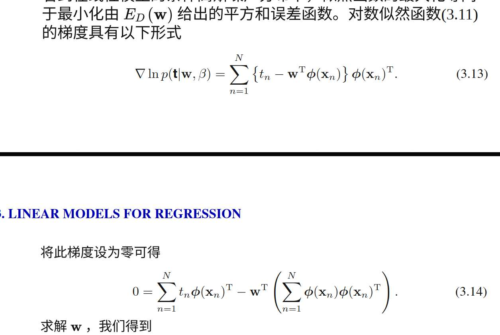
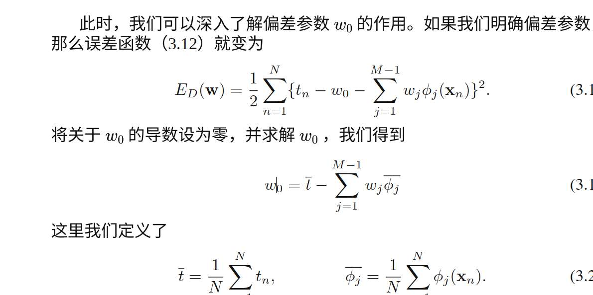

**文章标题建议：《从最小二乘到贝叶斯：重新审视线性回归》**

*   **第一部分：青铜时代（复习 1.1 和 2.3.4）**
    *   写出 $y = w^T x$。
    *   写出平方损失函数。
    *   **关键点**：指出这等价于假设噪声是**高斯分布**并做**最大似然估计 (MLE)**。
    *   *（这里你会用到第二章的高斯对数似然推导，那一刻你就懂了）*

*   **第二部分：白银时代（复习 1.1 和 2.3.6）**
    *   指出 MLE 会过拟合。
    *   引入正则化项 $\lambda ||w||^2$。
    *   **关键点**：指出这等价于给 $w$ 加了一个**高斯先验**并做**最大后验估计 (MAP)**。
    *   *（这里你会用到第二章的贝叶斯公式，那一刻共轭先验的意义就懂了）*

*   **第三部分：黄金时代（复习 1.2.6 和 2.3.6）**
    *   指出 MAP 还是只给了一个 $w$ 值，不够自信。
    *   引入**全贝叶斯回归**。
    *   **关键点**：画出那张粉红色的图，解释什么是“预测分布”。
    *   *（这里你会用到那个让你头疼的积分公式，但这次你是为了解决问题而去查阅它，感觉完全不同）*

线性模型 在这里的定义，居然不是$W^TX$ 而是$W^T \phi(X)$（我不知道怎么打那个符号）
是对X的特征的线性组合      同时  因为有偏置项的存在，定义的时候写$\sum_{j=0}^{M-1}$ 
所以，我们可以因为特征提取而使得这个函数y 是输入向量x的非线性函数，
所以线性模型这个定义，是因为整个函数对于w来说是线性的！ 我去，第一次看到这样的解释
对哦！ 那线性模型构造多项式特征时 就已经不是关于x的线性模型了  拟合的曲线也是曲线 但仍然叫线性模型？
    $$ y(x, w) = w_0 + w_1 \phi_1(x) + \dots + w_M \phi_M(x) = \mathbf{w}^T \boldsymbol{\phi}(x) $$

target variable  t  是什么意思 是真实数据 是现实世界中 我们会观测到的数据  
deterministic function  y(X,W) 是我们最理想的多项式函数  能完美体现出真实规律

然后 我们用完美的公式拟合的数据和真实数据有误差 误差就是episode  也是高斯 
高斯$$\frac{1}{\sigma\sqrt{2\pi}} e^{-\frac{(x-\mu)^2}{2\sigma^2}} $$
我们看到的，就是t 
数据集 就是t 
我们知道的就是t 也知道那个误差是高斯 我们通过这俩个已知条件去反推最理想的那个y函数

$t=y(W,X)+\epislon(咋写呢)$   推出 下面那个概率公式 其中的逻辑链条是什么？ 

$$ p(t | \mathbf{x}, \mathbf{w}, \beta) = \sqrt{\frac{\beta}{2\pi}} \exp\left\{ -\frac{\beta}{2} \big( t - \underbrace{\mathbf{w}^T \boldsymbol{\phi}(\mathbf{x})}_{y(\mathbf{x}, \mathbf{w})} \big)^2 \right\} $$

我们已知噪声 $\epsilon$ 服从标准的高斯分布（均值为 0）：
$$ p(\epsilon) = \mathcal{N}(\epsilon | 0, \beta^{-1}) = \sqrt{\frac{\beta}{2\pi}} \exp\left\{ -\frac{\beta}{2} (\epsilon - 0)^2 \right\} $$

$$ t = y(\mathbf{x}, \mathbf{w}) + \epsilon $$
移项得到：
$$ \epsilon = t - y(\mathbf{x}, \mathbf{w}) $$

$$ p(t | \dots) = p(\epsilon) = \sqrt{\frac{\beta}{2\pi}} \exp\left\{ -\frac{\beta}{2} (\underbrace{t - y(\mathbf{x}, \mathbf{w})}_{\text{这就是 } \epsilon})^2 \right\} $$

Gaussian noise assumption implies that the conditional distribution of
t given x is unimodal, 啥意思  E[t|x]   积分 tp(t|x) dt = y(x, w)  又是在干嘛

公式：
$$ \mathbb{E}[t|x] = \int t \cdot p(t|x) dt = y(\mathbf{x}, \mathbf{w}) $$

 \int t \cdot p(t|x)    \int t \cdot p(t|x,w)   \int t \cdot p(t|y(x,w))
 *   $\int t \cdot p(t|x) dt$ $\rightarrow$ **Bishop 的简写**。
*   $\int t \cdot p(t|x, \mathbf{w}) dt$ $\rightarrow$ **最标准的写法**（完全正确）。
*   $\int t \cdot p(t|y(\mathbf{x}, \mathbf{w})) dt$ $\rightarrow$ **不太规范**。因为条件后面通常跟的是“随机变量”或“参数”，而 $y$ 是一个函数值（虽然本质一样，但习惯上不这么写）。

**$p(t|\dots) = p(\epsilon)$ 的合法性**：
这是合法的，这叫做 **Change of Variables (变量代换)**。
当 $t = y + \epsilon$ 时，因为 $y$ 是常数，所以 $dt = d\epsilon$（雅可比行列式为 1）。
严格来说应该是：$p_T(t) = p_E(\epsilon) \cdot |\frac{d\epsilon}{dt}|$。因为导数是1，所以数值上概率密度直接相等。

**这在干嘛？**
这在做**自我验证**。

*   Bishop 在说：我们费那么大劲搞了这个高斯分布模型，到底它的**平均预测值**是不是我们想要的那个 $y$ 呢？
*   **验算过程**：
    *   $t$ 服从以 $y$ 为均值的高斯分布。
    *   高斯分布的期望（积分结果）就是它的均值参数。
    *   所以 $\mathbb{E}[t] = y$。
*   **结论**：这就确认了，我们的模型 $y(\mathbf{x}, \mathbf{w})$ 确实是在预测数据的**中心（条件均值）**。这呼应了 1.5.5 节的结论（平方损失的最优解是条件均值）

求最大似然估计 得到
要最大化$$ \frac{N}{2} \ln \beta - \frac{N}{2} \ln(2\pi)  - \beta \frac{1}{2}\sum_{n=1}^{N} {t_n}-W^T \boldsymbol{\phi}({x_n})$$
我发现我打markdown还是不熟练 你觉得有必要亲手打吗 还是你帮我写？  我不知道那个加黑怎么写 加黑来表示向量

就等同于最小化那个sum-of-squares error function

然后这是展示怎么求解最大似然函数吗

我以为最大似然函数问题 转化为了最小化那个平方和损失函数（其实应该命名差的平方的和啊） 然后求解那个方程就行了 为啥突然回到最开始

其实是一样的 解这个就得求梯度啊 然后让梯度为0 

$$ \nabla \ln p = \sum_{n=1}^N \{ t_n - \mathbf{w}^T \boldsymbol{\phi}(\mathbf{x}_n) \} \boldsymbol{\phi}(\mathbf{x}_n)^T $$

就能求解  
但怎么解的    书里没说
 
$$ \mathbf{w}_{ML} = (\boldsymbol{\Phi}^T \boldsymbol{\Phi})^{-1} \boldsymbol{\Phi}^T \mathbf{t} $$

书中强调 这里可以感受w0的作用 
就是 求解最优的w0 
我突然疑惑  为什么能这么导  Ed对w0求导不是-1吗？
哎呀这是我的哪个数学功底不行呢  

你现在的疑惑点非常密集，我们一个一个精准爆破。

### 1. 为什么有个转置 `^T`？

> **你的问题**：$\boldsymbol{\phi}(\mathbf{x}_n)^T$ 为啥有个转置？

**助教解答**：
这是为了保证**维度匹配（矩阵乘法规则）**。

让我们看看公式 3.13：
$$ \nabla \ln p = \sum_{n=1}^N \{ t_n - \mathbf{w}^T \boldsymbol{\phi}(\mathbf{x}_n) \} \boldsymbol{\phi}(\mathbf{x}_n)^T $$

*   大括号 $\{ \dots \}$ 里的东西：$t_n$ 是标量，$w^T \phi$ 也是标量。所以**大括号里算出来是一个数（标量）**。
*   我们要求的是**梯度**（Gradient），它是关于 $\mathbf{w}$ 的导数。
*   $\mathbf{w}$ 是一个列向量 ($M \times 1$)。
*   所以算出来的梯度也应该是一个列向量 ($M \times 1$)（或者是行向量，取决于约定，Bishop 这里有点混用）。

**Bishop 的习惯**：
在这里，Bishop 其实把梯度写成了**行向量** ($1 \times M$)。
因为 $\boldsymbol{\phi}(\mathbf{x}_n)$ 是列向量 ($M \times 1$)，加上转置 $\boldsymbol{\phi}^T$ 就变成了行向量 ($1 \times M$)。
这样：$1 \times (1 \times M) = 1 \times M$。

**我的建议**：
**别纠结这个转置！** 矩阵微积分里，行向量还是列向量往往只差一个转置，只要维度能对上就行。核心是：**误差 $\times$ 输入特征**。

---

### 2. 那个公式怎么解出来的？

> **你的问题**：$\mathbf{w}_{ML} = (\boldsymbol{\Phi}^T \boldsymbol{\Phi})^{-1} \boldsymbol{\Phi}^T \mathbf{t}$ 怎么解的？书里没说。

**助教解答**：
这就是线性代数的基本功了，书里确实默认你会。来，我写给你看，只需三步。

**目标**：解方程（公式 3.14 整理后的矩阵形式）：
$$ \boldsymbol{\Phi}^T \boldsymbol{\Phi} \mathbf{w} = \boldsymbol{\Phi}^T \mathbf{t} $$
*(把 summation 写成矩阵乘法就是这样)*

*   $\boldsymbol{\Phi}$ 是 $N \times M$ 的设计矩阵。
*   $\mathbf{w}$ 是 $M \times 1$ 的向量。
*   $\mathbf{t}$ 是 $N \times 1$ 的向量。

**解法**：
我们要把 $\mathbf{w}$ 孤立出来。
现在的 $\mathbf{w}$ 被左边那个讨厌的矩阵 $\mathbf{A} = (\boldsymbol{\Phi}^T \boldsymbol{\Phi})$ 挡住了。
只要 $\mathbf{A}$ 是可逆的，我们就在等式两边同时**左乘** $\mathbf{A}^{-1}$：

$$ (\boldsymbol{\Phi}^T \boldsymbol{\Phi})^{-1} (\boldsymbol{\Phi}^T \boldsymbol{\Phi}) \mathbf{w} = (\boldsymbol{\Phi}^T \boldsymbol{\Phi})^{-1} \boldsymbol{\Phi}^T \mathbf{t} $$

左边的 $\mathbf{A}^{-1}\mathbf{A}$ 抵消变成了单位矩阵 $\mathbf{I}$。
于是：
$$ \mathbf{w} = (\boldsymbol{\Phi}^T \boldsymbol{\Phi})^{-1} \boldsymbol{\Phi}^T \mathbf{t} $$

**得证！** 这就是著名的 **Moore-Penrose 伪逆**。

---

### 3. 关于 $w_0$ 的推导

> **你的问题**：这里可以感受 $w_0$ 的作用... 为什么能这么导？$E_D$ 对 $w_0$ 求导不行吗？

**助教解答**：
可以导！这就是最简单的微积分。

我们来看误差函数：
$$ E = \frac{1}{2} \sum_{n=1}^N (t_n - w_0 - \text{其他})^2 $$

**我们要对 $w_0$ 求偏导 $\frac{\partial E}{\partial w_0}$ 并令其为 0。**

1.  **链式法则**：
    $$ \frac{\partial E}{\partial w_0} = \sum_{n=1}^N (t_n - w_0 - \text{其他}) \cdot \frac{\partial (\dots)}{\partial w_0} $$
    括号里 $-w_0$ 对 $w_0$ 求导是 **-1**。

2.  **整理方程**：
    $$ \sum_{n=1}^N (t_n - w_0 - \text{其他}) \cdot (-1) = 0 $$
    把 -1 约掉：
    $$ \sum_{n=1}^N t_n - \sum_{n=1}^N w_0 - \sum_{n=1}^N (\text{其他}) = 0 $$

3.  **核心步骤（求和符号的性质）**：
    *   $\sum_{n=1}^N t_n$ 就是总目标值。
    *   $\sum_{n=1}^N w_0$ 是 $N$ 个 $w_0$ 加起来，等于 **$N w_0$**。

4.  **解出 $w_0$**：
    $$ N w_0 = \sum t_n - \sum (\text{其他}) $$
    $$ w_0 = \frac{1}{N} \sum t_n - \frac{1}{N} \sum (\text{其他}) $$

5.  **物理意义（见证奇迹）**：
    *   $\frac{1}{N} \sum t_n = \bar{t}$ （目标值的平均数）。
    *   $\frac{1}{N} \sum \sum w_j \phi_j = \sum w_j \bar{\phi}_j$ （预测值的平均数）。

**结论**：
公式 3.19 告诉我们一个极其实用的直觉：
**偏置项 $w_0$ 的作用，就是补偿“目标均值”和“加权特征均值”之间的差额。**
简单说：它负责把你的回归线**上下平移**，让它恰好穿过数据的中心点。

这下逻辑链通了吗？求导 $\to$ 拆分求和 $\to$ 发现均值。这就是 $w_0$ 的使命。