## 多项式拟合
过拟合有一个奇怪的直觉
明明参数更多了，按道理，一个函数泰勒展开，是无数个阶数和啊
参数越多就是阶数越多，不应该更拟合函数吗？ 然而只是更拟合当前训练集，与原来的函数差的更远了 这是一个疑问。  

正因为为了最小化训练误差，高阶多项式会不仅拟合底层的“信号”（True Signal），还会拼命去拟合“噪声”（Noise）。为了穿过所有带误差的点，高阶多项式不得不剧烈震荡

书中解释为，**寻找模型参数的最小二乘法是最大似然的一种特殊情形，过拟合问题可以理解为最大似然的一种一般特性。采用贝叶斯方法可以避免过拟合问题**
不懂！

不过眼下，我们仍用当前方法：使用“均方根误差”， 梯度下降，自己去调整参数（是这样吧？） 不是！ 是使用解析解，即使用数学方法，直接算出来最好的参数
在这种方法下，针对过拟合，其解决方案，
1. 训练数据更多：挺符合直觉吧，训练集数据更多，训练的时候就月仅仅真实函数。未来测试集准确率也会提高
2. 正则化：修正平方和误差函数。修正项是$\frac{\lambda}{2}||w||^2$  书中说，系数w0会从正则化项中省略，因为它的假如会使结果依赖于目标变量的起点选择？对啊，惩罚w0，不让它高，那不就0了吗   如果保留就要有自己的正则化系数？ 然后，加了修正的平方和误差函数，可以用闭式方法精确地最小化，啥闭式方法？ 就是解析解，数学方法。

#### **什么是“闭式方法精确地最小化”？**

我们的目标是最小化：
$$ E(w) = \frac{1}{2} \underbrace{||\mathbf{X}w - \mathbf{t}||^2}_{\text{误差}} + \frac{\lambda}{2} \underbrace{||w||^2}_{\text{正则项}} $$

这是一个关于 $w$ 的二次函数（开口向上的抛物面）。要找最小值，就是求导数（梯度），并令其为 0。

$$ \frac{\partial E}{\partial w} = 0 $$

通过矩阵求导（PRML 后面会讲，这里直接给结果），我们可以直接推导出 $w$ 的公式：

$$ \mathbf{w} = (\mathbf{X}^T \mathbf{X} + \lambda \mathbf{I})^{-1} \mathbf{X}^T \mathbf{t} $$

*   $\mathbf{X}$ 是你的设计矩阵（包含 $x^0, x^1, x^2...$）。
*   $\mathbf{I}$ 是单位矩阵（对角线是1，其余是0，对应正则化项）。
*   $\lambda$ 是你自己定的正则化系数。

**这就叫闭式解**。不需要跑循环，不需要梯度下降，只要把数据矩阵代入这个公式，算一次矩阵求逆，最优的 $w$ 就出来了。这在数学上是精确的（Exact）。

然后正则化到底为什么能有用？
*   $M=9$ (过拟合): $w \approx [1050, -5000, 32000, -12000...]$

过拟合的本质是：正的大数和负的大数互相抵消，从而在特定的点上凑出精确的数据值，但在非数据点的地方就会飞出去。

**正则化的作用（惩罚机制）：**
误差函数 $E(w) = E_D + \lambda E_W$。
*   既然我们要最小化 $E(w)$，如果 $w$ 变成了 32000，那么 $\lambda \times (32000)^2$ 会变成一个天文数字，导致总误差 $E(w)$ 巨大。
*   优化过程被迫做出妥协：**“好吧，我放弃完美穿过每一个训练点（牺牲一点 $E_D$），来换取 $w$ 不要那么大（降低 $E_W$）。”**

这一妥协，就把那些剧烈的震荡抹平了。

反正，我们既要找出系数具体的大小，这个用训练集确定；还要确定合适的阶数M(M个w)， 合适的正则化系数lambda， 这个用验证集确定。
为什么这么规定的？
我们把参数分为两类：
1.  **参数 (Parameters, $w$)**: 模型内部的旋钮。
2.  **超参数 (Hyperparameters, $M, \lambda$)**: 决定模型结构的配置。

**为什么不能用训练集选 $\lambda$？**
假设我们在训练集上挑选 $\lambda$。
*   $\lambda = 0$：没有正则化，模型可以完美拟合训练集（过拟合），训练误差 = 0。
*   $\lambda = 1$：有正则化，模型不能完美拟合，训练误差 > 0。

如果你只看训练集误差，你永远会选择 $\lambda = 0$ 和最大的 $M$。**因为训练集永远偏爱最复杂的模型，它喜欢被死记硬背。**

所以，我们需要**验证集 (Validation Set)**。
验证集就像是一次“模拟考试”。
1.  在训练集（课本）上学习算出 $w$。
2.  在验证集（模拟考）上测试。如果 $\lambda=0$，你会发现模拟考成绩很差（泛化能力差）。
3.  调整 $\lambda$，重新训练，重新模拟考。找到模拟考分最高的那个 $\lambda$。

以上，很浪费宝贵的训练集，于是我们需要其他方法，于是引出下面将介绍的概率论视角？

## 概率论视角
条件概率，  以及引申出的乘积公式，非常形象吧？
需要掌握的，条件概率，概率密度，累积分布函数

就是算P(D|w) 算哪个w、能使得这个频率最大？ 这个通过数学推导。直接算出来的 

贝叶斯学派，是不搞确定的参数w，而是搞一个概率密度p(w|D)。 其实，这样的话，自然而然概率最大的那个w，就可以当成最优w了。应该说是贝叶斯定理的应用？

**层次一：最大后验估计 (MAP - Maximum A Posteriori)**
*   正如你所说，算出 $p(w|D)$ 后，找那个让概率最大的 $w$。
*   **这其实是“伪贝叶斯”**。因为它最后还是丢弃了概率分布，选了一个具体的数值。
*   **惊人的联系**：正如书中所讲，**MAP 估计完全等价于“带正则化的最小二乘法”**！
    *   似然 $p(D|w)$ $\rightarrow$ 对应误差平方和。
    *   先验 $p(w)$ $\rightarrow$ 对应正则化项（$\lambda ||w||^2$）。
    *   所以，你之前纠结的正则化，其实就是贝叶斯学派加了一个先验 $p(w)$ 后取最大值的结果。

**层次二：全贝叶斯 (Full Bayesian) —— Bishop 的最爱**
*   **真正的贝叶斯派**会告诉你：**“为什么要找‘最优’的那个 $w$？万一最可能的那个 $w$ 也还是有误差呢？”**
*   我们不应该选一个 $w$，我们要**保留整个 $p(w|D)$ 分布**。
*   在预测新数据时，我们对**所有可能的 $w$** 进行积分（加权平均）：
    $$ p(t_{new}|D) = \int p(t_{new}|w) \cdot p(w|D) \, dw $$
    这才是贝叶斯的终极奥义：**不做选择题，我全都要。**

我们只需要知道p(D|w)就行了  但这个？如何知道p(D|w)？

传统的最大似然估计，莫非算是频率学派？ 就是算P(D|w) 算哪个w、能使得这个频率最大？ 这个应该是算出来的吧？  

贝叶斯呢，我们老老实实算p(w|D) 自然而然，我们引入了先验p(w) 先验可以是我们自己设的吧？ 这样比单纯的p(D|w)好多了 。

文章举例，假如，数据满足正态分布函数，w就是均值和方差， 整个数据点就是正态分布函数的函数点， 
现在我们取一些值（蓝色）
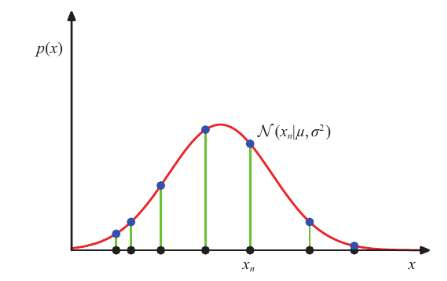

我们可以得到函数u和sigmoid的函数
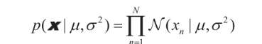
哦，这，不就是p（D|w)吗？？然后我们用数学方法，即最大似然估计，
我们想最大化这个概率值  然后用数学方法求这俩个参数。

结果是，均值合理的估计，方差低估了。合理，因为y值大的那些数据点（高于方差的）被取到的概率也比较低。
不对
#### 修正
你的这个直觉有点偏了。方差被低估（Biased Estimate）的真正原因并不是“取不到大概率点”，而是因为**你作弊了**。

**直观解释**：
1.  **真实情况**：计算方差应该基于**真实的均值** $\mu$。
    $$ \sigma^2 = \frac{1}{N}\sum (x_i - \mu)^2 $$
2.  **你的做法 (MLE)**：你不知道真实均值，所以你用了**样本均值** $\mu_{ML}$ 来代替。
    $$ \sigma_{ML}^2 = \frac{1}{N}\sum (x_i - \mu_{ML})^2 $$

**关键点**：样本均值 $\mu_{ML}$ 是怎么来的？它是为了让这组数据“看起来最紧凑”算出来的。$\mu_{ML}$ 会自动跑到这组数据的**几何中心**。
这导致数据点到 $\mu_{ML}$ 的距离之和，一定**小于**数据点到真实均值 $\mu$ 的距离之和。
*   既然距离（平方和）变小了，算出来的方差自然就偏小了。
*   这就是为什么公式里要用 $\frac{1}{N-1}$ 而不是 $\frac{1}{N}$ 来修正（无偏估计）。

然后回到曲线拟合问题，我们也如此估计参数。
但我的疑惑是，为什么可以估计p(t|x,w,β)是高斯分布
？ 

1.  **中心极限定理 (Central Limit Theorem)**：
    现实中的噪声往往是由无数个微小的、独立的干扰因素叠加而成的（比如传感器热噪声、空气扰动、测量抖动）。根据概率论，大量独立随机变量之和趋近于高斯分布。所以，假设噪声是高斯的是最“安全”的选择。
    
2.  **最大熵原理 (Maximum Entropy)**：
    如果我们只知道噪声的方差是有限的，除此之外一无所知，那么**高斯分布是所有可能的分布中，“偏见”最少、最混乱（熵最大）的分布**。选它是因为我们不想引入额外的假设。

这个β还是没理解
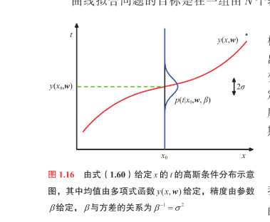
#### 1. 红色曲线是什么？
它是 $y(x, w)$。
这意味着：如果你给我不含任何杂质的 $x$，经过参数 $w$ 计算，我应该得到的**完美预测值**。这就像是公路的**中心线**。

#### 2. 为什么会有蓝色的鼓包？
现实世界是不完美的。
当我们观测数据 $t$ 时，它不会老老实实地落在红线上，而是会在红线上下波动。
*   这个波动，我们假设它是**随机的**，且服从**高斯分布**。
*   那个蓝色的鼓包，就是把一个高斯分布竖着放到了图上。
*   鼓包的中心（峰值）正好在红线上，说明最可能出现的位置就是预测值 $y(x,w)$。
*   离红线越远，鼓包越窄（概率越低），说明出现离谱误差的可能性越小。

#### 3. $\beta$ 到底是个啥？
**$\beta$ 决定了那个蓝色鼓包的“胖瘦”！**

*   **物理含义**：$\beta$ 是精度（Precision），是方差的倒数 ($\beta = 1/\sigma^2$)。
*   **直观想象**：
    *   **如果 $\beta$ 很大（比如 1000）**：意味着方差 $\sigma^2$ 极小。那个蓝色的鼓包会变得**又高又细**，像一根针。这说明数据非常精准，紧紧贴着红线。
    *   **如果 $\beta$ 很小（比如 0.1）**：意味着方差 $\sigma^2$ 很大。那个蓝色的鼓包会变得**又矮又胖**，像个大馒头。这说明数据很散，到处乱飘。

**为什么公式里莫名其妙出来个 $\beta$？**
因为当我们写下 $p(t|x,w,\beta)$ 时，我们是在描述一个生成数据的**机制**：
> “上帝是这样造数据的：先算出 $y(x,w)$（红线位置），然后以这个位置为中心，扔骰子加一个噪声。**这个噪声扔得有多散，由 $\beta$ 决定。**”

所以，$\beta$ 是这个概率模型不可或缺的一部分，它描述了数据的**“散乱程度”**。

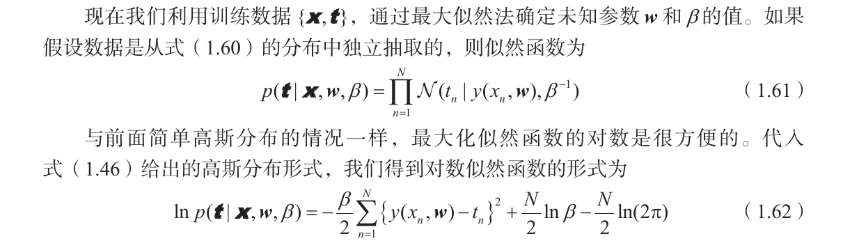

很巧的是，对于w来说，最大化似然函数就是最小化“平方和误差函数”

**第一步：写出高斯分布公式**
假设单点概率（似然）：
$$ p(t|x,w,\beta) = \sqrt{\frac{\beta}{2\pi}} \exp\left\{ -\frac{\beta}{2} (y(x,w) - t)^2 \right\} $$
*注：这里把 $\frac{1}{\sqrt{2\pi\sigma^2}}$ 写成了 $\sqrt{\frac{\beta}{2\pi}}$，因为 $\beta=1/\sigma^2$。*

**第二步：取对数 $\ln$**
我们要算 $\ln p$。根据性质 1，把常数项和指数项拆开：
$$ \ln p = \ln\left( \sqrt{\frac{\beta}{2\pi}} \right) + \ln\left( \exp\left\{ -\frac{\beta}{2} (y - t)^2 \right\} \right) $$

**第三步：使用核心技巧**
*   **左边**：$\ln(\sqrt{X}) = \frac{1}{2}\ln X$。
*   **右边**：$\ln(e^K) = K$。**高斯分布最美妙的地方就在这里，$\ln$ 把讨厌的 $e$ 吃掉了，只剩下指数里那个二次项。**

于是变成：
$$ \ln p = \underbrace{\frac{1}{2}\ln\beta - \frac{1}{2}\ln(2\pi)}_{\text{常数项}} - \frac{\beta}{2}(y - t)^2 $$

**第四步：如果有 N 个数据点**
似然函数是 $N$ 个点的**乘积** $\prod_{n=1}^N p_n$。
取对数后，乘积变成**求和** $\sum_{n=1}^N \ln p_n$。

*   常数项有 $N$ 个，所以乘以 $N$。
*   后面那个二次项也要对 $N$ 个点求和。

$$ \ln p(\mathbf{t}|\dots) = \frac{N}{2}\ln\beta - \frac{N}{2}\ln(2\pi) - \frac{\beta}{2} \sum_{n=1}^N \{y(x_n,w) - t_n\}^2 $$

**这就得到书上的 1.62 了！**

#### 为什么我们可以“无视”前面那堆东西？

当我们求最优参数 $w$ 时，我们要解方程：
$$ \frac{\partial (\ln p)}{\partial w} = 0 $$

你看上面那个式子：
*   $\frac{N}{2}\ln\beta$ 里面有 $w$ 吗？没有。求导等于 0。
*   $\frac{N}{2}\ln(2\pi)$ 里面有 $w$ 吗？没有。求导等于 0。

所以，对于找 $w$ 这件事来说，最大化对数似然，**完全等价于**最小化后面那个式子：
$$ \frac{\beta}{2} \sum \{y(x_n,w) - t_n\}^2 $$

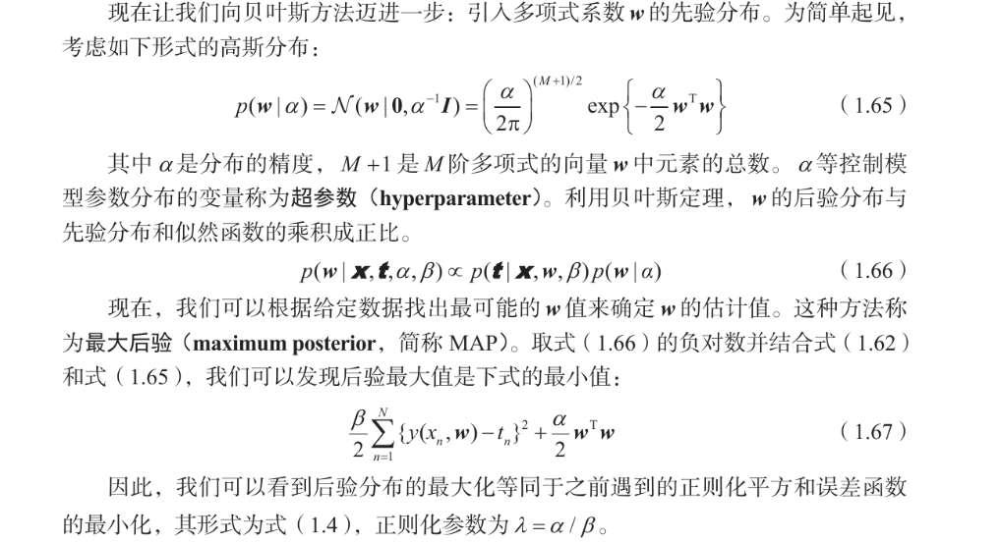
啊，也很巧。。
#### 目标：最大化后验概率 (MAP)
我们要找最可能的 $w$，也就是最大化 $p(w|D)$。

$$ \text{Posterior} \propto \text{Likelihood} \times \text{Prior} $$
$$ p(w|D) \propto p(D|w, \beta) \cdot p(w|\alpha) $$

#### Step 1: 写出两大组件（利用之前教你的“取对数”口诀）

1.  **Likelihood（似然，描述数据拟合程度）**:
    假设是高斯噪声。取对数后，去掉常数，去掉 $e$，只剩指数里的平方项：
    $$ \ln p(D|w, \beta) \propto -\frac{\beta}{2} \sum_{n=1}^N \{y(x_n, w) - t_n\}^2 $$
    *(注意：这里有一个系数 $\beta$)*

2.  **Prior（先验，描述参数约束）**:
    假设 $w$ 服从高斯分布（均值0，精度 $\alpha$）。取对数后，同样只剩平方项：
    $$ \ln p(w|\alpha) \propto -\frac{\alpha}{2} \mathbf{w}^T\mathbf{w}$$
    $$ \ln p(w|\alpha) \propto -\frac{\alpha}{2} \mathbf{w}^T\mathbf{w} = -\frac{\alpha}{2} ||w||^2 $$
    *(注意：这里有一个系数 $\alpha$)*

#### Step 2: 合体（相加）

取对数后的后验概率 $\ln p(w|D)$ 就是上面两坨加起来：

$$ \ln p(w|D) = -\frac{\beta}{2} \sum \text{Error}^2 - \frac{\alpha}{2} ||w||^2 + \text{Const} $$

#### Step 3: 转换视角（最大化 -> 最小化）

我们通常习惯“最小化损失函数”。
为了把“最大化正数”变成“最小化”，我们给整个式子**乘以 -1**。

$$ \text{Loss} = \frac{\beta}{2} \sum \text{Error}^2 + \frac{\alpha}{2} ||w||^2 $$

#### Step 4: 归一化（见证奇迹的时刻）

现在的式子看起来稍微有点乱，因为有 $\beta$ 和 $\alpha$ 两个系数。
在工程上，我们习惯让“误差项”前面的系数是 $1/2$。
所以，我们将整个式子**除以 $\beta$**（这不会改变最小值的 $w$ 位置，就像 $3x^2=0$ 和 $x^2=0$ 的解是一样的）。

$$ \text{New Loss} = \frac{1}{2} \sum \text{Error}^2 + \frac{\alpha}{2\beta} ||w||^2 $$

对比我们在 1.1 节死记硬背的正则化公式：
$$ E(w) = \frac{1}{2} \sum \text{Error}^2 + \frac{\lambda}{2} ||w||^2 $$

**这就推出来了！**
$$ \lambda = \frac{\alpha}{\beta} $$

.  **定义**：多变量高斯分布公式（不用背，只要知道长这样）：
    $$ p(\mathbf{w}) = C \cdot \exp\left( -\frac{1}{2} (\mathbf{w} - \mathbf{\mu})^T \mathbf{\Sigma}^{-1} (\mathbf{w} - \mathbf{\mu}) \right) $$
2.  **设定**：我们的先验是均值为 0，精度为 $\alpha$ 的球形高斯。
    *   $\mathbf{\mu} = \mathbf{0}$
    *   协方差 $\mathbf{\Sigma} = \alpha^{-1}\mathbf{I}$ $\implies$ 逆矩阵（精度矩阵） $\mathbf{\Sigma}^{-1} = \alpha \mathbf{I}$
3.  **代入指数部分**：
    $$ -\frac{1}{2} \mathbf{w}^T (\alpha \mathbf{I}) \mathbf{w} = -\frac{\alpha}{2} \mathbf{w}^T \mathbf{w} $$
4.  **取对数**：
    $$ \ln p(\mathbf{w}|\alpha) = \text{常数} - \frac{\alpha}{2} \mathbf{w}^T \mathbf{w} $$
    这就得证了！$\mathbf{w}^T \mathbf{w}$ 就是向量长度的平方 $||w||^2$。

不过，我们仍然是最大化似然函数，最终求出来了一堆具体的参数吧？
这样的话，仍然是频率思想，额，只不过用了贝叶斯公式而已？

所以我们不仅用贝叶斯公式，还不去最大化似然函数，而是积分
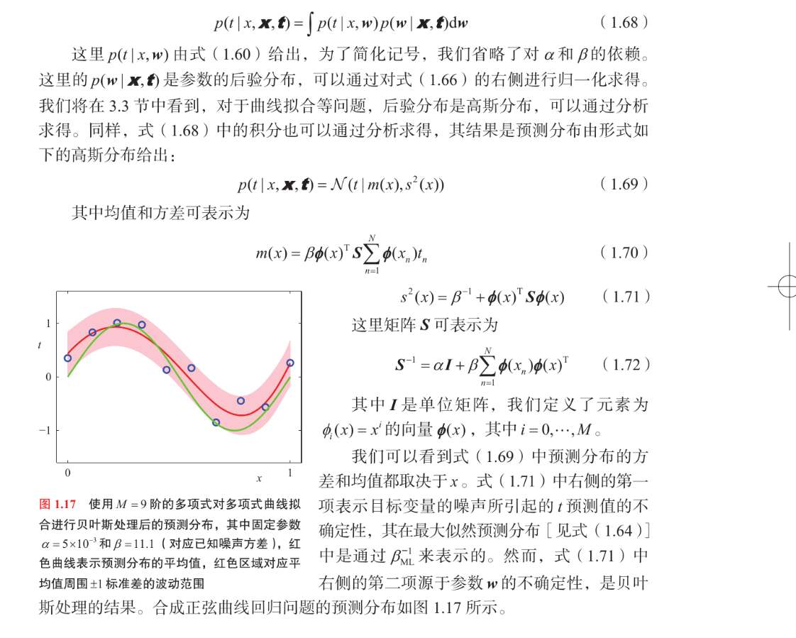

这就是 **公式 1.68** 的含义：
$$ p(t|x, \mathbf{t}) = \int \underbrace{p(t|x,w)}_{\text{某个w的预测}} \cdot \underbrace{p(w|\mathbf{x}, \mathbf{t})}_{\text{这个w的发言权}} \, dw $$

*   我们不再寻找某一个 $w$。
*   我们遍历宇宙中**所有**可能的 $w$。
*   如果某个 $w$ 在训练集上表现好（后验概率高），它的发言权（权重）就大。
*   如果某个 $w$ 表现不好，它的发言权就小。
*   **最终的预测结果，是无穷多个 $w$ 预测结果的加权平均。**

这就叫**积分（Integration）**。

#### 2. 积分的结果是什么？（公式 1.69 - 1.72）

Bishop 在这里省略了 3 页纸的数学推导（在第 2 章和 3 章会补上），直接甩给了你结果。

结果就是：**预测分布 $p(t|x...)$ 依然是一个高斯分布。**
$$ p(t|x,\dots) = \mathcal{N}(t | m(x), s^2(x)) $$

这就很有意思了！
以前用 $w^*$ 预测，对于一个 $x$，你会给出一个具体的数值 $y$。
现在用贝叶斯积分预测，对于一个 $x$，你给出的是**一个概率分布**（也就是图 1.17 里的**红色区域**）。

这意味着，模型不仅告诉你“预测值是多少”，还告诉你“**我对这个预测有多大把握**”。

#### 3. 为什么看公式 1.71 极其重要？

请仔细看方差公式 1.71：
$$ s^2(x) = \underbrace{\beta^{-1}}_{\text{第一项}} + \underbrace{\phi(x)^T \mathbf{S} \phi(x)}_{\text{第二项}} $$

这个公式把我们对未来的**不确定性（Uncertainty）** 拆成了两部分：

*   **第一项 $\beta^{-1}$ (噪声)**：
    *   这是**原本数据的噪声**。
    *   不管你模型多牛，数据本身就有噪声，这部分误差是你永远消除不掉的。
    *   这叫 **Aleatoric Uncertainty**（偶然不确定性）。

*   **第二项 $\phi^T S \phi$ (参数不确定性)**：
    *   这是因为**我们没算准 $w$ 到底是多少**带来的误差。
    *   这叫 **Epistemic Uncertainty**（认知不确定性）。
    *   **关键点**：这部分是可以消除的！如果你有无限多的训练数据，这一项会趋近于 0。

#### 4. 看图 1.17 秒懂

*   **红线**：预测的平均值 $m(x)$。
*   **粉色区域**：预测的不确定性范围（$\pm 1$ 标准差）。

**请观察两个细节：**
1.  **数据点附近，粉色区域很窄**：
    因为这里有数据撑腰，所有可能的 $w$ 在这里必须达成共识（都要穿过数据点），所以大家意见一致，不确定性（第二项）很小。
2.  **没有数据的地方，粉色区域变宽**（比如图中最左边和最右边）：
    因为没有数据约束，有的 $w$ 向上翘，有的 $w$ 向下弯。积分（投票）的时候，大家意见不统一，方差（第二项）就变大了。
# 总结
梳理一下，我们假设
观测值t，是噪声？ 或者怎么称呼，反正和真实值有偏差？
但我们直接假设，这个观测值， t，是基于真实值$y(x, w)$ 与$\beta$ 的高斯分布，其中，真实值为均值，β的导数为方差？
这样看来，若方差是0，那观测值，就是真实值。这是不合理的。
不过β也是我们自己设出来的啊？
就是，我的理解是，其实是有一个未知参数sigmoid的， 但是我们把它的导数 看作一个未知参数，方便我们做解释？？ 然后设它的符号是β。

所以我们写出来
$$ p(t|x,w,\beta) = \sqrt{\frac{\beta}{2\pi}} \exp\left\{ -\frac{\beta}{2} (y(x,w) - t)^2 \right\} $$

这里，已知的是 观察者t， 数据点x，  和，我们设置的参数w？ 哦，未知参数w，β。这里阶数我们固定了，求的是参数的值。

然后，我们用最大似然估计，得到，

我们要最小化这个式子
$$ \frac{\beta}{2} \sum \{y(x_n,w) - t_n\}^2 $$
通过最小化这个式子，求解最优w和β。
我们发现，这恰好是经典的最小化误差函数，误差函数为均方误差。
只不过多乘了个β？

这是求解最优w和β，属于频率派。

我们再进一步引入贝叶斯公式，
其实，我们只要在刚才的$p(t|x,w,\beta)$  后，再乘个先验
$p(\mathbf{w}) = C \cdot \exp\left( -\frac{1}{2} (\mathbf{w} -\mathbf{\mu})^T \mathbf{\Sigma}^{-1} (\mathbf{w} - \mathbf{\mu})\right)$ 

即可。

这样一个小小的操作，就让我们得到了p(w|D) 

$$ p(w|D) \propto p(D|w, \beta) \cdot p(w|\alpha) $$

其中
$$ \ln p(D|w, \beta) \propto -\frac{\beta}{2} \sum_{n=1}^N \{y(x_n, w) - t_n\}^2 $$
正是刚才用频率派，求的。

    $$ \ln p(w|\alpha) \propto -\frac{\alpha}{2} \mathbf{w}^T\mathbf{w} = -\frac{\alpha}{2} ||w||^2 $$

现在再乘上 
$$ \ln p(w|D) = -\frac{\beta}{2} \sum \text{Error}^2 - \frac{\alpha}{2} ||w||^2 + \text{Const} $$

到这一步，我们虽然用了贝叶斯公式，但也仅仅是用了公式，
ln p(w|D)   仍然是一堆关于参数的式子  我们仍是 用似然估计 即 最大化这个式子 试图求出最优参数，

一个负号 就能转变为“最小化xx“  
$$ \text{Loss} = \frac{\beta}{2} \sum \text{Error}^2 + \frac{\alpha}{2} ||w||^2 $$

归一化
$$ \text{New Loss} = \frac{1}{2} \sum \text{Error}^2 + \frac{\alpha}{2\beta} ||w||^2 $$

这，恰好是经典的正则化。

ok 此时其实还是频率学派，因为我们仍是用解析解，算出最优的这些参数。

现在，完全是换了种思路，
我们停留到这一步
$$ p(w|D) \propto p(D|w, \beta) \cdot p(w|\alpha) $$
我们是可以计算出p(w|D)的式子的（可以展示下吗），与之前不同的是，计算后我们暂时先放着，我们也不最大化，不进行什么似然估计。

接下来
设训练数据是X和T， 
p(w|D) 就是p(w|X,T) 
一个新的测试点是x， 我们用已有参数预测出此点的预测值是t

我们想要算的是：$p(t | x, \mathbf{X}, \mathbf{t})$ 

**Step 1: 引入中间人 $w$（加和法则 / 边缘化）**
即使我们不关心 $w$，但模型是通过 $w$ 起作用的。所以我们把 $w$ 强行加进来，再把它积分积掉（Marginalize）。
根据加和法则 $p(A) = \int p(A,B) dB$：

$$ p(t | x, \mathbf{X}, \mathbf{t}) = \int p(t, w | x, \mathbf{X}, \mathbf{t}) \, dw $$

**Step 2: 拆解联合概率（乘积法则）**
根据乘积法则 $p(A,B) = p(A|B)p(B)$：

$$ \text{上式} = \int \underbrace{p(t | x, w, \mathbf{X}, \mathbf{t})}_{\text{第一项}} \cdot \underbrace{p(w | x, \mathbf{X}, \mathbf{t})}_{\text{第二项}} \, dw $$

**Step 3: 见证奇迹的时刻（条件独立性）**
这一步是物理意义的代入，非常关键！

*   **看第一项** $p(t | x, w, \mathbf{X}, \mathbf{t})$：
    意思是：**既然我都已经知道参数 $w$ 是多少了**，以前的训练数据 $\mathbf{X}, \mathbf{t}$ 对我预测当前的 $t$ 还有帮助吗？
    **没有了！** $w$ 已经包含了训练数据的所有精华。只要有了 $w$，预测就只跟 $x$ 和 $w$ 有关。
    所以：$p(t | x, w, \mathbf{X}, \mathbf{t}) \rightarrow p(t | x, w)$

*   **看第二项** $p(w | x, \mathbf{X}, \mathbf{t})$：
    意思是：参数 $w$ 的分布，跟新的测试点 $x$ 有关系吗？
    **没有！** 我的模型长什么样，取决于训练数据。不管你接下来要测试哪个 $x$，我的参数分布在那一刻已经是既定的了（除非你把这个 $x$ 也加入训练集，但那是 Online Learning，这里不是）。
    所以：$p(w | x, \mathbf{X}, \mathbf{t}) \rightarrow p(w | \mathbf{X}, \mathbf{t})$

**Step 4: 组合**
把简化后的两项放回去，就是公式 1.68：

$$ p(t | x, \mathbf{X}, \mathbf{t}) = \int \underbrace{p(t | x, w)}_{\text{模型预测}} \cdot \underbrace{p(w | \mathbf{X}, \mathbf{t})}_{\text{参数后验}} \, dw $$

p(w|X,t)就是
$$ p(w|D) \propto p(D|w, \beta) \cdot p(w|\alpha) $$
我们算出来的
而p(t|x,w)呢 就是  就是最开始假设的高斯分布  ？
$$ p(t|x,w,\beta) = \sqrt{\frac{\beta}{2\pi}} \exp\left\{ -\frac{\beta}{2} (y(x,w) - t)^2 \right\} $$

1.  **训练集似然** $p(\mathbf{t} | \mathbf{X}, w)$：这是 **$N$ 个点**的乘积。
2.  **测试点似然** $p(t | x, w)$：这是 **1 个点**的概率。

算后验 $p(w|\mathbf{X}, \mathbf{t})$ 时，我们要用的是**训练集**的信息，也就是那 $N$ 个点的总和！

所以正确的式子应该是：
$$ p(w|\mathbf{X},\mathbf{t}) \propto \underbrace{\left[ \prod_{n=1}^N p(t_n|x_n, w) \right]}_{\text{巨大的 N 个点的乘积}} \cdot p(w|\alpha) $$

$$ p(t|x,\mathbf{X},\mathbf{t}) = \int \underbrace{\mathcal{N}(t | y(x,w), \beta^{-1})}_{\text{预测分布 (你说的那个高斯)}} \cdot \underbrace{\mathcal{N}(w | \mathbf{m}_{N}, \mathbf{S}_{N})}_{\text{后验分布 (训练出来的那个高斯)}} \, dw $$

**数学上的奇迹**：
1.  这是一个关于 $w$ 的积分。
2.  被积函数是 **“高斯 $\times$ 高斯”** 的形式。
3.  在线性代数中，**高斯的卷积（或乘积积分）依然是高斯**！

所以，我们不需要数值积分（不需要计算机去画格子算面积），我们可以直接通过数学推导，算出一个解析解（Closed-form）。

**算出来的结果就是公式 1.69**：
$$ p(t|x,\dots) = \mathcal{N}(t | m(x), s^2(x)) $$

那么就是说 这俩个都已知，我们能算出来。
整个式子中，未知的就是w  然而积分却把w积掉了？

最后可以整理成一个关于x的高斯分布 

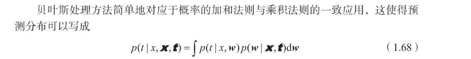

1.  **材料 A（先验）**：$p(w|\alpha)$ —— 也就是正则化项。
2.  **材料 B（训练数据）**：$p(\mathbf{t}|\mathbf{X},w)$ —— $N$ 个点的误差总和。
3.  **加工（训练）**：$A \times B \rightarrow$ **后验 $p(w|\mathbf{X},\mathbf{t})$**（这是一个高斯分布，记住了所有 $w$ 的可能性）。
4.  **材料 C（新测试点）**：$p(t|x,w)$ —— 这一个点的预测机制。
5.  **应用（预测）**：$\int C \times \text{后验} \, dw$ —— 让所有 $w$ 带着它们的权重（后验概率），对新点 $C$ 进行投票。
6.  **结果**：得到一个新的高斯分布（公式 1.69），告诉你预测值是多少，以及把握有多大。
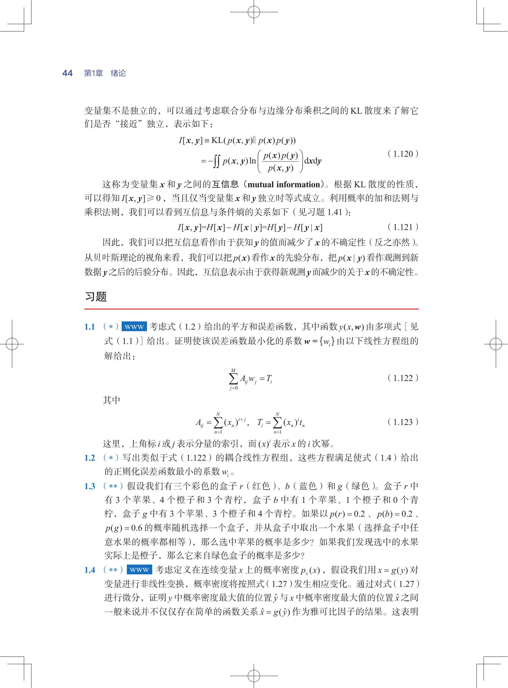
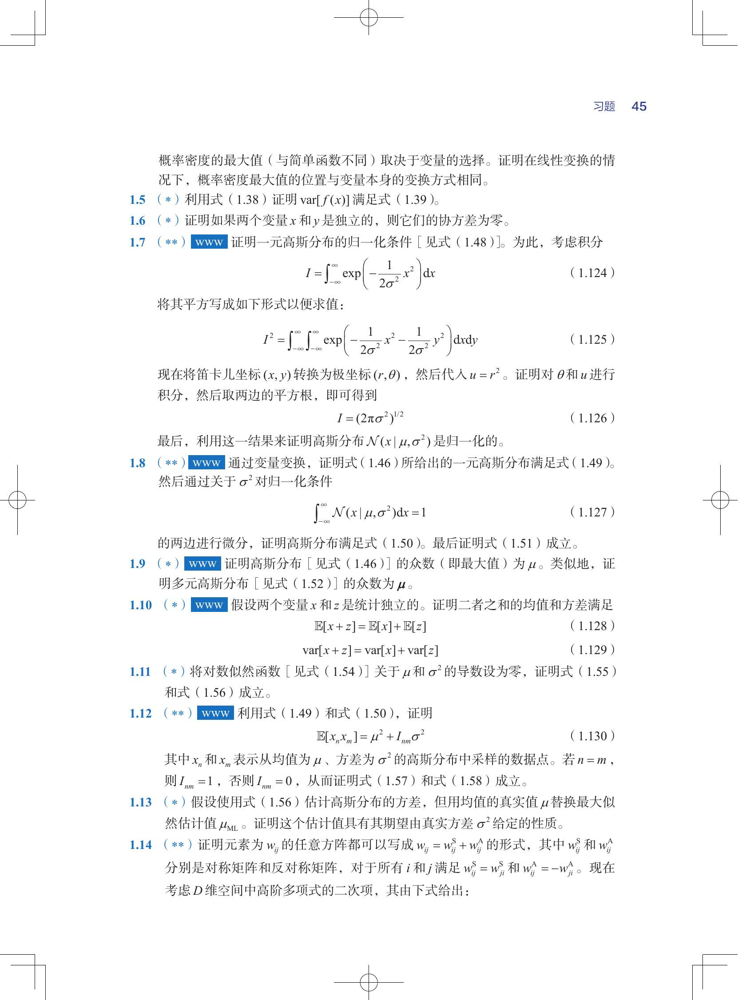
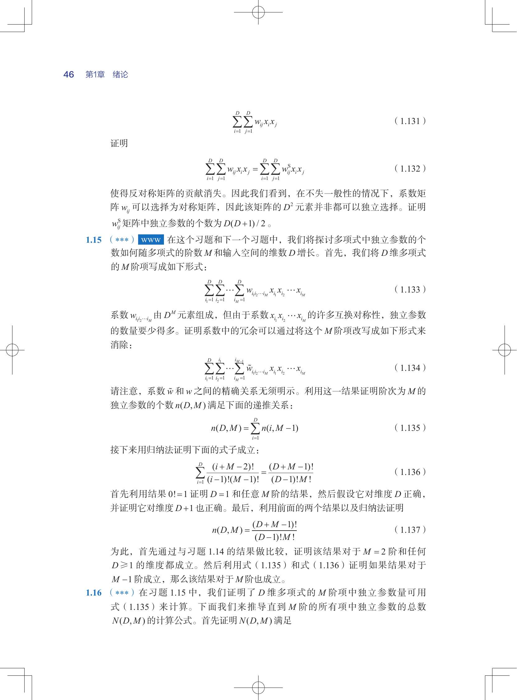
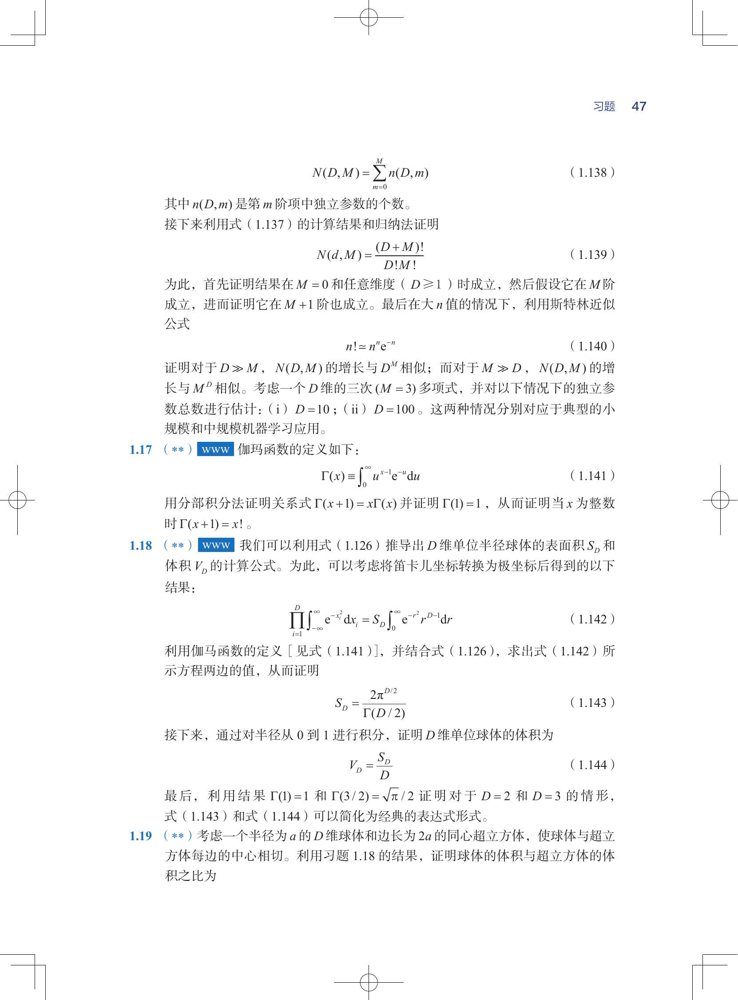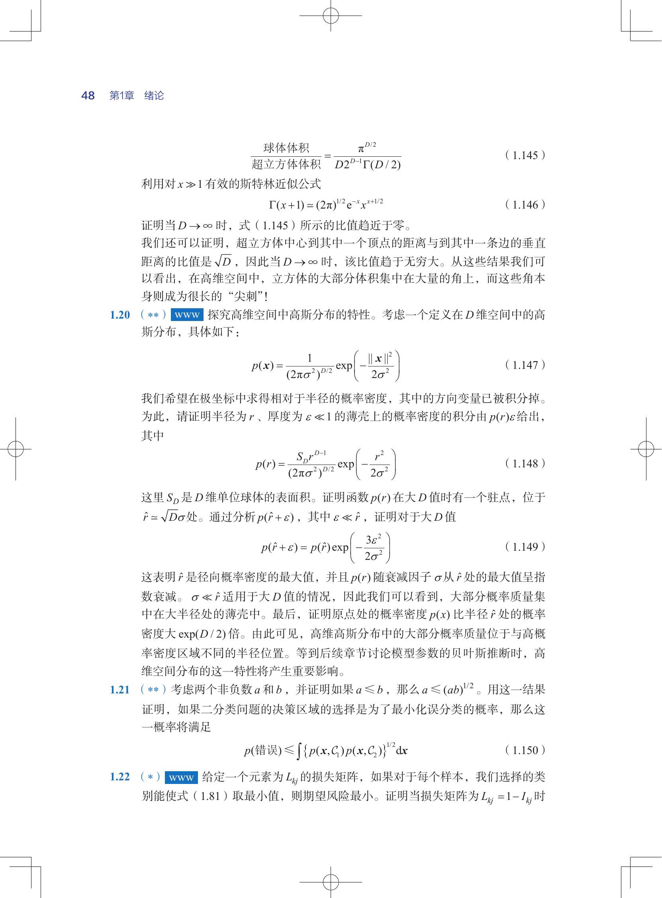
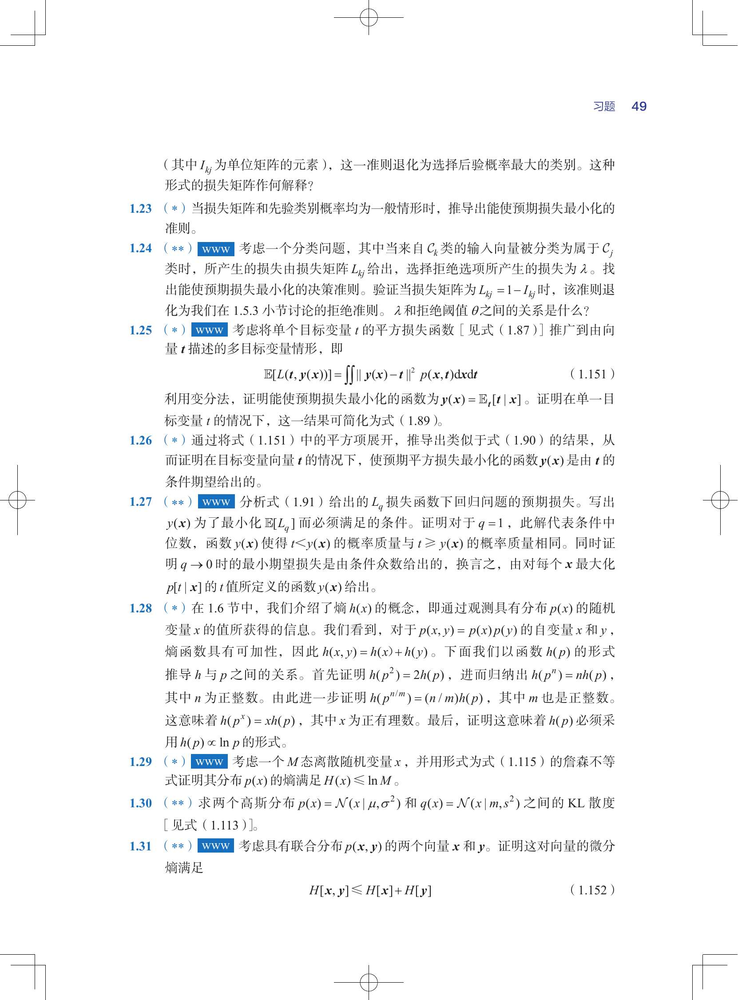
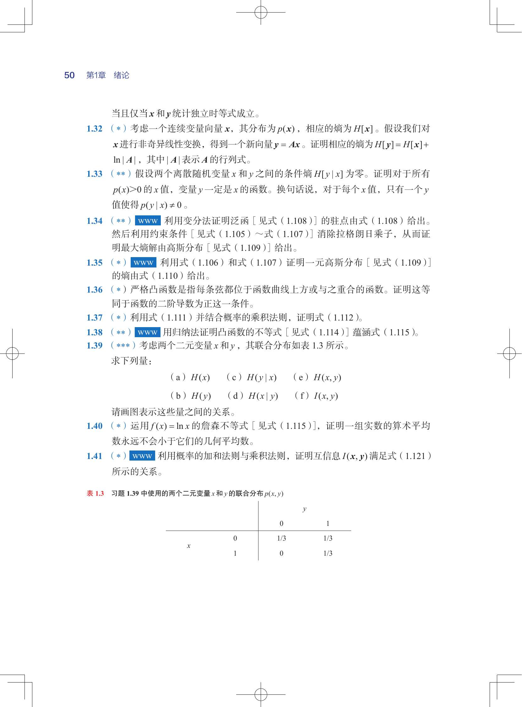