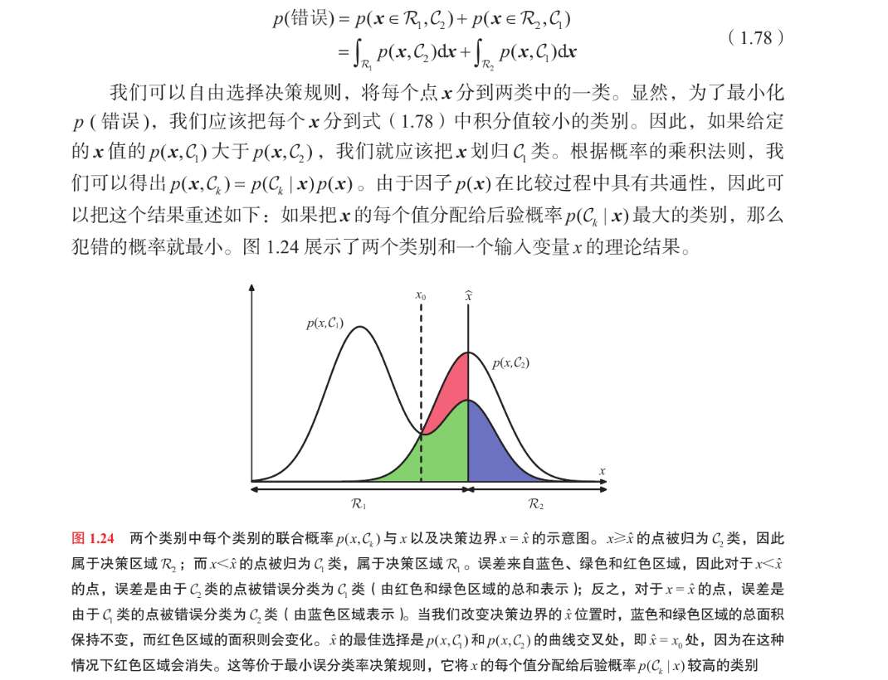
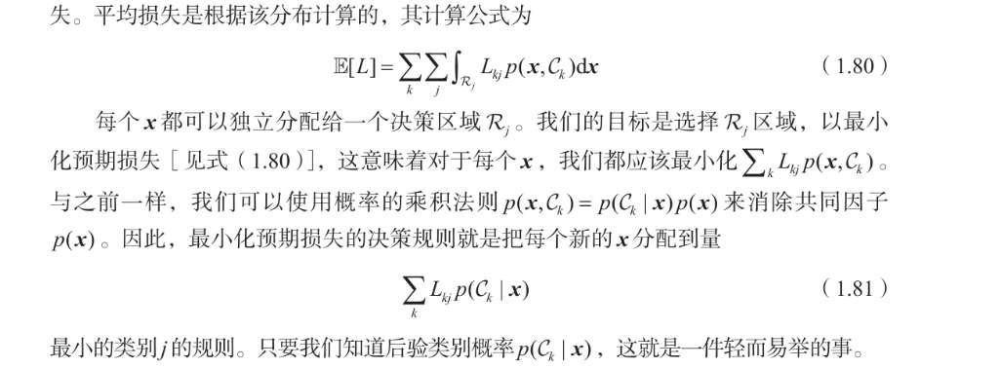
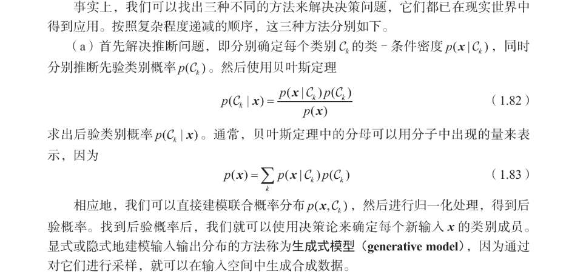
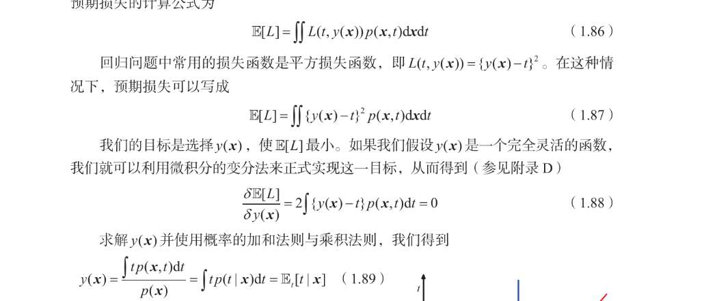
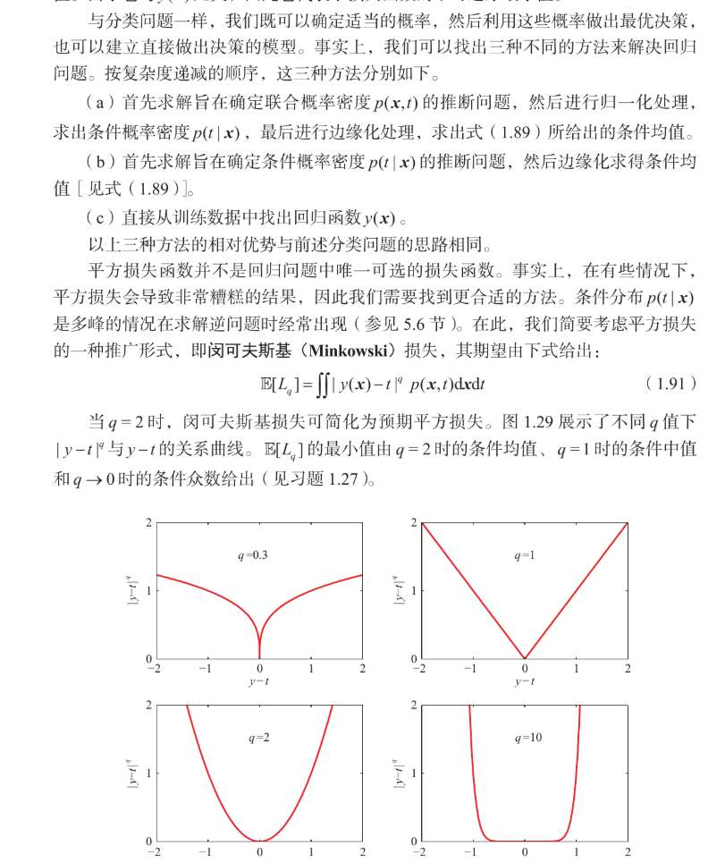
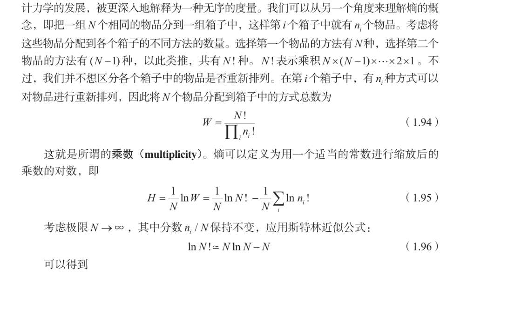
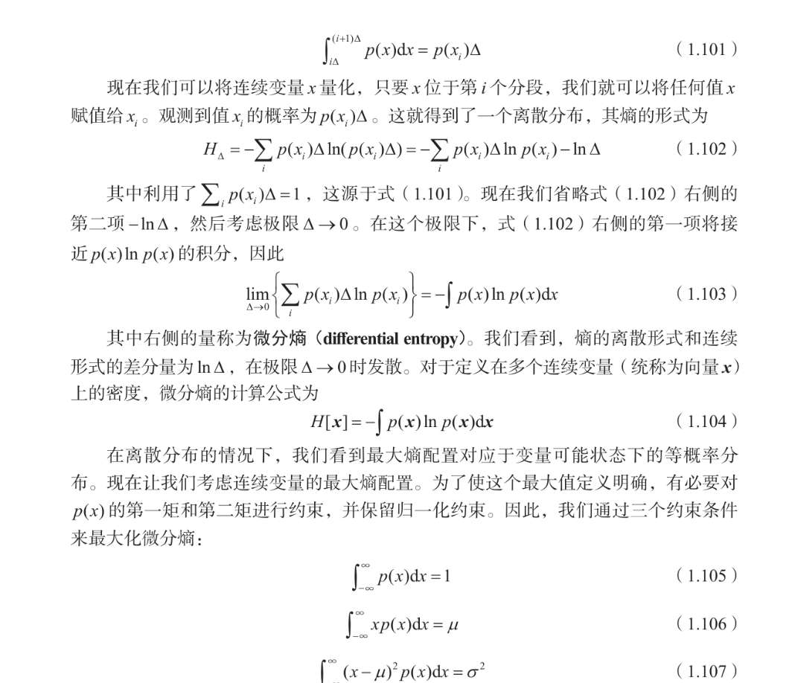
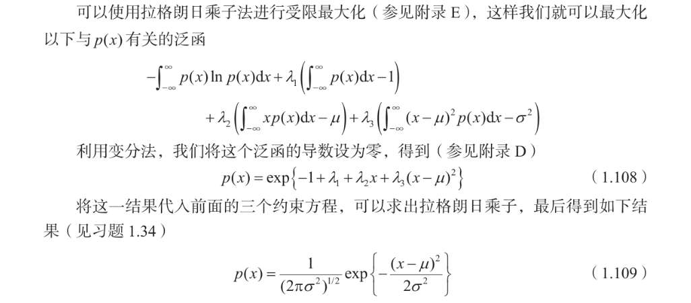

 决策论
关键在于对此图的理解
我的理解是，如果严格按照对于x点，哪个p(x,Ck)大，归到哪个Rk类，
当决策边界移动到俩概率密度曲线交界处，红色部分是可以消除的。
而绿色和蓝色，总面积不变，也就是不可能为0，只要他们相交。

所以最理想的决策面，是x0的位置，
这个位置，如果“按照对于x点，哪个p(x,Ck)大，归到哪个Rk类”  那将没有失误  
然后“每个x都应该被分配到后验概率p(Ck|x)的最大值，就是我上面那句话的另一种说法吧？

我不知道还有上面书中要表示的，我没get到

然后对于分类问题，构造一个代价矩阵分析误判代价
然后损失函数就是要加上误判的代价 

此前我们一直在做**最小化错误率 (Minimizing Misclassification Rate)**，也就是“谁概率大我选谁”。
但在现实世界，**不同的错误，代价是不一样的**。

**举个最经典的例子（癌症诊断）：**

*   **情况 A**：病人没病，你误判他有病（False Positive）。
    *   **后果**：病人吓一跳，多做个复查。
    *   **损失 $L_{没病, 判有病} = 10$**。

*   **情况 B**：病人有癌症，你误判他没病（False Negative）。
    *   **后果**：延误治疗，病人死亡。
    *   **损失 $L_{有病, 判没病} = 10000$**。

**现在的抉择时刻：**
来了一个病人，你的模型算出概率：
*   $p(\text{没病} | x) = 0.9$
*   $p(\text{有病} | x) = 0.1$

**如果你只看概率（之前的逻辑）**：
肯定判“没病”，因为 0.9 > 0.1。

**如果你看期望损失（公式 1.81 的逻辑）**：
我们要算一下把这个病人分到某一类的**风险（Risk）**：

1.  **假如判“没病” ($j=$没病)**：
    *   真的没病：损失 0。
    *   真的有病：损失 10000。
    *   **预期损失**：$0.9 \times 0 + 0.1 \times 10000 = \mathbf{1000}$。

2.  **假如判“有病” ($j=$有病)**：
    *   真的没病：损失 10。
    *   真的有病：损失 0。
    *   **预期损失**：$0.9 \times 10 + 0.1 \times 0 = \mathbf{9}$。

**结论**：
虽然概率上他大概率没病，但为了**最小化预期损失**（1000 vs 9），我们必须**判他“有病”**！

**回到公式 1.81**：
$$ \sum_k L_{kj} p(C_k | x) $$
这就是在算：**“假如我决定选第 $j$ 类，考虑到真实情况可能是各种 $k$，我平均要倒多大的霉？”**

我们不再寻找 $p(C_k|x)$ 最大的那个类，而是寻找让上面这个**预期损失最小**的那个 $j$。

习题1.24

## 推断与决策

解决分类问题，俩个阶段：
- 推理阶段：学习p(Ck|x) ，其实我感觉这更像“训练阶段”？不管是算先验、似然，还是直接拟合后验，只要最后吐出来的是**概率**，都叫 Inference。
- 决策阶段：基于刚才的训练，对新的数据进行决策分类
然后我们有三种方式完成：
- 生成式模型：学习所有类条件密度，学习所有先验，推导出后验。这就是推理阶段吧？   就是按照贝叶斯公式。  然后决策阶段基于决策论，比如最小错误率，还是最小代价等。叫它生成式模型，只是因为，经过这样的训练后， 模型学了大量数据，可以基于这些训练，生成新数据，什么新数据？怎么生成？   这个我不懂 还是觉得逻辑链条断裂
- 判别式模型：  跳过贝叶斯公式，直接学习已有的p(Ck|x)数据（怎么来的？），然后使用决策论
- 判别函数：跳过什么概率，直接学一个函数， 映射输入与分类。

1.  生成式模型学到了数据的**分布参数**（比如高斯的 $\mu, \sigma$）。
2.  有了参数，我就掌握了数据的**DNA**。
3.  有了 DNA，我就可以通过**采样（随机数生成）**，创造出无数个符合这个 DNA 的新样本。
4.  这就是“在输入空间中生成合成数据”。

如果 $x$ 是图片（像素），模型学到了像素的高斯分布，采样出来的就是一张新的西瓜图（虽然高斯分布生成的图可能是一团模糊的噪声，但逻辑是一样的）。

> **你的疑惑**：直接学习已有的 p(Ck|x) 数据（怎么来的？）。

**助教纠正**：
不是“学习已有的 $p(C_k|x)$ 数据”（我们没有这个数据，我们只有标签 $t=0$ 或 $1$）。
而是**“假设一个函数形式，强行去拟合标签”**。

**过程**：
1.  我不关心西瓜重多少 ($p(x|C)$)，我只关心怎么算出它是好瓜的概率。
2.  我**拍脑袋假设**：概率可以用一个 Sigmoid 函数算出来：
    $$ p(C_1|x) = \frac{1}{1 + e^{-(wx+b)}} $$
3.  然后我把训练数据扔进去，调整 $w$ 和 $b$，让输出的结果尽可能接近真实标签（是好瓜就接近1，是坏瓜就接近0）。
4.  **区别**：我这里完全没有算均值 $\mu$ 和方差 $\sigma$！我也不知道好西瓜到底重多少，我只知道怎么算分。所以判别式模型**没法生成**新西瓜（没法采样）。

## 回归问题的损失函数 
习题1.25
我的基础有点太差了，这个1.89的推导我都没看出来  1.88的解难道不是y(x)=t吗 虽然这样很离谱  ....   我不会  以及这个期望，到底什么含义？
1.  **拆开积分**：
    $$ \int y(x) p(x, t) dt - \int t p(x, t) dt = 0 $$

2.  **把 $y(x)$ 提出来**（它是常数系数）：
    $$ y(x) \underbrace{\int p(x, t) dt}_{\text{这是什么？}} = \int t p(x, t) dt $$

3.  **利用加和规则 (Sum Rule)**：
    $\int p(x, t) dt$ 就是把 $t$ 积分积掉，剩下边缘概率 $p(x)$。
    $$ y(x) \cdot p(x) = \int t p(x, t) dt $$

4.  **移项（除以 $p(x)$）**：
    $$ y(x) = \frac{\int t p(x, t) dt}{p(x)} $$

5.  **利用乘积规则 (Product Rule)**：
    因为 $p(x,t) = p(t|x)p(x)$，把这个代入分子。
    $$ y(x) = \frac{\int t \cdot p(t|x)p(x) dt}{p(x)} $$

6.  **消掉 $p(x)$**：
    $$ y(x) = \int t \cdot p(t|x) dt $$

**1. 期望 $\mathbb{E}[t|x]$ 的物理含义**
想象你要预测某人的体重 ($t$)，已知的输入是身高 ($x=180$).
*   现实中，身高 180 的人，有的重 70kg，有的重 90kg。这是一个分布 $p(t|x)$。
*   **平方损失告诉我们**：为了让总误差最小，你应该猜**平均值**。
*   **结论**：$y(x) = \mathbb{E}[t|x]$ 意思就是，最佳预测函数就是**条件均值**（回归函数）。它穿过了所有数据的中心。

**2. “完全灵活的函数”是什么意思？**
这是一个**理论推导 (Theoretical Derivation)**。
*   **Bishop 在说**：假如我有无限的数据，假如我的模型可以是宇宙中任何形状的曲线（God's function），那么让损失最小的那条线，就是**真实数据的均值曲线**。
*   **实际操作**：
    *   在实际中，我们没有无限数据，算不出精准的 $p(x,t)$。
    *   所以我们才需要假设 $y(x, w) = w^T x$（线性模型）或者神经网络，去**逼近**这个理论上的最佳期望。
    *   **确定了函数形式吗？** 没有。这一页是在告诉你“目标在哪里”（Target），而不是告诉你“怎么走到那里”（Model）。它告诉你，**不管你用什么模型，你的终极目标就是去拟合数据的平均值。**

### 第一层：从“术”到“道”的升华

*   **第 1.1 节（多项式拟合）和 1.2 节（贝叶斯）**：
    *   那是 **“术” (Implementation)**。
    *   Bishop 直接塞给你一个模型（多项式），直接塞给你一个损失函数（平方和），然后教你用数学技巧（求导、求逆矩阵）把参数 $w$ 算出来。
    *   你当时可能心里会问：“为什么要用平方和？为什么要预测均值？” Bishop 当时没解释，只是说“先这么做”。

*   **第 1.5.5 节（决策论）**：
    *   这是 **“道” (Principle)**。
    *   这里不再局限于“多项式”这个具体模型。它在探讨一个终极哲学问题：**“不管你用什么模型（多项式、神经网络、支持向量机），对于回归问题，我们到底应该追求什么？”**
    *   **结论**：如果你的损失函数是平方损耗，那么你追求的真理就是**条件均值** $\mathbb{E}[t|x]$。

**所以，这一节不是在重新解决回归，而是在论证之前做法的合法性。** 它告诉你：之前我们闷头算的那个 $y(x,w)$，其实就是在逼近这个理论上的最佳目标——条件均值。

---

### 第二层：三种方法的“降维打击”

书中列出的 (a), (b), (c) 三种方法，是在帮你梳理机器学习流派的**鄙视链**（或者说复杂度层级）。

这三条路，最终都能得到回归函数 $y(x)$，但付出的代价和获得的信息量完全不同。

#### **方法 (a)：生成式 (Generative) —— 上帝视角**
*   **做法**：先搞清楚 $x$ 和 $t$ 的联合分布 $p(x,t)$。
*   **含义**：这不仅要懂“怎么根据 $x$ 预测 $t$”，还要懂“$x$ 本身是怎么分布的”。
*   **应用**：如果有缺失值，或者要生成假数据，这招最强。
*   **代价**：最难，最累。
*   **对应之前**：如果你在 1.2 节不仅算了后验，还把 $x$ 的分布也建模了，那就是这个。

#### **方法 (b)：判别式概率 (Discriminative Probabilistic) —— 专家视角**
*   **做法**：直接求条件概率 $p(t|x)$，然后算个均值作为预测值。
*   **含义**：我不关心 $x$ 怎么来的，我只关心给定 $x$ 后 $t$ 的分布（比如高斯分布）。
*   **对应之前**：**这正是第 1.2 节贝叶斯曲线拟合干的事！**
    *   还记得公式 1.69 吗？$p(t|x, \mathbf{X}, \mathbf{t}) = \mathcal{N}(t|m(x), s^2(x))$。
    *   我们算出了整个分布，不仅得到了均值 $m(x)$ 用来做预测，还得到了方差 $s^2(x)$ 用来衡量不确定性。这是这一层级的方法。

#### **方法 (c)：判别函数 (Discriminant Function) —— 工程师视角**
*   **做法**：别管什么概率分布了，直接找一个函数 $y(x)$，让它离数据越近越好（最小化损失）。
*   **含义**：简单粗暴，给我一个 $x$，我还你一个数。不知道概率，不知道方差。
*   **对应之前**：**这正是第 1.1 节最小二乘法干的事！**
    *   只求一个最优的 $w$，代入 $y(x,w)$ 算出一个数。完事。

---

### 第三层：为什么要提 Minkowski 损失？

这一页下半部分提到的 $L_q$ 损失，是为了打破你的思维定势。

你可能会觉得：“回归预测难道不就是预测**均值**吗？”
**不一定！**

*   **平方损失 ($q=2$)** $\to$ 最优解是 **均值 (Mean)**。
*   **绝对值损失 ($q=1$)** $\to$ 最优解是 **中位数 (Median)**。
*   **$q \to 0$ 损失** $\to$ 最优解是 **众数 (Mode)**。

**意义**：
如果你的数据里有很多**离群点（Outliers）**，也就是噪声非常大、非常偏激的数据。
*   用平方损失（均值）会被离群点拉偏（比如我要统计平均工资，马斯克一进来，我们都变成了亿万富翁，这不合理）。
*   用 Minkowski 损失（$q=1$，中位数）就会很稳健（马斯克进来，中位数工资基本不变）。

**总结：**
这一节是在告诉你：
1.  **Why**: 为什么之前我们要最小化平方误差？因为这等价于找**条件均值**。
2.  **How**: 解决回归有三条路（上帝、专家、工程师），之前的 1.2 节走的是路 (b)，1.1 节走的是路 (c)。
3.  **What else**: 如果数据脏了，别死守着平方损失，换个 $L_1$ 损失（求中位数）可能更好。

现在能理解这一节在整本书里的“定位”了吗？它不是教你算参数，而是教你**审视你的目标**。

假设我们的回归任务是：
*   **输入 $x$**：病人的白细胞数量（化验单数据）。
*   **目标 $t$**：病人还需要住院几天（一个连续的数值）。

---

### 方法 (c)：判别函数 (Discriminant Function) —— “冷酷的计算器”

这是**最简单、最直接**的方法。这也是我们在 **1.1 节（多项式拟合）** 做的所有事情。

*   **它的逻辑**：
    它根本不管什么概率，什么分布。它脑子里只有一个公式（比如 $y = wx + b$）。
*   **工作流程**：
    1.  你给它白细胞数量 $x=10000$。
    2.  它代入公式算出结果：$y = 0.5 \times 10000 + 2 = 5002$。
    3.  **输出**：它冷冷地扔给你一个数字：“**5002天**”。
*   **有什么问题？**
    *   它**没有“底气”**。它只给你一个数，但不告诉你它有多大把握。
    *   也许那个区域的数据波动很大，也许那个区域根本没有训练数据，它不管，它只会机械地算。
    *   **对应书中**：直接找回归函数 $y(x)$，最小化平方误差。

---

### 方法 (b)：判别式概率 (Discriminative Probabilistic) —— “谨慎的专家”

这是 **1.2 节（贝叶斯曲线拟合）** 也就是我们刚讨论完的那个画着粉色区域图的方法。

*   **它的逻辑**：
    它不直接给你一个死的数字。它认为结果是一个**分布**。
*   **工作流程**：
    1.  你给它白细胞数量 $x=10000$。
    2.  它**不**直接算 $y$，它先算**条件概率分布** $p(t|x)$。
    3.  它会告诉你：“在白细胞10000的情况下，住院天数服从一个**均值为5002，方差为10**的高斯分布。”
    4.  **输出**：它给你画了一条钟形曲线。
        *   如果你问：“你就告诉我最可能几天？” 它会算个**均值**给你：5002天。
        *   但它还会补充一句：“但我还有 $\pm 3$ 天的误差范围哦。”
*   **核心区别**：
    *   方法 (c) 只给你一个**点**。
    *   方法 (b) 给你一个**完整的钟形曲线**（包含预测值 + 置信度）。
    *   这就是为什么 1.2 节那个图有**粉色区域**（方差），而 1.1 节只有一条线。

---

### 方法 (a)：生成式模型 (Generative) —— “全知全能的上帝”

这是**最高级、最麻烦**的方法。

*   **它的逻辑**：
    它不仅关心“得了病要住几天 ($t$)”，它甚至关心“世界上有多少人会有这么多的白细胞 ($x$)”。
*   **工作流程**：
    1.  它要先建立**联合分布** $p(x, t)$。
    2.  这意味着它要知道：
        *   世界上正常人多还是病人多？（$x$ 的分布）
        *   不同病情对应住院几天？（$t$ 与 $x$ 的关系）
    3.  当你要预测时，它利用贝叶斯公式倒推：
        $$ p(t|x) = \frac{p(x,t)}{p(x)} $$
    4.  算出 $p(t|x)$ 后，再算出均值，最后才给你结果。
*   **为什么要自找麻烦？**
    假设有一天，你的化验单丢了，或者化验机器坏了（$x$ 缺失）。
    *   方法 (c) 和 (b) 直接傻眼：“没输入 $x$ 我怎么算？”
    *   方法 (a) 可以利用它掌握的 $p(x)$（人群分布规律）来**猜**一个最可能的 $x$，或者生成一些假的病历数据来做研究。

---

### 这里的关键卡点：为什么 (b) 对应 1.2 节，而 (c) 对应 1.1 节？

你可能在想：“1.1 节里我们不是也算出了 $w$，1.2 节我们也算出了 $w$，不都是代入公式算结果吗？”

**区别在于输出的东西不一样！**

1.  **回顾 1.1 节 (Method c)**：
    *   我们在算 $w$ 时，目标是最小化 $\sum (y - t)^2$。
    *   这里的假设是：**误差是固定的常数**（或者根本不关心误差）。
    *   模型最终产出物：仅仅是一组固定的参数 $w$。
    *   预测时：$t = w^T x$。**只有一个数。**

2.  **回顾 1.2 节 (Method b)**：
    *   我们在算 $w$ 时，目标是最大化似然 $p(t|x, w, \beta)$。
    *   注意！我们引入了 **$\beta$ (精度/方差)**。
    *   我们最后得到的预测公式是 **1.69**：
        $$ p(t|x, \dots) = \mathcal{N}(t | m(x), \mathbf{s^2(x)}) $$
    *   看那个粗体的 $s^2(x)$！这意味着模型不仅输出了预测值 $m(x)$，还输出了**“我对这个预测有多不确定”** ($s^2(x)$)。
    *   **这就是概率式方法 (b) 的特征：输出包含方差信息。**

---

### 终极总结表

| 方法 | 名字 | 你的角色 | 你的心理活动 | 对应章节 |
| :--- | :--- | :--- | :--- | :--- |
| **(c)** | **判别函数** | **工程师** | “别废话，给我公式，我算个数给你。准不准？大概准吧。” | **1.1 节** (最小二乘法) |
| **(b)** | **判别式概率** | **统计学家** | “结果不仅仅是一个数，而是一个分布。均值是5，但我对此有 ±1 的不确定度。” | **1.2 节** (贝叶斯曲线拟合，带方差) |
| **(a)** | **生成式** | **上帝** | “我掌握了整个宇宙的规律，连输入数据 $x$ 是怎么产生的我都知道。我可以创造数据。” | (后续章节会讲，如 4.2.2) |

**你之所以觉得“没懂”**，可能是因为你在看 1.2 节时，只关注了红线（均值），而忽略了那片**粉色的区域（方差）**。
*   方法 (c) 只能画出红线。
*   方法 (b) 能画出红线 + 粉色区域。
*   这就是它们本质的区别。

## 信息论

习题1.28

概率越小，信息，或者说人的惊讶程度越大。然后概率在0到1之间，观察到的多个事件信息量应该是独立观察这些事件获得的信息量和， 然后还有p(x,y)=p(x)p(y) 
$h(x)=-log_{2}{p(x)}$ 负对数刚好全部满足，也太巧了！   h(x)取值是0到无穷了

然后我们刚才定义的是信息，现在来定义熵
就是$\sum p(x)h(x)$ 吧？

这个箱子的解释我没看懂 

想象你有 $N$ 个**不同**的小球（比如编号 1 到 $N$），你要把它们扔进 $M$ 个**箱子**里。

*   **宏观状态（Macrostate）**：我们只关心**每个箱子里有几个球**。
    *   比如：箱子1有 3 个，箱子2有 5 个……这就是一组 $\{n_1, n_2, \dots\}$。
    *   这对应了概率分布 $p(x)$。因为 $p_i = n_i / N$（频率近似概率）。

*   **微观状态（Microstate）**：我们关心**具体哪号球在哪个箱子里**。
    *   比如：“1号球在箱子A”和“2号球在箱子A”，虽然箱子A的数量没变，但微观状态变了。

**熵的核心思想：** 宏观状态下，微观有许多种状态，就是比较混乱，高熵
如果一种分布（宏观状态），对应了**非常非常多**种具体的排列方式（微观状态），那么这种分布的**“混乱度”**（熵）就很高。

公式 1.94 是高中排列组合的内容。

$$ W = \frac{N!}{\prod_i n_i!} $$

*   **分子 $N!$**：如果不分箱子，把 $N$ 个球排成一列，共有 $N!$ 种排法。
*   **分母 $\prod n_i!$**：
    *   对于第 $i$ 个箱子，里面有 $n_i$ 个球。
    *   但是！**箱子内部的球，我们是不区分顺序的**（文中说：我们并不想区分各个箱子中的物品是否重新排列）。
    *   所以要除以 $n_i!$ 来去掉箱子内部的重复计算。

**举个极简例子：**
有 4 个球 (A, B, C, D)，分到 2 个箱子。

*   **情况 1（有序/低熵）：** 左边 4 个，右边 0 个。
    *   $n_1=4, n_2=0$。
    *   $W = \frac{4!}{4!0!} = 1$。
    *   只有一种排法：(ABCD) | (空)。**这非常确定，非常有序，熵很低。**

*   **情况 2（无序/高熵）：** 左边 2 个，右边 2 个。
    *   $n_1=2, n_2=2$。
    *   $W = \frac{4!}{2!2!} = \frac{24}{4} = 6$。
    *   有 6 种排法：(AB|CD), (AC|BD), (AD|BC)...
    *   **这里的可能性变多了，你越难猜到具体是哪一种，混乱度（熵）变高了。**

所以我们可以把乘数当作熵。

**斯特林公式**（Stirling's approximation）：
$$ \ln N! \approx N \ln N - N $$
*(当 $N$ 很大时，阶乘的对数可以用这个简单的式子代替)*

我们来看 Bishop 是怎么变魔术的，把排列组合变成 $-\sum p \ln p$ 的：

1.  **取对数并归一化**：
熵被定义为 $\frac{1}{N} \ln W$（对微观状态数取对数，再平均到每个球上）。
$$ H = \frac{1}{N} (\ln N! - \sum_i \ln n_i!) $$

2.  **代入斯特林公式**：
*   第一项：$\ln N! \approx N \ln N - N$
*   第二项：$\sum \ln n_i! \approx \sum (n_i \ln n_i - n_i)$

3.  **相减（注意符号）**：
$$ N \ln N - N - [ \sum (n_i \ln n_i) - \sum n_i ] $$
注意这里 $\sum n_i$ 就是球的总数 $N$。所以 $-N$ 和 $-(-N)$ 抵消了！

剩下：
$$ N \ln N - \sum_i n_i \ln n_i $$

4.  **引入概率 $p_i$**：
我们知道 $n_i = N p_i$（箱子 $i$ 里的球数 = 总数 $\times$ 概率）。
把 $\ln n_i$ 写成 $\ln(N p_i) = \ln N + \ln p_i$。

代入上式：
$$ N \ln N - \sum_i (N p_i) (\ln N + \ln p_i) $$
$$ = N \ln N - (\sum_i N p_i) \ln N - \sum_i N p_i \ln p_i $$

因为 $\sum N p_i = N$，所以前两项 $N \ln N - N \ln N = 0$ 抵消了！

只剩下：
$$ - \sum_i N p_i \ln p_i $$

5.  **最后除以 $N$**（回到第1步的系数）：
$$ H = - \sum_i p_i \ln p_i $$

**证毕！**

所以熵，在物理上，确实也可以代表**“安排这些粒子有多少种不同的组合方式”。**

### 第一步：为什么连续变量的熵很奇怪？（公式 1.102 - 1.103）

你可能会疑惑：*“怎么把离散变成连续，还多出来个无穷大发散项？”*

**直观理解：**
想象你在测量一根绳子的长度。
*   **离散情况**：你的尺子精度只有 1cm（$\Delta=1$）。你测量结果是 5cm。信息量是有限的。
*   **连续情况**：你要精确到小数点后无限位（$\Delta \to 0$）。
    *   是 5.1 cm？
    *   是 5.12 cm？
    *   是 5.12345678... cm？
    *   要精确描述一个连续变量的**确切数值**，你需要无限的信息量（无限多的小数位）。

**公式 1.102 就在说这件事**：
$$ H_{\Delta} \approx -\int p(x)\ln p(x) dx - \ln \Delta $$
*   当 $\Delta \to 0$ 时，$-\ln \Delta \to \infty$。
*   这意味着：**描述一个确切的连续数值，信息量是无穷大的。**

但是，我们搞机器学习比较的是**相对好坏**。既然大家都有那个无穷大的 $-\ln \Delta$，我们就把它扔掉！
只剩下 **微分熵 (Differential Entropy)**：
$$ H[x] = - \int p(x) \ln p(x) dx $$

---

### 第二步：为什么高斯分布是“最大熵”？（公式 1.105 - 1.109）

这几页吓人的微积分（拉格朗日乘子法、变分法），其实是在举办一场**“寻找最混乱分布”的大赛**。

**比赛规则**：
我们想找一个概率分布 $p(x)$，让它的熵 $H[x]$ 最大（也就是最混乱、最随机）。

**如果没有任何限制**：
分布就会像气体一样扩散到无限远，变成一条几乎贴着地面的平线，这在数学上没法处理（不是一个有效的概率分布）。

**必须要加的“枷锁”（约束条件）**：
1.  **你是概率**：总和（积分）必须是 1。（公式 1.105）
2.  **位置固定**：均值必须是 $\mu$。（公式 1.106）
3.  **能量有限**：方差（离散程度）必须是 $\sigma^2$。（公式 1.107）

**推导过程的“人话”版**：
Bishop 实际上是在解一道数学谜题：
> “请画出一条曲线，它的中心在 $\mu$，胖瘦程度是 $\sigma^2$，除此之外，让它**尽可能地乱、尽可能地没有规律**。”

**谜底揭晓（公式 1.109）**：
经过一顿变分法运算（你不需要掌握运算细节，只需要知道它是求极值的工具），算出来的结果就是：
**高斯分布！**

---

### 第三步：惊人的启示（你的核心疑问）

> **你的问题**：“最大微分熵是高斯分布” 看起来会有所启示？

**是的！这是整本书最重要的哲学启示之一！**

它解释了为什么我们在做回归时，**总是假设噪声服从高斯分布**，而不是均匀分布、拉普拉斯分布或者其他奇奇怪怪的分布。

**启示如下（最大熵原理）：**

1.  **诚实（Honesty）**：
    当我们对未知事物（比如噪声）建模时，我们应该**把已知的信息（约束）用足，而对未知的部分保持最大的不确定性（最大熵）。**

2.  **为什么选高斯？**
    *   我们只知道噪声大概在 0 附近（均值 $\mu=0$）。
    *   我们知道噪声大概有多大（方差 $\sigma^2$ 是个有限值）。
    *   **除此之外，我们一无所知。**
    *   如果我们假设噪声是均匀分布，那我们在“画蛇添足”（额外假设了噪声有硬边界）。
    *   如果我们假设噪声是双峰分布，我们也在“画蛇添足”（额外假设了噪声有两个聚集点）。
    *   **只有高斯分布，是在满足“均值”和“方差”约束下，做出假设最少（熵最大）的分布。**

**逻辑闭环**：
*   **最小二乘法**（我们最开始学的）
    $\updownarrow$ 等价于
*   **最大似然估计**（假设噪声是高斯）
    $\updownarrow$ 为什么假设高斯？
*   **最大熵原理**（因为对于固定方差的未知变量，高斯分布是假设最少的、最“自然”的分布）。

所以，公式虽然吓人，但它给我们的结论让心里很踏实：**用高斯分布不是瞎猜的，它是我们在有限认知下，最理性、最客观的选择。**

因为连续，我们引入微分熵。求最大化微分熵（在均值方差约束下），我们“推导”出了高斯分布。这告诉我们，在只知道均值和方差的情况下，高斯分布是假设最少、最合理的选择

## KL散度
现在我们来攻克 **KL 散度 (Kullback-Leibler Divergence)**。它其实一点都不玄乎，它是用来衡量**“两个分布到底差多少”**的尺子。

我们用一个最通俗的**“摩斯密码”**的例子来解释它。

### 1. 什么是 KL 散度？（直观理解）

书上说：*“指定 $x$ 的值所需的平均额外信息量”*。这话太绕了。

**场景**：
你要给朋友发一封电报（全是二进制 0 和 1）。
*   **真实情况 ($p(x)$)**：你要发的是**英文文章**。在英文里，字母 'e' 出现得最多，'z' 出现得最少。
*   **你的模型 ($q(x)$)**：你是个**外星人**，你以为这篇文章是**火星文**，在火星文里，'z' 出现得最多，'e' 出现得最少。

**编码策略**：
*   为了省钱（省流量），我们会给**出现频率高**的字母用**短**的编码（比如 'e' 用 `0`），给**频率低**的用**长**的编码（比如 'z' 用 `1101`）。这就是熵的原理。

**发生了什么？**
1.  **最佳策略**：如果你知道它是英文 ($p$)，你会给 'e' 设计很短的码。
2.  **你的策略**：因为你以为它是火星文 ($q$)，你给 'z' 设计了短码，却给 'e' 设计了很长的码。
3.  **悲剧**：结果你要发的文章里全是 'e'！你不得不一次又一次地发送那个原本应该很短、现在却很长的编码。

**结论**：
**KL 散度**就是：**因为你搞错了真实的分布（你以为是 $q$，其实是 $p$），导致你平均每个字符“多浪费”了多少流量。**

*   如果 $p=q$（你猜对了）：浪费为 0，KL 散度 = 0。
*   如果 $p \neq q$（你猜错了）：浪费大于 0，KL 散度 > 0。

### 2. 拆解公式 1.113

$$ \mathrm{KL}(p\|q) = - \int p(x) \ln q(x) dx - \left( - \int p(x) \ln p(x) dx \right) $$

我们把它拆成两部分看，瞬间就懂了：

1.  **第二项**：$- \int p(x) \ln p(x) dx$
    *   这就是 **$H(p)$（真实熵）**。
    *   含义：如果你完全猜对了分布，所需的**最少**平均编码长度。

2.  **第一项**：$- \int p(x) \ln q(x) dx$
    *   这叫 **交叉熵 (Cross Entropy)**。
    *   含义：真实数据是 $p$，但你设计编码长度时用的是 $-\ln q(x)$。这一项是你**实际消耗**的平均长度。

**公式本质**：
$$ \text{KL散度} = \text{实际消耗长度} - \text{理论最少长度} $$
$$ \text{KL} = \text{CrossEntropy} - \text{Entropy} $$
也就是**“冤枉钱”**（额外信息量）。

### 3. 图 1.31 和凸函数在讲什么？

这部分是在证明 **“冤枉钱永远是非负的”** ($\mathrm{KL} \ge 0$)。

*   你不需要纠结凸函数的严格数学定义（那些弦在曲线上方之类的）。
*   你只需要知道：利用函数 $-\ln x$ 是**凸函数**（Convex function）这一性质，通过琴生不等式（Jensen's Inequality），数学家证明了 **KL 散度永远不可能小于 0**。
*   **物理含义**：你不可能设计出一个比“真实分布对应的编码”更省流的方案。上帝制定了下限，你只能无限逼近它，不能超越它。

### 4. 为什么 KL 散度极其重要？（连接机器学习）

你可能会问：“我是搞机器学习的，又不是发电报的，为什么要算这个‘省流’的账？”

**高能预警：这里有一个惊人的等价关系！**

在机器学习里，我们通常有：
*   **$p(x)$**：真实的数据分布（未知的，但我们有一堆样本）。
*   **$q(x|\theta)$**：我们的模型预测的分布（带参数 $\theta$）。

我们希望模型 $q$ 越接近 $p$ 越好，也就是希望 **最小化 $\mathrm{KL}(p\|q)$**。

看回公式：
$$ \text{Minimize } \mathrm{KL}(p\|q) \iff \text{Minimize } \left( -\int p(x) \ln q(x|\theta) dx - \underbrace{H(p)}_{\text{常数}} \right) $$

*   因为真实数据的熵 $H(p)$ 是固定的（数据就在那，不管你怎么训练模型，数据的混乱度不变）。
*   所以：**最小化 KL 散度 $\iff$ 最小化交叉熵 $\iff$ 最大化 $\int p(x) \ln q(x|\theta) dx$**。

**看着眼熟吗？**
$\int p(x) \ln q(x|\theta) dx$ 在离散样本下就是 $\sum \ln q(x_n | \theta)$。
这不就是 **最大似然估计 (Maximize Likelihood Estimation)** 吗！

**终极结论**：
我们在 1.2 节里辛辛苦苦做的“最大似然估计”，在信息论的视角下，其实就是在**最小化模型分布 $q$ 和真实数据分布 $p$ 之间的 KL 散度**。

我们在让模型“最不浪费信息”地描述数据。

### 5. 关于不对称性 (Asymmetry)

书上特别提醒：$\mathrm{KL}(p\|q) \neq \mathrm{KL}(q\|p)$。
这也很好理解：
*   **情况 A**：真实是高斯分布，你用均匀分布去拟合。
*   **情况 B**：真实是均匀分布，你用高斯分布去拟合。
这两者产生的“浪费”是不一样的。所以 KL 散度是有方向的，通常我们写 $\mathrm{KL}(p\|q)$ 表示“$p$ 是真的，用 $q$ 去拟合 $p$”。

---

### 助教总结

1.  **KL 散度** = **冤枉钱**。是你因为误判了分布而多付出的编码代价。
2.  **KL $\ge$ 0**：因为你不可能比真理更准。
3.  **最小化 KL = 最大化似然**：这就是为什么我们要学它。它证明了我们之前做的事情在信息论上也是最优的。

### 第一部分：琴生不等式 (Jensen's Inequality) —— 弓弦之上的真理

> **公式 1.115 - 1.117**

这是一把数学利剑，用来证明 KL 散度的性质。

**直观理解（图 1.31 的延伸）**：
*   **凸函数 (Convex Function)**：就像一个**“杯子”**（开口向上），比如 $y = x^2$ 或者 $y = -\ln x$。
*   **琴生不等式说的是**：
    对于一个杯子形状的函数，“平均值的函数值”永远**小于等于**“函数值的平均值”。
    $$ f(\text{平均值}) \le \text{平均值}(f) $$

**为什么讲这个？**
为了证明公式 1.118。
Bishop 用 $f(x) = -\ln x$（这是一个凸函数）套进 KL 散度的定义里，一顿操作猛如虎，最后证明了：
$$ \mathrm{KL}(p\|q) \ge 0 $$

**这一段的结论**：
别管中间的数学推导，结论只有一句话：**你不可能通过“瞎猜分布”来获得比“真实分布”更高的编码效率。KL 散度（浪费的信息量）永远 $\ge 0$。** 这给信息论打下了最坚实的地基。

---

### 第二部分：从“上帝视角”回到“凡人视角”

> **公式 1.119 之前的文字**

这是从理论走向实践的关键一步。

*   **上帝视角 (理论)**：要算 KL 散度，我们需要积分 $\int p(x) \ln q(x) dx$。
*   **凡人视角 (现实)**：我们不知道真实分布 $p(x)$ 长什么样！我们手里只有**一堆采样出来的数据点** $x_1, x_2, \dots, x_N$（训练集）。

**怎么办？**
用**“平均数”**代替**“积分”**（蒙特卡洛近似）。
我们不能算积分，但我们可以算这 $N$ 个点的平均值。

$$ \mathbb{E}_{p(x)} [f(x)] \approx \frac{1}{N} \sum_{n=1}^N f(x_n) $$

---

### 第三部分：全书最高光的时刻 —— KL 最小化 = 最大似然

> **公式 1.119 及其解释**

这是第一章最精彩的**大一统**结论。请务必看懂这个逻辑链：

我们想让模型 $q(x|\theta)$ 最好，也就是要**最小化 KL 散度**。
根据凡人视角的近似，我们把 KL 散度写成求和形式：

$$ \mathrm{KL}(p\|q) \approx \sum_{n=1}^N \{ -\ln q(x_n | \theta) + \ln p(x_n) \} $$

现在我们要调节参数 $\theta$（比如高斯的均值和方差）来**最小化**这个式子。

1.  **看第二项** $\sum \ln p(x_n)$：
    这是真实数据的概率。数据已经发生了，板上钉钉。无论你怎么调 $\theta$，这一项**完全不变**（常数）。扔掉！

2.  **看第一项** $\sum -\ln q(x_n | \theta)$：
    要**最小化** KL 散度，就等价于要**最小化**这一项。
    $$ \text{Minimize } \sum -\ln q(x_n | \theta) $$

3.  **负负得正**：
    最小化“负的对数”，等价于**最大化“正的对数”**。
    $$ \iff \text{Maximize } \sum \ln q(x_n | \theta) $$

**见证奇迹：**
$\sum \ln q(x_n | \theta)$ 是什么？
这就是我们在 1.2 节做的 **对数似然函数 (Log Likelihood)**！

**结论 (1.119 下面那段话)：**
> **最小化 KL 散度 $\equiv$ 最大化似然函数**

这就像是一个侦探剧的结尾，你会发现：
*   **统计学家**在做的“最大似然估计”（让数据出现的概率最大）；
*   **信息论学家**在做的“最小化 KL 散度”（让编码浪费的比特最少）；
*   **物理学家**在做的“最大熵原理”（在约束下保持最混乱）；

**原来这三拨人，在数学本质上做的是完全同一件事！**

# 习题
### **习题 1.24 (决策论：拒绝选项与损失矩阵)**

**题目描述**：
考虑一个分类问题，其中来自类 $C_k$ 的输入向量被分类为属于 $C_j$ 类时，所产生的损失由损失矩阵 $L_{kj}$ 给出。
现在，我们引入**拒绝选项 (reject option)**，即我们可以选择不做出分类决策。
如果选择拒绝，所产生的损失为 $\lambda$。
请推导出使**预期损失 (Expected Loss)** 最小化的决策准则。
并验证：
1.  当拒绝损失 $\lambda=0$ 时，该准则退化为总是拒绝。
2.  当拒绝损失 $\lambda$ 很大时（即 $\lambda \ge 1 - \min_k L_{kk}$，假设对角线损失为0且其他为1的简单情况），该准则退化为标准的最小化预期损失准则（即不使用拒绝选项）

**助教提示**：
1.  预期损失现在有两部分选择：要么选某个类 $j$，要么选“拒绝”。
2.  选类 $j$ 的风险是 $\sum_k L_{kj} p(C_k|x)$。
3.  选“拒绝”的风险直接就是 $\lambda$。
4.  逻辑很简单：如果 **(选某个类的最小风险) > (拒绝的代价 $\lambda$)**，那就太危险了，不如拒绝。把这个逻辑写成数学不等式即可。

预期损失应该选最小的：$$ \min \left( \lambda, \quad \min_{j} \left[ \sum_k L_{kj} p(C_k|x) \right] \right) $$ $\lambda=0$ 时，该准则退化为总是拒绝是当然的   当拒绝损失 $\lambda$ 很大时（即 $\lambda \ge 1 - \min_k L_{kk}$ ）    

退化的标准最小化预期损失准则就是$\quad \min_{j} \left[ \sum_k L_{kj} p(C_k|x) \right]$ 吧

---

### **习题 1.25 (决策论：向量形式的回归)**

**题目描述**：
考虑将单个目标变量 $t$ 的平方损失函数 [见式 (1.87)] 推广到由向量 $\mathbf{t}$ 描述的多目标变量情形，即：
$$ \mathbb{E}[L(\mathbf{t}, \mathbf{y}(\mathbf{x}))] = \iint || \mathbf{y}(\mathbf{x}) - \mathbf{t} ||^2 p(\mathbf{x}, \mathbf{t}) d\mathbf{x} d\mathbf{t} $$
利用变分法（或者简单的求导），证明能使预期损失最小化的函数 $\mathbf{y}(\mathbf{x})$ 是由 $\mathbf{t}$ 的条件期望给出的：
$$ \mathbf{y}(\mathbf{x}) = \mathbb{E}_{\mathbf{t}}[\mathbf{t} | \mathbf{x}] $$

$p(\mathbf{x}, \mathbf{t}) = p(\mathbf{t}|\mathbf{x})p(\mathbf{x})$。
把它代进去：
$$ \mathbb{E}[L] = \int \left( \int ||\mathbf{y}(\mathbf{x}) - \mathbf{t}||^2 p(\mathbf{t}|\mathbf{x}) d\mathbf{t} \right) p(\mathbf{x}) d\mathbf{x} $$

**所以，我们的任务简化为：**
对于一个**固定**的 $\mathbf{x}$，我们要找到一个向量 $\mathbf{y}$，最小化下面这个积分：
$$ J(\mathbf{y}) = \int ||\mathbf{y} - \mathbf{t}||^2 p(\mathbf{t}|\mathbf{x}) d\mathbf{t} $$
*(注：这里 $\mathbf{y}$ 就是 $\mathbf{y}(\mathbf{x})$，因为 $\mathbf{x}$ 固定了，它就是一个待定的常向量)*

现在我们要对 $J(\mathbf{y})$ 求导：

即令其等于 $\mathbf{0}$（注意是零向量）：
$$ \int (\mathbf{y} - \mathbf{t}) p(\mathbf{t}|\mathbf{x}) d\mathbf{t} = \mathbf{0} $$

$$ \underbrace{\int \mathbf{y} p(\mathbf{t}|\mathbf{x}) d\mathbf{t}}_{\text{第一项}} - \underbrace{\int \mathbf{t} p(\mathbf{t}|\mathbf{x}) d\mathbf{t}}_{\text{第二项}} = \mathbf{0} $$

**处理第一项：**
$\mathbf{y}$ 是我们要找的那个数（对于固定的 $\mathbf{x}$，它就是个常数向量），它跟 $\mathbf{t}$ 没关系。
所以 $\mathbf{y}$ 可以**提出来**！
$$ \mathbf{y} \cdot \underbrace{\int p(\mathbf{t}|\mathbf{x}) d\mathbf{t}}_{=1} = \mathbf{y} $$

**处理第二项：**
$$ \int \mathbf{t} p(\mathbf{t}|\mathbf{x}) d\mathbf{t} $$
**这不就是条件期望的定义公式吗**
这就是 $\mathbb{E}[\mathbf{t} | \mathbf{x}]$。

$$ \mathbf{y} - \mathbb{E}[\mathbf{t} | \mathbf{x}] = \mathbf{0} $$
$$ \mathbf{y}(\mathbf{x}) = \mathbb{E}[\mathbf{t} | \mathbf{x}] $$

---

### **习题 1.28 (信息论：为什么信息量是对数？)**

**题目描述**：
在 1.6 节中，我们介绍了熵 $h(x)$ 的概念，即通过观测具有分布 $p(x)$ 的随机变量 $x$ 的值所获得的信息。
我们看到，对于两个独立变量 $x$ 和 $y$，熵函数具有可加性，即 $h(x, y) = h(x) + h(y)$。
由此，根据 $p(x, y) = p(x)p(y)$，我们可以推导出 $h$ 与 $p$ 之间的关系。

首先证明 $h(p^2) = 2h(p)$，进而归纳出 $h(p^n) = n h(p)$，其中 $n$ 为正整数。
由此进一步证明 $h(p^{n/m}) = (n/m)h(p)$，其中 $m$ 也是正整数。
这意味着对于正有理数 $x$，有 $h(p^x) = x h(p)$。
最后，证明这意味着 $h(p)$ 必须采用 $h(p) \propto \ln p$ 的形式。

## 性质1
$$ h(x, y) = h(x) + h(y) $$
如果 $x$ 和 $y$ 是同分布的（概率都是 $p$），那么：
$$ h(p^2) = h(p) + h(p) = 2h(p) $$
**归纳**:
如果是 $n$ 个独立事件同时发生，总概率是 $p^n$，总信息量是 $n$ 倍：
$$ h(p^n) = n h(p) $$
## 性质2
证：$h(p^{n/m}) = \frac{n}{m} h(p)$。

1.  令 $u = p^{1/m}$。那么 $u^m = p$。
2.  根据第一层的结论：$h(p) = h(u^m) = m h(u)$。
3.  所以：$h(u) = \frac{1}{m} h(p)$。也就是 **$h(p^{1/m}) = \frac{1}{m} h(p)$**。

现在结合分子 $n$：
$$ h(p^{n/m}) = h((p^{1/m})^n) = n h(p^{1/m}) = n \cdot \frac{1}{m} h(p) $$

## 性质3
对于任何有理数 $x$，都有：
$$ h(p^x) = x h(p) $$

1.  让我们在这个方程里换元。
    令变量 $v = p^x$（$v$ 代表某个概率值）。
    那么指数 $x = \log_p v = \frac{\ln v}{\ln p}$。

2.  把这个 $x$ 代回到方程 $h(p^x) = x h(p)$ 右边去：
    $$ h(v) = \left( \frac{\ln v}{\ln p} \right) h(p) $$

3.  整理一下：
    $$ h(v) = \underbrace{\left( \frac{h(p)}{\ln p} \right)}_{\text{这是一个常数 } C} \cdot \ln v $$
    $$ h(v) = C \cdot \ln v $$

这意味着，只要你承认“独立事件的信息量是可加的”，那么**信息量的定义式 $h(p)$ 只能是，且必须是对数形式！

