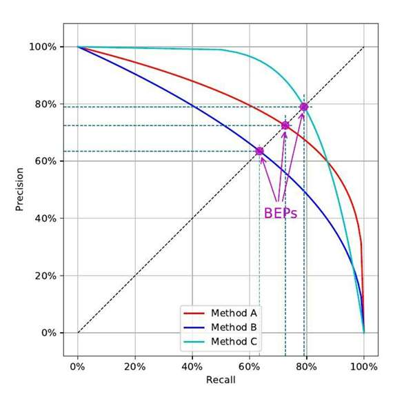
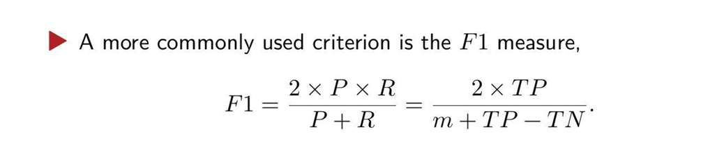
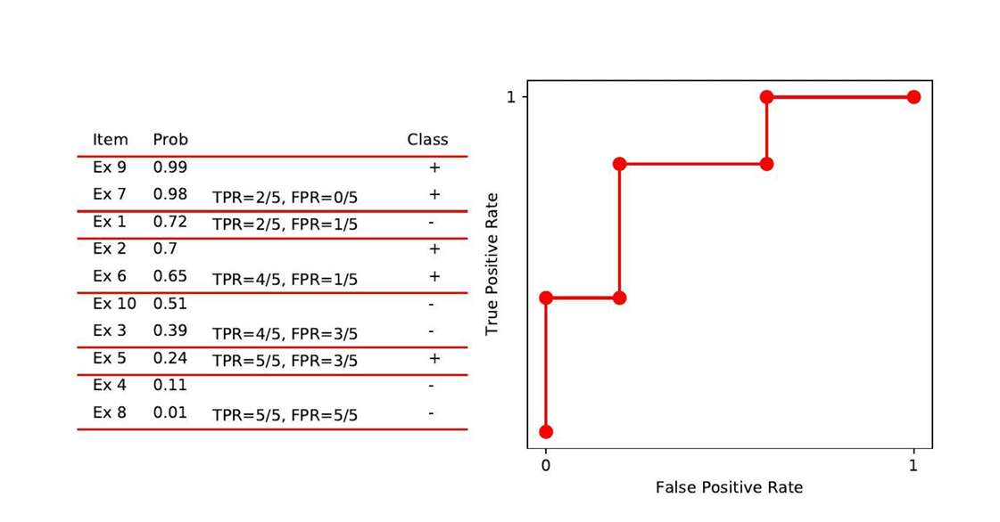

 
 份四份笔记
 
 第一份笔记 机器学习概念+模型评估+线性回归逻辑回归 
 第二份笔记 神经网络  CNN Transformer      
 第三份笔记  降维 VC维 计算学习理论 概率近似正确  再加生成式模型   
 第四份笔记就是梳理一些老师没划重点的零碎的知识 + 押题！

# 机器学习基本概念

### 机器学习定义

**Tom Mitchell**的定义：
- **Task (T):** 任务（如：识别手写数字）。
- **Performance (P):** 性能度量（如：准确率）。
- **Experience (E):** 经验/数据。

即，computer program， 是为了实现T， 从E中学习，  至于学习的如何，以及如何调整以至于学的更好，把P理解为函数的话，是借助P（T）

>Suppose an email program can record whether you mark anemail as spam and learn from this data to filter spam moreeffectively. In this problem, what is the task T?
- Classifying emails as spam or not spam
- Recording your tagging of emails as spam or not spam
- The number (or proportion) of emails correctly classifiedas spam or not spam
- None of the above: This is not a machine learningproblem

应该是Classify这个动作是Task，  Recording是数据来源，Number是评价指标

还有什么具体的场景？

- **场景：下棋程序 (Checkers / Chess)**
    
    - **T:** 下棋（参与比赛）。
        
    - **P:** 赢棋的百分比（或胜率）。
        
    - **E:** 自己跟自己下棋的棋谱（或人类高手的棋谱）。
        
- **场景：自动驾驶 (Self-driving car)**
    
    - **T:** 在公路上安全行驶。
        
    - **P:** 无事故行驶的平均里程数。
        
    - **E:** 观察人类司机驾驶的一系列视频图像和操作指令。

**如果问，什么是机器学习：**
基于数据（Experience），让模型具备从中发现规律，并对未知数据做出预测或决策，完成目标任务（Task）的能力， 并且我们通过性能度量（Performance）来使模型进行参数更迭，以达到更好的效果

更学术一点：
机器学习是一门致力于研究如何通过**计算的手段**，利用**经验 (Experience/Data)** 来改善系统在特定**任务 (Task)** 上的**性能 (Performance)** 的学科。简单来说，就是让计算机在不进行显式编程的情况下，具备学习的能力。

### 机器学习的四大要素

- **假设空间 (Hypothesis Space):** 模型可能属于的函数集合（这个怎么理解？）
	*   比如做线性回归，我们假设数据符合 $y = wx + b$。那么所有的 $w$ 和 $b$ 的组合构成的所有直线的集合，就是假设空间。
    *   如果我们用二次曲线去拟合，那假设空间就是所有抛物线的集合。
    *   **一句话解释：** 算法在学习过程中“允许”选择的所有可能的函数的集合。

*   **损失函数 (Loss Function):** $L(y, f(x))$，衡量**单个样本**预测值与真实值的差异。

*   **目标函数 (Objective Function) / 代价函数 (Cost Function):** $J(w)$，衡量**整个训练集**上的平均损失，通常包含**正则化项 (Regularization)**。
	*   *重点回答老师的问题：* **损失函数 vs 目标函数？**
		*   **Loss** 是针对单个样本的（Error for one example）。
		*   **Cost/Objective** 是针对整个数据集的统计（Average loss over dataset），通常是目标函数Loss的变体（也有可能一样），还包含约束项（如 L1/L2 正则化）以防止过拟合等。优化算法最小化的是目标函数。

*   **优化算法 (Optimization Algorithm):** 如何更新参数：
	- **解析解 (Analytical Solution):** 比如线性回归的**正规方程 (Normal Equation)**，是一步算出结果，不需要梯度下降（但计算量大，内存不够时不用）。
    - **数值解 (Numerical Solution):** 主要是**梯度下降 (Gradient Descent)** 及其变体。
	- **考试答题策略：** 如果问常用算法，回答：**SGD (Stochastic Gradient Descent), Mini-batch GD, Adam, RMSprop**。, Adam（动量法梯度下降）等。

### 机器学习的类型
1.有监督学习（**Supervised Learning**）
 通俗理解，就是E是有标签的，  比如T是分类或回归（都是预测问题，回顾是预测连续的值 分类是预测离散的值）  E的话  就是有具体的数据 及对应的标签（分类或回归的具体情况）。  
机器学习模型有： 
- 线性回归 (Linear Regression)
- 逻辑回归 (Logistic Regression),
- 神经网络 (Neural Networks),
- 支持向量机 (SVM)。

**2. 无监督学习 (Unsupervised Learning)**
这个E无标签。 无标签怎么T？
因为无监督学习的任务 (T) **不是预测**（因为没有标准答案标签），而是**发现数据内部的结构**。

机器学习模型有：
- **聚类 (Clustering):** 把相似的东西堆在一起（比如：客户分群）。
- **降维 (Dimensionality Reduction):** 把复杂的数据变简单，提取特征（比如：PCA）。
- **Visualization (可视化):** 这是降维的一个应用。比如把100维的数据压缩到2维，画在纸上让人能看懂。
>Among the following examples, which ones would you solveusing unsupervised learning techniques?
- Given emails and labels indicating whether they are spam,learn a spam filter.
- Given a set of news acquired from the web, classify thembased on whether they are about the same event.
- Based on a database of customer data, automaticallydiscover market segmentation and categorize customersinto relevant market segments.
- With a database diagnosing whether a patient hasdiabetes, learn to diagnose new patients for diabetes

-  **Option 2 (News):** 虽然也是聚类，但用了 "Classify" 这个词，有时候会有歧义（如果新闻类别是预定义好的，就是监督学习）。
- **Option 3 (Market Segmentation):** “发现市场细分”是无监督学习最经典的商业应用场景。你手里只有客户数据，不知道他们分几类，也不知道哪一类叫什么，完全靠算法自己去“发现”聚类。
- **结论：** 考试时如果单选，**选 3**。如果多选，2 和 3 都可以算。

### 机器学习评估（过一遍即可）

#### 偏差与方差

偏差 (Bias)

- **定义**: 偏差衡量的是模型的**期望（平均）预测值**与**真实值**之间的差距。这里的“期望”是指，如果我们使用不同的训练集进行训练，得到无数个模型（当然，我们现在讨论的是同一类模型，比如只讨论线性回归模型，只不过无数次训练会有无数种参数，所以说无数个模型）。然后对同一个样本 x 进行预测并取平均值，这个平均预测结果与真实结果 y 偏离了多少。

- **根源**: 偏差主要源于模型**错误的假设**或**过于简单的结构**。例如，如果数据本身的规律是二次曲线，而你坚持使用线性模型去拟合，那么无论你用多少数据，模型都无法准确捕捉真实规律，这就导致了系统性的、持续的偏差。

- **高偏差意味着**: **欠拟合 (Underfitting)**。模型没有学到数据的基本规律

 方差 (Variance)

- **定义**: 方差衡量的是当使用**不同训练集**时，模型预测结果的**变化程度或不稳定性**。它描述的是模型对训练数据中随机波动的敏感度。

- **根源**: 方差主要源于模型**过于复杂**，学习能力过强。这使得模型不仅学习了数据中普适的规律，还把特定训练集中的噪声和随机细节也当作规律记了下来。当训练集稍有变动，这些被“记住”的细节就会改变，导致预测结果产生剧烈波动。

- **高方差意味着**: **过拟合 (Overfitting)**。模型对训练数据“反应过度”。

显然
- 简单模型 = **高偏差，低方差**  有逻辑的，如果是高偏差，说明模型本身就太差了，所有数据都一样的、稳定的差！  也许大家都是50%的准确率
- 复杂模型 = **低偏差，高方差**   确实准，但是过拟合， 所以可能第一个训练集99%准确度  第二个训练集突然58% 第三个又80%

总结：
*   **Bias (偏差):** 描述了模型预测的期望值与真实值之间的偏离程度。**刻画了算法本身的拟合能力**（High Bias = Underfitting）。
*   **Variance (方差):** 描述了模型对于数据集中微小变动的敏感程度。**刻画了算法的稳定性**（High Variance = Overfitting）。
*   **泛化误差 (Generalization Error):** $\text{Bias}^2 + \text{Variance} + \text{Noise}$（噪声是不可约减的误差）。
#### 权衡偏差方差

模型复杂度可以理解为模型学习能力的强弱，比如多项式回归的阶数、决策树的深度、神经网络的参数数量等。

1. **当模型复杂度很低时**：
    
    - 模型处于**欠拟合**状态。
        
    - **偏差**起主导作用，**方差**很小。总误差很高。
        
2. **当我们逐渐增加模型复杂度时**：
    
    - 模型有更强的能力去拟合数据，**偏差**会迅速**下降**。
        
    - 同时，模型也开始变得对数据更敏感，**方差**会开始**上升**。
        
    - 在这个阶段，因为偏差的下降幅度大于方差的上升幅度，**总误差**会**下降**。
        
3. **当模型复杂度超过某个最佳点后**：
    
    - 模型处于**过拟合**状态。
        
    - **偏差**已经很小，下降空间有限。
        
    - **方差**开始急剧**上升**，并成为总误差的主要来源。
        
    - 因为方差的上升幅度超过了偏差的下降幅度，**总误差**反而会**上升**。

这就形成了一个经典的 **"U型"曲线**：

- **X轴**: 模型复杂度
    
- **Y轴**: 预测误差
    
- **偏差曲线**: 单调递减
    
- **方差曲线**: 单调递增
    
- **总误差曲线**: 先下降，后上升，呈现一个 "U" 型（或碗型）。
    

**这个 "U" 型曲线的最低点，就是我们理论上能找到的最佳模型复杂度，它在偏差和方差之间达到了最好的平衡。**

#### 测试集
在实践中，我们必须有一套**可靠的方法**，来**评估**一个训练好的模型到底有没有过拟合，以及它的“泛化能力”到底有多强

其实，就是测试集.... 
但，到底怎么生成测试集，是一个学问

留出法就是直接把数据集一刀切为训练集和测试集 就不管了

k折交叉验证 将数据分为K份， 每次K-1份训练 剩下一份测试，  每份都要当一次测试集  故而循环K次

留一法  仍然是K折交叉验证 数据是离散的（数据集本身包含的**样本数量**（Sample Size）永远是离散的、有限的）  比如有N份， 那就将K设为N

自助法，即bootstrap  数据是离散的（不会有数据集是连续的吧？）有放回抽样N次  结果会是  没有选中的数据 是在(1-n分之一)的n次方的概率里 当 $N \to \infty$ 时，这个极限等于 $\frac{1}{e} \approx 0.368$。  是 36.8%     没有选中的就当测试集 选中的（显然会有数据被选中多次）当作训练集  

| 方法                     | 优点                         | 缺点                      |
| ---------------------- | -------------------------- | ----------------------- |
| **留出法 (Hold-out)**     | 简单，计算开销最小。                 | 评估结果偶然性大；训练集变小，评估结果有偏差。 |
| **k折交叉验证 (k-Fold CV)** | 充分利用数据，评估结果稳健可靠，是目前最主流的方法。 | 计算开销是留出法的k倍。            |
| **留一法 (LOO)**          | 评估结果最稳定，最接近真实模型的性能。        | 计算开销极大，不适用于大数据集。        |

#### 参数调优

参数调优，意思是训练前我们就调整参数，而不是用反向传播梯度下降调整参数。

验证集的意思 testing subset 就是测试集再划分一部分出去。 
为啥要这个验证集呢？
- 我们用**训练集**来训练模型。

- 我们用**验证集**来进行参数调优和模型选择（比如比较KNN中K=3好还是K=5好）。我们会用不同的超参数训练出多个模型，然后看哪个在验证集上表现最好，就选它。

- 当我们选定了最终的模型和超参数后，我们用**一次**从未使用过的**测试集**来评估其最终的、真实的泛化能力。

有三种方式 进行参数调优

==突然疑惑，为什么放着梯度下降不用 而是暴力调参呢？==
因为我们暴力调的，是超参数而不是参数
-  **参数 (Parameters, $w, b$):** 是模型内部的权重。因为损失函数关于 $w$ 是**可导的**（连续光滑的），所以我们可以算梯度，告诉$w$该往哪个方向走。
*   **超参数 (Hyperparameters, $K$, $\lambda$, Layers):** 它们决定了模型的**结构**。
	*   例如 KNN 的 $K=3$ 还是 $5$，这是**离散的整数**，不可导（你没法算“K的梯度”）。
	*   例如神经网络有几层，你不能说“我有3.5层”。
	*   即使是连续的超参数（如学习率），由于它们改变的是“损失函数的形状”而不是“在函数上的位置”，且计算一次代价太高（调一次参数就要重新训练一遍模型），所以没法用反向传播的梯度下降，只能用**搜索 (Search)**。

1.手动调参：自己一个一个试参数，能大概感觉到哪个参数影响大，哪个影响小

2与3：网格搜索和随机搜索

- **左图 (Grid Layout - 网格搜索)**：在每个参数的维度上都均匀地取了3个点，总共测试了9个组合。请注意看，虽然它测试了9个点，但在**重要的横轴**上，它其实只探索了 **3个**不同的值。它把很多次试验机会（6次）浪费在了垂直方向的移动上，但如果纵轴参数不重要，这种移动对找到“山峰”几乎没有帮助。

- **右图 (Random Layout - 随机搜索)**：它也是测试9个点，但这9个点是在整个空间里**随机撒**的。由于是随机的，这9个点在**重要的横轴**上，几乎探索了 **9个**完全不同的值。

**结论**：当你的超参数很多，但只有少数几个是真正重要的时候，**随机搜索**比网格搜索更高效。它不会把计算资源浪费在探索不重要的参数上，而是把每一次试验都用在探索一个**全新的、独特的组合**上。

#### P、N、T、F

 Positive/Negative 标签，并不是生活中的“好/坏”，而是来自于统计学和假设检验的术语。它的含义更接近于：

- **Positive (阳性)**：代表“**事件发生了**”、“**信号被检测到了**”或者“**是我们重点关注和寻找的目标**”。
    
- **Negative (阴性)**：代表“**事件未发生**”、“**正常状态**”或者“**背景**”。

在绝大多数二分类问题中，“Positive”类通常是：

1. **少数类 (Minority Class)**：病人的数量远少于健康人。
    
2. **我们更感兴趣、需要采取行动的类**：发现了疾病就要治疗，发现了欺诈就要阻止。
    
3. **预测错误的代价通常不均衡的类**：漏诊病人的代价，远大于把健康人叫来复查的代价。

这俩字母就是**P和N**
那**T和F**呢？

- TP是 (true positive)
- FP(false positive)
- TN(true negative)
- FN(false negative)
- 第一个字母 (T or F) 代表 **预测得对不对 (True/False)**。
- 第二个字母 (P or N) 代表 **模型预测的是什么 (Positive/Negative)**。

- **TP (True Positive)**: **真阳性**
    
    - 真实情况：患癌 (Positive)
        
    - 模型预测：患癌 (Positive)
        
    - 结论：**预测对了 (True)**，预测的是 **P**。
        
- **FP (False Positive)**: **假阳性 (误报)**
    
    - 真实情况：健康 (Negative)
        
    - 模型预测：患癌 (Positive)
        
    - 结论：**预测错了 (False)**，预测的是 **P**。这就是“错杀”，把好人当坏人。
        
- **TN (True Negative)**: **真阴性**
    
    - 真实情况：健康 (Negative)
        
    - 模型预测：健康 (Negative)
        
    - 结论：**预测对了 (True)**，预测的是 **N**。
        
- **FN (False Negative)**: **假阴性 (漏报)**
    
    - 真实情况：患癌 (Positive)
        
    - 模型预测：健康 (Negative)
        
    - 结论：**预测错了 (False)**，预测的是 **N**。这就是“放过”，把坏人当好人了。
        

- TP + FP：这是所有**被模型预测为 Positive** 的样本总数。
    
- TP + FN：这是所有**真实标签是 Positive** 的样本总数。
    
- TN + FP: 这是所有**真实标签是 Negative** 的样本总数。

- TP + TN: 这是所有**被模型预测正确**的样本总数。

#### P-R曲线

- **Precision = TP / (TP + FP)**  精确率
    
    - **含义**：在你所有**预测为Positive**的样本中，到底有多少是**真的Positive**？
        
    - **衡量的是**：模型的**查准率**。它关心的是“我预测的这堆‘癌症病人’里，别有太多是健康人来凑数”。
        
- **Recall = TP / (TP + FN)**  召回率
    
    - **含义**：在所有**真正为Positive**的样本中，你成功地**找出来了**多少？
        
    - **衡量的是**：模型的**查全率**。它关心的是“别把真正的癌症病人都漏掉了”。

举个例子，
即使把一些健康人误诊为癌症（FP），或者把一些好人抓起来审查（FP），代价是可以接受的。但如果把一个真正的病人诊断为健康（FN），或者放过了一个恐怖分子（FN），后果是灾难性的。  
这种情况，我们就更关心召回率。

我宁愿收件箱里进来几封垃圾邮件（漏报，FN），也绝对不能接受把老板的重要邮件给过滤掉（误报，FP）。YouTube宁愿放过一些侵权视频（FN），也不能把用户的原创视频错误地打上侵权标签给下架了（FP），否则会引起巨大反感。
在这种场景下，我们**更关心精确率 (Precision)**。

如果我们想提高 **召回率 (Recall)**，即“不放过一个”。
必须把判断为 Positive 的 **门槛调低**。这样，即使模型对某个样本不太确定，也会倾向于将其预测为 Positive，从而捕获到更多真正的 Positive 样本。
 
 TP (真阳性) 数量增加或不变，FN (假阴性/漏报) 数量减少 -> **召回率上升**。
 
同时，FP (假阳性/误报) 的数量也几乎必然会增加，因为很多阴性样本会被错误地划进来 -> **精确率下降** (因为分母 TP+FP 变大了)。

所以我们能画出这样的P-R曲线

- **X轴** 是 **召回率 (Recall)**
    
- **Y轴** 是 **精确率 (Precision)**
    
- 曲线上的**每一个点**，都代表了在**某一个特定阈值**下，模型所能达到的P和R值。
    
- 当我们从高到低**连续地调整阈值**，就会在图上画出一条连续的曲线。通常，这条曲线的趋势是从左上角（高P，低R）向右下角（低P，高R）延伸。

如果一个模型的P-R曲线完全“**包住**”了另一个模型（比如图中的C包住了B），我们能得出什么结论？

这个模型，无论哪个阈值，准确率、召回率这俩数据，都比另一个模型高，毋庸置疑的好！

但如果两条曲线发生了**交叉**，情况就变得复杂了。在这种“难分高下”的情况下
我们常用 Break-Even Point, 平衡点

 - **含义**：就是 P-R 曲线上 **“精确率 = 召回率”** 的那个点。
    
- **如何比较**：哪个模型的BEP值更高，就认为哪个模型更好。
    
- **看图（P25）**：你可以画一条从左下角(0,0)到右上角(1,1)的对角线（这条线上所有点的P值都等于R值）。这条线和A、B、C三条曲线的交点，就是它们各自的BEP。从图上看，C的BEP值最高，A次之，B最低。

- **局限性**：BEP只关注了曲线上一个非常特殊的点，忽略了曲线其他部分的信息，所以现在用得比较少了。

更常用的，是F1度量

F1度量是精确率 (P) 和召回率 (R) 的 **调和平均数 (Harmonic Mean)**。

我们知道有算术平均 ((P+R)/2) 和几何平均 (sqrt(P*R))，为什么要用更复杂的调和平均呢？

> **调和平均的特点是：它会更偏向数值较小的那个变量。**

**举个例子：**

- 模型A：P=0.9, R=0.1
    
    - 算术平均 = (0.9+0.1)/2 = 0.5
        
    - F1值 = `2 * (0.9*0.1) / (0.9+0.1) = 0.18 `  (非常低！)
        
- 模型B：P=0.5, R=0.5
    
    - 算术平均 = (0.5+0.5)/2 = 0.5
        
    - F1值 = 2 * (0.5*0.5) / (0.5+0.5) = 0.5 (更高！)
        

**结论：** F1度量不希望出现“偏科”的学生。一个模型哪怕精确率高达99%，但召回率只有1%，它的F1值也会非常低。只有当**P和R两者都比较高**时，F1值才会高。这正是我们想要的——一个综合表现优秀、没有明显短板的模型。

#### ROC曲线
**P-R曲线 (精确率 vs 召回率)**：
    
- 它的两个轴 (Precision = TP/(TP+FP), Recall = TP/(TP+FN)) 都只关注**正例 (Positive)**。它回答的是：“我找出来的这堆‘坏人’纯度高不高？我把所有‘坏人’都找全了吗？”
	
- **适用场景**：它更关心模型在**正例**上的表现，特别是在**正例样本数量远少于负例样本**（即数据不均衡）的情况下，P-R曲线能更直观地反映模型的性能。
        
- **ROC曲线 (TPR vs FPR)**：
    
    - 它的两个轴 (TPR = TP/(TP+FN), FPR = FP/(FP+TN))，一个关注**正例**的表现（找全了多少坏人），另一个关注**负例**的表现（错怪了多少好人）。
        
    - 它衡量的是一种**“收益”与“代价”之间的权衡**：我为了多找出一些坏人（提高TPR），需要付出多错怪一些好人（提高FPR）的代价。
        
    - **适用场景**：它能很好地衡量模型在**不同阈值**下，识别正负样本的**综合能力**，尤其是在评估模型的**排序质量**（即模型是否能很好地把正例排在负例前面）时非常有用。当数据类别分布比较均衡时，ROC曲线的表现更稳定。

**AUC (Area Under Curve):** 。
*   ROC曲线下的面积叫 AUC。
*   AUC = 0.5：瞎猜（随机）。
*   AUC = 1.0：完美预测。
*   **物理意义：** 随机抽一个正样本和一个负样本，模型给正样本打分比负样本高的概率。

 绘图过程
1. 从 (0,0) 点开始。
    
2. 将所有样本按预测概率从高到低排序。
    
3. 依次遍历每个样本：
    
    - 如果这个样本是**真正的正例 (Positive)**，就在**Y轴**方向（向上）移动 1 / (总正例数) 的距离。
        
    - 如果这个样本是**真正的负例 (Negative)**，就在**X轴**方向（向右）移动 1 / (总负例数) 的距离。
        
4. 把这些移动的轨迹连接起来，就是ROC曲线。

#### 小qa
**Q1: Cross-Validation (名词解释)**
> **Answer:** 交叉验证。一种评估模型泛化能力的方法。将数据集划分为 $k$ 个子集，每次用 $k-1$ 个子集训练，剩下一个子集测试，重复 $k$ 次取平均值。可以有效利用数据，避免单次划分带来的偏差。

**Q2: 为什么 Precision 和 Recall 通常是矛盾的？(简答)**
> **Answer:** 提高 Recall 需要降低分类阈值，让更多样本被预测为正例，这会导致更多的负例被误判为正例 (FP增加)，从而导致 Precision ($TP/(TP+FP)$) 分母变大而下降。反之亦然。

**Q3: F1-Score 的公式及含义？(简答)**
> **Answer:** $F1 = \frac{2 \times P \times R}{P + R}$。它是 Precision 和 Recall 的调和平均数。用于综合衡量模型性能，特别适用于 P 和 R 相互制约且需要平衡的场景。

**Q4: ROC 曲线相比 P-R 曲线有什么优势？(选择/判断)**
> **Answer:** 当正负样本分布发生剧烈变化（比如从 1:1 变成 1:100）时，ROC 曲线的形状能保持基本不变，而 P-R 曲线会剧烈波动。因此在**类别不平衡 (Imbalanced Data)** 问题中，ROC 能给出更稳健的评估，但如果只关心正例
> 的表现，P-R 更直观。

# 线性回归

### 形式
$$h_{\theta}(x)=\theta^Tx$$
输出$h_{\theta}(x)$就是预测值。
输出等于系数乘输入加偏置项，其中输入是样本的特征值，系数就是每个特征的权重，   这样的话输入和输出是一个线性关系。
在训练阶段，我们通过解析解或梯度下降算法找到最优参数$\theta$ 
于预测阶段，用全新输入，代入公式，所得到的就是预测值。

或者
$$ y = \mathbf{w}^T \mathbf{x} + b $$

### 损失，代价/目标函数 
如机器学习定义篇章所讲，
损失函数是定义在单个样本上的
$L(y^{(i)}, f(x^{(i)})) = ( f(x^{(i)})-y^{(i)} )^2$
而代价函数，这里是求平均的损失函数 再乘个二分之一

均方误差代价函数
$$ J(\theta) = \frac{1}{2m} \sum_{i=1}^{m} \Big( h_{\theta}(x^{(i)}) - y^{(i)} \Big)^2 $$
或者
$$ J(w, b) = \frac{1}{2m} \sum_{i=1}^{m} \Big( (\mathbf{w}^T \mathbf{x}^{(i)} + b) - y^{(i)} \Big)^2 $$

- 由于平方，无论正确答案对于预测值是偏大还是偏小，都能展现出俩者差距
- 较大的误差会给予更严厉的惩罚
- 代价函数是凸函数，保证梯度下降算法能找到全局最优解

### 优化模型
线性回归模型的误差来源有哪些？在实际构建模型分别应当采用什么策略来减小相应的误差？

误差来源：
- 偏差：“偏差”衡量模型最优情况下的预测值和真实值的差距。欠拟合就指偏差误差大
- 方差：指因模型对训练数据微小波动过于敏感带来的误差，衡量新数据时模型预测结果发生的改变幅度。高方差即过拟合，拟合训练数据太完美以至于拟合了噪声
策略：
- 对于欠拟合，在输入角度上增加更多特征，在模型角度上使用多项式特征，让直线模型能拟合曲线
- 对于过拟合，在输入角度上让数据量更多，特征数量减小，在模型角度上，在代价函数里增加惩罚项，即正则化

下面详细讲解正则化
#### 正则化

| 特性       | **L1 正则化 (Lasso)**                              | **L2 正则化 (Ridge / Weight Decay)** |
| :------- | :---------------------------------------------- | :-------------------------------- |
| **公式项**  | $\lambda \sum w_i$ (权重的绝对值之和)                   | $\lambda \sum w_i^2$ (权重的平方和)     |
| **核心功能** | **稀疏化 (Sparsity)**                              | **平滑化 (Smoothing)**               |
| **效果**   | 能把某些不重要的特征权重 $w$ **直接变为 0**。                    | 让权重 $w$ **趋近于 0，但不会等于 0**。        |
| **应用场景** | **特征选择** (Feature Selection)。如果你觉得特征里有很多垃圾，用L1。 | **防止过拟合**。大部分情况下默认用 L2（最通用）。      |
| **求导难度** | 在 0 处不可导 (用次梯度)，解起来稍微麻烦。                        | 处处可导，方便计算。                        |

看起来，我们是在惩罚w    我们不让w过于大，就能防止过拟合
为啥？到底怎么起效的？

因为我们在训练时 如果模型复杂度够， 想让模型完全拟合数据（不加任何限制的情况下）  那就会出现有w特别大 为什么？
假如数据里有一些噪声点（比如有一个点本来是(1,2)，但不小心观察成了(1, 100)）。
如果你非要模型把这个(1, 100)也拟合准（过拟合），模型就不能用简单的 $2x$ 了，它得用高阶多项式扭曲过去，比如：
$$ y = 1000x - 999x^2 + 500x^3 ... $$
为了去够那个离谱的噪声点，模型需要用**巨大的正系数**（向上拉）和**巨大的负系数**（向下拉）相互抵消，造出剧烈的波动来恰巧经过那个点。
即 只有参数 $w$ 巨大且正负剧烈交替时，函数曲线才能产生剧烈的震荡（过拟合的特征）。

而有w特别大，就会导致  如果模型训好了  拿新的出现一点点 波动一点点的数据    预测结果都会变化非常大。  即方差太大

再者， 我们不仅是单纯地“不让w大”  对于L1 在整个过程中，会直接把一些没必要的特征系数w比设为0，去掉干扰信息 ，  
为啥L1的话，模型会自发的去掉w？
*   **L1求导：** $(|w|)' = 1$ (当w>0) 或 $-1$ (当w<0)。
    *   不管 $w$ 多么小（只要不是0），L1 的惩罚力度**永远是常数 1**。
    *   它就像一个恒定的推力，即使 $w$ 已经很小了，它还是用力把它推向 0，直到彻底变成 0 为止

L2呢它倾向于让所有特征的权重都比较小且均衡，而不是让模型仅仅依赖于某一个特征。 仍然用梯度下降解释
*   **L2求导：** $(w^2)' = 2w$。
    *   当 $w$ 变小（比如 0.001）时，惩罚力度 $2w$ 也就变成了 0.002。**力度越来越小，最后不再推了，就停在 0 附近，但不是 0。**

另外，加正则化，也相当于给模型求解参数加了个“限制”。
如果用假设空间来说  不加正则化时，你的假设空间是“所有可能的直线/曲线”。
加了正则化 那么**假设空间变小了**   逼迫模型在有限的参数空间激发模型的潜力

**“为什么正则化能防止过拟合？”**

> **参考答案：**
> 
> 1. **降低模型复杂度：** 正则化通过惩罚大的权重参数，限制了假设空间的大小。
>     
> 2. **降低敏感度 (平滑函数)：** 较小的权重使得模型输出对输入特征的微小变化（如噪声）不敏感，函数曲线更加平滑，避免了去拟合训练数据中的随机噪声。
>     
> 3. **稀疏性 (仅L1)：** L1正则化能进行特征选择，去除不相关的特征（权重置为0），消除噪声特征的干扰。
>

蓝色圈是**损失函数 (MSE)** 的等高线。 
图里其实有无数个等高线 即无数个蓝色圈
圆心 是损失函数最低的地方 坐标为`（最优的w1，最优的w2）` 

==所以这里我们是举了一个，变量是二维的例子。==
假设你要预测房价。
    *   特征 1 ($x_1$)：房子的面积。
    *   特征 2 ($x_2$)：卧室的数量。
    *   模型公式：$y = \mathbf{w_1} \cdot x_1 + \mathbf{w_2} \cdot x_2 + b$
    *   **图里的坐标轴：** 横轴就是 $\mathbf{w_1}$（面积的权重），纵轴就是 $\mathbf{w_2}$（卧室数的权重）。
仍然是我们的公式$W^T X+b$  W、X都是向量 包含了多个变量。 

红色的线
**L2 正则化:** $w_1^2 + w_2^2 \le 1$。 右图
	这就是初中数学的**圆**方程。所以右图是红色的圆。

 **L1 正则化:** $|w_1| + |w_2| \le 1$。  左图 
*   我们在第一象限（$w_1>0, w_2>0$）时，它是 $w_1 + w_2 = 1$（一条斜线）。
*   在第二象限（$w_1<0, w_2>0$）时，它是 $-w_1 + w_2 = 1$（另一条斜线）。
*   四个象限的四条线连起来，就变成了一个**菱形**。

我们在梯度下降的过程，就会有意把最终的解，推向红色线里。

举个例子，假设我们真的很巧，当前模型参数一下子就落到了圆心，即最优解， 
那么我们目标函数是否为0？ 不是！  因为有正则化。 于是它还是要变
往哪变？往红色线区域靠近
具体速率刚才说过，L1是1  L2是2w   
那么再靠近的过程中，  
- 对于L1  最先靠近到红线区域的坐标，是尖角！因为我们这个靠近过程，可以理解为在蓝圈上跳跃，扩散 ，  从其他地方扩散。想象这个扩散过程，这个图像切点，正是尖角。 尖角意味着什么？ 有某个特征，变为了0！ 这就是为什么L1是用来扔特征的
- 对于L2  最先靠近到红线区域的坐标，就是正常的圆的某个点。 这个图像比较圆润。 所以说 L2较为温和 它让所有特征“均匀得小” 

#### 补充思考

#### **问题一：$b$ (偏置) 算特征吗？图像是不是三维？**

*   **严谨地说：** $b$ 是**参数 (Parameter)**，不是特征 (Feature)。
*   **工程上：** 为了计算方便（写成矩阵乘法 $W^T X$），我们会给输入 $x$ 强行加一个“伪特征” $x_0 = 1$。在这种视脚下，对应的 $w_0$ 就是 $b$。
*   **正则化时：** **这是一个大坑（考点）！**
    *   **我们通常不对 $b$ 进行正则化！**
    *   **为什么？** 正则化的目的是防止模型“过拟合/太复杂”。
        *   $w$ 变大意味着曲线“上下翻飞”、“扭曲”，这是复杂。
        *   $b$ 变大只意味着曲线“整体向上平移”。把线平移到宇宙尽头，它还是一条直直的线，复杂度没变。
    *   **结论：** 在标准做法中，正则化项 $\sum w_i^2$ 是**不包含** $b$ 的。

#### 问题二：只有一个特征 $x$，用 L1 正则化，会不会直接欠拟合（变0）？

> *只有一个特征，L1 倾向于把系数变0。如果变成0了，模型就是 $y=b$（一条水平线）。那岂不是彻底废了？

**回答：** **不一定变0，这取决于一场“拔河比赛”。**
想象两个力在拉 $w$：
1.  **MSE (数据) 的拉力：** “喂！这个特征 $x$ 很重要！$x$ 变大 $y$ 也就变大，你必须给我一个正的 $w$（比如 5），不然预测误差太大了！”
2.  **L1 (正则) 的拉力：** “我不管，$w$ 必须是 0！”

**结果如何？**
*   **情况 A（特征很有用）：** 如果 $x$ 和 $y$ 强相关（比如 $x$ 是面积，$y$ 是房价），MSE 的拉力**远大于** L1 的拉力。
    *   结果：$w$ 会从原本的 5 被拉到 4.8。**它减小了，但没有归零。**
*   **情况 B（特征没啥用）：** 如果 $x$ 和 $y$ 关系不大（比如 $x$ 是房东名字笔画数），MSE 的拉力很弱。
    *   结果：L1 直接把 $w$ 拉回 0。
*   **情况 C（正则化参数 $\lambda$ 太大）：** 你给 L1 的权重太大了（$\lambda \to \infty$）。
    *   结果：不管特征多重要，全都被拉回 0。这时候确实**欠拟合**了。

**结论：** 单特征用 L1 不会死，只要 $\lambda$ 设置合理，它只是会让 $w$ 稍微变小一点点（Shrinkage）。

#### 问题三：如果不做多项式特征，$w$ 还会变大吗？

前的理解是“高阶多项式导致震荡，震荡需要大权重”。
那么，**简单线性回归（不加多项式）** 会出现 $w$ 爆炸吗？

**答案是：很难爆炸，除非……特征之间打架（多重共线性）！**

简单一元回归 ($y = wx$)
你是对的。
*   如果数据里有个噪点 (1, 100)，模型只能把直线稍微抬高一点，比如 $w$ 从 2 变成 5。它做不到变成 1000，因为那样会把其他 99 个正常点全都预测错，MSE 会炸。
*   所以在**简单一元线性回归**里，过拟合的表现通常**不是** $w$ 爆炸，而是更容易**欠拟合**（因为直线根本拟合不了复杂噪声）。

.多元线性回归（真正导致权重爆炸的元凶）
假如你不构造 $x^2$，但你有两个特征 $x_1, x_2$。
而且这俩特征**几乎一模一样**（比如 $x_1$ 是左脚鞋码，$x_2$ 是右脚鞋码）。
$$ y \approx x_1 + x_2 $$
真实规律可能是 $y = 0.5 x_1 + 0.5 x_2$。

但如果数据有一点点噪声，模型可能会学出这样的奇葩参数：
$$ y = 10000.5 x_1 - 10000 x_2 $$
请算一下：
$$ 10000.5 \times \text{左脚} - 10000 \times \text{右脚} \approx 0.5 \times \text{脚大小} $$
**看！预测结果没变，但是参数 $w$ 爆炸了！**

**为什么要正则化？**
*   这就是为了防止这种**特征之间相互抵消**的“内耗”现象。
*   如果我们加了 L2 正则化（$\text{Minimize } w_1^2 + w_2^2$）：
    *   方案 A ($0.5, 0.5$) 的惩罚：$0.25 + 0.25 = 0.5$ **(很小，采纳！)**
    *   方案 B ($10000.5, -10000$) 的惩罚：$1亿 + 1亿 = 2亿$ **(太大，滚粗！)**

故而
1.  **对于单个特征：** 确实不太会变大，顶多是斜率稍微偏一点。
2.  **对于多个特征：** 如果特征之间存在**相关性 (Collinearity)**，如果不加正则化，$w$ **绝对会爆炸**。正则化在这里的作用是保证数值稳定性（让解唯一且稳定）。

### 贝叶斯视角推导损失函数

这个逻辑链条是：
1.  **极大似然估计 (MLE)** $\rightarrow$ 推导出 **MSE (均方误差)**。
2.  **最大后验估计 (MAP)** $\rightarrow$ 推导出 **正则化项**。

#### MSE 推导

$$ y_{\text{观察值}} = \underbrace{(w^T x)}_{\text{完美的真理}} + \underbrace{\epsilon}_{\text{噪声}} $$

*   **$x$ (观察到的输入):** 比如房子的面积。
*   **$w^T x$ (真理/预测中心):** 这是上帝心中的完美房价（也是我们模型想猜到的那个数）。这是一个**确定的数**。
*   **$\epsilon$ (噪声):** 比如房东心情好不好、砍价能力等随机因素。我们假设它服从正态分布 $N(0, \sigma^2)$。
*   **$y$ (观察到的标签):** 这是我们在数据集里**真正看到的**房价。

噪声 $\epsilon \sim N(0, \sigma^2)$。
而**常数 + 正态分布 = 正态分布**。

*   $w^T x$ 是个常数（对于给定的 $x$ 和 $w$ 来说）。
*   $\epsilon$ 是个随机变量（在 0 附近跳动）。
*   所以，$y$ 就是在 $w^T x$ 附近跳动。

所以说我们有理由假设：
 $y$ 服从以 $w^Tx$ 为中心的高斯分布（正态分布）：
$$ P(y|x; w) = \frac{1}{\sqrt{2\pi}\sigma} \exp\left( -\frac{(y - w^Tx)^2}{2\sigma^2} \right) $$

这里的y，x  是数据集的数据，
w，是我们模型的参数。

这里稍稍有点难理解，我认为是有一个“巧劲”在里面。
我们要训练模型，但我们**看不见** $y_{真}$，也**看不见** $\epsilon$。我们手里只有 $y_{观测}$ 和 $x$。
我们的模型公式是 $\hat{y} = w^T x$。**我们的目标确实是想让 $\hat{y}$ 无限接近 $y_{真}$**，而不是去拟合那个噪声。

> **假设：** 假设我们的模型 $w$ **已经**猜到了真理（即假设当前训练的 $w = w_{真}$）。
> **推论：** 那么，在这个假设下，我们观测到的数据 $y_{观测}$ 和我们预测的值 $w^T x$ 之间的差距，就**应该**正好是那个噪声。

$$ \text{残差} = y_{观测} - w^T x \quad \approx \quad \text{噪声} \epsilon $$
所以，它就也是高斯分布

ok 高斯分布的问题我们解决了

我们究竟如何真的让我们模型，趋近于猜到真理呢？

行吧，我们还是让它，尽可能贴合y观测，就已经是模型能做到最好的状态了

所以**极大似然估计 (MLE)** 说：我要找到 $w$，使得观测到所有数据 $y$ 的概率最大。

即最大化似然函数 $L(w) = \prod P(y^{(i)}|x^{(i)}; w)$。
我们最大化这个函数，最终求解出来的w， 就是最合适的参数

取对数 (Log-Likelihood) 变乘为加，去掉无关常数，最后变成了：
$$ \text{Maximize } \sum - (y^{(i)} - w^Tx^{(i)})^2 $$
负号拿掉，变成最小化：
$$ \text{Minimize } \sum (y^{(i)} - w^Tx^{(i)})^2 $$
**这就是 MSE！**

> **一句话考点：** 最小二乘法 (MSE) 等价于噪声服从高斯分布的极大似然估计。

但其实，这还是把w当作一个固定参数，通过一个目标函数求解出来了。这不是贝叶斯视角，而是频率派视角。 **所以这里MSE不是贝叶斯视角推导！**

#### 正则化推导

MLE 认为 $w$ 是个固定参数。但贝叶斯学派认为 **$w$ 本身也是个随机变量，服从某种分布（先验分布 Prior）**。

贝叶斯公式登场

公式：**后验 (Posterior) $\propto$ 似然 (Likelihood) $\times$ 先验 (Prior)**
$$ P(w|y, x) \propto P(y|x; w) \cdot P(w) $$

其实这个似然，就是刚才，上一步所说的，高斯函数。
所以，我们就是在这个基础上，再加一个我们对“w”的先验，
即纵使啥数据没有，我认为w应该服从什么分布，应该长什么样子。

我们要最大化后验概率 (MAP)。取对数后：
$$ \text{Maximize } \underbrace{\log P(y|x; w)}_{\text{MSE部分}} + \underbrace{\log P(w)}_{\text{先验部分}} $$
也就是：
$$ \text{Minimize } \text{MSE} - \log P(w) $$

1.  **推导 L2 正则化 (Ridge)：**
    *   假设参数 $w$ 的先验分布是 **高斯分布 (Gaussian)** $w \sim N(0, \tau^2)$。
    *   即 $P(w) \propto \exp(-w^2)$。
    *   那么 $- \log P(w) \propto w^2$。
    *   **结论：MSE + $w^2$ $\Rightarrow$ L2 正则化。**

2.  **推导 L1 正则化 (Lasso)：**
    *   假设参数 $w$ 的先验分布是 **拉普拉斯分布 (Laplace)** $w \sim \text{Laplace}(0, b)$。
    *   即 $P(w) \propto \exp(-|w|)$ （拉普拉斯分布是尖顶的）。
    *   那么 $- \log P(w) \propto |w|$。
    *   **结论：MSE + $|w|$ $\Rightarrow$ L1 正则化。**

故而

**误差：** 噪声是高斯分布 $\rightarrow$ 导出 MSE。
**正则化：**
    *   参数 $w$ 先验是 **高斯分布** $\rightarrow$ 导出 **L2 (平方)**。
    *   参数 $w$ 先验是 **拉普拉斯分布** $\rightarrow$ 导出 **L1 (绝对值)**

最后一点，
在实际的正则化应用中，
我们还给正则化项乘$\lambda$ 这个超参数
（回想前面 可以在参数调优时调整）

### 计算

*   **$m$ (Mass/Many):** 样本的总数量（训练集有几行）。
    *   对应下标 **$i$** ($i = 1, 2, ..., m$)。
    *   公式里出现 $\sum_{i=1}^m$，意思就是“把所有**人**的误差加起来”。
*   **$n$ (Number of features):** 特征的总数量（输入有几列）。
    *   对应下标 **$j$** ($j = 1, 2, ..., n$)。
    *   公式里出现 $\sum_{j=1}^n$，意思就是“把一个人的所有**属性**（身高、体重...）加起来”。
*   **$\mathbf{x}^{(i)}$ (Vector):** 第 $i$ 个样本的输入向量。
    *   它是一个 $n$ 维列向量。
    *   注意：上标 $(i)$ 代表第几个样本，下标 $j$ 代表第几个特征。
*   **$\mathbf{w}$ (Vector):** 权重向量。
    *   它也是一个 $n$ 维列向量。
*   **$y^{(i)}$ (Scalar):** 第 $i$ 个样本的真实标签（是一个数）。

令线性回归模型为
$$ y = \mathbf{w}^T \mathbf{x} + b $$
$$ J(w, b) = \frac{1}{2m} \sum_{i=1}^{m} \Big( (\mathbf{w}^T \mathbf{x}^{(i)} + b) - y^{(i)} \Big)^2 $$
使用梯度下降法，推导出更新权重w和偏差b的公式：

$$ \mathbf{w} \leftarrow \mathbf{w} - \alpha \left[ \frac{1}{m} \sum_{i=1}^{m} \Big( (\mathbf{w}^T \mathbf{x}^{(i)} + b) - y^{(i)} \Big) \mathbf{x}^{(i)} + \frac{\lambda}{m} \mathbf{w} \right] $$

即基于损失函数，分别对w、b求偏导
     $$ \mathbf{w}_{new} = \mathbf{w_{old}} - \alpha ×\frac{1}{m}\sum_{i=1}^m\big((\mathbf{w}_{old}^Tx^i+b) -y^i\big)x^i$$
     $$ b_{new} = b_{old}-\alpha ×\frac{1}{m}\sum_{i=1}^m\big((\mathbf{w}^Tx^i+b_{old}) -y^i\big)$$

假设采用L2正则化项，给出加入正则化后的损失函数，并推导出权重更新公式。
正则化后的损失函数：

$$J(w,b) = \frac{1}{2m}\sum_{i=1}^{m} \Big( (\mathbf{w}^T \mathbf{x}^{(i)} + b) - y^{(i)} \Big)^2 + \frac{\lambda}{2m}\sum_{j=1}^{n}w_{j}^2$$
w：
$$ \mathbf{w}_{new} = \mathbf{w}_{old} - \alpha ×\big(\frac{1}{m}\sum_{i=1}^m\big((\mathbf{w}_{old}^Tx^i+b) -y^i\big)x^i + \frac{\lambda}{m}\mathbf{w}_{old}\big)$$
其中，最容易错的是$\sum_{j=1}^{n}w_{j}^2$ 对w的求偏导，我们不应该写为$\sum_{j=1}^{n}2w_{j}$ ，每个函数的梯度，**本身就是一个向量**。这个向量的每一个分量，就是该函数对相应变量的**偏导数**，所以应该写为$$ \nabla f(\mathbf{w}) = \begin{bmatrix} 2w_1 \\ 2w_2 \\ \vdots \\ 2w_n \end{bmatrix} $$
即$2\mathbf{w}_{old}$

b：惩罚项无b，故保持不变
$$ b_{new} = b_{old}-\alpha ×\frac{1}{m}\sum_{i=1}^m\big((w^Tx^i+b_{old}) -y^i\big)$$

对于正则化的更新公式，我们可以把它把括号拆开，变形一下，会有一个非常惊艳的发现：

$$ \mathbf{w}_{new} = \mathbf{w} - \alpha \frac{\lambda}{m}\mathbf{w} - \alpha (\text{原来的梯度}) $$
$$ \mathbf{w}_{new} = \underbrace{ (1 - \alpha \frac{\lambda}{m}) \mathbf{w} }_{\text{先缩小一点}} - \alpha (\text{原来的梯度}) $$

**这就是“权重衰减 (Weight Decay)”名字的由来：**
1.  每次更新前，先不管三七二十一，把现在的权重 $\mathbf{w}$ 乘以一个小于 1 的系数 $(1 - \alpha \frac{\lambda}{m})$。
    *   这意味着：如果你什么都不学，权重也会自动慢慢衰减归零。
2.  然后再沿着梯度的反方向走一步。

# 感知机
感知机用在分类问题，
形式为

$$ {y} = f({w}^T {x} + b) $$

其中 f为所谓“激活函数”

$$
f(z) =
\begin{cases}
+1  & \text{if } z > 0 \\
-1 & \text{if } z < 0
\end{cases}
$$

通俗理解就是 z>0为一类 小于0为一类。

模式识别的话来讲，这就是一个判别函数吧？

并且，w这个向量，正是我们${w}^T {x} + b$ 这条直线的  法线

**且w指向的那一侧，就是正类（+1类）**
**背对的那半个房间**，为 **负类 (-1)**。

所谓 $w^T x > 0$，几何意义就是 **向量 $x$ 和向量 $w$ 的夹角小于 90度**（它们大概指向同一个方向）。

#### 更新权重

**第一种情况：**
*   **真实值 $y = +1$**：这个样本 $x$ **应该**站在 $w$ 指向的那一边。
*   **预测值 $\hat{y} = -1$**：机器判错了，说明此时 $x$ 站在了墙的背面（$w$ 背对的那边）。
*   也就是说，现在向量 $x$ 和 $w$ 的夹角 **大于90度**（背道而驰）。

**怎么改？ (更新 $w \leftarrow w + x$)**
于是 $w$ 需要**往 $x$ 的方向转一点**。
*   **向量加法：** 向量 $w$ 加上向量 $x$，根据平行四边形法则，合成的新向量 $w_{new}$ 会**向 $x$ 靠近**。
*   **结果：** 夹角变小了，$w$ 指向 $x$ 了，样本 $x$ 就更有可能落入正类区域。

> 把 $b$ 想象成 $x$ 的最后一位是常数 1 的权重。$w$ 往 $x$ 靠，$b$ 自然也往 1 靠。或者简单理解：**阈值降低了，得的值变大 **，让更多人能被判为正类。

**第二种情况：**
*   **真实值 $y = -1$**：这个样本 $x$ 是**应该**在w指向的另一边。
*   **预测值 $\hat{y} = +1$**：机器判错了，此时 $x$ 站在了 $w$ 指向的那一边。
    *   也就是说，现在 $x$ 和 $w$ 的夹角 **小于90度**。

**怎么改？ (更新 $w \leftarrow w - x$)**
*   **直观理解：** 我们需要让 $w$ **离 $x$ 远一点**，别指着它。
*   **向量减法：** $w$ 减去 $x$，相当于 $w$ 加上 $(-x)$。这意味着 $w$ 往 $x$ 的**反方向**转动。
*   **结果：** 夹角变大了（超过90度），$x$ 就被甩到墙的背面去了。

综上，
 $w \leftarrow w + yx$  这个更新公式就是完美的

*   当 $y=+1$（且判错）时，我们要 $+x$。
*   当 $y=-1$（且判错）时，我们要 $-x$。

于是直接写成：

$$ {w}_{\text{new}} = {w}_{\text{old}} + \alpha y{x} $$
$$ b_{\text{new}} = b_{\text{old}} + \alpha y $$

 $\eta$ 是学习率

*   **如果 $y=+1$**：公式变成 $w + x$ （拉近 $w$ 和 $x$）。
*   **如果 $y=-1$**：公式变成 $w - x$ （推开 $w$ 和 $x$）。

### 感知机准则损失函数 (Perceptron Criterion)

感知机不关心“对得有多好“，它只关心“**错得有多离谱**”。

对于分类正确的点，损失为 0。

对于分类错误的点，损失是它到边界的距离（的某种度量）。

**感知机准则损失函数公式：**
$$ L(w) = - \sum_{x_i \in M} y_i (w^T x_i + b) $$
*   **注意符号：**
    *   $M$ 是 **误分类点 (Misclassified points)** 的集合。
    *   求和只针对**判错**的点！判对的点不参与求和（Loss=0）。

按照我们的定义，严谨地说，这是**目标函数 (Objective Function)**，它是所有误分类样本的**单个损失 (Individual Loss)** 之和。其中单个损失是 $L = \max(0, -y(w^Tx+b))$。但由于感知机常采用 SGD 逐样本更新，且历史习惯上常把这个整体准则称为**感知机损失函数**，所以通用了

**公式很好推导，也是模式识别SVM中那个”函数间隔“**

*   如果点 $x_i$ 被**误分类**了：
    *   意味着真实值 $y_i$ 和预测值 $w^T x_i$ **符号相反**。
    *   所以 $y_i (w^T x_i)$ 是一个**负数**。
    *   前面加个**负号**，整个 Loss 就变成了一个**正数**。
    *   **误分类点越远，这个正数越大（惩罚越大）。**
*   **对它求梯度（求导）：**
    $$ \nabla L(w) = - \sum_{x_i \in M} y_i x_i $$
*   **梯度下降更新：**
    $$ w_{new} = w - \alpha \nabla L = w + \alpha \sum y_i x_i $$

所以说 如果我们求损失函数 

### 感知器收敛性定理：
数据必须有线性可分性才能收敛

# 逻辑回归
### 形式

逻辑回归模型为

$$ h_{\mathbf{w}}(\mathbf{x}) = \frac{1}{1 + \exp(-\mathbf{w}^T \mathbf{x})} $$

其中 

有一个sigmoid函数，
为
$$\frac{1}{1 + \exp(-{x})} $$

所以逻辑回归如何实现分类的？

首先，和线性回归一样，通过线性函数处理输入，把输出当作综合得分。
然后，通过非线性的sigmoid函数，将输入数据映射到0与1之间，其映射数值可以看作样本属于"y=1"的概率
最后我们以概率0.5作为决策阈值，定义0到0.5为一类，0.5到1为一类，进行二分类。
等于0.5呢？ 意味$w^T x + b = 0$等于0   为决策边界
### 损失，代价/目标函数 

h(x)可以理解为靠近1的概率。
若标签为1，h(x)即表示此样本正确的概率
若标签为0，1-h(x)表现此样本正确的概率

那么单个样本正确的概率为$h(x)^{y}(1-h(x))^{1-y}$

所以概率正确总概率为$L(w)= \prod h(x)^{y}(1-h(x))^{1-y}$
(这里感觉L符号容易和损失函数符号弄混 这里的L是Likelihood。似然函数)

取对数，$log L(w) =\sum({y}log(h(x))+(1-y)log((1-h(x)))$

这是表示正确的程度，不过取对数后，正确程度越高，logL(w)越接近0，正确程度越低，logL(w)越接近负无穷。我们需要最大化这个函数，让他正确程度尽可能高。

梯度下降需要最小化一个大于等于0的损失函数，我们加负号变成J(w)
那么最大化log L(w)就转化成最小化J(w)。
$$ J(\mathbf{w}) = -\frac{1}{m} \log L(\mathbf{w}) $$
最终代价函数为：
$$ J(\mathbf{w}) = -\frac{1}{m} \sum_{i=1}^{m} \Big[ y^{(i)} \log(h_{\mathbf{w}}(\mathbf{x}^{(i)})) + (1-y^{(i)}) \log(1 - h_{\mathbf{w}}(\mathbf{x}^{(i)})) \Big] $$
还有另一种推导方法，其实也就是直觉版本

![[作业1线性模型-1759929670485.jpeg]]

代价函数和损失函数  为了不弄混 再次强调

$$ L(y, \hat{y}) = - \Big[ y \log(\hat{y}) + (1-y) \log(1 - \hat{y}) \Big] $$
*   这是针对**某一个样本** $i$ 的。 损失函数
*   它叫 **对数损失 (Log Loss)** 或 **交叉熵损失 (Cross-Entropy Loss)**。

带 $\sum$ 的大公式：
$$ J(w) = \frac{1}{m} \sum_{i=1}^m L(y^{(i)}, \hat{y}^{(i)}) + \text{正则项} $$
*   这是针对**所有样本**的平均值。
*   它叫 **Cost Function ($J$)**。
代价函数或者目标函数

#### 计算 

**使用梯度下降法，推导出更新权重w的公式**

设$-W^T X$ 为z

logL(w)对h(z)导数
$$ \sum \big( y\frac{1}{h(z)} -(1-y)\frac{1}{1-h(z)}\big) = \sum \frac{y - h(z)}{h(z)(1-h(z))}$$

现在单独看sigmoid函数即h(z)，对z的导数
$$\frac{exp(-x)}{(1+exp(-x))^2} = h(z)(1-h(z))$$

z对w导数
$$-x$$

好 我们现在就把h(z)写成x 刚才只是为了求导过程清晰

则我们得到的单个样本的对数似然梯度是：

$$ \frac{\partial \log L}{\partial \mathbf{w}} = {\left( \frac{y - h(x)}{h(x)(1-h(x))} \right)} \cdot {\left( h(x)(1-h(x)) \right)}\cdot {\left( {x} \right)} = (y - h(x)) {x}$$

最终w：

$$\mathbf{w}_{\text{new}} = \mathbf{w}_{\text{old}} - \alpha \cdot \frac{1}{m} \sum_{i=1}^{m} (h(x^{(i)}) - y^{(i)}) \mathbf{x}^{(i)}  $$

当引入L1正则化项时，写出正则化后的损失函数
 $$J(\mathbf{w}) = -\frac{1}{m} \sum_{i=1}^{m} \Big[ y^{(i)} \log(h_{\mathbf{w}}(\mathbf{x}^{(i)})) + (1-y^{(i)}) \log(1 - h_{\mathbf{w}}(\mathbf{x}^{(i)}))+\frac{\lambda}{m}  \sum_{j=1}^{n} |w_j|\Big] $$
#### 贝叶斯解释

贝叶斯解释加正则化的代价函数

我们仍然是 先讲 频率视角中无正则化的代价函数怎么来的。

在线性回归中，我们假设的是**高斯分布**（正态分布）。  
在逻辑回归中，我们处理的是0/1分类，所以我们假设的是**伯努利分布 (Bernoulli Distribution)**。

*   **假设：** 每一个样本 $y$ 就像抛硬币，服从伯努利分布：
$$ P(y|x; w) = (h_w(x))^y (1 - h_w(x))^{1-y} $$
    *(意思是：如果是正面(y=1)，概率是h；如果是反面(y=0)，概率是1-h)*
*   **似然函数 (Likelihood):** 把所有样本的概率乘起来。我们想要这个函数最大
$$ L(w) = \prod P(y^{(i)}|x^{(i)}; w) $$
*   **取负对数 (-LogLikelihood):** 乘积变求和，最大化变最小化。
    $$ J(w) = -\sum [ y \log h + (1-y) \log (1-h) ] $$

这就是**交叉熵损失 (Cross Entropy)**。
*   *线性回归：* 假设误差是**高斯分布** $\to$ 推导出 **MSE**。
*   *逻辑回归：* 假设分布是**伯努利分布** $\to$ 推导出 **交叉熵**。

如果你问的是**正则化后的代价函数**，那么解释和线性回归**完全一样**
是加入贝叶斯视角

*   **最大后验估计 (MAP):**
    $$ \text{Posterior} \propto \text{Likelihood (伯努利)} \times \text{Prior (参数w的分布)} $$
*   **取对数后：**
    $$ J(w) = \underbrace{\text{CrossEntropy}}_{\text{来自似然}} + \underbrace{\text{Regularization}}_{\text{来自先验}} $$
*   **结论：**
    *   如果我们假设参数 $w$ 服从**高斯分布** ($w \sim N(0, \tau^2)$)，就推导出 **L2 正则化**。
    *   如果我们假设参数 $w$ 服从**拉普拉斯分布**，就推导出 **L1 正则化**。

#### 补充思考（老师最后一节课强调）

**Softmax与逻辑回归的关系**

逻辑回归通常用于 **二分类** (是/否)。
Softmax 是逻辑回归在 **多分类** (猫/狗/猪) 上的推广。

公式（对于 $K$ 个类别中的第 $i$ 类）：
$$ P(y=i|x) = \frac{e^{z_i}}{\sum_{j=1}^{K} e^{z_j}} $$
*   **分母的作用：** 归一化。确保所有类别的概率加起来等于 1。
*   **分子的作用：** $e^z$ 把分数放大，强者恒强（分高一点点，概率大很多）。

**考点：当类别数 $K=2$ 时，Softmax 就是 Sigmoid。**

我们可以推导一下：
假设 Softmax 有两个输出 $z_1, z_0$。我们只关心第一类的概率：
$$ P(y=1) = \frac{e^{z_1}}{e^{z_1} + e^{z_0}} $$
上下同除以 $e^{z_0}$：
$$ P(y=1) = \frac{e^{z_1 - z_0}}{1 + e^{z_1 - z_0}} $$
如果我们令 $z = z_1 - z_0$（也就是两个分数的差值），那么：
$$ P(y=1) = \frac{e^z}{1 + e^z} = \frac{1}{1 + e^{-z}} $$
**看！这就是 Sigmoid 函数！**

> **意义：** 逻辑回归其实就是 Softmax 的一个特例（二分类特例）。

老师问“有什么差异”，通常是在考以下几点：

| 特性       | 逻辑回归 (Logistic / Sigmoid)       | Softmax 回归                           |
| :------- | :------------------------------ | :----------------------------------- |
| **应用场景** | **二分类** (Binary Classification) | **多分类** (Multi-class Classification) |
| **互斥性**  | 通常用于**非互斥** (多标签) *             | **互斥** (Mutually Exclusive)          |
| **输出节点** | **1个** (输出 $P$, 另一类是 $1-P$)     | **K个** (输出 $P_1, P_2, \dots, P_K$)   |
| **参数量**  | 一组权重向量 $w$                      | 一个权重矩阵 $W$ (每个类别都有一组 $w$)            |
| **损失函数** | 二元交叉熵 (Binary Cross Entropy)    | 多元交叉熵 (Categorical Cross Entropy)    |

***注（互斥性的解释）：**
*   **Softmax:** 你的图里只能有一个唯一的类别。它是猫，就不能是狗。所有概率加起来必须是1。
*  **Multiple Logistic (Sigmoid):** 如果我在神经网络最后一层放 10 个 Sigmoid 节点（而不是 Softmax），这意味着每张图可以是猫，同时也可以是白色的，同时也可以是室内的。它们互不影响，概率加起来可以大于1。

这就是老师说的，这俩函数衔接到模型的最后，有什么差异？

 Multiple Logistic 将多分类问题分解为 $K$ 个独立的二分类问题（One-vs-Rest）。它适用于**类别之间不互斥**的场景（如给文章打多个标签），而 Softmax 适用于**类别互斥**的场景。

# 广义线性模型（也是老师提到的一点）

普通的线性回归 $y = w^T x$ 假设 $y$ 是连续的、服从高斯分布的。

但这太死板了！如果我们想预测“抛硬币结果（0/1）”或者“一分钟车站来了几个人（计数）”，直接用 $w^T x$ 就不合适。

于是我们给 $w^T x$ **套一个壳**，这就叫广义线性模型。

**定义三要素（必背）：**
1.  **线性预测器 (Linear Predictor):** $\eta = w^T x + b$ （核心还是线性的）。
2.  **联系函数 (Link Function) $g(\cdot)$:** 它把线性预测值 $\eta$ 映射到真实标记 $y$ 的空间。
    *   公式：$y = g^{-1}(w^T x + b)$
3.  **指数族分布 (Exponential Family):** 假设标签 $y$ 服从某种分布（高斯、伯努利、泊松等）。

**常见的 GLM 家族成员：**

| 模型名称     | 任务类型        | 联系函数 (Link Function)                            | 假设分布                  |
| :------- | :---------- | :---------------------------------------------- | :-------------------- |
| **线性回归** | 回归 (连续值)    | $g(y) = y$ (Identity, 恒等映射)                     | **高斯分布** (Gaussian)   |
| **逻辑回归** | 二分类 (0/1)   | $g(y) = \ln(\frac{y}{1-y})$ (Logit / Sigmoid的逆) | **伯努利分布** (Bernoulli) |
| **泊松回归** | 计数 (人数/车流量) | $g(y) = \ln(y)$                                 | **泊松分布** (Poisson)    |

> **考试考点：**
> 问：逻辑回归是线性模型吗？
> 答：它是**广义**线性模型。因为它通过一个非线性的 Link Function (Sigmoid) 将线性预测转化为概率。假设标签 $y$服从伯努利分布

