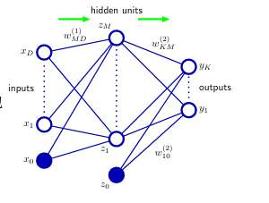
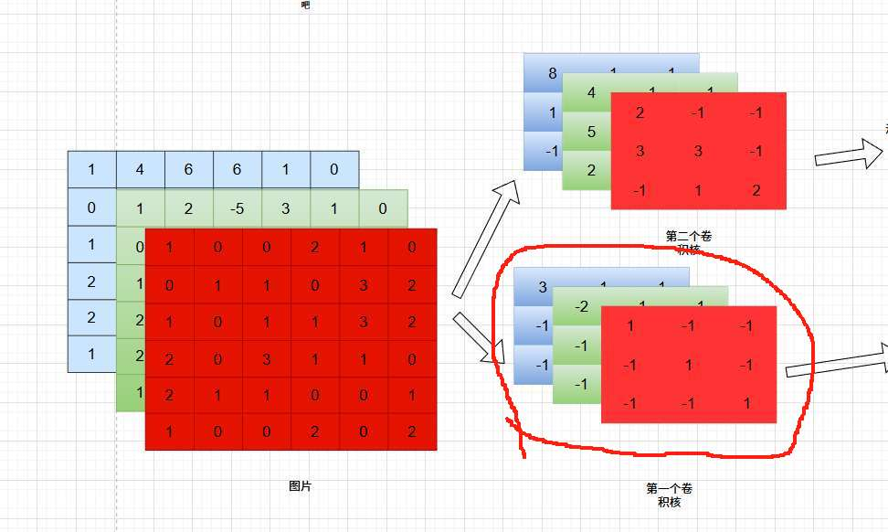
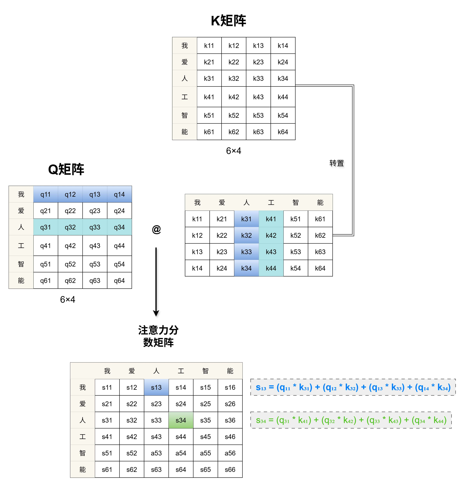

# 机器学习概念

### 1. 核心定义 (必背)
*   **Tom Mitchell 定义 (T-P-E):**
    *   **T (Task):** 任务（如：下棋、分类）。
    *   **P (Performance):** 性能度量（如：胜率、准确率）。
    *   **E (Experience):** 经验/历史数据。
    *   *话术：* 机器学习是计算机利用经验 $E$ 在任务 $T$ 上改进性能 $P$ 的过程。
*   **机器学习四大要素:**
    1.  **数据 (Data):** 训练集、测试集。
    2.  **模型 (Model):** 也就是**假设空间 (Hypothesis Space)**，如线性模型集合。
    3.  **目标函数 (Objective/Cost Function):** 评估模型好坏的标准（Loss + 正则项）。
    4.  **优化算法 (Optimization Algorithm):** 求解最优参数的方法（如 SGD）。

### 2. 学习类型 (选择/填空)
*   **监督学习 (Supervised):**
    *   数据**有标签** (Label)。
    *   任务：**分类** (离散输出, e.g. 垃圾邮件)、**回归** (连续输出, e.g. 房价)。
*   **无监督学习 (Unsupervised):**
    *   数据**无标签**。
    *   任务：**聚类** (Clustering)、**降维** (PCA)、**密度估计**。
*   **半监督学习 (Semi-supervised):** 少量有标签 + 大量无标签。
*   **强化学习 (Reinforcement):** 智能体(Agent)通过与环境交互(Action)获得奖励(Reward)来学习。

### 3. 泛化与过拟合 (核心简答题)
*   **泛化能力 (Generalization):** 模型在**未见过的**新数据上的表现。
*   **过拟合 (Overfitting):**
    *   *现象：* 训练集表现极好，测试集表现很差。
    *   *原因：* 模型太复杂、数据太少、训练过度。
    *   *解决：* **正则化 (Regularization)**、增加数据、Early Stopping、Dropout。
*   **欠拟合 (Underfitting):**
    *   *现象：* 训练集和测试集表现都差。
    *   *原因：* 模型太简单（假设空间太小）。
    *   *解决：* 增加特征、把模型搞复杂点（如增加神经网络层数）。

### 4. 偏差与方差 (Bias-Variance Tradeoff)
*   **偏差 (Bias):** 刻画算法的**拟合能力**（准不准）。高偏差 = 欠拟合。
*   **方差 (Variance):** 刻画算法的**稳定性**（稳不稳）。高方差 = 过拟合。
*   **泛化误差公式:** $E = \text{Bias}^2 + \text{Variance} + \text{Noise}$。
*   *规律：* 模型越复杂，偏差越小，方差越大（U型曲线）。

### 5. 评估方法 (怎么分数据)
*   **留出法 (Hold-out):** 直接按比例（如 7:3）切分。
*   **k-折交叉验证 (k-fold CV):** 数据分 k 份，轮流做测试集。**最常用**。
*   **留一法 (Leave-One-Out, LOO):** k = 样本总数。最准但最慢。
*   **自助法 (Bootstrap):**
    *   **做法：** 有放回采样 $m$ 次。
    *   **考点：** 约有 **36.8%** ($1/e$) 的样本从未被采到，用作**包外估计 (Out-of-Bag, OOB)** 测试集。适合小样本。

### 🔥 终极押题 (必刷 Q&A)

**Q1: Cross-Validation (名词解释)**
> **Answer:** 交叉验证。一种评估模型泛化能力的方法。将数据集划分为 $k$ 个子集，每次用 $k-1$ 个子集训练，剩下一个子集测试，重复 $k$ 次取平均值。可以有效利用数据，避免单次划分带来的偏差。

**Q2: 为什么 Precision 和 Recall 通常是矛盾的？(简答)**
> **Answer:** 提高 Recall 需要降低分类阈值，让更多样本被预测为正例，这会导致更多的负例被误判为正例 (FP增加)，从而导致 Precision ($TP/(TP+FP)$) 分母变大而下降。反之亦然。

**Q3: F1-Score 的公式及含义？(简答)**
> **Answer:** $F1 = \frac{2 \times P \times R}{P + R}$。它是 Precision 和 Recall 的调和平均数。用于综合衡量模型性能，特别适用于 P 和 R 相互制约且需要平衡的场景。

**Q4: ROC 曲线相比 P-R 曲线有什么优势？(选择/判断)**
> **Answer:** 当正负样本分布发生剧烈变化（比如从 1:1 变成 1:100）时，ROC 曲线的形状能保持基本不变，而 P-R 曲线会剧烈波动。因此在**类别不平衡 (Imbalanced Data)** 问题中，ROC 能给出更稳健的评估，但如果只关心正例
> 的表现，P-R 更直观。

**Q5: 验证集 (Validation Set) 和测试集 (Test Set) 有什么区别？(简答/辨析)**
> **Answer:**
> *   **验证集**用于模型选择和**超参数调优**（如选 KNN 的 K，选正则化系数 $\lambda$）。它是参与训练过程的（虽然不直接更新梯度）。
> *   **测试集**仅用于**最终评估**模型的泛化能力。它在整个训练和调参过程中必须是完全不可见的（盲测），否则会导致结果虚高（数据泄露）。

**Q6: 什么是“归纳偏置 (Inductive Bias)”？(名词解释)**
> **Answer:** 学习算法在缺乏数据时，对某种假设的偏好或先验假设。例如：CNN 偏好局部性和平移不变性；线性回归偏好特征与输出呈线性关系；奥卡姆剃刀（简单模型优先）。

**Q7: 计算题：混淆矩阵指标计算**
*(这种题必考，给你一个表格，让你算 P, R, F1)*
> **场景:** 100个样本，其中正例(P) 20个，负例(N) 80个。模型预测了 30 个正例，其中 15 个是对的。
> **Answer:**
> *   TP (真阳) = 15
> *   FP (假阳) = 30 - 15 = 15
> *   FN (假阴) = 20 - 15 = 5
> *   **Precision (查准率)** = TP / (TP+FP) = 15/30 = **50%**
> *   **Recall (查全率)** = TP / (TP+FN) = 15/20 = **75%**
> * $F1 = \frac{2 \times P \times R}{P + R}$  

**Q8: 为什么使用自助法 (Bootstrap) 会有 36.8% 的样本没被选中？(推导/选择)**
> **Answer:**
> 样本总数为 $m$。每次采样未选中某样本的概率是 $1 - \frac{1}{m}$。
> 采样 $m$ 次后，该样本始终未被选中的概率是 $(1 - \frac{1}{m})^m$。
> 当 $m \to \infty$ 时，该极限值为 $\frac{1}{e} \approx 0.368$。

**Q9: 损失函数 (Loss) 与 目标函数 (Objective) 的区别？(简答)**
> **Answer:**
> *   **Loss Function:** 定义在**单个样本**上的误差，如 $(y_i - \hat{y}_i)^2$。
> *   **Cost Function:** 定义在**整个训练集**上的平均误差。
> *   **Objective Function:** 最终优化的目标，通常是 **Cost + 正则化项 (Regularization)**。优化算法最小化的是目标函数。

# 线性模型 
## 线性回归

### 1. 核心公式 (填空/简答必背)
*   **基本形式:** $f(x) = w^T x + b$。
*   **均方误差 (MSE) 损失:** $L(w, b) = \sum_{i=1}^m (y_i - (w^T x_i + b))^2$。
*   **解析解 (Normal Equation):** $w^* = (X^T X)^{-1} X^T y$。
    *   *考点补充：* 什么时候不能用？当数据量太大（矩阵求逆 $O(d^3)$ 太慢）或者 $X^T X$ 不可逆时。
*   **优化算法:** 梯度下降 (Gradient Descent)。$w \leftarrow w - \eta \nabla J(w)$。

### 2. 正则化 (Regularization) —— 核心中的核心

*   **考法A：公式辨析**
    *   **L1 (Lasso):** $J(w) + \lambda ||w||$ (绝对值之和)。
    *   **L2 (Ridge/岭回归):** $J(w) + \lambda ||w||^2$ (平方和)。
*   **考法B：功能差异 (选择/简答)**
    *   **L1:** 能够产生**稀疏解** (Sparse Solution)，即让某些 $w$ 变为 0。**用于特征选择**。
    *   **L2:** 让 $w$ 变小但不会非 0，防止过拟合，模型更平滑。
*   **考法C：几何解释 (画图/简答)**
    *   **L1:** 约束区域是**菱形** (Diamond)。等高线容易切在坐标轴上 (角点)，导致 $w_i=0$。
    *   **L2:** 约束区域是**圆形** (Circle)。等高线切在圆弧边上，不容易为 0。

### 3. 贝叶斯视角 (Bayesian View) —— 大题推导

*   **MLE (极大似然估计) $\to$ MSE:**
    *   假设噪声 $\epsilon \sim N(0, \sigma^2)$ (高斯分布)。  （假设我们观测到的数据 y_{观测}，即数据集的数据y和我们预测的值 w^T x之间的差距是噪声）
    *   最大化似然函数 $L(w) = \prod P(y_i|x_i; w)$ 等价于 **最小化均方误差**。
*   **MAP (最大后验估计) $\to$ 正则化:**
使用公式$$ P(w|y, x) \propto P(y|x; w) \cdot P(w) $$的前提下
    *   **L2 正则:** 假设参数 $w$ 的先验分布是 **高斯分布** $w \sim N(0, \tau^2)$。
    *   **L1 正则:** 假设参数 $w$ 的先验分布是 **拉普拉斯分布** $w \sim \text{Laplace}(0, b)$。

### 4. 梯度计算 (求偏导) —— 计算题基础
*   **MSE 对 $w$ 求导:**
    $$ \frac{\partial J}{\partial w} = \frac{1}{m} \sum_{i=1}^m (w^T x^{(i)} - y^{(i)}) x^{(i)} $$
    *(或者矩阵形式 $X^T(Xw - y)$)*
*   **L2 正则项求导:**
    $$ \frac{\partial}{\partial w} (\lambda w^T w) = 2\lambda w $$
    *(注意系数，有时损失函数里写了 $\frac{\lambda}{2}$，导数就是 $\lambda w$)*

---

### 🔥 终极押题 (必刷 Q&A)

**Q1: 为什么 L1 正则化可以进行特征选择，而 L2 不行？(画图或文字解释)**
> **Answer:**
> *   **几何角度：** L1 的约束域（菱形）有尖角，刚好在坐标轴上。损失函数的等高线极大概率会在尖角处与约束域相切，此时某些维度的权重 $w$ 为 0，从而实现特征选择。L2 的约束域（圆形）光滑，切点很难刚好在坐标轴上。
> *   **导数角度：** L1 在 $w=0$ 处导数不为 0（是常数符号函数），会持续给 $w$ 一个推力推向 0。L2 在 $w$ 接近 0 时导数也趋近于 0，推力减弱，很难推到绝对的 0。

**Q2: 证明：当假设噪声服从高斯分布时，线性回归的极大似然估计 (MLE) 等价于最小二乘法 (MSE)。(必考推导)**（我感觉可能是附加题？作业出过）
> **Answer (简写思路):**
> 1.  模型 $y = w^T x + \epsilon$，其中 $\epsilon \sim N(0, \sigma^2)$。
> 2.  则 $P(y|x; w) = \frac{1}{\sqrt{2\pi}\sigma} \exp(-\frac{(y - w^T x)^2}{2\sigma^2})$。
> 3.  似然函数 $L(w) = \prod_{i=1}^m P(y^{(i)}|x^{(i)}; w)$。
> 4.  取对数似然 $\ln L(w) = \sum [ \ln(\dots) - \frac{(y^{(i)} - w^T x^{(i)})^2}{2\sigma^2} ]$。
> 5.  最大化 $\ln L(w)$ 等价于最小化后面那项平方和，即 $\sum (y^{(i)} - w^T x^{(i)})^2$，这就是 MSE。

**Q3: 线性回归的解析解 (Normal Equation) 是什么？有什么局限性？(简答)**（感觉没学过，背下来吧）
> **Answer:**
> *   公式：$w = (X^T X)^{-1} X^T y$。
> *   局限性：
>     1.  **计算代价大：** 需要计算矩阵求逆，时间复杂度为 $O(d^3)$（$d$是特征维度），当 $d$ 很大时计算过慢。
>     2.  **不可逆：** 如果特征之间存在多重共线性（线性相关），$X^T X$ 可能不可逆（奇异矩阵），无法求解。

**Q4: 权重衰减 (Weight Decay) 的更新公式及其物理含义？(计算/填空)**
> **Answer:**
> *   引入 L2 正则化后，梯度下降更新公式变为：
>     $w_{new} = w - \eta (\nabla J_{data} + \lambda w) = (1 - \eta \lambda) w - \eta \nabla J_{data}$
> *   **含义：** 每次更新前，先把权重 $w$ 缩小一点点（乘以一个小于1的系数 $1-\eta\lambda$），然后再沿着梯度方向走。这就是“衰减”的由来。

**Q5: 解释广义线性模型 (GLM) 的三个组成部分。(名词解释)**（老师强调过）
> **Answer:**
> 1.  **线性预测器:** $\eta = w^T x$。
> 2.  **联系函数 (Link Function):** $g(\cdot)$，将预测值 $\eta$ 映射到期望输出 $\mu = E[y]$，即 $\eta = g(\mu)$。
> 3.  **指数族分布:** 假设目标变量 $y$ 服从某个指数族分布（如高斯、伯努利、泊松）。

## 感知机

**模型形式:**（考试写分段函数比较保险）
    $$ f(x) = \text{sign}(w^T x + b) $$
    *   输出为 $\{-1, +1\}$（注意不是 0/1，是为了方便后面公式推导）。
    
  **感知机准则损失函数 (Perceptron Criterion):**   （感知机准则损失函数 是代价函数。这是我们**最终想要最小化**的目标。它衡量的是**整个数据集**中所有误分类点到超平面的“距离总和”）
    *   **公式:** $J(w) = - \sum_{x_i \in M} y_i (w^T x_i + b)$
    *   *其中 $M$ 是**误分类点**的集合。*
    *   **必考辨析：**
		*   **损失函数 (Objective)** 定义的是**“我们最终想要优化什么”**（即让所有误分类点到超平面的距离之和最小）。
		*   *考试话术：* 该函数只统计误分类点，正确分类点损失为0。它虽不是处处可导，但在误分类点处可导。
**权重更新规则 (SGD):**（SGD就是随机梯度下降,虽然我们的目标是让上面的J(w),最小，但为了计算方便（不需要每次都把所有数据算一遍），我们每次**只拿一个**误分类点来算梯度，然后迈一步)
    *   当发现一个误分类点 $(x_i, y_i)$ 时：
        $$ w \leftarrow w + \eta y_i x_i $$
        $$ b \leftarrow b + \eta y_i $$
    *   *几何意义：* $y_i=1$ 判错 $\to$ $w$ 加上 $x$ ($\theta$ 减小，向量靠近样本)；$y_i=-1$ 判错 $\to$ $w$ 减去 $x$ ($\theta$ 增大，向量远离样本)。

## 逻辑回归

 **模型形式:**
    $$ h(x) = \sigma(w^T x + b) = \frac{1}{1 + e^{-(w^T x + b)}} $$
    *   输出为 $(0, 1)$ 之间的概率 $P(y=1|x)$。

**代价函数 (Cost Function):**
    *   **交叉熵 (Cross Entropy) / 对数损失 (Log Loss):**
        $$ J(w) = -\frac{1}{m} \sum_{i=1}^m \left[ y^{(i)} \ln h(x^{(i)}) + (1-y^{(i)}) \ln (1-h(x^{(i)})) \right] $$
    *   *特点：* 是凸函数 (Convex)，利于梯度下降求解全局最优。

 **贝叶斯解释 (MLE):**（贝叶斯视角推导怎么来的代价函数）
    *   假设样本服从**伯努利分布 (Bernoulli Distribution)**：$P(y|x) = h(x)^y (1-h(x))^{1-y}$。
    *   最大化似然函数 $\prod P(y_i|x_i)$ $\iff$ 最小化交叉熵损失。

 Softmax 回归 —— 多分类推广

*   **公式:** $P(y=k|x) = \frac{e^{z_k}}{\sum_{j=1}^K e^{z_j}}$。
*   **关系 (必考):**
    *   Softmax 是逻辑回归在多分类上的**推广**。
    *   当类别数 $K=2$ 时，Softmax **退化**为逻辑回归（Sigmoid）。
    *   *证明思路：* Softmax 的两个输出 $p_1, p_0$，计算 $p_1 = \frac{e^{z_1}}{e^{z_1}+e^{z_0}} = \frac{1}{1+e^{-(z_1-z_0)}}$，这就是 Sigmoid。

### 🔥 终极押题 (必刷 Q&A)

**Q1: 为什么逻辑回归不能像线性回归一样使用“均方误差 (MSE)”作为损失函数？(简答)**
> **Answer:**
> 1.  **非凸性 (Non-convex):** 如果将 Sigmoid 函数代入 MSE 公式，得到的损失函数 $J(w)$ 关于 $w$ 是**非凸**的，存在许多局部最优解，梯度下降难以收敛到全局最优。
> 2.  **梯度消失:** 当预测值接近 0 或 1 时，MSE 求导后会包含 $\sigma'(z)$ 项，导致梯度趋近于 0，学习速度极慢。而交叉熵损失求导后梯度为 $(h(x)-y)x$，误差越大梯度越大，收敛更快。

**Q2: 感知机 (Perceptron) 和 逻辑回归 (Logistic Regression) 的本质区别是什么？(对比)**
> **Answer:**
> *   **输出性质:** 感知机输出**类别** (Hard Classification, $\{-1, 1\}$)；逻辑回归输出**概率** (Soft Classification, $[0, 1]$)。
> *   **损失函数:** 感知机使用**错误驱动**的损失（只看误分类点）；逻辑回归使用**基于概率**的交叉熵损失（所有点都贡献梯度）。
> *   **可解性:** 感知机要求数据**线性可分**才能收敛；逻辑回归不要求线性可分（可以通过正则化处理）。

**Q3: 写出逻辑回归的对数似然函数，并说明其推导依据。(计算/推导)**
> **Answer:**
> *   依据：假设样本标签 $y \in \{0,1\}$ 服从**伯努利分布**。
> *   单样本概率：$P(y|x;w) = [h_w(x)]^y [1-h_w(x)]^{1-y}$。
> *   似然函数：$L(w) = \prod_{i=1}^m P(y^{(i)}|x^{(i)};w)$。
> *   对数似然：$\ell(w) = \sum_{i=1}^m [ y^{(i)} \ln h(x^{(i)}) + (1-y^{(i)}) \ln (1-h(x^{(i)})) ]$。
> *   (注：最大化它是 MLE，加负号最小化它就是 Cross Entropy Loss)。

**Q4: Softmax 回归通常搭配什么损失函数？为什么？(简答)**
> **Answer:**
> *   搭配 **多分类交叉熵损失 (Categorical Cross-Entropy Loss)**。
> *   原因：Softmax 输出的是分布概率，交叉熵是衡量两个概率分布（真实分布 vs 预测分布）差异的标准指标。且两者结合后求导形式简单（Prediction - Label），避免了梯度消失。

** “多分类交叉熵损失和交叉熵损失有什么区别？”

**解答：本质是一个东西，只是类别数量 $K$ 不同。**

*   **二元交叉熵 (Binary Cross-Entropy, BCE):**
    *   场景：逻辑回归，$K=2$。
    *   公式：$- [y \log \hat{y} + (1-y) \log (1-\hat{y})]$。
    *   特点：只用一个输出节点（预测正类的概率 $p$），负类概率自动是 $1-p$。
*   **多分类交叉熵 (Categorical Cross-Entropy, CCE):**
    *   场景：Softmax 回归，$K > 2$。
    *   公式：$- \sum_{k=1}^K y_k \log \hat{y}_k$。
    *   特点：$y$ 是 One-hot 编码（如 `[0, 0, 1]`），$\hat{y}$ 是 Softmax 输出的概率向量。

**考点：** 当 $K=2$ 时，多分类交叉熵的公式**数学上等价于**二元交叉熵。考试如果只写“交叉熵”，通常指通用的公式（带 $\sum$ 的那个），具体看题目背景。

**Q5: 如果逻辑回归过拟合了，你会怎么做？(简答)**
> **Answer:**
> 1.  加入 **正则化项** (L1 或 L2)。
> 2.  减少特征数量 (特征选择)。
> 3.  增加训练数据量。

> **你的回忆：** “老师上课说过什么softmax函数，衔接到逻辑回归模型的最后，与经典的模型有什么差异？”

**深度解读：**
这里的“经典模型”通常指 **“多个独立的逻辑回归（One-vs-Rest）”**。老师想考的是 **互斥性**。

**场景：** 假设我们要分类“猫、狗、猪” ($K=3$)。

*   **方案 A：Softmax 回归 (现代标准做法)**
    *   **架构：** 最后一层接 Softmax 函数。
    *   **输出：** $[0.7, 0.2, 0.1]$ (加起来等于 1)。
    *   **含义：** **类别互斥 (Mutually Exclusive)**。它认为这张图**只能**是猫、狗、猪其中的**一个**。概率之间存在竞争关系（猫的概率大了，狗的就得小）。
*   **方案 B：多个逻辑回归 (即 "Classic" One-vs-Rest)**
    *   **架构：** 最后一层接 3 个独立的 Sigmoid 函数。
    *   **输出：** $[0.8, 0.9, 0.1]$ (加起来可以大于 1，也可以小于 1)。
    *   **含义：** **类别独立/多标签 (Multi-label / Independent)**。它判断的是：是不是猫？(是)；是不是狗？(是)；是不是猪？(否)。
    *   *结果：* 这张图里既有猫又有狗。

**差异点总结 (考试必背)：**
1.  **归一化：** Softmax 输出总和为 1；独立逻辑回归互不影响。
2.  **应用场景：** Softmax 用于**单标签多分类**（互斥）；独立逻辑回归用于**多标签分类**（非互斥）。

**Q6: 简述 Softmax 回归与 $K$ 个独立的逻辑回归分类器（One-vs-All）在处理多分类问题时的核心区别。**
> **参考答案：**
> 核心区别在于**类别是否互斥**。
> *   **Softmax 回归**会对输出概率进行归一化（Sum=1），假设样本只能属于一个类别，类别之间存在竞争关系。适用于**单标签多分类**。
> *   **K个独立逻辑回归**（使用 Sigmoid）的输出概率互不影响，假设样本可以同时属于多个类别。适用于**多标签分类**。

**Q7: 感知机的损失函数是 $L(w)$，为什么我们不直接用误分类点的数量 $\sum I(y \ne \hat{y})$ 作为损失函数？**
> **参考答案：**
> 误分类点的数量函数是**离散的、阶跃的**，在参数空间中大部分地方梯度为 0，导致**无法使用梯度下降法**进行优化。而感知机准则函数（距离之和）是连续的，虽然在误分类点处不可导，但可以通过子梯度求解，且能提供优化的方向。

**Q8: 证明二分类时的 Softmax 回归等价于逻辑回归。(计算/推导)**
> **参考答案 (简略)：**
> Softmax 输出 $P(y=1) = \frac{e^{z_1}}{e^{z_1} + e^{z_0}}$。
> 分子分母同时除以 $e^{z_0}$：
> $P(y=1) = \frac{e^{z_1-z_0}}{e^{z_1-z_0} + 1}$。
> 令 $z = z_1 - z_0$，则 $P(y=1) = \frac{e^z}{1+e^z} = \frac{1}{1+e^{-z}}$。
> 这正是 **Sigmoid 函数**，即逻辑回归的形式。

**Q9: 在神经网络的输出层，什么时候使用 Sigmoid，什么时候使用 Softmax？(选择)**
> **参考答案：**
> *   当任务是**二分类**或**多标签分类**（如一张图既有猫又有狗）时，使用 **Sigmoid**。
> *   当任务是**多分类且类别互斥**（如手写数字识别，既是1就不能是2）时，使用 **Softmax**。

# **神经网络 + BP + CNN + Transformer**
## 神经网络 + BP
- 神经网络出现的动机
- 神经网络前向公式
- 反向传播的意义
- 反向传播、梯度下降、链式法则的关系
- 神经网络反向传播，求梯度 BP算法（我不知道为啥这称作算法）
- 前向传播反向传播  数值方法  时间复杂度空间复杂度 

### 1. 动机 (Motivation) —— 为什么要搞这么复杂？
*(简答题考点)*

1.  **解决线性不可分 (XOR Problem):**
    *   单层感知机/逻辑回归只能画直线/平面。
    *   **异或 (XOR)** 问题是典型的非线性问题。神经网络通过引入**隐藏层**和**非线性激活函数**，对空间进行变换（扭曲），使得数据在新的特征空间下线性可分。
2.  **特征自动学习 (Feature Learning):**
    *   传统机器学习（SVM/LR）依赖人工构造特征（Feature Engineering）。
    *   神经网络可以从原始数据（像素/文本）中**自动提取**高层语义特征。

### 2. 前向传播 (Forward Propagation)
*(计算题基础)*

假设：输入 $x$，一层隐藏层（权重 $W_1, b_1$，激活 $\sigma$），输出层（权重 $W_2, b_2$，激活 Softmax）。

*   **隐藏层:**
    $$ z_1 = W_1 x + b_1 $$
    $$ a_1 = \sigma(z_1) $$
*   **输出层:**
    $$ z_2 = W_2 a_1 + b_2 $$
    $$ y = \text{Softmax}(z_2) $$
*   **考点：** 矩阵维度的匹配。$W$ 的形状通常是 $(\text{输出维度}, \text{输入维度})$。

### 3. 反向传播 (BP) 三位一体 —— 核心概念辨析
*(必考名词解释/辨析)*

1.  **链式法则 (Chain Rule):** **【数学原理】**
    *   微积分中的法则：$\frac{\partial y}{\partial x} = \frac{\partial y}{\partial u} \cdot \frac{\partial u}{\partial x}$。它是计算复合函数导数的**理论基础**。
2.  **反向传播 (Backpropagation, BP):** **【算法/实现手段】**
    *   **为什么叫算法？** 因为它不仅仅是链式法则的公式堆砌，它引入了**动态规划 (Dynamic Programming)** 的思想。
    *   **核心：** “存储中间结果（误差项 $\delta$）”。如果不存，每次求导都从头算，复杂度是指数级的。BP 通过从后往前算，并保存每一层的 $\delta$，将计算复杂度降到了与前向传播同级。
3.  **梯度下降 (Gradient Descent):** **【优化策略】**
    *   **动作：** 拿到 BP 算出来的梯度后，怎么更新参数？$w \leftarrow w - \eta \cdot \text{Gradient}$。

> **一句话总结：** 我们利用 **链式法则** 推导出导数公式，通过 **BP 算法** 高效地算出具体数值，最后用 **梯度下降** 来更新参数。

### 4. BP 算法的具体计算 (求梯度的算法)
*(大题推导核心)*

我们定义**误差项 (Error Term)** $\delta^{(l)}$ 为损失函数对第 $l$ 层**线性输出** $z^{(l)}$ 的偏导：
$$ \delta^{(l)} = \frac{\partial J}{\partial z^{(l)}} $$

**BP 的四大公式（背诵）：**
1.  **输出层误差：** $\delta^{(L)} = \hat{y} - y$ (针对 CrossEntropy + Softmax/Sigmoid，如果代价函数是MSE，那就是$(\hat{y}-y) \cdot \hat{y}(1-\hat{y})$)。
2.  **隐藏层误差 (误差回传)：**
    $$ \delta^{(l)} = (W^{(l+1)})^T \delta^{(l+1)} \odot \sigma'(z^{(l)}) $$
    *(含义：后一层的误差加权传回来，乘上当前层激活函数的导数)*
3.  **权重梯度：** $\frac{\partial J}{\partial W^{(l)}} = \delta^{(l)} (a^{(l-1)})^T$。（a（0）是输入向量   所以有$z^{(l)} = W^{(l)}a^{(l-1)} + b^{(l)}$。$a^{(l)} = \sigma(z^{(l)})$）
4.  **偏置梯度：** $\frac{\partial J}{\partial b^{(l)}} = \delta^{(l)}$。

### 计算例题1
**题目背景：**
假设有一个 $L$ 层的全连接神经网络。
*   **输入向量：** $x$ (即 $a^{(0)}$)。
*   **第 $l$ 层参数：** 权重矩阵 $W^{(l)}$，偏置向量 $b^{(l)}$。
*   **线性输出：** $z^{(l)} = W^{(l)}a^{(l-1)} + b^{(l)}$。
*   **激活输出：** $a^{(l)} = \sigma(z^{(l)})$，其中 $\sigma$ 为 Sigmoid 函数。
*   **损失函数：** 使用均方误差 (MSE) $J = \frac{1}{2} \| a^{(L)} - y \|^2$，其中 $y$ 是真实标签。
*   **定义误差项：** $\delta^{(l)} = \frac{\partial J}{\partial z^{(l)}}$。

**请完成以下任务：**
1.  写出**输出层**的误差项 $\delta^{(L)}$ 的表达式（用 $a^{(L)}, y, \sigma'$ 表示）。
2.  推导**隐藏层**误差项 $\delta^{(l)}$ 与后一层误差项 $\delta^{(l+1)}$ 的递推关系（即误差回传公式）。
3.  写出损失函数 $J$ 关于权重 $W^{(l)}$ 的梯度 $\frac{\partial J}{\partial W^{(l)}}$。
4.  (进阶) 如果将损失函数换为**交叉熵**，且输出层激活函数换为 **Softmax**，请直接写出此时输出层误差项 $\delta^{(L)}$ 的结果，并说明其优势。

---

#### 【参考答案】

**1. 输出层误差项 $\delta^{(L)}$**
根据链式法则：
$$ \delta^{(L)} = \frac{\partial J}{\partial a^{(L)}} \cdot \frac{\partial a^{(L)}}{\partial z^{(L)}} $$
*   对 MSE 求导：$\frac{\partial J}{\partial a^{(L)}} = (a^{(L)} - y)$
*   对激活函数求导：$\frac{\partial a^{(L)}}{\partial z^{(L)}} = \sigma'(z^{(L)})$
*   **结果：**
    $$ \delta^{(L)} = (a^{(L)} - y) \odot \sigma'(z^{(L)}) $$
    *(注：$\odot$ 表示哈达玛积/逐元素相乘)*

**2. 隐藏层误差回传公式 $\delta^{(l)}$**
根据链式法则，第 $l$ 层的误差来自于第 $l+1$ 层：
$$ \delta^{(l)} = \frac{\partial J}{\partial z^{(l)}} = \left( \frac{\partial z^{(l+1)}}{\partial z^{(l)}} \right)^T \delta^{(l+1)} $$
展开中间项（$z^{(l+1)} = W^{(l+1)}\sigma(z^{(l)}) + b^{(l+1)}$）：
$$ \delta^{(l)} = (W^{(l+1)})^T \delta^{(l+1)} \odot \sigma'(z^{(l)}) $$
*   **物理意义：** 将后一层的误差通过权重矩阵的转置“搬运”回来，并受当前层激活导数的调节。

**3. 权重梯度 $\frac{\partial J}{\partial W^{(l)}}$**
$$ \frac{\partial J}{\partial W^{(l)}} = \frac{\partial J}{\partial z^{(l)}} \cdot \frac{\partial z^{(l)}}{\partial W^{(l)}} = \delta^{(l)} \cdot (a^{(l-1)})^T $$
*   **结果：** 这一层的误差项 乘以 上一层的激活输出（外积）。

**4. (进阶) CrossEntropy + Softmax**
*   **结果：**
    $$ \delta^{(L)} = a^{(L)} - y $$
    *(预测值 - 真实值)*
*   **优势：** 相比于 MSE 的结果，这里**消掉了 $\sigma'(z)$ 这一项**。这意味着当预测错得离谱时，梯度直接取决于误差大小 $(a-y)$，不会因为 Sigmoid/Softmax 导数趋近于 0 而导致**梯度消失**，训练收敛更快。

### 计算例题2 手动计算隐藏层误差项 $\delta^{(1)}$**

**场景设置：**
假设我们有一个简单的神经网络：
*   **隐藏层**有 2 个神经元。
*   **输出层**有 2 个神经元。
*   激活函数是 **Sigmoid**。

**已知数据：**

1.  **输出层传回来的误差 $\delta^{(2)}$** (向量):
    $$ \delta^{(2)} = \begin{bmatrix} 0.5 \\ -0.2 \end{bmatrix} $$
    *(意思是：输出层第1个节点预测偏大了，第2个节点预测偏小了)*

2.  **隐藏层到输出层的权重矩阵 $W^{(2)}$**:
    $$ W^{(2)} = \begin{bmatrix} 1 & 2 \\ 3 & 4 \end{bmatrix} $$
    *(注意：第一行对应输出层节点1连接到隐藏层两个节点的权重)*

3.  **隐藏层当前的线性输出 $z^{(1)}$** (即还没过激活函数的值):
    $$ z^{(1)} = \begin{bmatrix} 0 \\ 0 \end{bmatrix} $$
    *(为了计算方便，假设两个神经元的 z 都是 0)*

**任务：** 请计算隐藏层的误差项 $\delta^{(1)}$。
**公式：** $\delta^{(1)} = \underbrace{(W^{(2)})^T \delta^{(2)}}_{\text{第一步：加权回传}} \odot \underbrace{\sigma'(z^{(1)})}_{\text{第二步：哈达玛积}}$

#### **第一步：把误差加权传回来 (矩阵乘法)**
这是标准的矩阵乘法（行乘列）。我们需要用 $W^T$ (转置) 来乘。

$$ W^{(2)} = \begin{bmatrix} 1 & 2 \\ 3 & 4 \end{bmatrix} \quad \xrightarrow{\text{转置}} \quad (W^{(2)})^T = \begin{bmatrix} 1 & 3 \\ 2 & 4 \end{bmatrix} $$

计算回传误差：
$$ \text{BackError} = \begin{bmatrix} 1 & 3 \\ 2 & 4 \end{bmatrix} \cdot \begin{bmatrix} 0.5 \\ -0.2 \end{bmatrix} $$

*   第一行：$1 \times 0.5 + 3 \times (-0.2) = 0.5 - 0.6 = \mathbf{-0.1}$
*   第二行：$2 \times 0.5 + 4 \times (-0.2) = 1.0 - 0.8 = \mathbf{0.2}$

**中间结果：** $\begin{bmatrix} -0.1 \\ 0.2 \end{bmatrix}$

---

#### **第二步：计算导数 (激活函数的门控作用)**
我们已知 Sigmoid 的导数公式是 $\sigma'(z) = \sigma(z)(1-\sigma(z))$。
已知 $z^{(1)} = [0, 0]^T$。
*   $\sigma(0) = 0.5$。
*   导数 $\sigma'(0) = 0.5 \times (1 - 0.5) = \mathbf{0.25}$。

所以导数向量是：
$$ \sigma'(z^{(1)}) = \begin{bmatrix} 0.25 \\ 0.25 \end{bmatrix} $$

---

#### **第三步：哈达玛积 (对应位相乘)**

$$ \delta^{(1)} = \text{BackError} \odot \text{Derivative} $$
$$ \delta^{(1)} = \begin{bmatrix} -0.1 \\ 0.2 \end{bmatrix} \odot \begin{bmatrix} 0.25 \\ 0.25 \end{bmatrix} $$

**运算过程：**
*   第一个数乘第一个数：$-0.1 \times 0.25 = \mathbf{-0.025}$
*   第二个数乘第二个数：$0.2 \times 0.25 = \mathbf{0.05}$

**最终答案：**
$$ \delta^{(1)} = \begin{bmatrix} -0.025 \\ 0.05 \end{bmatrix} $$

*   **第一步（矩阵乘法）** 也就是算出来的 $[-0.1, 0.2]$，代表的是**“如果不考虑激活函数，隐藏层这边应该承担多少责任”**。
*   **第二步（哈达玛积）** 也就是乘上 $[0.25, 0.25]$，代表**“激活函数的过滤”**。
    *   如果某个神经元处于 Sigmoid 的饱和区（比如 $z=100$），导数接近 0。哪怕传回来的误差很大，乘上 0 也就没了。这就是**梯度消失**的数学体现。
    *   哈达玛积在这里就是一个**开关**：对应位置的导数大，误差就放过去；导数小，误差就截断。

### 计算例题3

请推导损失函数 $E$ 关于**第一层权重** $w_{md}^{(1)}$ 的偏导数公式：
$$ \frac{\partial E}{\partial w_{md}^{(1)}} $$

*(请写出完整的前向传播定义和反向传播链式法则推导过程)*

---

#### **【参考答案与完整流程】**

#### **第一步：明确前向传播关系 (Forward Pass)**

我们要先搞清楚 $w_{md}^{(1)}$ 是怎么一步步影响到 $E$ 的。路径如下：
$$ w_{md}^{(1)} \rightarrow net_m \rightarrow z_m \rightarrow \underbrace{net_1, net_2, ... net_K}_{\text{影响所有输出节点的输入}} \rightarrow y_1, y_2, ... y_K \rightarrow E $$

具体的公式关系：
1.  **隐层线性组合：** $net_m = \sum_{d=0}^{D} w_{md}^{(1)} x_d$
2.  **隐层激活：** $z_m = \sigma(net_m)$
3.  **输出层线性组合：** $net_k = \sum_{m=0}^{M} w_{km}^{(2)} z_m$
4.  **输出层激活：** $y_k = \sigma(net_k)$
5.  **误差计算：** $E = \frac{1}{2} \sum_{k=1}^{K} (t_k - y_k)^2$

---

#### **第二步：反向传播 - 计算输出层误差项 ($\delta_k$)**

我们要从最后面往前推。首先计算 $E$ 对输出层输入 $net_k$ 的导数。
根据链式法则：
$$ \frac{\partial E}{\partial net_k} = \frac{\partial E}{\partial y_k} \cdot \frac{\partial y_k}{\partial net_k} $$

1.  **求 $\frac{\partial E}{\partial y_k}$：**
    $$ \frac{\partial}{\partial y_k} (\frac{1}{2} (t_k - y_k)^2) = -(t_k - y_k) $$
2.  **求 $\frac{\partial y_k}{\partial net_k}$ (Sigmoid 导数)：**
    $$ \sigma'(net_k) = y_k(1 - y_k) $$

**结论 (定义为 $\delta_k$)：**
$$ \delta_k^{(2)} = \frac{\partial E}{\partial net_k} = -(t_k - y_k) \cdot y_k(1 - y_k) $$

---

#### **第三步：反向传播 - 计算隐藏层误差项 ($\delta_m$) 【最关键一步】**

现在我们要算 $E$ 对隐藏层输入 $net_m$ 的导数。
**注意：** 隐藏层神经元 $z_m$ 连接到了输出层的**每一个**神经元 $net_k$。所以这里必须使用**全微分（求和）**。

$$ \frac{\partial E}{\partial net_m} = \sum_{k=1}^{K} \left( \frac{\partial E}{\partial net_k} \cdot \frac{\partial net_k}{\partial z_m} \right) \cdot \frac{\partial z_m}{\partial net_m} $$

我们拆解来看：
1.  **$\frac{\partial E}{\partial net_k}$：** 就是刚才算出来的输出层误差 $\delta_k^{(2)}$。
2.  **$\frac{\partial net_k}{\partial z_m}$：** 因为 $net_k = \dots + w_{km}^{(2)}z_m + \dots$，所以导数就是权重 **$w_{km}^{(2)}$**。
3.  **$\frac{\partial z_m}{\partial net_m}$：** 隐层 Sigmoid 的导数，即 $z_m(1 - z_m)$。

**结论 (定义为 $\delta_m$)：**
$$ \delta_m^{(1)} = \left( \sum_{k=1}^{K} \delta_k^{(2)} \cdot w_{km}^{(2)} \right) \cdot z_m(1 - z_m) $$

*(解释：括号里是把后一层的误差加权拉回来，外面乘的是当前层的激活函数导数)*

---

#### **第四步：计算最终梯度**

最后一步很简单，计算 $E$ 对权重 $w_{md}^{(1)}$ 的导数。
$$ \frac{\partial E}{\partial w_{md}^{(1)}} = \frac{\partial E}{\partial net_m} \cdot \frac{\partial net_m}{\partial w_{md}^{(1)}} $$

1.  **$\frac{\partial E}{\partial net_m}$：** 就是上一步算出的 $\delta_m^{(1)}$。
2.  **$\frac{\partial net_m}{\partial w_{md}^{(1)}}$：** 因为 $net_m = w_{md}^{(1)} x_d + \dots$，所以导数是输入 **$x_d$**。

---

### **【最终答案】**

$$ \frac{\partial E}{\partial w_{md}^{(1)}} = \underbrace{\left[ \left( \sum_{k=1}^{K} \delta_k^{(2)} w_{km}^{(2)} \right) z_m(1-z_m) \right]}_{\text{隐藏层误差项 } \delta_m} \cdot x_d $$

其中 $\delta_k^{(2)} = -(t_k - y_k)y_k(1-y_k)$。

---

#### **考点总结 (一定要背下来的逻辑)**

1.  **求和符号 $\sum_{k=1}^{K}$ 是哪里来的？**
    *   因为改变这一个隐藏层权重 $w_{md}$，会改变 $z_m$，而 $z_m$ 会同时影响后面所有的输出节点 $y_1 \dots y_K$。既然大家都被影响了，计算总误差时就要把大家的反馈都加起来。
2.  **链式法则的结构：**
    *   $\text{梯度} = \text{本层误差项}(\delta) \times \text{前一层输入}(Input)$
    *   **输出层：** $\delta_k \cdot z_m$
    *   **隐藏层：** $\delta_m \cdot x_d$
3.  **Sigmoid 的导数：** 看到 $y(1-y)$ 或 $z(1-z)$ 不要奇怪，那就是 Sigmoid 的导数。

###  时间与空间复杂度 (工程/显存考点)
*(老师强调的显存、批次关系)*

假设：层数 $L$，每层神经元数量 $d$，批次大小 $B$。

*   **时间复杂度 (计算量):**
    *   **前向：** 主要是矩阵乘法。每层 $O(d^2)$。总计 $O(L \cdot d^2 \cdot B)$。
    *   **反向：** 计算量大约是前向的 **2倍**（一次算误差回传，一次算梯度）。

令 **$W$** 为网络中**所有参数（权重+偏置）的总数量**。  一般我们也写O（N）
前向传播$O(W)$。反向传播就是$O(2W)$ 即$O(W)$

| 方法                   | 计算一次所有梯度所需时间              | 复杂度级别             |
| :------------------- | :------------------------ | :---------------- |
| **反向传播 (BP)**        | $C \times W$ ($C$是常数)     | **$O(W)$** (线性)   |
| **数值差分 (Numerical)** | $W \times \text{Forward}$ | **$O(W^2)$** (平方) |

*   **空间复杂度 (显存占用):**
    *   **静态 (参数):** $O(L \cdot d^2)$。存模型权重 $W$。**与 Batch Size 无关**。
    *   **动态 (激活值):** $O(L \cdot d \cdot B)$。**核心考点！**(因为激活值就是计算出来的值，都在神经元上输出！)
        *   **为什么？** 为了反向传播求梯度，必须把前向传播算出来的每一层的 $a^{(l)}$ 存下来（看上面的权重梯度公式，需要用到 $a^{(l-1)}$）。
        *   **结论：** **显存占用与 Batch Size 成正比**。Batch Size 翻倍，存储激活值的显存就翻倍。

*   **数值方法 (Numerical Differentiation):**
    *   这是指用 $(f(x+\epsilon) - f(x-\epsilon)) / 2\epsilon$ 来近似求导。
    *   **作用：** **梯度检查 (Gradient Check)**。用来验证你写的 BP 算法代码对不对。训练时不用，因为太慢。

### 计算例题

假设数据类型是 **float32**（一个数占 **4 Bytes**）。

==求整个过程的显存==

**设定：**
*   **Batch Size ($B$):** 64
*   **输入特征 ($D$):** 1024
*   **隐藏层 ($M$):** 512
*   **输出层 ($K$):** 10

**A. 静态占用 (与 Batch Size 无关)**
1.  **模型参数 (Parameters):**
    *   $W^{(1)}$: $512 \times 1024$
    *   $W^{(2)}$: $10 \times 512$
    *   Bias 忽略不计。
    *   总参数量 $P \approx 512 \times 1024 = 524,288$。
    *   显存：$524k \times 4B \approx \mathbf{2 MB}$。
2.  **梯度 (Gradients):**
    *   和参数量一样。 $\approx \mathbf{2 MB}$。
3.  **优化器状态 (Adam States):**
    *   $2 \times$ 参数量。 $\approx \mathbf{4 MB}$。

**B. 动态占用 (激活值 Activations, 与 Batch Size 成正比)**
为了反向传播，每一层的前向计算结果必须存在显存里，不能扔！
1.  **输入层存储:** $B \times D = 64 \times 1024 = 65,536$ 个数。
2.  **隐藏层存储:** $B \times M = 64 \times 512 = 32,768$ 个数。
3.  **输出层存储:** $B \times K = 64 \times 10 = 640$ 个数。
*   总激活值数量 $\approx 10万$。
*   显存：$100k \times 4B \approx \mathbf{0.4 MB}$。

总显存为A+B

---

### 🔥 终极押题 (必刷 Q&A)

**Q1: 为什么反向传播被称为一种“算法”，而不仅仅是公式应用？(简答)**
> **Answer:** 因为直接应用链式法则会导致大量的重复子表达式计算（复杂度呈指数级）。反向传播利用**动态规划**的思想，从输出层向输入层逐层计算并**缓存**中间误差项 ($\delta$)，使得每一层的梯度计算可以直接利用后一层的计算结果，将计算复杂度从指数级降低到线性级（与前向传播相当）。

**Q2: 显存不够了怎么处理？(工程简答)**
> **Answer:**
> 1.  **减小 Batch Size:** 直接减少存储的中间激活值数量。
> 2.  **梯度累积 (Gradient Accumulation):** 分多次小 Batch 计算梯度并累加，达到大 Batch 的效果，更新一次参数。
> 3.  **使用混合精度训练 (Mixed Precision):** 使用 FP16 代替 FP32，显存减半。
> 4.  **梯度检查点 (Gradient Checkpointing):** 牺牲时间换空间。不存中间激活值，反向传播需要时重新计算前向过程。

**Q3: 为什么神经网络需要非线性激活函数？(经典必考)**
> **Answer:** 如果没有非线性激活函数，无论神经网络有多少层，其数学本质都等价于**单层线性变换** ($W_2(W_1 x) = W'x$)。这使得网络无法逼近复杂的非线性函数，无法解决如 XOR 等线性不可分问题。

**Q4: 在反向传播中，Sigmoid 函数有什么缺点？ReLU 为什么更好？(简答)**
> **Answer:**
> *   **Sigmoid 缺点:** **梯度消失 (Gradient Vanishing)**。当输入很大或很小时，Sigmoid 导数趋近于 0，导致深层网络靠近输入层的参数几乎无法更新。且涉及指数运算，计算昂贵。
> *   **ReLU 优点:** 在 $x>0$ 时导数恒为 1，有效缓解梯度消失；计算简单（仅需判断正负）；通过稀疏激活性（部分神经元为0）增加网络鲁棒性。

## CNN

### 1. 必考名词解释 (Terminology)

*   **感受野 (Receptive Field, RF):**（这里之前笔记没讲，搜索一下吧，很好理解，特征图就是隐藏层的输出 不是卷积核）
    *   **定义：** 卷积神经网络中，特征图（Feature Map）上的**一个点**，对应到**原始输入图像**上的区域大小。
    *   *直觉：* 越深层的神经元，看到的区域（感受野）越大，关注的是全局特征；浅层神经元感受野小，关注的是局部细节。
    *   *规律：* 堆叠的卷积层越多，感受野越大

*   **空洞卷积 / 膨胀卷积 (Dilated Convolution / Atrous Convolution):**
    *   **定义：** 在标准的卷积核中**“注入空洞”**（填0），以此来扩大卷积核的覆盖范围。
    *   **目的：** 在**不增加参数量**和**不降低特征图分辨率**（不池化）的情况下，**增大感受野**。
    *   *应用：* 语义分割 (Semantic Segmentation)，因为分割任务需要大视野但又不想丢失细节。

*   **步长 (Stride):**
    *   卷积核滑动的间隔。Stride > 1 会导致特征图尺寸缩小（降采样）。

*   **填充 (Padding):**
    *   在输入图像边缘补 0。
    *   **Valid Padding:** 不补，输出变小。
    *   **Same Padding:** 补全，使输出尺寸与输入一致（当 S=1 时）。

*   **1x1 卷积 (Pointwise Convolution):**
    *   **作用：** 改变通道数（升维或降维）、增加非线性（配合激活函数）、跨通道信息融合。**参数量极小**。

### 2. CNN 标准流程 (Process Flow)

$$ \text{Input} \rightarrow [\text{Conv} \xrightarrow{\text{Add Bias}} \text{ReLU} \rightarrow \text{Pool}] \times N \rightarrow \text{Flatten} \rightarrow \text{FC} \rightarrow \text{Softmax} $$

1.  **Conv:** 提取局部特征（线性）。
2.  **ReLU:** 引入非线性。
3.  **Pool（池化）:** 降维，保留主要特征，提供平移不变性。
4.  **Flatten:** 将 3D 特征图拉直成 1D 向量。
5.  **FC:** 综合所有特征进行分类。

### 3. 必背计算公式 (Formulas)
*   $H_{in}$: 输入图片/特征图的高度。
*   $F$: 卷积核大小 (Kernel Size/Filter Size)。
*   $P$: 填充 (Padding)。
*   $S$: 步长 (Stride)。
*   $\lfloor \cdot \rfloor$: **向下取整** (Floor)。
*   $K$: 卷积核个数

#### **A. 普通卷积输出尺寸**（感觉就考个这吧）
$$ H_{out} = \left\lfloor \frac{H_{in} - F + 2P}{S} \right\rfloor + 1 $$

#### **B. 空洞卷积的“等效核大小”**
如果卷积核大小为 $F$，空洞率（Dilation Rate）为 $D$（$D=1$ 是普通卷积），则**等效卷积核大小 $F'$** 为：
$$ F' = F + (F-1)(D-1) $$
*   *例子：* $3 \times 3$ 卷积，空洞率 $D=2$。
*   $F' = 3 + (3-1)(2-1) = 3 + 2 = 5$。
*   **物理意义：** 它的感受野像 $5 \times 5$ 那么大，但参数量依然只有 $3 \times 3 = 9$ 个。

#### **C. 参数量 (Params)**
$$ \text{Params} = K \times (F \times F \times C_{in}) + K $$
*   *口诀：* 输出通道数 $\times$ 单个立体核体积 + 偏置。
*  **逻辑拆解：**
    *   $F \times F \times C_{in}$: **单个**立体卷积核的体积（权重数）。
    *   $\times K$: 有 $K$ 个这样的核。
    *   $+ K$: **偏置项 (Bias)**。每一个核产生一张特征图，每一张图配一个 Bias (标量)。

这就是一个**单个**立体卷积核的体积  3乘3（卷积核面积） 乘3（RGB）

---

### 🔥 终极押题 (CNN 专场)

**Q1: 什么是“感受野”？如何增大感受野？(简答)**
> **Answer:**
> *   **定义：** 特征图上一点对应原始输入图像上的区域大小。
> *   **增大方法：**
>     1.  堆叠更多的卷积层（网络越深，感受野越大）。
>     2.  使用**池化层**（下采样）。
>     3.  增大卷积核尺寸（不推荐，参数量增加）。
>     4.  使用**空洞卷积**（Dilated Conv）。

**Q2: 空洞卷积 (Dilated Conv) 相比普通卷积有什么优势？适用于什么场景？(简答)**
> **Answer:**
> *   **优势：** 可以在**不增加参数量**（计算量不变）且**不降低特征图分辨率**（不使用池化）的前提下，显著**扩大感受野**。
> *   **场景：** 适用于需要保留高分辨率细节且需要捕捉远距离上下文信息的任务，如**语义分割** (Semantic Segmentation) 和语音合成 (WaveNet)。

**Q3: 计算题：空洞卷积的尺寸**
> **题目：** 输入 $32 \times 32$，使用 $3 \times 3$ 卷积核，空洞率 $D=2$，步长 $S=1$，无填充 ($P=0$)。求输出尺寸。
> **Answer:**
> 1.  先算等效卷积核大小 $F'$：
>     $F' = F + (F-1)(D-1) = 3 + 2 \times 1 = 5$。
> 2.  代入输出公式：
>     $H_{out} = (32 - 5 + 0) / 1 + 1 = 28$。
>     **输出尺寸为 $28 \times 28$。**

**Q4: 为什么 CNN 对平移是“不变”的（Translation Invariance）？(选择/简答)**
> **Answer:**
> 主要归功于 **池化层 (Pooling)** 和 **权值共享 (Weight Sharing)**。
> *   **权值共享** 保证了无论特征出现在图像哪里，都能被同一个卷积核检测到。
> *   **池化层**（特别是 Max Pooling）忽略了特征的具体位置，只保留局部区域内是否存在该特征的信息，从而容忍微小的平移。

**Q5: 计算题：参数量对比 (1x1卷积的作用)**
> **题目：** 输入 $28 \times 28 \times 192$。
> *   **方案 A:** 直接接一个 $5 \times 5$ 卷积，输出 32 通道。
> *   **方案 B (Bottleneck):** 先接 $1 \times 1$ 卷积降维到 16 通道，再接 $5 \times 5$ 卷积输出 32 通道。
> *   请计算两种方案的参数量。
>
> **Answer:**
> *   **方案 A:** $32 \times (5 \times 5 \times 192) + 32 = \mathbf{153,632}$。
> *   **方案 B:**
>     *   第一步：$16 \times (1 \times 1 \times 192) + 16 = 3,088$。
>     *   第二步：$32 \times (5 \times 5 \times 16) + 32 = 12,832$。
>     *   总计：$3088 + 12832 = \mathbf{15,920}$。
> *   **结论：** 方案 B（使用 1x1 卷积降维）将参数量减少了约 10 倍！

**Q6:  CNN 与 全连接网络 (FC) 的关系**(老师强调！)

1. **本质联系:**
    - CNN 可以看作是一种**特殊的全连接网络**。
    - 如果把全连接网络的权重矩阵大部分置为 0（稀疏），且让剩余的非零权重在不同位置重复使用（共享），它就变成了卷积层。
2. **核心差异 (三大改进):**
    - **局部连接 (Local Connectivity/Sparse Connectivity):** FC 的每个神经元连接上一层的所有神经元；CNN 的神经元只连接上一层的一个局部窗口（感受野）。这捕捉了图像的局部相关性。
    - **权值共享 (Weight Sharing):** FC 的每条连接都有独立权重；CNN 的卷积核在全图滑动，共用一组权重。这利用了图像的平移不变性。
    - **参数量:** 得益于上述两点，CNN 的参数量远少于同规模的 FC 网络，缓解了过拟合和显存压力。
3. **结构互补:**
    - 在现代 CNN 架构中，通常**卷积层负责提取特征**（作为眼睛），**全连接层负责分类**（作为大脑），两者串联使用。
        

**CNN 经典变体 (AlexNet, ResNet...)** 

1.  **LeNet-5 (祖师爷):**
    *   *创新：* 定义了 CNN 的基本结构（卷积 -> 池化 -> 全连接）。用于手写数字识别。
2.  **AlexNet (爆发点):**
    *   *创新：*
        *   引入 **ReLU** (解决梯度消失)。
        *   引入 **Dropout** (防止过拟合)。
        *   使用 **GPU** 并行训练。
    *   *地位：* 深度学习热潮的开端。
3.  **VGG (暴力美学):**
    *   *创新：* **小卷积核堆叠**。全部使用 $3 \times 3$ 卷积核。
    *   *原理：* 2 个 $3 \times 3$ 的感受野等于 1 个 $5 \times 5$，但参数更少，非线性更多。
4.  **ResNet (残差网络 至少要记住它!):**
    *   *痛点：* 网络太深会导致梯度消失/退化，无法训练。
    *   *创新：* **残差连接 (Residual Connection / Skip Connection)**。
    *   *公式：* $H(x) = F(x) + x$。即学习“残差”而不是直接学习映射。
    *   *效果：* 这里的 $+x$ 提供了一条“高速公路”，让梯度可以直接传回前面的层，使得网络可以做到极深（上千层）。

### 计算例题

> **题目：**
> 输入图片大小：$32 \times 32 \times 3$ (RGB)
>
> **Layer 1 (Conv):**
> *   卷积核大小 $5 \times 5$，步长 $S=1$，填充 $P=0$。
> *   卷积核个数 $K=6$。
>
> **Layer 2 (Max Pool):**
> *   窗口大小 $2 \times 2$，步长 $S=2$。
>
> **Layer 3 (FC):**
> *   输出节点数 10。
>
> **请计算：**
> 1.  Layer 1 输出的尺寸？参数量？
> 2.  Layer 2 输出的尺寸？参数量？
> 3.  Layer 3 (FC) 的参数量？

---

#### **答案解析**

**1. Layer 1 (Conv):**
*   **输出尺寸 ($H_{out}$):** $(32 - 5 + 2\times0) / 1 + 1 = 28$。
    *   形状：**$28 \times 28 \times 6$** (深度变成了核个数 6)。
*   **参数量:**
    *   单核体积：$5 \times 5 \times 3 = 75$。
    *   总权重：$6 \times 75 = 450$。
    *   加偏置：$450 + 6 = \mathbf{456}$。

**2. Layer 2 (Pool):**
*   **输出尺寸 ($H_{out}$):** $(28 - 2) / 2 + 1 = 14$。
    *   形状：**$14 \times 14 \times 6$** (深度不变！)。
*   **参数量:** **0**。

**3. Layer 3 (FC):**
*   **Flatten:** 输入向量长度 = $14 \times 14 \times 6 = \mathbf{1176}$。
*   **参数量:**
    *   权重：$1176 \times 10 = 11760$。
    *   偏置：$10$。
    *   总计：$11760 + 10 = \mathbf{11770}$。

## Transformer（我感觉除了显存，实在不一定会考，闲的话看那份笔记绝对够用）

但感觉要考显存，就务必得理解这个架构....
但这个架构内容太多了   
搞不懂要咋考  尽量看吧

#### **Q1: 为什么 Transformer 需要位置编码 (Positional Encoding)？(简答)**
> **Answer:**
> *   **原因：** Self-Attention 机制具有**排列不变性 (Permutation Invariance)**。如果不加位置信息，打乱输入序列的顺序（如 "Tom hit Jerry" vs "Jerry hit Tom"），Attention 的计算结果和输出完全一样。
> *   **作用：** 位置编码将序列的**顺序信息**显式地注入到输入向量中，使模型能理解单词的前后关系。

#### **Q2: 写出 Scaled Dot-Product Attention 的公式，并解释为什么要除以 $\sqrt{d_k}$？(计算/简答)**
> **Answer:**
> *   **公式：**
>     $$ \text{Attention}(Q, K, V) = \text{Softmax}\left(\frac{Q K^T}{\sqrt{d_k}}\right) V $$
> *   **为什么要除以 $\sqrt{d_k}$ (缩放)?**
>     *   当维度 $d_k$ 很大时，点积结果 $QK^T$ 的方差会变得很大（数值很大）。
>     *   这会导致 Softmax 函数进入**“饱和区”**（导数趋近于 0），从而引起**梯度消失**。
>     *   除以 $\sqrt{d_k}$ 将数值拉回由 0 附近的范围，保证梯度能正常回传。

#### **Q3: Multi-Head Attention (多头注意力) 的作用是什么？(简答)**
> **Answer:**
> *   它允许模型在**不同的子空间 (Subspaces)** 里关注不同的信息。
> *   比如：头 1 可能关注语法结构，头 2 可能关注语义指代，头 3 可能关注长距离依赖。
> *   类似于 CNN 中使用多个卷积核提取不同特征。

#### **Q4: Transformer 的 Encoder 和 Decoder 在 Attention 机制上有什么区别？(对比)**
> **Answer:**
> *   **Encoder:** 使用标准的 Self-Attention，每个词都能看到上下文所有词。
> *   **Decoder:** 使用 **Masked Self-Attention**。
>     *   **区别：** 加入了掩码 (Mask)，确保预测第 $t$ 个词时，只能看到 $t$ 之前的词，**不能偷看**后面的词（保持因果性）。

## Transformer的显存

我们统一符号，方便计算：
*   $N$: 序列长度 (Sequence Length, 比如 512)。
*   $d$: 隐藏层维度 (Hidden Dimension, 比如 768)。
*   $L$: 层数 (Layers, 比如 12)。
*   $B$: Batch Size (批次大小)。
*   $h$: 多头注意力的头数 (Heads)。
### 静态参数量计算 (Static VRAM)

- Attention模块 4d方
- FFN模块 通常升维倍数为 4 倍  升维又降维 4d方加4d方 8d方
- Layer Norm忽略
- $\text{Total Params}  \approx L\times 12  \times d^2$

### 激活值计算

- 线性层的激活值 
	*   **Q, K, V 映射层：** 输入是 $X (B, N, d)$。为了算 $W_Q$ 的梯度，要存 $X$。占用 $B \cdot N \cdot d$。
	*   **FFN 层：** 中间升维，输出是 $(B, N, 4d)$。这也要存。占用 $4 \cdot B \cdot N \cdot d$。
	* 5BNd   记与N成线性

- Attention的激活值
	- 记住Attention矩阵的样子，它是一个词向量矩阵，行是词的个数 ，列是词的个数
	- 
	- 若多头注意力 h  记$(B, h, N, N)$。   记与$N^2$成线性 

显存就是参数量和激活值加起来（题目肯定不给什么优化器状态，忽略）

## 补充 Transformer时间复杂度
问：算一次需要乘加多少次？为什么长序列慢？**

我们只看最耗时的**矩阵乘法**。
假设输入矩阵 $X$ 的形状是 $(N, d)$。

#### **推理步骤 1: 线性映射 (Linear Projections)**
*   计算 $Q, K, V$。
*   公式：$Q = X W_Q$。
*   计算量：$(N, d) \times (d, d) \to (N, d)$。
*   复杂度：$N \cdot d^2$。
*   三个矩阵 ($Q,K,V$) 加上最后的 $W_O$，一共 4 次。
*   **小计：$4 N d^2$**。

#### **推理步骤 2: 注意力分数 (Attention Score) —— 重点！** 
*   公式：$A = \text{Softmax}(Q \cdot K^T)$。
*   形状变化：$(N, d) \times (d, N) \to (N, N)$。
*   **复杂度：$N^2 \cdot d$**。
*   *(看到这个 $N^2$ 了吗？序列变长，这里爆炸)*

#### **推理步骤 3: 加权求和 (Weighted Sum) —— 重点！**
*   公式：$Output = A \cdot V$。
*   形状变化：$(N, N) \times (N, d) \to (N, d)$。
*   **复杂度：$N^2 \cdot d$**。
*   *(又一个 $N^2$)*

#### **推理步骤 4: FFN (全连接)**
*   公式：$X \to 4d \to d$。
*   计算量：$2 \times (N \cdot d \cdot 4d) = 8 N d^2$。

#### **★ 时间复杂度最终公式**
把上面加起来：
$$ \text{Complexity} = \underbrace{4Nd^2 + 8Nd^2}_{\text{线性层}} + \underbrace{2N^2d}_{\text{Attention核心}} $$
$$ O(\text{Total}) = O(12 N d^2 + 2 N^2 d) $$

# 计算近似理论

这部分内容比较抽象，考试通常只有两种考法：**死记硬背概念** 和 **套公式计算**。只要记住公式，其实是送分题。

## 1. 考前必背公式 (Cheat Sheet)

*   **PAC 定义:** 能够以 $1-\delta$ 的概率（Confidence），输出一个误差小于 $\epsilon$ 的模型（Accuracy）。
*   **有限假设空间 (Finite $H$) 样本复杂度:**
    $$ m \ge \frac{1}{\epsilon} \left( \ln |H| + \ln \frac{1}{\delta} \right) $$
    *(口诀：对数空间大小，除以精度)*
*   **无限假设空间 (Infinite $H$) 样本复杂度:**
    $$ m \propto \frac{VC(H)}{\epsilon} $$
    *(口诀：VC维越高，数据要越多)*
*   **不可知学习 (Agnostic, $c \notin H$):**
    $$ m \ge \frac{1}{2\epsilon^2} (\dots) $$
    *(注意：分母变成了 $\epsilon^2$，说明如果找不到完美模型，对数据量的需求是平方级增长)*

---

## 🔥 终极押题 (必刷 Q&A)

### **Type A: 名词解释与概念辨析**

**Q1: 什么是 PAC 学习？(Probably Approximately Correct)**
> **Answer:**
> PAC 学习是一个理论框架，用于分析学习算法的能力。
> *   **Probably (可能):** 指算法成功的概率至少为 $1-\delta$（允许有极小概率 $\delta$ 失败）。
> *   **Approximately Correct (近似正确):** 指训练出的模型真实误差小于 $\epsilon$（允许有极小误差）。
> *   如果一个算法所需的样本量 $m$ 是关于 $1/\epsilon, 1/\delta$ 和特征维度的多项式函数，则称该问题是 PAC 可学习的。

**Q2: 解释“打散 (Shattering)”和“VC 维”的关系。(简答)**
> **Answer:**
> *   **打散:** 对于 $N$ 个样本点，如果假设空间 $H$ 能够实现这 $N$ 个点**所有可能的 $2^N$ 种**正负标签组合（即总能找到一个模型把它们分对），则称 $H$ 能打散这 $N$ 个点。
> *   **VC 维:** 就是假设空间 $H$ **能打散的最大样本数量**。如果能打散任意数量的样本，则 VC 维为无穷大。

**Q3: 为什么引入 VC 维？它解决了什么问题？(简答)**
> **Answer:**
> 在有限假设空间中，样本复杂度取决于模型数量 $|H|$ 的对数 ($\ln|H|$)。但在大多数实际模型（如感知机、神经网络）中，参数是连续实数，模型数量 $|H|$ 是无穷大，导致公式失效。**VC 维**提供了一种衡量**无限假设空间复杂度**的指标，替代 $|H|$ 来计算样本复杂度。

---

### **Type B: 核心计算题 (必考)**

**Q4: 布尔合取 (Conjunction) 学习的样本量计算**
> **题目：**
> 假设我们要学习一个由 5 个布尔变量 ($x_1, \dots, x_5$) 组成的“合取规则”（例如 $x_1 \wedge \neg x_3$）。
> 1.  请计算假设空间大小 $|H|$。
> 2.  如果要求 95% 的概率保证真实误差小于 0.1，至少需要多少训练样本？
>
> **Answer:**
> **1. 计算 $|H|$:**
> 每个变量在规则中有 3 种状态：{正向, 负向, 不出现}。
> 加上“总是False”和“总是True”的情况（虽然通常忽略，但严谨算可以说 $3^n$）。
> $|H| = 3^5 = 243$。
>
> **2. 计算 $m$:**
> *   $\epsilon = 0.1$
> *   $1-\delta = 0.95 \Rightarrow \delta = 0.05$
> *   公式：$m \ge \frac{1}{\epsilon} (\ln |H| + \ln \frac{1}{\delta})$
> *   代入：$m \ge \frac{1}{0.1} (\ln 243 + \ln \frac{1}{0.05}) = 10 \times (5.49 + 3.00) \approx 85$。
> *   **结论：** 至少需要 85 个样本。

**Q5: 线性分类器的 VC 维**
> **题目：**
> 1.  在 2 维平面上，线性分类器（直线）的 VC 维是多少？请简述理由。
> 2.  推广到 $d$ 维空间，线性分类器的 VC 维是多少？
>
> **Answer:**
> 1.  **VC 维 = 3。**
>     *   **能打散 3 个点：** 任意标记的三角形顶点都能被直线分开。
>     *   **不能打散 4 个点：** 存在 XOR 及其变体的情况（对角线同色），直线无法分割。
>     *   根据定义，最大能打散的数量是 3。
> 2.  **推广：** $d$ 维空间的线性分类器，其 VC 维是 **$d + 1$**。

---

### **Type C: 深度思考题 (区分度)**

**Q6: 训练误差 (Training Error) 为 0，是否意味着模型已经学好了？请用 PAC 理论解释。**
> **Answer:**
> **不一定。**
> 即使训练误差为 0，模型仍然可能处于 **版本空间 (Version Space)** 中，但在这个空间里可能依然存在真实误差大于 $\epsilon$ 的“坏模型”。
> PAC 理论告诉我们，只有当**样本量 $m$ 足够大**（满足 Haussler 界）时，我们才有高概率（$1-\delta$）确信版本空间里剩下的模型都是“好模型”（即真实误差小于 $\epsilon$）。

**Q7: Agnostic Learning (不可知学习) 与标准 PAC 学习在样本需求上有什么本质区别？**
> **Answer:**
> *   **标准 PAC** 假设真实模型 $c$ 在假设空间 $H$ 内（$c \in H$），一定能找到训练误差为 0 的解。样本复杂度与 $1/\epsilon$ 成正比。
> *   **Agnostic Learning** 假设真实模型可能**不在** $H$ 内（$c \notin H$），我们只能找一个误差最小的模型。此时样本复杂度与 **$1/\epsilon^2$** 成正比。
> *   **结论：** 不可知学习更难，对样本量的需求呈**平方级**增加。

---
# 生成式模型

这一章通常**不考复杂的数学推导**（除非老师特别变态让你推导 ELBO，但概率极低），主要考**概念对比、优缺点分析**以及**核心机制的理解**。

### 1. 核心分类谱系 (必背地图)
*   **显式密度 (Explicit Density):**
    *   **精确解 (Tractable):** **AR 模型** (PixelRNN, GPT)。用链式法则硬算。
    *   **近似解 (Approximate):** **VAE** (变分自编码器), **Diffusion** (扩散模型)。用 ELBO 近似。
*   **隐式密度 (Implicit Density):**
    *   **GAN** (生成对抗网络)。不学概率分布公式，只学怎么造假数据。

### 2. 四大天王优缺点速查表 (填空/选择/连线)

| 模型            | 核心机制                        | 优点 (Pros)              | 缺点 (Cons)               |
| :------------ | :-------------------------- | :--------------------- | :---------------------- |
| **AR (自回归)**  | $P(x_tx_{<t})$ 接龙           | 概率计算精确，训练稳定            | **慢！** (串行生成，无法并行)      |
| **VAE (变分)**  | Encoder + Decoder (潜变量 $z$) | 采样快，潜变量空间平滑            | **模糊！** (Blurry images) |
| **GAN (对抗)**  | G 与 D 博弈 (Minimax)          | **清晰！** (Sharp images) | **难训练！** (模式坍塌，不收敛)     |
| **Diffusion** | 加噪 $\to$ 去噪                 | **质量极高**，样本多样性好        | **慢！** (迭代去噪需要几百步)      |

## 🔥 终极押题 (必刷 Q&A)

### **Type A: 概念对比题 (必考)**

**Q1: 判别式模型 (Discriminative) 与 生成式模型 (Generative) 的本质区别是什么？(简答)**
> **Answer:**
> *   **目标不同：** 判别式模型建模条件概率 **$P(Y|X)$**，寻找分类边界；生成式模型建模联合概率 **$P(X,Y)$** 或边缘概率 **$P(X)$**，理解数据的生成机制。
> *   **能力不同：** 判别式只能区分（它是猫还是狗）；生成式可以创造（画一只猫）。
> *   **联系：** 生成式模型可以通过贝叶斯公式推导出判别结果。

**Q2: 为什么 VAE 生成的图片通常比较模糊，而 GAN 生成的图片比较清晰？(简答/深度)**
> **Answer:**
> *   **VAE (模糊):** VAE 的损失函数包含重构误差（通常是 MSE），且假设潜变量服从高斯分布。这种基于似然的优化倾向于覆盖所有可能的样本，导致生成的图片偏向于**“平均值”**，丢失高频细节。
> *   **GAN (清晰):** GAN 没有显式的损失函数来惩罚像素误差，而是通过**判别器 (Discriminator)** 来“找茬”。判别器能敏锐地发现模糊的边缘是假的，迫使生成器生成具有锐利边缘和逼真纹理的细节。

---

### **Type B: 核心机制题 (重点)**

**Q3: 解释 GAN 中的“模式坍塌 (Mode Collapse)”现象。(名词解释)**
> **Answer:**
> 指生成器 (Generator) 发现了一种极其能够骗过判别器 (Discriminator) 的样本，于是它**反复生成这一种或几种特定的样本**，而忽略了数据分布的多样性。
> *   *现象：* 不管输入什么噪声，生成的全是同一张脸。

**Q4: VAE 为何要引入“潜变量 (Latent Variable) $z$”？也就是 Encoder 的作用是什么？(简答)**
> **Answer:**
> 真实数据 $X$（如图片）的维度太高且分布极其复杂，直接建模 $P(X)$ 很困难。
> 引入低维潜变量 $z$ 是假设复杂数据是由背后少数几个关键因素（如表情、角度）控制的。Encoder 的作用就是**推断 (Inference)**，将高维的 $X$ 映射到低维且连续的 $z$ 空间，从而简化生成过程。

**Q5: 简述 Diffusion Model (扩散模型) 的前向过程和逆向过程。(简答)**
> **Answer:**
> *   **前向过程 (Forward):** 向真实数据中逐步添加高斯噪声，直到数据变成纯噪声（破坏数据）。这是一个固定的、不需要学习的过程。
> *   **逆向过程 (Reverse):** 训练一个神经网络，学习如何**一步步去除噪声**，从纯噪声中还原出真实数据（重构数据）。这是模型学习的部分。

### **Type C: 场景选择题 (应用)**

**Q6: 假设你要为一个对实时性要求极高（低延迟）的游戏生成背景纹理，你会选择哪种模型？为什么？**
> **Answer:**
> **选择 GAN (或 VAE)。**
> *   因为 GAN 和 VAE 的采样（生成）速度快，只需一次前向传播。
> *   **不选 AR 或 Diffusion:** 它们生成速度太慢（AR要一个个像素崩，Diffusion要几百步迭代），不适合实时应用。

**Q7: 假设你要做一个医疗图像增强系统，要求生成的图像必须极度逼真且多样化，训练时间不限。你会选谁？**
> **Answer:**
> **选择 Diffusion Model。**
> *   它是目前生成质量和多样性的天花板 (State-of-the-Art)。
> *   相比 GAN，它训练更稳定，不易出现模式坍塌，更适合高质量要求的任务。

# 贝叶斯图
## tail to tail

tail to tail指的是，箭头的尾部和箭头的尾部在一起

下面说的c是父亲节点
#### **情况一：c 未被观测 (P15)**
*   **状态**：$c$ 是未知的随机变量。
*   **路径**：$a$ 是 $c$ 的子节点，$b$ 也是 $c$ 的子节点。
*   **逻辑**：因为 $c$ 支配着 $a$ 和 $b$。如果你发现 $a$ 发生了变化，这暗示 $c$ 可能取了某个特定的值；而 $c$ 的这个取值倾向，又会影响 $b$ 的取值。
*   **结论**：信息可以通过 $c$ 从 $a$ 流向 $b$。**路径是通的。**
*   **数学表达**：$a \not\perp b | \emptyset$ （$a, b$ 不独立）。

#### **情况二：c 被观测 (P16)**
*   **状态**：$c$ 已经是一个**死值**（比如 $c=1$）。
*   **逻辑**：既然 $c$ 的值已经定死了，那么 $a$ 的取值变化纯粹由 $a$ 自己的噪声决定，$b$ 的取值变化纯粹由 $b$ 自己的噪声决定。$c$ 不再是一个“变量”，它不能再传递任何“变化”了。
*   **结论**：$c$ 变成了一堵墙，挡住了信息流。**路径被阻断 (Blocked)。**
*   **数学表达**：$a \perp b | c$ （$a, b$ 在给定 $c$ 时条件独立）。

剩下的分析同理
## head to tail
head to tail指的是，箭头的头部和箭头的尾部在一起

## head to head

| 结构                                                 | 中间节点未观测 ($\emptyset$) | 中间节点被观测 ($c$) |
| :------------------------------------------------- | :-------------------- | :------------ |
| **Tail-to-Tail** ($a \leftarrow c \rightarrow b$)  | 连通 (不独立)              | **阻断 (独立)**   |
| **Head-to-Tail** ($a \rightarrow c \rightarrow b$) | 连通 (不独立)              | **阻断 (独立)**   |
| **Head-to-Head** ($a \rightarrow c \leftarrow b$)  | **阻断 (独立)**           | 连通 (不独立)      |

基于你的笔记内容，我为你设计了一套**终极押题（Final Review Questions）**。这些题目涵盖了从**结构判断**到**逻辑推演**再到**公式分解**的全方位考点。

请先尝试自己回答，然后再看答案解析。

### **第一部分：图结构与独立性判断 (D-Separation)**
*(这是考试必考题，通常给一个图，问两个节点是否独立)*

**场景设置：**
沿用你的“警报与电话”模型：
*   $B$ (Burglar/盗窃) $\to A$ (Alarm/警报) $\leftarrow E$ (Earthquake/地震)
*   $A \to J$ (John打电话)
*   $A \to M$ (Mary打电话)

**Q1: [判断题] 在没有任何观测变量的情况下（即什么都不知道），$J$ (John) 和 $M$ (Mary) 是独立的。**
> **你的答案：** \_\_\_\_\_\_\_\_\_\_

**Q2: [选择题] 已知警报响了（$A$ 被观测），以下哪组变量是**条件独立**的？**
A. $B$ 和 $E$
B. $J$ 和 $M$
C. $B$ 和 $J$
D. $E$ 和 $M$

**Q3: [陷阱题] 如果仅仅知道邻居 John 打电话来了（即 $J$ 被观测，$A$ 未直接观测），请问 $B$ (盗窃) 和 $E$ (地震) 还是独立的吗？为什么？**
> **你的分析：** \_\_\_\_\_\_\_\_\_\_

---

### **第二部分：联合概率分解 (Factorization)**
*(考查对图结构的数学描述能力)*

**Q4: 请写出上述“警报模型” ($B, E, A, J, M$) 的联合概率分布 $P(B, E, A, J, M)$ 的分解公式。**
> **提示：** 根据贝叶斯网络的局部马尔可夫性质，每个节点只依赖于它的父节点。
> **公式：** $P(B, E, A, J, M) = $ \_\_\_\_\_\_\_\_\_\_

---

### **第三部分：核心逻辑 (Explaining Away)**
*(考查对贝叶斯推理本质的理解)*

**Q5: [简答题] 请用“Head-to-Head (V型结构)”的性质解释：为什么在得知“发生了地震($E=1$)”后，原本因为警报响($A=1$)而高企的“入室盗窃($B=1$)”概率会突然下降？**
> **关键点：** 需要提到“观测中间节点”、“路径连通/相关性”、“解释得通”。

---

### **答案与解析 (客观严厉版)**

#### **解析 Q1**
*   **答案：** **错误 (False)**。
*   **严厉校准：** 不要凭直觉！看路径。
    *   $J \leftarrow A \rightarrow M$。
    *   这是一个 **Tail-to-Tail** 结构。
    *   规则是：**中间节点 ($A$) 未被观测时，路径是通的 (Active)**。
    *   **物理意义：** $J$ 和 $M$ 都是 $A$ 的结果。如果你知道 $J$ 响了，你推测 $A$ 响的概率很大，进而推测 $M$ 响的概率也很大。它俩是正相关的，绝不独立。

#### **解析 Q2**
*   **答案：** **B ($J$ 和 $M$)**。
*   **分析：**
    *   **A选项 ($B, E$)：** 结构 $B \rightarrow A \leftarrow E$ (Head-to-Head)。**$A$ 被观测，路径连通**，$B$ 和 $E$ 变得相关（Explaining Away），不独立。
    *   **B选项 ($J, M$)：** 结构 $J \leftarrow A \rightarrow M$ (Tail-to-Tail)。**$A$ 被观测，路径阻断 (Blocked)**，信息流不过去，所以 $J \perp M | A$。**正确。**
    *   **C选项 ($B, J$)：** 结构 $B \rightarrow A \rightarrow J$ (Head-to-Tail)。$A$ 被观测，路径阻断，$B$ 影响不到 $J$。**其实 C 也是对的！**（如果题目是单选，通常考 Tail-to-Tail 的阻断；如果是多选，B和C都选。但在因果图语境下，常考由果推因的阻断）。*修正：通常考试重点考查 Tail-to-Tail 在观测下的独立性，B是最经典的答案。*

#### **解析 Q3 (必考陷阱)**
*   **答案：** **不独立 (Dependent)**。
*   **严厉校准：** 这是一个 Head-to-Head 结构 ($B \rightarrow A \leftarrow E$)。
    *   规则：中间节点 $A$ **或者其后代 (Descendant)** 被观测，路径即连通。
    *   $J$ 是 $A$ 的后代（儿子）。
    *   **$J$ 被观测 $\Rightarrow$ 提供了关于 $A$ 的证据 $\Rightarrow$ 间接激活了 $B$ 和 $E$ 之间的通路**。
    *   **物理意义：** John 打电话说警报响了 $\to$ 警报大概率响了 $\to$ 可能是地震也可能是贼 $\to$ 二者产生竞争关系。

#### **解析 Q4**
*   **答案：**
    $$ P(B) \cdot P(E) \cdot P(A | B, E) \cdot P(J | A) \cdot P(M | A) $$
*   **评分标准：**
    1.  $B$ 和 $E$ 无父节点，写为 $P(B), P(E)$。
    2.  $A$ 有两个父节点，写为 $P(A|B,E)$。
    3.  $J$ 和 $M$ 各自只有一个父节点 $A$，写为 $P(J|A), P(M|A)$。
    4.  **错一个下标就没分。**

#### **解析 Q5**
*   **参考话术：**
    1.  **结构识别：** $B$ 和 $E$ 构成了关于 $A$ 的 **Head-to-Head (V型)** 结构。
    2.  **观测状态：** 当 $A=1$ 被观测时，$B$ 和 $E$ 变得**条件相关 (Dependent)**。
    3.  **贝叶斯推理 (Explaining Away)：** $B$ 和 $E$ 是导致 $A$ 的两个**竞争原因**。当确认了 $E=1$（地震发生）时，它已经为 $A=1$（警报响）提供了充分的因果解释。
    4.  **结论：** 因此，对于另一个原因 $B$（入室盗窃）的需求/概率显著降低。这种现象称为“消除解释”或“解释得通”。

**请死记这一条规则：**
> 在 V型结构 ($X \rightarrow Z \leftarrow Y$) 中，只要 **$Z$ 本身** 或者 **$Z$ 的任何一个子孙节点** 被观测到了，路就通了，$X$ 和 $Y$ 就不独立了。

# 降维
这是一个非常明智的决定！**降维 (Dimensionality Reduction)** 虽然数学推导多，但**考点非常固定**。

通常考试只有三板斧：**维度灾难概念**、**PCA vs LDA 对比**、**流形学习的思想**。

我为你整理了**Note 3 (补全版)：降维与度量学习** 的终极复习单。

---

# Note 3：降维 (Dimensionality Reduction) 终极押题单

## 1. 核心概念速记 (Cheat Sheet)

### **A. 基础背景**
*   **维数灾难 (Curse of Dimensionality):**
    *   随着特征维度增加，数据在高维空间中变得极其**稀疏**。
    *   后果：为了维持训练效果，所需样本量呈**指数级**增长。
    *   *解决：* 降维（特征选择 or 特征提取）。

### **B. 线性降维双雄 (必考对比)**

| 特性 | **PCA (主成分分析)** | **LDA (线性判别分析)** |
| :--- | :--- | :--- |
| **类型** | **无监督** (Unsupervised) | **有监督** (Supervised) |
| **核心思想** | **投影后方差最大** (保留最多信息) | **类内距离最小，类间距离最大** (最易分类) |
| **数学工具** | 协方差矩阵的特征分解 | 广义瑞利商 (Fisher 准则) |
| **投影方向** | 特征值**大**对应的特征向量 | $S_w^{-1}S_b$ 的最大特征向量 |
| **局限性** | 不考虑类别标签，可能丢掉分类信息 | 最多降到 $C-1$ 维 ($C$为类别数) |

### **C. 非线性降维 (流形学习)**
*   **场景：** 数据像“瑞士卷 (Swiss Roll)”一样卷曲，欧氏距离失效。
*   **Isomap:** 用**测地距离 (Geodesic)** 代替欧氏距离。（“蚂蚁爬行的距离”）。
*   **LLE (局部线性嵌入):** 保持**局部邻域关系**（重构权重）不变。
*   **t-SNE:** 专门用于**可视化** (2D/3D)，保持高维和低维的概率分布一致 (KL散度)。

---

## 🔥 终极押题 (必刷 Q&A)

### **Type A: 概念与画图**

**Q1: 什么是“维数灾难”？它对机器学习模型有什么影响？(简答)**
> **Answer:**
> *   **定义：** 指在高维空间中，数据变得十分稀疏，样本之间的距离趋于相等。
> *   **影响：**
>     1.  **过拟合风险激增：** 需要指数级的样本量才能覆盖空间。
>     2.  **距离度量失效：** 基于距离的算法（如 KNN、K-Means）效果变差，因为在高维中“最近”和“最远”的差距变小。

**Q2: 请画图或文字描述：在什么情况下，PCA 的降维效果会比 LDA 差？(经典对比)**
> **Answer:**
> *   **场景：** 当数据方差最大的方向（主成分方向）并不是区分两类数据的方向时。
> *   **描述：** 想象两条平行的雪茄型数据，红类在下，蓝类在上。
>     *   **PCA** 会沿着雪茄的长轴投影（方差最大），结果红蓝两类混在一起，无法区分。
>     *   **LDA** 会沿着垂直于长轴的方向投影（为了让类间距离最大），从而完美分开两类。

---

### **Type B: 数学与原理**

**Q3: 写出 PCA 的优化目标函数，并解释其物理意义。(填空/简答)**
> **Answer:**
> *   **目标：** $\max_{w} w^T \Sigma w$ (其中 $\Sigma$ 是协方差矩阵)，约束条件 $||w||=1$。
> *   **意义：** 寻找一个投影方向 $w$，使得数据投影后的**方差最大**。方差越大，包含的原始信息越多，重构误差越小。

**Q4: 写出 LDA (Fisher 判别分析) 的目标函数公式。(必背)**
> **Answer:**
> $$ J(w) = \frac{w^T S_B w}{w^T S_W w} $$
> *   **$S_B$ (类间散度):** 越大越好（不同类别的中心离得远）。
> *   **$S_W$ (类内散度):** 越小越好（同一类的数据抱得紧）。

**Q5: 为什么 t-SNE 适合可视化，但不适合用于聚类后的特征输入？(深度题)**
> **Answer:**
> *   t-SNE 在降维过程中主要保留的是**局部结构**，而牺牲了全局结构（不同簇之间的距离可能没有物理意义）。
> *   它没有显式的投影函数（不能把新来的测试数据直接映射过去），每次都要重新跑优化，因此不适合作为分类器的预处理步骤。

---

### **Type C: 计算流程 (简述题)**

**Q6: 简述 PCA 算法的执行步骤。(流程)**
> **Answer:**
> 1.  **去均值 (Centering):** 将数据中心移到原点。
> 2.  **算协方差：** 计算协方差矩阵 $S = \frac{1}{m} X^T X$。
> 3.  **特征分解：** 求 $S$ 的特征值和特征向量。
> 4.  **排序与取舍：** 将特征值从大到小排序，选取前 $k$ 个特征值对应的特征向量。
> 5.  **投影：** 将原始数据 $X$ 乘上这 $k$ 个特征向量，得到降维后的数据。

---

### **复习建议**

这部分的考点非常集中：
1.  **死磕 PCA vs LDA 的区别**（有无监督、最大方差 vs 类间最大）。
2.  **记住 LDA 的公式**（分子分母别搞反）。
3.  **理解“瑞士卷”**（Isomap 测地距离）。

