# 多层感知机
## 非线性因素的引入

先想想只有线性模型会有什么问题
比如异或问题
输入是x1，x2 输出一个类别

我们无法仅靠一条直线 用线性回归（比如单独的一个感知机） 把这俩个类别分开。
怎么办？怎么构造曲线？
我们可以构造特征！如$x_{1}^3,x_{1}x_{2}$ 等等  这样出来的式子 $w_1x_1+w_2x_2+w_3x_{1}^3+w_4x_{1}x_{2}$ 绝对不是线性  。 构造复杂的特征，等同于空间升维
但问题是什么  到底系数是多少 我们可以训练，没问题 但到底怎么构造特征， 因为我们可以构造无数个特征      这个就是“特征选择”的知识点，很繁琐  
还有一个“维度灾难”问题 
数据升维后会变得十分稀疏，**大多数训练的实例可能彼此之间距离很远。这也意味着新的实例很可能远离任何一个训练实例，导致跟低维度比起来，预测更加的不可靠，更容易过拟合。**     
如果想在空旷的高维训练出靠谱的模型 需要**指数级增长的数据量**来填满这个空间

回到XOR问题，
其实一条线不行  我们可以用俩条线啊
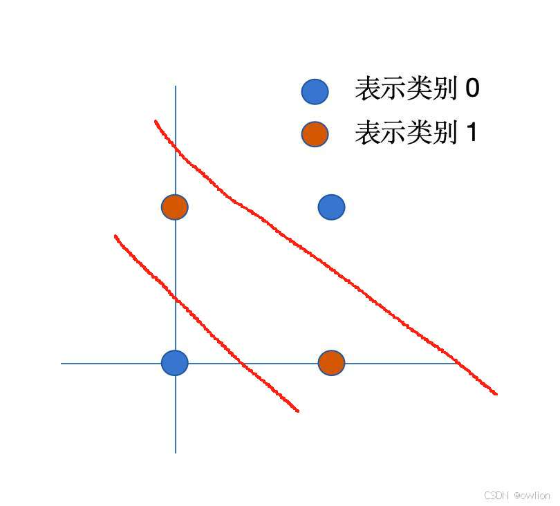

**下面那条红线**左下方的点是正类”。
**上面那条红线**右上方的点是正类”。

就这样，正类的被我们分好了， 剩下的都是负类。
可问题是，我们写函数不可能写出上面那种自然语言，或者还if else 

那我们怎么表达这个思想？
难道直接相加吗？
当然不行 加完之后 俩条线会并为一条线  啥用没有

激活函数登场
我们先用ReLU    $h=max(0,z)$ 
我们规定z就是线性模型。
下面的红线是z1 上面的红线是z2

 $h_1$ 的操作
*   $z_1 = x_1 + x_2 - 0.5$
*   $h_1 = \text{ReLU}(z_1)$
    *   在左下角 $(0,0)$，$z_1 = -0.5$，**$h_1$ 被强行变成 0**。
    *   在中间区域和右上角，$z_1 > 0$，**$h_1$ 有值（正数）**。
    *   **逻辑含义：** “只要你在直线 A 的右上方，我就是 1（或正数），否则我是 0”。

 $h_2$ 的操作（模拟 "<= 1.5"）
*   $z_2 = -x_1 - x_2 + 1.5$
*   $h_2 = \text{ReLU}(z_2)$
    *   在右上角 $(1,1)$，$z_2 = -0.5$，**$h_2$ 被强行变成 0**。
    *   在中间区域和左下角，$z_2 > 0$，**$h_2$ 有值（正数）**。
    *   **逻辑含义：** “只要你在直线 B 的左下方，我就是 1（或正数），否则我是 0”。

输出层把这俩加起来：$y = h_1 + h_2$。
*   **左下角 (0,0)：** $h_1=0$ (被ReLU砍了), $h_2=正$。总分低。
*   **右上角 (1,1)：** $h_1=正$, $h_2=0$ (被ReLU砍了)。总分低。
*   **中间区域 (0,1) 或 (1,0)：** $h_1=正$, $h_2=正$。**俩都没被砍！总分极高！**

所以我们能靠输出的分，分类了
因为 ReLU 把负值强行归零了，这就是“非线性”的功能
然后我们就可以靠“分数”分类

现在我们把 ReLU 换成 **Sigmoid**试试  
$$ \sigma(z) = \frac{1}{1+e^{-z}} $$

给出一个 0 到 1 之间的平滑分数。

 $h_1$ ：

*   它说：“在红线附近，我是 0.5；往右一点，我是 0.6, 0.7...；往左一点，我是 0.4, 0.3...”。

 $h_2$ 
-   同理，

当我们把这两个“坡”加在一起时：$y = \sigma(z_1) + \sigma(z_2)$。

可以看到 其实和ReLU是类似的
主要区别就是，单图来说它在红线附近是模糊的（0.5左右）
叠加后也是 边缘是非常**圆润、模糊**的。不像 ReLU 那样有棱有角。

总之，我们引入非线性函数 然后叠加非线性函数
真的实现了我们刚才随手画的这俩条线

反而单纯使用线性函数表示，是无法画出这样图的。

*注：我最开始对激活函数的误解是，以为他们能画出下面这种弯曲的图：
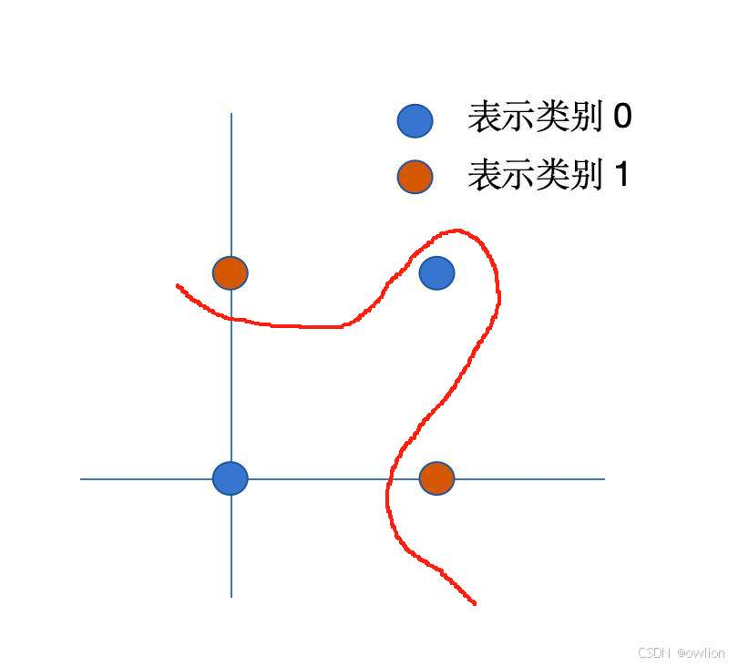

*如果用俩个h(z)，根本画不出这种线 而且这种线也不好（看起来就是那种经典过拟合曲线）  。 是的，其实多个h(z)，是有可能的，分数叠加更复杂，或者理解为模型更复杂。
但真正好的线条就是刚才举例的那种 看似有“俩条线” 的图。而我们叠加线性模型根本做不到 。而线性模型叠加了激活函数这个非线性的因素 再相加 反而真的能产出这种图，完美分类*

## 进化后的感知机--神经元

我们刚刚看到了，在线性模型输出之后，加入一个非线性函数（后面统称激活函数），就能如此厉害  拟合复杂的曲线 完成复杂的任务。

那我们一个经典的线性模型，就是上一章线性模型学过的“感知机”，
我们直接在它的输出上，挑一个激活函数应用，
把他们做一个整体，
我们就把他称作“神经元”

因为我们看到 ， 单个神经元还是趋向于线性分类

而多个“神经元”相加 才能产生神奇的化学反应，
像人类大脑一样，   

我们便把多个神经元组合的架构，称为”神经网络“
”神经元“，便为神经网络的基本单位。

不过我们仍常常称perceptron”感知机“
但我们知道 在神经网络的语境中 它和线性模型感知机的区别只是多了个激活函数

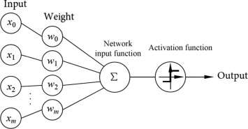

- inputs:接收来自外部的数据或上一层神经元的数据
- weights：
	- 作用：调节每个输入信号的重要性
	- 原理：输入的权重越大，该输入对结果的影响越大。它是神经网络通过训练主要学习的参数。
- bias：
	- 作用：调整激活的阈值
	- 原理：类似线性方程中的截距b，它允许激活函数左右平移，还能控制神经元被激活的阈值。
- Weighted Sum,线性加权求和, $z = \sum w_i x_i + b$ 
	- **作用：** 将所有输入信号进行汇总。
 - **Activation Function (激活函数, $\sigma(\cdot)$):**
    *   **作用：** **引入非线性因素**。
    *   **原理：** 如果没有它，无论网络有多少层，最终都只是一个线性模型，无法解决复杂问题（如异或问题 XOR）。

公式表达：
$a = \sigma(z) = \sigma(w^T x + b)$
*   $z$: 线性加权和（Linear Logits）。
*   $\sigma$: 非线性激活函数 (Sigmoid, ReLU, Tanh)。
*   $a$: 激活值 (Activation) / 输出信号。

这里，我就要引入”检测特征“这个概念
一个神经元就是一个“特征检测器”**。
*   比如在 XOR 问题里，神经元 $h_1$ 检测“是否在左下角”，神经元 $h_2$ 检测“是否在右上角”。
*   **激活了 (输出高分)** = **检测到了该特征**。

我们也看到了，最终特征组合 会产生拍案叫绝的好效果。

### 附：常见的激活函数

  Sigmoid
*   **公式：** $f(x) = \frac{1}{1+e^{-x}}$
*   **特点：** 将输出压缩到 **(0, 1)** 之间。
*   **缺点：** 容易导致**梯度消失 (Gradient Vanishing)**；输出不是以 0 为中心的。
*   **适用：** 二分类问题的输出层（表示概率）。
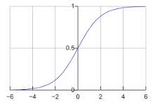
Tanh (双曲正切)
*   **公式：**$tanh(x) = (e^x - e^-x) / (e^x + e^-x)$
*   **特点：** 将输出压缩到 **(-1, 1)** 之间。
*   **优点：** 输出是以 0 为中心的 (Zero-centered)，通常比 Sigmoid 收敛快。
*   **缺点：** 依然存在梯度消失问题。

  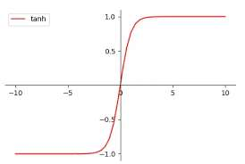

ReLU 
*   **公式：** $f(x) = \max(0, x)$
 $x>0$ 时直接输出 $x$，$x\le0$ 时输出 0。现代深度学习最常用的函数，计算快且解决了梯度消失，常用于隐藏层。

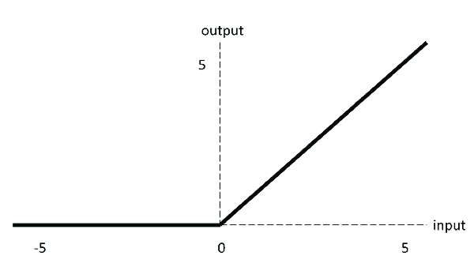

## 多层感知机的诞生

很自然，我们要用，多个个激活函数的感知机，
至于怎么组织，我们称其为多层感知机，就是”神经网络“

下面来看它的架构：
其中，hiddenlayer中的一个圆圈，就是上面的perceptron 
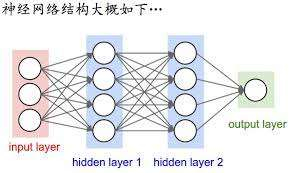
1.  **输入层：** 负责接收原始数据，维度匹配特征数。不进行计算
2.  **隐藏层：** 负责特征提取。通过权重 ($W$) 和偏置 ($b$) 的线性变换，加上激活函数 ($\sigma$) 的非线性变换，学习数据的复杂模式。层数越多，提取的特征越抽象。
	*   **浅层隐藏层：** 提取低级特征（如：画条直线 分出了左下角的那个点是正）。
    *   **深层隐藏层：** 将低级特征组合成高级特征（如：我们把sigmoid函数相加的那个图，在XOR问题中这就是最终输出层了，但更复杂的问题中，我们仍可以把它当作特征，继续跟其他感知机的结果叠加、组合）
3.  **输出层：** 负责输出最终预测，其大小和激活函数取决于具体任务（如分类或回归）。
4.  **连接方式：** 在全连接网络中，相邻层之间的神经元两两相连，数据从输入单向流动到输出。

*   **公式化描述（前向传播 Forward Propagation）：**
    *   第一层：$H = \sigma(W_1 X + b_1)$
    *   第二层：$Y = \text{Softmax}(W_2 H + b_2)$
    *   *注：这里 $W_1$ 是矩阵，因为它包含了多个神经元的权重。*

# 神经网络数据的流动

## 前向传播
刚才看到了神经网络的架构，现在我们走一遍数据，看看到底怎么组合特征的

以本图为例
注意，x不是数据，而是特征
我们看到，对于一个数据$\boldsymbol x$ 有D个特征， 1个偏置项，我们称x0（一般我们初始化为1）
此神经网络只有一个隐藏层  共M个神经元。
现在，我们视角缩小，
来到”第M个神经元“ $z_M$ 的视角。

如文章前面讲的，$z_M$要做的，首先是$\sum_{i=0}^{D}w_i x_i$   （我们不用 $\sum w_i x_i + b$ 因为把偏置项也算作x）   
显然，我们可以用向量点积来表示这个过程
$[w0,w1,w2....,w_u] \cdot \begin{bmatrix}x_0 \\x_1 \\x_2\\...\\x_i\end{bmatrix}$
可以理解为， 对于本神经元，在使用特征时，对每个特征的关注程度都不同。

然后再套用激活函数。  这就是$z_{M}$ 的输出  很简单。

很好，那么，现在有M个神经元，   
他们都要首先去做$\sum_{i=0}^{D}w_i x_i$   每一个神经元都要这样做$[w0,w1,w2....,w_u] \cdot \begin{bmatrix}x_0 \\x_1 \\x_2\\...\\x_i\end{bmatrix}$
很巧的是，在数学里，我们一个矩阵，就能解决
$$
\begin{bmatrix}
z_1 \\
z_2 \\
\vdots \\
z_M
\end{bmatrix}
=
\begin{bmatrix}
w_{1,0} & w_{1,1} & \cdots & w_{1,D} \\
w_{2,0} & w_{2,1} & \cdots & w_{2,D} \\
\vdots & \vdots & \ddots & \vdots \\
w_{M,0} & w_{M,1} & \cdots & w_{M,D}
\end{bmatrix}
\cdot
\begin{bmatrix}
x_0 \\
x_1 \\
\vdots \\
x_D
\end{bmatrix}
$$

显然，这个矩阵，**有M行**，因为共有M个神经元， 
**有D+1列** ，因为输入的数据特征共有D+1个（因为包含偏置项）.

我们便做到了这么多的神经元，同时对特征进行第一次提取。

现在有趣的就是接下来，

接下来无论隐藏层是到输出层，还是在其他情况下可能到下一层隐藏层
我们都是**拿隐藏层的输出，当作单纯的特征，再次进行组合**，
对他们加权相加，代表关注哪些特定的组合  
然后激活函数 代表对这些组合 再次进行组合，
其实这个架构  就相当于  ”**构造特征**“  

比如我们文章开头讲的，我们为了创造复杂曲线会手动构造 $x_{1}^3,x_{1}x_{2}$ 这种特征， 然而神经网络中， 我们就自动的选择性构建， 比如经过三次组合，组合出了$x_{1}^3$   后面效果不好咋办 权重降低   或者让浅层的隐藏层另提取其他特征  ... 我们有无穷无尽的变化！

最后一点，就是关于输出层
其实 输出层，就是可以理解为最后一个隐藏层，没有任何区别
为什么叫输出层呢 核心就是输出层的激活函数，是为了最终的task服务的，往往和之前的激活函数不同。

 A. 回归任务 (Regression)
*   **目标：** 预测一个连续数值（如房价、气温）。
*   **输出层激活函数：**
    *   **Identity (恒等映射):** 即 $f(z) = z$（也就是不加激活函数）。输出范围 $(-\infty, +\infty)$。
    *   **ReLU:** 如果你确定输出必须是正数（如房价），可以用 ReLU。
*   **Softmax?** **绝对不用。** Softmax 会把输出强行压缩并归一化到 $[0, 1]$ 且和为 1，这会破坏连续数值预测的尺度。

B. 二分类任务 (Binary Classification)
*   **目标：** 是/否。
*   **输出层激活函数：** **Sigmoid**。
*   **输出节点数：** 1个（输出概率 $p$）。

C. 多分类任务 (Multi-class Classification)
*   **目标：** 猫/狗/鸟（互斥）。
*   **输出层激活函数：** **Softmax**。
*   **输出节点数：** $K$个（对应 $K$ 个类别）。

### 符号化
定义：
 $\boldsymbol{w}^{(1)}$ ：**(M, D+1)**   第一个矩阵
 $\boldsymbol{w}^{(2)}$ ：**(K, M+1)**    第二个矩阵

我们可以给出本例中的前向传递函数
假设激活函数我们全用sigmoid  $\sigma$ 特指 Sigmoid。

1.  $\boldsymbol{z}^{(1)} = \boldsymbol{w}^{(1)} \cdot \begin{bmatrix} 1 \\ \boldsymbol{x} \end{bmatrix}$
2.  $\boldsymbol{a}^{(1)} = \sigma(\boldsymbol{z}^{(1)})$
3.  $\boldsymbol{z}^{(2)} = \boldsymbol{w}^{(2)} \cdot \begin{bmatrix} 1 \\ \boldsymbol{a}^{(1)} \end{bmatrix}$
4.  $\boldsymbol{y} = \sigma(\boldsymbol{z}^{(2)})$
$$ \boldsymbol{y} = \sigma \left( \boldsymbol{w}^{(2)} \cdot \begin{bmatrix} 1 \\ \sigma \left( \boldsymbol{w}^{(1)} \cdot \begin{bmatrix} 1 \\ \boldsymbol{x} \end{bmatrix} \right) \end{bmatrix} \right) $$

若求和形式：
$$ y_k = \sigma \left( w_{k0}^{(2)} + \sum_{m=1}^{M} \left[ w_{km}^{(2)} \cdot \sigma \left( \sum_{d=0}^{D} w_{md}^{(1)} x_d \right) \right] \right) $$

在真实的情况中，一般隐藏层的激活函数是ReLU，输出的激活函数是softmax ，然后我们使用$\tilde{x}$ 表示偏置的输入)
$$ \boldsymbol{y} = \text{Softmax} \left( \boldsymbol{W}^{(2)} \cdot \left[ \begin{matrix} 1 \\ \text{ReLU}(\boldsymbol{W}^{(1)}\boldsymbol{\tilde{x}}) \end{matrix} \right] \right) $$

## 反向传播

数据如何前向传播我们明白了。
但这些W里具体的权重，怎么来的呢？
最开始，我们是**随机初始化**

然后，我们要通过训练数据，通过梯度下降法更新参数。

基于神经网络的架构，我们的参数很多的，并且是一层一层的，   
假如我们要对第一层激活函数的某个权重进行更新，我们需要知道它的梯度，
按照链式法则，$\frac{dy}{dx} = \frac{dy}{du} \cdot \frac{du}{dx}$ 我们需要一连串的梯度。  

为了避免大量重复的计算，我们使用“反向传播”:

反向传播，即使用链式法则，把每一层权重当前的梯度记录下来。
我认为，就单纯只是计算，记录这个动作。
这样其他权重也能用的上记录值，就这样层层向前溯源。
完整流程：
1. 前向传播，逐层记录输入值z、激活值a，直到计算最后一层$a^{(L)}$
2. 计算输出层L误差
3. 从L-1层开始，逐层反向计算每一隐藏层的误差项。第l层的误差是根据l+1层误差和连接这俩层的权重计算出来的。
4. 根据各层误差项和前向传播时存储的激活值，计算出代价函数对每一层权重的梯度
5. 
前向传播和反向传播都是逐层做矩阵乘法和一些逐元素计算，复杂度为$O(N)$

而用数值差分，老老实实算的话，每计算一次参数的梯度，都要进行一次O(N)的前向传播，因此总计算复杂度为$O(N^2)$

反向传播本身只负责计算梯度，得到梯度后，用于梯度下降算法中更新参数。更新是用$w_{new} = w_{old} - learingrate × 梯度$ 。 偏置项同理

梯度下降算好理解，如果觉得理解不透彻，详细讲解：
https://www.zhihu.com/question/305638940/answer/1982495132231169707
其方法主要有BGD、SGD、mini-batchGD  

所以，反向传播是**计算梯度**的；链式法则**指导反向传播**“如何计算” ，是计算梯度的数学基础； 梯度下降是拿着反向传播计算的梯度，**更新参数**的

### 计算

基于上面的例子，我们来求下第一层网络参数的导数 $\frac{\partial y_k}{\partial w_{md}^{(1)}}$， 
$w_{md}^{(1)}$ 意思是，第一个(M,D+1)矩阵的一个权重  它是第m个神经元，对第d个特征的关注度（权重）

基于sigmoid函数的导数的特点，有以下式子（帮我转好看的markdown）
*   $\frac{\partial y_k}{\partial z_k^{(2)}} = y_k(1-y_k)$
*   $\frac{\partial z_k^{(2)}}{\partial a_m^{(1)}} = w_{km}^{(2)}$
*   $\frac{\partial a_m^{(1)}}{\partial z_m^{(1)}} = a_m^{(1)}(1-a_m^{(1)})$
*   $\frac{\partial z_m^{(1)}}{\partial w_{md}^{(1)}} = x_d$

那么 $\frac{\partial y_k}{\partial w_{md}^{(1)}}$ 究竟是什么呢？ 

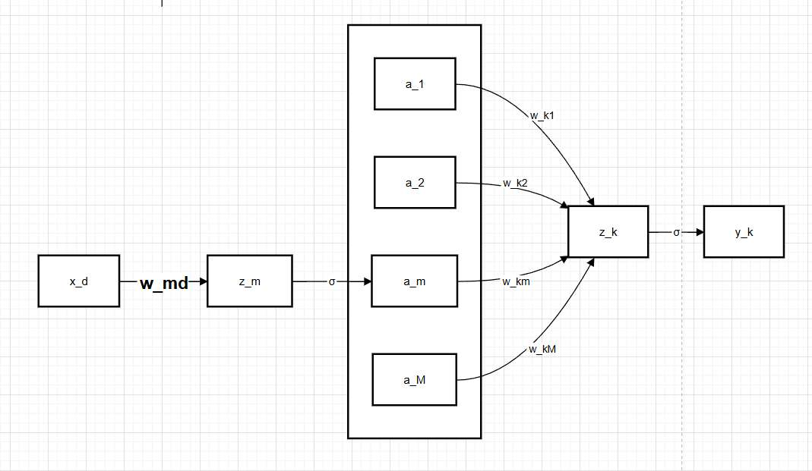

我们要的是zk
所以最终结果为
$$ \frac{\partial y_k}{\partial w_{md}^{(1)}} =  {\left( y_k(1-y_k) \right)} \cdot {\left( w_{km}^{(2)} \right)} \cdot {\left( a_m^{(1)}(1-a_m^{(1)}) \right)} \cdot {\left( x_d \right)} $$
可见这个链式法则 每部分就只有一个参数 所以直接全乘起来。
$$ \frac{\partial y_k}{\partial w_{md}^{(1)}} =  \underbrace{y_k(1-y_k)}_{\text{输出层导数}} \cdot \underbrace{w_{km}^{(2)}}_{\text{连接权重}} \cdot \underbrace{a_m^{(1)}(1-a_m^{(1)})}_{\text{隐层导数}} \cdot \underbrace{x_d}_{\text{输入}} $$
这计算的是，“如果我们改变隐藏层的一个权重 $w_{md}$，它会对第 $k$ 个输出单元 $y_k$ 产生多大影响”

不过，
我们往往，都用的是，求误差 $E$对w_md的参数

对比一下，非常清晰
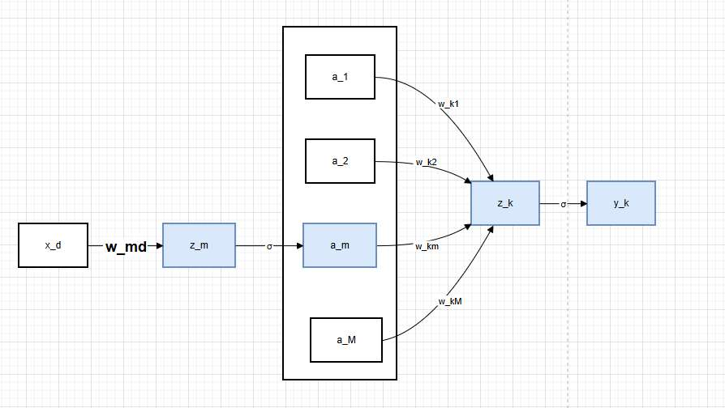

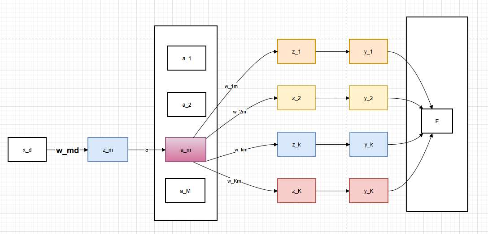

观察 **$a_m$ (粉色方块)** 发出的箭头。
*   $a_m$ 不仅仅连接到 $z_k$，它连接到了 **所有的** 下一层神经元 ($z_1, z_2, \dots, z_K$)。
*   因此，改变 $w_{md}^{(1)}$，会改变 $a_m$，进而**同时影响所有的输出** $y_1, \dots, y_K$，最终通过多条路径影响总误差 $E$。

**所以，必须加上求和符号 $\sum$！这是BP算法最核心的步骤。**

令总误差为 $E$（比如 MSE: $E = \frac{1}{2}\sum (y_k - t_k)^2$）。

**完整公式：**

$$ \frac{\partial E}{\partial w_{md}^{(1)}} = \left( \sum_{k=1}^{K} \frac{\partial E}{\partial z_k^{(2)}} \cdot \frac{\partial z_k^{(2)}}{\partial a_m^{(1)}} \right) \cdot \frac{\partial a_m^{(1)}}{\partial z_m^{(1)}} \cdot \frac{\partial z_m^{(1)}}{\partial w_{md}^{(1)}} $$

我们定义**输出层**（第2层）第 $k$ 个神经元的“误差项”为 $\delta_k^{(2)}$：
$$ \delta_k^{(2)} \equiv \frac{\partial E}{\partial z_k^{(2)}} $$
*   如果是 MSE + Sigmoid，则 $\delta_k^{(2)} = (y_k - t_k) \cdot y_k(1-y_k)$。
*   如果是 Cross-Entropy + Sigmoid/Softmax，则 $\delta_k^{(2)} = y_k - t_k$。

然后再看这一层
$$ \sum_{k=1}^{K} \frac{\partial E}{\partial z_k^{(2)}} \cdot \frac{\partial z_k^{(2)}}{\partial a_m^{(1)}} $$
*   代入 $\delta_k^{(2)}$。
*   我们知道 $z_k^{(2)} = \sum_{j} w_{kj}^{(2)} a_j^{(1)} + b_k$。所以 $\frac{\partial z_k^{(2)}}{\partial a_m^{(1)}}$ 就是连接隐层节点 $m$ 和输出节点 $k$ 的权重 **$w_{km}^{(2)}$**。

于是，括号里的内容变为：
$$ \sum_{k=1}^{K} \delta_k^{(2)} \cdot w_{km}^{(2)} $$
**物理意义：** 这是将输出层的误差，沿着权重“反向加权求和”，传回到隐层节点 $m$。

接下来看公式的后半部分：
*   $\frac{\partial a_m^{(1)}}{\partial z_m^{(1)}}$：这是隐层激活函数的导数，记为 $\sigma'(z_m^{(1)})$。
*   $\frac{\partial z_m^{(1)}}{\partial w_{md}^{(1)}}$：这是输入特征，即 $x_d$。

$$ \frac{\partial E}{\partial w_{md}^{(1)}} = \underbrace{ x_d }_{\text{输入}} \cdot \underbrace{ \sigma'(z_m^{(1)}) }_{\text{隐层激活导数}} \cdot \underbrace{ \left( \sum_{k=1}^{K} \delta_k^{(2)} \cdot w_{km}^{(2)} \right) }_{\text{回传的总误差}} $$

通常，我们会定义 **隐层误差项 $\delta_m^{(1)}$** 来简化记忆：
$$ \delta_m^{(1)} = \sigma'(z_m^{(1)}) \cdot \sum_{k=1}^{K} \delta_k^{(2)} w_{km}^{(2)} $$

那么最终梯度公式就变得非常简洁（形式上和输出层一样）：
$$ \frac{\partial E}{\partial w_{md}^{(1)}} = \delta_m^{(1)} \cdot x_d $$

###  损失函数的“特殊技巧” 

如果是交叉熵损失函数 还有特殊技巧

如果 MSE + Sigmoid，
$E = \frac{1}{2}(y-t)^2$，激活是 Sigmoid $\sigma(z)$。
对 $z$ 求导（误差项 $\delta$）：
$$ \frac{\partial E}{\partial z} = (y-t) \cdot \sigma'(z) = (y-t) \cdot y(1-y) $$

 当 $y$ 接近 0 或 1 时，$y(1-y)$ 会趋近于 0。这会导致 **梯度消失**，误差传不回来，学习停滞。

如果使用 **交叉熵损失 (Cross-Entropy)** 配合 **Sigmoid** (二分类) 或 **Softmax** (多分类)。

有趣的是，交叉熵的导数，恰好抵消了 Sigmoid/Softmax 导数里的分母。
最终的误差项 $\delta$ 变得极其简单：

$$ \frac{\partial E}{\partial z_k} = y_k - t_k $$
*(其中 $y_k$ 是预测值，$t_k$ 是真实标签)*

**对比：**
*   **MSE:** $(y-t) \cdot y(1-y)$
*   **Cross-Entropy:** $(y-t)$

使用交叉熵损失函数，梯度的计算**不再包含导数项 $y(1-y)$**。
这意味着，即使预测值 $y$ 错得很离谱（接近0或1），梯度依然保持为 $(y-t)$（线性），**梯度不会消失，模型能快速纠正错误**。这就是为什么分类问题首选交叉熵的原因。

# 设计一个神经网络

我们用设计一个小的神经网络，来最后回顾一下神经网络的魅力。

手工构造一个可以求解“异或”分类问题的神经网络。

将异或拆解为 或 与 与非
x1 XOR x2 = (x1 OR x2) AND (x1 NAND x2)
使用一个简单的**阶跃函数**作为激活函数，规则是：**如果 z >= 0, 输出 1; 否则输出 0。

我们知道，每个神经元都是$Wx+b$的形式，我们如此设计权重和编制

**神经元 h1 (OR):** $x_1 + x_2 - 0.5$
*   (0,0) -> -0.5 (0)
*   (0,1) -> 0.5 (1)
*   (1,0) -> 0.5 (1)
*   (1,1) -> 1.5 (1)
*   **结果：** 0, 1, 1, 1。 **OR**。

**神经元 h2 (NAND):** $-x_1 - x_2 + 1.5$
*   (0,0) -> 1.5 (1)
*   (0,1) -> 0.5 (1)
*   (1,0) -> 0.5 (1)
*   (1,1) -> -0.5 (0)
*   **结果：** 1, 1, 1, 0。 **NAND**。

**输出层 y (AND):** $h_1 + h_2 - 1.5$
*   输入 (0,0) -> h1=0, h2=1 -> Sum=1-1.5=-0.5 -> **0**
*   输入 (0,1) -> h1=1, h2=1 -> Sum=2-1.5=0.5 -> **1**
*   输入 (1,0) -> h1=1, h2=1 -> Sum=2-1.5=0.5 -> **1**
*   输入 (1,1) -> h1=1, h2=0 -> Sum=1-1.5=-0.5 -> **0**
*   **最终结果：** 0, 1, 1, 0。 **XOR**。

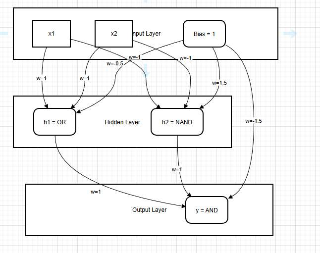
上述推导证明了，只要权重设置得当，多层感知机（MLP）确实有能力解决线性不可分的 XOR 问题。这里的核心在于隐藏层将原始空间（x1, x2）映射到了新的特征空间（h1, h2）

我们手工推导使用了“阶跃函数”。但在实际训练中，阶跃函数导数为0（或不可导），无法使用梯度下降 (BP算法)。

在实际应用中，我们不知道具体需要什么逻辑门（OR还是NAND）。我们只需定义网络结构（如2个隐层神经元）并选择可导的激活函数（如ReLU/Sigmoid），然后初始化随机权重。通过 **反向传播算法**，神经网络会自动把参数优化成类似上述功能的配置。

# 工程与训练
基本定义：
*   **Epoch (轮):** 所有训练样本都输入网络训练了一次。
*   **Batch Size (批大小):** 每次更新参数时使用的样本数量。
    *   *老师考点：* 为什么不一次性用所有数据 (Full Batch)？ $\rightarrow$ 内存装不下，且收敛慢（陷入鞍点）。为什么不用 1 个数据 (SGD)？ $\rightarrow$ 震荡太大，无法利用矩阵并行计算优势。
*   **Iteration (迭代):** 更新一次参数的动作。
    *   关系：$1 \text{ Epoch} = (\text{Total Data} / \text{Batch Size}) \text{ Iterations}$

####  显存

显存，指模型前向传播与反向传播时，GPU上存储的数据
 = 参数 + 梯度 + 激活值 + 优化器状态。

$$ \text{Total VRAM} \approx \text{Model Parameters} + \text{Gradients} + \text{Optimizer States} + \mathbf{Activations} $$
*   **静态占用：** 模型参数 (Weights)。   
*   **动态占用 (大头)：** **中间层的激活值 (Activations)**。
    *   *关键逻辑：* 为了进行反向传播 (BP)，我们必须在前向传播时把每一层的输出 $a^{(l)}$ 存下来（链式法则要用）。
    *   **Batch Size 翻倍 $\approx$ 显存占用翻倍**（因为存的激活值翻倍了）。

还有个Optimizer States (优化器状态(优化器是啥见我那个梯度下降讲解))**，没学，但也很重要**
*   **为什么要存？**
    *   如果用最简单的 **SGD** ($w \leftarrow w - \alpha \cdot g$)，不需要额外存状态。
    *   但现代深度学习基本都用 **Adam** 或 **Momentum SGD**。
    *   **Adam** 需要记住两个历史信息：
        1.  过去的梯度去哪了（一阶动量 $m$, Momentum）。
        2.  过去的梯度波动大不大（二阶动量 $v$, Variance）。
*   **占多少地？**
    *   对于每一个参数 $w$，Adam 都要维护一个 $m$ 和一个 $v$。
    *   所以，**优化器状态的显存占用 $\approx$ 模型参数量的 2 倍！
   

拿我们刚才分析很久的那个只有一层隐藏层的神经网络，分析一下显存

假设数据类型是 **float32**（一个数占 **4 Bytes**）。

**设定：**
*   **Batch Size ($B$):** 64
*   **输入特征 ($D$):** 1024
*   **隐藏层 ($M$):** 512
*   **输出层 ($K$):** 10

**A. 静态占用 (与 Batch Size 无关)**
1.  **模型参数 (Parameters):**
    *   $W^{(1)}$: $512 \times 1024$
    *   $W^{(2)}$: $10 \times 512$
    *   Bias 忽略不计。
    *   总参数量 $P \approx 512 \times 1024 = 524,288$。
    *   显存：$524k \times 4B \approx \mathbf{2 MB}$。
2.  **梯度 (Gradients):**
    *   和参数量一样。 $\approx \mathbf{2 MB}$。
3.  **优化器状态 (Adam States):**
    *   $2 \times$ 参数量。 $\approx \mathbf{4 MB}$。

**B. 动态占用 (激活值 Activations, 与 Batch Size 成正比)**
为了反向传播，每一层的前向计算结果必须存在显存里，不能扔！
1.  **输入层存储:** $B \times D = 64 \times 1024 = 65,536$ 个数。
2.  **隐藏层存储:** $B \times M = 64 \times 512 = 32,768$ 个数。
3.  **输出层存储:** $B \times K = 64 \times 10 = 640$ 个数。
*   总激活值数量 $\approx 10万$。
*   显存：$100k \times 4B \approx \mathbf{0.4 MB}$。

在这个小模型里，参数占主导。但如果是深层网络（比如 100 层），激活值的显存 = $100 \times B \times \text{Width}$，此时 **Batch Size 翻倍，显存真的会爆炸**。

#### 显存不够了怎么处理？ 
1.  **减小 Batch Size:** 最直接，但可能影响 Batch Normalization 的效果。
2.  **梯度累积 (Gradient Accumulation):**
    *   比如你想用 Batch=64，但显存只能跑 16。
    *   那就跑 4 次 16，不更新参数，只是把梯度加起来。加够了 64 份的梯度，再更新一次参数。
    *   *效果：* 时间换空间。
3.  **混合精度训练 (Mixed Precision / FP16):**
    *   把 float32 换成 float16，显存减半，计算加速。
4.  **梯度检查点 (Gradient Checkpointing):**
    *   不存中间层激活值。反向传播需要用到某一层时，**重新计算**一遍前向传播。
    *   *效果：* 巨幅节省显存（空间换时间）。

# CNN

### 动机
卷积神经网络 (CNN) 用于计算机视觉领域
我们输入的数据是图片，假设图片是 $1000 \times 1000$ 像素，则输入向量 $x$ 特征为1,000,000
即向量 $x$ 维度是 1,000,000。

如果我们正常用MLP   一般隐藏层会有很多神经元，不然模型太简单了。
如果隐藏层有 1000 个神经元。全连接层参数量 $W$ = $10^6 \times 10^3 = 10^9$ (10亿个参数)。
显存瞬间爆炸，且极易过拟合。更重要的是，MLP 把图片拉成一条长线，破坏了像素之间上下左右的邻域关系。

我们需要一个更好的读取图片的方式

### 架构

卷积神经网络的一个隐藏层 不同于多层感知机那样“一列神经元”
它是有高度、宽度、深度
深度对应“通道（Channels）”
比如RGB就是三个通道 也就是  我们分析图片的Red， 分析图片的G、分析图片的B 才算完成图片的分析。

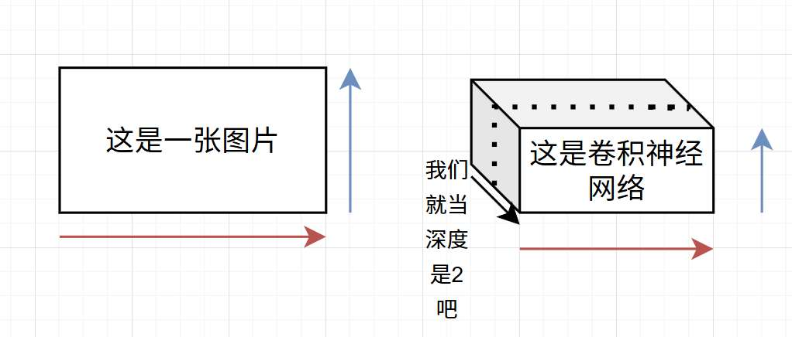

*   这个盒子里的**每一个小方块，本质上就是一个神经元！**
*   **MLP 的神经元：** 排成一列长队。
*   **CNN 的神经元：** 排成一个立方体。

然后 深度=1时看的这个切片，和图片完全一样的一群数，就是隐藏层

可以看到本例中卷积神经网络，其隐藏层的长和宽，比实际图片小。

其实类比MLP也能理解， 在之前的例子中，那不就是神经元K的个数设置的比数据X的特征D少吗，没什么。 这是我们可以设置的。

但为什么往往是小，而不是大呢？

现在最关键的地方来了，
卷积神经网络中，每个神经元，它的输出是什么呢？
在MLP中，我们是$h = \sigma(W \cdot x)$。

在 CNN 里，逻辑完全一样

我们用卷积核的处理，来表示对x的处理 其实很类似

卷积核的长与宽小于图像的，每个位置都有权重， 
它在图像上移动，移动到的位置 
让权重和位置的像素加权， 求和  得到这一部分的卷积结果

比如滑到左上角，算出一个值 $\to$ 这是隐藏层左上角的神经元激活值。  
滑到右下角，算出一个值 $\to$ 这是隐藏层右下角的神经元激活值。

因为用的是**同一个卷积核**（权值共享），所以这一层切片上的所有神经元，用的都是**同一组权重**，只是看的**位置不同**。

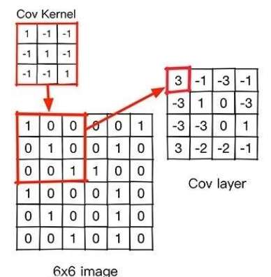

如图，最终得到的卷积结果  这个Cov layer完全不等于原图片的大小 

所以理解了卷积的原理，就很好理解其隐藏层小于图片尺寸这个现象。

## 计算

卷积核大小就是卷积核的高乘宽，和图像无关！  步长、填充 都取决于“将卷积过程应用在实际图片的流程”
卷积核个数就是深度吧 
卷积核大小 ($F$), 步长 ($S$), 填充 ($P$), 卷积核个数 ($K$)。
    *   **输出尺寸公式 :**
        $$ \text{Output Size} = \frac{N - F + 2P}{S} + 1 $$
        *(其中 $N$ 是输入尺寸，向下取整)*
    *   **参数量计算:**
        $$ \text{Params} = K \times (F \times F \times C_{in}) + K $$
        为啥？？？
        *(注意：与输入图片大小 $N$ 无关！只和核大小及通道数有关)

*   **局部感知 (Local Perception / Receptive Field):**
    *   人看东西不是盯着像素看，而是看局部区域（眼睛、鼻子）。
    *   每个神经元只连接图片的一小块区域。
*   **权值共享 (Weight Sharing):**
    *   *关键理解：* 检测“边缘”的那个过滤器（卷积核），在图片的左上角好用，在右下角也好用。
    *   所以，**全图共用同一个卷积核**。
    *   *效果：* 参数量从“百万级”直接降到“几十个”。

*   **池化层 (Pooling Layer):** 降维，抗干扰。
    *   Max Pooling (取最大) / Average Pooling (取平均)。
    *   **作用：** 减小特征图尺寸（降维），带来**平移不变性 (Translation Invariance)**（稍微移一点位置，最大值还是它）。
    *   *注意：* 池化层通常**没有参数**。

*   **全连接层 (FC):**
    *   放在最后，负责把提取的特征拉直，进行分类（Softmax）。

---