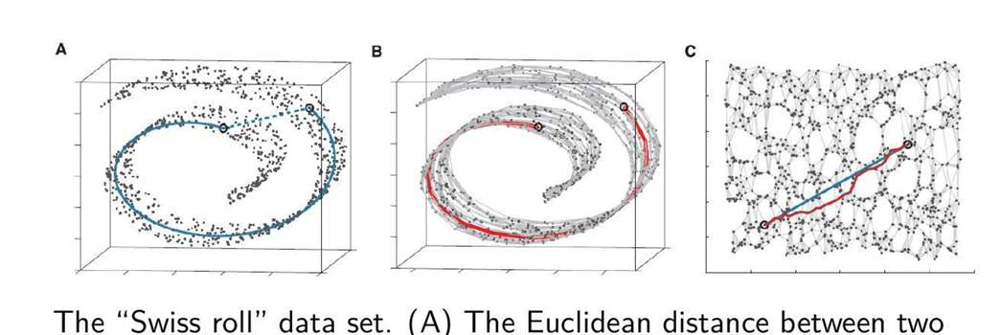
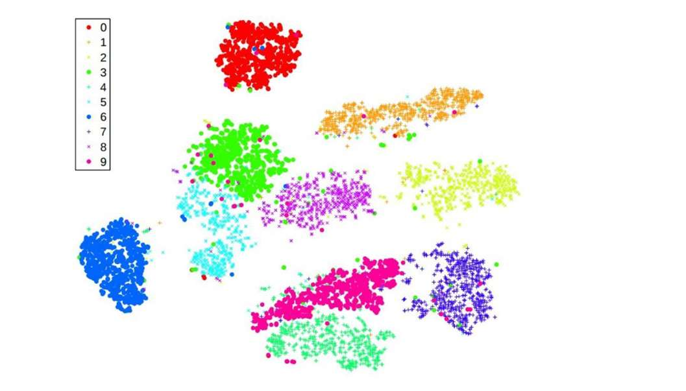

本次笔记，“降维”部分老师根本没画重点，不用太认真

重点阅读**计算学习理论与生成式模型**

- **Haussker Theorem公式及其含义**
- **VC维定义，新的公式及其含义**
- **计算学习理论的例题**
- **生成模型与判别模型的对比**
- **主流生成模型的对比表格（推导和含义不看，光记表格都行）**
- **降维 跟AI画的重点算了，老师都没提**

# 计算学习理论

我觉得，这章讨论的问题，主要是 讨论“用多少训练数据能训出好模型”这个事。

对于好模型的定义
我们不可能 100% 保证模型学会了真理（因为数据有限），也不可能要求模型误差为 0。我们只能要求：有很大的概率模型是非常接近正确的  这里包含俩个概念
*   **P (Probability):** 有很大的概率（信心），比如 99% 的概率 ($1-\delta$)。
*   **AC (Approximately Correct):** 模型是非常接近正确的，比如误差小于 0.02 ($\epsilon$)。
这就是PAC的定义 

故而
*   $\epsilon$ (Epsilon): 允许的误差范围（精度）。
*   $\delta$ (Delta): 失败的概率（置信度）。

那如何精准量化呢，

**数学定义**: 
*   存在某个多项式 $P(x, y, z, w)$，使得所需样本量 $m \le P(1/\epsilon, 1/\delta, n, \text{size}(c))$。
*   只要样本量 $m$ 不随着精度要求（$\epsilon$）或特征维度（$n$）呈**指数级**爆炸（比如 $2^n$），我们就说这个问题是“PAC 可学习的”。

这个多项式具体是什么呢，下面我们来推导

## **VS 的含义**
*   **VS** = **V**ersion **S**pace（版本空间）。
*   **下标 $H, D$**：表示这个空间是基于假设空间 **$H$** (Hypothesis Space) 和当前观测到的数据集 **$D$** (Data) 确定的。
$$ VS_{H,D} = \{ h \in H \mid \text{consistent}(h, D) \} $$
即：在所有可能的模型集合 $H$ 中，剔除掉那些在数据 $D$ 上判错的模型，**剩下所有能把 $D$ 全部判对的模型**组成的子集。

我们在做机器学习训练时，本质上是在做**筛选**。
1.  **初始状态：** 数据集 $D$ 为空，版本空间 $VS = H$（所有模型都有可能）。
2.  **训练过程：**
    *   来了一个数据 $(x_1, y_1)$。
    *   我们检查 $VS$ 里所有的 $h$。
    *   如果某个 $h(x_1) \neq y_1$，说明这个 $h$ 是错的，把它从 $VS$ 里**永久删除**。
    *   $VS$ 变小了。
3.  **训练结束：** 我们从剩下的 $VS$ 里随便挑一个 $h$ 作为最终模型。因为这个 $h$ 属于 $VS$，所以它在训练集上的误差必然为 **0**。

**结论：** $VS$ 的意义在于它定义了“**在训练集上表现完美的候选模型集合**”**。

##  $\epsilon$-详尽 ($\epsilon$-Exhausted)的含义
版本空间 $VS$ 里剩下的模型，虽然在训练集上全对（训练误差=0），但在未知数据上表现如何（**真实误差**）？不知道。可能里面混着一些“过拟合”的坏模型。
*   **定义：** 如果版本空间 $VS$ 里，**所有的**假设 $h$，它们的**真实误差**都小于 $\epsilon$。那就说，达到了“ $\epsilon$-详尽”
    $$ \forall h \in VS_{H,D}, \quad \text{error}_{\text{true}}(h) < \epsilon $$
*   **通俗解释：** 版本空间里已经没有“坏模型”了（坏模型指真实误差 $>\epsilon$ 的模型）。
*   **目的：** 只要版本空间达到了“$\epsilon$-详尽”的状态，那么我们随便从里面挑一个 $h$，都能保证它是“近似正确”的。

## Haussler Theorem (必背公式!)

我们想知道，至少需要多少样本 $m$，才能有 $1-\delta$ 的把握，把所有“坏模型”都从版本空间里踢出去？（即至少要多少样本让 $VS$ 变得 $\epsilon$-详尽）。

对于**有限**的假设空间 $|H|$，（还记得假设空间吗，机器学习四大要素（数据、模型/假设空间、损失函数、优化算法）） 如果我们要保证 版本空间被 $\epsilon$-详尽 的概率 $\ge 1-\delta$

所需的最小样本量 $m$ 是：

$$ m \ge \frac{1}{\epsilon} \left( \ln |H| + \ln \frac{1}{\delta} \right) $$
### 推导（不需要掌握）
#### **第一步：定义“坏模型”**
设 $h_{bad}$ 是一个真实误差大于 $\epsilon$ 的模型（即 $\text{error}_{\text{true}}(h_{bad}) > \epsilon$）。
这意味着：对于任意一个随机样本，它**预测正确**的概率小于 $1-\epsilon$。

#### **第二步：坏模型“蒙混过关”的概率**
一个坏模型 $h_{bad}$，在 **1个** 训练样本上侥幸没出错的概率是：
$$ P(\text{survive } 1) \le 1 - \epsilon $$

它在 **$m$ 个** 独立样本上全部蒙混过关（还在版本空间里）的概率是：
$$ P(\text{survive } m) \le (1 - \epsilon)^m $$

#### **第三步：考虑所有坏模型 (Union Bound / 并集界)**
假设空间 $H$ 里最多有 $|H|$ 个模型，所以坏模型最多也就 $|H|$ 个。
我们要计算：**至少有一个**坏模型在 $m$ 个样本后还留在版本空间里的概率。
根据概率论的不等式（$P(A \cup B) \le P(A) + P(B)$）：
$$ P(\exists h_{bad} \in VS) \le |H| \cdot (1 - \epsilon)^m $$

#### **第四步：数学放缩**
利用常用不等式：$1 - x \le e^{-x}$。
我们将 $(1-\epsilon)$ 替换为 $e^{-\epsilon}$：
$$ P(\exists h_{bad} \in VS) \le |H| \cdot e^{-\epsilon m} $$
*(这就是 PPT 第 15 页那个公式的由来)*

#### **第五步：设定安全界限 $\delta$ 并求解 $m$**
我们希望这个“坏模型幸存”的概率很小，小于等于 $\delta$。
$$ |H| \cdot e^{-\epsilon m} \le \delta $$

现在我们解这个不等式，求 $m$：
1.  两边除以 $|H|$：
    $$ e^{-\epsilon m} \le \frac{\delta}{|H|} $$
2.  两边取自然对数 ($\ln$)：
    $$ -\epsilon m \le \ln \left( \frac{\delta}{|H|} \right) = \ln \delta - \ln |H| $$
3.  两边除以 $-\epsilon$ (注意不等号方向改变)：
    $$ m \ge \frac{1}{\epsilon} ( \ln |H| - \ln \delta ) $$
4.  整理一下 $-\ln \delta = \ln \frac{1}{\delta}$：
    $$ m \ge \frac{1}{\epsilon} \left( \ln |H| + \ln \frac{1}{\delta} \right) $$

**证毕。**

### **总结逻辑链条**

1.  **样本量 $m$ 越大** $\to$ 模型蒙混过关的概率 $(1-\epsilon)^m$ 越小（指数级下降）。
2.  **模型总数 $|H|$ 越大** $\to$ 坏模型可能存在的数量越多，需要的 $m$ 越大（对数级增长）。
3.  公式 $m \ge \frac{1}{\epsilon} (\ln |H| + \ln \frac{1}{\delta})$ 就是在寻找一个平衡点，保证“没有任何一个坏模型能幸存下来”的概率足够高。

 如果你想从一大堆可能的模型 ($|H|$) 里挑出一个好的，你需要的数据量和 $\ln|H|$ 成正比。

其实这就是在探讨 假设空间确定的情况下 训练数据应该要多少
这就是 **“样本复杂度 (Sample Complexity)”** 的定义。

**版本空间VS**的定义并没有出现在公式 它只是出现在推导里
最终公式 $m \ge \dots$ 是为了**控制**版本空间。
 它告诉我们：只要 $m$ 满足这个数，版本空间 $VS$ 就**大概率（$1-\delta$）** 是纯净的（$\epsilon$-详尽）。

## 一些解释
*   **一致性 (Consistent):** 如果一个模型 $h$ 把手头所有的训练数据都判对了，它就是“一致的”。
*   **版本空间 ($VS_{H,D}$):** 假设空间 $H$ 里，**所有**能把当前训练数据 $D$ 全判对的假设的集合
*   **训练误差 (Training Error):** $\text{error}_{train}(h)$
    *   模型在**训练集**上做错的比例。
    *   *是我们能算出来的。*
*   **真实误差 (True Error / Generalization Error):** $\text{error}_{true}(h)$
    *   模型在**整个真实分布** $P(X)$ 上做错的概率。
    *   *是我们想知道但永远无法确切知道的（上帝视角）。*
	什么时候叫过拟合？
	当 $\text{error}_{true}(h) \gg \text{error}_{train}(h)$ 时。
*   **$|H|$:** 假设空间的大小（模型有多少种可能性）。
*   Haussler Theorem公式**物理意义：**
    *   模型越复杂 ($|H|$ 越大)，需要的数据越多。
    *   要求精度越高 ($\epsilon$ 越小)，需要的数据越多。
    *   要求越保险 ($\delta$ 越小)，需要的数据越多。

## ** 典型例题 (PPT 第 17, 19 页)**
**题目：** 假设我们的模型是深度为 2 的决策树，总共有 $|H| = 2^{2^n}$ 种可能的树（假设数值）。我想保证 99% 的概率 ($\delta=0.01$) 训练出来的模型真实误差小于 5% ($\epsilon=0.05$)。需要多少数据？

**解法：** 直接套公式。
$$ m \ge \frac{1}{0.05} (\ln |H| + \ln \frac{1}{0.01}) $$

现在我们解决了 **“有限假设空间”** 的 PAC 理论。
1.  **$H$** 是备选池。
2.  **$m$** 是为了从池子里筛出好模型所需的代价。
3.  **$VS$** 是筛选过程中剩下的模型集合。

**现在的瓶颈来了：**
Haussler 定理公式里有 **$\ln |H|$**。
如果假设空间是 **无限** 的呢？
*   比如感知机 $y = w^T x$，参数 $w$ 是实数。
*   实数有无穷多个，组合也有无穷多种 有**无穷多**种直线的画法
*   $|H| = \infty$，那么 $\ln |H| = \infty$。
*   **推论：** 需要无穷多的数据 $m$？这显然不符合常理（感知机明明可以用有限数据训练出来）。

我们需要一个新的指标来衡量“无穷多模型的复杂度”，这个指标就是 **VC 维 (Vapnik-Chervonenkis Dimension)**。

## VC维

### **核心概念：打散 (Shattering)**

要理解 VC 维，必须先理解“打散”。这是一个**博弈游戏**。

*   **场景：** 地上有 $N$ 个点。
*   **对手（上帝）：** 给这 $N$ 个点随机贴标签（正类/负类）。
    *   $N$ 个点共有 $2^N$ 种贴法（全正、全负、左正右负...）。
*   **我（模型 $H$）：** 尝试画一条线（或者用我的模型），把正负类分开。

**定义：**
如果对于这 $N$ 个点的 **所有 $2^N$ 种** 标记方式，我的模型 $H$ **都能** 找到一种参数把它们正确分开（训练误差=0），我们就说：
**模型 $H$ 能够“打散 (Shatter)” 这 $N$ 个点。**

> **通俗理解：** “打散”意味着模型对这 $N$ 个点的分类能力是**随心所欲**的，由于模型太强，它能覆盖所有可能的情况。

### **2. 核心定义：VC 维 (VC Dimension)**

**定义：**
一个假设空间 $H$ 的 **VC 维 ($VC(H)$)**，是它能打散的 **最大** 样本数量。
*   **注意逻辑（必考辨析）：**
    *   **$VC(H) = d$ 意味着：**
        1.  **存在**至少一组 $d$ 个点，能被 $H$ 打散。
        2.  **不存在**任何一组 $d+1$ 个点，能被 $H$ 打散。

#### **经典案例：2D 线性分类器（直线）**
我们来看看直线的 VC 维是多少？

1.  **N=3：能打散吗？**
    *   我们在纸上画个三角形（3个点）。
    *   不管你怎么标（全黑、全白、两黑一白...），我总能画一条直线把黑白分开。
    *   **结论：** 直线能打散 3 个点。

2.  **N=4：能打散吗？**
    *   记得 **XOR 问题** 吗？
    *   如果是 XOR 这种标法（对角线同色），直线**切不开**。
    *   虽然有些 4 个点的摆法（如排成一列）可能切得开，但只要有一种标法切不开，就不算“随心所欲”。
    *   事实上，在 2D 平面上，无论怎么摆 4 个点，总存在一种标法让直线切不开（XOR）。
    *   **结论：** 直线不能打散 4 个点。

3.  **最终结论：**
    *   能打散 3，不能打散 4。
    *   所以 **2D 直线的 VC 维 = 3**。

#### **推广结论 (选择/填空必考)：**
对于 $d$ 维空间的线性分类器（感知机）：
$$ VC(H) = d + 1 $$
*(比如 2维平面是 3，3维空间是 4)*

---

### **3. 新的样本复杂度公式 (Sample Complexity based on VC)**

既然 $|H|$ 用不了了，我们就用 $VC(H)$ 来替换它。
Haussler 定理的**升级版**（Blumer et al.）：

$$ m \ge \frac{1}{\epsilon} \left( 4 \log_2 \frac{2}{\delta} + 8 \cdot VC(H) \cdot \log_2 \frac{13}{\epsilon} \right) $$

**不用死记系数，但要记住核心关系：**
$$ m \propto \frac{VC(H)}{\epsilon} $$

*   **物理意义：**
    *   $VC(H)$ 越大 $\to$ 模型越复杂（脑容量越大） $\to$ 需要的训练数据 $m$ 越多。
    *   这解释了为什么深度学习（VC维极高）需要海量数据，而线性模型（VC维低）只需要少量数据。

---

### **第三模块复习 Check List**

1.  **什么是“打散 (Shattering)”？** (模型能对 $N$ 个点的所有 $2^N$ 种标签组合都实现 0 训练误差)。
2.  **VC 维的定义？** (能被打散的最大样本数)。
3.  **$d$ 维线性模型的 VC 维是多少？** ($d+1$)。
4.  **VC 维与样本量 $m$ 的关系？** (正比，$m \approx VC(H)$)。

---

这一章我们整理了三块基石：
1.  **PAC 框架：** 只要数据够多，大概率($1-\delta$)是近似正确($\epsilon$)的。
2.  **有限空间：** $m \propto \ln |H|$。
3.  **无限空间：** $m \propto VC(H)$。

## PPT例题
### **补丁 1：Conjunction 学习的样本复杂度例题**
*(对应 PPT 第 17 页)*

这是一个非常经典的计算题，也是理解 Haussler 定理的最佳实践。

**题目背景：**
*   **任务：** 学习一个布尔函数（比如：如果是 `Rich` AND `Healthy` AND `Happy`，那么 `Success`）。
*   **输入：** 4 个布尔变量 $X_1, X_2, X_3, X_4$ (比如 $X_1$ 代表是否 Rich)。
*   **假设空间 $H$：** 是所有可能的“合取规则 (Conjunctions)”的集合。
    *   例如：$X_1 \wedge \neg X_3$ (Rich 且 不Happy)。
    *   规则形式：每个变量可以是 **0** (False)，**1** (True)，或者 **?** (不关心/忽略)。
    *   此外，还有两种特殊情况：总是 0 (False) 和 总是 1 (True)。

**核心计算步骤（考试必考）：**

1.  **计算假设空间大小 $|H|$：**
    *   对于每个变量 $X_i$，它在规则里有 3 种状态：{0, 1, ?}。
    *   一共有 $n=4$ 个变量。
    *   所以基本的规则组合有 $3^4$ 种。
    *   加上“总是0”和“总是1”这两种特殊情况（严格来说 PPT 里简化为了 $3^n$ 附近，有时候为了简便计算，会直接说每个变量3种可能，总共 $3^n$）。
    *   **PPT 第 17 页直接给出：$|H| = 3^4$。**

2.  **设定要求：**
    *   成功率 $1-\delta = 0.99 \implies \delta = 0.01$。
    *   误差容忍度 $\epsilon = 0.05$。

3.  **套公式求 $m$：**
    $$ m \ge \frac{1}{\epsilon} \left( \ln |H| + \ln \frac{1}{\delta} \right) $$
    $$ m \ge \frac{1}{0.05} \left( \ln 3^4 + \ln \frac{1}{0.01} \right) $$
    $$ m \ge 20 \times (4 \ln 3 + \ln 100) $$
    *(计算器按一下)*
    $m \ge 20 \times (4.39 + 4.60) \approx 180$。

**结论：** 只需要 180 个样本，你就能有 99% 的把握训练出一个误差小于 5% 的规则。

---

### **补丁 2：Agnostic Learning (不可知学习)**
*(对应 PPT 第 21-24 页)*

之前的 PAC 理论有一个**巨大的假设**：
*   **假设：** 真实的目标函数 $c$ 就在我们的假设空间 $H$ 里（即 $c \in H$）。
*   **这意味着：** 我们一定能找到一个训练误差为 0 的完美模型。

**但现实很骨感：**
*   也许真实规律非常复杂（比如人脸识别），而我们用的模型很简单（比如线性分类器）。
*   **$c \notin H$**。无论怎么努力，训练误差都不可能降到 0。这叫 **Agnostic Learning (不可知学习)**。

**我们要追求什么？**
既然找不到完美的，那就找**矮子里拔将军**。
*   我们要找一个 $h$，它的真实误差和 $H$ 中**最好的那个模型**的误差非常接近。
    $$ \text{error}_{\text{true}}(h) \le \text{error}_{\text{true}}(h^*) + \epsilon $$

**样本复杂度公式 (PPT 第 21 页)：**
$$ m \ge \frac{1}{2\epsilon^2} \left( \ln |H| + \ln \frac{1}{\delta} \right) $$

*   **区别点：**
    1.  系数从 $\frac{1}{\epsilon}$ 变成了 **$\frac{1}{2\epsilon^2}$**。
    2.  这意味着：在不可知学习（更难）的情况下，需要的样本量 $m$ 随着精度要求 $\epsilon$ 的提高而**平方级**增长（之前是线性）。**代价大多了！**

---

### **补丁 3：Hoeffding Bounds (霍夫丁不等式)**
*(对应 PPT 第 22-23 页)*

这个名字看起来很吓人，但其实它是所有这些公式的**数学亲爹**。
*   如果不考证明，你只需要知道它是用来**估算误差边界**的工具。
*   它告诉我们：只要样本量 $m$ 足够大，**经验误差（训练误差）** 就会以极高的概率接近 **真实误差**。

---

### **Note 4 (Plus版) 复习 Check List**

把这三个补丁打上后，你的 Note 4 就无懈可击了：

1.  **PAC (有限空间) 计算题：** 会算 $|H|$ (比如 $2^n$ 或 $3^n$)，然后套公式 $m \ge \frac{1}{\epsilon}(\ln|H| + \ln \frac{1}{\delta})$。
2.  **不可知学习 (Agnostic Learning)：** 知道它是指 $c \notin H$ 的情况（找不到完美模型），公式里的 $\epsilon$ 变成了 $\epsilon^2$，样本需求变大。
3.  **VC 维：** 知道它是用来处理无限 $|H|$ 的，公式 $m \propto VC(H)$。

这样，计算学习理论这章就真的**没有任何死角**了。

# 生成式模型

**什么是生成式模型？**

*   **核心目标：** 学习数据的**真实分布 $P_{data}(x)$**，从而凭空创造出新的、逼真的样本。

**判别式 vs 生成式 (必考对比，Slide 5)**
这是最经典的考点，一定要背下来。

| 特性       | **判别式模型 (Discriminative)**     | **生成式模型 (Generative)**             |     |
| :------- | :----------------------------- | :--------------------------------- | --- |
| **学习目标** | **条件概率 $P(Y\|X)$**             | **联合概率 $P(X,Y)$** 或边缘概率 **$P(X)$** |     |
| **关注点**  | 寻找**决策边界** (Decision Boundary) | 理解数据是**怎么产生**的 (Data Generation)   |     |
| **例子**   | 逻辑回归、SVM、CNN分类器                | VAE, GAN, Diffusion, Naive Bayes   |     |
| **能力**   | 给图分类 (猫/狗)                     | **画**一只猫出来                         |     |

**对于学习目标的理解：**
用贝叶斯视角，在分类任务中，看这俩种模型的区别，
在**分类任务**（Classification）中，我们的终极目标都是求后验概率 **$P(Y|X)$**，即“给了我数据 $X$，它属于类别 $Y$ 的概率是多少？

**判别式模型 (Discriminative Models)**
*   **做法：** **直接建模 $P(Y|X)$**。
*   它不管数据 $X$ 长什么样，也不管 $X$ 是怎么生成的。它只关心：**怎么画一条线**把不同 $Y$ 对应的 $X$ 分开。
*   *比喻：* 就像这就是一个只会做选择题的学生，他不懂知识点，但他学会了“三长一短选最短”的技巧（决策边界），也能做对题。

**生成式模型 (Generative Models)**
*   **做法：** **间接求解**。它先去学数据是怎么生成的，即建模 **联合概率 $P(X, Y)$**。
*   **贝叶斯公式 (Bayes' Theorem):**
    $$ P(Y|X) = \frac{P(X, Y)}{P(X)} = \frac{P(X|Y)P(Y)}{\sum_{y} P(X|y)P(y)} $$
*   **逻辑：**
    1.  先学 **$P(Y)$**：类别的先验分布（比如只有1%的人得病）。
    2.  再学 **$P(X|Y)$**：类条件概率。即“如果是猫 ($Y=cat$)，它长什么样 ($X$)？”
    3.  最后通过公式算出 $P(Y|X)$。

生成式模型建模了 **$P(X)$** 或 **$P(X|Y)$**。这意味着它知道数据的**分布形状**。它不仅知道怎么区分猫和狗，它还知道“一只标准的猫长什么样”。所以它能**生成**一只新猫。

**朴素贝叶斯 (Naive Bayes)、高斯混合模型 (GMM)（模式识别里我们就学过它用来分类）** 都是典型的生成式模型。它们虽然是用来分类的，但它们内部通过建模分布来实现分类。

#### 生成模型家谱 

PPT 第 8 页的那张图是**整个章节的地图**，考试可能会考填空或选择题（比如：GAN 属于哪一类？）。

**核心分类依据：如何处理概率密度 $P(x)$？**

1.  **显式密度 (Explicit Density):**
    *   我要算出具体的 $P(x)$ 数值。
    *   **精确解 (Tractable):** **AR (自回归模型)**。也就是 $P(x) = \prod P(x_i | x_{<i})$。代表作：PixelRNN。
    *   **近似解 (Approximate):** **VAE (变分自编码器)**。用变分推断来逼近。

**自回归的理解**：
$$ P(X) = P(x_1) \cdot P(x_2 | x_1) \cdot P(x_3 | x_1, x_2) \cdot \dots \cdot P(x_n | x_{<n}) $$
$$ P(X) = \prod_{i=1}^{n} P(x_i | x_{<i}) $$
像接龙一样，一个接一个地生成。

**变分自编码器的理解看下一小节**

2.  **隐式密度 (Implicit Density):**
    *   我不关心 $P(x)$ 具体是多少，我只要能**采样 (Sample)** 出假数据就行。
    *   **代表作：** **GAN (生成对抗网络)**。

**GAN的理解看下一小节**

#### **三大主流架构详解**

这里重点掌握 **VAE、GAN、Diffusion** 的原理和优缺点。

##### **1. VAE (变分自编码器)**

我们想求数据 $X$ 的分布 $P(X)$（比如一张人脸图的概率）。
直接硬算像素之间的关系太难了（像素太多，关系太复杂）。

我们**假设**，这张复杂的人脸图 $X$，是由背后几个简单的因素 $z$ 控制的。
*   **$z$ (Latent Variable):** 潜藏的变量。比如：性别、是否戴眼镜、微笑程度、角度。
*   **逻辑：** 上帝先决定了 $z$（比如：男、戴眼镜、大笑），然后根据 $z$ 画出了 $X$。

**好处：** $z$ 的维度很低（比如100维），$X$ 的维度很高（比如100万像素）。如果我们能掌握 $z$，就能轻松控制 $X$ 的生成。

如果我们要训练生成模型，目标是最大化 **似然函数 $P(X)$**。
根据概率公式（全概率公式）：
$$ P(X) = \int P(X|z) P(z) \, dz $$

**绝望的地方来了：**
*   这个积分意味着：我们要遍历宇宙中**所有可能的 $z$**（所有可能的姿势、表情、光照组合），算出它们生成这张图 $X$ 的概率，然后加起来。
*   **这根本算不出来！**（Intractable，不可计算）。

**怎么办？**
既然 **精确计算** $P(X)$ 做不到，我们能不能找一个 **“替身”** 来 **近似** 它？

*   **变分 (Variational):** 这是一个数学术语。在这里，它的意思是：我们不再去硬算那个积分，而是**找一个简单的函数 $q(z|x)$（通常是高斯分布），去“模仿”那个算不出来的真实后验分布 $P(z|x)$。**
    *   *简单说：* “变分”就是把一个**“求积分问题”**变成了一个**“求函数近似问题”**。

**什么是“下界 (Lower Bound)”？（ELBO）**

既然我们用 $q(z|x)$（编码器 Encoder）去近似 $z$ 的分布，那我们最终优化的目标是什么呢？

数学家通过推导发现了一个神奇的公式：

$$ \log P(X) = \underbrace{\text{ELBO}}_{\text{我们能算的}} + \underbrace{\text{KL}(q || P)}_{\text{永远大于等于0的误差}} $$

*   **$\log P(X)$:** 我们的终极目标（让数据出现的概率最大）。**（天花板）**
*   **KL 散度:** 衡量我们的“替身”$q$ 和“真身”$P$ 差多少。**（差距）**
*   **ELBO (Evidence Lower Bound):** **证据下界**。

**关键逻辑：**
1.  因为 KL 散度永远 $\ge 0$。
2.  所以 **$\log P(X) \ge \text{ELBO}$**。
3.  **ELBO 就是 $\log P(X)$ 的地板（下界）！**

**VAE 的策略：**
既然天花板 $\log P(X)$ 我看不见也摸不着（算不出来），那我就**拼命把地板 (ELBO) 往上抬！**
*   如果地板抬高了，天花板通常也会被迫升高。
*   同时，在这个过程中，我们尽量让 KL 变小（让替身更像真身）。

总之 
1.  **推断/编码 (Encoder):** $q(z|x)$。给一张图，算出它的特征分布（均值和方差）。 “给你看张图 $X$，你告诉我它背后的 $z$ 大概长什么样”  

2.  **生成/解码 (Decoder):** $P(x|z)$。给一个特征向量，还原成图片。“给你个 $z$，你把它画回 $X$。”这是 ELBO 里的**重构项**

我们借助这个中间人“z”，简化计算

*   我们本来要算复杂的 $\int P(X|z)P(z)dz$。
*   现在变成了：Encoder 猜一个 $z$，Decoder 还原一个 $X$，然后算算 Loss。
*   这个过程避开了那个不可能算出来的积分。

> “啥是优化它的下界？”

**就是“曲线救国”。**
*   目标是 $\max P(X)$（太难了）。
*   改为 $\max \text{ELBO}$（这个好算）。
*   因为 ELBO 是 $P(X)$ 的下界，优化 ELBO 约等于优化 $P(X)$。

*   **变分** = 用简单函数近似复杂分布。
*   **下界** = 因为近似而产生的“保底”目标函数。

*   **特点 (考点):**
    *   **优点：** 理论严谨，生成的潜在空间 (Latent Space) 有意义（可以平滑过渡）。
    *   **缺点：** **生成的图片是模糊的 (Blurry)**。因为 Loss 里通常用 MSE（均方误差），倾向于取平均值。

##### **2. GAN (生成对抗网络)**

*   **核心思想 (博弈论):** 两个网络互相对抗。
    *   **生成器 (Generator, G):** 输入随机噪声 $z$，输出假图 $G(z)$。目标是骗过 D。
    *   **判别器 (Discriminator, D):** 输入G输出的图片，判断是真图还是假图。目标是识破 G。
*   **目标函数 (Minimax Game, PPT 19):**
    $$ \min_G \max_D V(G, D) $$
    *   *解释：* D 想要最大化识别率，G 想要最小化 D 的识别率（或者最大化 D 犯错的概率）。
*   **特点 (考点):**
    *   **优点：** 生成的图片**非常清晰 (Sharp)**。
    *   **缺点：**
        1.  **训练不稳定 (Unstable):** 很难达到纳什均衡，两个网络容易打架打崩。
        2.  **模式坍塌 (Mode Collapse):** 生成器发现生成“一种特定的脸”能骗过判别器，于是它就一直只生成那一张脸，不再生成别的了。

##### **3. Diffusion Models (扩散模型) —— “现在的王者”**

*   **核心思想：**
    *   **前向过程 (Forward):** 往图片上**一点点加噪声**，直到变成纯雪花点（高斯噪声）。
    *   **逆向过程 (Reverse):** 训练一个神经网络，学会**一步步去噪**，把雪花点还原回图片。
*   **特点:**
    *   **优点：** 生成质量极高（超越 GAN），训练稳定（不崩）。
    *   **缺点：** **慢！** 采样需要几百步迭代（虽然现在有加速算法）。

#### **终极对比表（记忆）**

| 模型                      | 类型 (Type) | 优点 (Pros)                 | 缺点 (Cons)                      |
| :---------------------- | :-------- | :------------------------ | :----------------------------- |
| **Autoregressive (AR)** | 显式精确解     | 似然函数可算 (Exact Likelihood) | 生成**慢** (像 RNN 一样一个一个像素崩)      |
| **VAE**                 | 显式近似解     | 采样快，潜在空间平滑                | 图片**模糊 (Blurry)**              |
| **GAN**                 | 隐式        | 图片**清晰 (Sharp)**          | 训练**不稳定**，模式坍塌 (Mode Collapse) |
| **Diffusion**           | 显式近似解     | **质量最高**，训练稳定             | 采样**慢** (Iterative)            |

只有GAN是隐式， 只有自回归模型是精确解  剩下的VAE和Diffusion都叫显式近似解

再次强调， 
- **显式模型**是**明确地**写出了P（x）的公式   **你可以问模型：** “这张图片出现的概率具体是多少？” 模型能给你一个数。
	- **易于计算/精确解 **的，公式设计得很巧妙，可以直接算出P（x），是AR
	- **难以计算/近似解**  即不完全求出，而是求近似  **VAE**  优化下界 (ELBO) 来逼近。Diffusion是用去噪公式
- **隐式模型** 放弃计算P（x）  它不说数据出现的概率是多少，它只负责模仿数据的生成过程。这里就学了  **GAN**

还是这个表格好看 

| 模型类别      | 代表算法                  | 核心优势        | **核心死穴 (必考)**                        |
| --------- | --------------------- | ----------- | ------------------------------------ |
| **显式-精确** | **AR (GPT/PixelCNN)** | 概率算得准，训练稳定  | **慢！** 生成必须串行（像挤牙膏一样一个一个出）。          |
| **显式-近似** | **VAE**               | 采样快，有潜在空间   | **模糊！** 也就是生成的图不清晰。                  |
| **隐式**    | **GAN**               | **清晰！** 质量高 | **难训练！** 容易模式坍塌 (Mode Collapse)，不稳定。 |
| **显式-近似** | **Diffusion**         | 质量极高，涵盖多样性  | **慢！** 需要几百步迭代去噪（虽然比AR快点，但比GAN慢）。    |

# 降维
### **第一模块：维度灾难与降维基础**

#### **1. 为什么要降维？(Introduction)**
我们在做机器学习时，特征（Feature）是不是越多越好？
*   **直觉：** 好像是的。知道一个人的身高、体重、学历、收入、住址……信息越多，对他了解越深。
*   **现实（PPT 第6页）：** **并不是！**
    *   如果不加选择地增加特征，一开始模型效果会变好。
    *   但超过某个临界点后，性能反而会**下降**。
    *   同时，计算复杂度（Complexity）会一直上升。

#### **2. 核心考点：维度灾难 (The Curse of Dimensionality)**
这是本章最重要的名词解释。

*   **定义：** 当数据的维度（特征数 $d$）增加时，数据在高维空间中会变得极其**稀疏 (Sparse)**。为了维持同样的训练效果，所需的数据量（样本数 $N$）需要呈**指数级爆炸式增长**。
*   **直观理解（PPT 第5页的图）：**
    *   **1D (线):** 找几个点就能填满。
    *   **2D (面):** 需要更多的点才能覆盖。
    *   **3D (体):** 同样的点撒进去，就像在空荡荡的房间里撒了几粒沙子，大家互相离得特别远。
    *   **高维空间：** 大部分区域都是空的！模型在空旷的地方很难学到边界（容易过拟合）。

*   **经验法则 (Rule of Thumb, PPT 第10页):**
    *   为了避免维度灾难，样本数量 $N$ 应该是特征维度 $d$ 的至少 **10倍**。
    *   公式：**$N/d > 10$**。
    *   *考试应用：* 如果你只有 50 个样本，不要搞 100 个特征，最多搞 5 个特征，否则必炸。

#### **3. 降维的两种策略 (Feature Reduction)**
我们要把高维变低维，怎么变？（PPT 第8、11页）

1.  **特征选择 (Feature Selection):**
    *   **做法：** 从原来的特征里**挑**出最有用的几个，其他的扔掉。
    *   *比如：* 在（身高、体重、鞋码）里，预测收入，直接把“鞋码”删了。
    *   *特点：* 保留原始特征的物理意义。

2.  **特征提取 (Feature Extraction) / 组合:**
    *   **做法：** 把原来的特征进行**数学组合**，生成新的特征（映射）。
    *   *比如：* $y = 0.5 \times \text{身高} + 0.5 \times \text{体重}$ （算出一个BMI之类的综合指标）。
    *   *特点：* **PCA** 和 **LDA** 都属于这一类。它们把高维数据**投影 (Project)** 到低维子空间。

#### **4. 线性降维的目标 (PPT 第13页)**
我们要找一个变换矩阵 $A$（或者叫投影方向 $w$），把数据 $x$ 变成 $y$。
$$ y = A^T x $$
不同的算法，找 $A$ 的目的不同：
*   **PCA (主成分分析):** 找一个方向，让数据投影后**最分散**（方差最大），或者是**最像原来的数据**（重构误差最小）。—— **无监督**
*   **LDA (线性判别分析):** 找一个方向，让投影后**同类挨得紧，异类分得开**。—— **有监督**

---

### **第一模块复习 Check List**

如果考试出简答题或填空题，你能回答上来吗？

1.  **什么是“维度灾难”？** (随着维度增加，数据变稀疏，需要指数级数据量...)
2.  **为什么特征多了反而效果变差？** (过拟合，数据不足以支撑高维空间的建模)。
3.  **工程经验：样本数 $N$ 和特征数 $d$ 的关系？** ($N > 10d$)。

### **第二模块（上）：主成分分析 (PCA)**

#### **1. 核心直觉：PCA 到底想干嘛？**
想象你手里拿着一个橄榄球（数据分布）。
*   **第一主成分 (PC1):** 穿过橄榄球最长的那根轴。为什么选它？因为数据沿着这个方向**最分散**（方差最大），保留的信息最多。
*   **第二主成分 (PC2):** 必须和 PC1 **垂直**，且是剩下方向里最分散的。

俩个主成分，其实就是，数据分布的特征向量的方向？  等下 数据怎么是矩阵呢？ 协方差矩阵？ 

**PCA 的两个等价视角（PPT 第16、20页）：**
1.  **最大方差 (Maximum Variance):** 投影后的数据点要尽可能分得开。
2.  **最小重构误差 (Minimum Reconstruction Error):** 压缩后再还原回去，损失的信息要尽可能少。
    *   *考试考点：* 这两个定义是**等价**的。

#### **2. 数学推导：最大方差法 (必考！PPT 第20-21页)**

这也是老师 PPT 里写得最详细的部分，我们一步步拆解这个推导过程，**如果不考大题，大概率考这个结论**。

*   **设定：**
    *   数据 $x$ 的协方差矩阵是 $S$。
    *   我们要找一个投影方向（向量）$u$，且 $u$ 是单位向量 ($u^T u = 1$)。
    *   投影后的数据方差可以表示为：$u^T S u$。

*   **目标函数：**
    $$ \text{Maximize } J(u) = u^T S u $$
    $$ \text{Subject to } u^T u = 1 $$

*   **求解工具：拉格朗日乘子法 (Lagrange Multiplier)**
    1.  构造拉格朗日函数：
        $$ L = u^T S u - \lambda (u^T u - 1) $$
    2.  对 $u$ 求导并令其为 0：
        $$ \frac{\partial L}{\partial u} = 2Su - 2\lambda u = 0 $$
    3.  化简得到：
        $$ S u = \lambda u $$

*   **惊人的结论：**
    *   你看这个式子 $S u = \lambda u$！这不就是线性代数里的**特征值定义**吗？
    *   **$u$ (投影方向)** 必须是协方差矩阵 $S$ 的 **特征向量 (Eigenvector)**。
    *   **$\lambda$ (拉格朗日乘子)** 就是对应的 **特征值 (Eigenvalue)**。

*   **怎么选？**
    *   代回去看目标函数：$J(u) = u^T S u = u^T (\lambda u) = \lambda (u^T u) = \lambda$。
    *   为了让方差 $J$ 最大，我们必须选 **最大的 $\lambda$**。

> **一句话总结 PCA 算法：**
> 算出数据的协方差矩阵 $S$，求出它的特征值和特征向量。选**特征值最大**的那几个对应的特征向量，就是我们要降维的方向。

#### **3. 几个延伸概念 (PPT 第30-43页，了解即可)**

PPT 后面还提到了几个 PCA 的变体，通常考**名词解释**或**选择题**：

1.  **概率 PCA (Probabilistic PCA):**
    *   PCA 本身是纯几何的（线性代数）。PPCA 给它套了一个**高斯分布**的外壳（贝叶斯视角），让它能处理缺失数据。
2.  **核 PCA (Kernel PCA):**
    *   **解决非线性问题。** 如果数据像“蚊香”一样卷起来，线性 PCA 切一刀切不开。
    *   方法：先用核函数把数据映射到高维，再做 PCA。（和 SVM 的核函数是一个道理）。
3.  **自编码器 (Autoencoder):**
    *   **神经网络版的 PCA。**
    *   PPT 第42页那个图：输入层 $\to$ 隐藏层(瓶颈) $\to$ 输出层。让输出尽可能等于输入。
    *   *考点：* 如果隐藏层用线性激活函数，它**等价于** PCA。如果用非线性激活，它就比 PCA 强。

---

### **第二模块（上）复习 Check List**

1.  **PCA 的目标是什么？** (最大化投影方差 / 最小化重构误差)。
2.  **数学结论是什么？** (投影方向 = 协方差矩阵的最大特征向量)。
3.  **如果数据是非线性的怎么办？** (用 Kernel PCA 或 Autoencoder)。

你的理解非常到位！不过在“数据矩阵”和“协方差矩阵”这里卡了一下，我帮你把这个扣系死，然后立刻进入 LDA。

### **1. 答疑：数据矩阵 vs 协方差矩阵**

你问：“数据怎么是矩阵呢？协方差矩阵？”

这里有两个矩阵，千万别混淆：

1.  **数据矩阵 ($X$):**
    *   这是你的**原始素材**。
    *   假设你有 $N$ 个样本，每个样本有 $d$ 个特征（维度）。
    *   它是一个 **$N \times d$** 的长方形矩阵。
    *   *比喻：* 这就是那个“橄榄球”本身，由几千个点组成。

2.  **协方差矩阵 ($S$):**
    *   这是**描述形状的工具**。
    *   它是通过数据矩阵算出来的：$S \approx X^T X$（假设已去均值）。
    *   它是一个 **$d \times d$** 的**方阵**。
    *   *物理意义：* 它记录了特征之间的关系（比如身高和体重是不是一起变大）。**它描述了那个橄榄球到底有多长、多宽、朝哪边歪。**

**结论：**
*   **主成分 (PC)** 就是 **协方差矩阵 ($S$)** 的特征向量。
*   因为协方差矩阵描述了“橄榄球”的形状，所以它的特征向量就指向了长轴和短轴的方向。

---

好了，PCA 彻底翻篇。我们进入 **第二模块（下）：线性判别分析 (LDA)**。

这是考试中跟 PCA 就像“孪生兄弟”一样的考点，必考对比。

### **第二模块（下）：线性判别分析 (LDA)**

*(对应 PPT 第 44-59 页)*

#### **1. 核心直觉：LDA 想干嘛？**

*   **PCA (无监督):** “我不管你是红球还是蓝球，我只想把你们撒得**越开越好**，别挤在一起。”
*   **LDA (有监督):** “我手里有标签（红/蓝）。我要找一个角度切一刀，让**红球和红球抱成团，红球和蓝球离得越远越好**。”

**PPT 第46页的那张图是灵魂：**
*   左图（PCA）：投影到方差最大的方向，结果红蓝两类混在一起了，分不开。
*   右图（LDA）：投影到另一个方向，虽然整体方差不是最大，但**红蓝两类分得清清楚楚**。

#### **2. 数学推导：Fisher 判别准则 (必考公式)**

LDA 不追求“最大方差”，它追求 **Fisher Criterion**。
我们要找一个投影方向 $w$。

*   **分子：类间散度 ($S_B$, Between-class Scatter)**
    *   我们希望两类数据的**中心点** ($m_1$ 和 $m_2$) 离得越远越好。
    *   $S_B = (m_1 - m_2)(m_1 - m_2)^T$。
    *   **投影后距离** $\propto w^T S_B w$ （**越大越好**）。

*   **分母：类内散度 ($S_W$, Within-class Scatter)**
    *   我们希望每一类内部的数据尽可能紧凑（方差小）。
    *   $S_W = S_1 + S_2$ （两类协方差矩阵之和）。
    *   **投影后方差** $\propto w^T S_W w$ （**越小越好**）。

*   **终极目标函数 (Fisher Criterion):**
    $$ J(w) = \frac{w^T S_B w}{w^T S_W w} $$
    **口诀：分子大（分得开），分母小（靠得紧）。**

#### **3. 求解结论 (记结果即可)**

我们要最大化 $J(w)$。通过求导（过程类似 PCA 但略复杂），最后得到的最佳投影方向 $w$ 是：

$$ w = S_W^{-1} (m_1 - m_2) $$

*   **含义：** 最佳方向不仅仅是连接两个中心的连线 ($m_1 - m_2$)，还要修正一下数据的分布形状 ($S_W^{-1}$)。

---

### **必考题：PCA vs LDA 对比表**

这部分请直接整理进笔记，考试 99% 会出简答题或选择题。

| 特性 | PCA (主成分分析) | LDA (线性判别分析) |
| :--- | :--- | :--- |
| **类型** | **无监督** (Unsupervised) | **有监督** (Supervised) |
| **目标** | **最大化整体方差** (重构误差最小) | **最大化类间距离 / 类内距离** |
| **适用场景** | 数据压缩、去噪、无标签可视化 | 分类预处理、有标签数据降维 |
| **投影方向** | 协方差矩阵 $S$ 的特征向量 | $S_W^{-1} S_B$ 的特征向量 |
| **保留维度** | 可以保留很多维 (Top $k$) | 最多保留 $C-1$ 维 (C是类别数)* |

*注：LDA 的一个大坑是，如果你只有 2 个类别 (C=2)，LDA 只能降到 1 维（两点一线）。如果你有 1000 个特征但只有 2 类，LDA 降维后只剩 1 维。而 PCA 可以降到 100 维。*

---

### **第二模块复习 Check List**

1.  **LDA 的思想是什么？** (Fisher 准则：类内小，类间大)。
2.  **公式长什么样？** (分数形式，$S_B$ 在上，$S_W$ 在下)。
3.  **什么时候用 PCA，什么时候用 LDA？** (有标签且为了分类用 LDA，没标签或为了压缩用 PCA)。

这部分结束，**线性降维** 就彻底搞定了。
接下来是 **第三模块：流形学习 (Manifold Learning)**，也就是处理“瑞士卷”这种非线性数据的部分。继续吗？

好，我们进入 **第三模块：流形学习 (Manifold Learning)**。

*(对应 PPT 第 62-90 页)*

这一部分的出现，是因为 PCA 和 LDA 这种“直男”（线性方法）遇到弯弯绕绕的数据就歇菜了。

**核心场景：** 经典的 **“瑞士卷 (Swiss Roll)”** 数据（PPT 第69页）。
*   数据像一块卷起来的蛋糕卷。
*   **线性方法（PCA）：** 就像用一把刀直接切下去。它会把蛋糕卷不同层面的数据压扁在一起，原本相隔很远的点（红色和蓝色）可能会重叠。
*   **流形学习：** 我们要把这块蛋糕卷**小心翼翼地展开**，铺平。

这一章重点掌握三个算法：**Isomap, LLE, t-SNE**。

---

### **1. Isomap (等度量映射) —— “蚂蚁的视角”**

*(PPT 第 63-73 页)*

*   **核心直觉：**
    *   如果你是**上帝**（看欧氏距离 Euclidean），你会觉得瑞士卷上一层和下一层的距离很近，直接穿墙过去就行。**但这在流形结构里是错的！**
    *   如果你是**蚂蚁**（看**测地距离 Geodesic Distance**），你必须沿着卷面爬过去，这才是真实的距离。

*   **算法三步走 (必背步骤，PPT 第66-67页):**
    1.  **建图 (Graph Construction):** 找邻居。每个点只和它最近的 $K$ 个点连线。
    2.  **算距离 (Shortest Path):** 算出任意两点在图上的**最短路径**（比如用 Dijkstra 算法）。这个路径长度就是“测地距离”的近似。
    3.  **降维 (MDS):** 拿到所有点之间的测地距离矩阵后，用 **MDS (多维缩放)** 算法把它们在低维空间画出来，保持这个距离不变。

*   **优缺点 (PPT 第70页):**
    *   **优点：** 全局最优，保持了全局的几何结构。
    *   **缺点：** 怕“短路”。如果因为噪声，本来很远的两层产生了一个错误的连接，整个图就塌了。

---

### **2. LLE (局部线性嵌入) —— “朋友圈法则”**

*(PPT 第 74-86 页)*

*   **核心直觉：**
    *   Isomap 想要保持**全局**距离（我和世界上任何一个人的距离）。
    *   LLE 说：太累了，我只在乎**局部**（我和我的邻居的关系）。
    *   **法则：** “我”可以由我的几个“邻居”线性表示（加权求和）。当我被降维到二维纸上时，我依然要能被这几个邻居用**同样的权重**表示出来。

*   **算法三步走 (PPT 第81页):**
    1.  **找邻居：** 给每个点找 $K$ 个邻居。
    2.  **算权重 (Linear Reconstruction):** 算出我是怎么由邻居表示的（求权重 $W$）。
        *   目标：最小化重构误差 $\sum |x_i - \sum w_{ij} x_j|^2$。
    3.  **算坐标 (Embedding):** **固定权重 $W$ 不变**，去寻找新的低维坐标 $y$。

*   **特点：**
    *   它不管本来离得远的点现在怎么样，它只管把局部的一小块一小块拼起来（Patchwork）。

---

### **3. t-SNE (随机邻域嵌入) —— “可视化之王”**

*(PPT 第 87-90 页)*

这是现在深度学习论文里最常见的图（比如把 MNIST 数字画成一堆簇）。

*   **核心直觉：**
    *   把“距离”转化为“概率”。
    *   如果两点离得近，它们相互选中的概率就高。
    *   我们希望降维后的概率分布 $Q$，尽可能接近原始的概率分布 $P$。

*   **关键技术点 (考点):**
    1.  **目标函数：** 最小化 **KL 散度 (KL Divergence)**。这是衡量两个概率分布差别的标准指标。
    2.  **为什么叫 "t"-SNE？**
        *   在低维空间，它使用了 **t-分布 (Student's t-distribution)** 而不是高斯分布。
        *   **长尾效应：** t-分布的尾巴比高斯分布高。这意味着它允许不相似的点在低维空间离得更远一些，解决了“拥挤问题 (Crowding Problem)”。

*   **用途：** 专门用于 **数据可视化 (Visualization)**，通常降到 2维 或 3维。

---

### **第三模块复习 Check List**

1.  **Isomap 的核心是什么？** (用**测地距离**代替欧氏距离)。
2.  **LLE 的核心是什么？** (保持**局部重构权重**不变)。
3.  **t-SNE 是干嘛的？** (专门做可视化的，用 **KL 散度** 衡量分布差异)。

| 算法                    | **核心直觉 (一句话)**                 | **保持什么不变？** (数学本质)                     | **关键步骤/技术**                                            | **适用场景**                          |     |
| :-------------------- | :----------------------------- | :------------------------------------- | :----------------------------------------------------- | :-------------------------------- | --- |
| **Isomap** (等度量映射) | **“蚂蚁视角”** 把卷曲的面铺平，不走捷径。    | **测地距离** (Geodesic Distance)        | 1. 建近邻图 2. **最短路径** (Dijkstra) 3. MDS 降维         | 保持数据的**全局**几何结构。 (如：展开地球仪)     |     |
| **LLE** (局部线性嵌入)   | **“朋友圈法则”** 我和邻居的关系，降维后不能变。 | **局部重构权重** (Reconstruction Weights) | 1. 找邻居 2. 算权重 ($W$) 3. 固定 $W$ 算坐标                | 关注**局部**纹理，忽略全局形状。 (如：图像流形)    |     |
| **t-SNE** (随机邻域嵌入) | **“可视化之王”** 把距离变成概率，远近分明。   | **概率分布** ($P$ 和 $Q$ 的相似度)           | 1. 高维用高斯分布 2. 低维用 **t-分布** (长尾) 3. 最小化 **KL 散度** | **高维数据可视化** (2D/3D)。 聚类展示效果最好。 |     |

### **第四模块：度量学习 (Metric Learning)**

#### **1. 动机：为什么要学距离？ (Motivation)**
*   **问题：** 标准的**欧氏距离** (Euclidean Distance) 假设所有特征都一样重要，且相互独立。
    *   *例子：* “身高差距 10cm” 和 “视力差距 0.1” 能直接相加吗？显然不行，量纲不同，重要性也不同。
*   **目标：** 学习一个变换，使得：
    *   **相似**的样本（同类），距离**拉近**。
    *   **不相似**的样本（异类），距离**推远**。

#### **2. 核心武器：马氏距离 (Mahalanobis Distance)**
这是本章唯一的**核心公式**，必背 (PPT 第94页)。

我们把欧氏距离推广一下，引入一个矩阵 $\mathbf{M}$：
$$ dist(x_i, x_j) = \sqrt{(x_i - x_j)^T \mathbf{M} (x_i - x_j)} $$

*   **$\mathbf{M}$ 是什么？**
    *   它是一个 **度量矩阵 (Metric Matrix)**。
    *   数学要求：它必须是 **半正定矩阵 (Positive Semidefinite, PSD)**，记作 $\mathbf{M} \succeq 0$。这是为了保证距离算出来不是负数。
*   **物理意义：**
    *   如果不看数学，你可以把它理解为：先对数据做一个**线性变换**（旋转+缩放），然后再算欧氏距离。
    *   令 $\mathbf{M} = \mathbf{L}^T \mathbf{L}$，那么公式就变成了 $||\mathbf{L}x_i - \mathbf{L}x_j||^2$。也就是把数据 $x$ 乘上 $\mathbf{L}$ 之后再算距离。

#### **3. 典型算法：NCA (近邻成分分析)**
*(PPT 第98页，了解即可)*

*   **Neighborhood Component Analysis (NCA)**
*   **思想：** 它想优化 KNN (最近邻分类器) 的效果。
*   **做法：**
    *   它不直接算距离，而是算 **“概率”**（Softmax）。
    *   $p_{ij}$：样本 $i$ 选样本 $j$ 做邻居的概率。距离越近，概率越大。
    *   **目标：** 调整矩阵 $\mathbf{M}$（或者变换矩阵 $\mathbf{L}$），使得同类样本互为邻居的概率最大化。

#### **4. 约束条件 (PPT 第99-100页)**
有些题目会问：度量学习是怎么利用**先验知识**的？
*   **Must-link (必须连):** 这两个点必须离得近（属于同一类）。
*   **Cannot-link (不能连):** 这两个点必须离得远（属于不同类）。
*   算法会努力寻找一个 $\mathbf{M}$，满足所有这些约束。

### **第四模块复习 Check List**

1.  **马氏距离公式长什么样？** ($\sqrt{\Delta x^T \mathbf{M} \Delta x}$)。
2.  **矩阵 $\mathbf{M}$ 必须满足什么性质？** (半正定 Positive Semidefinite)。
3.  **度量学习的目标是什么？** (同类距离变小，异类距离变大)。
