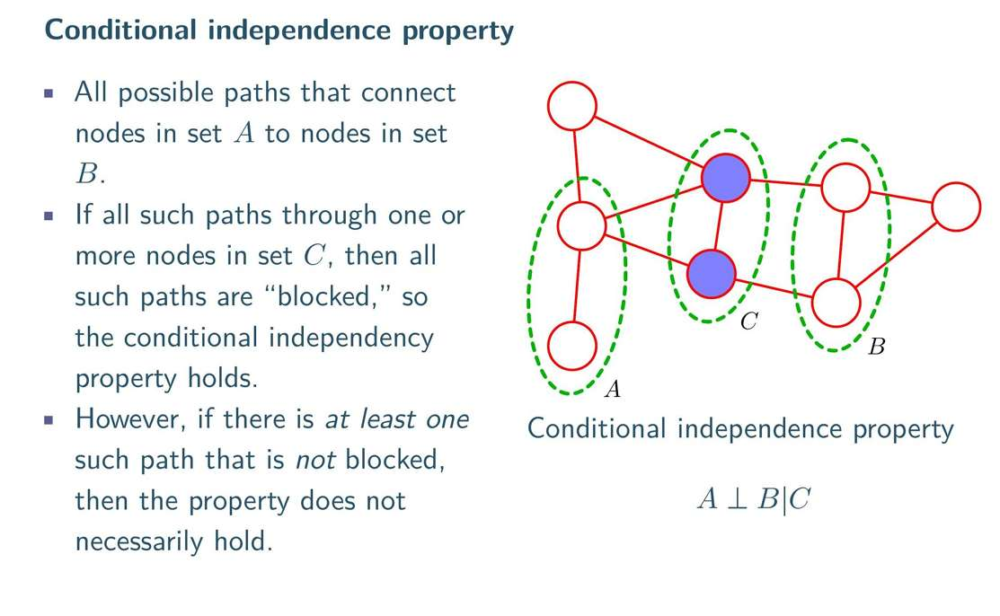

在无向图 只用看线路有没有被已观测节点堵住  
额 有向图只要有箭头的 稍微复杂点 都不太能用无向图表述吧。 但只是直觉，我细细想一下， 无向图不能表述因果，只能表示有联系，

**严厉剖析：**
1.  **回顾 V型结构 ($A \rightarrow C \leftarrow B$)**：
    *   特点：**两头通，中间堵**。
    *   性质：平时 $A, B$ 独立；**观测 $C$ 后， $A, B$ 变得相关**（解释得通）。

2.  **无向图能做到吗？ ($A - C - B$)**：
    *   如果你观测 $C$：根据刚才的“路障规则”，路径被堵死，$A, B$ **独立**。
    *   **矛盾出现了！**
        *   有向图 V型：观测 $C \rightarrow$ 相关。
        *   无向图 链式：观测 $C \rightarrow$ 独立。
    *   **行为完全相反！**

**结论**：
无向图**永远无法**表达“两个变量平时独立，观测到共同结果后变得相关”这种逻辑。它的一生都被“观测即阻断”这个简单的规则锁死了。这就是它最大的局限。

团：
找图中节点，如果每个节点都有向外连接每一个其他节点的边，这些节点就构成了团。显然很好理解，他们都互相连接，像一群团体。 

x1--x4就不是团了 x1和x4没有互相连接。所以最大团是，图里，能称为团的，且拥有最多的节点个数

势函数 (Potential Function, ψ)
我是真不懂， 没有势函数的来龙去脉... 直觉我都没建立起
