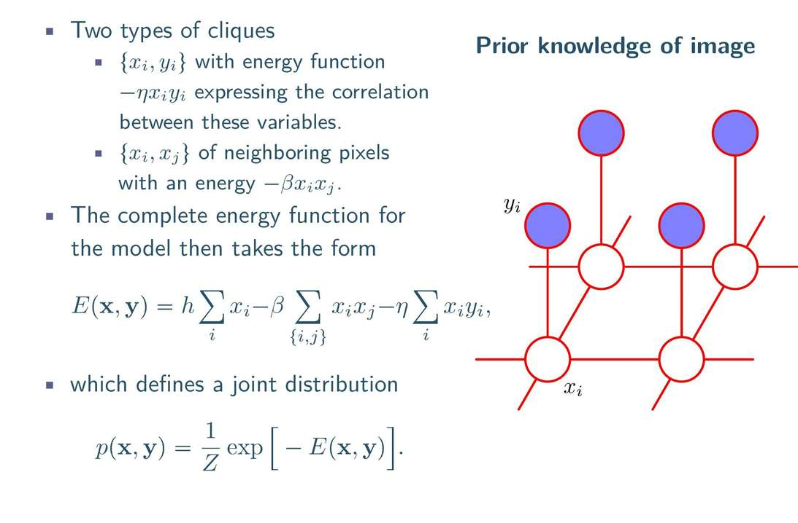

### **1. 拆解图结构 (P46 右图)**

这就好比一个双层三明治。

*   **蓝色节点 ($y_i$)**：**观测值 (Observed)**。
    *   这是你拿到的那张**充满噪点**的图。每个像素的值是已知的（比如 +1 代表白，-1 代表黑）。
    *   虽然是已知的，但它们是**脏**的，可能被翻转了。

*   **白色节点 ($x_i$)**：**隐藏变量 (Latent/Hidden)**。
    *   这是我们**想要恢复**的那张**干净**的图。每个像素的值是我们想推断的未知数。

*   **连线 (Edges)**：定义了两种**团 (Cliques)**，也就是两种“默契关系”：
    1.  **上下连线 ($x_i - y_i$)**：**“忠诚度”关系**。真实的像素 $x_i$ 应该和观测到的像素 $y_i$ 保持一致（虽然观测有噪点，但毕竟是线索，不能完全不管）。
    2.  **左右/前后连线 ($x_i - x_j$)**：**“邻里”关系**。真实的图像通常是连贯的（白色的旁边通常是白色）。所以相邻的隐藏像素 $x_i$ 和 $x_j$ 应该倾向于颜色一致。

---

### **2. 拆解能量函数 (P46 左公式)**

公式：$E(\mathbf{x}, \mathbf{y}) = \underbrace{h \sum x_i}_{\text{偏置}} \underbrace{- \beta \sum x_i x_j}_{\text{邻里项}} \underbrace{- \eta \sum x_i y_i}_{\text{忠诚项}}$

这里的变量 $x, y$ 取值通常设为 **+1 (白)** 和 **-1 (黑)**。
我们要找的是让 **总能量 $E$ 最小**（即概率最大，最合理）的那个 $x$ 的配置。

我们重点看后两项（$h$ 是偏置，通常假设黑白比例均等，设为0）：

#### **第一项：邻里项 $-\beta \sum x_i x_j$**
*   **含义**：描述白色节点之间的关系。
*   **逻辑**：
    *   如果邻居 $x_i$ 和 $x_j$ **颜色相同**（同为+1或同为-1）：乘积为 $+1$。能量变化 $-\beta$。**（能量降低，奖励！）**
    *   如果邻居 **颜色不同**：乘积为 $-1$。能量变化 $+\beta$。**（能量升高，惩罚！）**
*   **作用**：强迫图像变得**平滑**，去掉孤立的噪点（去噪）。

#### **第二项：忠诚项 $-\eta \sum x_i y_i$**
*   **含义**：描述白色节点（推断值）和蓝色节点（观测值）的关系。
*   **逻辑**：
    *   如果 $x_i$ 和 $y_i$ **相同**：乘积为 $+1$。能量变化 $-\eta$。**（奖励！）**
    *   如果 $x_i$ 和 $y_i$ **不同**（你认为观测错了）：乘积为 $-1$。能量变化 $+\eta$。**（惩罚！）**
*   **作用**：确保你恢复的图像**不能脱离原图太远**。

---

### **3. 总结：这图在干嘛？**

这是一个**拉锯战**。

*   **$\beta$ (平滑系数)** 想把大家都变成一样的颜色（因为邻居一样能量低）。
*   **$\eta$ (信噪比系数)** 想让大家都保持原图的样子。

**P45 的结果**就是这场拉锯战的结局：
我们找到了一个 $x$ 的排列，它既在局部保持了连贯性（去掉了噪点），又在整体上保留了原图的轮廓（忠于观测）。

**这就是马尔可夫随机场的威力：**
它不需要知道像素变化的因果方向，它只需要定义**局部约束（势函数/能量）**，然后让整个系统沉淀到一个**最协调（能量最低）**的状态。
