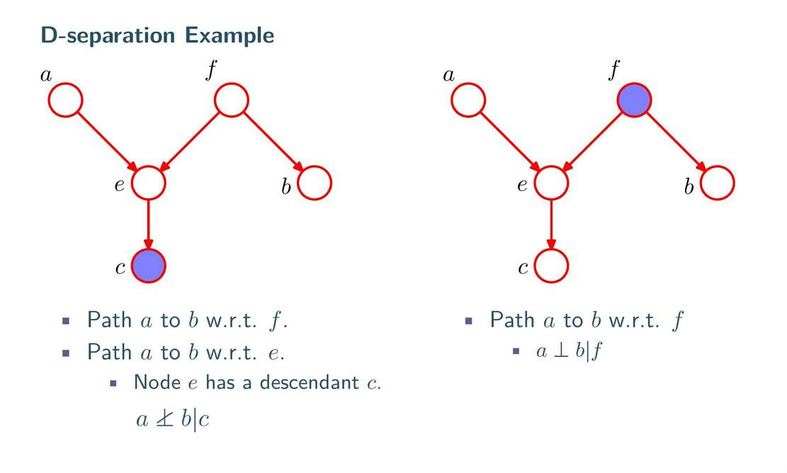

这个例子是为了演示：**当中间节点（子节点）被观测后，两个原本独立的父节点是如何变得“相关”的。**

#### **1. 设定 (Setup, P22-P23)**
这是一个典型的 **Head-to-Head (V型)** 结构：
*   **B (Battery)**: 电池是否有电？ (1=有, 0=没)
*   **F (Fuel)**: 油箱是否有油？ (1=有, 0=没)
*   **G (Gauge)**: 油表是否读数为“满”？ (1=满, 0=空)

**图结构**：$B \rightarrow G \leftarrow F$
*   油表 ($G$) 的读数由电池 ($B$) 和油箱 ($F$) 共同决定。
*   **关键先验假设**：电池有没有电，和油箱有没有油，这两件事是**独立**的。（$B \perp F$）

#### **2. 场景一：只看油表 (P24-P25)**
我们上车，发现油表读数是空的 ($G=0$)。
此时，我们想推断：**真的是油箱空了吗 ($F=0$)？**

*   **先验 (P23)**：没看表之前，我们认为油箱空的概率很低 ($P(F=0) = 0.1$)。
*   **后验 (P25)**：看到表空了 ($G=0$) 之后，根据贝叶斯公式计算，油箱空的概率上升到了 **0.257**。
*   **结论**：$G=0$ 为“没油了”提供了证据，概率增加了。

#### **3. 场景二：发现电池也没电了 (P26-P27)**
这时候，我们不仅看到油表是空的 ($G=0$)，我们还顺便检查了一下电池，发现**电池也没电了 ($B=0$)**。

**现在请思考逻辑（不看公式）：**
*   油表为什么指在 0？有两个可能原因：1. 没油了；2. 没电了（油表没电就不动，归零）。
*   现在你已经确认**“没电了”**。
*   那么，“没油了”这个解释还重要吗？

**数学计算 (P27)**：
计算 $P(F=0 | G=0, B=0)$。
结果由之前的 **0.257** 暴跌回 **0.111** (非常接近先验的 0.1)。

#### **4. 核心现象：解释得通 (Explaining Away)**

这就是 Head-to-Head 结构被观测时的**魔术**：

1.  **观测前 ($G$ 未知)**：$B$ 和 $F$ 独立。电池坏没坏，不影响我有多少油。
2.  **观测后 ($G=0$)**：$B$ 和 $F$ **变得相关了**（确切说是形成了竞争关系）。
    *   既然确定了 $B=0$（没电），这就完美解释了为什么 $G=0$。
    *   既然解释通了，我们就不再需要怀疑 $F=0$（没油）了。
    *   **$B$ 的状态变化，直接导致了我们对 $F$ 的信念发生巨大改变。**

**结论**：
在 V型结构 ($B \rightarrow G \leftarrow F$) 中，一旦中间的子节点 $G$ 被观测（变成已知），两个父节点 $B$ 和 $F$ 就**不再独立**了。它们之间产生了一种**“因为你确实是凶手，所以我洗清了嫌疑”**的逻辑关联。

# 例2

aef是head to head， feb是tail to head 
现在看a和b之间流通不
先看左图
c被观测，是影响e的吧。
e可以理解也被观测到？  那么 a 和 f 是不独立的  
f是没被观测的 e和b是不独立的  呃，b是被e影响的  
这怎么推理呢？
a和b貌似没建立联系

右图
f被观测 但e与b独立  
e未被观测 a与f独立 
呃，a和b没建立联系

呃，先看看p = p(a) p(e|a,f)p(c|e)p(f)p(b|f)

# **场景：警报与电话 (The Burglar Alarm)**

你家安装了一个防盗警报器 ($A$)。
1.  **盗窃 ($B$)** 会触发警报 ($B \rightarrow A$)。
2.  **轻微地震 ($E$)** 也会触发警报 ($E \rightarrow A$)。
3.  **假设**：盗窃和地震之间平时是没关系的（独立）。
4.  你有两个邻居，**John ($J$)** 和 **Mary ($M$)**。如果听到警报响 ($A$)，他们可能会打电话给你。
    *   即：$A \rightarrow J$
    *   即：$A \rightarrow M$

**最终的图结构如下：**
$$B \rightarrow A \leftarrow E$$
$$A \rightarrow J$$
$$A \rightarrow M$$
(想象一下：$A$ 在中间，上面接收 $B, E$ 的箭头，下面发出箭头指向 $J, M$)

---

### **请回答以下 3 个问题：**

#### **Q1: 基础题**
在你什么消息都没收到的时候（没有任何节点被观测），**盗窃 ($B$)** 和 **地震 ($E$)** 是独立的吗？
*   **判据**：$B \perp E | \emptyset$ ?
*   **请分析**：路径上的关卡状态。

什么消息都没收到，B和E独立， 额， 这是head to head  中间节点没被观测是独立  被观测时，比如说B的概率大，那么B能”解释的通“ 就会影响E的概率，我们会认为他小。
这里到底怎么体现贝叶斯，我不知道如何严谨地表述。

#### **Q2: 进阶题（陷阱题）**
你正在上班，突然接到邻居 **John ($J$)** 打来的电话，说警报响了（即 $J$ 被观测）。此时，**盗窃 ($B$)** 和 **地震 ($E$)** 还是独立的吗？
*   **判据**：$B \perp E | J$ ?
*   **请分析**：路径是什么？关卡 $A$ 的状态受什么影响？（提示：回顾 PPT P21 或 P28 关于“后代”的规则）

A与JM 是tail to tail 啊 当然这个好像没关系。
后代J被观测，A也被影响， 就说A也被观测？     
反正只要是后代 都会影响”父亲“吧？
那么 B和E就不独立了 

#### **Q3: 综合题**
如果你已经回家了，亲眼看到警报器在响 ($A$ 被观测)。此时，**John是否打电话 ($J$)** 和 **Mary是否打电话 ($M$)** 这两件事，是独立的吗？
*   **判据**：$J \perp M | A$ ?
*   **请分析**：$J$ 和 $M$ 之间的路径是什么？中间的关卡是什么结构？是否阻断？

这是tail to tail了
显然独立。中间被观测到

但我还是没get到哪里体现贝叶斯啊

要体会“贝叶斯”的厉害，最好的办法就是看看**“没有贝叶斯（Non-Bayesian）”**的世界是多么僵化和笨拙。

我们通常把“非贝叶斯”的思维方式称为**“规则引擎 (Rule-based System)”** 或者 **“直觉/频率思维”**。

我们还是用 **警报 (A) - 盗窃 (B) - 地震 (E)** 这个经典的 V型结构 ($B \rightarrow A \leftarrow E$) 来做对比。

---

### **场景：警报响了，然后新闻说发生了地震**

#### **选手 1：没有贝叶斯的“规则机器人” (Rule-Based System)**

这个机器人不懂概率，它只懂**死板的逻辑规则 (IF-THEN)**。它的脑子里装的是这样的代码：

1.  **规则 1**：`IF 警报响(A=1) THEN 可能有贼(B=Possible)`
2.  **规则 2**：`IF 警报响(A=1) THEN 可能地震(E=Possible)`

**现在发生了什么？**
1.  **观测 1**：警报响了 ($A=1$)。
    *   **机器人反应**：触发规则！把 `有贼(B)` 和 `地震(E)` 都标记为 **Possible**。它准备报警抓贼，同时也准备往桌子底下钻。

2.  **观测 2**：广播确认发生了地震 ($E=1$)。
    *   **机器人反应**：
        *   它确认了 `地震(E)` 是 **True**。
        *   **关键点来了**：它转头去看 `有贼(B)` 的状态。
        *   逻辑是死的：`警报响` 依然是 True，规则 1 依然成立。
        *   **结论**：机器人依然认为 `有贼(B)` 是 **Possible**。它无法降低对盗窃的怀疑。

**后果**：
这个机器人虽然知道地震了，但它**依然会坚持报警抓贼**。因为它不懂“竞争关系”，它觉得地震和盗窃可以同时发生，互不干扰。它**无法自动消除**不必要的怀疑。

---

#### **选手 2：拥有贝叶斯大脑的“侦探” (Bayesian Network)**

这个侦探脑子里装的是**概率图**和**信念更新机制**。

**现在发生了什么？**
1.  **观测 1**：警报响了 ($A=1$)。
    *   **侦探反应**：贝叶斯逆向推断。
    *   计算 $P(B=1|A=1)$，发现很高（比如 90%）。
    *   计算 $P(E=1|A=1)$，发现也很高（比如 80%）。
    *   **行动**：高度紧张，准备报警。

2.  **观测 2**：广播确认发生了地震 ($E=1$)。
    *   **侦探反应**：**“解释得通 (Explaining Away)” 机制启动！**
    *   侦探心想：“哦，原来是因为地震啊！既然警报响的原因已经找到了...”
    *   **自动计算**：$P(B=1 | A=1, E=1)$。
    *   由于 $E$ 的存在，$B$ 的后验概率从 90% **暴跌** 回了 1%（接近先验概率）。
    *   **结论**：侦探长舒一口气，**取消了报警**。

---

### **对比总结**

| 特性         | 没有贝叶斯 (规则/逻辑)                  | 有贝叶斯 (概率图)                          |
| :--------- | :----------------------------- | :---------------------------------- |
| **思维方式**   | **非黑即白** (True/False/Possible) | **灰度** (概率从 1% 变 90% 再变 1%)         |
| **面对多重原因** | **各自为战**。确认了原因A，不影响对原因B的判断。    | **此消彼长**。确认了原因A，自动“解释掉”原因B，降低对B的怀疑。 |
| **结果**     | **僵化、误报**。地震了还要抓贼。             | **智能、自适应**。地震了就只防震，不抓贼。             |

**这就是贝叶斯的魔力：**
它赋予了模型一种**“权衡”**的能力。当多个原因都能解释同一个结果时，贝叶斯网络能根据证据的强弱，动态地调整对各个原因的“信任度”。没有贝叶斯，模型就是一堆死板的开关，无法处理这种微妙的“借力打力”的逻辑关系。

**没有图 我们也知道要用贝叶斯公式 但是图能告诉我们 用贝叶斯公式时可以用的一些条件 能帮我们简化计算**