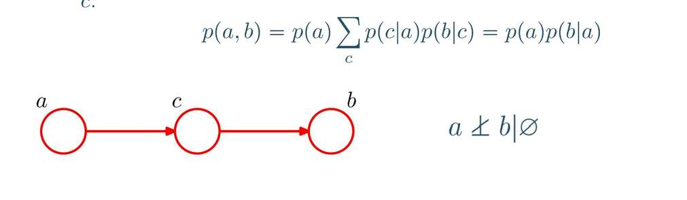
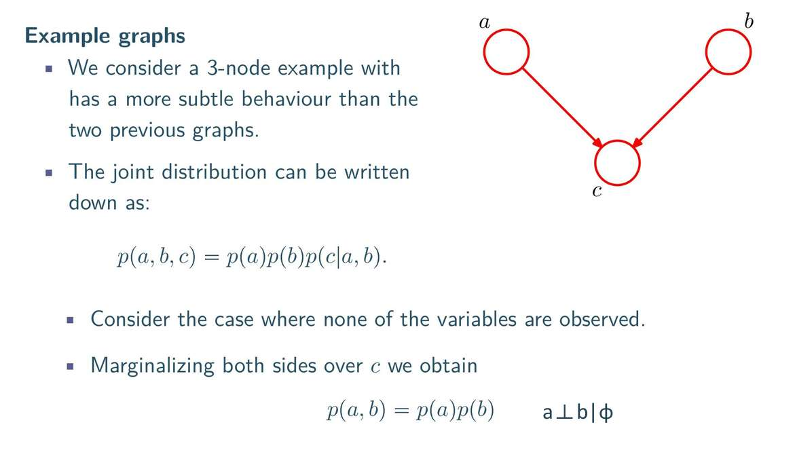

观察和未观察
**给定一张图的结构，我们要立刻判断出：在这个网络中，信息能否从节点 A 流动到节点 B？**
未观察到c的话，
是p(a,b,c)  将c求边缘概率
观察到c的话，
我们说p(a,b|c)
。
对所有概率图，p(a,b,c)是很好写的，看图写 
那么，没观察到c，看p(a,b,c) c边缘化后 是否等于p(a)p(b)即可

观察到c的话，看p(a,b|c)是否等于p(a|c)p(b|c)即可
# 结构
## tail to tail

## head to tail

诶？这个怎么化简的
## head to head
怎么化简的
