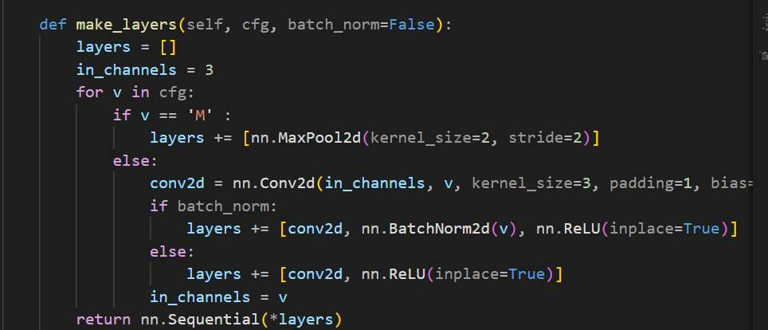
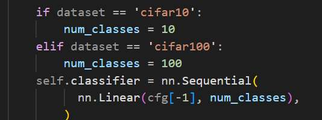
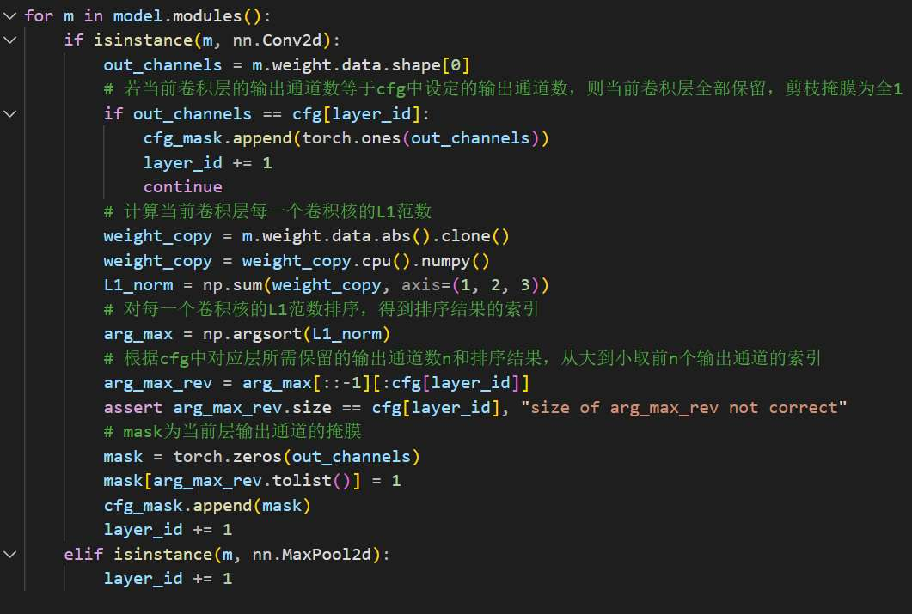
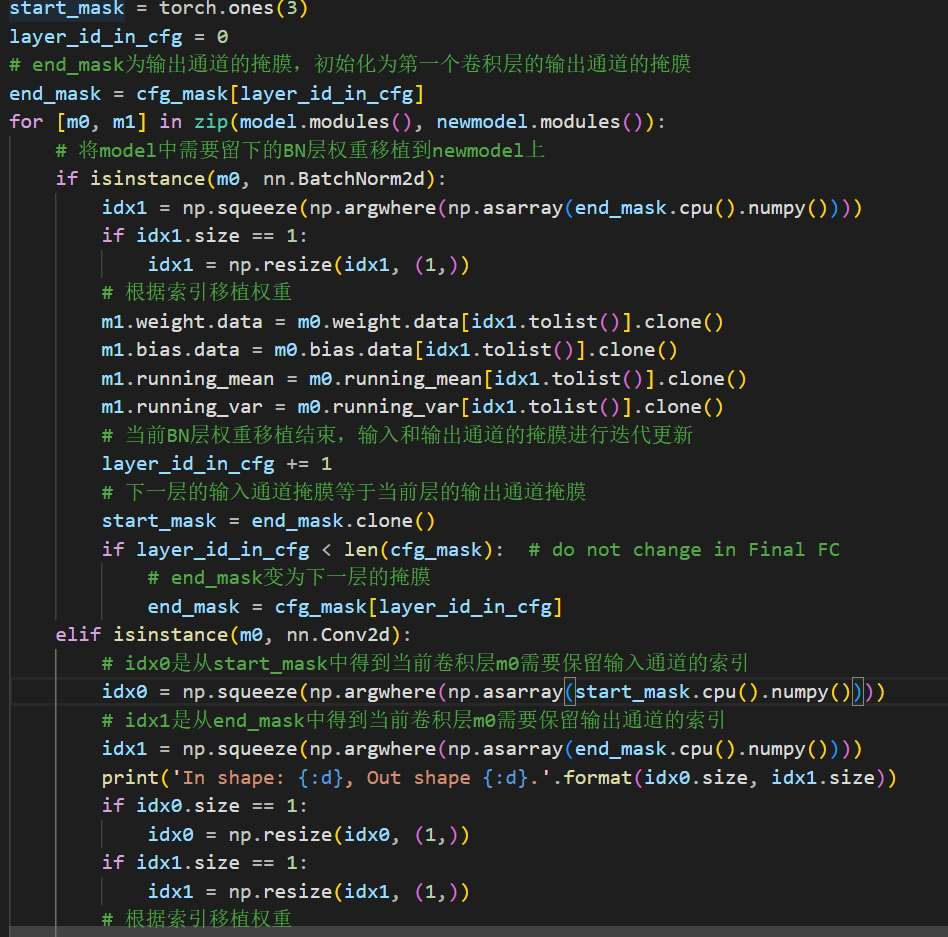
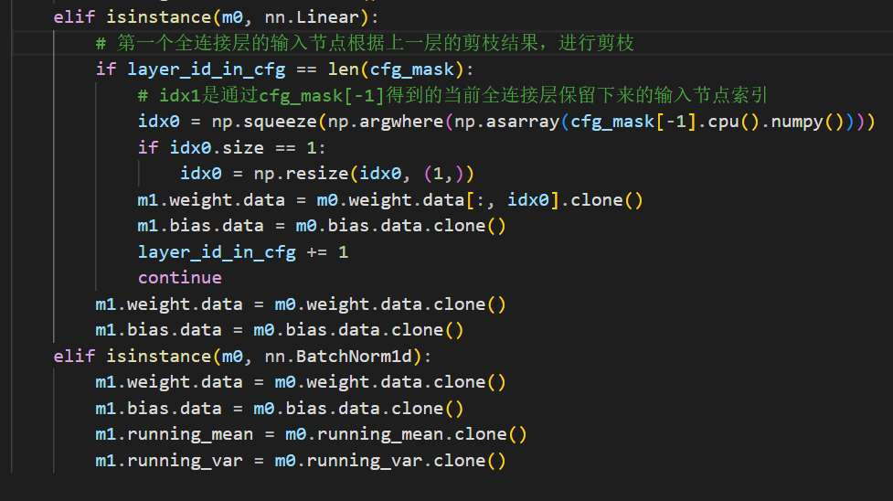
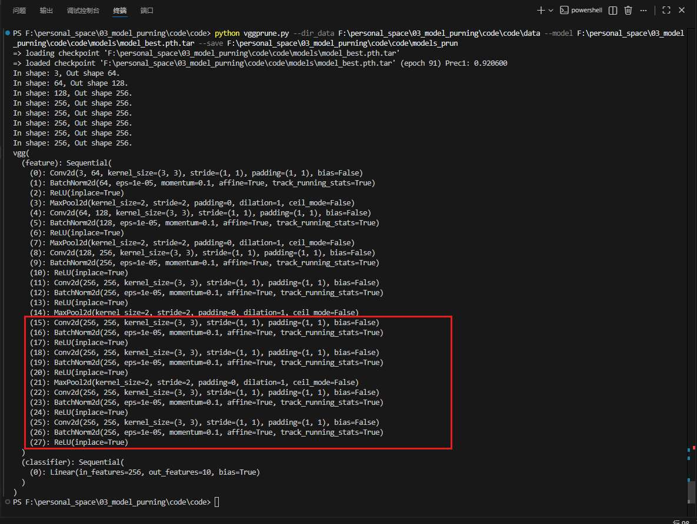
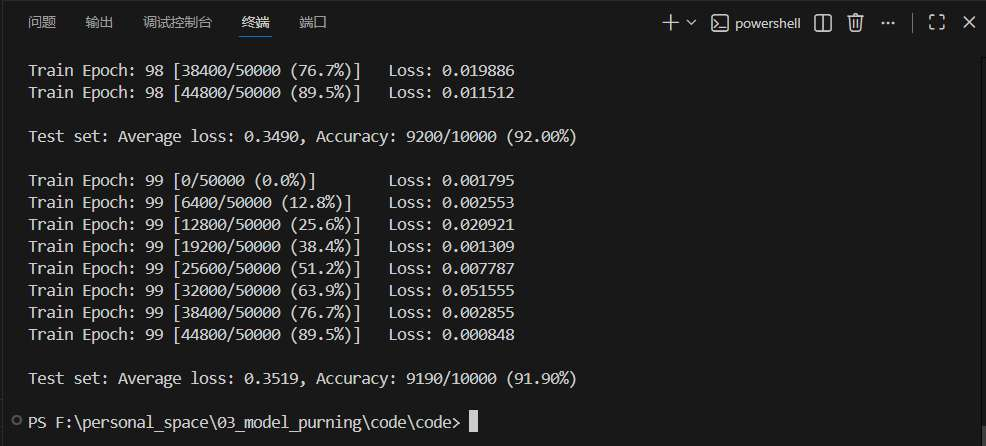
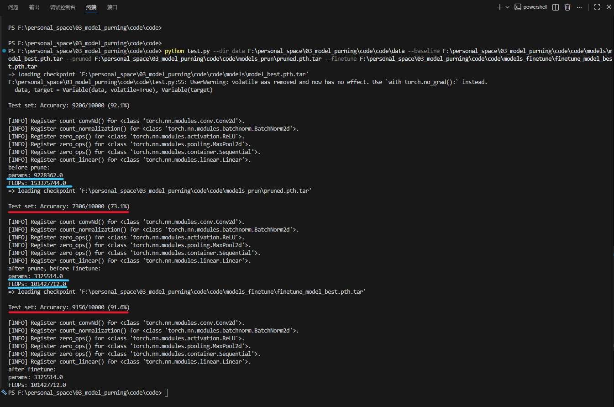
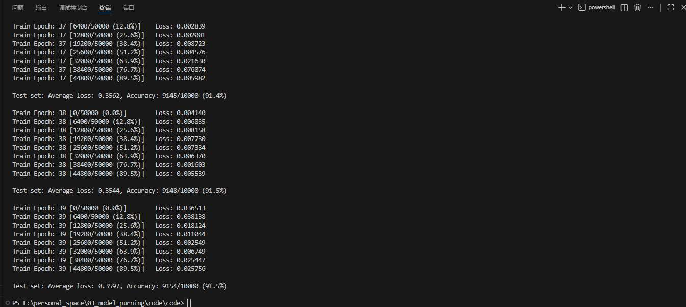

## 一、实验目的

1. **理解模型剪枝的背景与意义**：了解深度卷积神经网络CNN随着网络深度和宽度的增加，参数量和浮点运算量急剧上升，在硬件上推理速度变慢的问题。认识模型轻量化对移动端、嵌入式设备部署及提高推理速度的重要性。
2. **掌握经典的滤波器剪枝算法**：理解并代码实现基于卷积核权重绝对值和L1 范数的滤波器重要性评估与剪枝方法。
3. **熟悉模型剪枝的完整工作流**：在公开数据集CIFAR-10上，使用 PyTorch 框架独立完成 VGG11 模型的搭建，并走通“**模型预训练 $\rightarrow$ 模型剪枝，生成掩膜与权重移植 $\rightarrow$ 剪枝后模型微调 $\rightarrow$ 剪枝效果评估**”的完整轻量化流程。
4. **评估剪枝效果**：通过对比剪枝前后及微调前后模型的准确率、参数量与计算量，直观感受剪枝技术对网络压缩的实际效果。

## 二、实验原理
深度神经网络虽然在图像分类等任务上表现优异，但其庞大的参数量和计算开销限制了其在资源受限设备上的应用。模型剪枝是一种有效的网络压缩技术，旨在去除网络中冗余的、不重要的权重连接或通道。

本实验主要采用**基于滤波器重要性（L1 范数）的结构化剪枝方法**，其核心原理与流程为
**滤波器重要性衡量**、**剪枝操作与通道掩膜生成**、**模型权重的物理移植**、**微调恢复精度**

具体如下：
1. 在卷积神经网络中，每个卷积层包含多个滤波器（Filter/卷积核）。基于 L1 范数的剪枝思想认为：如果一个滤波器权重的绝对值之和（L1 范数）非常小，说明该滤波器提取特征的能力较弱，对输出特征图的贡献较小。因此，可以利用以下公式计算每个滤波器的 L1 范数作为其重要性得分：
   $$ ||W_i||_1 = \sum |w_{i,j}| $$
   其中 $W_i$ 为当前层第 $i$ 个卷积核的参数矩阵。

2.   对某一卷积层内所有滤波器的 L1 范数进行从小到大的排序。根据预先设定的网络配置，即设定的 `cfg` 数组，它代表剪枝后每层保留的通道数，保留 L1 范数较大的前 $N$ 个滤波器，并剔除 L1 范数较小的滤波器。在代码实现中，通过生成通道掩膜Mask，保留对应 1，剪除对应 0来记录这一决策。

3.  仅仅将权重置为 0 并不能减少推理时的计算量，其属于非结构化剪枝。
   故而，本实验采用结构化剪枝，重新实例化一个通道数变小的新模型，并根据前面生成的 Mask 掩膜，将原模型中保留下来的对应权重，包括 Conv2d 层、BatchNorm 层以及全连接层 Linear 的对应维度，精确地“复制/移植”到新模型中，从而真正缩小模型的物理体积。

4.   直接剪掉一部分滤波器后，破坏了原网络学习到的特征表示，会导致模型预测精度出现断崖式下降。因此，剪枝后的轻量化网络必须在原数据集上继续进行训练，即通过微调，依靠剩余的权重重新调整，以恢复甚至是超越原本的分类精度。

---

## 三、实验内容与步骤

本实验基于 PyTorch 框架，在公开数据集 CIFAR-10 上完成了 VGG11 模型的结构化剪枝。具体实验内容包含网络搭建、预训练、掩膜生成、权重移植、微调恢复及测试评估六个核心任务，具体步骤如下：

### 任务 1：搭建支持动态通道配置的卷积神经网络
为了实现结构化剪枝，在物理上减少网络的通道数，传统的固定通道数网络结构无法满足需求。
因此，需要在 `vgg.py` 中重写 VGG 网络的构建逻辑，使其能够根据传入的配置列表（`cfg`）动态生成网络层。

代码补全的思路：遍历 cfg 列表，如果当前元素 v 是 'M'，代表需要插入最大池化层降采样；如果 v 是具体的数字，则代表该层为卷积层，且 v 即为该卷积层的输出通道数。同时，当前卷积层的输出通道数，必然是下一个相邻卷积层的输入通道数，需要进行动态更新迭代。

整体解析：
*   **配置列表解析**：VGG11 的默认特征提取层配置为 `[64, 'M', 128, 'M', 256, 256, 'M', 512, 512, 'M', 512, 512]`。代码通过遍历该列表，若遇到 `'M'` 则添加最大池化层（`MaxPool2d`），若遇到数字则代表该层卷积的输出通道数，据此添加 `Conv2d`、`BatchNorm2d` 和 `ReLU` 激活函数。
  
*   **分类器适配**：网络的分类器部分被简化为一个全连接层 `nn.Linear(cfg[-1], num_classes)`，其输入维度动态绑定为特征提取网络最后一层的输出通道数 `cfg[-1]`。
  
*   **权重初始化**：通过 `_initialize_weights` 函数对搭建好的模型进行 Kaiming 正态分布初始化，确保模型在初始阶段具备良好的收敛潜力。

### 任务 2：设置超参数，实现剪枝前模型的预训练
在进行剪枝前，需要先训练出一个具有较高准确率的 Baseline 模型。
在 `main.py` 中实现了这一流程：
*   **数据加载与增强**：加载 CIFAR-10 数据集，并应用了四周填充（Pad=4）、随机裁剪（RandomCrop=32）、随机水平翻转（RandomHorizontalFlip）以及标准化（Normalize）等数据增强策略，以提高模型的泛化能力。
*   **优化器与超参数**：采用带带动量（Momentum=0.9）的随机梯度下降（SGD）优化器，权重衰减（Weight Decay）设为 `1e-4` 以防止过拟合。初始学习率设定为 `0.1`，并在总 Epoch 的 50%和 75%处进行学习率衰减（乘以 0.1）。
*   **模型保存**：在每一轮训练结束后进行测试集评估，保存验证精度最高（`best_prec1`）的模型权重作为后续剪枝的基础。
设置命令行中数据集路径(--dir_data)，预训练模型权重的保存路径(--save)，直接使用命令行运行 main. py

### 任务 3：根据新设的 cfg 和卷积核的 L1 范数生成通道掩膜
这是基于滤波器重要性剪枝的核心步骤，在 `vggprune.py` 文件中实现。
目标是筛选出重要的滤波器并生成 `Mask` 掩码。

代码补全如下：
L1 范数计算： `Conv2d` 的权重张量形状为 `[out_channels, in_channels, h, w]`。要计算每一个滤波器的绝对值之和，需固定维度 0（`out_channels`，即滤波器个数），对后面的维度 1、2、3 进行求和。
获取保留索引的做法是 `np.argsort()` 默认升序排列。我们需要保留 L1 范数**最大**的前 `n` 个通道（`n` 由新 `cfg[layer_id]` 决定）。因此需要对排序结果进行逆序切片 `[::-1]`。
初始化一个全 0 向量，将筛选出的重要通道索引位置置为 1，用于生成 mask。

整体解析：
*   **设定目标配置**：预先设定剪枝后的网络配置 `cfg = [64, 'M', 128, 'M', 256, 256, 'M', 256, 256, 'M', 256, 256]`。对比原配置可见，深层网络的输出通道数从 512 减少到了 256，实现了约 50% 的通道裁剪。
*   **计算 L1 范数并排序**：遍历预训练模型的每一个 `Conv2d` 层。提取当前层的权重张量，通过 `np.sum(weight_copy, axis=(1, 2, 3))` 沿输入通道、卷积核高、卷积核宽三个维度求绝对值之和，得到每一个滤波器的 L1 范数得分。利用 `np.argsort()` 对得分进行从小到大排序。
*   **生成二值化掩膜（Mask）**：根据新 `cfg` 中对应层需要保留的通道数 $N$，利用切片 `arg_max[::-1][:cfg[layer_id]]` 从大到小截取前 $N$ 个最重要滤波器的索引。创建一个全 0 的张量 `mask`，并将保留索引对应的值赋为 1。将各层的掩膜保存在 `cfg_mask` 列表中备用。

### 任务 4：根据通道掩膜，完成模型权重的物理移植
仅有掩膜并不能加速推理，必须将保留的权重物理复制到一个规模更小的新模型中。

代码补全思路：
网络第一层卷积的输入是 RGB 图像，始终为 3 通道，因此初始的输入掩膜 `start_mask` 应为 3 个 1。
`BatchNorm2d` 只有输出维度的缩减（一维张量），因此直接通过当前层的输出掩膜 `end_mask` 获取索引 `idx1`，提取对应权重。
当前层的输出掩膜 `end_mask`，必然等价于下一层的输入掩膜 `start_mask`。
Conv2d 权重二维裁剪：卷积权重 `[out_channels, in_channels, h, w]` 受到双重剪枝限制——它既要根据 `start_mask` (`idx0`) 裁剪输入通道维度（dim=1），又要根据 `end_mask` (`idx1`) 裁剪输出通道维度（dim=0）。

在 `vggprune.py` 的后半段完成了极其精细的张量切片与赋值操作：
利用任务 3 设定的新 `cfg`，实例化一个全新的、体积更小的模型 `newmodel`。
通过 `zip(model.modules(), newmodel.modules())` 同步遍历新旧模型。
*   对于 `BatchNorm2d` 层，只需根据当前层的输出掩膜（`end_mask`），提取出值为 1 的索引 `idx1`，将旧模型的 `weight`、`bias`、`running_mean`、`running_var` 对应索引的值拷贝到新模型。
*   对于 `Conv2d` 层，由于它的形状为 `[out_channels, in_channels, k, k]`，不仅输出通道减少了，**输入通道也因为上一层的剪枝而减少了**。因此需要同时根据上一层的输出掩膜（即当前层的输入掩膜 `start_mask`，得到 `idx0`）和当前层的输出掩膜（`end_mask`，得到 `idx1`）进行二维联合切片提取：`w1 = m0.weight.data[:, idx0, :, :]`，接着 `w1 = w1[idx1, :, :, :]`，最后赋值给新模型。

全连接层的输入节点数受最后一层卷积层剪枝的影响。根据 `cfg_mask[-1]` 提取保留的特征图索引，对旧 `Linear` 层的输入维度（dim=1）进行切片压缩，保留对应的全连接权重。最后将剪枝后的模型保存为 `pruned.pth.tar`。

### 任务 5：设置超参数，微调剪枝后的神经网络
剪枝操作属于一种“破坏性”的结构改变，直接截断一部分权重会导致模型丢失部分特征表示能力，精度必然大幅下降。因此需要进行微调（Fine-tuning）。
*   在 `main_finetune.py` 中，通过 `--refine` 参数加载 `pruned.pth.tar` 的权重和对应的 `cfg` 配置。
*   为了防止新初始化的权重破坏已有的特征提取能力，使用较小的初始学习率（`lr=0.001`）重新配置 SGD 优化器。
*   在原训练集上继续进行多个 Epoch 的训练，使得网络中的剩余权重能够自适应地重新组合，弥补被剪除滤波器带来的信息损失，最终收敛，并将最优模型保存为 `finetune_model_best.pth.tar`。

### 任务 6：测试评估模型精度、参数量与计算量
为验证剪枝方案的有效性，在 `test.py` 中编写了全面的评估逻辑：

整个流程为：
1.  加载模型状态字典：使用 `torch.load` 加载传入的权重路径参数（如 `args.baseline`, `args.pruned` 等）。
2.  **计算准确率**：调用已封装好的 `test(model)` 函数执行测试集推理。
3.  **计算参数量与 FLOPs**：`thop.profile()` 需要输入一个与真实数据形状相同的 Dummy 张量。CIFAR-10 数据为 3 通道 32x32 分辨率图像，因此构建张量 `(1, 3, 32, 32)` 输入模型。
总的来说，
利用 `thop` 库的 `profile` 功能，向网络中输入一个 `(1, 3, 32, 32)` 的随机张量，计算网络在一次前向传播中的乘加操作数（FLOPs）和参数量（Params）。
在 CIFAR-10 测试集上，分别对三个阶段的模型进行评估，形成对照组：
**Baseline 模型**：测试原版预训练 VGG11 的准确率、参数量和 FLOPs。
 **Pruned 模型**：测试刚完成权重移植、尚未微调的剪枝模型，观察精度下降幅度及压缩后的理论计算量。
 **Finetune 模型**：测试微调后的最终轻量化模型，验证微调策略对精度恢复的作用，以及网络压缩的最终成效。

## 四、 实验结果

通过在终端分别运行预训练、模型剪枝、微调和测试代码，最终在 CIFAR-10 数据集上得出了 VGG11 模型剪枝前后的对比数据。

**1. 网络通道配置变化**
- **剪枝前 (Baseline cfg)**：[64, 'M', 128, 'M', 256, 256, 'M', 512, 512, 'M', 512, 512]
- **剪枝后 (Pruned cfg)**：[64, 'M', 128, 'M', 256, 256, 'M', 256, 256, 'M', 256, 256]  
    从配置可以看出，本次剪枝主要针对 VGG11 深层的特征提取层，将其输出通道数从 512 砍半缩减至 256。

**2. 核心指标对比**  
根据 test.py 脚本利用 thop 库的测试输出如图所示

剪枝前预训练：

剪枝后未微调（第一个红线）；

微调的最终模型 （上图第二个红线；下图）

汇总剪枝前后各项指标如下表

| 模型状态                    | 准确率 (Accuracy) | 参数量 (Params)           | 计算量 (FLOPs)               |
| ----------------------- | -------------- | ---------------------- | ------------------------- |
| **预训练基线模型 (Baseline)**  | 92.10%         | 9,228,362 (~9.23M)     | 153,375,744 (~153.3M)     |
| **剪枝后未微调 (Pruned)**     | 73.10%         | 3,325,514 (~3.33M)     | 101,427,712 (~101.4M)     |
| **微调后最终模型 (Finetuned)** | **91.60%**     | **3,325,514 (~3.33M)** | **101,427,712 (~101.4M)** |

**3. 结果分析**

- **极其显著的压缩效果**：经过剪枝，模型的参数量从约 9.23M 骤降至 3.33M，**参数量减少了约 64%**；同时，计算量（FLOPs）从 153.3M 降至 101.4M，**计算量减少了约 33.8%**。这在物理层面上极大地实现了模型的轻量化，大幅降低了内存占用和理论推理延迟。
- **微调的必要性与有效性**：从数据中可以明显观察到，刚完成权重移植的 Pruned 模型，准确率发生了“断崖式”下跌：从 92.1% 暴跌至 73.1%。这验证了直接剔除滤波器会破坏网络原有的特征表示。但经过数十个 Epoch 的微调后，最终模型的准确率恢复到了 **91.6%**，仅比原基线模型下降了微小的 **0.5%**。
- **结论**：本次实验成功以微乎其微的精度损失（0.5%）换取了巨大的模型压缩收益（参数减少64%，计算减少34%），圆满达到了深度模型轻量化的预期目标。

## 五、 实验与学习心得

通过本次深度学习平台模型剪枝的完整实验流程，我们不仅在理论层面加深了对网络轻量化的理解，更在工程代码实践中获得了极大的启发，总结心得如下：

1. **深刻认识到模型轻量化的工程价值**  
    在以往的学习中，大家往往只追求在公开数据集上把模型的 Accuracy 刷高，而忽略了模型的体积和计算复杂度。本次实验让我直观地意识到，传统的深度卷积网络存在着大量的参数冗余。在真实工业场景中，算力和内存是极其受限的。剪枝技术让我们能够在“精度”与“效率”之间找到一个极佳的平衡点，是算法落地部署不可或缺的关键技术。
    
2. **直观理解了基于 L1-Norm 的滤波器评估依据**  
    以前觉得深度学习是个“黑盒”，不知道该去掉哪些参数。通过编写 np.sum(weight_copy, axis=(1, 2, 3)) 这行代码，我们深刻理解了 Hao Li 等人提出的 L1 范数剪枝理论的直观逻辑：如果一个滤波器的权重绝对值整体偏小，它在做卷积乘加运算时产生的激活值也很小，对下一层特征图的贡献微乎其微，因此可以被安全地视为“冗余”并剔除。这种基于权重大小的启发式规则简单而高效。

3. **“非结构化”到“结构化”剪枝**  
    这是本次实验中最具挑战性，也是收获最大的一部分。如果仅仅是将小权重置为 0，这属于非结构化稀疏，在常规硬件上并不能真正加速运算。实验中，我们在 vggprune.py 里真正构建了一个通道数变小的新网络。通过维护 start_mask 和 end_mask，我掌握了如何精准地处理网络层级间的维度耦合问题（即上一层的输出通道减少，直接导致下一层的输入通道也必须相应裁减）。在多维张量上通过 m0.weight.data[:, idx0, :, :] 和 w1[idx1, :, :, :] 进行精细切片与克隆移植，极大锻炼了 PyTorch 核心 API 编程能力。

4. **领略神经网络的自适应与恢复能力**  
    看到刚剪枝完的模型准确率暴跌到 73% 时，心里其实是有落差的；但是看到经过微调后，它又顽强地爬升回了 91.6%，这让我们非常震撼。这说明深度神经网络具有极强的鲁棒性和冗余度，剩下的神经元能够在反向传播的引导下重新建立连接权重，补偿被剪除部分的功能。这也印证了“过度参数化”理论，即我们需要庞大的网络来帮助收敛，但最终起决定性作用的特征只占其中一部分。

5. **总结**  
    本次作业是一次从理论走向落地的绝佳实践。它将网络搭建、张量操作、超参数调优和性能评估串联成了一个完整的闭环。在未来的学习和研究中，遇到复杂的视觉任务时，我们不再只会一味地堆叠网络层数，而是会具备“剪枝与轻量化”的架构思维，去设计更高效、更具实用价值的 AI 算法。

# 附录 ：

| 姓名  | 吕一航 | 康凯  | 孙嘉卫 | 罗良钰 | 林煜晟 |
| --- | --- | --- | --- | --- | --- |
| 贡献度 | 20% | 20% | 20% | 20% | 20% |
