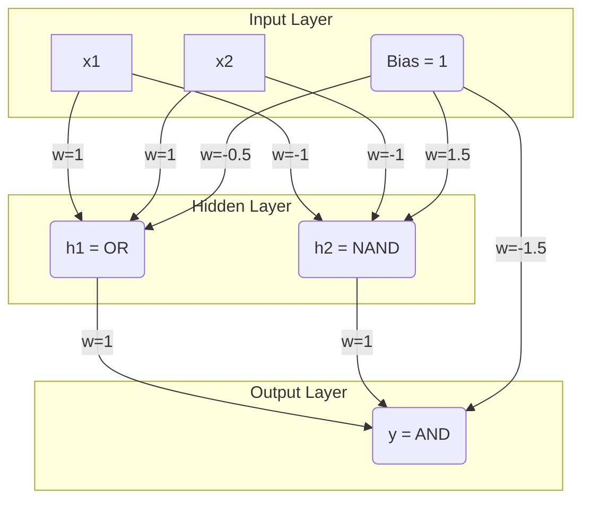
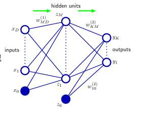
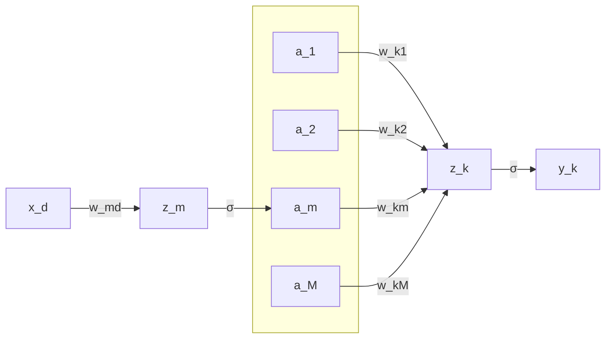
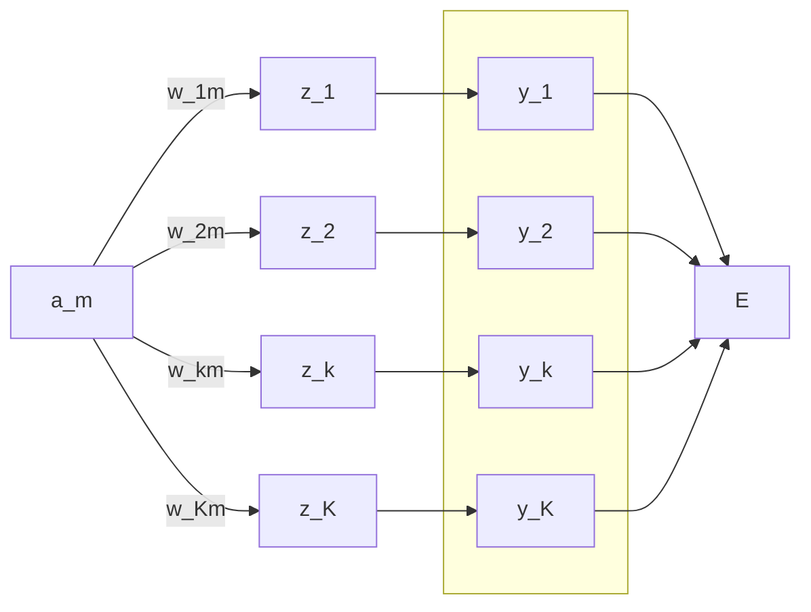

# 一、理论题
## 1.描述反向传播算法的主要步骤
反向传播算法，是使用链式法则，把每一层权重当前的梯度记录下来。
这样其他权重也能用的上记录值，就这样层层向前溯源。
完整流程：
1. 前向传播，逐层记录输入值z、激活值a，直到计算最后一层$a^{(L)}$
2. 计算输出层L误差
3. 从L-1层开始，逐层反向计算每一隐藏层的误差项。第l层的误差是根据l+1层误差和连接这俩层的权重计算出来的。
4. 根据各层误差项和前向传播时存储的激活值，计算出代价函数对每一层权重的梯度。

## 2.解释为什么需要反向传播算法，并如何使用它来更新神经网络的权重和偏置
（1）因为我们需要更新权重和偏置，要看损失对于这些参数的偏导，这些偏导的梯度就用反向传播计算。它利用了链式法则和动态规划的思想，只需进行一次前向传播和一次反向传播，就可以计算出**所有**参数的梯度，大大降低了计算复杂度。
（2）反向传播本身只负责计算梯度，得到梯度后，用于梯度下降算法中更新参数。更新是用$w_{new} = w_{old} - learingrate × 梯度$ 。 偏置项是一样的
## 3.何为链式法则？为何它在反向传播中是关键？
链式法则讲了求逐层求导的规则：
如果一个变量 `y` 依赖于 `u`，而 `u` 又依赖于 `x` (即 `y = f(u)` 和 `u = g(x)`)，那么 `y` 对 `x` 的导数可以通过将各部分的导数相乘得到：
    $$ \frac{dy}{dx} = \frac{dy}{du} \cdot \frac{du}{dx} $$

这个规则可以扩展到任意长度的函数链。
神经网络本身就是一个巨大的复合函数，反向传播是计算梯度的，链式法则指导反向传播“如何计算” ，是计算梯度的数学基础。
## 4. 试分析神经网络前向传播与反向传播算法的计算复杂度，并对比反向传播算法与数值差分求网络梯 度方法在计算效率上的差别。 
前向传播和反向传播都是逐层做矩阵乘法和一些逐元素计算，复杂度为$O(N)$

而数值差分的话，每计算一次参数的梯度，都要进行一次O(N)的前向传播，因此总计算复杂度为$O(N^2)$
## 5. 能否将隐藏层的激活函数用线性函数替换，为什么？
激活函数的目的就是添加“非线性层”，让模型有更强大的拟合能力。
如果只有线性函数的话，无论叠加多少个，最终也能等价为一个线性函数。
增加网络的深度和层数将变得毫无意义，模型实际没有什么拟合能力。
## 6. 使用神经网络的动机是什么？ 
现实中很多问题都是高度非线性，就是线性不可分。对于线性模型， 我们原本要特征构造。但构造什么样，要多少个特征，都是未知数，很费力。  而神经网络，就是自己去“研究”如何发现和学习有意义的特征、构造特征、组合特征，帮助我们做非线性拟合

## 7. 试手工构造一个可以求解“异或”分类问题的神经网络。

将异或拆解为 或 与 与非
x1 XOR x2 = (x1 OR x2) AND (x1 NAND x2)
使用一个简单的**阶跃函数**作为激活函数，规则是：**如果 z >= 0, 输出 1; 否则输出 0。

下面的神经元，就线性输入和激活函数一次性计算了。

神经元一（实现OR）：
我们需要 $w1*x1 + w2*x2 + b >= 0$在 (0,1), (1,0), (1,1) 时成立，在 (0,0) 时不成立。  
一个简单的选择是：
- w1 = 1, w2 = 1
- b1 = -0.5
神经元二（实现与非NAND）：
需要$w1*x1 + w2*x2 + b >= 0$在 (0,0), (0,1), (1,0) 时成立，在 (1,1) 时不成立。
我们可以：
- w1 = -1, w2 = -1
- b2 = 1.5
输出层:
现在，隐藏层的输出 h1 和 h2 分别是 OR 和 NAND 的结果。输出层需要对它们执行 AND 操作。
我们需要 $w1*h1 + w2*h2 + b >= 0$ 仅在 h1=1, h2=1 时成立。  
一个简单的选择是：
- w1 = 1, w2 = 1
- b = -1.5

这里是，我们把参数定义好了。  
神经网络的效果可以让我们  只设立两个线性隐藏层，随机参数  
然后在训练中， 梯度下降调整成合适的参数(比如我们刚自己设的)

# 二、 计算题 
考虑一个三层神经网络（一个输入层、一个隐藏层、一个输出层）： 
• 输入层有1个神经元，隐藏层有2个神经元，输出层有1个神经元。
• 输入为`[0.5]`。
• 初始化的权重和偏置为：
- 输入层到隐藏层权重`[0.15] [0.25]`
- 输入层到隐藏层偏置0.2,0.3
- 隐藏层到输出层权重0.4,0.5
- 隐藏层到输出层偏置0.6 
使用Sigmoid作为激活函数。

1. 手动执行一次前向传播，计算输出:
	- 输入层到隐藏层：`[0.5*0.15+0.2,0.5*0.25+0.3]` 
	- 即`z_h1 = 0.275,z_h2 = 0.425`   
	- `a_h1 = sigmoid(z_h1) = 0.5683,
	- `a_h2 = 0.6047`
	- 隐藏层到输出层：
	- `a_out = sigmoid(z_out) = sigmoid(0.5683*0.4 + 0.6057*0.5 + 0.6)=0.7558` 
2. 假设期望输出为1，计算输出层的误差。 
	- `δ_out=0.7558-1=-0.2442`
3. 使用反向传播算法，计算隐藏层到输出层的权重梯度。 
	我们假设损失函数就是均方误差。
	- **∂E / ∂a_output** = a_output - y 
	- **∂a_output / ∂z_output** = a_output(1-a_output)
	- **∂z_output / ∂w_h1_o** = a_h1
	- **∂z_output / ∂w_h2_o** = a_h2
	- **∂z_output / ∂b_out** = 1
	- **∂z_output / ∂a_h1** = w_h1_o
	- **∂z_output / ∂a_h2** = w_h2_o
	- **∂a_h1 / ∂z_h1** = a_h1(1-a_h1)
	- **∂a_h2 / ∂z_h2** = a_h2(1-a_h2)
	- **∂z_h1 / ∂w_h1_1** = x
	- **∂z_h1 / ∂b_h1 = 1
	- **∂z_h2 / ∂w_h2_1** = x
	- **∂z_h2 / ∂b_h2 = 1

	权重梯度：
		先计算下误差：
		δ_output = (a_output - y) * a_output * (1 - a_output)=(-0.2442) * 0.7558 * (0.2442)=-0.04516
		δ_h1 =δ_output * w_h1_o * a_h1 * (1 - a_h1）= (-0.01806) * 0.5683 * (0.4317)=-0.00443
		δ_h2 =δ_output * w_h2_o * a_h2 * (1 - a_h2）= (-0.02258) * 0.6047 * (0.3953)=-0.00540
	
	- ∂E / ∂w_h1_o = (∂E / ∂z_output) * (∂z_output / ∂w_h1_o) =δ_output * a_h1 =-0.02566
	- ∂E / ∂w_h1=2_o = (∂E / ∂z_output) * (∂z_output / ∂w_h2_o) =δ_output * a_h2 = -0.02731
	- ∂E / ∂b_out = δ_output * 1 = δ_output =-0.04516
	- ∂E / ∂w_h1_1 = (∂E / ∂z_output) * (∂z_output / ∂a_h1) * (∂a_h1 / ∂z_h1) * (∂z_h1 / ∂w_h1_1) = δ_h1 * (∂z_h1 / ∂w_h1_1) = δ_h1 * x = -0.00443 * 0.5 = -0.002215
	- ∂E / ∂w_h1_2 = (∂E / ∂z_output) * (∂z_output / ∂a_h2) * (∂a_h2 / ∂z_h2) * (∂z_h2 / ∂w_h1_2) = δ_h2 * (∂z_h2 / ∂w_h1_2) = δ_h2 * x =-0.00540 * 0.5 = -0.00270
	- ∂E / ∂b_h1 = δ_h1 * (∂z_h1 / ∂b_h1) = δ_h1 =-0.00443
	- ∂E / ∂b_h2 = δ_h2 * (∂z_h1 / ∂b_h2) = δ_h2=-0.00540

	**隐藏层到输出层的权重梯度:**
	
	*   **权重 0.4 的梯度 ($w_{h1\_o}$):**$$ \frac{\partial E}{\partial w_{h1\_o}} = \delta_{output} \cdot a_{h1} = (-0.04508) \cdot 0.5683 \approx \mathbf{-0.02562} $$
	*   **权重 0.5 的梯度 ($w_{h2\_o}$):**$$ \frac{\partial E}{\partial w_{h2\_o}} = \delta_{output} \cdot a_{h2} = (-0.04508) \cdot 0.6047 \approx \mathbf{-0.02726} $$
	*   **偏置 0.6 的梯度 ($b_{out}$):**$$ \frac{\partial E}{\partial b_{out}} = \delta_{output} \cdot 1 = \mathbf{-0.04508} $$
	**输入层到隐藏层权重梯度：**
	
	*   **权重 0.15 的梯度 ($w_{i\_h1}$):**$$ \frac{\partial E}{\partial w_{i\_h1}} = \delta_{h1} \cdot x = (-0.00442) \cdot 0.5 = \mathbf{-0.00221} $$
	*   **权重 0.25 的梯度 ($w_{i\_h2}$):**$$ \frac{\partial E}{\partial w_{i\_h2}} = \delta_{h2} \cdot x = (-0.00539) \cdot 0.5 = \mathbf{-0.00270} $$
	*   **偏置 0.2 的梯度 ($b_{h1}$):**$$ \frac{\partial E}{\partial b_{h1}} = \delta_{h1} \cdot 1 = \mathbf{-0.00442} $$
	*   **偏置 0.3 的梯度 ($b_{h2}$):**$$ \frac{\partial E}{\partial b_{h2}} = \delta_{h2} \cdot 1 = \mathbf{-0.00539} $$

1. 使用学习率为0.1，更新隐藏层到输出层的权重
		$w_{h1\_o\_new} = 0.4 - 0.1 \times (-0.02566)=0.402566$
		$w_{h2\_o\_new} = 0.5 - 0.1 \times (-0.02731)=0.502731$

# 三、 神经网络分析 
已知某分类神经网络结构如右图所示，输入变量为 **D** 维，隐藏变量为 **M** 维，输出变量为 **K** 维。隐藏层与输出层的激活函数均为 $\sigma(a) = \frac{1}{1+\exp(-a)}$。

1.  试说明模型参数 $\boldsymbol{w}^{(1)}$ 与 $\boldsymbol{w}^{(2)}$ 的维度，注意考虑两个网络层均包含偏置项；
2.  试给出该网络矢量形式的前向传递函数；
3.  试给出第一层网络参数的导数 $\frac{\partial y_k}{\partial w_{md}^{(1)}}$；

### 1.  试说明模型参数 $\boldsymbol{w}^{(1)}$ 与 $\boldsymbol{w}^{(2)}$ 的维度，注意考虑两个网络层均包含偏置项；
 $\boldsymbol{w}^{(1)}$ ：**(M, D+1)** 
 $\boldsymbol{w}^{(2)}$ ：**(K, M+1)**

### 2.试给出该网络矢量形式的前向传递函数；

1.  $\boldsymbol{z}^{(1)} = \boldsymbol{w}^{(1)} \cdot \begin{bmatrix} 1 \\ \boldsymbol{x} \end{bmatrix}$
2.  $\boldsymbol{a}^{(1)} = \sigma(\boldsymbol{z}^{(1)})$
3.  $\boldsymbol{z}^{(2)} = \boldsymbol{w}^{(2)} \cdot \begin{bmatrix} 1 \\ \boldsymbol{a}^{(1)} \end{bmatrix}$
4.  $\boldsymbol{y} = \sigma(\boldsymbol{z}^{(2)})$
$$ \boldsymbol{y} = \sigma \left( \boldsymbol{w}^{(2)} \cdot \begin{bmatrix} 1 \\ \sigma \left( \boldsymbol{w}^{(1)} \cdot \begin{bmatrix} 1 \\ \boldsymbol{x} \end{bmatrix} \right) \end{bmatrix} \right) $$

若非求和形式：
$$ y_k = \sigma \left( w_{k0}^{(2)} + \sum_{m=1}^{M} \left[ w_{km}^{(2)} \cdot \sigma \left( \sum_{d=0}^{D} w_{md}^{(1)} x_d \right) \right] \right) $$

**(其中 $x_0 = 1$)**

### 3.  试给出第一层网络参数的导数 $\frac{\partial y_k}{\partial w_{md}^{(1)}}$；

- **∂y_k / ∂z_k^(2)**= y_k(1-y_k)
- **∂z_k^(2) / ∂a_m^(1)** = w_km
- **∂a_m^(1) / ∂z_m^(1)** = a_m(1-a_m)
- **∂z_m^(1) / ∂w_{md}^{(1)}** = x_d

$$ \frac{\partial y_k}{\partial w_{md}^{(1)}} = \frac{\partial y_k}{\partial z_k^{(2)}} \cdot \left( \sum_{j=1}^{M} \frac{\partial z_k^{(2)}}{\partial a_j^{(1)}} \cdot \frac{\partial a_j^{(1)}}{\partial w_{md}^{(1)}} \right)= {\left( y_k(1-y_k) \right)} \cdot {\left( w_{km}^{(2)} \right)} \cdot {\left( a_m^{(1)}(1-a_m^{(1)}) \right)} \cdot {\left( x_d \right)} $$

这里容易混淆的一点是，是否要有求和符号。
思维草稿：
	有d个x_d  ，接下来视角切换到m个z_m  比如说其中的z_1  
	他是想怎么算呢？ 他要把所有的x_d都看一遍。  
	但是看的时候是有权重的看，也就是每个x_d前面都有一个系数w_md  
	所有x_d乘各自权重 加起来， 就是一次线性变换。此次线性变换，用了d个权重。  
	所以说，一共m个z_m 共需要m×d个权重  
	构成的矩阵就是`[m,d]`  。
	现在回到x视角，比如说x_1  
	到z_M 这一层，x_1被系数成了m次，这些系数是w_11 w_21 w_31... 第一个数是从1变到m 
	 然后z_m到a_m是一一对应的。  
	现在视角到a_m 其实a_m就是刚才的一个x_d  
	比如说a_1  
	他会被系数×k次 这些系数是w_11 w_21 w_31 只不过， 第一个数是从1变到k。  
	ok 现在再回到题，  
	题目问yk对wmd的导数，要注意yk和一个zk对应  
	那一个zk呢，刚才讨论了，是由所有的a_m 乘各自的权重 加起来得到的。  
	而wmd是具体的一个系数，是一个系数，一个系数！对应的是一个x_d! 比如说w21 就对应着，x_1 在被z_2算的时候 乘的权重。  
	所以 wmd最终对应了某一个z_m 是一个！ 所以也是一个a_m  对应到 yk的视角来说，a_m只是乘了一个系数 w_km 而已 所以全程来讲，只有一个系数！ 没有求和

若求的是E对一个权重系数的导数，那确实要求和了
这里就是对k求和:

# 四、 卷积神经网络 
针对给定卷积神经网络参数，回答以下问题。

### • 若输入图像的尺寸为32 32，卷积核的尺寸为3 3，步长为1，使用validpadding。在单通道 输入输出情况下，上述卷积操作的输出特征图尺寸是多少？ 
$$ W_{out} = \frac{W - F + 2P}{S} + 1 $$
$$ H_{out} = \frac{H - F + 2P}{S} + 1 $$
$W_{out} = H_{out}=30×30$

### • 若输入图像的尺寸为64 64，卷积核的尺寸为5 5，步长为2，空洞尺寸为2，使用samepadding。 同样是在单通道输入输出情况下，该卷积操作的输出特征图尺寸是多少？ 
sampadding ， 则 输出尺寸就是**64 x 64**

###  • 卷积神经网络的优点是什么
- 减少参数量：局部连接的思想、通过卷积核使权重共享的思想，极大减小参数量
- 平移不变性：由于整个图像共享同一个卷积核，一个特征无论出现在图像的哪里，训练好的卷积核都能识别他
- 层次化特征学习：卷积层、池化层、卷积层，能够自动地、层次化地学习特征。

# **五、翻译题**

请给出以下术语的英文翻译：

1.  **神经网络**
    *   Neural Network 
2.  **过拟合**
    *   Overfitting
3.  **正则化**
    *   Regularization
4.  **随机梯度下降**
    *   Stochastic Gradient Descent 
5.  **逻辑回归**
    *   Logistic Regression
6.  **线性回归**
    *   Linear Regression
7.  **广义线性模型**
    *   Generalized Linear Model 
8.  **均方误差**
    *   Mean Squared Error 
9.  **平均绝对误差**
    *   Mean Absolute Error 