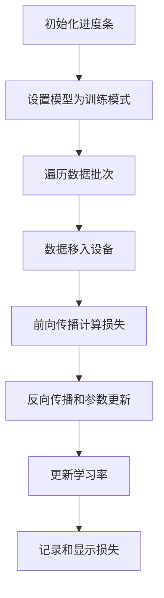

数据的输入输出模型构造
模型做某任务的原理
如何评估模型效果
换一个数据能否改代码

# 序列标注任务
### 加载数据集
1. dataset 将所有数据导入到环境里
        `tokenizer = AutoTokenizer.from_pretrained(模型名字)
        `encoding = tokenizer(sentence,truncation = ...) `
        `tokens = encoding.tokens`
        数据基于 token 序列位置对齐
        生成 bio 标签
        
        ``` python                                                                        输入: '海钓比赛地点在厦门与金门之间的海域。' 输出 tokens: ['[CLS]', '海', '钓', '比', '赛', '地', '点', '在', '厦', '门', '与', '金', '门', '之', '间', '的', '海', '域', '。', '[SEP]']
        ```
        
2. DateLoader 按批次加载数据，以备预训练
      DataLoader 共填 train_data, batch_size, shuffle, collate_ fn 四个参数
      `train_data`：必须是实现了 `__getitem__` 和 `__len__` 的数据集 
     **`collate_fn`**: 自己手动实现的对数据的编码。一定要返回 pytorch 向量
# 翻译任务
## 准备数据



random_split 是 pytorch 库的torch.utils.data 的函数

tokenizer 部分：
填入参数 padding = True 的价值


## 评估模型
ReLu

# 文本摘要

## 评估模型
ROUGE度量两个词语序列之间的词语重合率。ROUGE 值的召回率表示参考摘要在多大程度上被生成摘要覆盖