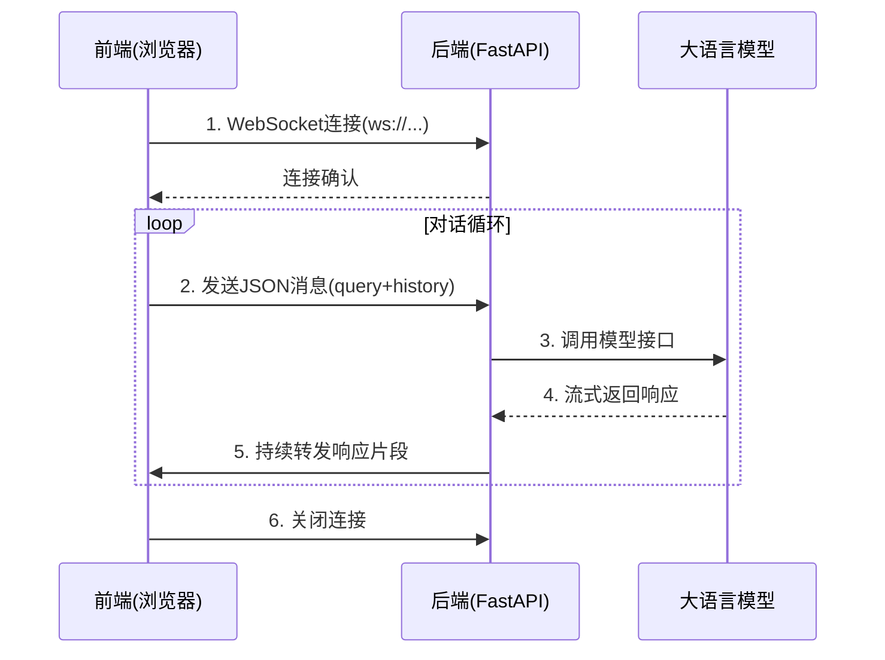

前后端连接的桥梁是这些关键语句
前端文件：const ws = new WebSocket("ws://localhost:8000/ws")   ws.send(JSON.stringify(request))

- const ws = new WebSocket("ws://localhost:8000/ws") 创建客户端，这个客户端含有websocket的特性，能持续地向服务器发送请求，
- ws.send(JSON.stringify(request))是完成”post“请求的代码，send就好比http里的post。
后端文件：json_request = await websocket.receive_json()    @app.websocket("/ws")  
- @app.websocket("/ws")定义了，收到websocket客户端请求体的json，应该如何处理
- json_request = await websocket.receive_json() 解析websocket发送的东西

# 压测
## 导入
- `sample_requests`：用于生成测试请求样本
- `get_tokenizer`：用于获取tokenizer来计算prompt长度
- `logging`：用于记录日志，方便调试和监控
## 全局变量定义
- `REQUEST_LATENCY`：存储每次请求的(prompt长度, 生成token数, 延迟时间)三元组，用于后续分析
- `API_KEY`和`API_URL`：API访问凭证和端点地址
- `MODEL_UID`：指定要测试的模型
- `HEADERS`：HTTP请求头，包含认证信息
## sendrequest函数
使用session.post向服务器传数据，主要完成completiontokens、request_latency（持续时间）

## 核心函数
### benchmark
- 初始化方法init，self，requests，concurrency（并发数）
- 主运行方法run，创建工作线程，填充任务队列，等待任务完成，全称都是async
- 定义woker: 获取prompt, prompt_len, completion_len，构造payload，发送请求
##  main函数
- 初始化配置： 数据集路径、tokenizer、请求总数、并发数
- 数据准备：借助util.py函数
- 压测执行：计算除benchmarktime（end-start）
- 结果分析与打印：关键的几个指标 
     - 总耗时
     - QPS，每秒处理的请求数
     - 平均耗时
     - token/s 吞吐率

# 其他细节
`device_map` 参数有几种预设选项，也可以自定义：

- **`auto`**：自动根据硬件资源分配模型参数，尽量平衡各个设备的负载。
    
- **`balanced`**：在所有 GPU 上平衡切分模型，功能较为稳定。
    
- **`balanced_low_0`**：在除第一个 GPU 外的其他 GPU 上平衡划分模型，第一个 GPU 占用较少资源，适合需要在第一个 GPU 上执行额外操作的场景

Qwen2.5 系列模型确实**没有 `.chat()` 方法**，这是与 ChatGLM 的一个重要区别。根据 Hugging Face 文档：

- Qwen2.5 使用标准的 `generate()` 方法配合 `apply_chat_template` 来处理对话
- 原 ChatGLM 的 `.chat()` 是一个封装方法，内部也是调用 `generate()`，但提供了更简单的接口 
    
    2
    
- Qwen2.5 必须通过 `apply_chat_template` 将对话历史转换为模型能理解的格式

所以修改后的 `generate_response()` 函数是 Qwen2.5 的标准用法。

- Qwen2.5 的 ChatML 格式要求系统消息作为独立部分
- 保持与 OpenAI API 的兼容性（system/user/assistant 角色分离）

loggin